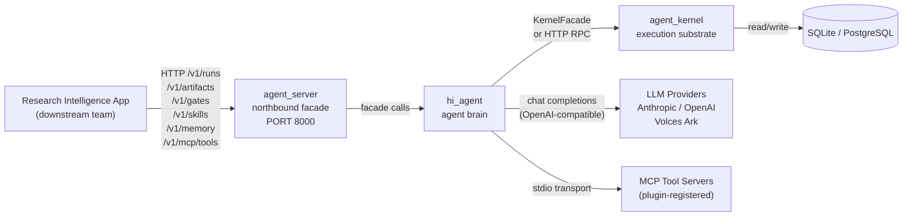
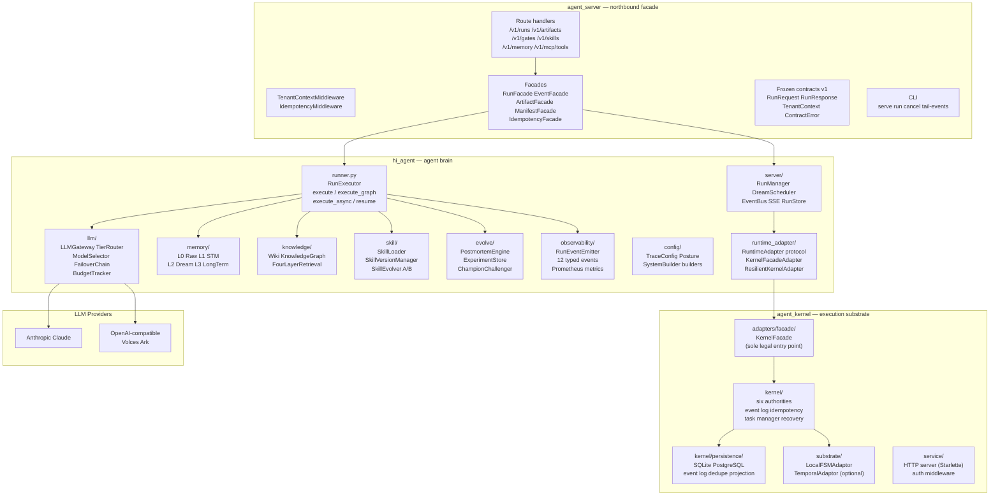
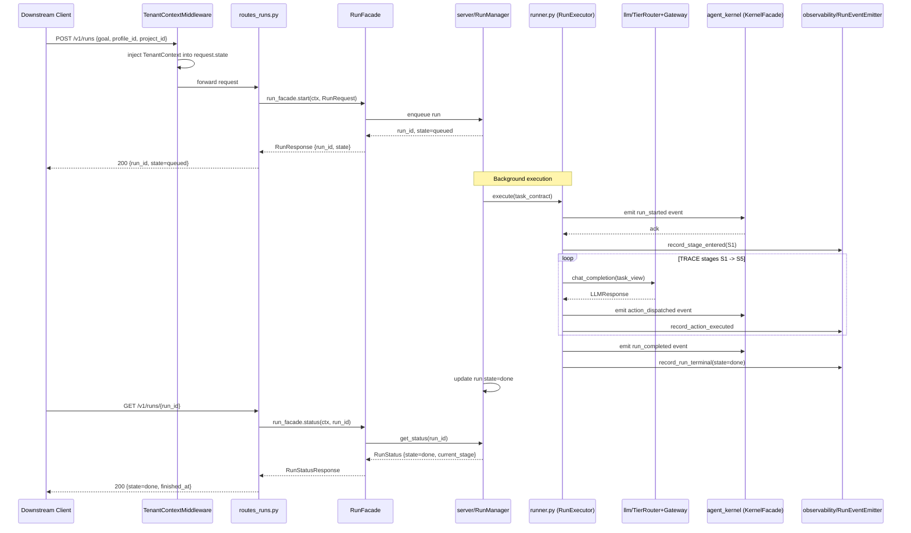
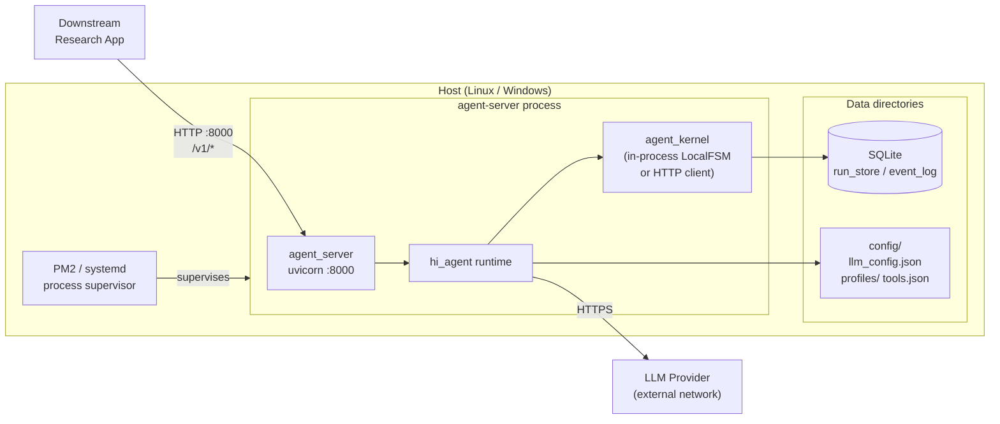

# Architecture: hi-agent Platform (arc42)

> **Document hierarchy**
> - L0 system boundary: this file
> - L1 hi-agent detail: `hi_agent/ARCHITECTURE.md`
> - L1 agent-server detail: `agent_server/ARCHITECTURE.md`
> - L1 agent-kernel detail: `agent_kernel/ARCHITECTURE.md`
> - Stable codebase facts: `docs/architecture-reference.md`

---

## 1. Introduction and Goals

hi-agent is a **platform-layer** agent execution system. It is not a business application.
Its purpose is to provide the research team's intelligence applications with a stable,
versioned, operationally observable API surface for running long-lived autonomous agents.

**Primary goals:**

1. Expose a frozen northbound HTTP contract (`agent_server/`, v1) that downstream teams can
   depend on across platform upgrades.
2. Execute TRACE (Task -> Route -> Act -> Capture -> Evolve) runs durably, with restart
   survival, cancellation, and per-run observability.
3. Enforce a hard platform/business boundary so research-team business logic never leaks
   into the platform kernel.
4. Provide posture-aware defaults (`dev` permissive, `research`/`prod` fail-closed) so the
   same codebase runs safely across local development, research, and production deployments.

**Quality requirements (binding):** See Section 10.

---

## 2. Constraints

| Constraint | Source |
|---|---|
| Python 3.12+ | `pyproject.toml` |
| FastAPI/Starlette for HTTP | `pyproject.toml` dependencies |
| No business logic in `hi_agent/` or `agent_kernel/` | CLAUDE.md G1 gate |
| `agent_server/` routes must not import from `hi_agent.*` directly | R-AS-1 rule |
| v1 contract is digest-frozen after release; breaking changes require `v2/` sub-package | CLAUDE.md AS-CO track |
| Every new route handler requires `# tdd-red-sha: <sha>` annotation | CLAUDE.md R-AS-5 |
| `asyncio.run(` outside entry points is forbidden; sync callers use `sync_bridge` | CLAUDE.md Rule 5 |
| Inline fallbacks of the shape `x or DefaultX()` are forbidden | CLAUDE.md Rule 6 |
| SQLite for default persistence; PostgreSQL optional via `asyncpg` | `pyproject.toml` optional deps |

---

## 3. System Context



**Downstream** uses only the `agent_server` HTTP API. Direct access to `hi_agent` or
`agent_kernel` endpoints is not a supported integration pattern.

---

## 4. Solution Strategy

| Decision | Rationale |
|---|---|
| Three-package structure in one repo | Clear ownership boundaries; `agent_kernel` inlined from external dep on 2026-04-19 for atomic versioning |
| Frozen v1 contract in `agent_server/contracts/` | Downstream teams must not be broken by internal refactors |
| Posture enum (`dev`/`research`/`prod`) read from env | Enables the same binary to run permissively in dev and fail-closed in production without code changes |
| Async-first core; sync bridge for sync-facing callers | Avoids cross-loop async resource lifetime bugs (Rule 5) |
| TierRouter with active calibration | Routes LLM calls to appropriate model tier based on quality signals; avoids expensive models for lightweight steps |
| Four-layer retrieval (grep -> BM25 -> graph -> embedding) | Cost-efficient retrieval without requiring embedding infrastructure for all queries |
| Rule 8 operator-shape gate before any delivery | Prevents "passes tests but fails in production" class of defects |

---

## 5. Building Block View



---

## 6. Runtime View

The following sequence shows the happy-path flow for `POST /v1/runs`.



**Cancellation contract:** `POST /v1/runs/{id}/cancel` on a known live run returns 200 and
drives the run to a terminal state. On an unknown run ID it returns 404 (not 200).

---

## 7. Deployment View



**Standard startup:**

```bash
# 1. Install
pip install -e ".[llm]"

# 2. Configure
export HI_AGENT_POSTURE=research
export HI_AGENT_LLM_MODE=real
export OPENAI_API_KEY=<key>

# 3. Serve (foreground)
agent-server serve --host 0.0.0.0 --port 8000

# 4. Serve under PM2 (production)
pm2 start "agent-server serve" --name hi-agent
```

**Runtime modes:**

| `HI_AGENT_ENV` | `HI_AGENT_LLM_MODE` | Mode | kernel | LLM fallback |
|---|---|---|---|---|
| `dev` (default) | `heuristic` | dev-smoke | in-process LocalFSM | allowed |
| `dev` | `real` | local-real | LocalFSM or HTTP | allowed |
| `prod` | `real` | prod-real | HTTP client (requires `HI_AGENT_KERNEL_BASE_URL`) | **disabled**, 503 |

**Readiness endpoints:**

| Endpoint | Purpose |
|---|---|
| `GET /ready` | 200 when ready for traffic, 503 otherwise |
| `GET /health` | Per-subsystem status |
| `GET /diagnostics` | Compact fingerprint of resolved env/config (always 200) |
| `GET /metrics` | Prometheus metrics |

---

## 8. Cross-Cutting Concepts

### Logging

All log output uses Python `logging` with structured fields. Every fallback branch emits at
`WARNING` or higher with `run_id` and trigger reason (Rule 7). Silent `except: pass` blocks
are forbidden; every catch either re-raises, logs at `WARNING+`, or converts to a typed
failure.

### Error Handling

The northbound API uses typed `ContractError` exceptions that map to HTTP status codes.
Internal failures surface through `FailureCode` (11 codes, re-exported from
`agent_kernel.kernel`). Every silent-degradation path must be Countable (Prometheus counter),
Attributable (`WARNING+` log), Inspectable (`fallback_events` in run metadata), and
Gate-asserted (Rule 8 ship gate).

### Posture

`HI_AGENT_POSTURE={dev,research,prod}` (default `dev`) is read by `hi_agent/config/posture.py
::Posture.from_env()` at every enforcement call site. `dev` is permissive; `research` and
`prod` are fail-closed: `project_id` required on every run, persistence must be durable,
schema validation raises on error.

### Security

- Tenant isolation is enforced by `TenantContextMiddleware` in `agent_server`; route handlers
  read `request.state.tenant_context` and never the request body for identity.
- RBAC and JWT validation live in `hi_agent/auth/`.
- Workspace isolation uses a `(tenant_id, user_id, session_id)` three-dimensional key; path
  traversal is blocked in `hi_agent/server/workspace_path.py`.
- `shell=True` subprocess calls are forbidden (Rule 3 security boundary check).

### Async/Sync Boundary

The codebase is async-first. Sync-facing callers route through
`hi_agent.runtime.sync_bridge` (persistent loop on a dedicated thread, marshalled via
`asyncio.run_coroutine_threadsafe`). Direct `asyncio.run(` outside entry points (`__main__`,
CLI, test) is a rule violation enforced by `scripts/check_rules.py`.

### Idempotency

`agent_server` middleware deduplicates requests by `idempotency_key`. The underlying store is
`agent_server/facade/idempotency_facade.py` backed by `hi_agent/server/idempotency.py`.

---

## 9. Architecture Decisions

| Decision | Wave | Rationale |
|---|---|---|
| Inline `agent_kernel` into the repo | W5 (2026-04-19) | Atomic versioning; eliminates git-submodule coordination overhead |
| Introduce `agent_server` as a separate northbound package | W11 | Hard platform/business boundary; frozen v1 contract independent of internal refactors |
| Freeze v1 contract with digest check | W24 | Downstream must not be broken by platform upgrades; breaking changes require `v2/` sub-package |
| Three-posture system (`dev`/`research`/`prod`) | W9 | Single binary deployable safely in all environments; Rule 11 |
| TierRouter with active calibration signals | W27 | Dynamic routing adapts to quality feedback without manual tuning (P-6 closed) |
| `RunEventEmitter` with 12 typed event methods | W27 | Structured observability spine for runs; replaces ad-hoc log scraping |
| Reject Neo4j in favour of SQLite-backed KG | W10 | JSON-backed L3 covers all graph operations at current scale; Neo4j adds service dependency |
| Rule 8 operator-shape gate mandatory before delivery | W12 | Prevents green-pytest-but-broken-in-prod class of failures |

---

## 10. Quality Requirements

| Quality attribute | Target | Enforcement |
|---|---|---|
| Test pass rate | 9,091+ offline tests, 0 failures | `default-offline` CI profile; `scripts/verify_clean_env.py` |
| Verified readiness | 94.55 (Wave 27) | Release manifest + `scripts/build_release_manifest.py` |
| 7x24 operational readiness | 65.0 (W27); target 85+ after W28 soak | Rule 8 gate evidence in `docs/delivery/` |
| T3 invariance | Gate valid only at recorded SHA; hot-path commits invalidate until re-run | `scripts/check_manifest_freshness.py` |
| LLM fallback count | 0 for all T3 runs | Rule 8 step 3; `llm_fallback_count == 0` asserted |
| Cancellation round-trip | known-id: 200+terminal; unknown-id: 404 | Rule 8 step 6; `tests/integration/` |
| `current_stage` visibility | non-`None` within 30s on non-terminal run | Rule 8 step 5 |
| Lint | ruff exits 0; no `# noqa` without `expiry_wave` annotation | `scripts/check_rules.py`; CI |
| Contract spine | every persistent record carries `tenant_id` | `scripts/check_contract_spine_completeness.py` |
| Posture coverage | 100% (all validation sites posture-aware) | posture coverage gate; W27 Lane 5 |

---

## 11. Risks and Technical Debt

| Item | Risk | Status | W28 Target |
|---|---|---|---|
| 24h soak missing | 7x24 capped at 65.0 | DEFERRED by user decision 2026-05-01 | Run soak; target 7x24 >= 85 |
| Observability spine provenance | `structural` evidence only, not `real` | DEFERRED | Real run with provenance=real |
| Chaos runtime coupling | 2 scenarios not runtime-coupled | DEFERRED | Couple remaining 2 SKIP scenarios |
| Score ceiling at 94.55 | Bounded by capability matrix weights, not gate failures | Information only | W28+ with dimension lifts |
| `HI_AGENT_KERNEL_BASE_URL` required in prod | Missing env var causes silent LocalFSM fallback | Documented; `/doctor` warns | No change planned |

---

## 12. Glossary

| Term | Definition |
|---|---|
| TRACE | Task -> Route -> Act -> Capture -> Evolve; the five-phase run execution model |
| Run | A single durable execution entity, identified by `run_id`; survives process restart |
| Stage | A named phase within a run's TRACE lifecycle (S1 through S5) |
| StageDirective | A runtime instruction that modifies stage execution: `skip_to`, `insert_stage`, `replan` |
| Task | A formal contract (13 fields) capturing goal, constraints, and budget for a run |
| Task View | The minimal sufficient context rebuilt before each LLM call; avoids full context window usage |
| Branch | A logical trajectory within the exploration space; used in DAG execution mode |
| TierRouter | Routes LLM calls to `strong`/`medium`/`light` model tiers based on active calibration signals |
| FailoverChain | Ordered sequence of LLM providers; falls back on error, emits `hi_agent_llm_fallback_total` counter |
| Memory | Three-tier agent experience store: L0 Raw -> L1 STM -> L2 Dream -> L3 LongTerm graph |
| Knowledge | Stable facts: wiki + knowledge graph + four-layer retrieval (grep -> BM25 -> graph -> embedding) |
| Skill | A reusable process unit with a 5-stage lifecycle and A/B version management |
| Posture | Execution safety level: `dev` (permissive) / `research` (fail-closed) / `prod` (strictest) |
| TenantContext | Authenticated identity context injected by middleware; carries `tenant_id`, `user_id`, `project_id` |
| KernelFacade | The sole legal entry point into `agent_kernel`; enforces the platform contract |
| GatePendingError | Exception raised when a run reaches a human-gate checkpoint and must wait for a `/v1/gates/{id}/decide` call |
| RunEventEmitter | Structured observability component with 12 typed `record_*` methods for run lifecycle events |
| Operator-shape gate | Rule 8 requirement: the artifact must pass a full PM2/real-LLM/N>=3 run validation before delivery |
| Docs-only gap | Every commit between manifest HEAD and current HEAD modifies only `docs/**` (excluding governance configs) |
| T3 invariance | A gate pass is valid only at the SHA it was recorded; hot-path commits invalidate it |
