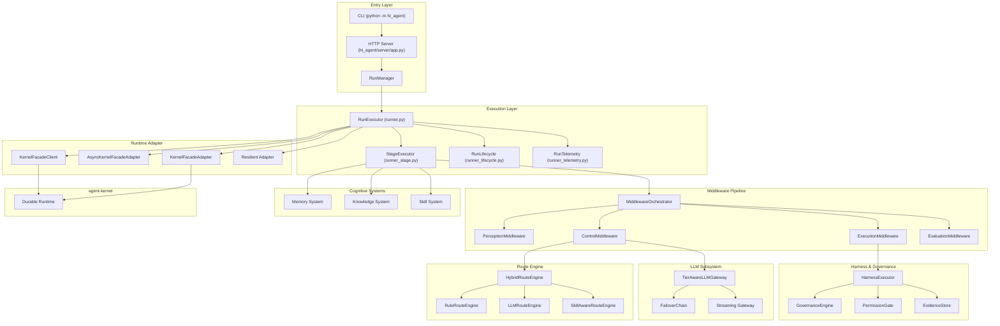

# ARCHITECTURE: hi-agent

This document describes the current `hi-agent` implementation as of this refresh.

## 1. System Boundary

`hi-agent` is the agent brain and orchestration layer.

- `hi-agent`: planning, routing, execution orchestration, memory, knowledge, skill evolution
- `agent-kernel`: durable run/runtime substrate (run lifecycle, state/event persistence semantics)
- `agent-core`: reusable capability/tool ecosystem (integrated by hi-agent)

## 2. Layered Architecture



## 3. TRACE Execution Flow

1. Client submits task (`POST /runs` or CLI `run`).
2. `RunManager` creates run and schedules execution.
3. `RunExecutor` drives TRACE stages via `StageExecutor`.
4. Middleware pipeline processes stage context:
   - perception
   - control/plan
   - execution
   - evaluation
5. Route engine picks branch/action strategy.
6. Harness executes allowed actions with governance checks.
7. Results/evidence are captured and written to memory/knowledge.
8. Lifecycle hooks handle post-run evolution and telemetry.

## 4. Key Subsystems

### 4.1 Middleware

- Ordered pipeline with hook support.
- Central place for stage-level transformations and policy checks.

### 4.2 Route Engine

- Rule-based + LLM-based + skill-aware routing combined by hybrid engine.
- Designed to support auditability and controlled fallback.

### 4.3 Memory

- Multi-tier memory with compression and retrieval.
- Supports short-term context and longer-term consolidation.

### 4.4 Knowledge

- Knowledge ingestion + querying endpoints.
- Wiki/graph/retrieval components for reusable knowledge access.

### 4.5 Skills and Evolution

- Skill registry/loader/matcher/evolver.
- Postmortem and regression loops support continuous improvement.

### 4.6 Runtime Adapter

- Abstraction over kernel runtime operations.
- Sync/async/client/resilient implementations available.

## 5. Public Interfaces

### 5.1 CLI

- `serve`
- `run`
- `status`
- `health`
- `readiness`
- `tools`
- `resume`

### 5.2 HTTP API (selected)

- Runs: `/runs`, `/runs/{id}`, `/runs/{id}/signal`, `/runs/{id}/resume`, `/runs/{id}/events`
- Health and platform: `/health`, `/ready`, `/manifest`, `/metrics`, `/metrics/json`, `/cost`
- Knowledge: `/knowledge/ingest`, `/knowledge/ingest-structured`, `/knowledge/query`, `/knowledge/status`
- Memory: `/memory/dream`, `/memory/consolidate`, `/memory/status`
- Skills: `/skills/list`, `/skills/status`, `/skills/evolve`, `/skills/{id}/metrics`, `/skills/{id}/versions`
- Tooling and MCP: `/tools`, `/tools/call`, `/mcp/status`, `/mcp/tools/list`, `/mcp/tools/call`

## 6. Build and Verification

```bash
python -m ruff check hi_agent tests scripts examples
python -m pytest -q --maxfail=1
```

Verification snapshot at refresh time:

- ruff: pass
- pytest: `3059 passed, 5 skipped`
