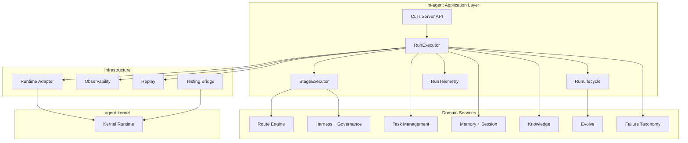
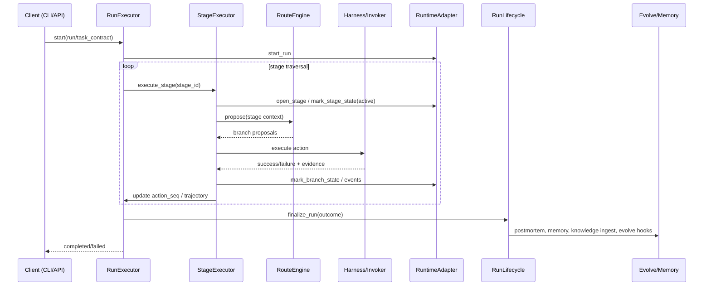

# ARCHITECTURE: hi-agent

本文档描述 `hi-agent` 当前代码实现（as-is），用于工程协作与运维对齐。

## 1. 系统边界

```text
hi-agent (agent brain / orchestration)
  ├─ agent-kernel (durable runtime substrate)
  └─ agent-core   (capability ecosystem)
```

- `hi-agent`：任务执行编排与智能决策核心。
- `agent-kernel`：run 生命周期、事件事实、幂等与恢复治理。
- `agent-core`：通用能力模块来源（工具、检索、MCP 等）。

## 2. 分层架构



## 3. 核心执行链路（TRACE）



## 4. 关键实现模块

### 4.1 执行与生命周期
- `hi_agent/runner.py`
  - 主执行入口：`execute` / `execute_graph` / `resume_from_checkpoint` / `execute_async`
  - 汇总调度、分支推进、故障记录、人类门禁触发
- `hi_agent/runner_stage.py`
  - 单 stage 的路由提案、分支执行、budget 检查与 dead-end 判断
- `hi_agent/runner_lifecycle.py`
  - run 收尾：postmortem、短期记忆、知识摄入、进化触发、episode 落盘
- `hi_agent/runner_telemetry.py`
  - 事件、技能执行与观测输出

### 4.2 任务管理与恢复
- `hi_agent/task_mgmt/`
  - `restart_policy.py`：重试决策与反思触发
  - `budget_guard.py`：预算分层决策
  - `reflection*.py`：失败历史构建与恢复推理上下文

### 4.3 路由与治理
- `hi_agent/route_engine/`
  - 规则路由、LLM 路由、混合路由与决策审计
- `hi_agent/harness/`
  - side-effect 分级、门禁决策、人类审批触发

### 4.4 记忆、知识与进化
- `hi_agent/memory/`：分层记忆、压缩、检索
- `hi_agent/knowledge/`：知识摄取、查询、图谱/索引
- `hi_agent/evolve/`：postmortem 分析、技能候选、回归检测
- `hi_agent/skill/`：技能定义、版本管理、观测与演进执行

### 4.5 运行时适配
- `hi_agent/runtime_adapter/`
  - 统一协议适配到 `agent-kernel`（本地 facade / HTTP client）
  - 包含容错、重试与健康探测

### 4.6 测试桥接
- `hi_agent/testing/`
  - re-export `agent_kernel.testing` 常用内存测试组件：
    - `InMemoryKernelRuntimeEventLog`
    - `InMemoryDedupeStore`
    - `StaticRecoveryGateService`

## 5. 可靠性与可观测性设计

- 失败体系：`failures/taxonomy.py` 对齐 `TraceFailureCode`，并兼容 legacy `budget_exhausted`。
- 人类门禁：支持 contract correction / route direction / artifact review / final approval。
- 重试与退避：`TaskRestartPolicy` 使用上游 `max_backoff_ms`。
- best-effort 路径：关键后处理改为记录日志而非静默吞异常，避免“假成功”。
- 事件与审计：运行事件、路由决策与技能执行结果可追踪。

## 6. 配置与运行模式

- CLI 本地模式：`python -m hi_agent run --local ...`
- API 模式：`python -m hi_agent serve` + `run/status/health/resume`
- 图执行模式：`execute_graph` 按 stage graph 动态推进
- checkpoint 恢复：`resume_from_checkpoint`

## 7. 已知工程边界

- CLI 对 localhost 代理绕行（P0）当前未在本仓库修复，依赖运行环境代理配置。
- `TaskAttemptRecord` 仍保留兼容入口（带弃用提示），建议新代码仅使用 `TaskAttempt`。
- `agent-kernel` 仍为 git 引用（已固定 commit），未来建议切换可发布制品（wheel/index）。

## 8. 质量门禁

```bash
python -m ruff check .
python -m pytest -q
```

当前文档对应的代码形态已通过全量测试回归。
