# ARCHITECTURE: hi-agent

## Refresh Notes (2026-04-18)

- Preserved original architecture content and section ordering.
- Updated quality-gate verification snapshot to `3430 passed, 0 failures`.
- Updated lint command to `python -m ruff check hi_agent tests scripts examples`.
- Added W1–W12 sprint deliverables: §13 ExecutionProvenance, §14 Evolve Tri-State Policy, §15 RBAC/SOC Auth, §16 SystemBuilder Sub-Builder Split, §17 StageOrchestrator Extraction, §18 Capability Governance, §19 Audit & Observability, §20 MCP Schema Drift & Restart Backoff, §21 ProfileDirectoryManager & Config Stack, §22 Release Gate & Runbooks.

本文档描述 `hi-agent` 当前代码实现（as-is），涵盖分层架构视图、接口关系、使用关系、时序图与数据流图。  
所有图表均基于代码实际实现，与工程实现严格对齐。

---

## 1. 系统边界

```text
hi-agent (agent brain / orchestration)
  ├─ agent-kernel (durable runtime substrate)
  └─ agent-core   (capability ecosystem)
```

| 仓库 | 职责 |
|------|------|
| `hi-agent` | 智能体大脑：任务理解、路由决策、执行编排、记忆/知识/技能、持续进化 |
| `agent-kernel` | 持久化运行时：run 生命周期、事件事实、幂等与恢复治理 |
| `agent-core` | 通用能力模块：工具、检索、MCP 等（agent-core 集成到 hi-agent） |

---

## 2. 分层架构视图（含全组件标注）

```mermaid
graph TB
  subgraph API["API & CLI Layer"]
    CLI["CLI<br/>hi_agent/__main__.py"]
    SRV["HTTP Server<br/>server/app.py"]
    RLM["RunManager<br/>server/run_manager.py"]
    EBUS["EventBus<br/>server/event_bus.py"]
    DSCH["DreamScheduler<br/>server/dream_scheduler.py"]
    RLIM["RateLimiter<br/>server/rate_limiter.py"]
  end

  subgraph EXEC["Execution Layer"]
    REXEC["RunExecutor<br/>runner.py"]
    STORCH["StageOrchestrator<br/>execution/stage_orchestrator.py"]
    STAGE["StageExecutor<br/>runner_stage.py"]
    LIFE["RunLifecycle<br/>runner_lifecycle.py"]
    TELE["RunTelemetry<br/>runner_telemetry.py"]
    PROV["ExecutionProvenance<br/>contracts/execution_provenance.py"]
    RMRES["RuntimeModeResolver<br/>server/runtime_mode_resolver.py"]
  end

  subgraph MW["Middleware Pipeline"]
    MWORCH["MiddlewareOrchestrator<br/>middleware/orchestrator.py"]
    PERC["PerceptionMiddleware<br/>middleware/perception.py"]
    CTRL["ControlMiddleware<br/>middleware/control.py"]
    EXMW["ExecutionMiddleware<br/>middleware/execution.py"]
    EVAL["EvaluationMiddleware<br/>middleware/evaluation.py"]
    HOOKS["HookSystem<br/>middleware/hooks.py"]
  end

  subgraph ROUTE["Route Engine"]
    HROUT["HybridRouteEngine<br/>route_engine/hybrid_engine.py"]
    RROUT["RuleRouteEngine<br/>route_engine/rule_engine.py"]
    LROUT["LLMRouteEngine<br/>route_engine/llm_engine.py"]
    SROUT["SkillAwareRouteEngine<br/>route_engine/skill_aware_engine.py"]
    DACIT["DecisionAuditStore<br/>route_engine/decision_audit.py"]
    ACCP["AcceptancePolicy<br/>route_engine/acceptance.py"]
  end

  subgraph HARN["Harness & Governance"]
    HEXEC["HarnessExecutor<br/>harness/executor.py"]
    GOV["GovernanceEngine<br/>harness/governance.py"]
    PERM["PermissionGate<br/>harness/permission_rules.py"]
    EVID["EvidenceStore<br/>harness/evidence_store.py"]
  end

  subgraph TASKMGMT["Task Management"]
    TSCH["TaskScheduler<br/>task_mgmt/scheduler.py"]
    ATSCH["AsyncTaskScheduler<br/>task_mgmt/async_scheduler.py"]
    THND["TaskHandle<br/>task_mgmt/handle.py"]
    BGRD["BudgetGuard<br/>task_mgmt/budget_guard.py"]
    RPOL["RestartPolicyEngine<br/>task_mgmt/restart_policy.py"]
    REFL["ReflectionOrchestrator<br/>task_mgmt/reflection.py"]
    TMON["TaskMonitor<br/>task_mgmt/monitor.py"]
    GFACT["GraphFactory<br/>task_mgmt/graph_factory.py"]
  end

  subgraph LLM["LLM Subsystem"]
    TIER["TierAwareLLMGateway<br/>llm/tier_router.py"]
    FAIL["FailoverChain<br/>llm/failover.py"]
    CACHE["PromptCacheInjector<br/>llm/cache.py"]
    STREAM["StreamingGateway<br/>llm/streaming.py"]
    HTTPLM["HttpLLMGateway<br/>llm/http_gateway.py"]
    ANTHLM["AnthropicGateway<br/>llm/anthropic_gateway.py"]
    MREG["ModelRegistry<br/>llm/registry.py"]
    BUDG["LLMBudgetTracker<br/>llm/budget_tracker.py"]
  end

  subgraph MEM["Memory Subsystem (3-Tier)"]
    L0["RawMemoryStore (L0)<br/>memory/l0_raw.py"]
    STM["ShortTermMemoryStore (L1)<br/>memory/short_term.py"]
    MTM["MidTermMemoryStore (L2)<br/>memory/mid_term.py"]
    LTM["LongTermMemoryGraph (L3)<br/>memory/long_term.py"]
    COMP["AsyncMemoryCompressor<br/>memory/async_compressor.py"]
    STRCOMP["StructuredCompressor<br/>memory/structured_compression.py"]
    MRET["UnifiedMemoryRetriever<br/>memory/unified_retriever.py"]
  end

  subgraph KNOW["Knowledge Subsystem"]
    KMGR["KnowledgeManager<br/>knowledge/knowledge_manager.py"]
    WIKI["KnowledgeWiki<br/>knowledge/wiki.py"]
    KGRAPH["KnowledgeGraph<br/>knowledge/store.py"]
    RETR["RetrievalEngine<br/>knowledge/retrieval_engine.py"]
    TFIDF["TF-IDF/BM25<br/>knowledge/tfidf.py"]
    EMBD["EmbeddingIndex<br/>knowledge/embedding.py"]
    GREND["GraphRenderer<br/>knowledge/graph_renderer.py"]
  end

  subgraph SKILL["Skill Subsystem"]
    SREG["SkillRegistry<br/>skill/registry.py"]
    SLDR["SkillLoader<br/>skill/loader.py"]
    SMATCH["SkillMatcher<br/>skill/matcher.py"]
    SEVO["SkillEvolver<br/>skill/evolver.py"]
    SVER["SkillVersionManager<br/>skill/version.py"]
    SOBS["SkillObserver<br/>skill/observer.py"]
    SREC["SkillUsageRecorder<br/>skill/recorder.py"]
  end

  subgraph EVO["Evolve Engine"]
    ENG["EvolveEngine<br/>evolve/engine.py"]
    POST["PostmortemAnalyzer<br/>evolve/postmortem.py"]
    SEXT["SkillExtractor<br/>evolve/skill_extractor.py"]
    REG["RegressionDetector<br/>evolve/regression_detector.py"]
    CC["ChampionChallenger<br/>evolve/champion_challenger.py"]
    DSET["DatasetEvaluator<br/>evolve/dataset_evaluator.py"]
  end

  subgraph CTX["Context OS"]
    CTXMGR["ContextManager<br/>context/manager.py"]
    RCTX["RunContext<br/>context/run_context.py"]
    RCTXMGR["RunContextManager<br/>context/run_context.py"]
    NUDGE["NudgeStrategy<br/>context/nudge.py"]
  end

  subgraph CAP["Capability System"]
    CREG["CapabilityRegistry<br/>capability/registry.py"]
    CINV["CapabilityInvoker<br/>capability/invoker.py"]
    ACINV["AsyncCapabilityInvoker<br/>capability/async_invoker.py"]
    CB["CircuitBreaker<br/>capability/circuit_breaker.py"]
  end

  subgraph TRAJ["Trajectory"]
    TRGPH["TrajectoryGraph<br/>trajectory/graph.py"]
    STGPH["StageGraph<br/>trajectory/stage_graph.py"]
    OPT["GreedyOptimizer<br/>trajectory/optimizers.py"]
    DEAD["DeadEndDetector<br/>trajectory/dead_end.py"]
  end

  subgraph OBS["Observability"]
    MET["MetricsCollector<br/>observability/collector.py"]
    NOTIF["NotificationService<br/>observability/notification.py"]
    TRAJEXP["TrajectoryExporter<br/>observability/trajectory_exporter.py"]
    EVEM["EventEmitter<br/>events/emitter.py"]
    EVST["EventStore<br/>events/store.py"]
  end

  subgraph SESS["Session"]
    RSESS["RunSession<br/>session/run_session.py"]
    COST["CostCalculator<br/>session/cost_tracker.py"]
  end

  subgraph ADP["Runtime Adapter"]
    KADP["KernelFacadeAdapter<br/>runtime_adapter/kernel_facade_adapter.py"]
    AKADP["AsyncKernelFacadeAdapter<br/>runtime_adapter/async_kernel_facade_adapter.py"]
    KCLI["KernelFacadeClient<br/>runtime_adapter/kernel_facade_client.py"]
    RESADP["ResilientAdapter<br/>runtime_adapter/resilient_adapter.py"]
    MOCK["MockKernel<br/>runtime_adapter/mock_kernel.py"]
  end

  subgraph KERNEL["agent-kernel"]
    KR["KernelRuntime<br/>TurnEngine / EventLog / IdempotencyStore"]
  end

  subgraph SEC["Security & Auth"]
    AUTH["AuthMiddleware<br/>auth/"]
    RBAC["RBAC<br/>auth/rbac_enforcer.py"]
    JWT["JWTService<br/>auth/jwt_middleware.py"]
    OPOL["OperationPolicy<br/>auth/operation_policy.py"]
    ACTX["AuthorizationContext<br/>auth/authorization_context.py"]
    SOC["SOCGuard<br/>auth/soc_guard.py"]
  end

  subgraph OPS["Ops & Observability"]
    AUDIT["AuditLog<br/>observability/audit.py"]
    RGATE["ReleaseGateReport<br/>ops/release_gate.py"]
    PROFMGR["ProfileDirectoryManager<br/>profile/manager.py"]
    CFGSTACK["ProfileAwareConfigStack<br/>config/stack.py"]
    TRACER["Tracer<br/>observability/tracing.py"]
    SCHMREG["MCPSchemaRegistry<br/>mcp/schema_registry.py"]
  end

  %% Top-down connections
  CLI --> RLM
  SRV --> RLM
  SRV --> EBUS
  SRV --> DSCH
  SRV --> AUTH
  RLM --> REXEC

  REXEC --> STORCH
  STORCH --> STAGE
  REXEC --> LIFE
  REXEC --> TELE
  REXEC --> RCTX
  REXEC --> RSESS
  REXEC --> MWORCH
  REXEC --> TSCH
  REXEC --> KADP
  REXEC --> PROV
  RMRES --> PROV
  REXEC --> AUDIT

  OPOL --> ACTX
  OPOL --> SOC
  OPOL --> AUDIT
  SRV --> OPOL

  PROFMGR --> CFGSTACK
  CFGSTACK --> RGATE

  STAGE --> HROUT
  STAGE --> HEXEC
  STAGE --> RETR
  STAGE --> SLDR

  MWORCH --> PERC
  MWORCH --> CTRL
  MWORCH --> EXMW
  MWORCH --> EVAL
  MWORCH --> HOOKS

  HROUT --> RROUT
  HROUT --> LROUT
  HROUT --> SROUT
  HROUT --> DACIT

  HEXEC --> GOV
  HEXEC --> PERM
  HEXEC --> CINV
  HEXEC --> EVID

  TSCH --> ATSCH
  TSCH --> BGRD
  TSCH --> RPOL
  TSCH --> REFL
  TSCH --> TMON
  TSCH --> GFACT

  TIER --> FAIL
  TIER --> CACHE
  TIER --> STREAM
  FAIL --> HTTPLM
  FAIL --> ANTHLM
  TIER --> MREG
  TIER --> BUDG

  L0 --> STM
  STM --> MTM
  MTM --> LTM
  COMP --> STM
  STRCOMP --> COMP
  MRET --> STM
  MRET --> MTM
  MRET --> LTM

  KMGR --> WIKI
  KMGR --> KGRAPH
  KMGR --> RETR
  RETR --> TFIDF
  RETR --> EMBD
  KMGR --> GREND

  SREG --> SLDR
  SREG --> SMATCH
  SREG --> SVER
  SLDR --> SOBS
  SEVO --> SREG
  SREC --> SOBS

  ENG --> POST
  ENG --> SEXT
  ENG --> REG
  ENG --> CC
  ENG --> DSET
  SEXT --> SREG

  RCTXMGR --> RCTX
  CTXMGR --> RCTX
  CTXMGR --> NUDGE

  CREG --> CINV
  CINV --> CB
  CINV --> ACINV

  TRGPH --> STGPH
  TRGPH --> OPT
  TRGPH --> DEAD

  EVEM --> EVST
  EVEM --> MET
  EVEM --> EBUS
  NOTIF --> EBUS
  TRAJEXP --> EVST

  LIFE --> ENG
  LIFE --> STM
  LIFE --> KMGR
  LIFE --> RSESS

  TELE --> EVEM
  TELE --> MET
  TELE --> SOBS

  KADP --> KR
  AKADP --> KADP
  RESADP --> KADP
  KCLI --> KR

  RSESS --> COST
```

---

## 3. 接口关系图（Protocol 与实现）

```mermaid
classDiagram
  class LLMGateway {
    <<Protocol>>
    +complete(request: LLMRequest) LLMResponse
    +supports_model(model: str) bool
  }
  class TierAwareLLMGateway {
    +complete(request) LLMResponse
    +acomplete(request) Coroutine[LLMResponse]
    +supports_model(model) bool
    -tier_router: TierRouter
    -budget_tracker: LLMBudgetTracker
  }
  class FailoverChain {
    +complete(request) LLMResponse
    -gateways: list[LLMGateway]
    -credential_pool: list[str]
  }
  class HttpLLMGateway {
    +complete(request) LLMResponse
    -base_url: str
    -api_key: str
  }
  class AnthropicGateway {
    +complete(request) LLMResponse
  }
  LLMGateway <|.. TierAwareLLMGateway
  LLMGateway <|.. FailoverChain
  LLMGateway <|.. HttpLLMGateway
  LLMGateway <|.. AnthropicGateway
  TierAwareLLMGateway --> FailoverChain : delegates
  FailoverChain --> HttpLLMGateway : rotates

  class RuntimeAdapter {
    <<Protocol>>
    +start_run(task_id) str
    +query_run(run_id) dict
    +cancel_run(run_id, reason) void
    +resume_run(run_id) void
    +signal_run(run_id, signal, payload) void
    +open_stage(stage_id) void
    +mark_stage_state(stage_id, state) void
    +open_branch(run_id, stage_id, branch_id) void
    +mark_branch_state(run_id, stage_id, branch_id, state) void
    +record_task_view(task_view_id, content) str
    +bind_task_view_to_decision(task_view_id, decision_ref) void
    +open_human_gate(request) void
    +submit_approval(request) void
    +resolve_escalation(run_id, resolution_notes, caused_by) void
    +stream_run_events(run_id) AsyncIterator
    +query_trace_runtime(run_id) dict
    +query_run_postmortem(run_id) Any
    +get_manifest() dict
    +spawn_child_run(parent_run_id, task_id, config) str
    +query_child_runs(parent_run_id) list
    +spawn_child_run_async(parent_run_id, task_id, config) str
    +query_child_runs_async(parent_run_id) list
  }
  class KernelFacadeAdapter {
    +start_run(task_id) str
    +open_stage(stage_id) void
    -kernel_facade: KernelFacade
  }
  class AsyncKernelFacadeAdapter {
    +start_run(task_id) str
    -sync_adapter: KernelFacadeAdapter
  }
  class ResilientAdapter {
    +start_run(task_id) str
    -retry_policy: RetryPolicy
    -circuit_breaker: CircuitBreaker
  }
  RuntimeAdapter <|.. KernelFacadeAdapter
  RuntimeAdapter <|.. AsyncKernelFacadeAdapter
  RuntimeAdapter <|.. ResilientAdapter
  AsyncKernelFacadeAdapter --> KernelFacadeAdapter : wraps
  ResilientAdapter --> KernelFacadeAdapter : wraps

  class Middleware {
    <<Protocol>>
    +process(message: MiddlewareMessage) MiddlewareMessage
    +on_create(config) void
    +on_destroy() void
  }
  class PerceptionMiddleware {
    +process(message) MiddlewareMessage
    -entity_extractor: EntityExtractor
  }
  class ControlMiddleware {
    +process(message) MiddlewareMessage
    -skill_matcher: SkillMatcher
    -route_engine: RouteEngine
  }
  class ExecutionMiddleware {
    +process(message) MiddlewareMessage
    -harness_executor: HarnessExecutor
  }
  class EvaluationMiddleware {
    +process(message) MiddlewareMessage
    -quality_threshold: float
  }
  Middleware <|.. PerceptionMiddleware
  Middleware <|.. ControlMiddleware
  Middleware <|.. ExecutionMiddleware
  Middleware <|.. EvaluationMiddleware

  class RouteEngine {
    <<Protocol>>
    +propose(stage_id, run_id, seq) list~BranchProposal~
  }
  class HybridRouteEngine {
    +propose(stage_id, run_id, seq) list~BranchProposal~
    -rule_engine: RuleRouteEngine
    -llm_engine: LLMRouteEngine
  }
  class RuleRouteEngine {
    +propose(stage_id, run_id, seq) list~BranchProposal~
  }
  class LLMRouteEngine {
    +propose(stage_id, run_id, seq) list~BranchProposal~
    -llm_gateway: LLMGateway
  }
  RouteEngine <|.. HybridRouteEngine
  RouteEngine <|.. RuleRouteEngine
  RouteEngine <|.. LLMRouteEngine
  HybridRouteEngine --> RuleRouteEngine : delegates
  HybridRouteEngine --> LLMRouteEngine : delegates

  class CapabilityInvoker {
    +invoke(name, payload) dict
    -registry: CapabilityRegistry
    -circuit_breaker: CircuitBreaker
  }
  class AsyncCapabilityInvoker {
    +async_invoke(name, payload) dict
    -invoker: CapabilityInvoker
    -timeout: float
  }
  CapabilityInvoker --> AsyncCapabilityInvoker : async variant
```

---

## 4. 使用关系图（模块依赖）

```mermaid
graph LR
  REXEC["RunExecutor"]
  STAGE["StageExecutor"]
  LIFE["RunLifecycle"]
  TELE["RunTelemetry"]
  MWORCH["MiddlewareOrchestrator"]
  HROUT["HybridRouteEngine"]
  HEXEC["HarnessExecutor"]
  TIER["TierAwareLLMGateway"]
  RETR["RetrievalEngine"]
  KMGR["KnowledgeManager"]
  SREG["SkillRegistry"]
  SLDR["SkillLoader"]
  STM["ShortTermMemory"]
  COMP["AsyncMemoryCompressor"]
  ENG["EvolveEngine"]
  KADP["KernelFacadeAdapter"]
  CINV["CapabilityInvoker"]
  MET["MetricsCollector"]
  EVEM["EventEmitter"]
  RSESS["RunSession"]
  RCTX["RunContext"]
  TSCH["TaskScheduler"]
  TRGPH["TrajectoryGraph"]

  REXEC -->|delegates stage| STAGE
  REXEC -->|delegates lifecycle| LIFE
  REXEC -->|delegates telemetry| TELE
  REXEC -->|uses| MWORCH
  REXEC -->|uses| TSCH
  REXEC -->|uses| KADP
  REXEC -->|uses| RSESS
  REXEC -->|uses| RCTX

  STAGE -->|gets proposals| HROUT
  STAGE -->|dispatches action| HEXEC
  STAGE -->|retrieves knowledge| RETR
  STAGE -->|injects skills| SLDR

  MWORCH -->|runs pipeline| HEXEC
  MWORCH -->|uses| HROUT
  MWORCH -->|uses| TIER

  HROUT -->|calls| TIER
  HEXEC -->|calls| CINV
  CINV -->|executes| CAP["Capability"]

  LIFE -->|triggers| ENG
  LIFE -->|stores| STM
  LIFE -->|ingests| KMGR

  TELE -->|emits| EVEM
  TELE -->|records| MET

  COMP -->|compresses to| STM
  RETR -->|queries| KMGR
  RETR -->|uses| TIER

  ENG -->|extracts skills| SREG
  ENG -->|updates| SREG

  TIER -->|routes to| LLM["LLM API"]
  KADP -->|calls| KERNEL["agent-kernel"]
```

---

## 5. 任务执行时序图（Sequence Diagram）

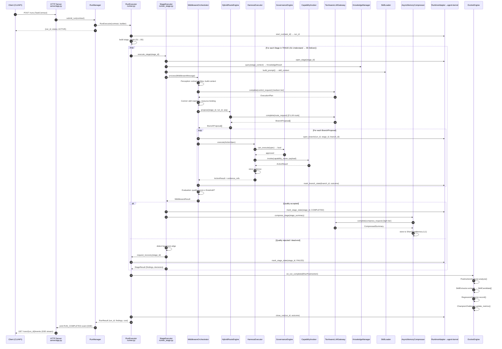

---

## 6. 数据流图（Data Flow Diagram）

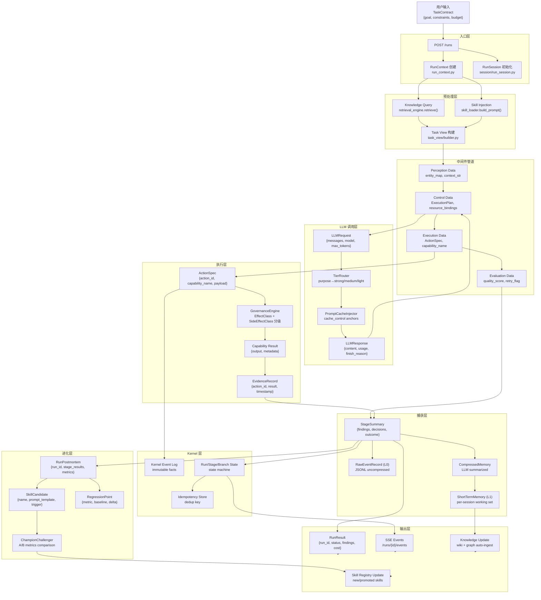

---

## 7. 记忆系统数据流（Memory Consolidation Flow）

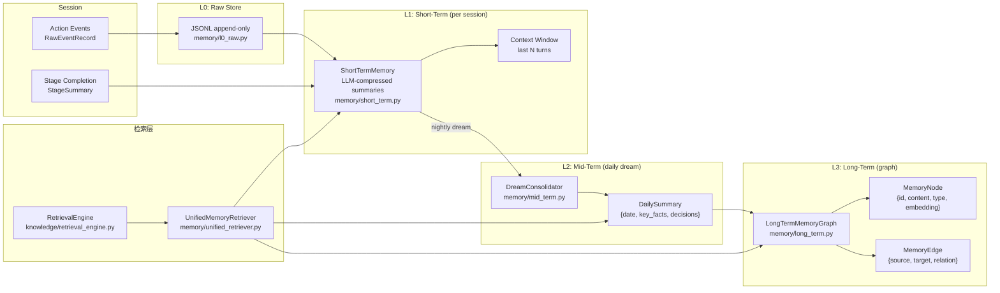

---

## 8. 进化引擎流程（Evolve Engine Flow）

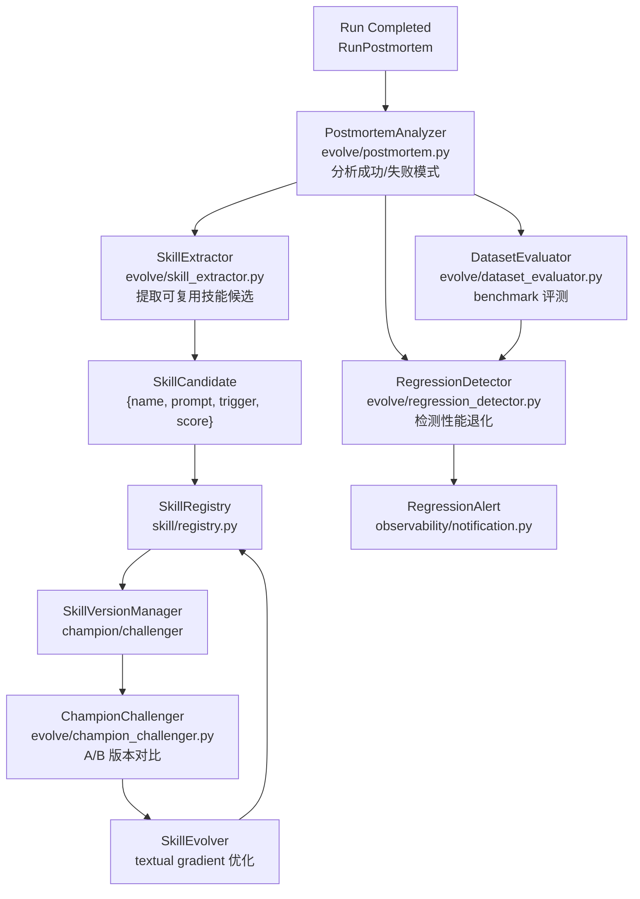

---

## 9. 关键模块接口说明

### 9.1 RunExecutor — 主执行入口

| 方法 | 签名 | 职责 |
|------|------|------|
| `execute` | `() → dict` | 线性 stage 遍历执行（TRACE S1→S5） |
| `execute_graph` | `(stage_graph: TrajectoryGraph) → dict` | 动态图遍历含回溯与多后继路由 |
| `execute_async` | `() → Coroutine[dict]` | asyncio 全异步模式（AsyncTaskScheduler） |
| `resume_from_checkpoint` | `(checkpoint: dict) → dict` | 从 checkpoint 恢复运行 |

### 9.2 LLMGateway Protocol

| 方法 | 签名 | 职责 |
|------|------|------|
| `complete` | `(request: LLMRequest) → LLMResponse` | 同步模型调用 |
| `stream` | `(request: LLMRequest) → Iterator[LLMStreamChunk]` | SSE 流式调用（httpx chunked transfer） |
| `supports_model` | `(model: str) → bool` | 检查模型兼容性（`AnthropicGateway` 始终返回 True，支持代理端点） |

**LLMRequest 扩展字段**：
- `messages: list[dict[str, Any]]` — content 支持字符串或 content block 列表（multimodal）
- `thinking_budget: int | None` — per-request 思考预算，覆盖 gateway 级默认值；`> 0` 开启，`0` 强制关闭

**LLMStreamChunk**（`llm/protocol.py`）：
```
delta: str              # 本次文字增量
thinking_delta: str     # 思考过程增量（Anthropic extended thinking）
finish_reason: str|None # 最终块携带停止原因
usage: TokenUsage|None  # 最终块携带 token 用量
model: str              # message_start 块携带模型 ID
```

**实现链路**：`TierAwareLLMGateway` → `FailoverChain` → `AnthropicLLMGateway`（Anthropic API / 兼容代理）或 `HttpLLMGateway`（OpenAI API）

- `TierAwareLLMGateway` 同时提供同步 `complete()`、异步 `acomplete()`、流式 `stream()`；无流式能力的后端自动降级为单 chunk 包装。
- `AnthropicLLMGateway` 支持自定义 `base_url`，可接入 DashScope 等 Anthropic 协议兼容代理；`default_thinking_budget` 配置 gateway 级思考预算。
- 思考模式开启时自动强制 `temperature=1`（Anthropic API 要求）。

**provider 配置（`config/llm_config.json`）**：
```json
{
  "default_provider": "dashscope",
  "providers": {
    "dashscope": {
      "api_key": "sk-...",
      "base_url": "https://...",
      "api_format": "anthropic",
      "models": {"strong": "...", "medium": "...", "light": "..."},
      "features": {"stream": true, "thinking_budget": null, "multimodal": false}
    }
  }
}
```
`build_gateway_from_config()` 读取此文件，按 `api_format` 选择 `AnthropicLLMGateway` 或 `HttpLLMGateway`，注入 `thinking_budget`，并包装进 `TierAwareLLMGateway` 返回。`SystemBuilder.build_llm_gateway()` 在 env var 未命中时自动回落到此配置文件。

### 9.3 RuntimeAdapter Protocol（22 方法）

| 方法组 | 方法 | 职责 |
|--------|------|------|
| Run 生命周期 | `start_run`, `query_run`, `cancel_run`, `resume_run`, `signal_run` | run 全生命周期管理 |
| Stage | `open_stage`, `mark_stage_state` | stage 状态推进 |
| Branch | `open_branch`, `mark_branch_state` | branch 状态管理 |
| Task View | `record_task_view`, `bind_task_view_to_decision` | 任务视图持久化与决策绑定 |
| Human Gate | `open_human_gate`, `submit_approval`, `resolve_escalation` | 人类审批 + escalation 恢复 |
| Events / Trace | `stream_run_events`, `query_trace_runtime` | 事件流与 trace 快照 |
| Diagnostics | `query_run_postmortem`, `get_manifest` | 事后分析与能力清单 |
| Child Runs | `spawn_child_run`, `query_child_runs`, `spawn_child_run_async`, `query_child_runs_async` | 子 run 管理（同步 + 异步） |

`resolve_escalation(run_id, *, resolution_notes, caused_by)` — 当 run 因 `human_escalation` 恢复决策进入 `waiting_external` 状态时，通过此方法发送 `recovery_succeeded` 信号令工作流继续执行。对应 agent-kernel `POST /runs/{id}/resolve-escalation`。

**KernelFacadeClient**（`runtime_adapter/kernel_facade_client.py`）：concrete dual-mode 实现，同时支持 `direct`（in-process KernelFacade）和 `http`（REST over KernelFacade HTTP）两种模式。全部 22 个协议方法均实现 direct/http 双分支；`resolve_escalation` 因 keyword-only 参数直接调用 facade，绕过通用 `_direct_call()` 辅助方法。

### 9.4 Middleware Protocol

| 生命周期 | 方法 | 职责 |
|---------|------|------|
| 创建 | `on_create(config)` | 中间件初始化 |
| 处理 | `process(message: MiddlewareMessage) → MiddlewareMessage` | 核心管道处理 |
| 销毁 | `on_destroy()` | 资源清理 |

**HookAction**: `CONTINUE` / `MODIFY` / `SKIP` / `BLOCK` / `RETRY`

**线程安全**：`MiddlewareOrchestrator` 的所有结构变更方法（`add/replace/remove_middleware`、`add/remove_hook`、`add_global_hook`）均在 `threading.Lock` 保护下执行。`run()` 入口持锁创建管道快照（`_mw_snapshot`），整个 pipeline 遍历使用快照，消除并发 run 与结构修改之间的竞态条件。

### 9.5 Server API 端点

| 路径 | 方法 | 职责 |
|------|------|------|
| `/runs` | `POST` | 提交任务，返回 run_id |
| `/runs` | `GET` | 列出活跃 run |
| `/runs/{id}` | `GET` | 查询 run 状态 |
| `/runs/{id}/signal` | `POST` | 发送信号（pause/resume/cancel） |
| `/runs/{id}/resume` | `POST` | 从 checkpoint 恢复 |
| `/runs/{id}/events` | `GET` | SSE 事件流 |
| `/knowledge/ingest` | `POST` | 文本摄取到 wiki |
| `/knowledge/ingest-structured` | `POST` | 结构化事实摄取到图谱 |
| `/knowledge/query` | `GET` | 知识查询 |
| `/knowledge/status` | `GET` | 知识库状态 |
| `/knowledge/lint` | `POST` | 知识健康检查 |
| `/memory/dream` | `POST` | 触发 dream 整合（mid-term） |
| `/memory/consolidate` | `POST` | 触发长期图整合 |
| `/memory/status` | `GET` | 记忆系统状态 |
| `/skills/list` | `GET` | 技能列表 |
| `/skills/evolve` | `POST` | 触发 champion/challenger 轮次 |
| `/skills/{id}/optimize` | `POST` | 优化技能 prompt |
| `/skills/{id}/promote` | `POST` | challenger → champion |
| `/context/health` | `GET` | 上下文预算健康 |
| `/health` | `GET` | 全系统健康 |
| `/ready` | `GET` | 平台就绪检查（200=ready，503=not ready，返回 capabilities 列表） |
| `/manifest` | `GET` | 系统能力清单（`contract_field_status`、MCP 状态、e2e 端点目录） |
| `/tools` | `GET` | 注册的能力列表 |
| `/tools/call` | `POST` | 按名称调用能力 |
| `/mcp/tools/list` | `POST` | MCP 工具枚举（含 JSON Schema） |
| `/mcp/tools/call` | `POST` | MCP 工具调用 |
| `/metrics` | `GET` | Prometheus 指标 |
| `/metrics/json` | `GET` | JSON 指标快照 |

### 9.6 Public API Surface

Top-level symbols exported from `hi_agent` for external callers:

| Symbol | Description |
|--------|-------------|
| `hi_agent.RunExecutorFacade` | `start(run_id, profile_id, model_tier, skill_dir)` / `run(prompt) → RunFacadeResult` / `stop()` |
| `hi_agent.check_readiness()` | Returns `ReadinessReport` — per-subsystem health check |
| `hi_agent.GateEvent` | Human gate lifecycle event dataclass |
| `hi_agent.GatePendingError` | Raised when stage execution hits a pending gate |
| `hi_agent.SubRunHandle` / `SubRunResult` | Nested sub-run dispatch / collection |
| `hi_agent.llm.tier_presets.apply_research_defaults(router)` | Research tier preset — configures TierRouter with research-optimized defaults |

---

## 10. 配置与组件装配（SystemBuilder）

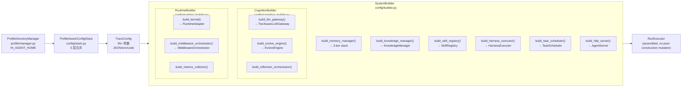

**TraceConfig 核心参数**：

| 类别 | 参数示例 |
|------|---------|
| Kernel | `kernel_base_url` ("local" / HTTP URL) |
| LLM | `llm_api_key`, `llm_default_model`, `llm_budget_max_calls` |
| 缓存 | `prompt_cache_enabled`, `prompt_cache_anchor_messages` |
| 记忆 | `memory_tier_enabled`, `memory_consolidation_interval_seconds`, `memory_compress_max_findings`, `memory_compress_max_decisions`, `memory_compress_max_entities`, `memory_compress_max_tokens` |
| 知识 | `knowledge_storage_dir` |
| 技能 | `skill_registry_dir`, `skill_evolution_enabled` |
| 上下文预算 | `context_skill_prompts_budget`（默认 2000），`context_knowledge_context_budget`，`context_system_prompt_budget` |
| AutoCompress | `compress_snip_threshold`, `compress_window_threshold`, `compress_compress_threshold`, `compress_default_budget_tokens` |
| 中间件 | `middleware_enabled`, `gate_quality_threshold` |
| 服务器 | `server_host`, `server_port`, `server_workers` |

---

## 11. 失败处理与恢复机制

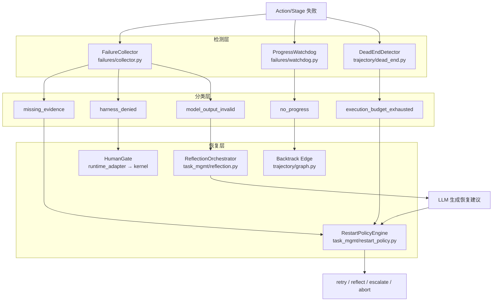

---

## 12. 已知工程边界

- `agent-kernel` 通过固定 commit 引用（git submodule），未来建议切换可发布制品（wheel/index）。
- `TaskAttemptRecord` 保留兼容入口（带弃用提示），新代码仅使用 `TaskAttempt`。
- Windows 环境代理绕行依赖运行环境配置（P0）。
- MCP 传输层（`mcp/transport.py`）当前 `transport_status = not_wired`：MCPServer 包裹能力注册表可正常枚举工具，但外部 JSON-RPC/SSE 传输尚未接入，`/manifest` 中 `capability_mode = infrastructure_only` 明确标注。

**2026-04-14 自审修复归档（全部已关闭）：**

| 缺口 | 修复内容 |
|------|---------|
| SSE 推流断路 | `RunExecutor._record_event()` 现直接调用 `event_bus.publish()`，将运行事件实时推入 SSE 流。 |
| KernelFacadeClient HTTP 模式不完整 | `query_run_postmortem`、`query_child_runs` 补全 HTTP 分支；新增 `spawn_child_run` 完整实现。 |
| HybridRouteEngine 审计空转 | `propose_with_provenance()` 两个返回路径均调用 `persist_route_decision_audit()`，决策写入 `DecisionAuditStore`。 |
| 异步路径绕过 tier 路由 | `TierAwareLLMGateway` 新增 `acomplete()`；`DelegationManager` 异步路径经由该方法统一 tier 选择。 |
| SkillEvolver 空指针 | `analyze_skill / optimize_prompt / deploy_optimization / discover_patterns / evolve_cycle` 全部加 `_observer` / `_version_manager` 空值守卫。 |
| RestartPolicyEngine 状态写入空操作 | `update_state` lambda 现写入 `_state_store` 字典，状态持久有效。 |

## 12.1 TaskContract 字段消费边界

`POST /runs` 接受 13 个 TaskContract 字段，消费级别如下（`/manifest` 的 `contract_field_status` 节动态返回）：

| 字段 | 消费级别 | 说明 |
|------|---------|------|
| `goal` | **ACTIVE** | 驱动 TaskView 构建与 LLM prompt |
| `task_family` | **ACTIVE** | 选择路由配置 |
| `risk_level` | **ACTIVE** | Harness 治理决策 |
| `constraints` | **ACTIVE** | 解析 `fail_action:*`、`action_max_retries:*`、`invoker_role:*` 前缀 |
| `acceptance_criteria` | **ACTIVE** | run 完成后检查 `required_stage:*`、`required_artifact:*` 是否满足 |
| `budget` | **ACTIVE** | BudgetGuard tier 降级与 deadline 执行 |
| `deadline` | **ACTIVE** | wall-clock deadline 检查（过期立即失败） |
| `profile_id` | **ACTIVE** | SystemBuilder profile 解析 |
| `decomposition_strategy` | **ACTIVE** | TaskOrchestrator 分解模式 |
| `priority` | **QUEUE_ONLY** | RunManager 队列排序，不进入 stage 执行 |
| `environment_scope` | **PASSTHROUGH** | 存储并回传，执行层不消费 |
| `input_refs` | **PASSTHROUGH** | 存储并回传，执行层不消费 |
| `parent_task_id` | **PASSTHROUGH** | 存储并回传，执行层不消费 |

PASSTHROUGH 字段的消费由调用层（business agent / profile）负责。

## 12.2 2026-04-15 自审修复归档（全部已关闭）

| 缺口 | 修复内容 |
|------|---------|
| WikiStore 单页损坏崩溃 | `wiki.py` `load()` 对每个 `.json` 文件单独 try-except `(json.JSONDecodeError, KeyError, ValueError)`，跳过损坏页并记录 warning，整体加载不中断。 |
| `ContextBudget.skill_prompts` 映射错误配置字段 | `context/manager.py` `from_config()` 将 `skill_prompts` 从 `cfg.compress_default_budget_tokens`（task-view 自动压缩预算 8192）修正为专用字段 `cfg.context_skill_prompts_budget`（默认 2000）。 |
| `context_skill_prompts_budget` 字段缺失 | `trace_config.py` 新增 `context_skill_prompts_budget: int = 2_000`，与 `context_system_prompt_budget`、`context_tool_definitions_budget` 并列管理。 |

---

## 12.3 2026-04-15 agent-kernel 集成闭环（全部已关闭）

| 缺口 | 来源 | 修复内容 |
|------|------|---------|
| `AsyncExecutorService(handler=None)` 缺少 production guard | hi-agent 反馈 P0 | agent-kernel `_enforce_production_safety()` 新增 `enable_activity_backed_executor` 参数；`False` + `"prod"` 环境直接抛 `ValueError` |
| `resolve_escalation()` 调用方协议缺口 | hi-agent 反馈 P1 | agent-kernel 确认为 Public caller-facing API；hi-agent 在 `RuntimeAdapter`（protocol.py）、`KernelFacadeAdapter`、`KernelFacadeClient` 三处实现，direct/http 双路均完整 |
| `InMemoryTaskEventLog` 未纳入 production check | hi-agent 反馈 P2 | agent-kernel 改为 `warnings.warn`（非硬拒绝），标注暂无持久化后端；待持久化后端就绪后升为硬拒绝 |
| RuntimeAdapter 协议方法数文档失实 | 内部发现 | ARCHITECTURE.md Section 9.3 从 17 方法（含错误方法名）修正为 22 方法，逐方法组整理准确 |

---

## 12.4 2026-04-15 调用方审计 + agent-kernel 刷新（全部已关闭）

agent-kernel 升级至 `ff4d25c7`（含 2 个新提交）：

| 缺口 | 来源 | 修复内容 |
|------|------|---------|
| `stream_run_events` Temporal 模式静默空流（P1） | hi-agent 调用方审计 | agent-kernel `ae2acc7`：`_stream_run_events()` 从静默返回空 iterator 改为抛 `RuntimeError`（含 actionable message），消除 SSE / reconcile loop 静默数据丢失风险 |
| `KernelFacadeClient` direct 模式 `stream_run_events` 无异常守卫 | hi-agent 内部发现 | `runtime_adapter/kernel_facade_client.py`：`async for` 循环包裹 `try/except`，将底层 `RuntimeError` 统一转换为 `RuntimeAdapterBackendError`，与 `KernelFacadeAdapter` 行为一致 |
| `spawn_child_run_async` / `query_child_runs_async` 协议缺口 | hi-agent DelegationManager P0 | `KernelFacadeAdapter` 与 `KernelFacadeClient` 均新增两个 async wrapper（`asyncio.to_thread`）；`AsyncKernelFacadeAdapter` 补全 `resolve_escalation` async 委托与 `spawn_child_run` 同步委托 |
| agent-kernel submodule pin | 版本对齐 | `pyproject.toml` 固定 commit 从 `43fda27` 升至 `ff4d25c7` |

---

## 12.6 2026-04-18 W1–W12 sprint 归档（全部已合并到 main）

| Sprint | 票号 | 内容 |
|--------|------|------|
| W1 | D1-001 | 运行时基线冻结文档 |
| W1 | D2-001 | evolve_mode 三态策略（auto/on/off）+ audit.evolve 事件 |
| W1 | D3-001 | RunResult.execution_provenance + runtime_mode_resolver |
| W1 | D3-002 | 基线差异验证 |
| W1 | D4-001 | /manifest 真实 runtime_mode + evolve_policy + provenance_contract_version |
| W1 | D5-001 | @require_operation RBAC/SOC 装饰器 + AuthorizationContext |
| W10 | W10-001 | StageOrchestrator 从 RunExecutor 提取（linear/graph/resume） |
| W10 | W10-002 | CognitionBuilder + RuntimeBuilder 分拆；消除 3 处后置构造突变 |
| W10 | W10-003 | dangerous capability RBAC 双重守卫 |
| W10 | W10-004 | output_budget_tokens 截断强制 |
| W10 | W10-005 | 审计事件类型 + MCP 重启退避 + schema 漂移注册 |
| W11 | W11-001 | HI_AGENT_HOME + ProfileDirectoryManager + ProfileAwareConfigStack |
| W11 | W11-002 | fake server fixtures（LLM/kernel/MCP 测试桩） |
| W12 | W12-001 | dev-smoke 黄金路径 3 层测试 |
| W12 | W12-002 | prod-real 发布门禁（7 门禁，含 prod_e2e_recent） |
| W12 | W12-003 | Runbook 文档（deploy/verify/rollback/incident） |
| W12 | W12-004 | W12 sprint retro + M2 milestone 声明 |

---

## 12.5 2026-04-17 LLM 能力扩展（全部已合并）

| 能力 | 实现内容 |
|------|---------|
| **SSE 流式调用** | `AnthropicLLMGateway.stream()` 和 `HttpLLMGateway.stream()` 均通过 httpx 实现真实分块传输；`LLMStreamChunk` 携带增量文本、思考增量、最终 usage；SSE `data:` 前缀容忍有无空格格式差异（兼容 DashScope）。 |
| **Extended Thinking** | `LLMRequest.thinking_budget` per-request 设置；`AnthropicLLMGateway(default_thinking_budget=N)` gateway 级默认；映射到 Anthropic `{"thinking": {"type": "enabled", "budget_tokens": N}}`，自动强制 `temperature=1`。 |
| **Multimodal 输入** | `LLMRequest.messages[].content` 接受 content block 列表（`{"type": "image", "source": {...}}` + `{"type": "text", ...}`）；`AnthropicLLMGateway._build_payload()` 处理 system 消息中的 content block 提取。 |
| **第三方 Anthropic 兼容代理** | `AnthropicLLMGateway(base_url=...)` 支持自定义端点（DashScope 等）；`llm_config.json` 新增 `api_format`、`features` 字段；`build_gateway_from_config()` 按 `api_format` 分发 gateway 类型。 |
| **SystemBuilder 配置回落** | `build_llm_gateway()` env var 未命中时自动调用 `build_gateway_from_config()`，无需手动设置环境变量即可接入配置文件中的 provider。 |

---

## 13. 质量门禁

```bash
python -m ruff check hi_agent tests scripts examples
python -m pytest -q        # 3430 passed, 0 failures

# LLM 端到端冒烟（streaming / thinking / multimodal）
python scripts/verify_llm.py [--thinking] [--multimodal <image_path>]
```

当前文档对应代码形态已通过全量测试回归（2026-04-18，W12 pass）。

---

## 14. ExecutionProvenance — 结构化执行来源（W1-D3）

每次 `_finalize_run` 时由 `ExecutionProvenance.build_from_stages()` 填充并挂载到 `RunResult.execution_provenance`。

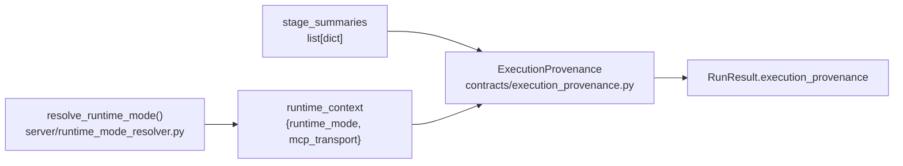

**单一真相来源原则**：`runtime_mode` 仅由 `resolve_runtime_mode(env, readiness)` 计算，`/manifest`、`/ready`、`RunResult` 三处均引用此函数，禁止各自独立计算。

| 字段 | 类型 | 说明 |
|------|------|------|
| `contract_version` | `str` | `"2026-04-17"` — 下游 schema 版本检查锚点 |
| `runtime_mode` | `Literal["dev-smoke","local-real","prod-real"]` | 由 resolver 统一计算 |
| `llm_mode` | `Literal["heuristic","real","disabled","unknown"]` | W2 填充 |
| `kernel_mode` | `Literal["local-fsm","http","unknown"]` | W2 填充 |
| `capability_mode` | `Literal["sample","profile","mcp","external","mixed","unknown"]` | W2 填充 |
| `mcp_transport` | `Literal["not_wired","stdio","sse","http"]` | 来自 mcp_transport_status |
| `fallback_used` | `bool` | 是否使用了启发式兜底 |
| `fallback_reasons` | `list[str]` | 去重排序的兜底原因 |
| `evidence` | `dict[str, int]` | `heuristic_stage_count` 等 |

---

## 15. Evolve 三态策略（W1-D2）

`TraceConfig.evolve_mode: Literal["auto","on","off"]`，旧 `evolve_enabled: bool` 保留弃用路径。

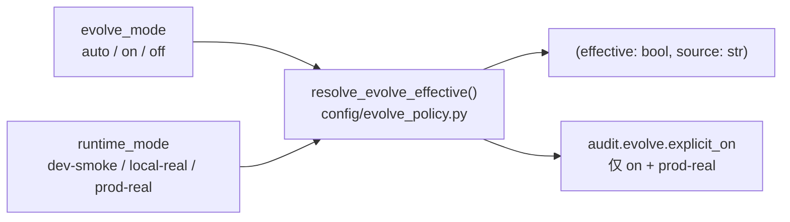

| mode | runtime_mode | effective | source |
|------|-------------|-----------|--------|
| `on` | any | `True` | `explicit_on` |
| `off` | any | `False` | `explicit_off` |
| `auto` | `dev-smoke` | `True` | `auto_dev_on` |
| `auto` | `local-real` / `prod-real` | `False` | `auto_prod_off` |

`/manifest` 返回 `evolve_policy: {mode, effective, source}`；`/ready` 返回 `evolve_source`。

---

## 16. RBAC/SOC 操作驱动授权（W1-D5）

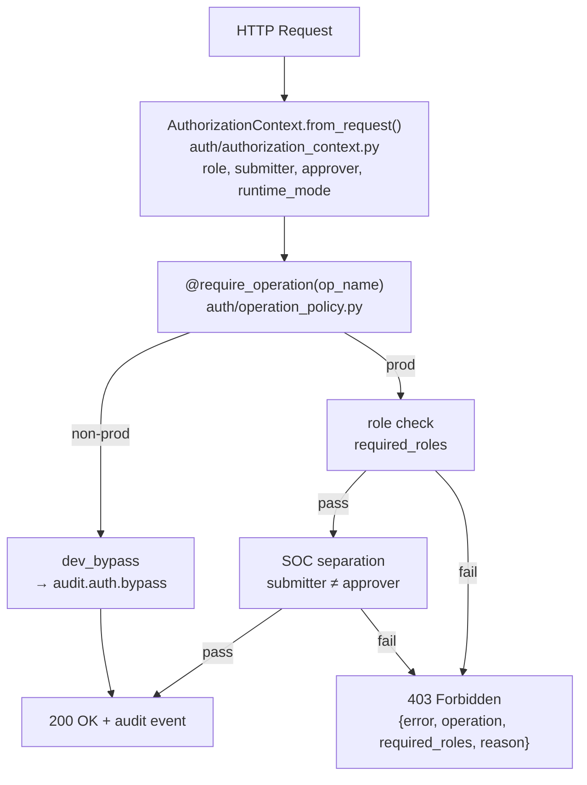

| 操作 | 所需角色 | SOC 分离 | audit_event |
|------|---------|----------|-------------|
| `skill.promote` | `approver` / `admin` | ✓ | `skill.promote` |
| `skill.evolve` | `approver` / `admin` | ✓ | `skill.evolve` |
| `memory.consolidate` | `approver` / `admin` | ✗ | `memory.consolidate` |

---

## 17. SystemBuilder 子 Builder 分拆（W6 + W10-002）

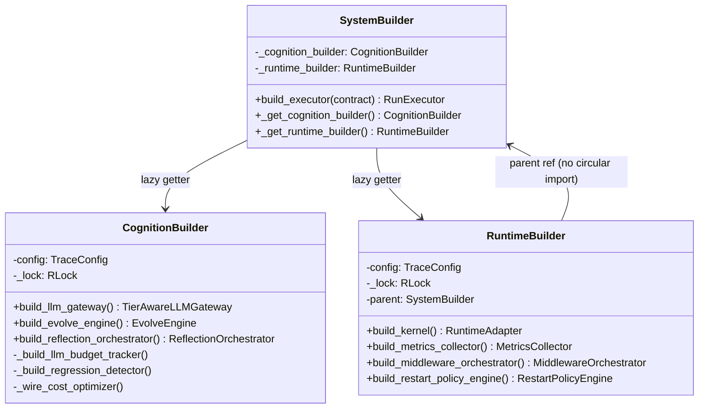

**后置构造突变消除**：`RunExecutor.__init__` 新增 4 个可选参数（`middleware_orchestrator`, `skill_evolver`, `skill_evolve_interval`, `tracer`），builder 在 `_build_executor_impl` 阶段预计算后传入，移除了原有的 3 处 `setattr` 突变。

---

## 18. StageOrchestrator 提取（W10-001）

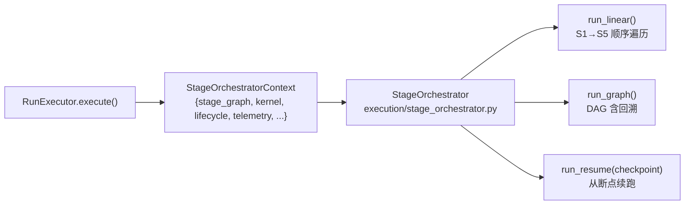

`StageOrchestratorContext` 是只读 dataclass，携带 `stage_graph`、`kernel`、`lifecycle`、`telemetry`、`route_engine` 等所有遍历依赖，消除了 `RunExecutor` 的内部字段访问耦合。

---

## 19. 能力治理扩展（W10-003 / W10-004）

### 危险能力 RBAC（W10-003）

`CapabilityInvoker.invoke()` 在调用前检查 `effect_class = "dangerous"`：调用方角色必须在 `{"approver", "admin"}` 内，否则抛 `PermissionError`，与 policy-level RBAC 叠加形成双重守卫。

### 输出预算截断（W10-004）

`CapabilityDescriptor.output_budget_tokens`（int > 0）设置输出 token 上限。`CapabilityInvoker` 在 `mark_success` 后：
1. 估算输出字符数（≈ budget × 4）
2. 超出则截断 `response["output"]` 或 `response["result"]`
3. 写入 `response["_output_truncated"] = True`

---

## 20. 审计日志与 MCP 可靠性（W10-005）

### 审计日志

```python
# hi_agent/observability/audit.py
emit(event_name: str, payload: dict) -> None
# 追加写入 ${audit_dir}/events.jsonl，每行：
# {"ts": "...", "event": "audit.auth.bypass", "payload": {...}}
```

内置事件前缀：`audit.evolve.*`、`audit.auth.*`、`audit.capability.*`。

### MCP 重启退避（W10-005）

`StdioMCPTransport` 进程崩溃时自动重启，指数退避（基础 1s，最多 5 次），超限后状态转为 `unhealthy` 并触发 release gate 失败。

### Schema 漂移注册（W10-005）

`MCPSchemaRegistry` 缓存工具列表 JSON Schema；当 MCP server 返回的 schema 与缓存不一致时，发出 `WARNING: schema drift detected for tool <name>`，不阻断调用但写入审计日志。

---

## 21. ProfileDirectoryManager 与 5 层配置（W11-001）

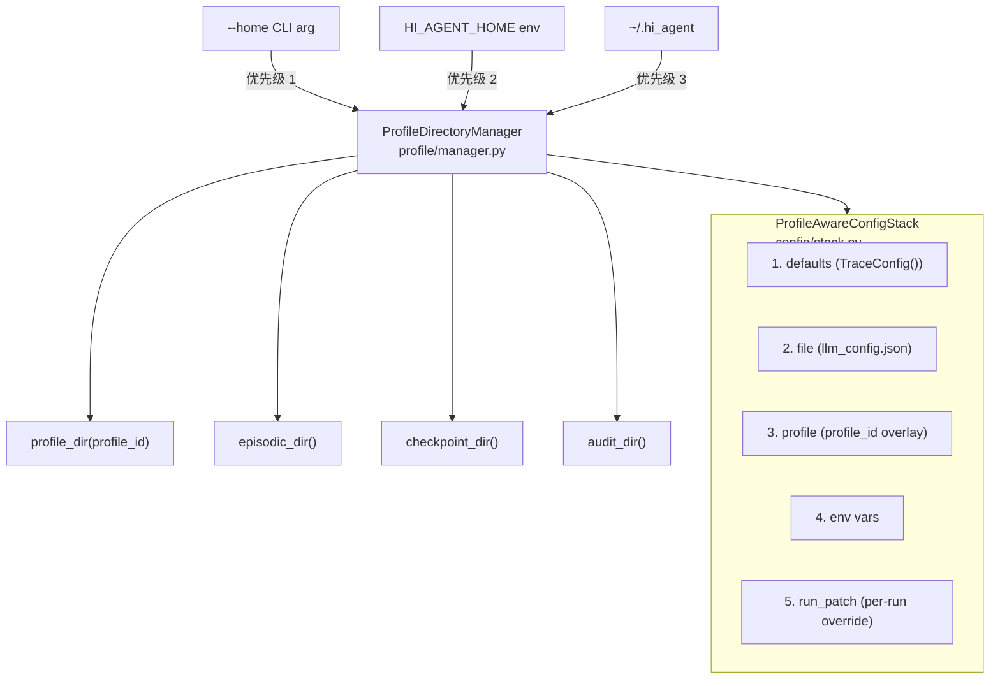

`ProfileAwareConfigStack.resolve(run_patch=None) -> TraceConfig` 按优先级从低到高合并，run_patch 为最高优先级（per-run 临时覆盖，不持久化）。

---

## 22. 发布门禁与运维（W12）

### 发布门禁（W12-002）

`build_release_gate_report(builder) -> ReleaseGateReport`，包含 7 个 `GateResult`（状态：`pass` / `fail` / `skipped` / `info`）：

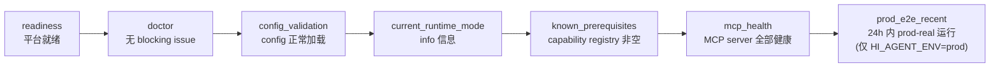

`check_prod_e2e_recent(max_age_hours, episodic_dir)` 扫描 `.hi_agent/episodes/*.json`，查找 `runtime_mode=prod-real` 且 `completed_at` 在窗口内的 episode；非 prod 环境 Gate 7 自动 `skipped`，不阻断本地 CI。

### Runbook 文档（W12-003 / W12-004）

`docs/runbook/` 提供以下标准运维文档：

| 文档 | 内容 |
|------|------|
| `deploy.md` | 部署流程、发布门禁检查、蓝绿切换 |
| `verify.md` | 部署后验证 checklist（/ready、/manifest、POST /runs smoke） |
| `rollback.md` | 回滚决策树、回滚步骤、数据安全检查 |
| `incident-mcp-crash.md` | MCP 进程崩溃响应流程、重启退避配置 |
| `incident-evolve-unexpected-mutation.md` | 意外进化触发响应、evolve_mode 紧急关闭 |

### 黄金路径测试（W11-002 / W12-001）

`tests/golden/dev_smoke/` 提供 dev-smoke 黄金路径 3 层测试，使用真实 `SystemBuilder`（无 mock）+ 启发式兜底：

| 层 | 测试 | 验证 |
|----|------|------|
| Unit | `test_execution_provenance.py` | ExecutionProvenance dataclass 合约 |
| Integration | `test_runner_provenance_propagation.py` | RunResult 携带正确 provenance |
| E2E (golden) | `test_dev_smoke_golden.py` | 完整 execute() 返回预期键集合 |

`tests/fixtures/` 提供 `fake_llm_http_server`、`fake_kernel_http_server`、`fake_mcp_stdio_server` — 基于 `ThreadingMixIn + HTTPServer` 绑定端口 0，可用于需要真实 HTTP 交互的集成测试。
