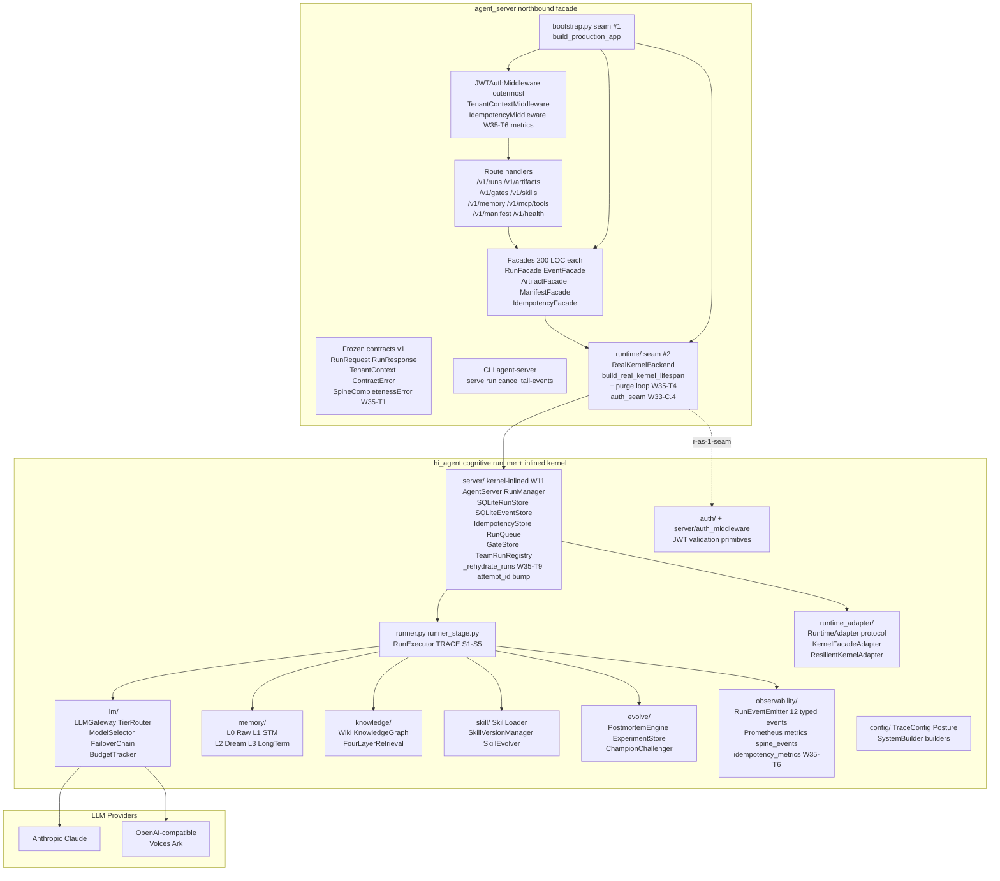
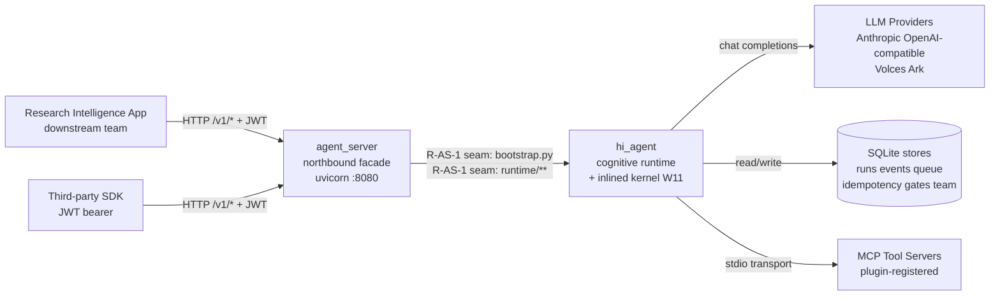

# hi-agent Platform — Architecture

> Last refreshed: W35 close (2026-05-05). HEAD `8bce5bc`. W35 closed all 8 binding RIA W35-T items + 38 hidden findings; 32 deferred to W36, 17 to W37+ via the new retention and boot-time-assertion roadmaps. Contract digest re-snapshotted at W35-T1.
>
> **Document hierarchy**
> - L0 system boundary: this file
> - L1 agent-server detail: [`agent_server/ARCHITECTURE.md`](agent_server/ARCHITECTURE.md)
>   - L2 transport (`api/`): [`agent_server/api/ARCHITECTURE.md`](agent_server/api/ARCHITECTURE.md)
>   - L2 adapters (`facade/`): [`agent_server/facade/ARCHITECTURE.md`](agent_server/facade/ARCHITECTURE.md)
>   - L2 contracts (`contracts/`): [`agent_server/contracts/ARCHITECTURE.md`](agent_server/contracts/ARCHITECTURE.md)
>   - L2 kernel binding (`runtime/`): [`agent_server/runtime/ARCHITECTURE.md`](agent_server/runtime/ARCHITECTURE.md)
>   - L2 operator CLI (`cli/`): [`agent_server/cli/ARCHITECTURE.md`](agent_server/cli/ARCHITECTURE.md)
>   - L2 config surfaces (`config/`): [`agent_server/config/ARCHITECTURE.md`](agent_server/config/ARCHITECTURE.md)
> - L1 hi-agent detail: [`hi_agent/ARCHITECTURE.md`](hi_agent/ARCHITECTURE.md)
>   - L2 server kernel: [`hi_agent/server/ARCHITECTURE.md`](hi_agent/server/ARCHITECTURE.md)
>   - L2 runtime helpers: [`hi_agent/runtime/ARCHITECTURE.md`](hi_agent/runtime/ARCHITECTURE.md)
>   - L2 runtime_adapter: [`hi_agent/runtime_adapter/ARCHITECTURE.md`](hi_agent/runtime_adapter/ARCHITECTURE.md)
>   - L2 LLM gateway: [`hi_agent/llm/ARCHITECTURE.md`](hi_agent/llm/ARCHITECTURE.md)
>   - L2 observability: [`hi_agent/observability/ARCHITECTURE.md`](hi_agent/observability/ARCHITECTURE.md)
>   - L2 knowledge: [`hi_agent/knowledge/ARCHITECTURE.md`](hi_agent/knowledge/ARCHITECTURE.md)
>   - L2 skill: [`hi_agent/skill/ARCHITECTURE.md`](hi_agent/skill/ARCHITECTURE.md)
>   - L2 capability: [`hi_agent/capability/ARCHITECTURE.md`](hi_agent/capability/ARCHITECTURE.md)
> - Stable codebase facts: [`docs/architecture-reference.md`](docs/architecture-reference.md)

---

## 1. Purpose / Responsibilities

hi-agent is a **platform-layer** agent execution system. It is not a business application.
Its purpose is to provide the research team's intelligence applications with a stable,
versioned, operationally observable API surface for running long-lived autonomous agents.

Primary goals:

1. Expose a frozen northbound HTTP contract (`agent_server/`, v1) that downstream teams
   can depend on across platform upgrades.
2. Execute TRACE (Task → Route → Act → Capture → Evolve) runs durably, with restart
   survival, cancellation, and per-run observability.
3. Enforce a hard platform/business boundary so research-team business logic never leaks
   into the platform kernel.
4. Provide posture-aware defaults (`dev` permissive, `research`/`prod` fail-closed) so
   the same codebase runs safely across local development, research, and production.

What hi-agent does NOT own:
- Business logic, prompts, domain schemas (research team's overlay).
- LLM provider implementations (Anthropic, OpenAI-compatible, Volces — accessed via
  HTTPS).
- External state services beyond the local SQLite stores.

---

## 2. Module Boundary (R-AS-1 + Rule 6 layering)

The platform is two packages plus an inlined kernel umbrella (Wave 11):

```
hi-agent/
├── agent_server/        # versioned northbound facade (v1 frozen)
│   ├── api/             # HTTP transport
│   ├── contracts/       # frozen v1 dataclasses
│   ├── facade/          # contract↔kernel adaptation
│   ├── runtime/         # R-AS-1 seam #2: real-kernel binding + auth
│   ├── cli/             # operator CLI
│   ├── config/          # settings + version constants
│   └── bootstrap.py     # R-AS-1 seam #1: assembly
├── hi_agent/            # cognitive runtime + inlined kernel (W11)
│   ├── server/          # AgentServer, RunManager, SQLite stores
│   ├── runtime/         # sync_bridge etc.
│   ├── runtime_adapter/ # adapters for cross-process kernel
│   ├── llm/             # gateway, router, failover
│   ├── memory/          # L0/L1/L2/L3
│   ├── knowledge/       # wiki + KG + four-layer retrieval
│   ├── skill/           # skill loader, evolver
│   ├── evolve/          # postmortem, experiments, A/B
│   ├── observability/   # event emitter, metrics, spine, idempotency_metrics (W35-T6)
│   ├── contracts/       # internal dataclasses (incl. ReasoningTrace W35-T1 reference)
│   ├── auth/            # JWT primitives
│   └── config/          # Posture, builders
└── docs/                # governance, plans, deliveries
```

R-AS-1 enforcement:
- Only `agent_server/bootstrap.py` and `agent_server/runtime/**` may import `hi_agent.*`.
- `hi_agent/` MUST NOT import `agent_server.*` (no reverse imports).
- Annotated `# r-as-1-seam:` imports tolerated only in facade modules with documented
  rationale.
- Gates: `scripts/check_layering.py`, `scripts/check_no_reverse_imports.py`,
  `scripts/check_facade_seams.py`.

Rule 6 single-construction-path:
- `IdempotencyStore`, `RealKernelBackend`, `AgentServer`, `Posture` — each has exactly
  one builder, dependency-injected to consumers.
- W35-T4: bootstrap wires `real_backend._idempotency_store = idem_store` so the lifespan
  purge loop can find the store without poking `app.state`.

---

## 3. Component Diagram


```mermaid
flowchart TB
    subgraph agent_server[agent_server northbound facade]
        MW[JWTAuthMiddleware outermost<br/>TenantContextMiddleware<br/>IdempotencyMiddleware W35-T6 metrics]
        RT[Route handlers<br/>/v1/runs /v1/artifacts<br/>/v1/gates /v1/skills<br/>/v1/memory /v1/mcp/tools<br/>/v1/manifest /v1/health]
        FA[Facades 200 LOC each<br/>RunFacade EventFacade<br/>ArtifactFacade ManifestFacade<br/>IdempotencyFacade]
        CO[Frozen contracts v1<br/>RunRequest RunResponse<br/>TenantContext ContractError<br/>SpineCompletenessError W35-T1]
        CLI2[CLI agent-server<br/>serve run cancel tail-events]
        BS[bootstrap.py seam #1<br/>build_production_app]
        RTM[runtime/ seam #2<br/>RealKernelBackend<br/>build_real_kernel_lifespan<br/>+ purge loop W35-T4<br/>auth_seam W33-C.4]
    end

    subgraph hi_agent[hi_agent cognitive runtime + inlined kernel]
        RUN[runner.py runner_stage.py<br/>RunExecutor TRACE S1-S5]
        LLM2[llm/<br/>LLMGateway TierRouter<br/>ModelSelector FailoverChain<br/>BudgetTracker]
        MEM[memory/<br/>L0 Raw L1 STM<br/>L2 Dream L3 LongTerm]
        KNW[knowledge/<br/>Wiki KnowledgeGraph<br/>FourLayerRetrieval]
        SKL[skill/ SkillLoader<br/>SkillVersionManager SkillEvolver]
        EVO[evolve/<br/>PostmortemEngine ExperimentStore<br/>ChampionChallenger]
        OBS[observability/<br/>RunEventEmitter 12 typed events<br/>Prometheus metrics spine_events<br/>idempotency_metrics W35-T6]
        CFG[config/ TraceConfig Posture<br/>SystemBuilder builders]
        SRV[server/ kernel-inlined W11<br/>AgentServer RunManager<br/>SQLiteRunStore SQLiteEventStore<br/>IdempotencyStore RunQueue<br/>GateStore TeamRunRegistry<br/>_rehydrate_runs W35-T9 attempt_id bump]
        AUTH[auth/ + server/auth_middleware<br/>JWT validation primitives]
        RTA[runtime_adapter/<br/>RuntimeAdapter protocol<br/>KernelFacadeAdapter<br/>ResilientKernelAdapter]
    end

    subgraph providers[LLM Providers]
        ANT[Anthropic Claude]
        OAI[OpenAI-compatible<br/>Volces Ark]
    end

    MW --> RT
    RT --> FA
    FA --> RTM
    BS --> MW
    BS --> FA
    BS --> RTM
    RTM --> SRV
    SRV --> RUN
    RUN --> LLM2
    RUN --> MEM
    RUN --> KNW
    RUN --> SKL
    RUN --> EVO
    RUN --> OBS
    RTM -. r-as-1-seam .-> AUTH
    SRV --> RTA
    LLM2 --> ANT
    LLM2 --> OAI
```

System context:


```mermaid
flowchart LR
    DS[Research Intelligence App<br/>downstream team]
    SDK[Third-party SDK<br/>JWT bearer]
    AS[agent_server<br/>northbound facade<br/>uvicorn :8080]
    HA[hi_agent<br/>cognitive runtime<br/>+ inlined kernel W11]
    LLM[LLM Providers<br/>Anthropic OpenAI-compatible<br/>Volces Ark]
    DB[(SQLite stores<br/>runs events queue<br/>idempotency gates team)]
    MCP[MCP Tool Servers<br/>plugin-registered]

    DS -->|HTTP /v1/* + JWT| AS
    SDK -->|HTTP /v1/* + JWT| AS
    AS -->|R-AS-1 seam: bootstrap.py<br/>R-AS-1 seam: runtime/**| HA
    HA -->|chat completions| LLM
    HA -->|read/write| DB
    HA -->|stdio transport| MCP
```

---

## 4. Data Flow / Sequence Diagram

Happy-path `POST /v1/runs` under the W35 middleware chain:

```mermaid
sequenceDiagram
    participant C as Downstream Client
    participant JWT as JWTAuthMiddleware
    participant TC as TenantContextMiddleware
    participant IM as IdempotencyMiddleware
    participant RH as routes_runs.py
    participant RF as RunFacade
    participant RKB as RealKernelBackend
    participant RM as hi_agent RunManager
    participant RUN as runner.py RunExecutor
    participant LLM as llm/TierRouter+Gateway
    participant OBS as observability/RunEventEmitter

    C->>JWT: POST /v1/runs Authorization Bearer X-Tenant-Id
    Note over JWT: research/prod validate JWT; dev passthrough
    JWT->>TC: forward (auth_claims)
    TC->>TC: validate X-Tenant-Id; emit tenant_context spine
    TC->>IM: forward
    IM->>IM: reserve_or_replay (W35-T6 emits replay/conflict counters)
    IM->>RH: forward (created)
    RH->>RH: build RunRequest body — W35-T1 spine validation
    RH->>RF: run_facade.start(ctx, RunRequest)
    RF->>RKB: start_run(tenant_id, profile_id, goal, ...)
    RKB->>RM: create_run(task_contract, workspace=tenant_id)
    Note over RM: W35-T3 auth-authoritative tenant_id<br/>body mismatch -> TenantScopeError under strict
    RM-->>RKB: ManagedRun(state=queued)
    RKB-->>RF: dict
    RF-->>RH: RunResponse
    RH-->>IM: 201
    IM->>IM: mark_complete (replay cache populated)
    IM-->>C: 201 run_id state=queued

    Note over RM,RUN: Background TRACE execution

    RM->>RUN: execute(task_contract)
    RUN->>OBS: record_run_started + record_stage_started(S1)
    loop TRACE stages S1 -> S5
        RUN->>LLM: chat_completion(task_view)
        LLM-->>RUN: LLMResponse
        RUN->>OBS: record_action_executed / record_stage_completed
    end
    RUN->>OBS: record_run_completed(state=done)

    C->>RH: GET /v1/runs/id/events (SSE)
    RH->>RKB: iter_events(tenant_id, run_id)
    RKB-->>RH: live event stream
    RH-->>C: text/event-stream chunks until terminal
```

Cancellation contract: `POST /v1/runs/{id}/cancel` on a known live run returns 200 and
drives the run to a terminal state. On an unknown run ID it returns 404 (not 200).

SSE live-stream contract (W33-C.5): `GET /v1/runs/{id}/events` keeps the connection open
and yields events as they are appended; the stream closes once the run reaches a terminal
state. Snapshot-and-close behaviour was retired in W33.

---

## 5. Key Contracts / Public API

```python
# Top-level public surface
agent_server.AGENT_SERVER_API_VERSION = "v1"

# Production assembly (uvicorn-callable)
agent_server.bootstrap.build_production_app(
    *,
    settings: AgentServerSettings | None = None,
    state_dir: Path | str | None = None,
) -> FastAPI

# Lower-level builder (used by tests with stub facades)
agent_server.api.build_app(
    *,
    run_facade,
    event_facade=None, artifact_facade=None, manifest_facade=None,
    idempotency_facade=None, idempotency_strict=None,
    tenant_event_emitter=None,
    include_mcp_tools=False, include_skills_memory=False, include_gates=True,
    lifespan=None,
) -> FastAPI
```

Required HTTP headers (research/prod):
- `Authorization: Bearer <jwt>` — validated by `JWTAuthMiddleware` (W33-C.4) via the
  runtime auth seam.
- `X-Tenant-Id` — every posture, every request.
- `Idempotency-Key` — every mutating route.
- Optional: `X-Project-Id`, `X-Profile-Id`, `X-Session-Id`.

W35-T8 boot-time invariant: `build_app` raises `ValueError` when `include_mcp_tools` or
`include_skills_memory` is True without a non-`None` `idempotency_facade`.

Readiness endpoints:

| Endpoint | Purpose |
|---|---|
| `GET /ready` | 200 when ready for traffic, 503 otherwise |
| `GET /health` / `GET /v1/health` | per-subsystem status + api_version |
| `GET /diagnostics` | compact fingerprint of resolved env/config |
| `GET /metrics` | Prometheus metrics (incl. W35-T6 idempotency family) |
| `GET /v1/manifest` | capability + posture matrix (now exposes resolved posture per W34-C) |

---

## 6. Posture Behaviour (Rule 11)

| Posture | JWT (W33-C.4) | Tenant header | Idempotency-Key | W35-T1 spine validation | W35-T3 cross-check | Backend |
|---|---|---|---|---|---|---|
| `dev` | passthrough; anonymous claims | required | optional, warn if absent | warns | warns when body tenant_id ≠ middleware | `real` (default) or `stub` permitted |
| `research` | required HMAC | required | required on mutating routes | raises `SpineCompletenessError` (400) | raises `TenantScopeError` (400) | `real` only |
| `prod` | required HMAC | required | required on mutating routes | raises | raises | `real` only |

`HI_AGENT_POSTURE={dev,research,prod}` (default `dev`) is read by
`hi_agent/config/posture.py::Posture.from_env()` at every enforcement call site. The
agent_server contracts read it directly via `os.environ` (R-AS-1 layered) through
`agent_server/contracts/errors.py::_strict_posture()` so the contracts package never
imports `hi_agent.config.posture`.

---

## 7. Failure Modes (Rule 7 fallback inventory)

Top-level inventory; sub-package docs carry the fine-grained rows.

| Path | Countable | Attributable | Inspectable | Gate-asserted |
|---|---|---|---|---|
| LLM provider failover | `hi_agent_llm_fallback_total` | `WARNING` w/ run_id + provider + reason | run metadata `fallback_events` list | Rule 8 step 3 (`llm_fallback_count == 0`) |
| Heuristic-route fallback | `hi_agent_heuristic_route_total` | `WARNING` w/ run_id | run metadata | Rule 8 |
| `IdempotencyMiddleware` replay/conflict | `hi_agent_idempotency_replay_total` / `_conflict_total` (W35-T6) | `INFO`/`WARNING` log | client receives cached / 409 | `tests/integration/test_idempotency_metrics.py` |
| `_idempotency_purge_loop` deletes | `hi_agent_idempotency_purged_total` (W35-T6) | `INFO` "purged N records" | disk size shrinks after VACUUM | `tests/integration/test_idempotency_ttl_purge.py` |
| `_lease_expiry_loop` raises | `record_silent_degradation` | `WARNING` + spine | next interval retries | `tests/integration/test_lease_expiry_runtime.py` |
| `_current_stage_watchdog` >60s | `record_silent_degradation` | `WARNING` w/ run_id + age | spine event | Rule 8 step 5 |
| `JWTAuthMiddleware` rejects | n/a (401 rate observable) | `WARNING` per rejection | client receives 401 envelope | `tests/integration/test_v1_jwt_auth_middleware.py` |
| `RunRequest.__post_init__` missing spine field | n/a (typed exception) | `SpineCompletenessError` traceback | 400 envelope | `tests/unit/test_w34_plus_spine_validation.py` |
| `RunManager.create_run` body tenant ≠ middleware | n/a | `WARNING` (dev) / `TenantScopeError` traceback (strict) | 400 envelope | `tests/integration/test_run_manager_tenant_strict.py` |

Rule 7 invariant: every silent-degradation path is **Countable + Attributable +
Inspectable + Gate-asserted**. A fallback without an alarm bell is a defect disguised as
resilience.

---

## 8. Resource Lifecycle (Rule 5)

Rule 5 (Async/Sync Resource Lifetime) enforcement:
- Async-first core. `httpx.AsyncClient`, `aiohttp.ClientSession`, etc. are bound to
  exactly one event loop.
- Sync-facing callers route through `hi_agent.runtime.sync_bridge` (persistent loop on a
  dedicated thread, marshalled via `asyncio.run_coroutine_threadsafe`).
- Direct `asyncio.run(` outside entry points is a rule violation enforced by
  `scripts/check_rules.py`.

Background tasks owned by the agent_server lifespan
(`agent_server/runtime/lifespan.py`):
- `_lease_expiry_loop` — interval `HI_AGENT_LEASE_EXPIRY_INTERVAL_S` (default 30 s).
- `_current_stage_watchdog` — 30 s interval; fires Rule 8 step-5 warning at >60 s.
- `_idempotency_purge_loop` — W35-T4; interval `HI_AGENT_IDEMPOTENCY_PURGE_INTERVAL_S`
  (default 600 s); only created when `backend._idempotency_store is not None`.
- SIGTERM handler (W33-C.2) — drains in-flight runs before shutdown
  (`HI_AGENT_DRAIN_TIMEOUT_S`, default 30 s).

Persistence layout:

```
<state_dir>/
├── runs.db          # SQLiteRunStore
├── events.db        # SQLiteEventStore
├── queue.db         # RunQueue
├── idempotency.db   # IdempotencyStore (W35-T4 purge)
├── gates.db         # GateStore
├── team_events.db   # TeamEventStore
└── workspace/       # tenant-scoped artifacts
```

`state_dir` resolution: `AGENT_SERVER_STATE_DIR` → `HI_AGENT_HOME/.agent_server` →
`./.agent_server`.

---

## 9. Lineage / Spine Compliance (Rule 12)

Every persistent record carries `tenant_id` plus the relevant subset of
`{user_id, session_id, team_space_id, project_id, profile_id, run_id, parent_run_id,
phase_id, attempt_id, capability_name}`.

W35-T1: 53 dataclasses across `hi_agent/contracts/` and `agent_server/contracts/` carry
posture-aware `__post_init__` validators. Reference impl
`hi_agent/contracts/reasoning.py::ReasoningTrace.__post_init__`. Mirror error class
`agent_server/contracts/errors.py::SpineCompletenessError`. R-AS-1 layering preserved
because agent_server reads posture via env var, never importing `hi_agent.config.posture`.
The required-target list lives in
`scripts/check_dataclass_spine_validation.py::REQUIRED_VALIDATION_TARGETS`.

W35-T3: `hi_agent/server/run_manager.py:443-489` — auth-authoritative tenant_id with
anti-forgery cross-check. Body that differs from middleware raises `TenantScopeError`
under strict, warns under dev. Removes the W34 strict-only DeprecationWarning that had
made strict appear "more permissive" than dev (RIA W35 directive §3.2).

W35-T9: `hi_agent/server/app.py:1340-1377` — `_rehydrate_runs` now bumps `attempt_id`,
links `parent_run_id=run_id`, and bumps `attempt_count` before re-enqueue, so postmortem
reconstruction has the per-attempt lineage chain across recovery cycles. Resolves the
W34-F.2 closure-claim defect (Rule 15 — "documented behaviour without code").

Process-internal value objects (no `tenant_id`) carry the `# scope: process-internal`
marker per Rule 12. Examples: `CTSBudget`, `Provenance`, `ValidationResult`,
`ConfidenceInputs`, `StageDirective`, `agent_server/contracts/workspace.py::ContentHash`.

Gates:
- `scripts/check_contract_spine_completeness.py` (Rule 12)
- `scripts/check_dataclass_spine_validation.py` (W35-T1 — every spine-bearing dataclass
  carries `__post_init__`)
- `scripts/check_lineage_population.py`

---

## 10. Test Layers (Rule 4)

| Layer | Scope | Path / count |
|---|---|---|
| L1 unit | per-function with mocks for external network only | `tests/unit/**/*.py` |
| L2 integration | real components wired together; zero mocks on subject | `tests/integration/**/*.py` |
| L3 e2e | drives through HTTP / CLI / top-level API | `tests/e2e/**/*.py` |
| Default-offline profile | no network, no real LLM, no secrets | `scripts/verify_clean_env.py` (9288 pass / 8 skip / 0 fail at HEAD `8bce5bc`) |
| Rule 8 operator-shape gate | PM2 / real LLM / N≥3 sequential runs | `docs/delivery/<date>-<sha>.md` |

W35 new tests:
- `tests/integration/test_idempotency_ttl_purge.py` (W35-T4)
- `tests/integration/test_idempotency_metrics.py` (W35-T6)
- `tests/integration/test_mcp_tools_idempotency.py` (W35-T8)
- `tests/unit/test_w34_plus_spine_validation.py` (W35-T1, refreshed for sibling targets)

CI gates:
- `scripts/check_rules.py` — Language Rule + Rules 4/5/6 advisories
- `scripts/check_layering.py` (R-AS-1)
- `scripts/check_contract_freeze.py` (R-AS-3) — digest re-rolled at W35-T1
- `scripts/check_route_scope.py` / `check_route_tenant_context.py` (R-AS-4)
- `scripts/check_tdd_evidence.py` (R-AS-5)
- `scripts/check_facade_loc.py` (R-AS-8)
- `scripts/check_contract_spine_completeness.py` (Rule 12)
- `scripts/check_dataclass_spine_validation.py` (W35-T1)
- `scripts/check_manifest_freshness.py` (Rule 14)
- `scripts/check_allowlist_discipline.py` (Rule 17)
- `scripts/run_arch_7x24.py` — 5-assertion architectural verification

---

## 11. Open Roadmap Items (W36+)

W36 (32 hidden findings scoped):
- Shared `__post_init__` mixin so each spine-bearing class shrinks to a decorator.
- Idempotency record retention policy beyond TTL purge.
- Per-route rate limiting beyond the global limiter.
- Hot-reload of `AgentServer` config (currently restart-only).
- Optional `--auth-token` CLI flag.

W37+ (17 hidden findings scoped):
- `agent_server/contracts/v2/` sub-package authoring guide once a breaking change is
  approved.
- Float-canonicalisation for idempotency body hashing (W35-T5 deferred).
- Streaming uploads via multipart through `ArtifactFacade.register`.
- Cross-process run sharing via external durable backend.
- WebSocket transport for bidirectional streams.
- Per-error-category metrics roll-up.

Tracking docs:
- `docs/governance/retention-roadmap.md` — 24 unbounded-growth stores
- `docs/governance/boot-time-assertions-roadmap.md` — 22 boot-time gaps
- `docs/governance/systematic-audit-w35-2026-05-05.md` — 91 hidden findings catalog

---

## 12. References

Quick links:

| Concern | Path |
|---|---|
| Top-level facade | [`agent_server/ARCHITECTURE.md`](agent_server/ARCHITECTURE.md) |
| HTTP transport | [`agent_server/api/ARCHITECTURE.md`](agent_server/api/ARCHITECTURE.md) |
| Real-kernel binding | [`agent_server/runtime/ARCHITECTURE.md`](agent_server/runtime/ARCHITECTURE.md) |
| Frozen v1 contracts | [`agent_server/contracts/ARCHITECTURE.md`](agent_server/contracts/ARCHITECTURE.md) |
| Operator CLI | [`agent_server/cli/ARCHITECTURE.md`](agent_server/cli/ARCHITECTURE.md) |
| Config + version | [`agent_server/config/ARCHITECTURE.md`](agent_server/config/ARCHITECTURE.md) |
| hi_agent runtime | [`hi_agent/ARCHITECTURE.md`](hi_agent/ARCHITECTURE.md) |
| Codebase reference | [`docs/architecture-reference.md`](docs/architecture-reference.md) |

Standard startup:

```bash
# 1. Install
pip install -e ".[llm]"

# 2. Configure
export HI_AGENT_POSTURE=research
export HI_AGENT_LLM_MODE=real
export OPENAI_API_KEY=<key>
export HI_AGENT_JWT_SECRET=<secret>

# 3. Serve under PM2 (production)
pm2 start "agent-server serve --prod" --name hi-agent
```

Runtime modes:

| `HI_AGENT_ENV` | `HI_AGENT_LLM_MODE` | Mode | Kernel | LLM fallback |
|---|---|---|---|---|
| `dev` (default) | `heuristic` | dev-smoke | LocalFSM | allowed |
| `dev` | `real` | local-real | LocalFSM or HTTP | allowed |
| `prod` | `real` | prod-real | HTTP client (`HI_AGENT_KERNEL_BASE_URL`) | disabled, 503 |

Governance & deliveries:
- CLAUDE.md — Rules 1–17, Ownership Tracks
- `docs/architecture-reference.md` — codebase reference
- `docs/platform/agent-server-northbound-contract-v1.md` — v1 surface description
- `docs/governance/closure-taxonomy.md` — Rule 15 levels
- `docs/governance/score_caps.yaml` — readiness caps
- `docs/governance/contract_v1_freeze.json` — re-snapshotted at W35-T1
- `docs/governance/systematic-audit-w35-2026-05-05.md` — 91 hidden findings catalog
- `docs/governance/retention-roadmap.md` — W36/W37+ retention strategies
- `docs/governance/boot-time-assertions-roadmap.md` — W36/W37+ assertion gaps
- `docs/observability/idempotency-metrics.md` — W35-T6 metric catalog

Glossary (terminology used across this hierarchy):

| Term | Definition |
|---|---|
| TRACE | Task → Route → Act → Capture → Evolve; the five-phase run execution model |
| Run | A single durable execution entity, identified by `run_id`; survives process restart |
| Stage | A named phase within a run's TRACE lifecycle (S1 through S5) |
| StageDirective | A runtime instruction that modifies stage execution: `skip_to`, `insert_stage`, `replan` |
| Task | A formal contract (13 fields) capturing goal, constraints, budget |
| Branch | A logical trajectory within the exploration space; used in DAG execution mode |
| TierRouter | Routes LLM calls to `strong`/`medium`/`light` tiers based on calibration signals |
| FailoverChain | Ordered LLM provider sequence; falls back on error, emits `hi_agent_llm_fallback_total` |
| Memory | Three-tier agent experience store: L0 Raw → L1 STM → L2 Dream → L3 LongTerm graph |
| Knowledge | Stable facts: wiki + KG + four-layer retrieval (grep → BM25 → graph → embedding) |
| Skill | Reusable process unit with 5-stage lifecycle and A/B version management |
| Posture | Execution safety level: `dev` (permissive) / `research` (fail-closed) / `prod` (strictest) |
| TenantContext | Authenticated identity context; carries `tenant_id`, `user_id`, `project_id` |
| RunEventEmitter | Structured observability component with 12 typed `record_*` methods |
| Operator-shape gate | Rule 8 requirement: PM2/real-LLM/N>=3 run validation before delivery |
| T3 invariance | Gate pass valid only at recorded SHA; hot-path commits invalidate it |
| Spine | The Rule 12 set of identity/lineage fields every persistent record carries |
| Closure-claim defect | Closure notice describes behaviour the code does not implement (Rule 15) |
