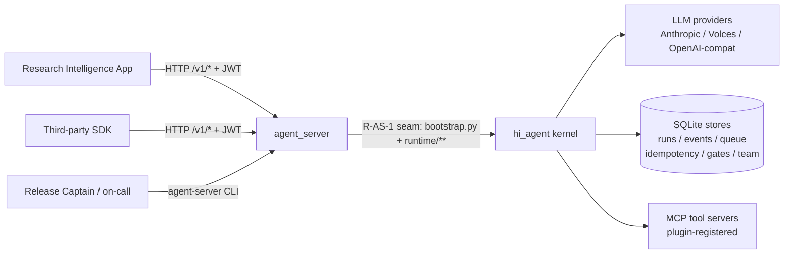
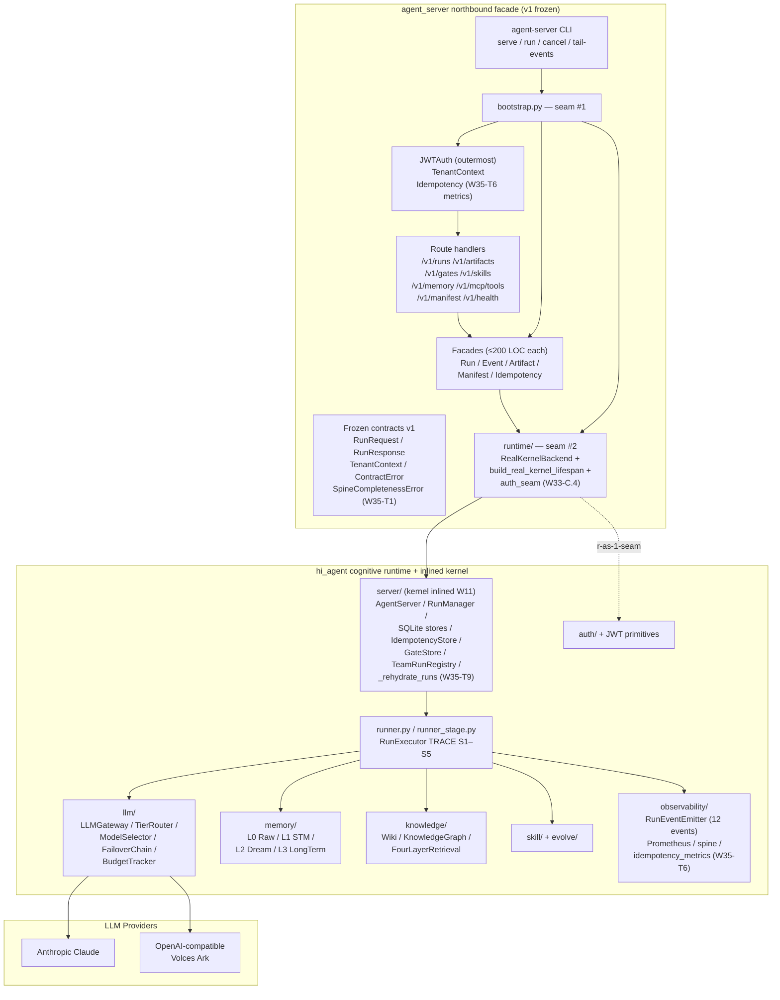

# hi-agent Platform — Architecture

> **Last refreshed:** 2026-05-06 (W35 corrective close + W36 plans staged). HEAD `276917d8`.
> **Audience:** platform engineers, downstream consumers, release captains.
> **Status:** authoritative — supersedes prose elsewhere in the repo.
>
> **Document hierarchy**
> - L0 system boundary: this file
> - L1 agent-server detail: [`agent_server/ARCHITECTURE.md`](agent_server/ARCHITECTURE.md)
>   - L2 transport (`api/`): [`agent_server/api/ARCHITECTURE.md`](agent_server/api/ARCHITECTURE.md)
>   - L2 adapters (`facade/`): [`agent_server/facade/ARCHITECTURE.md`](agent_server/facade/ARCHITECTURE.md)
>   - L2 contracts (`contracts/`): [`agent_server/contracts/ARCHITECTURE.md`](agent_server/contracts/ARCHITECTURE.md)
>   - L2 kernel binding (`runtime/`): [`agent_server/runtime/ARCHITECTURE.md`](agent_server/runtime/ARCHITECTURE.md)
>   - L2 operator CLI (`cli/`): [`agent_server/cli/ARCHITECTURE.md`](agent_server/cli/ARCHITECTURE.md)
>   - L2 config surfaces (`config/`): [`agent_server/config/ARCHITECTURE.md`](agent_server/config/ARCHITECTURE.md)
> - L1 hi-agent detail: [`hi_agent/ARCHITECTURE.md`](hi_agent/ARCHITECTURE.md)
>   - L2 server kernel: [`hi_agent/server/ARCHITECTURE.md`](hi_agent/server/ARCHITECTURE.md)
>   - L2 runtime helpers: [`hi_agent/runtime/ARCHITECTURE.md`](hi_agent/runtime/ARCHITECTURE.md)
>   - L2 runtime_adapter: [`hi_agent/runtime_adapter/ARCHITECTURE.md`](hi_agent/runtime_adapter/ARCHITECTURE.md)
>   - L2 LLM gateway: [`hi_agent/llm/ARCHITECTURE.md`](hi_agent/llm/ARCHITECTURE.md)
>   - L2 observability: [`hi_agent/observability/ARCHITECTURE.md`](hi_agent/observability/ARCHITECTURE.md)
>   - L2 knowledge: [`hi_agent/knowledge/ARCHITECTURE.md`](hi_agent/knowledge/ARCHITECTURE.md)
>   - L2 skill: [`hi_agent/skill/ARCHITECTURE.md`](hi_agent/skill/ARCHITECTURE.md)
>   - L2 capability: [`hi_agent/capability/ARCHITECTURE.md`](hi_agent/capability/ARCHITECTURE.md)
> - Stable codebase facts: [`docs/architecture-reference.md`](docs/architecture-reference.md)

---

## 1. Purpose & Responsibilities

hi-agent is a **capability-layer** agent execution platform. It is not a business application.

Its purpose is to give research-team intelligence applications (RIA today, others tomorrow) a stable, versioned, operationally observable API surface for running long-lived autonomous agents — without coupling business logic into the platform.

Primary goals:

1. Expose a **frozen** northbound HTTP contract (`agent_server/`, v1) that downstream teams pin to across platform upgrades.
2. Execute **TRACE** (Task → Route → Act → Capture → Evolve) runs durably, with restart survival, cancellation, and per-run observability.
3. Enforce a hard **platform / business boundary** so research-team logic never leaks into the platform kernel (Rule 10).
4. Provide **posture-aware defaults** — `dev` permissive, `research`/`prod` fail-closed — so the same codebase runs safely across local development, research, and production (Rule 11).

What hi-agent does NOT own:

- Business logic, prompts, domain schemas (research team's overlay; out of repo).
- LLM provider implementations (Anthropic, OpenAI-compatible, Volces — accessed via HTTPS).
- External state services beyond local SQLite stores under `state_dir`.

---

## 2. Context & Scope

hi-agent sits between business-layer applications (RIA, third-party SDKs, the operator CLI) and external LLM providers + local durable storage. The northbound contract surface is HTTP `/v1/*` (plus operator endpoints `/health`, `/ready`, `/diagnostics`, `/metrics`).


```mermaid
flowchart LR
    RIA[Research Intelligence App] -->|HTTP /v1/* + JWT| AS[agent_server]
    SDK[Third-party SDK] -->|HTTP /v1/* + JWT| AS
    OP[Release Captain / on-call] -->|agent-server CLI| AS
    AS -->|R-AS-1 seam: bootstrap.py + runtime/**| HA[hi_agent kernel]
    HA --> LLM[LLM providers<br/>Anthropic / Volces / OpenAI-compat]
    HA --> SQLite[(SQLite stores<br/>runs / events / queue<br/>idempotency / gates / team)]
    HA --> MCP[MCP tool servers<br/>plugin-registered]
```

External actors:

- **RIA** — primary downstream consumer. Tenant-scoped via `X-Tenant-Id`. JWT-authenticated under research/prod.
- **Third-party SDKs** — same surface, same auth model.
- **Release captain / operator** — local process via `agent-server` CLI; same FastAPI app via `bootstrap.py::build_production_app`.

External dependencies:

- **LLM providers** — outbound HTTPS from `hi_agent/llm/`. Failover chain emits `hi_agent_llm_fallback_total`.
- **SQLite** — local file durability under `state_dir`. No external database service in the v1 architecture.
- **MCP tool servers** — stdio-transport plugins, opt-in via `include_mcp_tools=True`.

---

## 3. Module Boundary & Dependencies

The platform is two packages plus an inlined kernel umbrella (Wave 11):

```
hi-agent/
├── agent_server/        # versioned northbound facade (v1 frozen at SHA 55e51a7f)
│   ├── api/             # HTTP transport (routes + middleware)
│   ├── contracts/       # frozen v1 dataclasses + SpineCompletenessError
│   ├── facade/          # contract <-> kernel adaptation (<=200 LOC each)
│   ├── runtime/         # R-AS-1 seam #2: real-kernel binding + auth
│   ├── cli/             # agent-server operator CLI
│   ├── config/          # settings + version constants
│   └── bootstrap.py     # R-AS-1 seam #1: assembly
├── hi_agent/            # cognitive runtime + inlined kernel (W11)
│   ├── server/          # AgentServer, RunManager, SQLite stores
│   ├── runtime/         # sync_bridge etc.
│   ├── runtime_adapter/ # adapters for cross-process kernel (deprecated path)
│   ├── llm/             # gateway, router, failover
│   ├── memory/          # L0 / L1 / L2 / L3
│   ├── knowledge/       # wiki + KG + four-layer retrieval
│   ├── skill/           # skill loader, evolver
│   ├── evolve/          # postmortem, experiments, A/B
│   ├── observability/   # event emitter, metrics, spine, idempotency_metrics (W35-T6)
│   ├── contracts/       # internal dataclasses (incl. ReasoningTrace W35-T1 reference)
│   ├── auth/            # JWT primitives
│   └── config/          # Posture, builders
└── docs/                # governance, plans, deliveries, downstream responses
```

**R-AS-1 single-seam discipline** (CI-enforced):

- Only `agent_server/bootstrap.py` and `agent_server/runtime/**` may import `hi_agent.*`.
- `hi_agent/` MUST NOT import `agent_server.*` (no reverse imports).
- Annotated `# r-as-1-seam:` imports tolerated only in those two seams with documented rationale.
- Gates: `scripts/check_layering.py`, `scripts/check_no_reverse_imports.py`, `scripts/check_facade_seams.py`.

**Rule 6 single-construction-path**:

- `IdempotencyStore`, `RealKernelBackend`, `AgentServer`, `Posture` — each has exactly one builder, dependency-injected to consumers.
- Inline `x or DefaultX()` fallbacks are banned (`scripts/check_rules.py`).
- W35-T4: bootstrap wires `real_backend._idempotency_store = idem_store` so the lifespan purge loop can find the store without poking `app.state`.

---

## 4. Building Blocks

| Layer | Component | Responsibility |
|---|---|---|
| Northbound | `agent_server/api/` | FastAPI routers + middleware chain (JWT → TenantContext → Idempotency) |
| Northbound | `agent_server/facade/` | Contract↔kernel adapters; thin, ≤200 LOC each |
| Northbound | `agent_server/contracts/` | Frozen v1 dataclasses + `SpineCompletenessError` |
| Seam | `agent_server/bootstrap.py` | Assembly seam #1 |
| Seam | `agent_server/runtime/` | Real-kernel binding + auth seam (#2) |
| Northbound | `agent_server/cli/`, `agent_server/config/` | Operator CLI + settings/version |
| Kernel | `hi_agent/server/` | `AgentServer`, `RunManager`, SQLite stores |
| Kernel | `hi_agent/runner.py`, `runner_stage.py` | TRACE S1–S5 RunExecutor |
| Kernel | `hi_agent/llm/` | Gateway, tier router, failover, budget |
| Kernel | `hi_agent/memory/`, `knowledge/`, `skill/`, `evolve/` | Cognitive subsystems |
| Cross | `hi_agent/observability/` | RunEventEmitter, spine, Prometheus metrics |
| Cross | `hi_agent/config/posture.py` | Three-posture model |


```mermaid
flowchart TB
    subgraph agent_server["agent_server northbound facade (v1 frozen)"]
        MW["JWTAuth (outermost)<br/>TenantContext<br/>Idempotency (W35-T6 metrics)"]
        RT["Route handlers<br/>/v1/runs /v1/artifacts<br/>/v1/gates /v1/skills<br/>/v1/memory /v1/mcp/tools<br/>/v1/manifest /v1/health"]
        FA["Facades (≤200 LOC each)<br/>Run / Event / Artifact /<br/>Manifest / Idempotency"]
        CO["Frozen contracts v1<br/>RunRequest / RunResponse<br/>TenantContext / ContractError<br/>SpineCompletenessError (W35-T1)"]
        BS["bootstrap.py — seam #1"]
        RTM["runtime/ — seam #2<br/>RealKernelBackend +<br/>build_real_kernel_lifespan +<br/>auth_seam (W33-C.4)"]
        CLI2["agent-server CLI<br/>serve / run / cancel / tail-events"]
    end

    subgraph hi_agent["hi_agent cognitive runtime + inlined kernel"]
        RUN["runner.py / runner_stage.py<br/>RunExecutor TRACE S1–S5"]
        LLM2["llm/<br/>LLMGateway / TierRouter /<br/>ModelSelector / FailoverChain /<br/>BudgetTracker"]
        MEM["memory/<br/>L0 Raw / L1 STM /<br/>L2 Dream / L3 LongTerm"]
        KNW["knowledge/<br/>Wiki / KnowledgeGraph /<br/>FourLayerRetrieval"]
        SKL["skill/ + evolve/"]
        OBS["observability/<br/>RunEventEmitter (12 events)<br/>Prometheus / spine /<br/>idempotency_metrics (W35-T6)"]
        SRV["server/ (kernel inlined W11)<br/>AgentServer / RunManager /<br/>SQLite stores / IdempotencyStore /<br/>GateStore / TeamRunRegistry /<br/>_rehydrate_runs (W35-T9)"]
        AUTH["auth/ + JWT primitives"]
    end

    subgraph providers["LLM Providers"]
        ANT["Anthropic Claude"]
        OAI["OpenAI-compatible<br/>Volces Ark"]
    end

    MW --> RT
    RT --> FA
    FA --> RTM
    BS --> MW
    BS --> FA
    BS --> RTM
    RTM --> SRV
    SRV --> RUN
    RUN --> LLM2
    RUN --> MEM
    RUN --> KNW
    RUN --> SKL
    RUN --> OBS
    RTM -. r-as-1-seam .-> AUTH
    LLM2 --> ANT
    LLM2 --> OAI
    CLI2 --> BS
```

---

## 5. Runtime View — Key Scenarios

### 5.1 `POST /v1/runs` (happy path through W35 middleware chain)

```mermaid
sequenceDiagram
    participant C as Client (RIA)
    participant J as JWTAuthMiddleware
    participant T as TenantContextMiddleware
    participant I as IdempotencyMiddleware
    participant R as routes_runs.py
    participant F as RunFacade
    participant K as RealKernelBackend
    participant M as hi_agent RunManager
    participant U as runner.py RunExecutor
    participant L as llm/TierRouter+Gateway
    participant O as observability/RunEventEmitter

    C->>J: POST /v1/runs (Bearer + X-Tenant-Id + Idempotency-Key)
    Note over J: research/prod validate HMAC; dev passthrough
    J->>T: forward (auth_claims)
    T->>T: validate X-Tenant-Id; emit tenant_context spine
    T->>I: forward
    I->>I: reserve_or_replay (W35-T6 emits replay/conflict counters)
    I->>R: forward (created)
    R->>R: build RunRequest — W35-T1 spine validation
    R->>F: run_facade.start(ctx, RunRequest)
    F->>K: start_run(tenant_id, profile_id, goal, ...)
    K->>M: create_run(task_contract, workspace=tenant_id)
    Note over M: W35-T3 auth-authoritative tenant_id<br/>strict: TenantScopeError on mismatch<br/>dev: WARNING + middleware-value (C-4)
    M-->>K: ManagedRun(state=queued)
    K-->>F: dict
    F-->>R: RunResponse
    R-->>I: 201
    I->>I: mark_complete (replay cache populated)
    I-->>C: 201 run_id state=queued

    Note over M,U: Background TRACE execution

    M->>U: execute(task_contract)
    U->>O: record_run_started + record_stage_started(S1)
    loop TRACE stages S1 -> S5
        U->>L: chat_completion(task_view)
        L-->>U: LLMResponse
        U->>O: record_action_executed / record_stage_completed
    end
    U->>O: record_run_completed(state=done)

    C->>R: GET /v1/runs/id/events (SSE)
    R->>K: iter_events(tenant_id, run_id)
    K-->>R: live event stream
    R-->>C: text/event-stream chunks until terminal
```

Cancellation contract (Rule 8 step 6): `POST /v1/runs/{id}/cancel` returns 200 on a known live run (and drives terminal); 404 on unknown id (never silent 200); 409 on already-terminal.

SSE live-stream contract (W33-C.5): `GET /v1/runs/{id}/events` keeps the connection open and yields events as they are appended; closes once the run reaches a terminal state. Snapshot-and-close was retired in W33.

### 5.2 Lifespan startup with W35-T4 background tasks

```mermaid
sequenceDiagram
    participant U as Uvicorn
    participant B as build_production_app
    participant L as build_real_kernel_lifespan
    participant A as AgentServer

    U->>B: build FastAPI app
    B->>B: load_settings; Posture.from_env; mkdir state_dir
    B->>B: build IdempotencyStore + IdempotencyFacade
    B->>B: RealKernelBackend(state_dir, posture)
    B->>B: real_backend._idempotency_store = idem_store (W35-T4)
    B->>B: build run/event/artifact/manifest facades
    B->>L: build_real_kernel_lifespan(real_backend)
    B->>B: build_app(... idempotency_facade ... lifespan)
    B-->>U: FastAPI app
    U->>L: ASGI startup
    L->>A: _rehydrate_runs (W35-T9 attempt_id bump)
    A-->>L: done
    L->>L: start _lease_expiry_loop
    L->>L: start _current_stage_watchdog
    L->>L: start _idempotency_purge_loop (W35-T4)
    L->>L: install SIGTERM handler (W33-C.2)
    L-->>U: ready (yield)
```

---

## 6. Cross-cutting Concerns

| Concern | Implementation |
|---|---|
| **Posture (Rule 11)** | `HI_AGENT_POSTURE={dev,research,prod}` (default `dev`). Read once in bootstrap; threaded into facades; contracts read directly via `os.environ`. |
| **Observability** | `/metrics` exposes Prometheus families. `RunEventEmitter` with 12 typed events (`record_run_started`, `record_stage_started`, etc.). Spine events for tenant-context + lifecycle notes (W35-corrective C-2). Idempotency metrics labels reverted to `{tenant_id}` per W35-corrective C-1. |
| **Error envelope** | `agent_server/contracts/errors.py::ContractError` for `/v1/*`. `SpineCompletenessError` (W35-T1) raises 400 under strict postures on missing spine fields. `TenantScopeError` (W35-T3) raises 400 on body/middleware tenant mismatch under strict. |
| **Contract spine (Rule 12)** | Every persistent + wire-crossing record carries `tenant_id` plus relevant subset of `{user_id, session_id, team_space_id, project_id, profile_id, run_id, parent_run_id, phase_id, attempt_id, capability_name}`. W35-T1 added `__post_init__` to 53 dataclasses. Process-internal value objects (`CTSBudget`, `Provenance`, `ContentHash`, etc.) carry `# scope: process-internal`. |
| **Idempotency** | Per-tenant scope; cross-process replay; 24h TTL with background purge (W35-T4); 4 Prometheus metrics (W35-T6); boot-time invariant for MCP/skills routes (W35-T8). |
| **Auth** | `JWTAuthMiddleware` (W33-C.4) HMAC-validates Bearer tokens; `HI_AGENT_JWT_SECRET` required under research/prod. Auth-authoritative tenant cross-check in `RunManager` (W35-T3). |
| **Resource lifetime (Rule 5)** | Async-first core; sync bridge via `hi_agent.runtime.sync_bridge` persistent loop. `asyncio.run()` outside entry points is a CI violation. |
| **Security boundary** | No `shell=True`. Path traversal blocked at workspace adapters. `scripts/check_no_shell_packages.py` (W31-H7). |

---

## 7. Architecture Decisions (key trade-offs)

The decisions with the largest ongoing blast radius:

- **Capability-layer positioning** (Rule 10). Domain logic is a research-team responsibility; this repo only publishes generic primitives (runs, events, artifacts, gates, manifests, memory, skills, MCP tools). The 3-gate demand intake refuses any business-layer request.
- **Two packages, two seams** (R-AS-1). `agent_server/` is the frozen northbound facade; `hi_agent/` is the cognitive runtime + inlined kernel. Only `bootstrap.py` and `runtime/**` import `hi_agent.*`. (W31-N + W32-A.)
- **Inlined kernel** (W11). The historical `agent_kernel/` package was inlined into `hi_agent/server/`. Cross-process kernel transport (`HI_AGENT_KERNEL_BASE_URL`) is deprecated; agent_server holds a direct in-process reference.
- **Frozen v1 / parallel v2** (R-AS-3). Breaking changes go to `agent_server/contracts/v2/`; `v1/` is never modified in place. The freeze is digest-snapshotted in `docs/governance/contract_v1_freeze.json`.
- **Three-posture model** (Rule 11). `dev` permissive (in-memory backends OK, missing scope warns), `research`/`prod` fail-closed (strict spine validation, JWT required, real kernel only). Same code, different defaults.
- **Three-tier readiness** (Rule 14). `raw_implementation_maturity` / `current_verified_readiness` / `seven_by_24_operational_readiness`. Headlines cite `current_verified_readiness` only. Score increases are computed from manifest facts, never hand-edited.
- **Architectural 7×24 over wall-clock soak** (W28). Five architectural assertions (`scripts/run_arch_7x24.py`) replaced the 24h wall-clock soak; the W31-L correction kept a single `soak_evidence_not_real` cap on the verified tier so RIA still has a knob.
- **L0–L4 capability maturity** (Rule 13). Status reporting is L-numbered; a capability cannot move to L3 without posture-aware default-on, quarantined failure modes, observable fallbacks, and doctor-check coverage.
- **Three-part defect closure** (Rule 15). Every closed defect carries (a) code fix, (b) regression test or hard gate, (c) delivery-process change. `verified_at_release_head` is the minimum for a "CLOSED" claim.
- **Allowlist as tracked debt** (Rule 17). Allowlist entries are debt with owner / risk / reason / expiry_wave / replacement_test. Increasing allowlist count reduces the `allowlist_discipline` scorecard dimension.

---

## 8. Quality Attributes

Mapped to RIA's 7-dimension readiness scorecard (Rule 10) with current state at HEAD `276917d8`:

| Dimension | Promise | Measurement |
|---|---|---|
| **Execution** | Runs survive restart; cancel returns 200/404/409; ≥3 sequential real-LLM runs share the same gateway | `tests/integration/test_v1_runs_real_kernel_binding.py`; `scripts/run_arch_7x24.py::cross_loop_stability + cancellation_round_trip` |
| **Memory** | L0 → L1 → L2 → L3 progression; tenant-partitioned writes; spine-validated dataclasses | `tests/integration/test_memory_*.py`; `check_dataclass_spine_validation.py` |
| **Capability** | Manifest exposes resolved posture + capability matrix; v1 contract frozen | `tests/integration/test_routes_manifest.py`; `check_contract_freeze.py` |
| **Knowledge graph** | Four-layer retrieval (grep → BM25 → graph → embedding); per-tenant Wiki partition (W34-F.4); SQLite KG backend | `tests/integration/test_knowledge_*.py` |
| **Planning** | TRACE S1–S5 with StageDirective wiring (`skip_to`, `insert_stage`, `replan`); SSE live stream | `tests/integration/test_v1_sse_live_stream.py`; `scripts/run_arch_7x24.py::lifespan_observable` |
| **Artifact** | Per-tenant artifacts; idempotency contract frozen + W35-T6 observable + W35-T4 retention | `tests/integration/test_idempotency_metrics.py`, `test_idempotency_ttl_purge.py` |
| **Evolution** | ExperimentStore + ChampionChallenger + recurrence-ledger; spine-validated `RunFeedback`/`EvolveResult`/`EvolveChange` | `check_dataclass_spine_validation.py`; recurrence-ledger gate |
| **Cross-Run** | Lineage chain (W34-F.2 create-run + W35-T9 re-lease attempt_id bump); 24h idempotency TTL purge | `tests/unit/test_w35_t9_re_lease_attempt_id.py`; `test_idempotency_ttl_purge.py` |

Quantitative bar at the W35 close (manifest `2026-05-06-24cfa0a6`, signoff `wave35-signoff.json`):

- `raw_implementation_maturity = 94.5`
- `current_verified_readiness = 75.0` — cap held by `soak_evidence_not_real` (RIA W35 directive §6 retained the cap explicitly; W36 6h Linux soak roadmap addresses measurement).
- `seven_by_24_operational_readiness = 94.5`
- Default-offline test profile: 9,288 passed / 8 skipped / 0 failed (~3 min wall clock)
- Spine-validated dataclasses: 53 (`scripts/check_dataclass_spine_validation.py::REQUIRED_VALIDATION_TARGETS`)
- Hidden audit findings (W35 systematic audit, 91 total): 38 closed in W35; 32 scoped to W36; 17 to W37+

Capability maturity (Rule 13):

| Capability | Level | Evidence |
|---|---|---|
| Run execution (TRACE S1–S5) | L3 | Long-lived process, real LLM, durable queue |
| TierRouter | L3 | Active calibration, signal-weight routing |
| ExtensionRegistry | L4 | Full lifecycle, rollback, third-party registration |
| StageDirective wiring | L3 | `skip_to` + `insert_stage` + `replan` wired |
| Multi-agent team | L2 | `TeamRunSpec`; registry; not production-default |
| Knowledge graph | L2 | SQLite backend; four-layer retrieval (no v1 northbound route) |
| Evolution closed-loop | L2 | `ExperimentStore` rollback; recurrence-ledger observable |
| MCP tools | L2 | `StdioMCPTransport`; v1 route is L1 stub |
| Observability spine | L3 | `RunEventEmitter` (12 event types); real provenance enforced |
| `agent_server` v1 contract | L3 | Frozen at SHA `55e51a7f`; production default |

---

## 9. Risks & Technical Debt

Open items (full inventory in `docs/governance/systematic-audit-w35-2026-05-05.md`):

- **Cap factor `soak_evidence_not_real`** held per RIA §6 — W36 6h Linux soak roadmap addresses measurement, not contract.
- **Hot-path T3 evidence** — W35 corrective commits include hot-path edits (`hi_agent/observability/idempotency_metrics.py`, `hi_agent/server/run_manager.py`); fresh T3 gate run required at HEAD `276917d8` before any hot-path-affecting score recompute (Rule 8 T3 invariance).
- **W36 retention adoption** — 8 stores need to clone the W35-T4 `IdempotencyStore.purge_expired` + lifespan loop shape (events / audit / gates / team-events / KG / skill versions / experiments / postmortems). Plan: `docs/superpowers/plans/2026-05-06-wave-36-a3-tier1-retention-adoption.md`.
- **W36 schema lineage extensions** — additive `__post_init__` mixin so each spine-bearing class shrinks from ~10 LOC to a decorator. Plan: `docs/superpowers/plans/2026-05-06-wave-36-a4-schema-lineage-extensions.md`.
- **W36 boot-time assertions** — clone the W35-T8 MCP/skills assertion to JWT secret + state_dir + posture/backend incompatibility (22 boot-time gaps catalogued). Plan: `docs/superpowers/plans/2026-05-06-wave-36-a5-boot-time-assertions.md`.
- **Float canonicalisation** for idempotency body hashing (`1` vs `1.0`) — deferred to W37+ per RIA endorsement (W35-T5).
- **Streaming uploads via multipart** through `ArtifactFacade.register` — W37+.
- **WebSocket transport** for bidirectional streams — W37+.
- **Cross-process run sharing via external durable backend** — W37+; current architecture is single-process by design.
- **Hot-reload** of `AgentServer` config — currently restart-only; W36 candidate.

Allowlist entries: see `docs/governance/allowlists.yaml`. Every entry carries owner, risk, reason, expiry_wave, replacement_test, added_at (Rule 17). `scripts/check_allowlist_discipline.py` fails closed on expired entries.

---

## 10. References

| Concern | Path |
|---|---|
| Northbound facade | [`agent_server/ARCHITECTURE.md`](agent_server/ARCHITECTURE.md) |
| HTTP transport | [`agent_server/api/ARCHITECTURE.md`](agent_server/api/ARCHITECTURE.md) |
| Real-kernel binding | [`agent_server/runtime/ARCHITECTURE.md`](agent_server/runtime/ARCHITECTURE.md) |
| Frozen v1 contracts | [`agent_server/contracts/ARCHITECTURE.md`](agent_server/contracts/ARCHITECTURE.md) |
| Operator CLI | [`agent_server/cli/ARCHITECTURE.md`](agent_server/cli/ARCHITECTURE.md) |
| Config + version | [`agent_server/config/ARCHITECTURE.md`](agent_server/config/ARCHITECTURE.md) |
| hi_agent runtime | [`hi_agent/ARCHITECTURE.md`](hi_agent/ARCHITECTURE.md) |
| Codebase reference | [`docs/architecture-reference.md`](docs/architecture-reference.md) |

**Governance** (binding):

- [`CLAUDE.md`](CLAUDE.md) — Rules 1–17 + Ownership Tracks + Narrow-Trigger Rules
- [`docs/platform/agent-server-northbound-contract-v1.md`](docs/platform/agent-server-northbound-contract-v1.md) — v1 surface description
- [`docs/governance/closure-taxonomy.md`](docs/governance/closure-taxonomy.md) — Rule 15 levels
- [`docs/governance/score_caps.yaml`](docs/governance/score_caps.yaml) — readiness caps
- [`docs/governance/contract_v1_freeze.json`](docs/governance/contract_v1_freeze.json) — re-snapshotted at W35-T1
- [`docs/governance/allowlists.yaml`](docs/governance/allowlists.yaml) — Rule 17 tracked debt
- [`docs/governance/recurrence-ledger.yaml`](docs/governance/recurrence-ledger.yaml) — repeat-cause tracking
- [`docs/governance/systematic-audit-w35-2026-05-05.md`](docs/governance/systematic-audit-w35-2026-05-05.md) — 91 hidden findings catalog
- [`docs/governance/retention-roadmap.md`](docs/governance/retention-roadmap.md) — 24 unbounded-growth stores scoped W36/W37+
- [`docs/governance/boot-time-assertions-roadmap.md`](docs/governance/boot-time-assertions-roadmap.md) — 22 boot-time gaps scoped W36/W37+

**W35 corrective + W36 plans**:

- [`docs/upstream-directives/2026-05-05-hi-agent-w35-corrective-directive.md`](docs/upstream-directives/2026-05-05-hi-agent-w35-corrective-directive.md)
- [`docs/downstream-responses/2026-05-05-w35-corrective-response.md`](docs/downstream-responses/2026-05-05-w35-corrective-response.md)
- [`docs/superpowers/plans/2026-05-06-wave-36-a3-tier1-retention-adoption.md`](docs/superpowers/plans/2026-05-06-wave-36-a3-tier1-retention-adoption.md)
- [`docs/superpowers/plans/2026-05-06-wave-36-a4-schema-lineage-extensions.md`](docs/superpowers/plans/2026-05-06-wave-36-a4-schema-lineage-extensions.md)
- [`docs/superpowers/plans/2026-05-06-wave-36-a5-boot-time-assertions.md`](docs/superpowers/plans/2026-05-06-wave-36-a5-boot-time-assertions.md)

**Standard startup**:

```bash
# 1. Install
pip install -e ".[llm]"

# 2. Configure
export HI_AGENT_POSTURE=research
export HI_AGENT_LLM_MODE=real
export OPENAI_API_KEY=<key>
export HI_AGENT_JWT_SECRET=<32-byte-hmac-secret>

# 3. Serve under PM2 (production)
pm2 start "agent-server serve --prod" --name hi-agent
```

**Glossary** (terminology used across this hierarchy):

| Term | Definition |
|---|---|
| TRACE | Task → Route → Act → Capture → Evolve; the five-phase run execution model |
| Run | A single durable execution entity, identified by `run_id`; survives process restart |
| Stage | A named phase within a run's TRACE lifecycle (S1 through S5) |
| StageDirective | Runtime instruction modifying stage execution: `skip_to`, `insert_stage`, `replan` |
| Task | A formal contract (13 fields) capturing goal, constraints, budget |
| TierRouter | Routes LLM calls to `strong`/`medium`/`light` tiers based on calibration signals |
| FailoverChain | Ordered LLM provider sequence; falls back on error, emits `hi_agent_llm_fallback_total` |
| Memory | Three-tier agent experience store: L0 Raw → L1 STM → L2 Dream → L3 LongTerm graph |
| Knowledge | Stable facts: wiki + KG + four-layer retrieval (grep → BM25 → graph → embedding) |
| Skill | Reusable process unit with 5-stage lifecycle and A/B version management |
| Posture | Execution safety level: `dev` (permissive) / `research` (fail-closed) / `prod` (strictest) |
| TenantContext | Authenticated identity context; carries `tenant_id`, `user_id`, `project_id` |
| RunEventEmitter | Structured observability with 12 typed `record_*` methods |
| Operator-shape gate | Rule 8 requirement: PM2 / real-LLM / N≥3 run validation before delivery |
| T3 invariance | Gate pass valid only at recorded SHA; hot-path commits invalidate it |
| Spine | The Rule 12 set of identity/lineage fields every persistent record carries |
| Closure-claim defect | Closure notice describes behaviour the code does not implement (Rule 15) |
