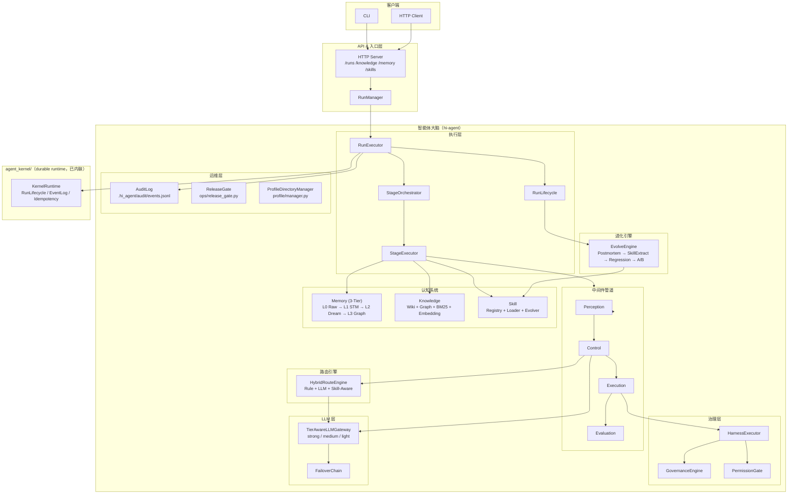

# hi-agent

`hi-agent` 是基于 **TRACE**（Task → Route → Act → Capture → Evolve）框架构建的企业级智能体系统。  
负责任务理解、路由决策、能力执行、记忆沉淀与持续进化；底层持久化运行时由内联的 `agent_kernel/` 承载。

---

## 系统定位

| 仓库 / 包 | 职责 | 位置 |
|-----------|------|------|
| `hi_agent/` | 智能体大脑：策略、路由、执行、记忆/知识/技能、持续进化 | 本仓库 |
| `agent_kernel/` | Durable runtime：run 生命周期、事件事实、幂等与恢复治理 | 本仓库（已内联，2026-04-19） |
| `agent-core` | 通用能力模块：工具、检索、MCP 等 | 集成到 hi_agent/ |

---

## 架构概览



---

## 10 核心概念

| 概念 | 定义 |
|------|------|
| **Task** | 形式化任务契约（目标、约束、预算）`contracts/task.py` |
| **Run** | 可持久化的长时执行实体 `runner.py` |
| **Stage** | 任务推进的形式阶段（TRACE S1→S5） `runner_stage.py` |
| **Branch** | 探索空间中的逻辑轨迹 `trajectory/` |
| **Task View** | 每次模型调用前重建的最小充分上下文 `task_view/` |
| **Action** | 通过 Harness 执行的外部操作 `harness/` |
| **Memory** | 智能体经历的三层记忆（短/中/长期） `memory/` |
| **Knowledge** | 稳定知识（wiki + 图谱 + 四层检索） `knowledge/` |
| **Skill** | 可复用流程单元（5 阶段生命周期 + 版本进化） `skill/` |
| **Feedback** | 结果、评测与实验产生的优化信号 `evolve/` |

---

## 目录结构

```text
hi_agent/
  artifacts/           # ArtifactRegistry、OutputToArtifactAdapter（类型化产出物管理）
  auth/                # RBAC、JWT、SOC Guard；AuthorizationContext；operation_policy（mutation 路由守卫）
  capability/          # 能力注册、调用（同步/异步）、熔断器；output_budget_tokens 截断；GovernedToolExecutor（中央治理入口）
  config/              # TraceConfig (95+ 参数) + SystemBuilder；CognitionBuilder；RuntimeBuilder；ProfileAwareConfigStack
  context/             # ContextManager、RunContext、RunContextManager
  contracts/           # 核心契约（Task/Run/Stage/Branch）；ExecutionProvenance（结构化执行来源）
  evaluation/          # EvaluatorRuntime（运行时评估注入）
  evolve/              # Postmortem、SkillExtractor、RegressionDetector、ChampionChallenger
  execution/           # StageOrchestrator（线性/图/恢复遍历策略）；ActionDispatcher；GateCoordinator；RunFinalizer
  failures/            # FailureCode 分类、异常、采集与恢复映射
  harness/             # HarnessExecutor、GovernanceEngine、PermissionGate、EvidenceStore
  knowledge/           # KnowledgeManager、Wiki、Graph、RetrievalEngine、TF-IDF/BM25/Embedding
  llm/                 # TierAwareLLMGateway、AnthropicLLMGateway、HttpLLMGateway、FailoverChain、PromptCacheInjector、ModelRegistry；流式/思考/多模态
  management/          # ops 运维命令（config_history、ops_timeline、ops_snapshot、runtime_config）
  mcp/                 # MCPServer、MCPHealth、MCPBinding；StdioMCPTransport（重启退避）；SchemaDriftRegistry（schema 漂移告警）
  memory/              # L0 Raw → L1 STM → L2 MidTerm → L3 LongTermGraph + Compressor + Retriever
  middleware/          # MiddlewareOrchestrator + 4 Middlewares (Perception/Control/Execution/Evaluation)
  observability/       # MetricsCollector、NotificationService、TrajectoryExporter；audit.py；Tracer；FallbackTaxonomy
  ops/                 # diagnostics、doctor_report；ReleaseGateReport（7 门禁含 prod_e2e_recent）
  profile/             # ProfileDirectoryManager（HI_AGENT_HOME 优先链：explicit > env > ~/.hi_agent）
  profiles/            # ProfileRegistry（运行时能力 profile 管理）
  recovery/            # 补偿与恢复编排
  replay/              # 确定性回放引擎
  route_engine/        # Rule/LLM/Hybrid/SkillAware RouteEngine + DecisionAuditStore
  runtime/             # ProfileRuntimeResolver；AsyncBridgeService（进程级共享 ThreadPoolExecutor）
  runtime_adapter/     # RuntimeAdapter Protocol（22 方法）、KernelFacadeAdapter、AsyncKernelFacadeAdapter、ResilientKernelAdapter
  samples/             # TRACE 示例管道（register_trace_capabilities；S1→S5 stage 配置）
  server/              # HTTP Server（20+ 端点）、RunManager、EventBus、DreamScheduler；routes_tools_mcp
  session/             # RunSession、CostCalculator
  skill/               # SkillRegistry、SkillLoader、SkillMatcher、SkillEvolver、SkillVersionManager
  state_machine/       # StateMachine + 6 TRACE 状态定义
  task_mgmt/           # AsyncTaskScheduler、BudgetGuard、RestartPolicyEngine、ReflectionOrchestrator
  task_view/           # TaskView Builder、AutoCompress、TokenBudget
  task_decomposition/  # DAG/Tree/Linear 任务分解
  trajectory/          # TrajectoryGraph、StageGraph、GreedyOptimizer、DeadEndDetector
  workflows/           # WorkflowContracts（工作流契约定义）
  runner.py            # RunExecutor 主入口（execute / execute_graph / execute_async / resume）
  runner_stage.py      # StageExecutor 阶段执行委托
  runner_lifecycle.py  # 结束流程、postmortem、知识摄入、进化触发
  runner_telemetry.py  # 事件与指标记录
agent_kernel/          # Durable runtime（2026-04-19 内联，原为外部 git dep）
  adapters/facade/     # KernelFacade — 平台唯一合法入口
  kernel/              # 六权威：EventLog、Projection、Admission、Executor、Recovery、Dedupe
  service/             # HTTP API server（Starlette）；http_server.py 为所有端点的单一权威
  substrate/           # LocalFSMAdaptor（默认）/ TemporalAdaptor（可选）
config/                # llm_config.json（本地，gitignored）+ llm_config.example.json（模板）
                       # volces provider 含 all_models 列表供 live API 测试使用
scripts/               # verify_llm.py — 流式/思考/多模态冒烟验证
tests/                 # 11,100+ 测试，全部通过（2026-04-19）
  integration/         # test_live_llm_api.py — 33 条 live API 测试（8 个 Volces Ark 模型）
  fixtures/            # fake_llm_http_server、fake_kernel_http_server、fake_mcp_stdio_server
  golden/              # dev_smoke 黄金路径 3 层测试
  security/            # 安全拒绝路径测试（tool governance / path policy / URL policy / auth posture）
  perf/                # 性能基线测试（context cache / async bridge / retrieval warmup）
docs/                  # 架构、规格、研究文档、sprint 跟踪、runbook
  runbook/             # deploy.md、verify.md、rollback.md、incident-mcp-crash.md、incident-evolve-unexpected-mutation.md
  sprints/             # W1–W12 sprint 文档与 retro
  migration/           # contract-changes-2026-04-17.md（执行来源 + manifest + RBAC 变更通知）
```

---

## 快速开始

```bash
# 安装依赖（agent-kernel 已内联，无需 submodule）
python -m pip install -e ".[dev]"

# 本地执行（不依赖 server）
python -m hi_agent run --goal "Analyze quarterly revenue data" --local

# 指定 HI_AGENT_HOME（profile / episode / checkpoint 目录）
python -m hi_agent run --goal "Analyze data" --local --home /data/hi_agent

# 携带完整 TaskContract 字段本地执行
python -m hi_agent run --goal "Analyze data" --local \
  --risk-level low \
  --task-family quick_task \
  --acceptance-criteria '["required_stage:synthesize"]' \
  --constraints '["no_external_calls"]' \
  --deadline "2099-12-31T23:59:59Z" \
  --budget '{"max_llm_calls": 10}'

# 启动 API server
python -m hi_agent serve --host 127.0.0.1 --port 8080

# 从 checkpoint 恢复
python -m hi_agent resume --checkpoint checkpoint_run-001.json
```

---

## CLI 用法

```bash
# 本地执行
python -m hi_agent run --goal "Summarize logs" --local

# 远程执行
python -m hi_agent --api-host 127.0.0.1 --api-port 8080 run --goal "Summarize logs"

# 查询状态
python -m hi_agent --api-port 8080 status --run-id <run_id> --json

# 健康检查
python -m hi_agent --api-port 8080 health --json

# 进化模式控制（tri-state: auto / on / off）
HI_AGENT_EVOLVE_MODE=on python -m hi_agent run --goal "..."
```

> 注：API 请求默认超时 15 秒，可通过 `HI_AGENT_API_TIMEOUT_SECONDS` 覆盖。

---

## Public API

Minimal Python usage example:

```python
from hi_agent import RunExecutorFacade, check_readiness

report = check_readiness()
facade = RunExecutorFacade()
facade.start("run-001", profile_id="proj-A", model_tier="medium", skill_dir="skills/")
result = facade.run("Summarize the TRACE framework in one paragraph")
facade.stop()
```

---

## API 核心端点

| 端点 | 方法 | 功能 |
|------|------|------|
| `/runs` | POST | 提交任务（支持 TaskContract 全部 13 字段） |
| `/runs/{id}/events` | GET | SSE 实时事件流 |
| `/runs/{id}/resume` | POST | 从 checkpoint 恢复 |
| `/runs/{id}/resolve-escalation` | POST | 恢复 human_escalation 挂起的 run |
| `/ready` | GET | 平台就绪检查（200=ready，503=not ready；含 `evolve_source`） |
| `/manifest` | GET | 系统能力清单（`runtime_mode`、`evolve_policy`、`provenance_contract_version`、`contract_field_status`） |
| `/knowledge/ingest` | POST | 文本摄取 |
| `/knowledge/query` | GET | 知识查询 |
| `/memory/dream` | POST | 触发 Dream 整合 |
| `/memory/consolidate` | POST | 触发长期图整合（需 `approver` 角色） |
| `/skills/evolve` | POST | 触发技能进化（需 `approver` 角色） |
| `/skills/{id}/promote` | POST | Challenger → Champion（需 `approver` 角色 + SOC 分离） |
| `/context/health` | GET | 上下文预算状态 |
| `/mcp/tools/list` | POST | MCP 工具枚举 |
| `/metrics` | GET | Prometheus 格式指标 |

---

## 下游系统接入指南

### 1. 配置真实 LLM（local-real 模式）

服务默认以 `dev-smoke` 启动（heuristic 回退，无需 API Key）。要接入真实模型，设置以下环境变量：

```bash
# 以 DeepSeek/Volces 兼容端点为例
export HI_AGENT_LLM_DEFAULT_PROVIDER=openai
export HI_AGENT_OPENAI_BASE_URL=https://ark.cn-beijing.volces.com/api/v3
export OPENAI_API_KEY=<your-api-key>
export HI_AGENT_LLM_MODE=real
export HI_AGENT_KERNEL_MODE=http

# 验证模式
curl -s http://127.0.0.1:8080/ready | jq '{runtime_mode, execution_mode}'
# 期望：{ "runtime_mode": "local-real", "execution_mode": "local" }
```

若使用 Anthropic：

```bash
export HI_AGENT_LLM_DEFAULT_PROVIDER=anthropic
export ANTHROPIC_API_KEY=<your-api-key>
export HI_AGENT_LLM_MODE=real
export HI_AGENT_KERNEL_MODE=http
```

---

### 2. 创建 Run 并观察阶段进度

```bash
# 创建 Run
RUN_ID=$(curl -s -X POST http://127.0.0.1:8080/runs \
  -H 'Content-Type: application/json' \
  -d '{"goal":"Summarize recent product feedback","task_family":"quick_task","risk_level":"low"}' \
  | jq -r .run_id)

echo "Run ID: $RUN_ID"

# 轮询状态（含阶段进度，新增字段）
curl -s http://127.0.0.1:8080/runs/$RUN_ID \
  | jq '{state, current_stage, stage_updated_at, updated_at}'

# 订阅实时事件（SSE）— 在独立终端运行
curl -N http://127.0.0.1:8080/runs/$RUN_ID/events
# 会收到 stage_start / stage_complete / RunStarted 等事件
```

响应示例（运行中）：

```json
{
  "state": "running",
  "current_stage": "S3_build",
  "stage_updated_at": "2026-04-20T12:05:21Z",
  "updated_at": "2026-04-20T12:00:01Z"
}
```

---

### 3. 端到端验证脚本

```bash
#!/usr/bin/env bash
# hi-agent 下游端到端验证脚本
# 用法：bash scripts/e2e_verify.sh [API_BASE]

API=${1:-http://127.0.0.1:8080}

echo "=== Step 1: 就绪检查 ==="
READY=$(curl -sf $API/ready)
echo "$READY" | jq '{runtime_mode, execution_mode}'
RUNTIME_MODE=$(echo "$READY" | jq -r .runtime_mode)

echo ""
echo "=== Step 2: 连续创建 3 个 Run（验证 run_id 唯一性） ==="
for i in 1 2 3; do
  curl -sf -X POST $API/runs \
    -H 'Content-Type: application/json' \
    -d "{\"goal\":\"smoke $i\",\"task_family\":\"quick_task\",\"risk_level\":\"low\"}" \
    | jq -c '{run_id, state}'
done

echo ""
echo "=== Step 3: 创建 Run 并等待终态（≤60s） ==="
RUN_ID=$(curl -sf -X POST $API/runs \
  -H 'Content-Type: application/json' \
  -d '{"goal":"Verify end-to-end execution","task_family":"quick_task","risk_level":"low"}' \
  | jq -r .run_id)

echo "Run ID: $RUN_ID"
for i in $(seq 1 30); do
  RESP=$(curl -sf $API/runs/$RUN_ID)
  STATE=$(echo "$RESP" | jq -r .state)
  STAGE=$(echo "$RESP" | jq -r .current_stage)
  echo "[${i}] state=$STATE  current_stage=$STAGE"
  [ "$STATE" = "completed" ] || [ "$STATE" = "failed" ] && echo "==> 终态: $STATE" && break
  sleep 2
done

echo ""
echo "=== Step 4: 验证 runtime_mode ==="
if [ "$RUNTIME_MODE" = "local-real" ] || [ "$RUNTIME_MODE" = "prod-real" ]; then
  echo "PASS: 真实 LLM 模式 ($RUNTIME_MODE)"
else
  echo "INFO: 当前为 $RUNTIME_MODE（heuristic 模式，设置 LLM env var 可切换到 local-real）"
fi
```

将脚本保存为 `scripts/e2e_verify.sh` 后直接执行：

```bash
bash scripts/e2e_verify.sh http://127.0.0.1:8080
```

---

### 4. 可观测性端点汇总

| 端点 | 用途 | 示例 |
|------|------|------|
| `GET /ready` | 就绪状态 + runtime_mode | `curl $API/ready \| jq .` |
| `GET /runs/{id}` | Run 状态 + **current_stage** + stage_updated_at | `curl $API/runs/$RUN_ID \| jq .` |
| `GET /runs/{id}/events` | SSE 实时事件（stage_start/complete/RunStarted） | `curl -N $API/runs/$RUN_ID/events` |
| `GET /manifest` | 系统能力清单（runtime_mode/evolve_policy/provenance） | `curl $API/manifest \| jq .` |
| `GET /metrics` | Prometheus 格式指标 | `curl $API/metrics` |
| `GET /context/health` | 上下文预算状态 | `curl $API/context/health \| jq .` |

---

## 关键能力

### 模型分层路由与多模态 LLM
`TierAwareLLMGateway` 按任务目的自动路由：`strong`（Opus）/ `medium`（Sonnet）/ `light`（Haiku），配合 `FailoverChain` 凭证轮转与 `PromptCacheInjector` 降低成本。

- **流式输出**：`stream()` 通过 httpx 返回 `Iterator[LLMStreamChunk]`，增量文本（`delta`）与思考过程（`thinking_delta`）分流传出。
- **Extended Thinking**：`LLMRequest(thinking_budget=N)` 开启单请求思考；`llm_config.json` 中 `features.thinking_budget` 设置 gateway 级默认值。
- **Multimodal**：`messages[].content` 接受 content block 列表，支持图文混合输入。
- **第三方代理**：`config/llm_config.json` 通过 `api_format`（`"anthropic"` / `"openai"`）+ `base_url` 接入 DashScope、Volces Ark 等兼容端点。

### LLM 配置（config/llm_config.json）

所有 LLM 参数通过 `config/llm_config.json` 流入（本地文件，gitignored；从 `config/llm_config.example.json` 复制模板）：

| Provider | api_format | 用途 |
|----------|-----------|------|
| `anthropic` | `anthropic` | 生产主力（Claude Opus/Sonnet/Haiku） |
| `openai` | `openai` | 备选 |
| `dashscope` | `anthropic` | 国内 Anthropic 协议代理 |
| `volces` | `openai` | Volces Ark 统一代理（8 个模型：doubao/minimax/glm/deepseek/kimi） |

`tests/conftest.py` 在测试会话启动时自动加载此文件，设置 `VOLCE_API_KEY` / `VOLCE_BASE_URL` 环境变量，CI 可通过 env var 覆盖。

### SystemBuilder 三层分拆
`SystemBuilder` 职责拆分为三个专职 Builder：

| Builder | 职责 |
|---------|------|
| `CognitionBuilder` | LLM gateway 选择、failover chain、prompt cache、budget tracker、cost optimizer、regression detector、evolve engine |
| `RuntimeBuilder` | kernel adapter（HTTP/LocalFSM）、metrics collector、middleware orchestrator、restart policy engine |
| `SystemBuilder` | 装配协调：调用上述两个 Builder，装配 memory/knowledge/skill/harness/server |

### StageOrchestrator
`hi_agent/execution/stage_orchestrator.py` 从 `RunExecutor` 提取遍历策略：
- `run_linear()` — 顺序线性遍历（S1→S5）
- `run_graph()` — 动态 DAG 遍历含回溯
- `run_resume()` — 从 checkpoint 恢复续跑

### RuntimeAdapter 契约锁定
`hi_agent/runtime_adapter/protocol.py` 定义 22 方法的 `RuntimeAdapter` 协议；`agent_kernel/service/http_server.py` 是所有端点的单一权威。每次变更两者必须同步审计并在 PR 中附端点对照表（Rule 7）。

### 执行来源（ExecutionProvenance）
每个 `RunResult` 携带 `execution_provenance`，包含 `contract_version`、`runtime_mode`、`llm_mode`、`fallback_used`、`fallback_reasons`、`evidence` 等字段。

### 进化三态策略（evolve_mode）
`TraceConfig.evolve_mode: Literal["auto", "on", "off"]`：
- `auto`：`dev-smoke` → 开启；`local-real` / `prod-real` → 关闭
- `on`：强制开启，prod 环境下额外写入 `audit.evolve.explicit_on` 审计事件
- `off`：强制关闭

### RBAC/SOC 操作驱动授权

| 操作 | 所需角色 | SOC 分离 |
|------|---------|----------|
| `skill.promote` | `approver` / `admin` | 是（submitter ≠ approver） |
| `skill.evolve` | `approver` / `admin` | 是 |
| `memory.consolidate` | `approver` / `admin` | 否 |

### 工作区隔离（Workspace Isolation）
平台级多租户隔离，按 `(tenant_id, user_id, session_id)` 三维主键对所有资源边界进行强隔离：
- **WorkspaceKey / WorkspacePathHelper**：`private()` / `team()` 统一计算存储路径；`_safe_slug()` 对路径穿越字符 SHA-256 哈希防护。
- **TeamEventStore / TeamSpace**：SQLite WAL + threading.Lock；`GET /team/events` 按 `team_space_id` 隔离。
- **验收测试 1–20**：跨用户 run 访问、SSE 重放、内存路径隔离、路径穿越 fuzz、多进程并发写入均已覆盖。

### 治理与安全（GovernedToolExecutor）
- **PathPolicy**（`security/path_policy.py`）：拒绝路径穿越（`../`）、绝对路径、符号链接逃逸、Windows UNC 路径。
- **URLPolicy**（`security/url_policy.py`）：拒绝 loopback、私有 IP、云元数据 IP（169.254.169.254）、`file://`。
- **shell_exec** 在 `prod-real` profile 下默认禁用。

### 认知三系统
- **记忆**：L0 原始事件 → L1 短期（会话压缩）→ L2 中期（Dream 整合）→ L3 长期（语义图谱）。
- **知识**：Wiki（`[[wikilinks]]` 风格）+ 知识图谱 + 四层检索（Grep → BM25 → Graph → Embedding）。
- **技能**：SKILL.md 定义 + `SkillLoader` token 预算注入 + `ChampionChallenger` A/B 版本管理 + `SkillEvolver` textual gradient 优化。

---

## 开发与验证

```bash
# Lint
python -m ruff check hi_agent agent_kernel tests scripts

# 全量离线测试
python -m pytest tests/ -q --ignore=tests/integration/test_live_llm_api.py
# 11,097 passed, 15 skipped, 0 failures（2026-04-19）

# Live API 测试（需 config/llm_config.json 配置 volces.api_key，或设置 VOLCE_API_KEY）
python -m pytest tests/integration/test_live_llm_api.py -m live_api -v
# 33 passed（8 个 Volces Ark 模型 × 5 场景）

# LLM 配置验证
python scripts/verify_llm.py                            # 流式测试
python scripts/verify_llm.py --thinking                 # + 思考模式
python scripts/verify_llm.py --multimodal path/to.png   # + 多模态

# 触发 Dream 记忆整合
curl -X POST http://localhost:8080/memory/dream

# 查询知识
curl "http://localhost:8080/knowledge/query?q=revenue+trends&limit=5"

# 触发技能进化（需 approver 角色）
curl -X POST http://localhost:8080/skills/evolve \
  -H "X-Role: approver" -H "X-Submitter: alice" -H "X-Approver: bob"

# 查看 Team Space 事件
curl "http://localhost:8080/team/events?since_id=0" \
  -H "X-Tenant-Id: t1" -H "X-User-Id: u1" -H "X-Session-Id: s1"

# 查看发布门禁状态
curl http://localhost:8080/ready | jq '{runtime_mode, evolve_source, release_gate}'

# 查看执行来源
curl -s -X POST http://localhost:8080/runs \
  -H 'Content-Type: application/json' \
  -d '{"goal":"smoke"}' | jq '.execution_provenance'
```

---

## 参考文档

- [ARCHITECTURE.md](./ARCHITECTURE.md) — L0 系统边界（含组件角色、集成点、LLM 配置）
- [hi_agent/ARCHITECTURE.md](./hi_agent/ARCHITECTURE.md) — L1 hi-agent 详细架构（时序图、数据流图、接口关系图）
- [agent_kernel/ARCHITECTURE.md](./agent_kernel/ARCHITECTURE.md) — L1 agent-kernel 详细架构
- [docs/sprints/](./docs/sprints/) — W1–W12 sprint 文档与 retro
- [docs/runbook/](./docs/runbook/) — deploy、verify、rollback、incident runbook
- [docs/migration/contract-changes-2026-04-17.md](./docs/migration/contract-changes-2026-04-17.md) — 执行来源 + manifest + RBAC 变更通知
