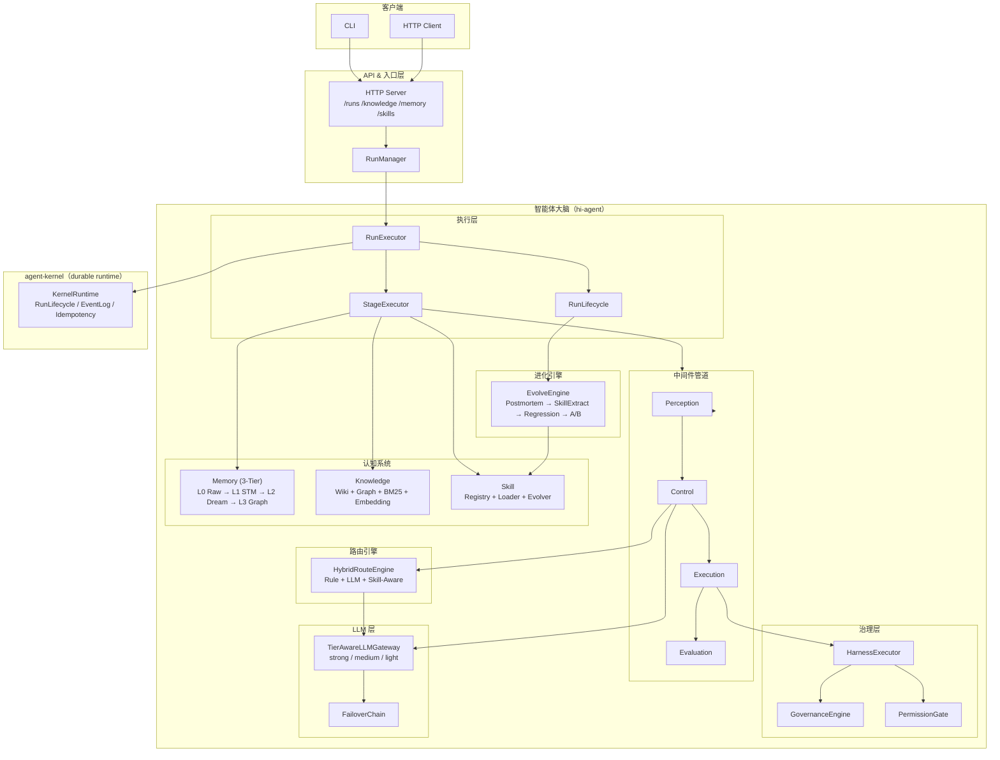

# hi-agent

`hi-agent` 是基于 **TRACE**（Task → Route → Act → Capture → Evolve）框架构建的企业级智能体系统。  
负责任务理解、路由决策、能力执行、记忆沉淀与持续进化；底层持久化运行时由 `agent-kernel` 承载。

---

## 系统定位

| 仓库 | 职责 |
|------|------|
| `hi-agent`（本仓库） | 智能体大脑：策略、路由、执行、记忆/知识/技能、持续进化 |
| `agent-kernel` | durable runtime：run 生命周期、事件事实、幂等与恢复治理 |
| `agent-core` | 通用能力模块：工具、检索、MCP 等（集成到 hi-agent） |

---

## 架构概览



---

## 10 核心概念

| 概念 | 定义 |
|------|------|
| **Task** | 形式化任务契约（目标、约束、预算）`contracts/task.py` |
| **Run** | 可持久化的长时执行实体 `runner.py` |
| **Stage** | 任务推进的形式阶段（TRACE S1→S5） `runner_stage.py` |
| **Branch** | 探索空间中的逻辑轨迹 `trajectory/` |
| **Task View** | 每次模型调用前重建的最小充分上下文 `task_view/` |
| **Action** | 通过 Harness 执行的外部操作 `harness/` |
| **Memory** | 智能体经历的三层记忆（短/中/长期） `memory/` |
| **Knowledge** | 稳定知识（wiki + 图谱 + 四层检索） `knowledge/` |
| **Skill** | 可复用流程单元（5 阶段生命周期 + 版本进化） `skill/` |
| **Feedback** | 结果、评测与实验产生的优化信号 `evolve/` |

---

## 目录结构

```text
hi_agent/
  artifacts/           # ArtifactRegistry、OutputToArtifactAdapter（类型化产出物管理）
  capability/          # 能力注册、调用（同步/异步）、熔断器
  config/              # TraceConfig (95+ 参数) + SystemBuilder 装配
  context/             # ContextManager、RunContext、RunContextManager
  contracts/           # 核心契约与数据模型（Task/Run/Stage/Branch）；TaskContract 13 字段含消费级别标注
  evaluation/          # EvaluatorRuntime（运行时评估注入）
  evolve/              # Postmortem、SkillExtractor、RegressionDetector、ChampionChallenger
  failures/            # FailureCode 分类、异常、采集与恢复映射
  harness/             # HarnessExecutor、GovernanceEngine、PermissionGate、EvidenceStore
  knowledge/           # KnowledgeManager、Wiki、Graph、RetrievalEngine、TF-IDF/BM25/Embedding
  llm/                 # TierAwareLLMGateway、FailoverChain、PromptCacheInjector、ModelRegistry
  mcp/                 # MCPServer、MCPHealth、MCPBinding；transport.py（可选传输层）
  memory/              # L0 Raw → L1 STM → L2 MidTerm → L3 LongTermGraph + Compressor + Retriever
  middleware/          # MiddlewareOrchestrator + 4 Middlewares (Perception/Control/Execution/Evaluation)
  observability/       # MetricsCollector、NotificationService、TrajectoryExporter
  profiles/            # ProfileRegistry（运行时能力 profile 管理）
  recovery/            # 补偿与恢复编排
  replay/              # 确定性回放引擎
  route_engine/        # Rule/LLM/Hybrid/SkillAware RouteEngine + DecisionAuditStore
  runtime/             # ProfileRuntimeResolver（profile → 运行时能力绑定）
  runtime_adapter/     # RuntimeAdapter Protocol、KernelFacadeAdapter、AsyncKernelFacadeAdapter、ResilientKernelAdapter
  samples/             # TRACE 示例管道（register_trace_capabilities；S1→S5 stage 配置）
  security/            # Auth、RBAC、JWT、SOC Guard
  server/              # HTTP Server（20+ 端点）、RunManager、EventBus、DreamScheduler
  session/             # RunSession、CostCalculator
  skill/               # SkillRegistry、SkillLoader、SkillMatcher、SkillEvolver、SkillVersionManager
  state_machine/       # StateMachine + 6 TRACE 状态定义
  task_mgmt/           # AsyncTaskScheduler、BudgetGuard、RestartPolicyEngine、ReflectionOrchestrator
  task_view/           # TaskView Builder、AutoCompress、TokenBudget
  task_decomposition/  # DAG/Tree/Linear 任务分解
  trajectory/          # TrajectoryGraph、StageGraph、GreedyOptimizer、DeadEndDetector
  workflows/           # WorkflowContracts（工作流契约定义）
  runner.py            # RunExecutor 主入口（execute / execute_graph / execute_async / resume）
  runner_stage.py      # StageExecutor 阶段执行委托
  runner_lifecycle.py  # 结束流程、postmortem、知识摄入、进化触发
  runner_telemetry.py  # 事件与指标记录
tests/                 # 2812 个测试，全部通过（2026-04-15 回归）
docs/                  # 架构、规格、研究文档
```

---

## 快速开始

```bash
# 安装依赖（含 agent-kernel submodule）
git submodule update --init --recursive
python -m pip install -e ".[dev]"

# 本地执行（不依赖 server）
python -m hi_agent run --goal "Analyze quarterly revenue data" --local

# 携带完整 TaskContract 字段本地执行
python -m hi_agent run --goal "Analyze data" --local \
  --risk-level low \
  --task-family quick_task \
  --acceptance-criteria '["required_stage:synthesize"]' \
  --constraints '["no_external_calls"]' \
  --deadline "2099-12-31T23:59:59Z" \
  --budget '{"max_llm_calls": 10}'

# 启动 API server
python -m hi_agent serve --host 127.0.0.1 --port 8080

# 从 checkpoint 恢复
python -m hi_agent resume --checkpoint checkpoint_run-001.json
```

---

## CLI 用法

```bash
# 本地执行
python -m hi_agent run --goal "Summarize logs" --local

# 远程执行
python -m hi_agent --api-host 127.0.0.1 --api-port 8080 run --goal "Summarize logs"

# 查询状态
python -m hi_agent --api-port 8080 status --run-id <run_id> --json

# 健康检查
python -m hi_agent --api-port 8080 health --json
```

> 注：API 请求默认超时 15 秒，可通过 `HI_AGENT_API_TIMEOUT_SECONDS` 覆盖。

---

## API 核心端点

| 端点 | 方法 | 功能 |
|------|------|------|
| `/runs` | POST | 提交任务（支持 TaskContract 全部 13 字段） |
| `/runs/{id}/events` | GET | SSE 实时事件流 |
| `/runs/{id}/resume` | POST | 从 checkpoint 恢复 |
| `/ready` | GET | 平台就绪检查（200=ready，503=not ready） |
| `/manifest` | GET | 系统能力清单（含 `contract_field_status`：ACTIVE/PASSTHROUGH/QUEUE_ONLY） |
| `/knowledge/ingest` | POST | 文本摄取 |
| `/knowledge/query` | GET | 知识查询 |
| `/memory/dream` | POST | 触发 Dream 整合 |
| `/skills/evolve` | POST | 触发技能进化 |
| `/skills/{id}/promote` | POST | Challenger → Champion |
| `/context/health` | GET | 上下文预算状态 |
| `/mcp/tools/list` | POST | MCP 工具枚举 |
| `/metrics` | GET | Prometheus 格式指标 |

---

## 关键能力

### 模型分层路由
`TierAwareLLMGateway` 按任务目的自动路由：`strong`（Claude Opus）/ `medium`（Sonnet）/ `light`（Haiku），配合 `FailoverChain` 凭证轮转与 `PromptCacheInjector` 降低成本。同步 `complete()` 与异步 `acomplete()` 均经由 tier 选择，异步路径不绕过分层策略。

### 中间件管道
`Perception → Control → Execution → Evaluation` 四中间件 + 5 阶段生命周期钩子（`pre_create → pre_execute → execute → post_execute → pre_destroy`）。`MiddlewareOrchestrator` 所有结构变更（`add/replace/remove_middleware`、`add/remove_hook`）均持锁执行；`run()` 入口以快照隔离，消除并发执行与结构修改之间的竞态。

### 认知三系统
- **记忆**：L0 原始事件 → L1 短期（会话压缩）→ L2 中期（Dream 整合）→ L3 长期（语义图谱）。`MemoryCompressor` 压缩上限（`max_findings`/`max_decisions`/`max_entities`/`max_tokens`）可通过 `TraceConfig` 独立配置。
- **知识**：Wiki（`[[wikilinks]]` 风格）+ 知识图谱 + 四层检索（Grep → BM25 → Graph → Embedding）。`WikiStore.load()` 对单页格式损坏具备容错能力，跳过损坏文件并记录警告，不影响整体加载。
- **技能**：SKILL.md 定义 + `SkillLoader` token 预算注入 + `ChampionChallenger` A/B 版本管理 + `SkillEvolver` textual gradient 优化

### 持续进化
每次 run 完成后：`PostmortemAnalyzer` → `SkillExtractor`（提取候选技能）→ `RegressionDetector`（检测退化）→ `ChampionChallenger`（A/B 对比）→ 自动注册/晋升技能。

### 治理与安全
`HarnessExecutor` 包裹所有能力调用，`GovernanceEngine` 按 `EffectClass + SideEffectClass` 双维度分级，`PermissionGate` 细粒度工具级授权，`EvidenceStore` 全量审计记录。

---

## 开发与验证

```bash
python -m ruff check .       # lint
python -m pytest -q           # 2812 tests, all passing

# 触发 Dream 记忆整合
curl -X POST http://localhost:8080/memory/dream

# 查询知识
curl "http://localhost:8080/knowledge/query?q=revenue+trends&limit=5"

# 触发技能进化
curl -X POST http://localhost:8080/skills/evolve
```

---

## 依赖说明

- `agent-kernel`：通过固定 commit 引用（`git submodule`），减少 tag 漂移风险。
- Windows 安装如遇 submodule 路径问题：

```bash
python -m pip install -e ../agent-kernel --no-deps
python -m pip install -e ".[dev]"
```

---

## 参考文档

- [ARCHITECTURE.md](./ARCHITECTURE.md) — 完整架构设计（含时序图、数据流图、接口关系图）
- [docs/module-evolution-analysis.md](./docs/module-evolution-analysis.md)
- [docs/agent-kernel-evolution-proposal.md](./docs/agent-kernel-evolution-proposal.md)
- [docs/specs/](./docs/specs/) — 各子系统规格文档
