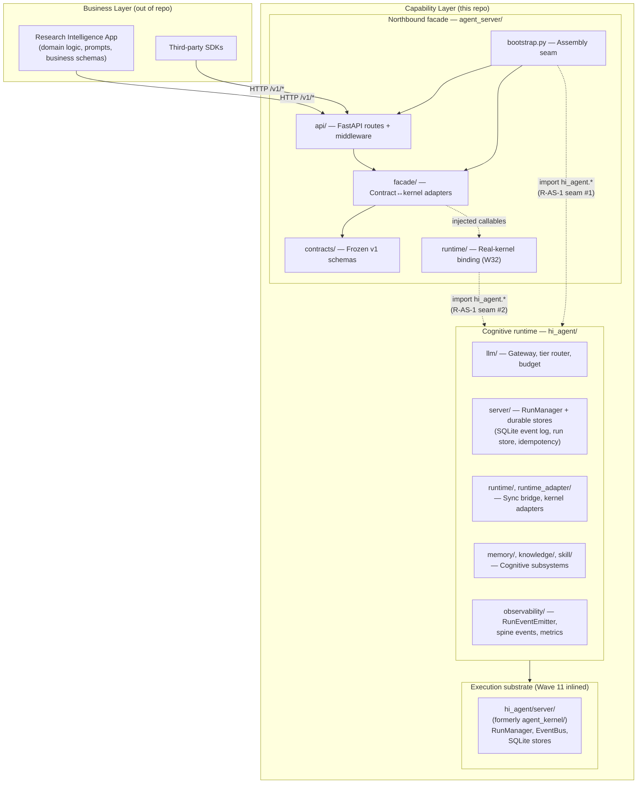

# hi-agent

**Capability layer for autonomous agent execution.**
hi-agent is the platform that the Research Intelligence App (RIA) and other downstream applications build on top of. It packages a cognitive runtime, durable execution substrate, and a versioned northbound HTTP facade — and refuses to host business logic.

**TRACE** = Task → Route → Act → Capture → Evolve. The five-stage execution model is the kernel's contract for every run.

---

## Architecture Positioning

hi-agent is built around six properties that downstream consumers should be able to rely on:

- **Idempotent.** Every mutating northbound route accepts an `Idempotency-Key`. Same key + tenant + body returns byte-identical responses; same key + different body returns 409.
- **Stable.** The v1 contract surface is frozen. `agent_server/contracts/` is digest-snapshotted; breaking changes go to a parallel `v2/` sub-package, never in-place.
- **Extensible.** New capabilities register via plugin hooks (skill, MCP, capability registry); the v1 surface gains additive routes without touching v1 contract types.
- **Evolvable.** ExperimentStore + ChampionChallenger + recurrence-ledger drive A/B versioning and rollback. Skill evolution is closed-loop with operationally-observable alerts.
- **Configurable.** Posture-aware defaults (`dev` permissive / `research` and `prod` fail-closed) flow from `HI_AGENT_POSTURE` through every subsystem; `TraceConfig` + `ConfigStack` support hot-reload.
- **Sustainable.** Seventeen engineering rules in `CLAUDE.md` are CI-enforced. Every contract crossing a tenant boundary carries `tenant_id`. Every silent-degradation path has a metric, log, and gate-asserted alarm.

The platform enforces a hard boundary between platform-layer logic (this repo) and business-layer logic (research team). All downstream integration goes through `agent_server/` HTTP routes only; direct imports of `hi_agent.*` from downstream code are not supported.

---

## Quickstart

**Requirements:** Python 3.12+

### Install

```bash
git clone <repo-url> hi-agent
cd hi-agent
pip install -e ".[llm,dev]"
```

### Smoke

```bash
pytest -m "not live_api and not network and not requires_secret"
```

Current baseline: 9,135 passed (Wave 28, default-offline profile, 2026-05-02).

### Start the northbound API server

```bash
agent-server serve --host 0.0.0.0 --port 8080
```

To use a real LLM provider and fail-closed research posture:

```bash
export HI_AGENT_POSTURE=research
export HI_AGENT_LLM_MODE=real
export OPENAI_API_KEY=<your-key>
agent-server serve --prod
```

### Submit a run

```bash
agent-server run --goal "summarise quarterly results" --profile default
```

Or via HTTP:

```bash
curl -s -X POST http://localhost:8080/v1/runs \
  -H "Content-Type: application/json" \
  -H "X-Tenant-Id: tenant-a" \
  -H "Idempotency-Key: $(uuidgen)" \
  -d '{"goal": "summarise quarterly results", "profile_id": "default", "project_id": "proj-1"}'
```

### Cancel a run and stream events

```bash
agent-server cancel <run_id>
agent-server tail-events <run_id>
```

---

## Architecture Overview



Three repository packages cooperate:

| Package | Role |
|---|---|
| `agent_server/` | Versioned northbound HTTP facade (v1 contract frozen); the **only contract surface** RIA depends on |
| `hi_agent/` | Cognitive runtime: LLM gateway, runner, memory, knowledge, skills, config, observability |
| `agent_kernel/` (Wave 11 inlined) | Execution substrate now part of `hi_agent/server/`: run lifecycle, event log, idempotency, durable persistence |

R-AS-1 (single-seam discipline): only `agent_server/bootstrap.py` and `agent_server/runtime/` may import `hi_agent.*`. CI enforces.

Detailed architecture: [`docs/architecture-reference.md`](docs/architecture-reference.md). Per-subsystem docs in §[Reference Map](#reference-map).

---

## Project Status

| Wave | Headline | Status |
|---|---|---|
| W1–W11 | Foundation: cognitive runtime, TRACE S1–S5, agent_kernel inlined | closed |
| W12 | Default-path hardening; Rules 14–17 codified | closed |
| W13–W15 | Systemic class closures; 35-gate infrastructure | closed |
| W16 | Observability spine + chaos + operator drill | closed |
| W17–W18 | Manifest discipline + governance gap definitions | closed |
| W19 | Scope-aware caps + 6 class closures (verified=86.6) | closed |
| W20 | 10 defect classes (CL1–CL10); raw=88.7 | closed |
| W21–W22 | Continuous closure (verified rebound to 80.0) | closed |
| W23 | 8 parallel tracks + 3 cleanups (verified=94.55) | closed |
| W24 | Agent server MVP (5 routes + idempotency + CLI) | closed |
| W25 | PM2 drill + contract freeze + git-worktree dispatch | closed |
| W26 | Hidden-gap closure pass | closed |
| W27 | 17 lanes closed; PR#17; soak deferred | closed |
| W28 | Architectural 7×24 tier (`run_arch_7x24.py`); soak retired | closed |
| W29–W30 | Substantive closure passes | closed |
| W31 | RIA directive 13/14 IDs PASS; verified=55.0 (capped by `soak_evidence_not_real`); 79/91 hidden findings closed | closed |
| W32 | Real-kernel binding for v1 northbound; ARCHITECTURE refresh; hidden-gap closure; cleanup | **in this PR** |

Current verified readiness: 55.0 (W31 cap — expected 75 post-soak). Architectural 7×24: 5/5 PASS at HEAD `953d36cb`.

| Capability | Level | Notes |
|---|---|---|
| Run execution (TRACE S1–S5) | L3 | Long-lived process, real LLM, durable queue |
| TierRouter | L3 | Active calibration, signal-weight routing (P-6 closed W27) |
| ExtensionRegistry | L4 | Full lifecycle, rollback, third-party registration |
| PostmortemEngine | L2 | Wired into RunManager; `on_project_completed` hook |
| StageDirective wiring | L3 | `skip_to` + `insert_stage` + `replan` wired |
| Multi-agent team | L2 | `TeamRunSpec`; registry; not production-default |
| Knowledge graph | L2 | SQLite backend; four-layer retrieval (no v1 northbound route) |
| Evolution closed-loop | L2 | `ExperimentStore` rollback; recurrence-ledger observable |
| MCP tools | L2 | `StdioMCPTransport`; plugin-registered (v1 route is L1 stub) |
| Observability spine | L3 | `RunEventEmitter` (12 event types); real provenance enforced |
| agent_server v1 contract | L3 | Frozen at SHA `8c6e22f1`; production default |

Maturity levels: L0 demo · L1 tested component · L2 public contract · L3 production default · L4 ecosystem ready (Rule 13).

---

## Key Environment Variables

| Variable | Default | Effect |
|---|---|---|
| `HI_AGENT_POSTURE` | `dev` | Execution posture: `dev` permissive, `research`/`prod` fail-closed (Rule 11) |
| `HI_AGENT_LLM_MODE` | `heuristic` | `real` routes to actual LLM provider |
| `HI_AGENT_ENV` | `dev` | `prod` enables fail-fast 503 on missing credentials |
| `HI_AGENT_KERNEL_BASE_URL` | – | Routes kernel RPC to a detached service (deprecated; W11 inlined) |
| `AGENT_SERVER_BACKEND` | `stub` (W31) → `real` (W32 default under research/prod) | `real` binds `RealKernelBackend` from `agent_server/runtime/`; `stub` keeps `_InProcessRunBackend` for default-offline tests |
| `AGENT_SERVER_STATE_DIR` | – | Persistent state directory (idempotency SQLite, future stores) |
| `HI_AGENT_HOME` | – | Fallback state-dir parent: `$HI_AGENT_HOME/.agent_server` |
| `OPENAI_API_KEY` / `ANTHROPIC_API_KEY` / `VOLCES_API_KEY` | – | LLM provider credentials |

Full environment matrix: [`docs/deployment-env-matrix.md`](docs/deployment-env-matrix.md).

---

## Reference Map

Per-subsystem architecture docs (each follows the standard 11-section template, all diagrams in mermaid):

| Subsystem | Document |
|---|---|
| Top-level agent_server | [`agent_server/ARCHITECTURE.md`](agent_server/ARCHITECTURE.md) |
| HTTP routes + middleware | [`agent_server/api/ARCHITECTURE.md`](agent_server/api/ARCHITECTURE.md) |
| Contract↔kernel adaptation | [`agent_server/facade/ARCHITECTURE.md`](agent_server/facade/ARCHITECTURE.md) |
| Frozen v1 contracts | [`agent_server/contracts/ARCHITECTURE.md`](agent_server/contracts/ARCHITECTURE.md) |
| Real-kernel binding (W32) | [`agent_server/runtime/ARCHITECTURE.md`](agent_server/runtime/ARCHITECTURE.md) |
| hi_agent server kernel | `hi_agent/server/ARCHITECTURE.md` (W32 Track F2) |
| hi_agent runtime/harness | `hi_agent/runtime/ARCHITECTURE.md` (W32 Track F2) |
| hi_agent runtime_adapter | `hi_agent/runtime_adapter/ARCHITECTURE.md` (W32 Track F2) |
| LLM gateway | `hi_agent/llm/ARCHITECTURE.md` (W32 Track F2) |
| Observability spine | `hi_agent/observability/ARCHITECTURE.md` (W32 Track F2) |
| Memory layer | `hi_agent/memory/ARCHITECTURE.md` (W32 Track F2) |
| Knowledge layer | `hi_agent/knowledge/ARCHITECTURE.md` (W32 Track F2) |
| Skill subsystem | `hi_agent/skill/ARCHITECTURE.md` (W32 Track F2) |
| Capability registry | `hi_agent/capability/ARCHITECTURE.md` (W32 Track F2) |

Codebase reference (canonical module index, R-AS rules, gate map): [`docs/architecture-reference.md`](docs/architecture-reference.md).

---

## Contributing

| Pointer | Purpose |
|---|---|
| [`CLAUDE.md`](CLAUDE.md) | Seventeen engineering rules + ownership tracks + narrow-trigger rules. CI-enforced. |
| [`docs/superpowers/plans/`](docs/superpowers/plans/) | Wave-by-wave implementation plans (W12 onward); W32 plan: `2026-05-03-wave-32-real-kernel-binding-and-cleanup.md` |
| [`docs/governance/`](docs/governance/) | Closure taxonomy, evidence-provenance schema, allowlists, recurrence ledger |
| [`docs/platform/`](docs/platform/) | Public surface descriptions: `agent-server-northbound-contract-v1.md`, runtime profile guide |
| [`docs/downstream-responses/`](docs/downstream-responses/) | Wave delivery notices to downstream teams |

Owner tracks govern review responsibilities (see `CLAUDE.md`):

| Track | Scope |
|---|---|
| CO | Contracts, schemas, posture |
| RO | Execution, state machines, persistence |
| DX | CLI, config, developer tooling |
| TE | Artifacts, observability, evolution |
| GOV | CI, delivery governance, CLAUDE.md |
| AS-CO | `agent_server` contracts (v1 frozen) |
| AS-RO | `agent_server` routes, facades, CLI, runtime |

Every PR must declare its owner track in the commit body. Hot-path changes require T3 gate evidence at `docs/delivery/`. Pre-commit checklist (Rule 3) is mandatory.

---

## License

Proprietary — internal platform use only. Not for external distribution.
