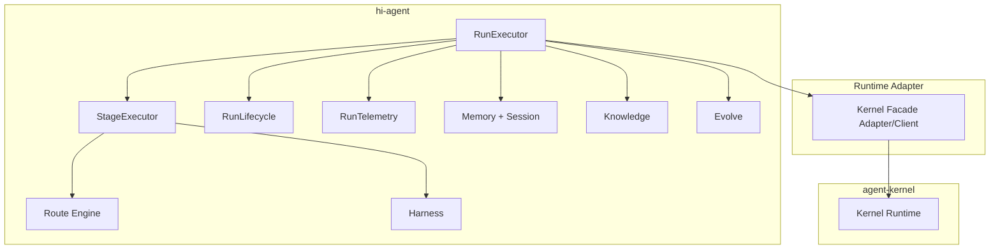

# hi-agent

`hi-agent` 是基于 TRACE（Task, Route, Act, Capture, Evolve）方法构建的智能体系统实现。  
它负责任务理解、路由决策、能力执行、记忆沉淀与持续进化；底层运行时治理由 `agent-kernel` 承载。

## 系统定位

- `hi-agent`：智能体大脑与编排层（策略、路由、执行、恢复、进化）。
- `agent-kernel`：durable runtime（run 生命周期、事件事实、幂等与恢复治理）。
- `agent-core`：可复用能力模块（工具、检索、MCP 等）。

## 当前架构概览



## 目录结构（按实现）

```text
hi_agent/
  capability/        # 能力注册、调用、熔断、重试
  context/           # 上下文预算与健康管理
  contracts/         # 核心契约与数据模型
  evolve/            # postmortem、回归检测、技能提取
  failures/          # 失败分类、异常、采集与映射
  harness/           # 执行治理与人类门禁
  knowledge/         # 图谱、检索、知识管理
  llm/               # 模型网关、路由、预算与分层
  memory/            # 分层记忆、压缩、检索
  middleware/        # 感知/执行/控制中间件编排
  observability/     # 指标、通知、追踪上下文
  replay/            # 运行回放与记录
  route_engine/      # 规则/LLM/混合路由与审计
  runtime_adapter/   # 对接 agent-kernel 的协议与容错适配
  server/            # API server 与 run manager
  session/           # run session 与成本跟踪
  skill/             # skill 生命周期、观测、版本与演进
  task_mgmt/         # 调度、预算守卫、重试、反思
  task_view/         # 任务视图与压缩
  testing/           # 对 agent-kernel.testing 的桥接导出
  trajectory/        # 阶段图与分支轨迹执行
  runner.py          # 主执行入口（同步/图执行/恢复）
  runner_stage.py    # 阶段执行委托
  runner_lifecycle.py# 结束流程、后处理、postmortem
  runner_telemetry.py# 观测与事件记录
tests/
docs/
```

## 快速开始

```bash
git submodule update --init --recursive
python -m pip install -e ".[dev]"
python -m hi_agent run --goal "Analyze quarterly revenue data" --local
python -m hi_agent serve --host 127.0.0.1 --port 8080
```

## CLI 用法

```bash
# 本地执行（不依赖 server）
python -m hi_agent run --goal "Summarize logs" --local

# 远程执行（通过 API server）
python -m hi_agent --api-host 127.0.0.1 --api-port 8080 run --goal "Summarize logs"

# 查询状态
python -m hi_agent --api-port 8080 status
python -m hi_agent --api-port 8080 status --run-id <run_id> --json

# 健康检查
python -m hi_agent --api-port 8080 health
python -m hi_agent --api-port 8080 health --json

# 从 checkpoint 恢复
python -m hi_agent resume --checkpoint checkpoint_run-0001.json
```

说明：
- CLI API 请求默认超时 15 秒，可通过 `HI_AGENT_API_TIMEOUT_SECONDS` 覆盖。
- `run --json` 在远程调用失败时会返回非零退出码（便于脚本/CI 判定）。

## 开发与验证

```bash
python -m ruff check .
python -m pytest -q
```

## 依赖与安装说明

- 当前 `agent-kernel` 通过固定 commit 引用，减少 tag 漂移风险。
- 若 Windows 环境安装 `agent-kernel` 遇到 submodule 路径问题，可临时使用：

```bash
python -m pip install -e ../agent-kernel --no-deps
python -m pip install -e ".[dev]"
```

## 参考文档

- [ARCHITECTURE.md](./ARCHITECTURE.md)
- [docs/agent-kernel-evolution-proposal.md](./docs/agent-kernel-evolution-proposal.md)
