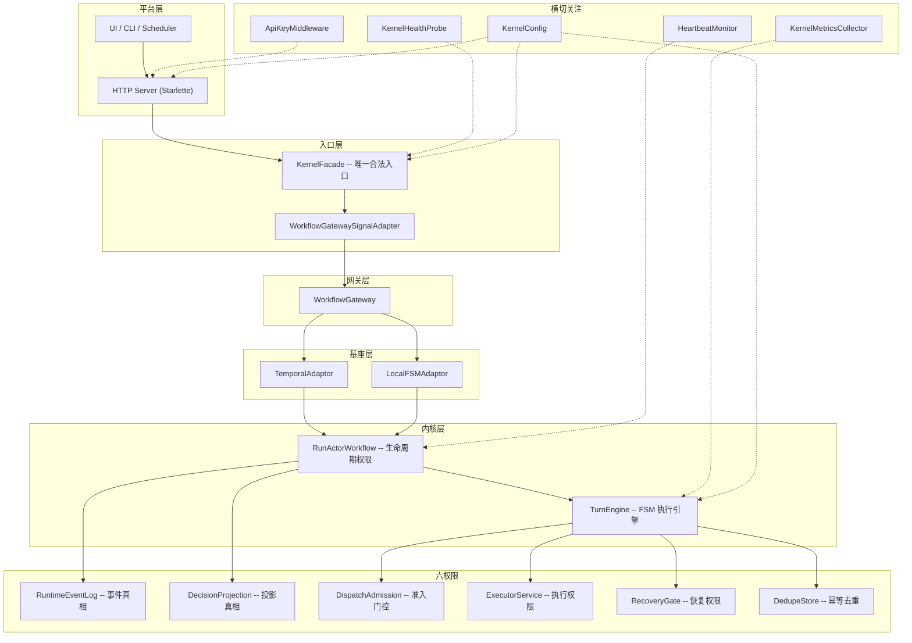
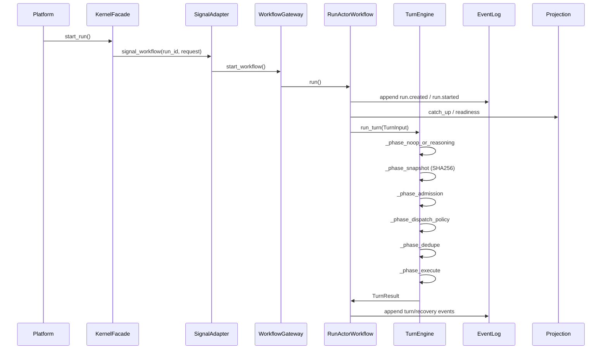
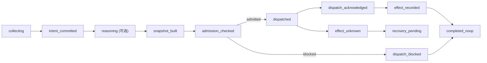
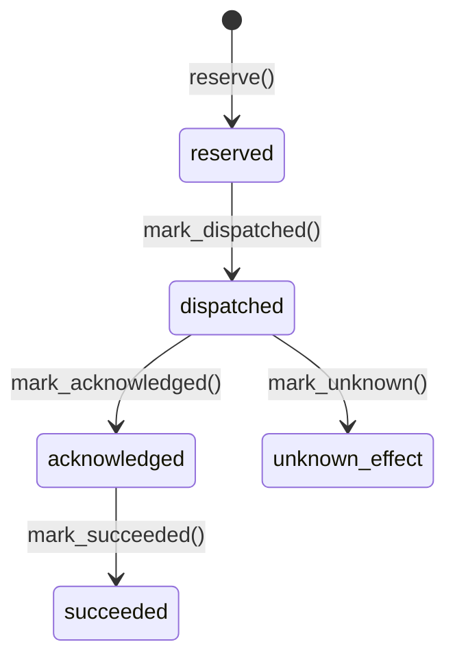

# ARCHITECTURE: agent_kernel (L1 Detail)

> **Architecture hierarchy**
> - L0 system boundary: [`../ARCHITECTURE.md`](../ARCHITECTURE.md)
> - L1 hi-agent detail: [`../hi_agent/ARCHITECTURE.md`](../hi_agent/ARCHITECTURE.md)
> - L1 agent-kernel detail: this file

> Last updated: 2026-05-02 (Wave 28). Style baseline: Google Python Style Guide.

agent-kernel v0.2.0 -- 企业级 Agent 内核，基于六权限生命周期协议构建。

---

## 1. 架构分层



边界约束:

- 平台层必须通过 `KernelFacade` 访问内核，不得旁路写状态。
- 生命周期推进由 `RunActorWorkflow` 统一驱动。
- 六权限之间不可旁路调用，每一层只能通过上层权限入口进入下层。
- 查询走投影 (projection)，不直接拼装事件。
- Temporal 工作流是纯耐久壳：所有业务逻辑在内核服务中实现。

---

## 2. 六权限模型

| 权限 | 实现 | 职责 | 核心不变量 |
|------|------|------|-----------|
| **RunActor** | `substrate/temporal/run_actor_workflow.py` | 生命周期权限；拥有 run 推进循环 | 只有 RunActor 写 run 级生命周期事件 |
| **RuntimeEventLog** | `kernel/minimal_runtime.py`, `kernel/persistence/` | Append-only 事件真相源 | 事件一旦写入不可变更；所有状态变化必须经过事件 |
| **DecisionProjection** | `kernel/minimal_runtime.py`, `kernel/persistence/sqlite_projection_cache.py` | 投影真相；从 `authoritative_fact` 和 `derived_replayable` 事件重放构建 | 投影可从事件日志完整重建；`derived_diagnostic` 事件不参与重放 |
| **DispatchAdmission** | `kernel/admission/snapshot_driven_admission.py` (生产); `kernel/minimal_runtime.py` (PoC/测试) | 外部副作用唯一门控；5 规则顺序评估流水线 | `approval_state` 为 pending/denied/revoked/expired 时，`permission_mode` 强制为 readonly |
| **ExecutorService** | `kernel/turn_engine.py` (ExecutorPort) | 执行权限；准入通过后分发动作 | 执行必须先通过 Admission 和 DedupeStore |
| **RecoveryGate** | `kernel/recovery/gate.py` | 失败恢复决策 | 恢复结果写入 `RecoveryOutcomeStore`，不修改事件日志 |

---

## 3. 核心数据流

### 3.1 启动链路

```
Platform -> KernelFacade.start_run(StartRunRequest)
         -> WorkflowGatewaySignalAdapter
         -> WorkflowGateway.start_workflow()
         -> RunActorWorkflow.run()
         -> EventLog.append(run.created, run.started)
         -> Projection.catch_up()
```

### 3.2 执行链路 (TurnEngine FSM)



### 3.3 信号链路

```
Platform -> KernelFacade.signal_run(SignalRunRequest)
         -> WorkflowGatewaySignalAdapter.signal_workflow(run_id, request)
         -> WorkflowGateway.signal_workflow()
         -> RunActorWorkflow 接收信号
         -> EventLog.append(signal.received)
         -> Projection.catch_up() -> 触发下一轮 TurnEngine
```

`WorkflowGatewaySignalAdapter` (`adapters/facade/workflow_gateway_adapter.py`) 在 `KernelFacade.__init__` 中被自动包裹，将所有信号调用统一规范化为 `signal_workflow(run_id, request)` 接口，屏蔽旧版 `signal_run(request)` 的差异。

### 3.4 Trace 事件链路

Facade 层管理 branch / stage / human-gate 生命周期，将状态变更写入事件日志以支持跨实例一致性:

```
KernelFacade.open_branch() -> EventLog.append(trace.branch_opened)
KernelFacade.mark_branch_state() -> EventLog.append(trace.branch_state_changed)
KernelFacade.open_stage() -> EventLog.append(trace.stage_opened)
KernelFacade.mark_stage_state() -> EventLog.append(trace.stage_state_changed)
KernelFacade.open_human_gate() -> EventLog.append(trace.human_gate_opened)
KernelFacade.submit_approval() -> EventLog.append(trace.human_gate_resolved)
```

新的 Facade 实例通过增量重放事件日志重建 branch/stage/gate 内存状态，实现冷启动一致性。

`KernelFacade` 还持有一个 `task_registry: TaskRegistry` 引用（在 `_build_boundary_components()` 中以 `InMemoryTaskEventLog` 构造）。这是面向平台的**任务生命周期追踪 API**；`TurnEngine` 和 `RunActorWorkflow` 不直接与 `TaskRegistry` 交互 — 它不属于六权限内核 FSM 的一部分。

---

## 4. TurnEngine FSM

### 4.1 阶段流水线



内置阶段 (`_TURN_PHASES` 有序元组):

1. `_phase_noop_or_reasoning` -- 判空或调用 ReasoningLoop
2. `_phase_snapshot` -- 构建 CapabilitySnapshot (SHA256)
3. `_phase_admission` -- 准入门控
4. `_phase_dispatch_policy` -- 远程服务策略评估
5. `_phase_dedupe` -- 幂等去重保留
6. `_phase_execute` -- 执行器分发

### 4.2 扩展机制

```python
# 方式一: 子类扩展
class CustomEngine(TurnEngine):
    _TURN_PHASES = TurnEngine._TURN_PHASES + ("_phase_custom_audit",)

# 方式二: 动态注册
TurnEngine.register_phase("_phase_custom_audit", after="_phase_admission")
```

`register_phase()` 支持 `after` / `before` 锚点插入，在模块导入时调用。

---

## 5. 状态模型

`RunLifecycleState` 取值:

| 状态 | 含义 | 终态 |
|------|------|------|
| `created` | Run 已创建，尚未开始 | 否 |
| `ready` | 就绪，等待下一轮 turn | 否 |
| `dispatching` | 动作已准入，正在分发 | 否 |
| `waiting_result` | 等待外部工具/MCP 结果 | 否 |
| `waiting_external` | 等待外部回调 | 否 |
| `recovering` | 恢复门控活跃中 | 否 |
| `completed` | 正常完成 | 是 |
| `failed` | 运行失败 | 是 |
| `aborted` | 外部取消或致命错误 | 是 |

终态规则: `completed` / `failed` / `aborted` 是终态，不允许被任何后续事件覆盖。外部信号不直接等于状态，必须通过事件映射和投影重放生效。

---

## 6. 幂等与去重

两层去重机制:

### 6.1 DecisionDeduper (工作流层)

在 RunActor 层对决策指纹进行去重，防止重复的 turn 决策。

**生产默认**: `SQLiteDecisionDeduper` (`kernel/persistence/sqlite_decision_deduper.py`)

- Schema: `decision_fingerprints(fingerprint TEXT PK, run_id TEXT, created_at REAL)`
- WAL 模式，线程安全 (`threading.Lock`)
- 协议: `async seen(fingerprint) -> bool`, `async mark(fingerprint, run_id) -> None`
- 通过 `RuntimeDecisionDedupeConfig` 配置:
  - `backend: "sqlite"` (默认) 或 `"in_memory"`
  - `sqlite_database_path: ":memory:"` (默认) 或绝对路径

`InMemoryDecisionDeduper` 仅用于 PoC / 单元测试，不可用于生产（`_enforce_production_safety()` 会拦截）。

### 6.2 DedupeStore (执行器层)

在 Executor 边界实现 at-most-once 分发语义。

状态机:



约束:
- 状态转换单调递增，不可回退。
- `IdempotencyEnvelope` 携带 `dispatch_idempotency_key`、`operation_fingerprint`、`capability_snapshot_hash`。
- 重复的 `reserve()` 调用返回 `reason="duplicate"` 并附带已有记录。

---

## 7. 恢复与熔断

### 7.1 RecoveryMode

| 模式 | 含义 |
|------|------|
| `static_compensation` | 静态补偿: 执行已注册的补偿处理器 |
| `human_escalation` | 升级到人工审查 |
| `abort` | 中止 run |
| `reflect_and_retry` | LLM 反思 + 生成修正动作后重试（依赖认知服务层，见第 13 节） |

模式通过 `KERNEL_RECOVERY_MODE_REGISTRY` 注册，可扩展。

### 7.2 Circuit Breaker (熔断器)

`PlannedRecoveryGateService` 内置按 `effect_class` 分类的熔断器:

- **CLOSED**: 失败计数 < `threshold` (默认 5)。正常放行。
- **OPEN**: 失败计数 >= threshold 且冷却期 (`half_open_after_ms`, 默认 30s) 未过。立即 abort。
- **HALF-OPEN**: 冷却期过后，允许一次探针请求。成功则 reset，失败则重回 OPEN。

支持可选的持久化 `CircuitBreakerStore`，使熔断状态跨进程共享。

### 7.3 CompensationRegistry

注册 `effect_class -> handler` 映射。若 planner 选择 `static_compensation` 但无对应 handler，自动降级为 `abort`。

### 7.4 FailureCodeRegistry

`FailureCodeRegistry` 提供 `TraceFailureCode -> recovery_action / gate_type` 映射框架。内核默认注册表为空，具体映射由平台层 (如 hi-agent) 在启动时注入。

### 7.5 人工升级解决

当选择 `human_escalation` 恢复模式时，工作流写入 `run.waiting_external` 事件并挂起。运维人员通过以下方式解决升级：

```
POST /runs/{run_id}/resolve-escalation
  Body: {"resolution_notes": "...", "caused_by": "..."}
    -> KernelFacade.resolve_escalation(run_id, resolution_notes=..., caused_by=...)
    -> 向 RunActorWorkflow 发送 recovery_succeeded 信号
    -> 写入 trace.escalation_resolved 事件
    -> 工作流恢复执行下一轮 turn
```

`resolve_escalation` 是面向平台的 `KernelFacade` 方法；它不绕过六权限 FSM — 而是通过标准信号路径重新进入。该方法属于 `KernelFacade` 公开调用方 API，下游系统（如 hi-agent）应在其 `RuntimeAdapter` 协议中暴露对应接口。

---

## 8. 可观测性

### 8.1 KernelMetricsCollector

线程安全的进程内指标收集器 (`runtime/metrics.py`)。实现 `ObservabilityHook` 协议:

| 指标 | 类型 | 标签 |
|------|------|------|
| `runs_started_total` | counter | -- |
| `runs_completed_total` | counter | `outcome` |
| `turns_executed_total` | counter | `outcome` |
| `active_runs` | gauge | -- |
| `recovery_decisions_total` | counter | `mode` |
| `llm_calls_total` | counter | `model_ref` |
| `action_dispatches_total` | counter | `outcome` |
| `admission_evaluations_total` | counter | `outcome` |
| `dispatch_attempts_total` | counter | `dedupe_outcome` |
| `circuit_breaker_trips_total` | counter | `effect_class` |
| `parallel_branch_results_total` | counter | `outcome` |
| `reflection_rounds_total` | counter | `corrected` |

通过 `GET /metrics` 端点导出 JSON 快照。

### 8.2 健康探针

`KernelHealthProbe` (`runtime/health.py`) 提供 K8s 兼容的三级探针:

| 探针 | 路径 | 语义 |
|------|------|------|
| liveness | `GET /health/liveness` | 任意 check 非 UNHEALTHY 即通过 |
| readiness | `GET /health/readiness` | 所有 check 均为 OK 才通过 |
| startup | (编程式) | 仅检查 `required_for_startup=True` 的 check |

内置 factory: `sqlite_dedupe_store_health_check`、`event_log_health_check`、`sqlite_lock_contention_health_check`。

### 8.3 HeartbeatMonitor

`RunHeartbeatMonitor` (`runtime/heartbeat.py`) -- 每 run 活跃度追踪器:

- 实现 `ObservabilityHook`，自动接收 FSM 状态转换。
- 按状态配置超时阈值 (dispatching=5min, waiting_result=10min, waiting_external=1hr, waiting_human_input=24hr, recovering=3min)。
- `watchdog_once()` 扫描所有追踪 run，对超时 run 注入 `heartbeat_timeout` 信号。
- `HeartbeatWatchdog` 封装后台 asyncio 定时任务。
- **不是第七个权限** -- 仅通过 hook 侧通道观察，通过 gateway 信号接口行动。

`KernelSelfHeartbeat` -- 内核组件活跃度检查:
- 异步探测 EventLog 和 Projection 可达性，缓存结果供同步 HealthCheckFn 使用。

---

## 9. 持久化

### 9.1 存储后端

| 后端 | 用途 | 适用场景 |
|------|------|---------|
| In-memory | `minimal_runtime.py` 中的所有协议实现 | 测试 / PoC 仅 |
| `SQLiteDecisionDeduper` | `kernel/persistence/sqlite_decision_deduper.py` — 决策指纹去重 | 本地持久化 / 生产默认 |
| `SQLiteDedupeStore` | 执行器层 at-most-once 去重；全量 Protocol 实现（含 `count_by_run`） | 本地持久化 / 轻量部署 |
| `ColocatedSQLiteBundle` | 共享单连接原子写入（EventLog + DedupeStore 同一事务）；`_SharedConnectionDedupeStore` 全量 Protocol 实现 | 本地持久化 / 轻量部署 |
| SQLite ProjectionCache | `sqlite_projection_cache.py` — 投影快照加速重启 | 本地持久化 / 轻量部署 |
| PostgreSQL | EventLog、DedupeStore、RecoveryOutcome（路径已支持）；`PostgresDedupeStore` 全量 Protocol 实现 | 规模化生产 |

### 9.2 ProjectionSnapshotCache

`sqlite_projection_cache.py` -- SQLite 持久化投影快照:

- 进程重启后，`CachedDecisionProjectionService` 从 SQLite 种子投影，避免全量事件重放。
- `catch_up()` 完成后自动持久化最新快照。
- SQLite 配置: `journal_mode=WAL`, `wal_autocheckpoint=1000`。

### 9.3 准入服务滑动窗口限速器

`SnapshotDrivenAdmissionService` 内置进程内滑动窗口限速，不依赖外部存储:

- 每个 `(run_id, policy_id)` 组合维护独立的时间戳队列。
- 窗口大小: 60 秒。
- 超出 `TenantPolicy.max_actions_per_minute` 则返回 `DENY(reason_code="quota_exceeded")`。
- 限速状态随进程生命周期持续，不跨进程共享（如需共享，升级到外部 Redis 等存储）。

### 9.4 EventLog–DedupeStore 一致性检查与修复

进程崩溃可能在 `reserve()` 与事件追加之间留下不一致窗口。`kernel/persistence/consistency.py` 提供只读一致性校验器，`kernel/persistence/dispatch_outbox_reconciler.py` 提供 Saga 模式的自动修复器。

**校验 API：**

```python
# 同步（非 async 上下文）
report = verify_event_dedupe_consistency(event_log, dedupe_store, run_id)

# 异步（内核主路径推荐）
report = await averify_event_dedupe_consistency(event_log, dedupe_store, run_id)
```

两类违规：

| 违规类型 | 触发场景 | 处置 |
|----------|---------|------|
| `orphaned_dedupe_key` | DedupeStore 有 key 但 EventLog 无对应事件（`reserve()` 后崩溃） | 过渡到 `unknown_effect` |
| `unknown_effect_no_log_evidence` | DedupeStore 为 `unknown_effect` 但 EventLog 无 dispatch 证据 | 写 WARNING，人工审查 |

**修复 API：**

```python
reconciler = DispatchOutboxReconciler()
result = await reconciler.reconcile(event_log, dedupe_store, run_id)
# result.violations_found, result.violations_repaired, result.actions
```

`ScheduledOutboxReconciler` 封装后台周期性扫描（默认 300 s），通过 `run_ids_provider` 发现活跃 run 并循环调用 `reconcile()`。

**DedupeStore Protocol 完整性（v0.2.0 全部后端达到完整）：**

| 后端 | `count_by_run` | `mark_succeeded` | 适用场景 |
|------|---------------|-----------------|---------|
| `InMemoryDedupeStore` | ✅ | ✅ | PoC / 测试 |
| `SQLiteDedupeStore` | ✅ | ✅ | 轻量生产 |
| `_SharedConnectionDedupeStore` | ✅ | ✅ | 共享连接（colocated bundle）|
| `PostgresDedupeStore` | ✅ | ✅ | 规模化生产 |

---

## 10. 安全与治理

### 10.1 ApiKeyMiddleware

`service/auth_middleware.py` -- 可选的 Bearer token 认证:

- 从 `Authorization` 头提取 token，与配置的 `api_key` 比对。
- `api_key=None` 时认证禁用 (开放访问)。
- 豁免路径: `/health/liveness`, `/health/readiness`, `/manifest`, `/metrics`, `/openapi.json`。

### 10.2 CapabilitySnapshot SHA256 绑定

`CapabilitySnapshotBuilder` 将运行时能力输入规范化后计算 SHA256 哈希:

- 无序列表字段先排序+去重再序列化。
- 相同语义输入 -> 跨进程相同哈希。
- `schema_version="2"` 用于 model/memory/session/peer binding。

### 10.3 准入门控：SnapshotDrivenAdmissionService

`SnapshotDrivenAdmissionService` (`kernel/admission/snapshot_driven_admission.py`) 是生产环境的默认准入实现，取代 PoC 阶段的 `StaticDispatchAdmissionService`。

入口方法: `admit(action, snapshot) -> AdmissionResult`，顺序执行 5 条规则，**第一条失败即返回 DENY**：

| 规则 # | 名称 | 触发条件 | reason_code |
|--------|------|----------|-------------|
| 1 | Permission Mode | `snapshot.permission_mode == "readonly"` 且动作非只读 | `"permission_denied"` |
| 2 | Binding Existence | `tool_call` 引用未绑定的 `tool_name`；`mcp_call` 引用未绑定的 server/capability；`peer_signal` 引用未绑定的 `peer_run_id` | `"policy_denied"` |
| 3 | Idempotency | 动作标记为 `non_idempotent` + `remote_write` 且策略禁止非幂等远程写 | `"policy_denied"` |
| 4 | Risk Tier | `action.risk_tier > policy.max_allowed_risk_tier` | `"policy_denied"` |
| 5 | Rate Limit | 最近 60 秒内动作数 > `policy.max_actions_per_minute` | `"quota_exceeded"` |

所有 5 条规则通过后返回 `ADMIT`。

**TenantPolicyResolver** 解析策略引用:
- `"policy:default"` → 内置保守策略 (`max_allowed_risk_tier=3`, `allow_non_idempotent_remote_writes=False`, `max_actions_per_minute=120`)
- `"file:///path/to/policy.json"` → 从文件加载

**TenantPolicy** (`kernel/admission/tenant_policy.py`):

```python
@dataclass(frozen=True)
class TenantPolicy:
    policy_id: str
    max_allowed_risk_tier: int = 3
    allow_non_idempotent_remote_writes: bool = False
    max_actions_per_minute: int = 120
```

`StaticDispatchAdmissionService` 仅保留用于 PoC 和单元测试。

---

## 11. 配置

`KernelConfig` (`config.py`) -- 冻结 dataclass，集中管理所有可调参数:

```python
cfg = KernelConfig()              # 所有默认值
cfg = KernelConfig(http_port=9000) # 选择性覆盖
cfg = KernelConfig.from_env()      # 从环境变量构建
```

环境变量前缀: `AGENT_KERNEL_`。完整映射:

| 环境变量 | 字段 | 默认值 |
|---------|------|--------|
| `AGENT_KERNEL_HTTP_PORT` | `http_port` | 8400 |
| `AGENT_KERNEL_API_KEY` | `api_key` | None |
| `AGENT_KERNEL_MAX_TRACKED_RUNS` | `max_tracked_runs` | 10000 |
| `AGENT_KERNEL_DEFAULT_MODEL_REF` | `default_model_ref` | "echo" |
| `AGENT_KERNEL_PHASE_TIMEOUT_S` | `phase_timeout_s` | None |
| `AGENT_KERNEL_CIRCUIT_BREAKER_THRESHOLD` | `circuit_breaker_threshold` | 5 |
| `AGENT_KERNEL_CIRCUIT_BREAKER_HALF_OPEN_MS` | `circuit_breaker_half_open_ms` | 30000 |
| `AGENT_KERNEL_HISTORY_RESET_THRESHOLD` | `history_reset_threshold` | 10000 |
| `AGENT_KERNEL_TEMPORAL_HOST` | `temporal_host` | "localhost:7233" |
| `AGENT_KERNEL_TEMPORAL_NAMESPACE` | `temporal_namespace` | "default" |
| `AGENT_KERNEL_TEMPORAL_TASK_QUEUE` | `temporal_task_queue` | "agent-kernel" |
| `AGENT_KERNEL_LLM_PROVIDER` | `llm_provider` | "" |
| `AGENT_KERNEL_LLM_MODEL` | `llm_model` | "" |
| `AGENT_KERNEL_LLM_API_KEY` | `llm_api_key` | "" |
| `AGENT_KERNEL_SCRIPT_TIMEOUT_S` | `script_timeout_s` | 30.0 |

(完整列表见 `config.py` 中的 `env_map`)

### Posture integration

`agent_kernel` does not own posture — it is purely runtime-substrate. `hi_agent`'s `Posture` (from `HI_AGENT_POSTURE`) governs which backends are required and whether project_id/profile_id are enforced at the hi_agent layer. `agent_kernel` receives authenticated `TenantContext` from `hi_agent`'s auth middleware and uses it for idempotency keying and record spine (tenant_id, project_id, user_id, session_id).

---

## 12. 部署

### 12.1 本地开发（推荐路径）

使用 `docker-compose` 启动完整本地栈（Temporal + Kernel）：

```bash
docker-compose up
```

`docker-compose.yml` 包含:
- `temporal` 服务: 自动初始化（SQLite 持久化），暴露 `7233` 端口
- `kernel` 服务: HTTP 服务 + Worker 合并部署，依赖 `temporal` 健康检查通过后启动
- `kernel-data` volume: 持久化 SQLite 数据

### 12.2 容器构建

Base image: `python:3.12-slim`, non-root user `kernel`. See `Dockerfile` at repo root. Entry point: `uvicorn agent_kernel.service.http_server:create_app_temporal --factory`. `create_app_temporal()` is a Starlette lifespan factory: creates Temporal client, builds `AgentKernelRuntimeBundle` with SQLite backend, starts Temporal Worker as asyncio task.

### 12.3 基座选项

| 基座 | 配置 | 适用场景 |
|------|------|---------|
| Temporal SDK | `TemporalSubstrateConfig(mode="sdk")` | 生产推荐 |
| Temporal Host | `TemporalSubstrateConfig(mode="host")` | 本地 / CI |
| LocalFSM | `LocalSubstrateConfig` | 进程内测试，无 Temporal 依赖 |

LocalFSM 已知限制: `no_child_workflow_isolation`, `no_temporal_history`, `no_cross_process_speculation`。

### 12.3.1 供应商化 Temporal SDK

`external/temporal-sdk-python/` 通过 `git subtree add --squash` 嵌入，版本 1.24.0。

`agent_kernel/substrate/temporal/_sdk_source.py` 中的 `ensure_vendored_source()` 在每次导入 `temporalio` 前被调用，将供应商目录预置到 `temporalio.__path__`（纯 Python 优先，Rust 扩展回退到已安装 wheel）。

升级流程与双开发模式见 `external/VENDORS.md`。

生产环境可省略 `external/` 目录，只需 `pip install ".[temporal]"` 安装 wheel 即可。

**`TemporalGatewayConfig` 关键字段：**

| 字段 | 默认值 | 说明 |
|------|--------|------|
| `task_queue` | `"agent-kernel"` | Worker 监听的 Temporal 任务队列 |
| `workflow_id_prefix` | `"run"` | workflow id 前缀（格式：`{prefix}:{run_id}`） |
| `workflow_run_callable` | `RunActorWorkflow.run` | 工作流入口 callable |
| `signal_method_name` | `"signal"` | 信号 handle 方法名 |
| `query_method_name` | `"query"` | 投影查询方法名 |
| `event_stream_query_method_name` | `None` | **事件流查询方法名（必须设置以启用 SSE 流）**；为 `None` 时调用 `stream_run_events` 抛出 `RuntimeError`，防止静默数据丢失。设置为工作流上注册的查询方法名，例如 `"query_runtime_events"`。 |

### 12.4 CLI 入口与独立 Worker

打包后提供两个 CLI 入口点:

| 命令 | 模块 | 说明 |
|------|------|------|
| `agent-kernel-server` | `agent_kernel.service.http_server` | 启动 HTTP API 服务（含 Worker） |
| `agent-kernel-worker` | `agent_kernel.worker_main` | 仅启动独立 Temporal Worker |

独立 Worker 部署模式 (`worker_main.py`) 引导序列:
1. 读取 `KernelConfig.from_env()`
2. 构建 `HeartbeatPolicy` + `RunHeartbeatMonitor`（状态超时阈值从 config 读取）
3. 构建 `CircuitBreakerPolicy`（threshold / half_open_after_ms 从 config 读取）
4. 连接 Temporal (`AGENT_KERNEL_TEMPORAL_HOST`)
5. 按需构建 LLM 网关：`AGENT_KERNEL_LLM_PROVIDER` 非空时实例化 `AnthropicLLMGateway` 或 `OpenAILLMGateway`，否则认知服务禁用
6. 以 SQLite 后端 build `AgentKernelRuntimeBundle`（传入 strict_mode、heartbeat_monitor、circuit_breaker_policy、llm_gateway）
7. 以 `config.script_timeout_s × 1000` 调用 `configure_local_process_timeout()`，更新 `local_process` 运行时默认超时
8. 启动 Temporal Worker（`worker.run()` 内置 SIGTERM/SIGINT 处理）
9. 并发运行 HeartbeatWatchdog asyncio 任务（轮询间隔 = `heartbeat_min_interval_s`）

生产建议: 将 HTTP 服务和 Worker 分开部署，以便独立扩缩容。

### 12.5 HTTP API 概览

HTTP 路由实现在 `service/http_server.py`（`create_app` / `create_app_temporal` factory）。所有路由通过 `KernelFacade` 调用，不直接访问内核服务。

| 方法 | 路径 | 说明 |
|------|------|------|
| POST | `/runs` | 启动 run |
| GET | `/runs/{run_id}` | 查询 run 状态 |
| GET | `/runs/{run_id}/dashboard` | run 仪表盘 |
| GET | `/runs/{run_id}/trace` | TRACE 运行时视图 |
| GET | `/runs/{run_id}/postmortem` | 事后分析 |
| GET | `/runs/{run_id}/events` | SSE 事件流；Temporal 模式下**必须**在 `TemporalGatewayConfig` 中设置 `event_stream_query_method_name`，否则 `_stream_run_events` 抛出 `RuntimeError`（不再静默返回空流）。LocalFSM 模式无此限制。 |
| POST | `/runs/{run_id}/signal` | 发送信号 |
| POST | `/runs/{run_id}/cancel` | 取消 run |
| POST | `/runs/{run_id}/resume` | 恢复 run |
| POST | `/runs/{run_id}/children` | 创建子 run |
| GET | `/runs/{run_id}/children` | 查询子 run |
| POST | `/runs/{run_id}/approval` | 提交审批 |
| POST | `/runs/{run_id}/stages/{stage_id}/open` | 打开 stage |
| PUT | `/runs/{run_id}/stages/{stage_id}/state` | 更新 stage 状态 |
| POST | `/runs/{run_id}/branches` | 打开 branch |
| PUT | `/runs/{run_id}/branches/{branch_id}/state` | 更新 branch 状态 |
| POST | `/runs/{run_id}/human-gates` | 打开人工审查门 |
| POST | `/runs/{run_id}/resolve-escalation` | 解决人工升级 (`resolve_escalation`) |
| POST | `/runs/{run_id}/task-views` | 记录 task view |
| PUT | `/task-views/{task_view_id}/decision` | 绑定决策 |
| POST | `/tasks` | 注册 task |
| GET | `/tasks/{task_id}/status` | 查询 task 状态 |
| GET | `/actions/{key}/state` | 查询动作去重状态 |
| GET | `/manifest` | 内核清单 |
| GET | `/health/liveness` | 存活探针 |
| GET | `/health/readiness` | 就绪探针 |
| GET | `/metrics` | 指标快照 |
| GET | `/openapi.json` | OpenAPI 规范 |

---

## 13. 认知服务层

认知服务层 (`kernel/cognitive/`) 为内核提供 LLM 推理和脚本执行能力，主要服务于 `reflect_and_retry` 恢复模式下的 `ReasoningLoop`。

### 13.1 LLM 网关

**配置**: `LLMGatewayConfig` (`kernel/cognitive/llm_gateway_config.py`):

```python
@dataclass(frozen=True)
class LLMGatewayConfig:
    provider: str          # "anthropic" 或 "openai"
    model: str
    api_key: str
    max_tokens: int = 4096
    timeout_s: float = 60.0
    temperature: float = 0.0
```

从环境变量构建:
```python
cfg = LLMGatewayConfig.from_env()
# 读取: AGENT_KERNEL_LLM_PROVIDER, AGENT_KERNEL_LLM_MODEL, AGENT_KERNEL_LLM_API_KEY
```

**接口**: `LLMGateway` 协议，单一方法:
```python
async def infer(context, config, idempotency_key) -> ModelOutput
```

**生产实现**:

| 实现类 | 模块 | 依赖 | 安装 |
|--------|------|------|------|
| `AnthropicLLMGateway` | `llm_gateway_anthropic.py` | `anthropic>=0.40` | `pip install agent-kernel[anthropic]` |
| `OpenAILLMGateway` | `llm_gateway_openai.py` | `openai>=1.50`, `tiktoken>=0.7` | `pip install agent-kernel[openai]` |

同时安装两个提供商: `pip install agent-kernel[llm]`

**工厂函数**: `create_llm_gateway(config: LLMGatewayConfig) -> LLMGateway`，根据 `config.provider` 自动选择实现。

`EchoLLMGateway` 仅用于测试/PoC，`_enforce_production_safety()` 会拦截其在生产环境中的使用。

### 13.2 脚本运行时

**生产实现**: `SubprocessScriptRuntime` (`kernel/cognitive/script_runtime_subprocess.py`)

配置 `SubprocessScriptConfig`:

```python
@dataclass(frozen=True)
class SubprocessScriptConfig:
    timeout_s: float = 30.0          # 对应 AGENT_KERNEL_SCRIPT_TIMEOUT_S
    max_output_bytes: int = 1_048_576 # 1 MB
    python_executable: str = sys.executable
```

行为:
- `validate_script(script, host_kind) -> bool`: 通过 `ast.parse` 在隔离子进程中验证脚本语法
- `execute_script(input) -> ScriptResult`: 在独立子进程中执行，强制 timeout，WAL 清理

**生产安全注册表**（`kernel/cognitive/script_runtime.py`）:

- `ScriptRuntimeRegistry.enable_production_mode()` — 在进程启动时调用；阻止分发任何未标记为生产安全的运行时（如 `EchoScriptRuntime`），抛出 `ProductionSafetyViolation`。
- `configure_local_process_timeout(ms)` — 以自定义 `default_timeout_ms` 重新注册 `local_process`；由 `KernelRuntime.start()` 以 `int(KernelRuntimeConfig.script_timeout_s * 1000)` 调用。

**注册表内置运行时 timeout 对称性**（`kernel/cognitive/script_runtime.py`）:

| 运行时 | timeout 来源 | 兜底行为 |
|--------|-------------|---------|
| `InProcessPythonScriptRuntime` | `ScriptActivityInput.timeout_ms` 优先，否则 `default_timeout_ms` | 需调用方传 `int(script_timeout_s * 1000)` 给构造参数 |
| `LocalProcessScriptRuntime` | `ScriptActivityInput.timeout_ms` 优先，否则 `default_timeout_ms` | 内建 30 000 ms 兜底，与 `KernelConfig.script_timeout_s` 一致 |

两个内置运行时均接受 `default_timeout_ms` 构造参数，LLM 未在 action plan 中指定 `timeout_ms` 时自动回退。

`EchoScriptRuntime` 仅用于 PoC/测试。

### 13.3 与 ReasoningLoop 集成

`reflect_and_retry` 恢复路径调用链:

```
RecoveryGateService (reflect_and_retry)
  -> ReasoningLoop.reflect(failure_context)
     -> LLMGateway.infer(context, config, idempotency_key)
     -> OutputParser.parse(raw_output) -> CorrectedAction
  -> TurnEngine 以修正动作重新执行
```

`ReasoningLoop` 每次反思轮次通过 `KernelMetricsCollector` 记录 `reflection_rounds_total` 指标（标签 `corrected=true/false`）。

### 13.4 Bundle 生产安全检查

`AgentKernelRuntimeBundle._enforce_production_safety()` 在 `enabled=True` 且 `environment="prod"` 时拦截所有不安全的 PoC 配置：

| 检查项 | 触发条件 | 动作 |
|--------|----------|------|
| EventLog backend | `backend=in_memory` | `ValueError` |
| DecisionDeduper backend | `backend=in_memory` | `ValueError` |
| DedupeStore backend | `backend=in_memory` | `ValueError` |
| RecoveryOutcome backend | `backend=in_memory` | `ValueError` |
| TurnIntentLog backend | `backend=none` | `ValueError` |
| ContextPort | 实例为 `InMemoryContextPort` | `ValueError` |
| LLM Gateway | 实例为 `EchoLLMGateway` | `ValueError` |
| Executor | `enable_activity_backed_executor=False`（默认 no-op） | `ValueError` |
| TaskEventLog | `InMemoryTaskEventLog`（平台层，无持久化后端） | `warnings.warn`（不阻断） |

任意 `ValueError` 项违规均立即抛出，阻止不合规的生产部署。`InMemoryTaskEventLog` 为平台级关注点，当前无持久化后端，仅发出警告。

---

## Tenant Admission Contract

`agent_kernel/kernel/admission/tenant_policy.py` owns the `TenantPolicy` dataclass and the admission gate logic. This is part of the kernel's declared public surface.

**Invariants:**
- `TenantPolicy` is exported via `agent_kernel.kernel.__init__` when used cross-boundary.
- The admission gate never references provider names, model IDs, or hi_agent strategy classes.
- Callers supply `TenantPolicy` instances; the kernel does not construct them from config files.
