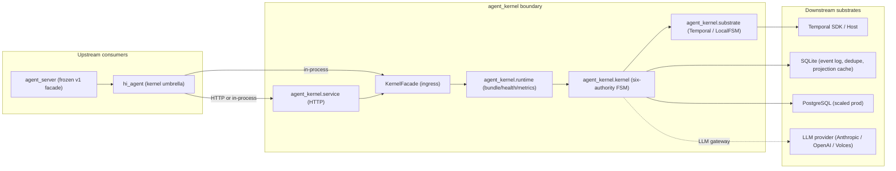
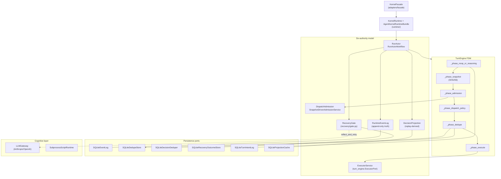
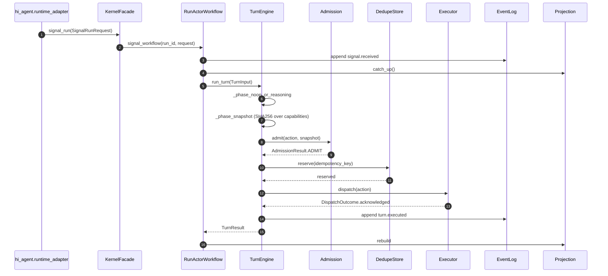
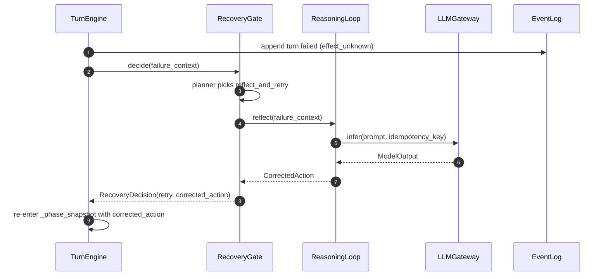

# agent_kernel — Architecture

> **Last refreshed:** 2026-05-06 (W35 corrective close + W36 plans). HEAD `276917d8`.
> **Audience:** platform engineers + RO/AS-RO owners.
> **Status:** authoritative.

> **Hierarchy** — L0 system boundary at `../ARCHITECTURE.md`; L1 hi-agent detail at `../hi_agent/ARCHITECTURE.md`; this file is L1 agent-kernel detail.

---

## 1. Purpose & Responsibilities

`agent_kernel` is the **execution substrate** in the three-package decomposition declared in `CLAUDE.md`:

| Package | Role |
|---|---|
| `agent_server/` | Versioned northbound facade (frozen v1 contract) — owns route handlers, idempotency, MCP, tenancy. |
| `hi_agent/` | Kernel umbrella — owns posture, runtime adapters, server backends, profiles, capabilities. |
| `agent_kernel/` | **Execution substrate** — owns the durable run-actor lifecycle, six-authority FSM, persistence ports, recovery/circuit-breaker primitives. |

The kernel is responsible for **what happens between intent and effect**. Concretely:

- Driving each run through the `RunActorWorkflow` lifecycle (`created → ready → dispatching → waiting_* → recovering → terminal`).
- Enforcing the six-authority model (`RunActor`, `RuntimeEventLog`, `DecisionProjection`, `DispatchAdmission`, `ExecutorService`, `RecoveryGate`) — see §4.
- Providing a single sanctioned ingress (`KernelFacade`) plus an internal HTTP service (`agent_kernel/service/http_server.py`) that hi_agent's runtime adapter calls.
- Owning the persistence ports (event log, dedupe store, recovery outcome store, projection cache, turn-intent log) with both in-memory (PoC/test) and SQLite/Postgres (production) backends.

**Out of scope for the kernel:**

- Tenant identity, project/profile scoping, posture enforcement — owned by `hi_agent` (see §6).
- HTTP route compatibility, contract versioning, idempotency-facade-level replay — owned by `agent_server`.
- Business strategy, model selection, prompt construction — owned by `hi_agent` cognitive layer.

---

## 2. Context & Scope


```mermaid
flowchart LR
  subgraph upstream["Upstream consumers"]
    AS["agent_server (frozen v1 facade)"]
    HA["hi_agent (kernel umbrella)"]
  end

  subgraph kernel_boundary["agent_kernel boundary"]
    SVC["agent_kernel.service (HTTP)"]
    RT["agent_kernel.runtime (bundle/health/metrics)"]
    KF["KernelFacade (ingress)"]
    K["agent_kernel.kernel (six-authority FSM)"]
    SUB["agent_kernel.substrate (Temporal / LocalFSM)"]
  end

  subgraph downstream["Downstream substrates"]
    TEMPORAL["Temporal SDK / Host"]
    SQLITE["SQLite (event log, dedupe, projection cache)"]
    PG["PostgreSQL (scaled prod)"]
    LLM["LLM provider (Anthropic / OpenAI / Volces)"]
  end

  AS --> HA
  HA -->|HTTP or in-process| SVC
  HA -->|in-process| KF
  SVC --> KF
  KF --> RT
  RT --> K
  K --> SUB
  SUB --> TEMPORAL
  K --> SQLITE
  K --> PG
  K -.LLM gateway.-> LLM
```

`hi_agent` consumes the kernel through `hi_agent/runtime_adapter/kernel_facade_client.py`, which supports both `direct` (in-process import of `KernelFacade`) and `http` (call `agent_kernel.service.http_server`) modes — the path/method symmetry between client and server is enforced by the W23 narrow-trigger rule.

---

## 3. Module Boundary & Dependencies

```
agent_kernel/
├── __init__.py            — public surface: KernelFacade, KernelRuntime, LocalSubstrateConfig
├── config.py              — KernelConfig (frozen dataclass, AGENT_KERNEL_* env)
├── adapters/              — facade adapters (KernelFacade, signal-gateway adapter)
├── kernel/                — six-authority core (see §4)
│   ├── admission/         — SnapshotDrivenAdmissionService + TenantPolicy
│   ├── cognitive/         — LLM gateway protocol + script runtime
│   ├── persistence/       — sqlite_*.py and pg_*.py port implementations
│   ├── recovery/          — RecoveryGate, circuit breaker, compensation registry
│   └── task_manager/      — TaskRegistry (platform-facing task lifecycle)
├── runtime/               — kernel-level runtime: Bundle, health, heartbeat, metrics
├── service/               — internal HTTP service (Starlette) — not a public surface
├── substrate/             — Temporal SDK / Host / LocalFSM adaptors
├── skills/                — kernel-side skill primitives
├── testing.py             — test harness factories
└── worker_main.py         — standalone Temporal Worker CLI entry
```

**Boundary rules (enforced):**

1. Public surface is exactly `KernelFacade`, `KernelRuntime`, `LocalSubstrateConfig` (see `agent_kernel/__init__.py`). All other names are internal.
2. The kernel never imports `hi_agent.*` or `agent_server.*` (verified by `scripts/check_no_reverse_imports.py` — already wired in CI per `docs/governance/orphan-gates-audit-2026-05-05.md`).
3. Posture is owned by `hi_agent`. The kernel receives an authenticated `TenantContext` and uses it only for idempotency keying and record spine fields (`tenant_id`, `project_id`, `user_id`, `session_id`).
4. The kernel never references provider names, model IDs, or hi_agent strategy classes inside admission gates (`agent_kernel/kernel/admission/tenant_policy.py`).

---

## 4. Building Blocks


```mermaid
flowchart TB
  KF["KernelFacade<br/>(adapters/facade)"]
  RT["KernelRuntime + AgentKernelRuntimeBundle<br/>(runtime/)"]

  subgraph six["Six-authority model"]
    direction TB
    RA["RunActor<br/>RunActorWorkflow"]
    EL["RuntimeEventLog<br/>(append-only truth)"]
    DP["DecisionProjection<br/>(replay-derived)"]
    DA["DispatchAdmission<br/>SnapshotDrivenAdmissionService"]
    EX["ExecutorService<br/>(turn_engine.ExecutorPort)"]
    RG["RecoveryGate<br/>(recovery/gate.py)"]
  end

  subgraph turn["TurnEngine FSM"]
    direction LR
    P1["_phase_noop_or_reasoning"]
    P2["_phase_snapshot (SHA256)"]
    P3["_phase_admission"]
    P4["_phase_dispatch_policy"]
    P5["_phase_dedupe"]
    P6["_phase_execute"]
    P1 --> P2 --> P3 --> P4 --> P5 --> P6
  end

  subgraph persist["Persistence ports"]
    SEL["SQLiteEventLog"]
    SDS["SQLiteDedupeStore"]
    SDD["SQLiteDecisionDeduper"]
    SROS["SQLiteRecoveryOutcomeStore"]
    STIL["SQLiteTurnIntentLog"]
    SPC["SQLiteProjectionCache"]
  end

  subgraph cog["Cognitive layer"]
    LLMG["LLMGateway (Anthropic/OpenAI)"]
    SR["SubprocessScriptRuntime"]
  end

  KF --> RT
  RT --> RA
  RA --> EL
  RA --> DP
  RA --> turn
  P3 --> DA
  P5 --> SDS
  P6 --> EX
  RA --> RG
  RG -.reflect_and_retry.-> LLMG
  EL --- SEL
  DP --- SPC
  RG --- SROS
  P1 --- STIL
  P5 --- SDD
```

**Per-authority detail and SHA-pinned line refs are in §2 of the predecessor doc** (`agent_kernel/kernel/admission/tenant_policy.py:1-80`, `agent_kernel/kernel/turn_engine.py` for `_TURN_PHASES`, `agent_kernel/runtime/bundle.py` for `_enforce_production_safety()`). The legacy six-authority + TurnEngine deep-dive previously lived inline in this document; that material has been preserved in commit history (`git log -- agent_kernel/ARCHITECTURE.md` prior to W36 refresh) and the production-safety table at §5.4 of the prior revision is reproduced verbatim in `docs/governance/boot-time-assertions-roadmap.md` (B4/B5/B11 anchors).

---

## 5. Runtime View — Key Scenarios

### 5.1 Turn execution (happy path)


```mermaid
sequenceDiagram
  autonumber
  participant Caller as hi_agent.runtime_adapter
  participant KF as KernelFacade
  participant RA as RunActorWorkflow
  participant TE as TurnEngine
  participant ADM as Admission
  participant DD as DedupeStore
  participant EX as Executor
  participant EL as EventLog
  participant DP as Projection

  Caller->>KF: signal_run(SignalRunRequest)
  KF->>RA: signal_workflow(run_id, request)
  RA->>EL: append signal.received
  RA->>DP: catch_up()
  RA->>TE: run_turn(TurnInput)
  TE->>TE: _phase_noop_or_reasoning
  TE->>TE: _phase_snapshot (SHA256 over capabilities)
  TE->>ADM: admit(action, snapshot)
  ADM-->>TE: AdmissionResult.ADMIT
  TE->>DD: reserve(idempotency_key)
  DD-->>TE: reserved
  TE->>EX: dispatch(action)
  EX-->>TE: DispatchOutcome.acknowledged
  TE->>EL: append turn.executed
  TE-->>RA: TurnResult
  RA->>DP: rebuild
```

### 5.2 Recovery via `reflect_and_retry`


```mermaid
sequenceDiagram
  autonumber
  participant TE as TurnEngine
  participant RG as RecoveryGate
  participant RL as ReasoningLoop
  participant LLM as LLMGateway
  participant EL as EventLog

  TE->>EL: append turn.failed (effect_unknown)
  TE->>RG: decide(failure_context)
  RG->>RG: planner picks reflect_and_retry
  RG->>RL: reflect(failure_context)
  RL->>LLM: infer(prompt, idempotency_key)
  LLM-->>RL: ModelOutput
  RL-->>RG: CorrectedAction
  RG-->>TE: RecoveryDecision(retry, corrected_action)
  TE->>TE: re-enter _phase_snapshot with corrected_action
```

### 5.3 Resolve-escalation (human-gate) round-trip

```
POST /runs/{run_id}/resolve-escalation
  -> KernelFacade.resolve_escalation(run_id, resolution_notes, caused_by)
  -> RunActorWorkflow signal recovery_succeeded
  -> EventLog.append(trace.escalation_resolved)
  -> RunActor catch_up -> next turn
```

This is the only path for resolving a `human_escalation` recovery outcome; it does NOT bypass the six-authority FSM — it re-enters via the standard signal path.

---

## 6. Cross-cutting Concerns

| Concern | Location | Notes |
|---|---|---|
| Posture | NOT owned by kernel | `hi_agent.config.posture.Posture` (driven by `HI_AGENT_POSTURE`). Kernel receives authenticated `TenantContext` via the facade. |
| Tenant identity | `kernel/contracts.py` spine fields | `tenant_id` is required on every persistent record (Rule 12). Idempotency keys are tenant-namespaced. |
| Observability | `runtime/metrics.py`, `runtime/health.py`, `runtime/heartbeat.py` | `KernelMetricsCollector` (12 series — runs, turns, recovery decisions, LLM calls, admission, dispatch, circuit-breaker trips, reflection rounds, etc.). `KernelHealthProbe` exposes K8s liveness/readiness. `RunHeartbeatMonitor` is hook-based (NOT a seventh authority). |
| Security | `service/auth_middleware.py` | `ApiKeyMiddleware` — Bearer-token gate; `/health/*`, `/manifest`, `/metrics`, `/openapi.json` are exempt. |
| Production safety | `runtime/bundle.py::_enforce_production_safety` | 9 checks (8 raise, 1 warn) — blocks `in_memory` backends, `EchoLLMGateway`, `EchoScriptRuntime`, no-op executor under `environment="prod"`. |
| Idempotency | `kernel/dedupe_store.py` + `kernel/idempotency_key_policy.py` | Two-layer: `DecisionDeduper` (workflow layer, fingerprint-based) + `DedupeStore` (executor layer, at-most-once envelope). |
| Substrate selection | `substrate/temporal`, `substrate/local` | Temporal SDK (prod) / Host (CI) / LocalFSM (in-process tests). Vendored Temporal source at `external/temporal-sdk-python` (see `external/VENDORS.md`). |

---

## 7. Architecture Decisions (selected ADRs)

| ID | Decision | Driver |
|---|---|---|
| ADR-1 | Six-authority model with append-only `RuntimeEventLog` as truth source | Replay determinism + cross-process recovery. Inline-fallback `x or DefaultX()` is forbidden (Rule 6). |
| ADR-2 | Single construction path per persistence-port class | Rule 6 (CLAUDE.md). Each port has one builder; consumers receive the instance via DI. Verified by `scripts/check_rules.py` inline-fallback grep. |
| ADR-3 | Posture lives in `hi_agent`, not the kernel | Decouples kernel from policy concerns; kernel only sees authenticated `TenantContext`. |
| ADR-4 | Circuit breaker is per-`effect_class`, not global | Prevents one flaky tool from blocking all others; cooldown defaults `threshold=5`, `half_open_after_ms=30000`. |
| ADR-5 | LLM and script runtime are **gateways behind protocols** | `LLMGateway` / `ScriptRuntime` protocols with `EchoLLMGateway` / `EchoScriptRuntime` fenced off in prod (`_enforce_production_safety`). Production implementations: `AnthropicLLMGateway`, `OpenAILLMGateway`, `SubprocessScriptRuntime`. |
| ADR-6 | `KernelFacade.resolve_escalation` re-enters the FSM via a standard signal | Avoids backdoor state writes; preserves event-log truth invariant. |
| ADR-7 (W36-A3 binding) | Adopt W35-T4 `IdempotencyStore.purge_expired` retention shape on every long-lived SQLite store | Tracked: `docs/governance/retention-roadmap.md`. The `agent_kernel`-side scope is `sqlite_event_log.py`, `sqlite_dedupe_store.py`, `sqlite_decision_deduper.py`, `sqlite_recovery_outcome_store.py`, `sqlite_turn_intent_log.py` (5 stores; W36 plan §2 stores 6–8). The plan documents 8 stores total across the platform. |
| ADR-8 (W36-A5 binding) | Boot-time assertions on `agent_kernel.service.http_server` for B4/B5/B11 | B4: `api_key` non-None when posture is strict. B5: `facade` non-None at app build. B11: `_enforce_production_safety` runs unconditionally when `environment="prod"`. Plan: `docs/superpowers/plans/2026-05-06-wave-36-a5-boot-time-assertions.md`. |

---

## 8. Quality Attributes

| Attribute | Target | Evidence path |
|---|---|---|
| Replay determinism | `DecisionProjection` rebuilds bit-identically from `RuntimeEventLog` for any `run_id` | `tests/agent_kernel/` projection tests |
| At-most-once dispatch | `DedupeStore` blocks duplicate `reserve()` calls | `kernel/dedupe_store.py` + `tests/contract/test_dedupe_store_protocol.py` |
| Production safety | `_enforce_production_safety()` raises on 8 `in_memory`/echo/no-op configs | `runtime/bundle.py` |
| Observability spine | 12 metric series, 3 health probes, hook-based heartbeat | `runtime/metrics.py`, `runtime/health.py`, `runtime/heartbeat.py` |
| Cross-process consistency | Branch / stage / human-gate state replays from `RuntimeEventLog` on facade restart | `adapters/facade/kernel_facade.py` event-replay logic |
| Cross-loop stability | Single durable loop (`hi_agent.runtime.sync_bridge`) + per-call resource construction | Rule 5; verified by Rule 8 step 4 (3 sequential real-LLM runs sharing one gateway) |
| Architectural 7×24 | 5 assertions in seconds-to-minutes (cross-loop / lifespan / cancel / spine real / chaos coupled) | `scripts/run_arch_7x24.py`, evidence at `docs/verification/<sha>-arch-7x24.json` |

---

## 9. Risks & Technical Debt

| Risk | Tracking | Closure target |
|---|---|---|
| W36-A3 retention adoption pending on 5 `agent_kernel/kernel/persistence/sqlite_*.py` stores (event_log, dedupe_store, decision_deduper, recovery_outcome_store, turn_intent_log) | `docs/governance/retention-roadmap.md`; `docs/superpowers/plans/2026-05-06-wave-36-a3-tier1-retention-adoption.md` §2 stores 6–8 | W36 |
| W36-A5 boot-time assertions B4 (api_key under prod), B5 (facade non-None), B11 (`InMemory*` under prod) not yet enforced at `agent_kernel/service/http_server.py` boot | `docs/governance/boot-time-assertions-roadmap.md`; W36-A5 plan | W36 |
| Client↔server path/method drift between `hi_agent/runtime_adapter/kernel_facade_client.py` and `agent_kernel/service/http_server.py` is governed by a narrow-trigger rule (CLAUDE.md operational appendix) — change to either side requires a side-by-side table in the PR | CLAUDE.md narrow-trigger table | continuous |
| `InMemoryTaskEventLog` (platform task-registry layer) has no persistent backend yet; `_enforce_production_safety` warns rather than raises | `runtime/bundle.py` | TBD (to-confirm: not in W36 binding) |
| Vendored Temporal SDK at `external/temporal-sdk-python/` (1.24.0) needs upgrade procedure exercised at least once per release | `external/VENDORS.md` | continuous |
| `SnapshotDrivenAdmissionService` rate limit is in-process only; cross-process sharing requires external store (Redis or similar) | §9.3 of prior revision | TBD (no W36 binding) |

---

## 10. References

- **CLAUDE.md** — root engineering rules; Rule 5 (async lifetime), Rule 6 (single construction path), Rule 8 (operator-shape gate), Rule 14 (manifest), Rule 17 (allowlists). Owner-track table includes `RO` (kernel runtime, persistence, recovery).
- **`docs/architecture-reference.md`** — stable codebase facts shared across packages.
- **`docs/governance/retention-roadmap.md`** — full 8-store retention adoption plan (W36-A3 binding).
- **`docs/governance/boot-time-assertions-roadmap.md`** — full B1–B14 boot assertion roadmap (W36-A5 binding).
- **`docs/superpowers/plans/2026-05-06-wave-36-a3-tier1-retention-adoption.md`** — per-store retention plan; §2 stores 6–8 are kernel-side.
- **`docs/superpowers/plans/2026-05-06-wave-36-a5-boot-time-assertions.md`** — per-assertion boot plan; B4/B5/B11 target `agent_kernel/service/http_server.py`.
- **`docs/governance/orphan-gates-audit-2026-05-05.md`** — W35-corrective audit that wired 11 orphan gates into `release-gate.yml` (100% script coverage).
- **`docs/releases/wave35-signoff.json`** — release_head `24cfa0a6`, manifest_id `2026-05-05-24cfa0a6`, `current_verified_readiness=75.0`.
- **`external/VENDORS.md`** — vendored Temporal SDK upgrade procedure.

**To-confirm items in this document:**

1. The exact count of in-scope `agent_kernel/kernel/persistence/sqlite_*.py` stores under W36-A3 binding is rendered as 5 in §7 / §9 based on plan §2 grouping (stores 6, 7-twin, 8-twin); the wave directive cites "6 sqlite_*.py stores" — confirm whether `sqlite_task_view_log.py` is also in binding.
2. The L0 system boundary doc (`../ARCHITECTURE.md`) is referenced but not verified as up to date in the same refresh wave; treated as authoritative pointer here.
