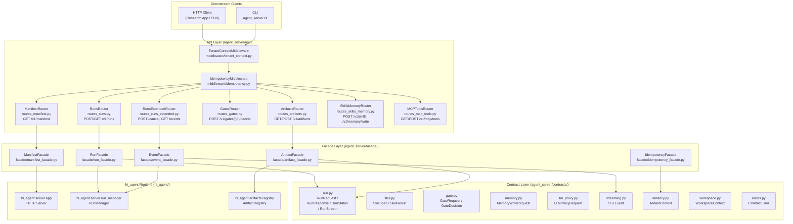
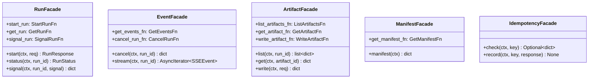
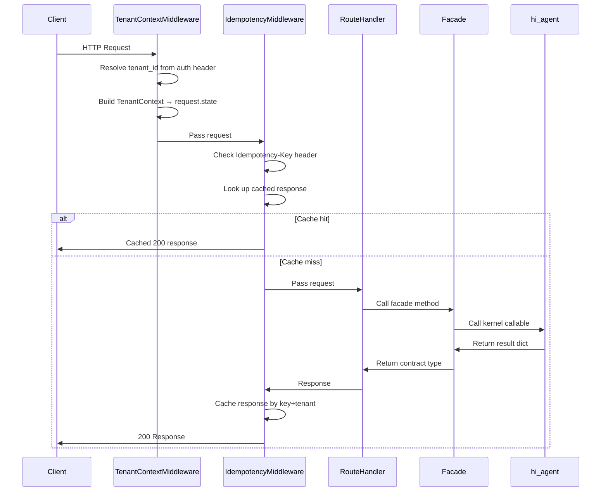
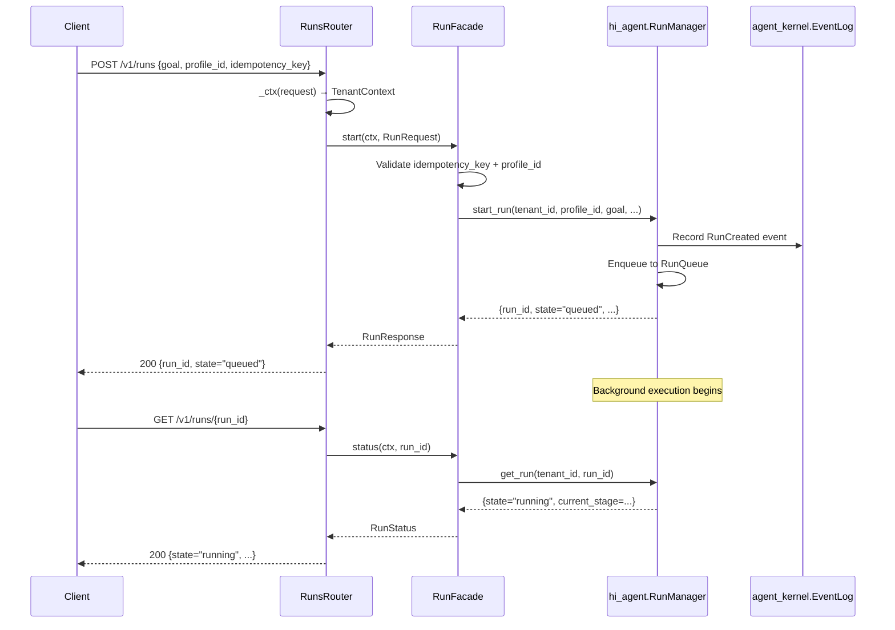
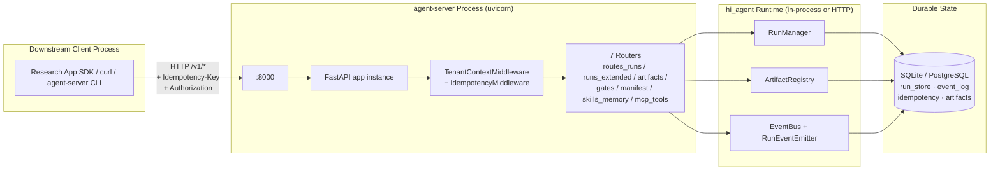

# ARCHITECTURE: agent_server (L1 Detail)

> **Architecture hierarchy**
> - L0 system boundary: [`../ARCHITECTURE.md`](../ARCHITECTURE.md)
> - L1 hi-agent detail: [`../hi_agent/ARCHITECTURE.md`](../hi_agent/ARCHITECTURE.md)
> - L1 agent-server detail: this file
> - L1 agent-kernel detail: [`../agent_kernel/ARCHITECTURE.md`](../agent_kernel/ARCHITECTURE.md)
>
> Last updated: 2026-05-02 (Wave 28)

This document describes the `agent_server` package — the versioned northbound API facade that downstream business-layer applications use to interact with the hi-agent platform.

---

## 1. Purpose and Positioning

`agent_server` provides a stable, versioned HTTP API surface over the `hi_agent` runtime. It enforces the platform/business-layer boundary so that downstream teams (e.g., research applications) never import `hi_agent` types directly.

| Concern | Owner |
|---------|-------|
| Business logic, prompts, domain schemas | Research team (outside this repo) |
| Northbound HTTP contract + versioning | `agent_server/` (this package) |
| Agent execution, memory, cognition | `hi_agent/` |
| Durable run lifecycle, event log, idempotency | `agent_kernel/` |

**Key invariant (R-AS-1):** Route handlers import only from `agent_server.contracts` and `agent_server.facade`. No `hi_agent.*` imports appear in `agent_server/api/`.

---

## 2. Package Structure

```
agent_server/
├── config/          — Configuration dataclasses (Settings, version.py)
├── contracts/       — Frozen northbound type schemas (v1)
├── facade/          — Adapters from contract types to hi_agent callables
├── api/             — FastAPI route handlers + middleware
│   └── middleware/  — Idempotency + tenant context injection
├── cli/             — CLI entry point (serve / run / cancel / tail-events)
├── mcp/             — MCP integration hooks (stub, Wave 28+)
├── tenancy/         — Multi-tenancy support utilities
├── workspace/       — Workspace isolation utilities
└── observability/   — Observability hooks
```

---

## 3. Layered Architecture



---

## 4. Contract Layer (`agent_server/contracts/`)

The contract layer defines the v1 northbound API schemas. These types are frozen after v1 release; breaking changes require `agent_server/contracts/v2/`.

| Module | Key Types | Description |
|--------|-----------|-------------|
| `run.py` | `RunRequest`, `RunResponse`, `RunStatus`, `RunStream` | Run lifecycle: create, query, event stream |
| `skill.py` | `SkillSpec`, `SkillResult` | Skill registration and invocation |
| `gate.py` | `GateRequest`, `GateDecision` | Human-in-the-loop gate approval |
| `memory.py` | `MemoryWriteRequest` | Memory write operations |
| `llm_proxy.py` | `LLMProxyRequest`, `LLMProxyResponse` | Proxied LLM calls |
| `streaming.py` | `SSEEvent` | Server-Sent Events payload |
| `tenancy.py` | `TenantContext` | Authenticated tenant context (set by middleware) |
| `workspace.py` | `WorkspaceContext` | Workspace isolation context |
| `errors.py` | `ContractError` | Typed error with `http_status`, `tenant_id`, `detail` |

**Rule (R-AS-3):** After v1 release, contract files are digest-snapshotted by `scripts/check_contract_freeze.py`. Modifications invalidate the freeze and require release-captain sign-off.

---

## 5. Facade Layer (`agent_server/facade/`)

Facades translate contract types to `hi_agent` callables. Each facade receives callables via constructor injection, enabling incremental kernel binding and clean test stubs.



**LOC budget (R-AS-8):** Each facade module must stay ≤200 LOC.

---

## 6. API Route Inventory

All routes are prefixed with `/v1/` and registered via `build_router()` factory functions that accept facade instances as dependencies.

| Method | Path | Handler File | Description |
|--------|------|-------------|-------------|
| `POST` | `/v1/runs` | `routes_runs.py` | Submit a new run |
| `GET` | `/v1/runs/{run_id}` | `routes_runs.py` | Query run status |
| `POST` | `/v1/runs/{run_id}/signal` | `routes_runs.py` | Send control signal to a run |
| `POST` | `/v1/runs/{run_id}/cancel` | `routes_runs_extended.py` | Cancel a live run |
| `GET` | `/v1/runs/{run_id}/events` | `routes_runs_extended.py` | SSE event stream for a run |
| `GET` | `/v1/runs/{run_id}/artifacts` | `routes_artifacts.py` | List artifacts for a run |
| `GET` | `/v1/artifacts/{artifact_id}` | `routes_artifacts.py` | Get a specific artifact |
| `POST` | `/v1/artifacts` | `routes_artifacts.py` | Write an artifact |
| `POST` | `/v1/gates/{gate_id}/decide` | `routes_gates.py` | Post a gate decision |
| `GET` | `/v1/manifest` | `routes_manifest.py` | Get capability manifest |
| `POST` | `/v1/skills` | `routes_skills_memory.py` | Register a skill |
| `POST` | `/v1/memory/write` | `routes_skills_memory.py` | Write to agent memory |
| `GET` | `/v1/mcp/tools` | `routes_mcp_tools.py` | List available MCP tools |
| `POST` | `/v1/mcp/tools/{tool_name}` | `routes_mcp_tools.py` | Invoke an MCP tool |

**Rule (R-AS-5):** Every new route handler requires a `# tdd-red-sha: <sha>` annotation referencing the RED-test commit SHA.

---

## 7. Middleware Pipeline

Requests pass through two middleware layers before reaching route handlers:



**Tenant isolation (R-AS-4):** Route handlers read `TenantContext` from `request.state` exclusively — never from the request body. The middleware is the single source of tenant identity.

---

## 8. Run Lifecycle Sequence



---

## 9. Configuration and Version

| File | Purpose |
|------|---------|
| `config/settings.py` | `AgentServerSettings` — server host/port, CORS, auth mode |
| `config/version.py` | `V1_RELEASED` flag, `V1_FROZEN_HEAD` (contract freeze SHA) |

The `V1_RELEASED` flag gates `check_contract_freeze.py` from advisory to blocking mode. Once set to `True`, any modification to `agent_server/contracts/` invalidates the SHA digest snapshot.

---

## 10. CLI (`agent_server/cli/`)

```
agent-server serve    — Start the northbound HTTP API server
agent-server run      — Submit a run and wait for completion
agent-server cancel   — Cancel a running job by run_id
agent-server tail-events — Stream SSE events for a run to stdout
```

The CLI uses the same facades and contracts as the HTTP layer, providing identical tenant isolation and error semantics.

---

## 11. Multi-tenancy

Tenant isolation is enforced at every layer:

1. **Middleware** — `TenantContextMiddleware` resolves `tenant_id` from the auth header and injects `TenantContext` into `request.state`.
2. **Facade** — All facade methods accept `TenantContext` as first argument; `tenant_id` is passed to every `hi_agent` callable.
3. **Contract spine (Rule 12)** — Contract dataclasses carry `tenant_id` fields; cross-tenant access is structurally impossible via the facade interface.
4. **Idempotency** — `IdempotencyFacade` scopes keys by `tenant_id`; idempotency records from tenant A are invisible to tenant B.

---

## 12. Testing Standards

Per Rule 4, each route handler requires three test layers:

| Layer | Location | Description |
|-------|----------|-------------|
| Unit | `tests/unit/test_*_facade.py` | Facade logic with injected stub callables |
| Integration | `tests/integration/test_routes_*.py` | FastAPI `TestClient` with real facade wiring |
| E2E | `tests/e2e/test_e2e_agent_server_*.py` | Full HTTP stack against a running server |

Every new route handler commit must include a `# tdd-red-sha: <sha>` annotation in the handler source referencing the commit where the failing test was first written (R-AS-5).

---

## 13. Governance Gates

| Gate Script | What It Enforces |
|-------------|-----------------|
| `scripts/check_contract_freeze.py` | Digest-based freeze of all `agent_server/contracts/` files after v1 release (R-AS-3) |
| `scripts/check_tdd_evidence.py` | Every route handler has a `# tdd-red-sha:` annotation (R-AS-5) |
| `scripts/check_layering.py` | No `hi_agent.*` imports in `agent_server/api/` (R-AS-1) |
| `scripts/check_facade_loc.py` | Each facade module ≤200 LOC (R-AS-8) |

---

## 14. Deployment View



**Standard startup:**

```bash
# Foreground
agent-server serve --host 0.0.0.0 --port 8000

# PM2 (recommended for production)
pm2 start "agent-server serve --host 0.0.0.0 --port 8000" --name hi-agent

# systemd (Linux production)
systemctl start hi-agent.service
```

**Posture-aware behaviour:**

| `HI_AGENT_POSTURE` | Tenant context | Idempotency-Key | Project ID |
|--------------------|----------------|-----------------|------------|
| `dev` | optional, defaults to `tenant_dev` | optional | optional |
| `research` | required (raises 401 if missing) | required for write routes | required on `/v1/runs` |
| `prod` | required + JWT validation | required for write routes | required on `/v1/runs` |

---

## 15. Quality Requirements

| Quality attribute | Target | Enforcement |
|-------------------|--------|-------------|
| v1 contract stability | 0 breaking changes after release | `scripts/check_contract_freeze.py` (digest snapshot) |
| Layering integrity | No `hi_agent.*` import in `agent_server/api/` | `scripts/check_layering.py` |
| Test discipline | Every new route handler has TDD evidence | `scripts/check_tdd_evidence.py` |
| Facade conciseness | ≤200 LOC per facade module | `scripts/check_facade_loc.py` |
| Tenant isolation | `TenantContext` resolved by middleware exclusively | `scripts/check_route_scope.py` |
| Idempotency safety | Same `Idempotency-Key` + tenant returns identical response | unit + integration tests under `tests/integration/test_idempotency_*.py` |
| Cancellation contract | `POST /cancel` -> 200 live, 404 unknown | covered by `scripts/run_arch_7x24.py` assertion #3 |

---

## 16. Risks and Technical Debt

| Item | Status | Mitigation |
|------|--------|-----------|
| MCP integration is stub | `agent_server/mcp/` carries placeholder routes | Wave 28+ work; no production caller depends on it |
| Streaming SSE backpressure | Long-running runs may emit > buffer size | `_generator()` cooperates with event loop via `await asyncio.sleep(0)`; downstream sets `X-Accel-Buffering: no` |
| Idempotency cache TTL | Unbounded growth without TTL pruner | `IdempotencyFacade` accepts a `prune_after_seconds` argument; ops sets via env in research/prod |
| Workspace path traversal | User-controlled `workspace_id` could escape | `agent_server/workspace/` validates and `hi_agent/server/workspace_path.py` enforces; covered by security tests |

---

## 17. Glossary

| Term | Definition |
|------|-----------|
| Northbound | Direction *toward* downstream consumers; the public API surface that downstream apps depend on |
| Southbound | Direction *toward* `hi_agent` runtime; internal to this repo |
| Facade | A thin adapter that translates contract types to `hi_agent` callables; injected via constructor for testability |
| Contract | A frozen v1 schema in `agent_server/contracts/`; breaking changes require a `v2/` sub-package |
| `TenantContext` | Authenticated identity injected by middleware into `request.state`; carries `tenant_id`, `user_id`, `project_id` |
| `Idempotency-Key` | Client-provided header that scopes a write to "exactly once per tenant"; cached by middleware |
| ContractError | Typed error hierarchy with `http_status`; subclasses include `NotFoundError(404)`, `ConflictError(409)`, `RateLimitedError(429)` |
| Route handler | FastAPI endpoint function; invoked by middleware after tenant + idempotency resolution |
| TDD-red-sha | Annotation on every new route handler pointing to the commit SHA where the failing test was first written (R-AS-5) |
