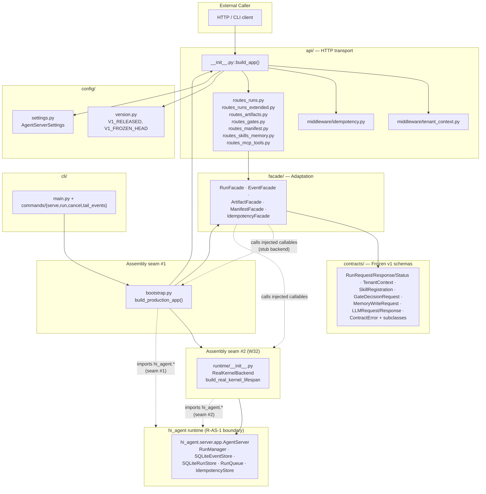
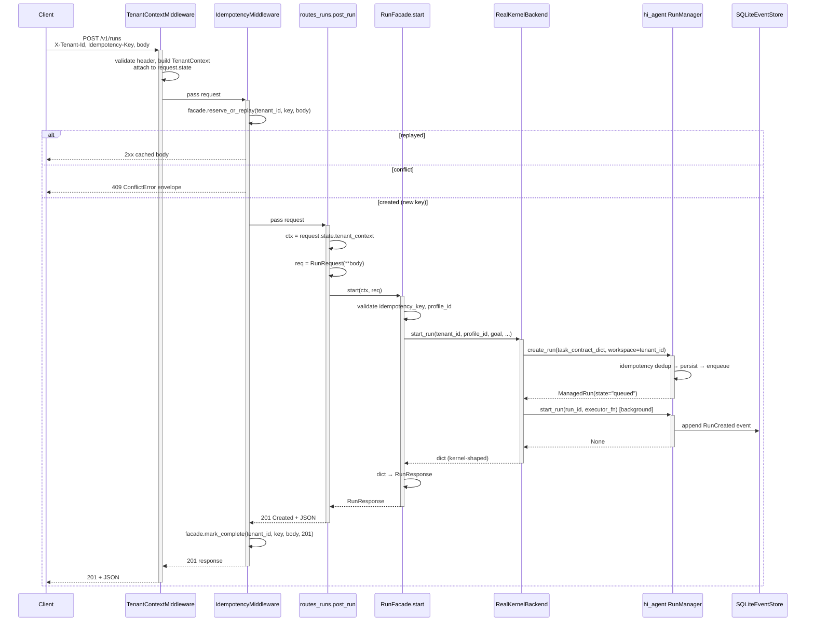

# agent_server Architecture

> Last refreshed: Wave 32 (2026-05-03). Sub-package docs: [`api/ARCHITECTURE.md`](api/ARCHITECTURE.md), [`facade/ARCHITECTURE.md`](facade/ARCHITECTURE.md), [`contracts/ARCHITECTURE.md`](contracts/ARCHITECTURE.md), [`runtime/ARCHITECTURE.md`](runtime/ARCHITECTURE.md).

---

## 1. Purpose & Position in System

`agent_server/` is the **versioned northbound facade** that the hi-agent platform exposes to downstream business-layer applications (the Research Intelligence App and any third-party SDK). It is the **only contract surface** RIA depends on; direct `import hi_agent` from RIA is unsupported and CI-rejected.

The package enforces three boundaries simultaneously:

1. **Platform / business separation (Rule 10).** Domain logic, prompts, and business schemas live outside this repo. agent_server publishes only generic primitives — runs, events, artifacts, gates, manifests.
2. **Versioned contract surface (R-AS-3).** v1 is RELEASED at SHA `8c6e22f1` (`agent_server/config/version.py::V1_FROZEN_HEAD`). Breaking changes go to `contracts/v2/`; in-place edits invalidate the freeze and fail CI.
3. **R-AS-1 single-seam discipline.** Only two modules under `agent_server/` are permitted to import from `hi_agent.*`: `bootstrap.py` (assembly) and `runtime/` (W32 real-kernel binding). Every other module talks to the kernel exclusively through facade-injected callables. The gate is `scripts/check_layering.py`.

What this package does NOT own:
- Agent execution, memory, cognition (`hi_agent/`).
- Run lifecycle, durable persistence, event log (`hi_agent/server/`, formerly `agent_kernel/`).
- Business logic, prompts, domain schemas (out-of-repo, research team's overlay).

| Concern | Owner |
|---|---|
| Northbound HTTP contract + versioning | `agent_server/` (this package) |
| Agent execution, memory, cognition | `hi_agent/` |
| Durable run lifecycle, event log, idempotency | `hi_agent/server/` (Arch-7 inlined Wave 11) |
| Business logic, prompts, domain schemas | Research team (outside this repo) |

---

## 2. External Interfaces

agent_server publishes:

### HTTP routes (v1, all prefixed `/v1/`)

| Method | Path | Purpose |
|---|---|---|
| GET | `/v1/health` | Health probe |
| POST | `/v1/runs` | Create run (returns 201) |
| GET | `/v1/runs/{id}` | Run status |
| POST | `/v1/runs/{id}/signal` | Send control signal |
| POST | `/v1/runs/{id}/cancel` | Cancel a live run |
| GET | `/v1/runs/{id}/events` | SSE event stream |
| GET | `/v1/runs/{id}/artifacts` | List run artifacts |
| GET | `/v1/artifacts/{id}` | Get artifact |
| POST | `/v1/artifacts` | Register artifact |
| POST | `/v1/gates/{id}/decide` | Gate decision |
| GET | `/v1/manifest` | Capability + posture matrix |
| POST | `/v1/skills` | Register skill (L1 stub) |
| POST | `/v1/memory/write` | Memory write (L1 stub) |
| GET / POST | `/v1/mcp/tools[/{name}]` | MCP tools (L1 stub) |

### CLI

```
agent-server serve         # uvicorn against build_production_app
agent-server run           # POST /v1/runs and wait
agent-server cancel <id>   # POST /v1/runs/{id}/cancel
agent-server tail-events <id> # SSE stream to stdout
```

### Public Python surface

- `agent_server.AGENT_SERVER_API_VERSION = "v1"` — re-exported.
- `agent_server.bootstrap.build_production_app(*, settings=None, state_dir=None) -> FastAPI` — the assembly entry point uvicorn calls.
- `agent_server.api.build_app(*, run_facade, ...) -> FastAPI` — lower-level builder used by tests with stub facades.

### Required headers

- `X-Tenant-Id` — every request, every posture.
- `Idempotency-Key` — every mutating route under research/prod posture.
- `X-Project-Id` / `X-Profile-Id` / `X-Session-Id` — optional context.

---

## 3. Internal Components



| Component | Role |
|---|---|
| `bootstrap.py` | Production assembly seam — builds durable `IdempotencyStore`, picks backend (stub vs `RealKernelBackend`), wires every facade, returns FastAPI app |
| `runtime/` (W32 Track A) | Second R-AS-1 seam — binds `RealKernelBackend` to `hi_agent.server.app.AgentServer` |
| `api/` | FastAPI routers + middleware; thin handlers, no kernel imports |
| `facade/` | Contract↔kernel adaptation; constructor-injected callables |
| `contracts/` | Frozen v1 dataclasses; spine-complete (every wire-crossing type carries `tenant_id`) |
| `config/` | `AgentServerSettings`, `V1_RELEASED`, `V1_FROZEN_HEAD` |
| `cli/` | `agent-server` argparse dispatcher (operator-facing) |

Empty shell sub-packages `mcp/`, `observability/`, `tenancy/`, `workspace/` were removed in W31-H7. Their responsibilities are delegated upward to `hi_agent/` (`hi_agent/mcp/`, `hi_agent/observability/`) or the contract layer here (`agent_server/contracts/{tenancy,workspace}.py`). Gate: `scripts/check_no_shell_packages.py`.

---

## 4. Data Flow

Representative `POST /v1/runs` request through middleware, route, facade, and into the real kernel (W32 Track A path):



The seam discipline is visible at the kernel boundary: only `RealKernelBackend` (in `agent_server/runtime/`) holds a reference to `RunManager`. Routes, facades, and contracts never touch the kernel directly.

For the stub-backend path used by route-level tests, the only difference is `RKB` → `_InProcessRunBackend` from `bootstrap.py:80`. Everything upstream is unchanged.

---

## 5. State & Persistence

agent_server itself owns minimal state:

| State | Owner | Backend |
|---|---|---|
| Tenant context per request | `request.state.tenant_context` | in-memory, request-scoped |
| Idempotency reservations + cached responses | `IdempotencyStore` (SQLite) | `<state_dir>/idempotency.db` |
| Facade instances | `app.state.{run_facade,event_facade,...}` | in-process refs, app lifetime |
| FastAPI router cache | starlette internals | in-memory |

All other state — runs, events, artifacts, gates, sessions — lives in the kernel's stores under `hi_agent/server/`.

`state_dir` resolution (`bootstrap.py::_default_state_dir`):
1. `AGENT_SERVER_STATE_DIR` env var (explicit override).
2. `HI_AGENT_HOME/.agent_server`.
3. `./.agent_server` (CWD-relative fallback).

`bootstrap.py` calls `mkdir(parents=True, exist_ok=True)` before any store is opened.

---

## 6. Concurrency & Lifecycle

The lifespan flow integrates two concerns: bootstrapping the FastAPI app and starting the real kernel.

```mermaid
sequenceDiagram
    participant Uvicorn
    participant Bootstrap as build_production_app
    participant Lifespan as build_real_kernel_lifespan
    participant AS as AgentServer (hi_agent)

    Uvicorn->>+Bootstrap: import agent_server.bootstrap; call build_production_app()
    Bootstrap->>Bootstrap: load_settings() / Posture.from_env() / state_dir
    Bootstrap->>Bootstrap: build IdempotencyStore (SQLite)
    Bootstrap->>Bootstrap: build IdempotencyFacade (is_strict from posture)
    alt AGENT_SERVER_BACKEND=real
        Bootstrap->>Lifespan: factory(state_dir, posture)
        Lifespan-->>Bootstrap: lifespan ctx-mgr (deferred)
        Bootstrap->>Bootstrap: build RealKernelBackend (deferred init in lifespan)
    else AGENT_SERVER_BACKEND=stub (default-offline)
        Bootstrap->>Bootstrap: build _InProcessRunBackend
    end
    Bootstrap->>Bootstrap: build {Run,Event,Artifact,Manifest}Facade
    Bootstrap->>Bootstrap: build_app(facades..., lifespan=...)
    Bootstrap-->>-Uvicorn: FastAPI app

    Uvicorn->>+Lifespan: ASGI startup
    Lifespan->>+AS: AgentServer(host, port, config)
    AS->>AS: build_durable_backends() — RunManager, SQLiteRunStore, ...
    AS-->>-Lifespan: agent_server instance
    Lifespan->>AS: _rehydrate_runs(agent_server)
    Note over AS: requeue lease-expired runs<br/>(posture-aware decision)
    Lifespan-->>-Uvicorn: ready (yield)

    Note over Uvicorn,AS: app serves traffic via RealKernelBackend

    Uvicorn->>+Lifespan: ASGI shutdown
    Lifespan->>AS: drain in-flight runs + close stores
    Lifespan-->>-Uvicorn: clean shutdown
```

Rule 5 (Async/Sync Resource Lifetime) compliance:
- Every async resource (`AgentServer.run_manager` event loop bindings, `IdempotencyStore` connection) is constructed in the lifespan startup phase, sharing uvicorn's loop.
- No `asyncio.run` per request. The middleware chain is `BaseHTTPMiddleware` (async-native).
- Synchronous facades dispatch to the kernel's existing threadsafe entry points without a per-call sync bridge.

Middleware order at request time (outer → inner, see `api/__init__.py:118` for the registration trick):
1. `TenantContextMiddleware` — validates `X-Tenant-Id`, builds `TenantContext`, calls spine emitter.
2. `IdempotencyMiddleware` — reserves or replays mutating-route requests.
3. Route handler.

---

## 7. Error Handling & Observability

Error envelope (HD-5 unified shape):

```json
{
  "error": "<exception class>",
  "error_category": "auth_required",
  "message": "<human readable>",
  "retryable": false,
  "next_action": "<remediation hint>",
  "tenant_id": "<from context>",
  "detail": "<context-specific>"
}
```

Standard mappings:

| HTTP status | Source | Class |
|---|---|---|
| 400 | facade validation, missing `Idempotency-Key` (strict) | `ContractError` (constructor) |
| 401 | missing `X-Tenant-Id` | `AuthError` |
| 404 | run/artifact not visible to tenant | `NotFoundError` |
| 409 | idempotency key reuse + body mismatch | `ConflictError` |
| 429 | quota exceeded | `QuotaError` |
| 500 | unexpected | `RuntimeContractError` or uncaught |

Observability emissions:
- `tenant_context` spine event — emitted by `TenantContextMiddleware` per request via injected `tenant_event_emitter` (bootstrap binds `hi_agent.observability.spine_events.emit_tenant_context`).
- `idempotency_header_missing` warning log — `IdempotencyMiddleware` (dev posture) when the header is absent on a mutating route.
- All run lifecycle events (`run_created`, `stage_started`, etc.) — emitted by the kernel through `RunEventEmitter`; surfaced over SSE via `GET /v1/runs/{id}/events`.

agent_server itself does NOT emit Prometheus metrics; cardinality control lives in `hi_agent.observability.metrics`. The boundary is intentional — adding metrics here would duplicate cardinality and risk drift.

---

## 8. Security Boundary

R-AS-1 single-seam discipline:

```
agent_server/                    <- can NOT import hi_agent.* anywhere except:
├── bootstrap.py                 [SEAM #1] assembly module
└── runtime/                     [SEAM #2] kernel binding (W32)
    ├── kernel_adapter.py        # r-as-1-seam: real-kernel-binding
    └── lifespan.py              # r-as-1-seam: real-kernel-binding
```

All `hi_agent.*` imports outside these two locations cause `scripts/check_layering.py` to fail CI. Annotated seams in `agent_server/facade/idempotency_facade.py` and `agent_server/facade/artifact_facade.py` are tolerated because each carries the explicit `# r-as-1-seam:` comment with rationale, parsed by `scripts/check_facade_seams.py`.

Tenant isolation (R-AS-4):
- Every route handler reads `TenantContext` from `request.state` exclusively; never from the request body.
- Idempotency is scoped by `(tenant_id, key)` composite — cross-tenant collisions impossible.
- The contracts spine (`scripts/check_contract_spine_completeness.py`) enforces that every wire-crossing dataclass carries `tenant_id`.

Posture-aware behaviour (Rule 11):

| `HI_AGENT_POSTURE` | Tenant header | Idempotency-Key | Project ID |
|---|---|---|---|
| `dev` | required (always) | optional, warning log if absent | optional |
| `research` | required | required on mutating routes | required on `POST /v1/runs` |
| `prod` | required + JWT validation (planned) | required on mutating routes | required on `POST /v1/runs` |

Contract freeze (R-AS-3): once `V1_RELEASED = True` (already the case as of 2026-04-30), every modification under `agent_server/contracts/` triggers `scripts/check_contract_freeze.py` to invalidate the snapshot. Breaking changes go to `contracts/v2/`.

---

## 9. Extension Points

Adding a new route handler — see [api/ARCHITECTURE.md §9](api/ARCHITECTURE.md). TDD-red-first; `# tdd-red-sha:` annotation required.

Adding a new facade — see [facade/ARCHITECTURE.md §9](facade/ARCHITECTURE.md). Construct via injection; ≤200 LOC; seam annotation only when unavoidable.

Adding a new contract type — see [contracts/ARCHITECTURE.md §9](contracts/ARCHITECTURE.md). v1 frozen; new types go in a new module or v2/.

Adding a new backend (e.g., remote-kernel adapter) — see [runtime/ARCHITECTURE.md §9](runtime/ARCHITECTURE.md). Implement the seven canonical callables; gate updates allow-list.

Adding a CLI subcommand — register a parser in `agent_server/cli/main.py::build_parser`; implement under `agent_server/cli/commands/`. Per R-AS-1 the CLI may not import `hi_agent.*` directly; reach the platform through `agent_server.bootstrap`.

---

## 10. Constraints & Trade-offs

What this design assumes:
- **Single-process deployment per region/shard.** Two uvicorn workers each get their own `IdempotencyStore` and (post-W32) their own `AgentServer`. Cross-process consistency requires external durable backends (out of scope at v1).
- **JSON over HTTP.** No GraphQL, no gRPC, no protobuf at v1. The simplest contract that satisfies RIA wins.
- **In-process kernel binding.** `RealKernelBackend` runs the kernel in the same process as the FastAPI app. A remote-kernel adapter is feasible but adds latency and complexity (deferred).
- **Synchronous facades.** Async-native facades would simplify SSE and proxy routes but force every handler to be async, doubling the surface.

What this design does NOT handle well:
- **Multi-region writes.** The idempotency store is local to each replica; without an external coordinator, the "exactly once per tenant" guarantee is per-replica.
- **Rolling schema evolution.** Once v1 is RELEASED, additive changes go in v2 (full duplication). There is no field-additive hot-path.
- **Streaming uploads.** Artifact registration takes JSON bodies; large file uploads via multipart are not yet wired through the facade boundary (tracked in W33).
- **Deep observability for error categories.** Errors carry `error_category` strings but those don't yet roll up into per-category metrics.

Operational notes (Wave 28+):
- `architectural_seven_by_twenty_four` cap (`docs/governance/score_caps.yaml`) replaces the 24h wall-clock soak with a 5-assertion architectural verification (`scripts/run_arch_7x24.py`). One of those five assertions is the cancellation round-trip handled by `routes_runs_extended.py` (`POST /cancel` returns 200 on a live run, 404 on unknown).
- Production startup uses PM2 / systemd / docker — not foreground `agent-server serve`. The CLI defaults to `127.0.0.1`; `--prod` flips to `0.0.0.0` and sets `HI_AGENT_POSTURE=prod`.

---

## 11. References

Per-component architecture documents:
- [`agent_server/api/ARCHITECTURE.md`](api/ARCHITECTURE.md) — route handlers + middleware
- [`agent_server/facade/ARCHITECTURE.md`](facade/ARCHITECTURE.md) — contract↔kernel adaptation
- [`agent_server/contracts/ARCHITECTURE.md`](contracts/ARCHITECTURE.md) — frozen v1 schemas
- [`agent_server/runtime/ARCHITECTURE.md`](runtime/ARCHITECTURE.md) — real-kernel binding (W32)

Implementation entry points:
- `agent_server/__init__.py` — `AGENT_SERVER_API_VERSION`
- `agent_server/bootstrap.py:188` — `build_production_app`
- `agent_server/api/__init__.py:54` — `build_app`
- `agent_server/cli/main.py` — `agent-server` dispatcher
- `agent_server/config/version.py` — `V1_RELEASED`, `V1_FROZEN_HEAD`

Kernel boundary:
- `hi_agent/server/app.py:1645` — `AgentServer`
- `hi_agent/server/app.py:1196` — `_rehydrate_runs`
- `hi_agent/server/run_manager.py` — `RunManager`
- `hi_agent/server/event_store.py` — `SQLiteEventStore`
- `hi_agent/server/idempotency.py` — `IdempotencyStore`

Governance:
- `CLAUDE.md` — Rules 1–17, Ownership Tracks, Narrow-Trigger Rules
- `docs/architecture-reference.md` — codebase reference
- `docs/platform/agent-server-northbound-contract-v1.md` — v1 surface description
- `docs/governance/closure-taxonomy.md` — Rule 15 levels
- `docs/governance/score_caps.yaml` — readiness caps

Gates:
- `scripts/check_layering.py` (R-AS-1)
- `scripts/check_contract_freeze.py` (R-AS-3)
- `scripts/check_route_scope.py`, `scripts/check_route_tenant_context.py` (R-AS-4)
- `scripts/check_tdd_evidence.py` (R-AS-5)
- `scripts/check_facade_loc.py` (R-AS-8)
- `scripts/check_facade_seams.py` (R-AS-1 seam annotations)
- `scripts/check_contracts_purity.py`
- `scripts/check_contract_spine_completeness.py` (Rule 12)
- `scripts/check_no_shell_packages.py` (W31-H7)
- `scripts/run_arch_7x24.py` (5-assertion architectural verification)

Test inventory:
- Unit: `tests/unit/test_*_facade.py`
- Integration: `tests/integration/test_routes_*.py`, `tests/integration/test_idempotency_*.py`
- E2E: `tests/e2e/test_e2e_agent_server_*.py`
- W32 real-kernel binding: `tests/integration/test_v1_runs_real_kernel_binding.py` (created in W32 Track A)
