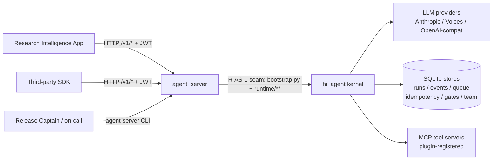
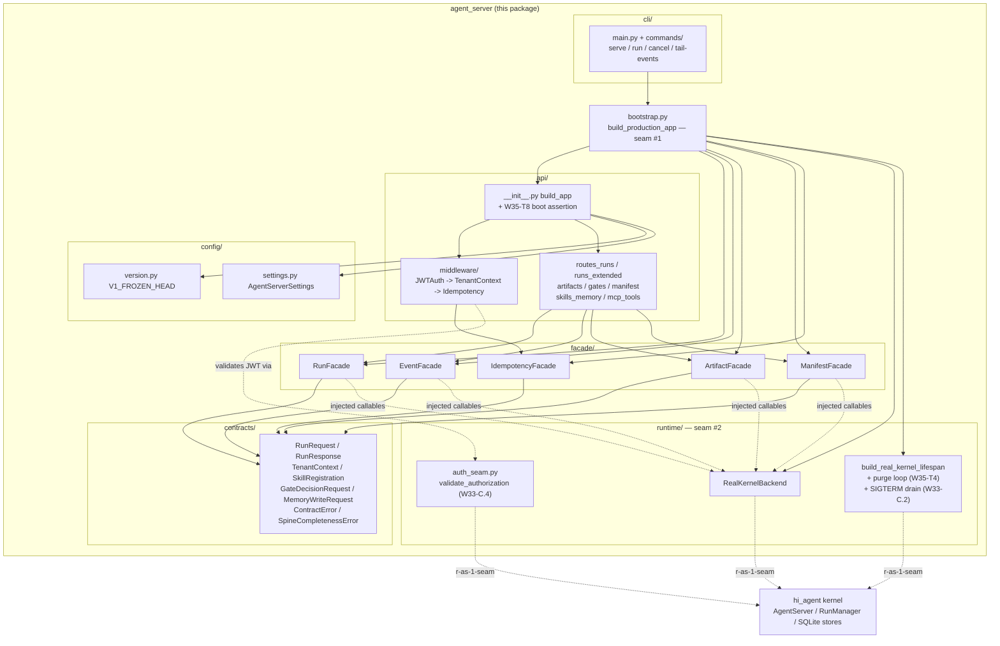

# agent_server — Architecture

> **Last refreshed:** 2026-05-06 (W35 corrective close + W36 plans staged). HEAD `276917d8`.
> **Audience:** AS-CO / AS-RO owners, downstream contract consumers, release captains.
> **Status:** authoritative for the v1 northbound facade. Supersedes prose elsewhere. v1 contracts FROZEN at SHA `55e51a7f` (see `agent_server/config/version.py::V1_FROZEN_HEAD`).
>
> Sub-package docs: [`api/ARCHITECTURE.md`](api/ARCHITECTURE.md), [`facade/ARCHITECTURE.md`](facade/ARCHITECTURE.md), [`contracts/ARCHITECTURE.md`](contracts/ARCHITECTURE.md), [`runtime/ARCHITECTURE.md`](runtime/ARCHITECTURE.md), [`cli/ARCHITECTURE.md`](cli/ARCHITECTURE.md), [`config/ARCHITECTURE.md`](config/ARCHITECTURE.md).

---

## 1. Purpose & Responsibilities

`agent_server/` is the **versioned northbound HTTP facade** of the hi-agent platform. It is the only contract surface that the Research Intelligence App (RIA) and third-party SDKs depend on; direct imports of `hi_agent.*` from downstream code are unsupported and CI-rejected.

The package owns three boundaries simultaneously:

1. **Platform / business separation** (Rule 10). Domain logic, prompts, and business schemas live outside this repo. agent_server publishes only generic primitives — runs, events, artifacts, gates, manifests, MCP tools, skills, memory.
2. **Versioned contract surface** (R-AS-3). v1 is RELEASED at SHA `55e51a7f` (`agent_server/config/version.py::V1_FROZEN_HEAD`); the digest re-rolled at W35-T1 after `__post_init__` validators were added to 53 dataclasses (additive — no field shape change).
3. **R-AS-1 single-seam discipline.** Only two locations under `agent_server/` may import from `hi_agent.*`: `bootstrap.py` (assembly) and `runtime/` (real-kernel binding + auth seam). Every other module talks to the kernel exclusively through facade-injected callables.

What this package does NOT own:

- Agent execution, memory, cognition (`hi_agent/`).
- Run lifecycle, durable persistence, event log (`hi_agent/server/`, formerly `agent_kernel/`).
- Business logic, prompts, domain schemas (out-of-repo, research team's overlay).
- LLM provider transport (lives in `hi_agent/llm/`).

---

## 2. Context & Scope

`agent_server/` sits between business-layer callers (RIA, third-party SDKs, the operator CLI) and the cognitive runtime + inlined kernel under `hi_agent/`. It exposes HTTP `/v1/*` plus a few non-versioned operator endpoints (`/health`, `/ready`, `/diagnostics`, `/metrics`).


```mermaid
flowchart LR
    RIA[Research Intelligence App] -->|HTTP /v1/* + JWT| AS[agent_server]
    SDK[Third-party SDK] -->|HTTP /v1/* + JWT| AS
    OP[Release Captain / on-call] -->|agent-server CLI| AS
    AS -->|R-AS-1 seam: bootstrap.py + runtime/**| HA[hi_agent kernel]
    HA --> LLM[LLM providers<br/>Anthropic / Volces / OpenAI-compat]
    HA --> SQLite[(SQLite stores<br/>runs / events / queue<br/>idempotency / gates / team)]
    HA --> MCP[MCP tool servers<br/>plugin-registered]
```

External actors:

- **RIA** — primary downstream consumer. JWT-authenticated, tenant-scoped via `X-Tenant-Id`.
- **Third-party SDKs** — same surface, same auth. Frozen contract grants SDK authors stability.
- **Release captain / operator** — local process via `agent-server` CLI; same FastAPI app.

External dependencies:

- **`hi_agent/`** — same repo, same process. Imported only at the two R-AS-1 seams.
- **LLM providers** — outbound HTTP from `hi_agent/llm/`. agent_server never speaks to providers directly.
- **SQLite** — local file durability under `state_dir`. Owned by `hi_agent/server/`.

---

## 3. Module Boundary & Dependencies

R-AS-1 single-seam discipline:

```
agent_server/                <- can NOT import hi_agent.* anywhere except:
├── bootstrap.py             [SEAM #1] assembly module
└── runtime/                 [SEAM #2] kernel binding + auth
    ├── kernel_adapter.py    # r-as-1-seam: real-kernel-binding
    ├── lifespan.py          # r-as-1-seam: real-kernel-binding (W33-C.1, W35-T4)
    └── auth_seam.py         # r-as-1-seam: JWT primitives (W33-C.4)
```

**Inbound dependencies** (what depends on `agent_server/`):

- `hi_agent/` — none. Reverse imports are forbidden (R-AS-2, `scripts/check_no_reverse_imports.py`).
- Tests under `tests/` and `examples/` may freely import.
- The `agent-server` console script entry point (`pyproject.toml`) → `agent_server.cli.main`.

**Outbound dependencies**:

- FastAPI / Starlette / pydantic — transport.
- `hi_agent.config.posture.Posture` — read at `bootstrap.py` and at every facade enforcement call site (Rule 11).
- `hi_agent.server.idempotency.IdempotencyStore` — the persistent SQLite store; built once in bootstrap, shared via DI.
- `hi_agent.server.AgentServer` — the kernel; built once via `RealKernelBackend`, shared via DI.

**Rule 6 single-construction-path** (agent_server-relevant resources):

- `IdempotencyStore` — built by `bootstrap.py`; passed to `IdempotencyFacade` and surfaced on `RealKernelBackend._idempotency_store` (W35-T4) so the lifespan purge loop can find it without poking `app.state`.
- `RealKernelBackend` — built by `bootstrap.py` exactly once.
- `Posture` — read by `Posture.from_env()` once in bootstrap, threaded into facades; contracts read it directly via `os.environ` (`agent_server/contracts/errors.py::_strict_posture()`) so the `contracts/` module never imports `hi_agent.config.posture`.

**Forbidden patterns** (CI-blocked):

- `agent_server/api/*` importing `hi_agent.*`.
- `agent_server/facade/*` importing `hi_agent.*`.
- Inline fallbacks `x or DefaultX()` (Rule 6, `scripts/check_rules.py`).

---

## 4. Building Blocks

| Component | Responsibility |
|---|---|
| `bootstrap.py` | Assembly seam #1 — builds `IdempotencyStore`, picks backend (stub vs real), wires every facade, returns `FastAPI` app |
| `runtime/` | Seam #2 — `RealKernelBackend`, lifespan with purge loop (W35-T4), JWT validation seam (W33-C.4) |
| `api/` | FastAPI routers + middleware; thin handlers, no kernel imports; W35-T8 boot assertion |
| `facade/` | Contract↔kernel adaptation; constructor-injected callables; ≤200 LOC each (R-AS-8) |
| `contracts/` | Frozen v1 dataclasses + `SpineCompletenessError` (W35-T1) |
| `config/` | `AgentServerSettings`, `V1_RELEASED`, `V1_FROZEN_HEAD` (re-rolled at W35-T1) |
| `cli/` | `agent-server` argparse dispatcher (operator-facing) |


```mermaid
flowchart TB
    subgraph agent_server["agent_server (this package)"]
        BS["bootstrap.py<br/>build_production_app — seam #1"]
        subgraph api[api/]
            APIB["__init__.py build_app<br/>+ W35-T8 boot assertion"]
            MID["middleware/<br/>JWTAuth -> TenantContext -> Idempotency"]
            ROUTES["routes_runs / runs_extended<br/>artifacts / gates / manifest<br/>skills_memory / mcp_tools"]
        end
        subgraph facade[facade/]
            RF["RunFacade"]
            EF["EventFacade"]
            AF["ArtifactFacade"]
            MF["ManifestFacade"]
            IF["IdempotencyFacade"]
        end
        subgraph contracts[contracts/]
            CT["RunRequest / RunResponse<br/>TenantContext / SkillRegistration<br/>GateDecisionRequest / MemoryWriteRequest<br/>ContractError / SpineCompletenessError"]
        end
        subgraph runtime[runtime/ — seam #2]
            RKB["RealKernelBackend"]
            LIFE["build_real_kernel_lifespan<br/>+ purge loop (W35-T4)<br/>+ SIGTERM drain (W33-C.2)"]
            AUTH["auth_seam.py<br/>validate_authorization (W33-C.4)"]
        end
        subgraph cfg[config/]
            CV["version.py V1_FROZEN_HEAD"]
            CS["settings.py AgentServerSettings"]
        end
        subgraph cli[cli/]
            CLIM["main.py + commands/<br/>serve / run / cancel / tail-events"]
        end
    end

    HIA["hi_agent kernel<br/>AgentServer / RunManager / SQLite stores"]

    BS --> APIB
    BS --> RF
    BS --> EF
    BS --> AF
    BS --> MF
    BS --> IF
    BS --> RKB
    BS --> LIFE
    APIB --> MID
    APIB --> ROUTES
    MID --> IF
    MID -. validates JWT via .-> AUTH
    ROUTES --> RF
    ROUTES --> EF
    ROUTES --> AF
    ROUTES --> MF
    RF --> CT
    EF --> CT
    AF --> CT
    MF --> CT
    IF --> CT
    RF -. injected callables .-> RKB
    EF -. injected callables .-> RKB
    AF -. injected callables .-> RKB
    MF -. injected callables .-> RKB
    RKB -. r-as-1-seam .-> HIA
    LIFE -. r-as-1-seam .-> HIA
    AUTH -. r-as-1-seam .-> HIA
    CLIM --> BS
    APIB --> CV
    APIB --> CS
```

---

## 5. Runtime View — Key Scenarios

### 5.1 `POST /v1/runs` happy path

End-to-end through the W35 middleware chain, with the W35-T1/T3/T4/T6 enhancements annotated.

```mermaid
sequenceDiagram
    participant C as Client (RIA)
    participant J as JWTAuthMiddleware
    participant T as TenantContextMiddleware
    participant I as IdempotencyMiddleware
    participant R as routes_runs.post_run
    participant F as RunFacade.start
    participant K as RealKernelBackend
    participant M as hi_agent RunManager

    C->>J: POST /v1/runs (Bearer + X-Tenant-Id + Idempotency-Key + body)
    Note over J: research/prod validate HMAC<br/>dev passthrough; anonymous claims
    J->>T: forward (auth_claims attached)
    T->>T: validate X-Tenant-Id; emit tenant_context spine event
    T->>I: forward
    I->>I: facade.reserve_or_replay(tenant_id, key, body)
    Note over I: W35-T6 emits replay/conflict counters<br/>W35-T4 lazy purge of stale rows
    alt new key
        I->>R: forward (created=True)
        R->>R: build RunRequest — W35-T1 spine validation
        R->>F: start(ctx, RunRequest)
        F->>K: start_run(tenant_id, profile_id, goal, ...)
        K->>M: create_run(task_contract, workspace=tenant_id)
        Note over M: W35-T3 auth-authoritative tenant_id<br/>body mismatch -> TenantScopeError under strict<br/>WARNING + middleware-value-used under dev (C-4)
        M-->>K: ManagedRun(state=queued)
        K-->>F: dict
        F-->>R: RunResponse
        R-->>I: 201 + JSON
        I->>I: facade.mark_complete (replay cache populated)
        I-->>C: 201 Created
    else replay (same key + same body)
        I-->>C: cached 201 (byte-identical)
    else conflict (same key + different body)
        I-->>C: 409 Conflict
    end
```

### 5.2 Lifespan startup

```mermaid
sequenceDiagram
    participant U as Uvicorn
    participant B as build_production_app
    participant L as build_real_kernel_lifespan
    participant A as AgentServer (hi_agent)

    U->>B: build FastAPI app
    B->>B: load_settings; Posture.from_env; mkdir state_dir
    B->>B: build IdempotencyStore + IdempotencyFacade
    B->>B: RealKernelBackend(state_dir, posture)
    B->>B: real_backend._idempotency_store = idem_store (W35-T4)
    B->>B: build run/event/artifact/manifest facades
    B->>L: build_real_kernel_lifespan(real_backend)
    B->>B: build_app(... idempotency_facade ... lifespan)
    B-->>U: FastAPI app
    U->>L: ASGI startup
    L->>A: _rehydrate_runs (W35-T9 attempt_id bump)
    A-->>L: done
    L->>L: start _lease_expiry_loop
    L->>L: start _current_stage_watchdog
    L->>L: start _idempotency_purge_loop (W35-T4)
    L->>L: install SIGTERM handler (W33-C.2)
    L-->>U: ready (yield)
```

### 5.3 Cancellation contract (Rule 8 step 6)

`POST /v1/runs/{id}/cancel` returns:

- **200** + drives the run to a terminal state when the run is known and live.
- **404** when the run id is unknown — never 200.
- **409** when the run is already terminal.

This invariant is asserted on every release HEAD by `scripts/run_arch_7x24.py::cancellation_round_trip`.

---

## 6. Cross-cutting Concerns

| Concern | Implementation |
|---|---|
| **Posture (Rule 11)** | `HI_AGENT_POSTURE={dev,research,prod}` (default `dev`). Read once in bootstrap; threaded into facades; contracts read via `os.environ` to avoid importing `hi_agent.config.posture`. |
| **Observability** | `/metrics` exposes Prometheus families. `RunEventEmitter` (12 typed events) lives in `hi_agent/observability/`. agent_server emits idempotency metrics via `hi_agent/observability/idempotency_metrics.py`; W35-corrective C-1 reverted labels from `{tenant_bucket}` to `{tenant_id}` for cross-platform consistency. |
| **Error envelope** | `agent_server/contracts/errors.py::ContractError` for all `/v1/*` errors. Categories: `validation`, `auth`, `tenant_scope`, `idempotency_conflict`, `not_found`, `rate_limit`, `internal`. |
| **Contract spine (Rule 12)** | Every wire-crossing dataclass in `contracts/` carries `tenant_id`. W35-T1 added `__post_init__` validation across 53 dataclasses (13 named in RIA directive + 40 sibling/hidden). Reference: `hi_agent/contracts/reasoning.py::ReasoningTrace.__post_init__`. |
| **Idempotency** | Per-tenant key scope (`SCOPE='tenant'`); cross-process replay; 24h TTL with background purge (W35-T4); 4 Prometheus metrics (W35-T6); boot-time invariant for MCP/skills routes (W35-T8). Contract: `agent_server/contracts/idempotency.py`. |
| **Auth** | JWT HMAC at `JWTAuthMiddleware` (W33-C.4). Secret from `HI_AGENT_JWT_SECRET`. Dev posture passes through with anonymous claims. |
| **Tenancy** | `TenantContextMiddleware` validates `X-Tenant-Id`; `request.state.tenant_context` carries `tenant_id`, `user_id`, `project_id`. Anti-forgery cross-check in `RunManager.create_run` (W35-T3). |
| **Resource lifetime (Rule 5)** | Single uvicorn loop. `IdempotencyStore` connection + background tasks (`_idempotency_purge_loop`, `_lease_expiry_loop`, `_current_stage_watchdog`) all bound to that loop. No `asyncio.run()` per request. |

---

## 7. Architecture Decisions (key trade-offs)

The design decisions that have the largest blast radius today:

- **Two-seam R-AS-1 split.** `bootstrap.py` is the assembly seam; `runtime/**` is the kernel-binding seam. Splitting kernel binding out of bootstrap kept bootstrap from breaching its LOC budget while preserving "only two places import `hi_agent.*`" as a CI invariant. (W31-N + W32-A.) Gate: `scripts/check_layering.py`, `scripts/check_facade_seams.py`.
- **Inlined kernel** (W11). The historical `agent_kernel/` package was inlined into `hi_agent/server/`. Cross-process kernel transport (`HI_AGENT_KERNEL_BASE_URL`) is deprecated. agent_server holds a direct in-process reference.
- **Frozen-v1, parallel-v2 evolution** (R-AS-3). Breaking changes go to `agent_server/contracts/v2/`. This is asymmetric on purpose: callers MUST be able to pin to v1 across platform upgrades.
- **Posture in `os.environ` for contracts** (W35-T1). The `contracts/` package reads `HI_AGENT_POSTURE` directly so it does not import `hi_agent.config.posture`, preserving R-AS-1 layering even with `__post_init__` validators.
- **Auth-authoritative tenant_id** (W35-T3). When the body's `tenant_id` differs from the middleware's `X-Tenant-Id`, research/prod raises `TenantScopeError` (anti-forgery); dev logs WARNING and uses the middleware value. W35-corrective C-4 added the dev-side regression test that was missing.
- **Idempotency labels reverted to `{tenant_id}`** (W35-corrective C-1). The W35 ship had inadvertently shipped `{tenant_bucket}` (mod-16 hash) on four metrics. Cardinality control is now an ops-side concern (PromQL recording rules), not contract-side label rewriting.
- **Three-tier readiness** (Rule 14). `raw_implementation_maturity` / `current_verified_readiness` / `seven_by_24_operational_readiness`. Headlines cite `current_verified_readiness` only. Score increases are computed from manifest facts, never hand-edited.
- **W35-T9 lineage chain bump** (`hi_agent/server/app.py:1340-1377`). `_rehydrate_runs` now bumps `attempt_id`, links `parent_run_id=run_id`, and bumps `attempt_count` before re-enqueue, so postmortem reconstruction has the per-attempt chain across recovery cycles.

---

## 8. Quality Attributes

Mapped to RIA's 7-dimension readiness scorecard (Rule 10):

| Dimension | What this package promises | How it is measured |
|---|---|---|
| **Execution** | `POST /v1/runs` survives restart; cancel is 200/404/409 (never silent 200) | `tests/integration/test_v1_runs_real_kernel_binding.py`; `scripts/run_arch_7x24.py::cancellation_round_trip` |
| **Memory** | `POST /v1/memory` accepts spine-validated records; tenant-partitioned at write | `tests/integration/test_routes_skills_memory.py`; `check_dataclass_spine_validation.py` |
| **Capability** | `GET /v1/manifest` exposes the resolved posture + capability matrix | `tests/integration/test_routes_manifest.py`; `check_contract_freeze.py` |
| **Knowledge graph** | No v1 northbound route today; KG is exposed via `agent_server/facade/` with future v2 path reserved | (deferred to W37+) |
| **Planning** | TRACE S1–S5 stage events stream over `/v1/runs/{id}/events` (SSE live, W33-C.5) | `tests/integration/test_v1_sse_live_stream.py`; `scripts/run_arch_7x24.py::lifespan_observable` |
| **Artifact** | `POST/GET /v1/artifacts` per-tenant; idempotency contract frozen + W35-T6 observable | `tests/integration/test_routes_artifacts.py`; `tests/integration/test_idempotency_metrics.py` |
| **Evolution** | ExperimentStore + recurrence-ledger reachable via facades; W35-T1 spine validation across `RunFeedback`, `EvolveResult`, `EvolveChange` | `check_dataclass_spine_validation.py`; recurrence-ledger consistency gate |
| **Cross-Run** | Lineage chain (W34-F.2 create-run + W35-T9 re-lease attempt_id) + 24h idempotency TTL purge | `tests/integration/test_idempotency_ttl_purge.py`; `tests/unit/test_w35_t9_re_lease_attempt_id.py` |

Quantitative bar at the W35 close (manifest `2026-05-06-24cfa0a6`):

- `raw_implementation_maturity = 94.5`
- `current_verified_readiness = 75.0` (cap held by `soak_evidence_not_real`; explicitly retained per RIA W35 directive §6)
- `seven_by_24_operational_readiness = 94.5`
- Default-offline test profile: 9,288 passed / 8 skipped / 0 failed (~3 min wall clock)

---

## 9. Risks & Technical Debt

Open items tracked at the package level (full inventory in `docs/governance/systematic-audit-w35-2026-05-05.md`):

- **Cap factor `soak_evidence_not_real`** held per RIA §6 — addressed by W36 6h Linux soak roadmap, not contract change.
- **Float canonicalisation** for idempotency body hashing (`1` vs `1.0`) deferred to W37+ per RIA endorsement (W35-T5).
- **`agent_server/contracts/v2/` authoring guide** — drafted only when a breaking change is approved; not yet needed.
- **Streaming uploads via multipart** through `ArtifactFacade.register` — deferred (W37+).
- **Per-error-category metrics roll-up** — deferred (W37+).
- **Cross-process run sharing via external durable backend** — deferred (W37+); current architecture is single-process by design.
- **W36 retention adoption** (8 stores, plan `docs/superpowers/plans/2026-05-06-wave-36-a3-tier1-retention-adoption.md`) clones the W35-T4 `IdempotencyStore.purge_expired` shape into events / audit / gates / team-events / KG / skill versions / experiments / postmortems.
- **W36 schema lineage extensions** (plan `2026-05-06-wave-36-a4-schema-lineage-extensions.md`) — additive `__post_init__` mixins so each spine-bearing class shrinks to a decorator.
- **W36 boot-time assertions** (plan `2026-05-06-wave-36-a5-boot-time-assertions.md`) — clones the W35-T8 MCP/skills assertion to JWT secret + state_dir + posture/backend incompatibility (22 boot-time gaps catalogued).

Allowlist entries: see `docs/governance/allowlists.yaml`. Every entry carries owner / risk / reason / expiry_wave / replacement_test (Rule 17).

---

## 10. References

**Implementation entry points** (cite line numbers stable at HEAD `276917d8`):

- `agent_server/__init__.py` — `AGENT_SERVER_API_VERSION = "v1"`
- `agent_server/bootstrap.py:227` — `build_production_app`
- `agent_server/bootstrap.py:282-286` — wires `_idempotency_store` onto `RealKernelBackend` (W35-T4)
- `agent_server/api/__init__.py` — `build_app` + W35-T8 boot assertion
- `agent_server/cli/main.py` — `agent-server` dispatcher
- `agent_server/config/version.py` — `V1_RELEASED`, `V1_FROZEN_HEAD = "55e51a7f4e3c67ffd0b9cfb53608ac3bdd3c8266"`

**Sub-package architecture documents**:

- [`api/ARCHITECTURE.md`](api/ARCHITECTURE.md) — route handlers + middleware (W33-C.4 JWT, W35-T6 metrics, W35-T8 assertion)
- [`facade/ARCHITECTURE.md`](facade/ARCHITECTURE.md) — contract↔kernel adaptation (≤200 LOC each)
- [`contracts/ARCHITECTURE.md`](contracts/ARCHITECTURE.md) — frozen v1 schemas + W35-T1 spine validation (53 dataclasses)
- [`runtime/ARCHITECTURE.md`](runtime/ARCHITECTURE.md) — real-kernel binding (W32) + auth seam (W33-C.4) + purge loop (W35-T4)
- [`cli/ARCHITECTURE.md`](cli/ARCHITECTURE.md) — operator-facing CLI (`agent-server`)
- [`config/ARCHITECTURE.md`](config/ARCHITECTURE.md) — settings, version constants, contract freeze

**Kernel boundary** (cited because the facade adapts to these symbols):

- `hi_agent/server/app.py::AgentServer`
- `hi_agent/server/app.py:1340-1377` — `_rehydrate_runs` attempt_id bump (W35-T9)
- `hi_agent/server/run_manager.py:443-489` — auth-authoritative tenant_id (W35-T3)
- `hi_agent/server/idempotency.py:193-235` — `purge_expired` (W35-T4)
- `hi_agent/observability/idempotency_metrics.py` — W35-T6 metric helpers (labels reverted to `{tenant_id}` per W35-corrective C-1)

**Governance**:

- [`../CLAUDE.md`](../CLAUDE.md) — Rules 1–17, Ownership Tracks, Narrow-Trigger Rules
- [`../docs/architecture-reference.md`](../docs/architecture-reference.md) — codebase reference
- [`../docs/platform/agent-server-northbound-contract-v1.md`](../docs/platform/agent-server-northbound-contract-v1.md) — v1 surface description
- [`../docs/governance/closure-taxonomy.md`](../docs/governance/closure-taxonomy.md) — Rule 15 levels
- [`../docs/governance/score_caps.yaml`](../docs/governance/score_caps.yaml) — readiness caps
- [`../docs/governance/contract_v1_freeze.json`](../docs/governance/contract_v1_freeze.json) — re-snapshotted at W35-T1
- [`../docs/governance/systematic-audit-w35-2026-05-05.md`](../docs/governance/systematic-audit-w35-2026-05-05.md) — 91 hidden findings catalog
- [`../docs/governance/retention-roadmap.md`](../docs/governance/retention-roadmap.md) — 24 unbounded-growth stores scoped W36/W37+
- [`../docs/governance/boot-time-assertions-roadmap.md`](../docs/governance/boot-time-assertions-roadmap.md) — 22 boot-time gaps scoped W36/W37+
- [`../docs/observability/idempotency-metrics.md`](../docs/observability/idempotency-metrics.md) — W35-T6 metric catalog (W35-corrective C-1 label policy)

**W35-corrective response** (predecessor to W36):

- [`../docs/upstream-directives/2026-05-05-hi-agent-w35-corrective-directive.md`](../docs/upstream-directives/2026-05-05-hi-agent-w35-corrective-directive.md)
- [`../docs/downstream-responses/2026-05-05-w35-corrective-response.md`](../docs/downstream-responses/2026-05-05-w35-corrective-response.md)

**W36 plans** (binding):

- [`../docs/superpowers/plans/2026-05-06-wave-36-a3-tier1-retention-adoption.md`](../docs/superpowers/plans/2026-05-06-wave-36-a3-tier1-retention-adoption.md)
- [`../docs/superpowers/plans/2026-05-06-wave-36-a4-schema-lineage-extensions.md`](../docs/superpowers/plans/2026-05-06-wave-36-a4-schema-lineage-extensions.md)
- [`../docs/superpowers/plans/2026-05-06-wave-36-a5-boot-time-assertions.md`](../docs/superpowers/plans/2026-05-06-wave-36-a5-boot-time-assertions.md)
