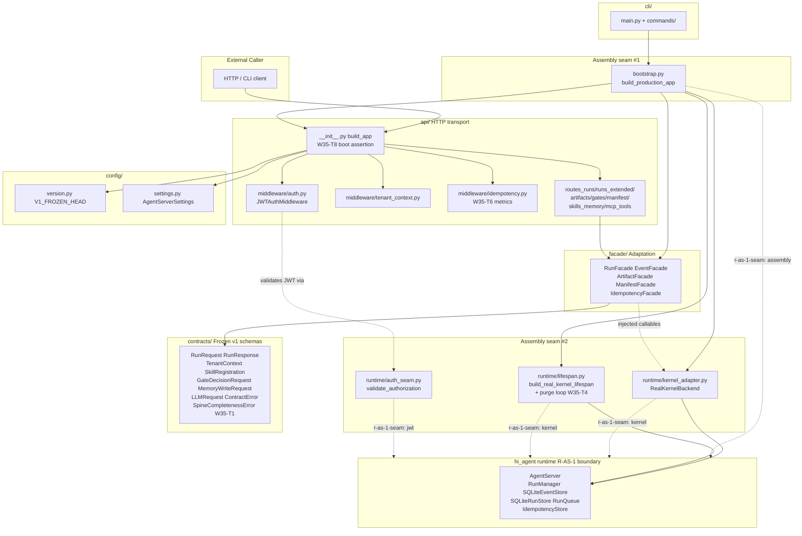
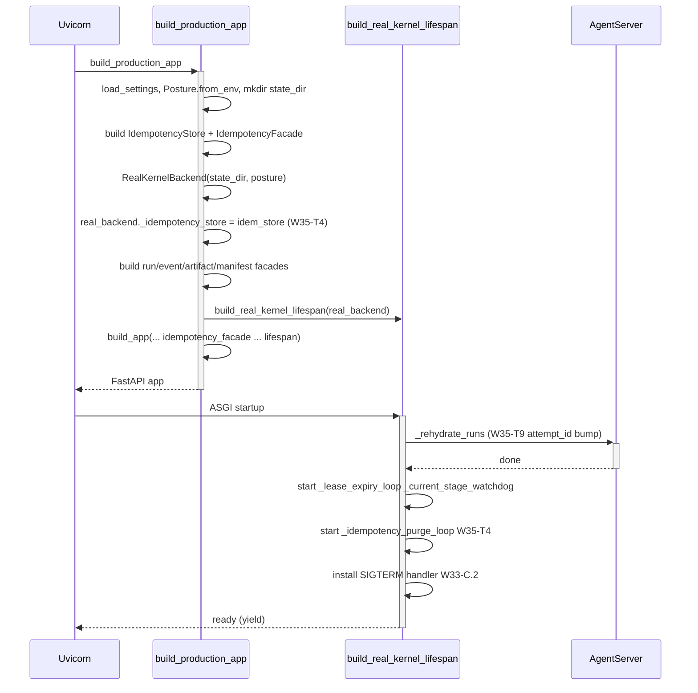

# agent_server — Architecture

> Last refreshed: W35 close (2026-05-05). HEAD `8bce5bc`. W35 closed 38 hidden findings on top of the 8 binding RIA W35-T items; primary touchpoints in this package are W35-T4, W35-T6, W35-T8.
>
> Sub-package docs: [`api/ARCHITECTURE.md`](api/ARCHITECTURE.md), [`facade/ARCHITECTURE.md`](facade/ARCHITECTURE.md), [`contracts/ARCHITECTURE.md`](contracts/ARCHITECTURE.md), [`runtime/ARCHITECTURE.md`](runtime/ARCHITECTURE.md), [`cli/ARCHITECTURE.md`](cli/ARCHITECTURE.md), [`config/ARCHITECTURE.md`](config/ARCHITECTURE.md).

---

## 1. Purpose / Responsibilities

`agent_server/` is the **versioned northbound facade** that the hi-agent platform exposes
to downstream business-layer applications (the Research Intelligence App and any third-
party SDK). It is the **only contract surface** RIA depends on; direct
`import hi_agent` from RIA is unsupported and CI-rejected.

The package enforces three boundaries simultaneously:

1. **Platform / business separation** (Rule 10). Domain logic, prompts, and business
   schemas live outside this repo. agent_server publishes only generic primitives — runs,
   events, artifacts, gates, manifests.
2. **Versioned contract surface** (R-AS-3). v1 is RELEASED at SHA `8c6e22f1`
   (`agent_server/config/version.py::V1_FROZEN_HEAD`); the digest was re-rolled at W35-T1
   after `__post_init__` blocks were added to 53 dataclasses.
3. **R-AS-1 single-seam discipline.** Only two locations under `agent_server/` may
   import from `hi_agent.*`: `bootstrap.py` (assembly) and `runtime/` (real-kernel
   binding + auth seam). Every other module talks to the kernel exclusively through
   facade-injected callables. Gate: `scripts/check_layering.py`.

What this package does NOT own:
- Agent execution, memory, cognition (`hi_agent/`).
- Run lifecycle, durable persistence, event log (`hi_agent/server/`, formerly
  `agent_kernel/`).
- Business logic, prompts, domain schemas (out-of-repo, research team's overlay).

---

## 2. Module Boundary (R-AS-1 + Rule 6 layering)

R-AS-1 single-seam discipline:

```
agent_server/                <- can NOT import hi_agent.* anywhere except:
├── bootstrap.py             [SEAM #1] assembly module
└── runtime/                 [SEAM #2] kernel binding + auth
    ├── kernel_adapter.py     # r-as-1-seam: real-kernel-binding
    ├── lifespan.py           # r-as-1-seam: real-kernel-binding (W33-C.1, W35-T4)
    └── auth_seam.py          # r-as-1-seam: JWT primitives (W33-C.4)
```

Rule 6 single-construction-path:
- `IdempotencyStore` — built by `bootstrap.py`; passed to `IdempotencyFacade` and
  surfaced on `RealKernelBackend._idempotency_store` (W35-T4) so the lifespan purge loop
  can find it without poking `app.state`.
- `RealKernelBackend` — built by `bootstrap.py` exactly once.
- `Posture` — read by `Posture.from_env()` at every enforcement call site; the bootstrap
  caches it locally to feed `IdempotencyFacade(is_strict=...)` and `_resolve_backend_kind`.

Consumers (downstream of this package):
- Research Intelligence App via HTTP `/v1/*` + JWT
- Third-party SDKs via the same surface
- `agent-server` CLI (operator-facing) — also published by this package

---

## 3. Component Diagram


```mermaid
graph TD
    subgraph EXT[External Caller]
        C[HTTP / CLI client]
    end

    subgraph BS[Assembly seam #1]
        BOOT[bootstrap.py<br/>build_production_app]
    end

    subgraph RT[Assembly seam #2]
        ADAPTER[runtime/kernel_adapter.py<br/>RealKernelBackend]
        LIFESPAN[runtime/lifespan.py<br/>build_real_kernel_lifespan<br/>+ purge loop W35-T4]
        AUTHSEAM[runtime/auth_seam.py<br/>validate_authorization]
    end

    subgraph API[api/ HTTP transport]
        APIB[__init__.py build_app<br/>W35-T8 boot assertion]
        MID_J[middleware/auth.py<br/>JWTAuthMiddleware]
        MID_T[middleware/tenant_context.py]
        MID_I[middleware/idempotency.py<br/>W35-T6 metrics]
        ROUTES[routes_runs/runs_extended/<br/>artifacts/gates/manifest/<br/>skills_memory/mcp_tools]
    end

    subgraph FAC[facade/ Adaptation]
        F[RunFacade EventFacade<br/>ArtifactFacade ManifestFacade<br/>IdempotencyFacade]
    end

    subgraph CON[contracts/ Frozen v1 schemas]
        CT[RunRequest RunResponse<br/>TenantContext SkillRegistration<br/>GateDecisionRequest MemoryWriteRequest<br/>LLMRequest ContractError<br/>SpineCompletenessError W35-T1]
    end

    subgraph CFG[config/]
        CV[version.py V1_FROZEN_HEAD]
        CS[settings.py AgentServerSettings]
    end

    subgraph CLI_PKG[cli/]
        CLIP[main.py + commands/]
    end

    subgraph HIA[hi_agent runtime R-AS-1 boundary]
        AS[AgentServer<br/>RunManager SQLiteEventStore<br/>SQLiteRunStore RunQueue<br/>IdempotencyStore]
    end

    C --> APIB
    BOOT --> APIB
    BOOT --> F
    BOOT --> ADAPTER
    BOOT --> LIFESPAN
    ADAPTER --> AS
    LIFESPAN --> AS
    BOOT -. r-as-1-seam: assembly .-> HIA
    ADAPTER -. r-as-1-seam: kernel .-> HIA
    LIFESPAN -. r-as-1-seam: kernel .-> HIA
    AUTHSEAM -. r-as-1-seam: jwt .-> HIA

    APIB --> MID_J
    APIB --> MID_T
    APIB --> MID_I
    APIB --> ROUTES
    MID_J -. validates JWT via .-> AUTHSEAM
    ROUTES --> F
    F --> CT
    F -. injected callables .-> ADAPTER

    CLIP --> BOOT
    APIB --> CV
    APIB --> CS
```

| Component | Role |
|---|---|
| `bootstrap.py` | Production assembly seam #1 — builds durable `IdempotencyStore`, picks backend (stub vs real), wires every facade, returns FastAPI app |
| `runtime/` | Seam #2 — `RealKernelBackend`, lifespan with purge loop (W35-T4), JWT validation (W33-C.4) |
| `api/` | FastAPI routers + middleware; thin handlers, no kernel imports; W35-T8 boot assertion |
| `facade/` | Contract↔kernel adaptation; constructor-injected callables |
| `contracts/` | Frozen v1 dataclasses + `SpineCompletenessError` (W35-T1) |
| `config/` | `AgentServerSettings`, `V1_RELEASED`, `V1_FROZEN_HEAD` (re-rolled at W35-T1) |
| `cli/` | `agent-server` argparse dispatcher (operator-facing) |

---

## 4. Data Flow / Sequence Diagram

`POST /v1/runs` end-to-end with W35 changes annotated:

```mermaid
sequenceDiagram
    participant Client
    participant JWT as JWTAuthMiddleware
    participant TC as TenantContextMiddleware
    participant IM as IdempotencyMiddleware
    participant RH as routes_runs.post_run
    participant RF as RunFacade.start
    participant RKB as RealKernelBackend
    participant RM as hi_agent RunManager

    Client->>+JWT: POST /v1/runs body Authorization Bearer X-Tenant-Id Idempotency-Key
    Note over JWT: research/prod validate JWT<br/>dev passthrough
    JWT->>+TC: forward (auth_claims)
    TC->>TC: validate X-Tenant-Id; emit tenant_context spine event
    TC->>+IM: forward
    IM->>IM: facade.reserve_or_replay(tenant_id, key, body)
    Note over IM: W35-T6 emits replay/conflict metrics
    IM->>+RH: forward (created)
    RH->>RH: ctx = request.state.tenant_context
    RH->>RH: build RunRequest body — W35-T1 spine validation
    RH->>+RF: start(ctx, req)
    RF->>+RKB: start_run(tenant_id, profile_id, goal, ...)
    RKB->>+RM: create_run(task_contract_dict, workspace=tenant_id)
    Note over RM: W35-T3 auth-authoritative tenant_id<br/>body mismatch -> TenantScopeError under strict
    RM-->>-RKB: ManagedRun(state=queued)
    RKB-->>-RF: dict
    RF-->>-RH: RunResponse
    RH-->>-IM: 201 + JSON
    IM->>IM: facade.mark_complete (replay cache populated)
    IM-->>-TC: 201
    TC-->>-JWT: 201
    JWT-->>-Client: 201 Created run_id state=queued
```

Lifespan startup with all background tasks:


```mermaid
sequenceDiagram
    participant Uvicorn
    participant Bootstrap as build_production_app
    participant Lifespan as build_real_kernel_lifespan
    participant AS as AgentServer

    Uvicorn->>+Bootstrap: build_production_app
    Bootstrap->>Bootstrap: load_settings, Posture.from_env, mkdir state_dir
    Bootstrap->>Bootstrap: build IdempotencyStore + IdempotencyFacade
    Bootstrap->>Bootstrap: RealKernelBackend(state_dir, posture)
    Bootstrap->>Bootstrap: real_backend._idempotency_store = idem_store (W35-T4)
    Bootstrap->>Bootstrap: build run/event/artifact/manifest facades
    Bootstrap->>Lifespan: build_real_kernel_lifespan(real_backend)
    Bootstrap->>Bootstrap: build_app(... idempotency_facade ... lifespan)
    Bootstrap-->>-Uvicorn: FastAPI app
    Uvicorn->>+Lifespan: ASGI startup
    Lifespan->>+AS: _rehydrate_runs (W35-T9 attempt_id bump)
    AS-->>-Lifespan: done
    Lifespan->>Lifespan: start _lease_expiry_loop _current_stage_watchdog
    Lifespan->>Lifespan: start _idempotency_purge_loop W35-T4
    Lifespan->>Lifespan: install SIGTERM handler W33-C.2
    Lifespan-->>-Uvicorn: ready (yield)
```

---

## 5. Key Contracts / Public API

```python
# Top-level public surface
agent_server.AGENT_SERVER_API_VERSION = "v1"
agent_server.bootstrap.build_production_app(
    *,
    settings: AgentServerSettings | None = None,
    state_dir: Path | str | None = None,
) -> FastAPI

agent_server.api.build_app(
    *,
    run_facade,
    event_facade=None, artifact_facade=None, manifest_facade=None,
    idempotency_facade=None, idempotency_strict=None,
    tenant_event_emitter=None,
    include_mcp_tools=False, include_skills_memory=False, include_gates=True,
    lifespan=None,
) -> FastAPI
```

Required HTTP headers:
- `X-Tenant-Id` — every request, every posture.
- `Idempotency-Key` — every mutating route under research/prod.
- `Authorization: Bearer <jwt>` — every route except exempt paths under research/prod.
- `X-Project-Id` / `X-Profile-Id` / `X-Session-Id` — optional context.

CLI:
```
agent-server serve         # uvicorn against build_production_app
agent-server run           # POST /v1/runs and wait
agent-server cancel <id>   # POST /v1/runs/{id}/cancel
agent-server tail-events <id> # SSE stream to stdout
```

W35-T8 boot-time invariant: `build_app` raises `ValueError` when `include_mcp_tools` or
`include_skills_memory` is True without a non-`None` `idempotency_facade`.

---

## 6. Posture Behaviour (Rule 11)

| Posture | Tenant header | Idempotency-Key | JWT (W33-C.4) | Backend selection | W35-T1 spine validation | W35-T3 cross-check |
|---|---|---|---|---|---|---|
| `dev` | required | optional, warn if absent | passthrough; anonymous claims | `real` (default) or `stub` permitted | warns | warns when body tenant_id ≠ middleware |
| `research` | required | required on mutating routes | required (`HI_AGENT_JWT_SECRET` HMAC) | `real` only; `stub` raises at bootstrap | raises `SpineCompletenessError` (400) | raises `TenantScopeError` (400) |
| `prod` | required | required on mutating routes | required | `real` only | raises | raises |

W35-T1 reference impl: `hi_agent/contracts/reasoning.py::ReasoningTrace.__post_init__`.
Mirror error class for agent_server: `agent_server/contracts/errors.py::SpineCompletenessError`.

W35-T3 reference: `hi_agent/server/run_manager.py:443-489` — both postures honour the
same auth-authoritative precedence; previously strict appeared more permissive than dev.

---

## 7. Failure Modes (Rule 7 fallback inventory)

| Path | Countable | Attributable | Inspectable | Gate-asserted |
|---|---|---|---|---|
| `IdempotencyMiddleware` replay | `hi_agent_idempotency_replay_total` (W35-T6) | `INFO` log | cached response served | `tests/integration/test_idempotency_metrics.py` |
| `IdempotencyMiddleware` body mismatch on same key | `hi_agent_idempotency_conflict_total` (W35-T6) | `WARNING` log | 409 envelope | `tests/integration/test_idempotency_metrics.py` |
| `_idempotency_purge_loop` deletes expired records | `hi_agent_idempotency_purged_total` (W35-T6) | `INFO` "purged N records" | `disk size shrinks after VACUUM` | `tests/integration/test_idempotency_ttl_purge.py` |
| `_idempotency_purge_loop` raises | `record_silent_degradation(component="idempotency_purge_loop")` | `WARNING` log + spine | next interval retries | `tests/integration/test_idempotency_ttl_purge.py` |
| `_lease_expiry_loop` raises | `record_silent_degradation(component="lease_expiry_loop")` | `WARNING` log | next interval retries | `tests/integration/test_lease_expiry_runtime.py` |
| `_current_stage_watchdog` warning >60s | `record_silent_degradation(component="current_stage_watchdog")` | `WARNING` log w/ run_id + age | spine event | Rule 8 step 5 |
| `JWTAuthMiddleware` rejects token under strict | n/a (401 rate observable) | `WARNING` log per rejection | client receives 401 | `tests/integration/test_v1_jwt_auth_middleware.py` |
| `RunRequest.__post_init__` missing spine field | n/a (typed exception) | `SpineCompletenessError` traceback | 400 envelope | `tests/unit/test_w34_plus_spine_validation.py` |
| `RunManager.create_run` body tenant ≠ middleware | n/a | `WARNING` log under dev; `TenantScopeError` traceback under strict | 400 envelope | `tests/integration/test_run_manager_tenant_strict.py` |

agent_server itself does NOT emit Prometheus metrics; cardinality control lives in
`hi_agent/observability`. The W35-T6 metrics are emitted from `IdempotencyStore` and
`IdempotencyMiddleware` via `hi_agent/observability/idempotency_metrics.py`.

---

## 8. Resource Lifecycle (Rule 5)

agent_server itself owns minimal state:

| State | Owner | Backend |
|---|---|---|
| Tenant context per request | `request.state.tenant_context` | in-memory, request-scoped |
| Idempotency reservations + cached responses | `IdempotencyStore` (SQLite) | `<state_dir>/idempotency.db` |
| Facade instances | `app.state.{run_facade, ...}` | in-process refs, app lifetime |

All other state — runs, events, artifacts, gates, sessions — lives in the kernel's stores
under `hi_agent/server/`.

`state_dir` resolution (`bootstrap.py::_default_state_dir`):
1. `AGENT_SERVER_STATE_DIR` env var (explicit override).
2. `HI_AGENT_HOME/.agent_server`.
3. `./.agent_server` (CWD-relative fallback).

Rule 5 compliance:
- `AgentServer.run_manager` event-loop bindings and `IdempotencyStore` connection are
  constructed in lifespan startup, sharing uvicorn's loop.
- No `asyncio.run` per request. The middleware chain is `BaseHTTPMiddleware` (async-native).
- `_idempotency_purge_loop` (W35-T4), `_lease_expiry_loop`, `_current_stage_watchdog`
  are all `asyncio.create_task` background tasks owned by the lifespan; cancelled
  cleanly on shutdown.

---

## 9. Lineage / Spine Compliance (Rule 12)

Every wire-crossing dataclass in `agent_server/contracts/` carries `tenant_id` as the
first required field; W35-T1 added `__post_init__` validation across 53 dataclasses
(13 named in the RIA directive + 40 sibling/hidden). The shared
`SpineCompletenessError` lives in `agent_server/contracts/errors.py` and reads
`HI_AGENT_POSTURE` directly via `os.environ` (R-AS-1 layered).

Lineage propagation:
- `tenant_id` flows: client header → `TenantContextMiddleware` → `request.state` → route
  → facade → `RealKernelBackend` → `RunManager.create_run` (W35-T3 anti-forgery) →
  `RunStore`.
- `run_id`, `attempt_id`, `parent_run_id`, `phase_id` flow through `RunExecutionContext`
  inside the kernel. W35-T9 fixed the re-lease lineage chain: `_rehydrate_runs` now
  bumps `attempt_id`, links `parent_run_id=run_id`, and bumps `attempt_count` before
  re-enqueue, so postmortem reconstruction has the per-attempt chain across recovery.
- Idempotency key composite is `(tenant_id, key)` — cross-tenant key collisions are
  structurally impossible.

W35-T6 metrics use bucketed `tenant_bucket = hash(tenant_id) % 16` so cardinality stays
bounded regardless of tenant population.

---

## 10. Test Layers (Rule 4)

| Layer | Scope | Path |
|---|---|---|
| L1 unit | facade / contracts / settings | `tests/unit/test_*_facade.py`, `tests/unit/test_w34_plus_spine_validation.py`, `tests/unit/test_agent_server_settings.py` |
| L2 integration | route + middleware + facade with real kernel or stub | `tests/integration/test_routes_*.py`, `tests/integration/test_v1_runs_real_kernel_binding.py` |
| L2 integration | W35-T4 purge loop | `tests/integration/test_idempotency_ttl_purge.py` |
| L2 integration | W35-T6 metrics | `tests/integration/test_idempotency_metrics.py` |
| L2 integration | W35-T8 boot assertion + MCP tools | `tests/integration/test_mcp_tools_idempotency.py` |
| L2 integration | W33-C.4 JWT seam | `tests/integration/test_v1_jwt_auth_middleware.py` |
| L3 e2e | full HTTP-driven runs | `tests/e2e/test_e2e_agent_server_*.py` |

CI gates:
- `scripts/check_layering.py` (R-AS-1) — single seam discipline
- `scripts/check_contract_freeze.py` (R-AS-3) — digest re-rolled at W35-T1
- `scripts/check_route_scope.py`, `scripts/check_route_tenant_context.py` (R-AS-4)
- `scripts/check_tdd_evidence.py` (R-AS-5) — every handler carries `# tdd-red-sha:`
- `scripts/check_facade_loc.py` (R-AS-8) — facades ≤200 LOC
- `scripts/check_facade_seams.py` — annotated `# r-as-1-seam:` discipline
- `scripts/check_contracts_purity.py`
- `scripts/check_contract_spine_completeness.py` (Rule 12)
- `scripts/check_dataclass_spine_validation.py` (W35-T1)
- `scripts/check_no_shell_packages.py` (W31-H7)
- `scripts/run_arch_7x24.py` — 5-assertion architectural verification

---

## 11. Open Roadmap Items (W36+)

- W36: shared `__post_init__` mixin so each spine-bearing class shrinks from ~10 LOC to a
  decorator. `docs/governance/boot-time-assertions-roadmap.md`.
- W36: idempotency record retention policy (currently TTL-only purge; long-term
  archival vs delete decision pending). `docs/governance/retention-roadmap.md`.
- W37+: `agent_server/contracts/v2/` sub-package authoring guide once a breaking change
  is approved.
- W37+: float-canonicalisation for idempotency body hashing (W35-T5 deferred).
- W37+: per-error-category metrics roll-up.
- W37+: streaming uploads via multipart through `ArtifactFacade.register`.
- W37+: cross-process run sharing via external durable backend.

---

## 12. References

Implementation entry points:
- `agent_server/__init__.py` — `AGENT_SERVER_API_VERSION`
- `agent_server/bootstrap.py:227` — `build_production_app`
- `agent_server/bootstrap.py:282-286` — wires `_idempotency_store` onto backend (W35-T4)
- `agent_server/api/__init__.py:57` — `build_app`
- `agent_server/api/__init__.py:138-156` — W35-T8 boot assertion
- `agent_server/cli/main.py` — `agent-server` dispatcher
- `agent_server/config/version.py` — `V1_RELEASED`, `V1_FROZEN_HEAD`

Sub-package architecture documents:
- [`api/ARCHITECTURE.md`](api/ARCHITECTURE.md) — route handlers + middleware (W33-C.4 JWT, W35-T6 metrics, W35-T8 assertion)
- [`facade/ARCHITECTURE.md`](facade/ARCHITECTURE.md) — contract↔kernel adaptation
- [`contracts/ARCHITECTURE.md`](contracts/ARCHITECTURE.md) — frozen v1 schemas + W35-T1 spine validation
- [`runtime/ARCHITECTURE.md`](runtime/ARCHITECTURE.md) — real-kernel binding (W32) + auth seam (W33-C.4) + purge loop (W35-T4)
- [`cli/ARCHITECTURE.md`](cli/ARCHITECTURE.md) — operator-facing CLI (`agent-server`)
- [`config/ARCHITECTURE.md`](config/ARCHITECTURE.md) — settings, version constants, contract freeze

Kernel boundary:
- `hi_agent/server/app.py::AgentServer`
- `hi_agent/server/app.py:1340-1377` — `_rehydrate_runs` attempt_id bump (W35-T9)
- `hi_agent/server/run_manager.py:443-489` — auth-authoritative tenant_id (W35-T3)
- `hi_agent/server/idempotency.py:193-235` — `purge_expired` (W35-T4)
- `hi_agent/observability/idempotency_metrics.py` — W35-T6 metric helpers

Governance:
- CLAUDE.md — Rules 1–17, Ownership Tracks, Narrow-Trigger Rules
- `docs/architecture-reference.md` — codebase reference
- `docs/platform/agent-server-northbound-contract-v1.md` — v1 surface description
- `docs/governance/closure-taxonomy.md` — Rule 15 levels
- `docs/governance/score_caps.yaml` — readiness caps
- `docs/governance/contract_v1_freeze.json` — re-snapshotted at W35-T1
- `docs/governance/systematic-audit-w35-2026-05-05.md` — 91 hidden findings catalog
- `docs/governance/retention-roadmap.md` — 24 unbounded-growth stores scoped W36/W37+
- `docs/governance/boot-time-assertions-roadmap.md` — 22 boot-time gaps scoped W36/W37+
- `docs/observability/idempotency-metrics.md` — W35-T6 metric catalog
