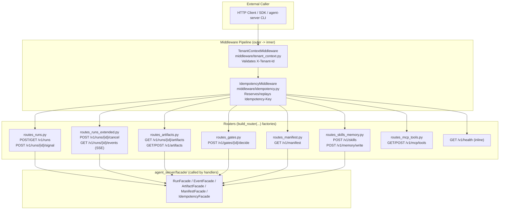
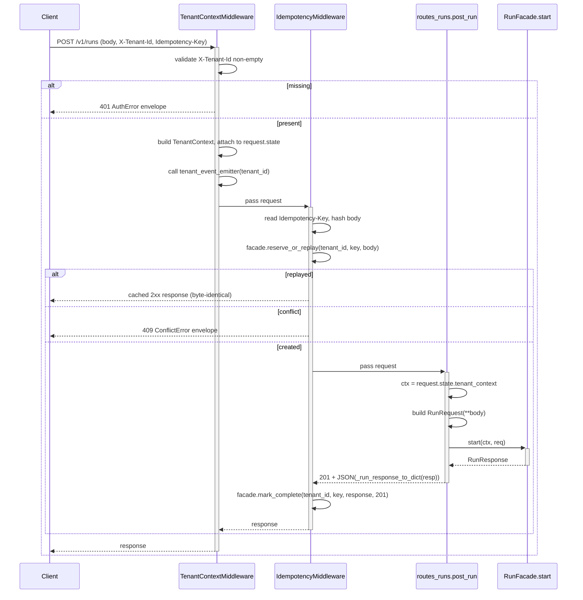
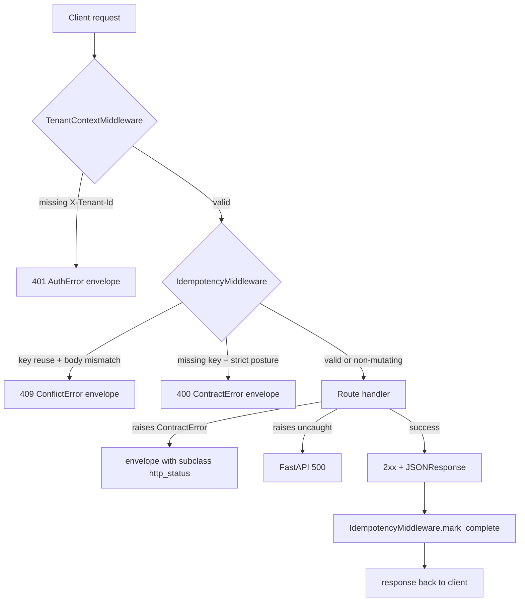

# agent_server/api/ Architecture

---

## 1. Purpose & Position in System

`agent_server/api/` is the **HTTP transport layer** of the northbound facade. It owns FastAPI route handlers, the middleware pipeline, and the assembly point (`build_app`) that wires routers and middleware into a single ASGI app.

The handlers themselves are intentionally thin: they read a `TenantContext` from `request.state` (set by middleware), parse the request body into a contract dataclass, dispatch to a facade method, and serialize the contract dataclass back to JSON. They never see kernel types, never call `hi_agent.*` directly, and never read the tenant identity from anywhere except `request.state`.

What this layer does NOT own:
- Adaptation between contract types and kernel callables (`agent_server/facade/`).
- Dataclass definitions (`agent_server/contracts/`).
- Real-kernel binding (`agent_server/runtime/`).
- Background work, lifespan setup, durable state.

R-AS-1 enforcement: `scripts/check_layering.py` fails CI on any `hi_agent.*` import in this directory. The single permitted seam is `agent_server/bootstrap.py`; the second is `agent_server/runtime/` (W32 Track A). No other module under `agent_server/api/`, `agent_server/facade/` (except annotated seams), or `agent_server/cli/` may reach into hi_agent.

---

## 2. External Interfaces

The API layer publishes the v1 northbound HTTP surface. All paths are prefixed `/v1/`:

| Method | Path | Handler module | Description |
|---|---|---|---|
| `GET` | `/v1/health` | `__init__.py` (inline) | Health probe — `{"status": "ok", "api_version": "v1"}` |
| `POST` | `/v1/runs` | `routes_runs.py` | Submit a new run (returns 201 Created) |
| `GET` | `/v1/runs/{run_id}` | `routes_runs.py` | Query run status |
| `POST` | `/v1/runs/{run_id}/signal` | `routes_runs.py` | Send control signal to a run |
| `POST` | `/v1/runs/{run_id}/cancel` | `routes_runs_extended.py` | Cancel a live run |
| `GET` | `/v1/runs/{run_id}/events` | `routes_runs_extended.py` | SSE event stream for a run |
| `GET` | `/v1/runs/{run_id}/artifacts` | `routes_artifacts.py` | List artifacts for a run |
| `GET` | `/v1/artifacts/{artifact_id}` | `routes_artifacts.py` | Get a specific artifact |
| `POST` | `/v1/artifacts` | `routes_artifacts.py` | Register an artifact (W27-L15) |
| `POST` | `/v1/gates/{gate_id}/decide` | `routes_gates.py` | Post a gate decision |
| `GET` | `/v1/manifest` | `routes_manifest.py` | Get capability + posture matrix |
| `POST` | `/v1/skills` | `routes_skills_memory.py` | Register a skill (L1 stub at v1) |
| `POST` | `/v1/memory/write` | `routes_skills_memory.py` | Write to agent memory (L1 stub at v1) |
| `GET` | `/v1/mcp/tools` | `routes_mcp_tools.py` | List available MCP tools (L1 stub) |
| `POST` | `/v1/mcp/tools/{name}` | `routes_mcp_tools.py` | Invoke an MCP tool (L1 stub) |

Headers required on mutating routes (research/prod posture):
- `X-Tenant-Id` — tenant identity (always required, every posture).
- `Idempotency-Key` — required on `POST /v1/runs`, `POST /v1/runs/{id}/signal`, `POST /v1/runs/{id}/cancel`, `POST /v1/skills`, `POST /v1/memory/write`, `POST /v1/gates/{id}/decide` under research/prod.
- Optional context headers: `X-Project-Id`, `X-Profile-Id`, `X-Session-Id`.

Builder entry point:

```python
# agent_server/api/__init__.py
def build_app(
    *,
    run_facade: RunFacade,
    event_facade: EventFacade | None = None,
    artifact_facade: ArtifactFacade | None = None,
    manifest_facade: ManifestFacade | None = None,
    idempotency_facade: IdempotencyFacade | None = None,
    idempotency_strict: bool | None = None,
    tenant_event_emitter: TenantEventEmitter | None = None,
    include_mcp_tools: bool = False,
    include_skills_memory: bool = False,
    include_gates: bool = True,
) -> FastAPI: ...
```

`run_facade` is the only required argument; the rest opt in/out routes per build configuration.

---

## 3. Internal Components



| Module | Responsibility | Annotation |
|---|---|---|
| `__init__.py` | `build_app(...)` factory; assembles routers + middleware | – |
| `routes_runs.py` | `POST/GET /v1/runs`, `POST /v1/runs/{id}/signal` | `# tdd-red-sha: ddc0f0d` |
| `routes_runs_extended.py` | `POST /cancel`, `GET /events` (SSE) | `# tdd-red-sha: 3bc0a83` |
| `routes_artifacts.py` | `GET /v1/runs/{id}/artifacts`, `GET/POST /v1/artifacts` | `# tdd-red-sha: 3bc0a83` |
| `routes_gates.py` | `POST /v1/gates/{id}/decide` | `# tdd-red-sha: e2c8c34a` |
| `routes_manifest.py` | `GET /v1/manifest` | `# tdd-red-sha: 3bc0a83` |
| `routes_skills_memory.py` | `POST /v1/skills`, `POST /v1/memory/write` | `# tdd-red-sha: e2c8c34a` |
| `routes_mcp_tools.py` | `GET/POST /v1/mcp/tools` | `# tdd-red-sha: e2c8c34a` |
| `middleware/tenant_context.py` | `TenantContextMiddleware`, header parsing, spine emission | – |
| `middleware/idempotency.py` | `IdempotencyMiddleware`, reserve/replay/conflict | – |

---

## 4. Data Flow

The two representative request shapes are JSON request/response (RPC-like) and SSE event stream.

### JSON request/response (POST /v1/runs)



### SSE event stream (GET /v1/runs/{id}/events)

```mermaid
sequenceDiagram
    participant Client
    participant Tenant as TenantContextMiddleware
    participant Route as routes_runs_extended.stream_events
    participant Facade as EventFacade
    participant Kernel

    Client->>+Tenant: GET /v1/runs/{run_id}/events
    Tenant->>Tenant: validate X-Tenant-Id, attach TenantContext
    Note over Tenant,Route: GET is non-mutating;<br/>IdempotencyMiddleware passes through
    Tenant->>+Route: pass request
    Route->>+Facade: assert_run_visible(ctx, run_id)
    Facade->>+Kernel: get_run(tenant_id, run_id)
    Kernel-->>-Facade: dict (or NotFoundError)
    Facade-->>-Route: RunStatus
    alt run not visible
        Route-->>Client: 404 NotFoundError envelope
    else visible
        Route->>+Route: open StreamingResponse(_generator(), media_type="text/event-stream")
        loop until terminal or client disconnect
            Route->>+Facade: iter_events(ctx, run_id)
            Facade->>+Kernel: iter_events(tenant_id, run_id)
            Kernel-->>-Facade: list[dict]
            Facade-->>-Route: Iterable[dict]
            Route->>Route: for event in iter:<br/>  yield render_sse_chunk(event)<br/>  await asyncio.sleep(0)
        end
        Route-->>-Client: text/event-stream (id, data lines, blank-line terminator)
        Tenant-->>-Client: stream closes
    end
```

The SSE response includes `Cache-Control: no-cache` and `X-Accel-Buffering: no` so reverse proxies (nginx, Cloudflare) do not buffer events.

---

## 5. State & Persistence

API handlers hold **no per-request state** other than what FastAPI/Starlette provide via `request.state`. The middleware writes:
- `request.state.tenant_context: TenantContext` — set by `TenantContextMiddleware`.

Persistent state lives in:
- `IdempotencyStore` (SQLite) — accessed via `IdempotencyFacade` from the middleware.
- The kernel's run/event/artifact stores — accessed only through facades.

Routers themselves are constructed once at app build time via `build_router(*, facade=...)` factory functions; each factory closes over the facade instance and exposes an `APIRouter` to FastAPI.

---

## 6. Concurrency & Lifecycle

The middleware order at request time is critical and counter-intuitive:

```python
# agent_server/api/__init__.py
# FastAPI's add_middleware inserts at index 0 — last added is OUTERMOST.
# To get TenantContext outermost we therefore add idempotency FIRST and
# tenant LAST.
if idempotency_facade is not None:
    register_idempotency_middleware(app, facade=idempotency_facade, strict=...)
if tenant_event_emitter is not None:
    app.add_middleware(TenantContextMiddleware, tenant_event_emitter=...)
else:
    app.add_middleware(TenantContextMiddleware)
```

Resulting order at request time (outer → inner): `TenantContext → Idempotency → Route handler`.

Lifespan integration:
- The `IdempotencyStore` is built by `bootstrap.py` and lives for the app's lifetime.
- `agent_server/runtime/lifespan.py` (W32 Track A) registers a FastAPI lifespan handler that builds the kernel `AgentServer` on startup, triggers `_rehydrate_runs`, and drains on shutdown.
- The `_health` route handler is sync and returns immediately; it carries no kernel dependency.

Per-route concurrency:
- Route handlers are `async def`; FastAPI routes them on its event loop.
- The SSE generator yields cooperatively (`await asyncio.sleep(0)`) so single-threaded uvicorn workers do not block on a long stream.

---

## 7. Error Handling & Observability

Error flow:



Every error envelope shape is unified (HD-5):
```json
{
  "error": "AuthError",
  "error_category": "auth_required",
  "message": "missing or empty X-Tenant-Id header",
  "retryable": false,
  "next_action": "supply X-Tenant-Id header",
  "tenant_id": "",
  "detail": ""
}
```

Observability emissions from this layer:
| Emission | Source | Event/metric |
|---|---|---|
| `tenant_context` spine event | `TenantContextMiddleware` (W31-N N.4) | `hi_agent.observability.spine_events.emit_tenant_context(tenant_id)` |
| `idempotency_header_missing` warning log | `IdempotencyMiddleware` (dev posture) | logger `agent_server.idempotency`, level `WARNING` |
| HTTP access log | uvicorn | per-request method/path/status/duration |

The middleware deliberately does NOT emit per-request metrics — that responsibility lives in `hi_agent.observability` so the metric cardinality is bounded by the kernel's existing infrastructure.

---

## 8. Security Boundary

Tenant identity is **read exclusively from request headers**, never from the request body (R-AS-4):

```python
# routes_runs.py
def _ctx(request: Request) -> TenantContext:
    ctx = getattr(request.state, "tenant_context", None)
    if not isinstance(ctx, TenantContext):  # defensive — middleware guards
        raise ContractError("tenant context missing", detail="middleware")
    return ctx
```

`scripts/check_route_tenant_context.py` (and `check_route_scope.py`) parse every route handler and fail CI on:
- Reading `tenant_id` from `body` / `request.json()`.
- Calling a facade method without first reading `_ctx(request)`.

Idempotency:
- Key + tenant_id is the composite store key. Cross-tenant key collisions are structurally impossible.
- Body mismatch on the same key returns 409, not the cached response — preventing "key recycling" attacks.

Layering enforcement:
- `scripts/check_layering.py` — no `hi_agent.*` import under `agent_server/api/`.
- `scripts/check_no_reverse_imports.py` — `hi_agent/` does not import `agent_server.*`.
- `scripts/check_documented_routes.py` — every route handler has a docstring.
- `scripts/check_route_coverage.py` — every public route has at least one integration test.

Path-traversal: workspace-related routes delegate to `hi_agent/server/workspace_path.py`, which enforces canonical paths within tenant root. The contract value object is `agent_server/contracts/workspace.py::WorkspaceContext`.

---

## 9. Extension Points

Adding a new route handler (Rule 4 R-AS-5: TDD-red-first):

1. **Write the failing test first.** Add an integration test under `tests/integration/test_routes_<surface>.py` that exercises the new route. Confirm it fails (RED).
2. **Capture the RED commit SHA.** `git log -1 --format=%H` — this is your `tdd-red-sha`.
3. **Create or extend the route module.** Add a new `agent_server/api/routes_<surface>.py` (or extend an existing one) with:
   ```python
   """<summary>.

   # tdd-red-sha: <the SHA from step 2>
   """
   ```
4. **Build a `build_router(*, ...)` factory** that takes facade dependencies as keyword-only arguments and returns an `APIRouter`.
5. **Add per-handler annotations.** Above each `@router.<method>(...)` decorator, add `# tdd-red-sha: <sha>`.
6. **Wire it in `build_app`.** Add a parameter to `agent_server/api/__init__.py::build_app` and pass it via `bootstrap.py`.
7. **Add a unit test** if the handler does anything non-trivial (most don't).
8. **Run the gates:**
   - `python scripts/check_tdd_evidence.py` — confirms the SHA annotation is real.
   - `python scripts/check_layering.py` — confirms no `hi_agent.*` import.
   - `python scripts/check_route_tenant_context.py` — confirms tenant context read from `request.state`.
   - `python scripts/check_documented_routes.py` — docstring present.

Adding new middleware: follow the same TDD-red-first workflow but implement `BaseHTTPMiddleware`. Register it in `build_app` keeping order in mind (last-added = outermost).

---

## 10. Constraints & Trade-offs

What this design assumes:
- Synchronous route handlers backed by sync-shaped facades. Async handlers are supported by FastAPI but would force the facade to expose async methods, doubling the surface.
- JSON-only request/response on RPC routes; SSE on event streams. No GraphQL, no protobuf at v1.
- Tenant identity is in headers, not in JWT claims. JWT validation is a future enhancement (`HI_AGENT_POSTURE=prod` plans to layer it).

What this design does NOT handle well:
- **Streaming uploads.** Routes accept JSON bodies up to FastAPI defaults; large artifact uploads currently use a separate write path via `ArtifactFacade.register`, not a multipart stream.
- **WebSocket transport.** SSE is one-way (server → client). Bidirectional protocols would need a WebSocket router and a different facade contract.
- **Per-route rate limiting.** Today's rate-limiting middleware (`hi_agent.server`) is global. Per-tenant per-route rate limits are tracked as a future capability.

---

## 11. References

- Builder: `agent_server/api/__init__.py:54` (`build_app`)
- Middleware:
  - `agent_server/api/middleware/tenant_context.py:50` (`TenantContextMiddleware`)
  - `agent_server/api/middleware/idempotency.py:101` (`IdempotencyMiddleware`)
  - `agent_server/api/middleware/idempotency.py:232` (`register_idempotency_middleware`)
- Route handlers: `agent_server/api/routes_*.py` (8 files)
- Facade dependencies: `agent_server/facade/ARCHITECTURE.md`
- Contract dependencies: `agent_server/contracts/ARCHITECTURE.md`
- Real-kernel binding: `agent_server/runtime/ARCHITECTURE.md`
- Integration tests: `tests/integration/test_routes_*.py`
- E2E tests: `tests/e2e/test_e2e_agent_server_*.py`
- Gates:
  - `scripts/check_layering.py`
  - `scripts/check_route_scope.py`
  - `scripts/check_route_tenant_context.py`
  - `scripts/check_route_coverage.py`
  - `scripts/check_tdd_evidence.py`
  - `scripts/check_documented_routes.py`
- Closure taxonomy + R-AS rules: `CLAUDE.md` (Ownership Tracks → AS-RO row + Narrow-Trigger Rules)
