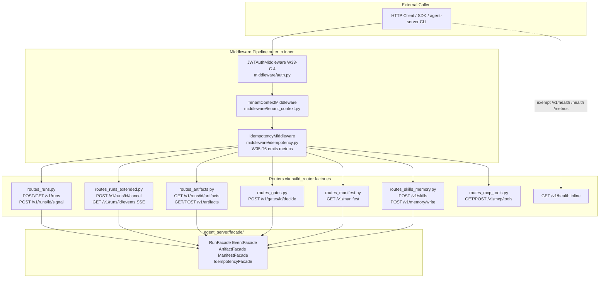
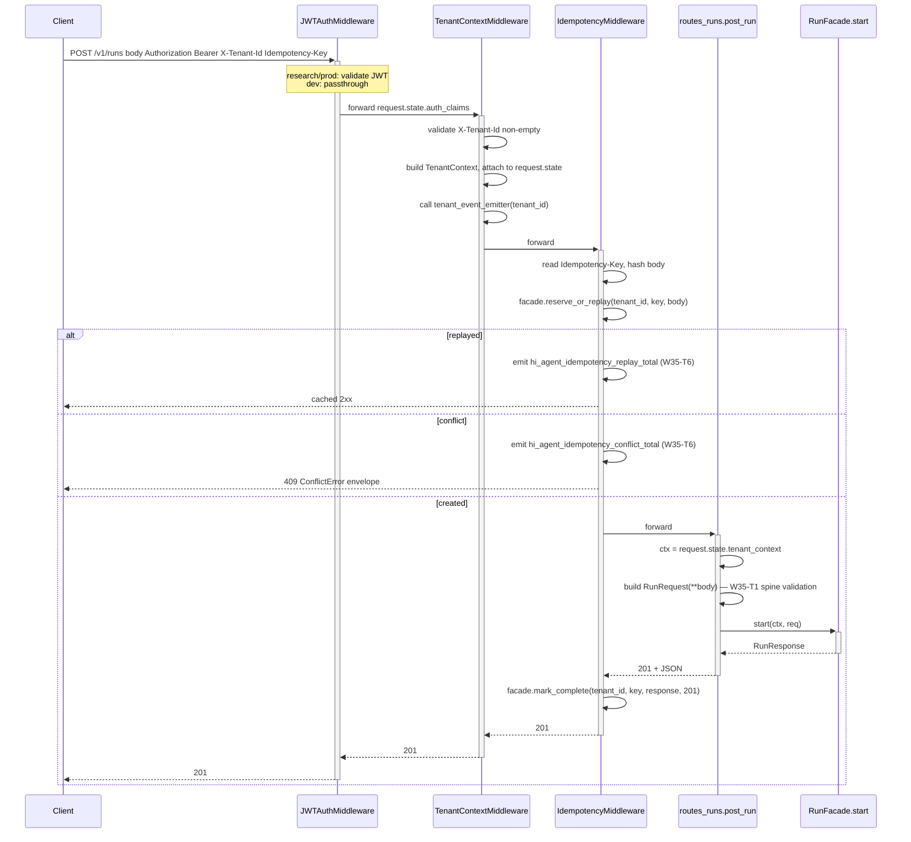

# agent_server/api — Architecture

> Last refreshed: W35 close (2026-05-05). HEAD `8bce5bc`. W35-T8 added a boot-time assertion in `build_app` requiring `idempotency_facade` whenever mutating L1-stub routes are enabled.

---

## 1. Purpose / Responsibilities

`agent_server/api/` is the **HTTP transport layer** of the northbound facade. It owns
FastAPI route handlers, the middleware pipeline, and the assembly point (`build_app`)
that wires routers and middleware into a single ASGI app.

Route handlers are intentionally thin: they read a `TenantContext` from `request.state`
(set by middleware), parse the request body into a contract dataclass, dispatch to a
facade method, and serialise the result back to JSON. They never see kernel types, never
call `hi_agent.*` directly, and never read tenant identity from anywhere except
`request.state`.

What this layer does NOT own:
- Adaptation between contract types and kernel callables (`agent_server/facade/`).
- Dataclass definitions (`agent_server/contracts/`).
- Real-kernel binding (`agent_server/runtime/`).
- Background work, lifespan setup, durable state.

---

## 2. Module Boundary (R-AS-1 + Rule 6 layering)

R-AS-1: `scripts/check_layering.py` fails CI on any `hi_agent.*` import in this directory.
The single permitted seam is `agent_server/bootstrap.py`; the second is
`agent_server/runtime/`. No other module under `agent_server/api/`,
`agent_server/facade/` (except annotated seams), or `agent_server/cli/` may reach into
hi_agent.

Rule 6 single-construction-path: `build_app(...)` is the sole builder of the FastAPI
application. The bootstrap calls it once with all facade dependencies; tests call it
with stub facades.

W35-T8 boot-time assertion: `build_app` raises `ValueError` at startup when
`include_mcp_tools=True` or `include_skills_memory=True` is set without a non-`None`
`idempotency_facade`. This converts a silent functional defect (mutating routes served
without dedup coverage) into a fail-fast bootstrap error.

Consumers:
- `agent_server/bootstrap.py::build_production_app` — production caller.
- Route-level integration tests in `tests/integration/test_routes_*.py` — pass stub facades.

---

## 3. Component Diagram


```mermaid
graph TD
    subgraph CLIENT[External Caller]
        HTTPC[HTTP Client / SDK / agent-server CLI]
    end

    subgraph MIDDLEWARE[Middleware Pipeline outer to inner]
        JWT[JWTAuthMiddleware W33-C.4<br/>middleware/auth.py]
        TC[TenantContextMiddleware<br/>middleware/tenant_context.py]
        IDEM[IdempotencyMiddleware<br/>middleware/idempotency.py<br/>W35-T6 emits metrics]
    end

    subgraph ROUTERS[Routers via build_router factories]
        RUNS[routes_runs.py<br/>POST/GET /v1/runs<br/>POST /v1/runs/id/signal]
        RUNX[routes_runs_extended.py<br/>POST /v1/runs/id/cancel<br/>GET /v1/runs/id/events SSE]
        ARTS[routes_artifacts.py<br/>GET /v1/runs/id/artifacts<br/>GET/POST /v1/artifacts]
        GATES[routes_gates.py<br/>POST /v1/gates/id/decide]
        MANI[routes_manifest.py<br/>GET /v1/manifest]
        SKM[routes_skills_memory.py<br/>POST /v1/skills<br/>POST /v1/memory/write]
        MCPT[routes_mcp_tools.py<br/>GET/POST /v1/mcp/tools]
        HEALTH[GET /v1/health inline]
    end

    subgraph FACADE[agent_server/facade/]
        F[RunFacade EventFacade<br/>ArtifactFacade ManifestFacade<br/>IdempotencyFacade]
    end

    HTTPC --> JWT
    JWT --> TC
    TC --> IDEM
    IDEM --> RUNS
    IDEM --> RUNX
    IDEM --> ARTS
    IDEM --> GATES
    IDEM --> MANI
    IDEM --> SKM
    IDEM --> MCPT
    HTTPC -. exempt /v1/health /health /metrics .-> HEALTH

    RUNS --> F
    RUNX --> F
    ARTS --> F
    GATES --> F
    MANI --> F
    SKM --> F
```

| Module | Responsibility | Annotation |
|---|---|---|
| `__init__.py` | `build_app(...)` factory; W35-T8 asserts idempotency wiring | – |
| `routes_runs.py` | `POST/GET /v1/runs`, `POST /v1/runs/{id}/signal` | `# tdd-red-sha: ddc0f0d` |
| `routes_runs_extended.py` | `POST /cancel`, `GET /events` (SSE) | `# tdd-red-sha: 3bc0a83` |
| `routes_artifacts.py` | `GET /v1/runs/{id}/artifacts`, `GET/POST /v1/artifacts` | `# tdd-red-sha: 3bc0a83` |
| `routes_gates.py` | `POST /v1/gates/{id}/decide` | `# tdd-red-sha: e2c8c34a` |
| `routes_manifest.py` | `GET /v1/manifest` | `# tdd-red-sha: 3bc0a83` |
| `routes_skills_memory.py` | `POST /v1/skills`, `POST /v1/memory/write` | `# tdd-red-sha: e2c8c34a` |
| `routes_mcp_tools.py` | `GET/POST /v1/mcp/tools` | `# tdd-red-sha: e2c8c34a` |
| `middleware/auth.py` | `JWTAuthMiddleware` (W33-C.4); validates Bearer JWT via `runtime/auth_seam` | – |
| `middleware/tenant_context.py` | `TenantContextMiddleware`; spine emission | – |
| `middleware/idempotency.py` | `IdempotencyMiddleware` (W35-T6: metrics on every reserve/replay/conflict) | – |

---

## 4. Data Flow / Sequence Diagram

`POST /v1/runs` end-to-end (with W35-T6 metrics):


```mermaid
sequenceDiagram
    participant Client
    participant JWT as JWTAuthMiddleware
    participant Tenant as TenantContextMiddleware
    participant Idem as IdempotencyMiddleware
    participant Route as routes_runs.post_run
    participant Facade as RunFacade.start

    Client->>+JWT: POST /v1/runs body Authorization Bearer X-Tenant-Id Idempotency-Key
    Note over JWT: research/prod: validate JWT<br/>dev: passthrough
    JWT->>+Tenant: forward request.state.auth_claims
    Tenant->>Tenant: validate X-Tenant-Id non-empty
    Tenant->>Tenant: build TenantContext, attach to request.state
    Tenant->>Tenant: call tenant_event_emitter(tenant_id)
    Tenant->>+Idem: forward
    Idem->>Idem: read Idempotency-Key, hash body
    Idem->>Idem: facade.reserve_or_replay(tenant_id, key, body)
    alt replayed
        Idem->>Idem: emit hi_agent_idempotency_replay_total (W35-T6)
        Idem-->>Client: cached 2xx
    else conflict
        Idem->>Idem: emit hi_agent_idempotency_conflict_total (W35-T6)
        Idem-->>Client: 409 ConflictError envelope
    else created
        Idem->>+Route: forward
        Route->>Route: ctx = request.state.tenant_context
        Route->>Route: build RunRequest(**body) — W35-T1 spine validation
        Route->>+Facade: start(ctx, req)
        Facade-->>-Route: RunResponse
        Route-->>-Idem: 201 + JSON
        Idem->>Idem: facade.mark_complete(tenant_id, key, response, 201)
        Idem-->>-Tenant: 201
        Tenant-->>-JWT: 201
        JWT-->>-Client: 201
    end
```

SSE event stream (`GET /v1/runs/{id}/events`):

```mermaid
sequenceDiagram
    participant Client
    participant Tenant as TenantContextMiddleware
    participant Route as routes_runs_extended.stream_events
    participant Facade as EventFacade
    participant Kernel

    Client->>+Tenant: GET /v1/runs/id/events
    Tenant->>Tenant: validate X-Tenant-Id
    Note over Tenant,Route: GET non-mutating; IdempotencyMiddleware passes
    Tenant->>+Route: forward
    Route->>+Facade: assert_run_visible(ctx, run_id)
    Facade->>+Kernel: get_run(tenant_id, run_id)
    Kernel-->>-Facade: dict or NotFoundError
    Facade-->>-Route: RunStatus
    alt run not visible
        Route-->>Client: 404 envelope
    else visible
        Route->>Route: open StreamingResponse text/event-stream
        loop until terminal or client disconnect
            Route->>+Facade: iter_events(ctx, run_id) live stream W33-C.5
            Facade->>+Kernel: iter_events(tenant_id, run_id)
            Kernel-->>-Facade: dict iterator
            Facade-->>-Route: yields events
            Route->>Route: yield render_sse_chunk; await asyncio.sleep(0)
        end
        Route-->>-Client: text/event-stream chunks until terminal
        Tenant-->>-Client: stream closes
    end
```

---

## 5. Key Contracts / Public API

```python
def build_app(
    *,
    run_facade: RunFacade,
    event_facade: EventFacade | None = None,
    artifact_facade: ArtifactFacade | None = None,
    manifest_facade: ManifestFacade | None = None,
    idempotency_facade: IdempotencyFacade | None = None,
    idempotency_strict: bool | None = None,
    tenant_event_emitter: TenantEventEmitter | None = None,
    include_mcp_tools: bool = False,
    include_skills_memory: bool = False,
    include_gates: bool = True,
    lifespan: AsyncContextManager[None] | None = None,
) -> FastAPI: ...
```

**W35-T8 boot-time invariant** (`agent_server/api/__init__.py:138-156`):
```python
if idempotency_facade is None and (include_mcp_tools or include_skills_memory):
    raise ValueError("build_app: include_* require idempotency_facade is not None ...")
```
This makes the dedup-dependent route groups fail-fast at boot rather than at first
replayed request.

Routes (all under `/v1/`):

| Method | Path | Mutating? | Idempotency required? |
|---|---|---|---|
| GET | `/v1/health` | no | no |
| POST | `/v1/runs` | yes | research/prod |
| GET | `/v1/runs/{id}` | no | no |
| POST | `/v1/runs/{id}/signal` | yes | research/prod |
| POST | `/v1/runs/{id}/cancel` | yes | research/prod |
| GET | `/v1/runs/{id}/events` (SSE) | no | no |
| GET | `/v1/runs/{id}/artifacts` | no | no |
| GET | `/v1/artifacts/{id}` | no | no |
| POST | `/v1/artifacts` | yes | research/prod |
| POST | `/v1/gates/{id}/decide` | yes | research/prod |
| GET | `/v1/manifest` | no | no |
| POST | `/v1/skills` | yes | always (W35-T8) |
| POST | `/v1/memory/write` | yes | always (W35-T8) |
| GET / POST | `/v1/mcp/tools[/{name}]` | mutating on POST | always (W35-T8) |

---

## 6. Posture Behaviour (Rule 11)

| Posture | `Authorization` | `X-Tenant-Id` | `Idempotency-Key` | W35-T1 spine validation | W35-T3 cross-check |
|---|---|---|---|---|---|
| `dev` | passthrough; anonymous claims injected | required (always) | optional, warning log if absent | warns on missing fields | warns when body tenant_id ≠ middleware |
| `research` | required Bearer JWT (`HI_AGENT_JWT_SECRET` HMAC) | required | required on mutating routes | raises `SpineCompletenessError` (400) | raises `TenantScopeError` (400) |
| `prod` | required | required | required | raises | raises |

Health and metrics paths bypass `JWTAuthMiddleware` via `_EXEMPT_PATHS`
(`/v1/health`, `/health`, `/metrics`).

---

## 7. Failure Modes (Rule 7 fallback inventory)

| Path | Countable | Attributable | Inspectable | Gate-asserted |
|---|---|---|---|---|
| `JWTAuthMiddleware` rejects malformed/expired/missing JWT | 401 rate observable; no per-rejection counter | `WARNING` log line per rejection | client receives 401 envelope | `tests/integration/test_v1_jwt_auth_middleware.py` |
| `TenantContextMiddleware` missing `X-Tenant-Id` | n/a | log + `tenant_context` spine event | client receives 401 `AuthError` | route integration tests |
| `IdempotencyMiddleware` body mismatch on same key | `hi_agent_idempotency_conflict_total` (W35-T6) | `WARNING` log | client receives 409 envelope | `tests/integration/test_idempotency_metrics.py` |
| `IdempotencyMiddleware` replay (same key+body) | `hi_agent_idempotency_replay_total` (W35-T6) | `INFO` log | cached response served | `tests/integration/test_idempotency_metrics.py` |
| `IdempotencyMiddleware` missing key under dev | n/a (advisory) | `idempotency_header_missing` `WARNING` log | request proceeds, no dedup | dev-posture tests |
| `RunRequest` missing spine field (W35-T1) | n/a (typed exception) | `SpineCompletenessError` traceback | 400 envelope w/ category | `tests/integration/test_routes_*.py` |
| Route handler raises uncaught | n/a | FastAPI 500 | client sees 500 | route tests + `scripts/check_route_coverage.py` |

---

## 8. Resource Lifecycle (Rule 5)

The middleware order at request time is critical and counter-intuitive:

```python
# agent_server/api/__init__.py
# FastAPI's add_middleware inserts at index 0 — last added is OUTERMOST.
# Order of registration (innermost to outermost):
if idempotency_facade is not None:
    register_idempotency_middleware(app, facade=idempotency_facade, strict=...)
if tenant_event_emitter is not None:
    app.add_middleware(TenantContextMiddleware, tenant_event_emitter=...)
else:
    app.add_middleware(TenantContextMiddleware)
# W33-C.4: JWT auth is outermost
app.add_middleware(JWTAuthMiddleware)
```

Resulting order at request time (outer → inner):
`JWTAuth → TenantContext → Idempotency → Route handler`.

Lifespan integration:
- `IdempotencyStore` is built by `bootstrap.py` and lives for the app's lifetime.
- `agent_server/runtime/lifespan.py` (W32-A + W33-C.1 + W35-T4) registers the FastAPI
  lifespan that builds the kernel `AgentServer` on startup, runs `_rehydrate_runs`,
  starts `_lease_expiry_loop`, `_current_stage_watchdog`, and `_idempotency_purge_loop`.
- Health and metrics handlers are sync and carry no kernel dependency.

Per-route concurrency:
- Route handlers are `async def`; FastAPI routes them on its event loop.
- The SSE generator yields cooperatively (`await asyncio.sleep(0)`) so single-threaded
  uvicorn workers do not block on a long stream.

---

## 9. Lineage / Spine Compliance (Rule 12)

Tenant identity is **read exclusively from request headers**, never from the request body
(R-AS-4). Route handlers call `_ctx(request)` which returns the
`TenantContext` set by middleware. `scripts/check_route_tenant_context.py` and
`scripts/check_route_scope.py` parse every route handler and fail CI on:
- Reading `tenant_id` from `body` / `request.json()`.
- Calling a facade method without first reading `_ctx(request)`.

Idempotency is scoped by `(tenant_id, key)` composite — cross-tenant key collisions are
structurally impossible.

W35-T1 spine: `RunRequest`, `GateDecisionRequest`, `MemoryWriteRequest`, etc. validate
spine completeness at construction. Under research/prod, missing fields raise
`SpineCompletenessError` which the route handler maps to 400 + envelope.

W35-T3 anti-forgery: `RunManager.create_run` cross-checks body `tenant_id` against the
authenticated middleware `tenant_id`; a mismatch raises `TenantScopeError` under strict.
The route handler therefore cannot be tricked into accepting a body-supplied tenant.

---

## 10. Test Layers (Rule 4)

| Layer | Path | What it asserts |
|---|---|---|
| L1 unit | `tests/unit/test_*_facade.py` | facade contract behaviour with stubs |
| L2 integration | `tests/integration/test_routes_*.py` | route-level handlers with stub facades |
| L2 integration | `tests/integration/test_idempotency_metrics.py` (W35-T6) | metrics emitted on replay/conflict/purge |
| L2 integration | `tests/integration/test_idempotency_ttl_purge.py` (W35-T4) | purge loop drains expired records |
| L2 integration | `tests/integration/test_mcp_tools_idempotency.py` (W35-T8) | replay + conflict + boot rejection on missing facade |
| L2 integration | `tests/integration/test_v1_jwt_auth_middleware.py` (W33-C.4) | JWT validation under all three postures |
| L3 e2e | `tests/e2e/test_e2e_agent_server_*.py` | end-to-end client flows |

Gates:
- `scripts/check_layering.py` — no `hi_agent.*` import under `agent_server/api/`
- `scripts/check_route_scope.py`, `scripts/check_route_tenant_context.py` (R-AS-4)
- `scripts/check_route_coverage.py` — every public route has at least one integration test
- `scripts/check_tdd_evidence.py` (R-AS-5) — every handler carries `# tdd-red-sha:`
- `scripts/check_documented_routes.py` — docstring required

---

## 11. Open Roadmap Items (W36+)

- W36: per-route rate limiting beyond the global limiter. Tracked in
  `docs/governance/boot-time-assertions-roadmap.md`.
- W36: streaming uploads via multipart through `ArtifactFacade.register`. Tracked in
  `docs/governance/retention-roadmap.md`.
- W37+: WebSocket transport for bidirectional streams (currently SSE only).
- W37+: per-error-category metrics roll-up (errors carry `error_category` strings but
  don't yet feed Prometheus).

---

## 12. References

Builder & middleware:
- `agent_server/api/__init__.py:57` — `build_app`
- `agent_server/api/__init__.py:138-156` — W35-T8 boot-time assertion
- `agent_server/api/middleware/auth.py:44` — `JWTAuthMiddleware` (W33-C.4)
- `agent_server/api/middleware/tenant_context.py:50` — `TenantContextMiddleware`
- `agent_server/api/middleware/idempotency.py:101` — `IdempotencyMiddleware`
- `agent_server/api/middleware/idempotency.py:232` — `register_idempotency_middleware`

Route handlers: `agent_server/api/routes_*.py` (8 files)

Sibling subsystems:
- [`../ARCHITECTURE.md`](../ARCHITECTURE.md) — top-level facade
- [`../runtime/ARCHITECTURE.md`](../runtime/ARCHITECTURE.md) — real-kernel binding (auth seam)
- [`../contracts/ARCHITECTURE.md`](../contracts/ARCHITECTURE.md) — frozen v1 schemas
- [`../config/ARCHITECTURE.md`](../config/ARCHITECTURE.md) — settings, version constants
- [`../cli/ARCHITECTURE.md`](../cli/ARCHITECTURE.md) — operator CLI

W35 references:
- `hi_agent/observability/idempotency_metrics.py` — W35-T6 metric helpers
- `docs/observability/idempotency-metrics.md` — metric catalog
- `docs/governance/boot-time-assertions-roadmap.md`

Governance:
- CLAUDE.md → AS-RO ownership track + Narrow-Trigger Rules
- CLAUDE.md → Rule 7 (Resilience), Rule 11 (Posture), Rule 12 (Spine)
- `docs/platform/agent-server-northbound-contract-v1.md`
