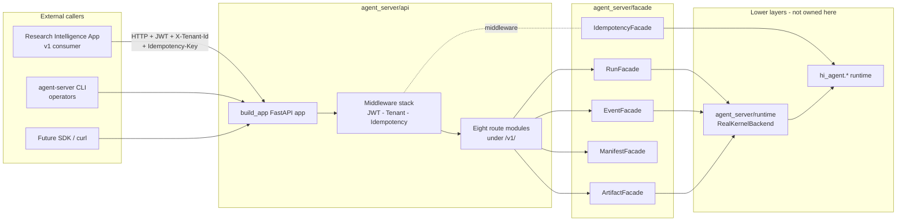
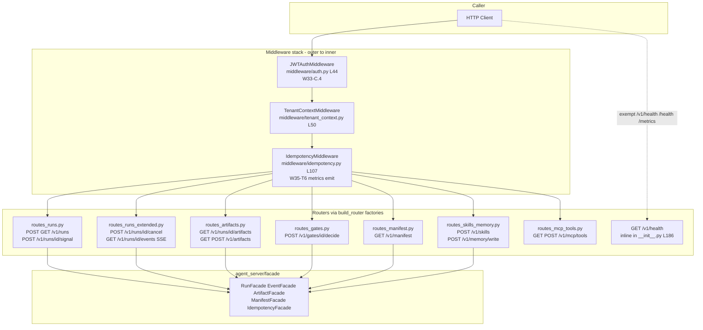
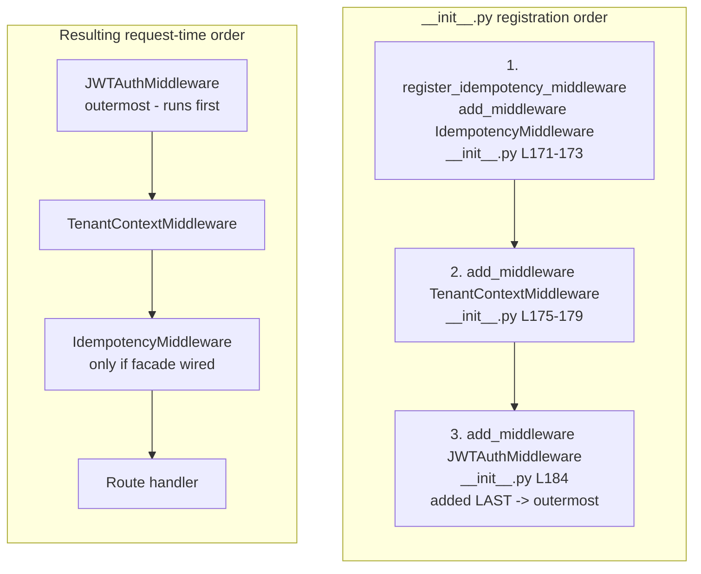
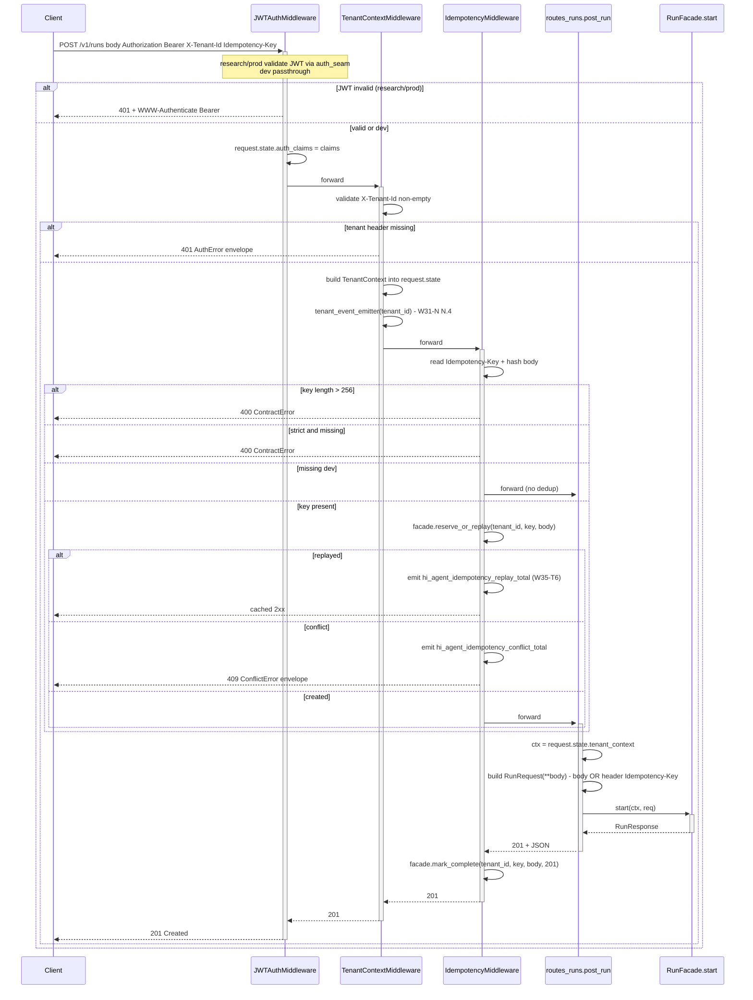

# agent_server/api — Architecture

> **Last refreshed:** 2026-05-06 (W35 corrective close + W36 plans). HEAD `276917d8`.
> **Audience:** platform engineers + downstream consumers (RIA, future SDK builders).
> **Status:** authoritative.

---

## 1. Purpose & Responsibilities

`agent_server/api/` is the **HTTP transport layer** of the northbound facade exposed
under the frozen `v1` contract. It owns:

- The FastAPI **app builder** (`build_app`) — the single Rule-6 construction path for
  the ASGI app.
- The **route handlers** under `/v1/*` (eight `routes_*.py` modules).
- The **middleware pipeline** — JWT auth, tenant-context extraction, idempotency.
- **Boot-time invariants** that translate silent-misconfiguration shapes into fail-fast
  errors at construction time (W35-T8 today; W36-A5 plan extends to B1–B14).

What this layer must NOT own:

- Adaptation between contract types and kernel callables — `agent_server/facade/`.
- Frozen contract dataclasses — `agent_server/contracts/`.
- Real-kernel binding (`AgentServer` lifecycle, lifespan tasks) — `agent_server/runtime/`.
- Background loops (lease expiry, watchdog, idempotency purge) — `runtime/lifespan.py`.
- Settings loading / posture resolution — `agent_server/config/` and `hi_agent/config/`.

Route handlers are intentionally thin: read a `TenantContext` from `request.state` (set
by middleware), parse the request body into a contract dataclass, dispatch to a facade
method, serialise the result back to JSON. They never see kernel types, never call
`hi_agent.*` directly (R-AS-1), and never read tenant identity from anywhere except
`request.state` (R-AS-4).

---

## 2. Context & Scope


```mermaid
flowchart LR
    subgraph CLIENTS[External callers]
        RIA[Research Intelligence App<br/>v1 consumer]
        CLI[agent-server CLI<br/>operators]
        SDK[Future SDK / curl]
    end

    subgraph TRANSPORT[agent_server/api]
        APP[build_app FastAPI app]
        MW[Middleware stack<br/>JWT - Tenant - Idempotency]
        ROUTES[Eight route modules<br/>under /v1/]
    end

    subgraph FACADES[agent_server/facade]
        RF[RunFacade]
        EF[EventFacade]
        AF[ArtifactFacade]
        MF[ManifestFacade]
        IF[IdempotencyFacade]
    end

    subgraph LOWER[Lower layers - not owned here]
        RT[agent_server/runtime<br/>RealKernelBackend]
        KERNEL[hi_agent.* runtime]
    end

    RIA -->|HTTP + JWT + X-Tenant-Id<br/>+ Idempotency-Key| APP
    CLI --> APP
    SDK --> APP
    APP --> MW
    MW --> ROUTES
    ROUTES --> RF
    ROUTES --> EF
    ROUTES --> AF
    ROUTES --> MF
    MW -. middleware -.- IF
    RF --> RT
    EF --> RT
    AF --> RT
    IF --> KERNEL
    RT --> KERNEL
```

The api layer talks to the world over HTTP and to the platform exclusively through the
five facade classes. It never reaches across the dashed line on its own — only the
dedicated R-AS-1 seams (`bootstrap.py`, `runtime/`) may import `hi_agent.*`.

---

## 3. Module Boundary & Dependencies

**R-AS-1 single-seam rule.** `scripts/check_layering.py` fails CI on any `hi_agent.*`
import discovered under `agent_server/api/` (or any `agent_server/*` module other than
the two annotated seams). The middleware modules (`middleware/auth.py`,
`middleware/tenant_context.py`, `middleware/idempotency.py`) and every `routes_*.py`
module are CI-asserted to import only from:

- `starlette.*`, `fastapi.*`, stdlib.
- `agent_server.contracts.*` (frozen dataclasses).
- `agent_server.facade.*` (adapters to kernel callables).
- `agent_server.runtime.auth_seam` (the runtime's documented JWT-validation surface,
  used only by `middleware/auth.py`).

**Rule 6 single-construction-path.** `build_app(...)` is the sole builder of the
FastAPI application. The bootstrap calls it once with all facade dependencies; tests
call it with stub facades. There is no parallel `make_app`, no `build_app_for_test`,
no init-on-import factory.

**Consumers.**
- `agent_server/bootstrap.py::build_production_app` — production caller.
- Route-level integration tests under `tests/integration/test_routes_*.py` — pass stub
  facades.

---

## 4. Building Blocks


```mermaid
flowchart TB
    subgraph EXTERNAL[Caller]
        HTTPC[HTTP Client]
    end

    subgraph MIDDLEWARE[Middleware stack - outer to inner]
        direction TB
        JWT[JWTAuthMiddleware<br/>middleware/auth.py L44<br/>W33-C.4]
        TC[TenantContextMiddleware<br/>middleware/tenant_context.py L50]
        IDEM[IdempotencyMiddleware<br/>middleware/idempotency.py L107<br/>W35-T6 metrics emit]
        JWT --> TC --> IDEM
    end

    subgraph ROUTERS[Routers via build_router factories]
        RUNS[routes_runs.py<br/>POST GET /v1/runs<br/>POST /v1/runs/id/signal]
        RUNX[routes_runs_extended.py<br/>POST /v1/runs/id/cancel<br/>GET /v1/runs/id/events SSE]
        ARTS[routes_artifacts.py<br/>GET /v1/runs/id/artifacts<br/>GET POST /v1/artifacts]
        GATES[routes_gates.py<br/>POST /v1/gates/id/decide]
        MANI[routes_manifest.py<br/>GET /v1/manifest]
        SKM[routes_skills_memory.py<br/>POST /v1/skills<br/>POST /v1/memory/write]
        MCPT[routes_mcp_tools.py<br/>GET POST /v1/mcp/tools]
        HEALTH[GET /v1/health<br/>inline in __init__.py L186]
    end

    subgraph FACADE[agent_server/facade]
        F[RunFacade EventFacade ArtifactFacade<br/>ManifestFacade IdempotencyFacade]
    end

    HTTPC --> JWT
    IDEM --> RUNS
    IDEM --> RUNX
    IDEM --> ARTS
    IDEM --> GATES
    IDEM --> MANI
    IDEM --> SKM
    IDEM --> MCPT
    HTTPC -. exempt /v1/health /health /metrics .-> HEALTH

    RUNS --> F
    RUNX --> F
    ARTS --> F
    GATES --> F
    MANI --> F
    SKM --> F
```

### Route inventory

Authoritative file:line for every router factory:

| Module | LOC | Mounted prefix / paths | RED-test SHA |
|---|---|---|---|
| `__init__.py::build_app` | 217 | composes everything; mounts inline `GET /v1/health` (`__init__.py:186`) | n/a |
| `routes_runs.py` | 137 | prefix `/v1/runs`: `POST ""`, `GET /{run_id}`, `POST /{run_id}/signal` | `# tdd-red-sha: ddc0f0d` |
| `routes_runs_extended.py` | 100 | prefix `/v1/runs`: `POST /{run_id}/cancel`, `GET /{run_id}/events` (SSE) | `# tdd-red-sha: 3bc0a83` |
| `routes_artifacts.py` | 144 | (no prefix) `GET /v1/runs/{run_id}/artifacts`, `GET /v1/artifacts/{artifact_id}`, `POST /v1/artifacts` (`326a0e1e`) | `# tdd-red-sha: 3bc0a83` |
| `routes_gates.py` | 128 | prefix `/v1/gates`: `POST /{gate_id}/decide` | `# tdd-red-sha: e2c8c34a` |
| `routes_manifest.py` | 41 | (no prefix) `GET /v1/manifest` | `# tdd-red-sha: 3bc0a83` |
| `routes_mcp_tools.py` | 111 | prefix `/v1/mcp`: `GET /tools`, `POST /tools/{tool_name}` | `# tdd-red-sha: e2c8c34a` |
| `routes_skills_memory.py` | 291 | (no prefix) `POST /v1/skills`, `POST /v1/memory/write` | `# tdd-red-sha: e2c8c34a` |

R-AS-5 (CLAUDE.md → AS-RO ownership track) requires every public route handler to
carry a `# tdd-red-sha: <commit>` annotation referencing the RED-stage commit.
`scripts/check_tdd_evidence.py` parses every `routes_*.py` and fails CI on a missing
annotation.

### Middleware stack


```mermaid
flowchart TB
    subgraph REGISTRATION[__init__.py registration order]
        direction TB
        REG1[1. register_idempotency_middleware<br/>add_middleware IdempotencyMiddleware<br/>__init__.py L171-173]
        REG2[2. add_middleware TenantContextMiddleware<br/>__init__.py L175-179]
        REG3[3. add_middleware JWTAuthMiddleware<br/>__init__.py L184<br/>added LAST -> outermost]
        REG1 --> REG2 --> REG3
    end

    subgraph RUNTIME[Resulting request-time order]
        direction TB
        R1[JWTAuthMiddleware<br/>outermost - runs first]
        R2[TenantContextMiddleware]
        R3[IdempotencyMiddleware<br/>only if facade wired]
        R4[Route handler]
        R1 --> R2 --> R3 --> R4
    end
```

Counter-intuitively, FastAPI / Starlette inserts each `add_middleware` call at index 0,
so **the LAST middleware added is OUTERMOST at runtime**. The `__init__.py` body relies
on this; the comment block at lines 165–169 documents the inversion explicitly.

### Boot-time assertions (W35-T8 + W36-A5 plan)

`build_app(...)` (`__init__.py:57`) is the canonical place for boot-time invariants
that turn silent functional defects into fail-fast `ValueError` at construction.

**Today (W35-T8 — verified at HEAD `276917d8`).** Lines 138–156:

```python
_routes_requiring_idempotency = {
    "include_mcp_tools": include_mcp_tools,
    "include_skills_memory": include_skills_memory,
}
if idempotency_facade is None:
    enabled_dependent = [
        name for name, enabled in _routes_requiring_idempotency.items() if enabled
    ]
    if enabled_dependent:
        raise ValueError(
            f"build_app: {enabled_dependent} require idempotency_facade is not None "
            f"to ensure mutating-route replay semantics; supply idempotency_facade "
            f"in the bootstrap or set the include_* flags to False (W35-T8)."
        )
```

This converts a silent mutating-route exposure (no dedup) into a configuration error
at startup.

**W36-A5 plan (B1–B14).** `docs/superpowers/plans/2026-05-06-wave-36-a5-boot-time-assertions.md`
extends the W35-T8 reference shape across 14 sites. The two that touch `build_app`:

- **B13** — `event_facade`, `artifact_facade`, `manifest_facade` are silently dropped
  today when `None`. Under research/prod posture, B13 will raise at boot; under dev a
  WARNING is emitted with degraded behaviour. Cross-coordinated with RIA G-RIA-13
  (consumer-side `scripts/check_route_presence.py`).
- **B14** — `include_gates=True` (default) without `idempotency_facade` is functionally
  identical to the `include_mcp_tools` / `include_skills_memory` exposure, but ~50
  route-level unit tests today pass `idempotency_facade=None` and rely on gates being
  mounted. B14 sequences a shared `tests/conftest.py::stub_idempotency_facade` fixture
  before the assertion lands.

The shared helper introduced in W36-A5 day 1 — `assert_research_posture_required(name,
value, posture, fix_hint, defect_id)` in `hi_agent/config/posture.py` — is the single
construction path (Rule 6) for boot-time assertion semantics across all 14 sites.

---

## 5. Runtime View — Key Scenarios

### 5.1 Canonical request: `POST /v1/runs`


```mermaid
sequenceDiagram
    participant Client
    participant JWT as JWTAuthMiddleware
    participant Tenant as TenantContextMiddleware
    participant Idem as IdempotencyMiddleware
    participant Route as routes_runs.post_run
    participant Facade as RunFacade.start

    Client->>+JWT: POST /v1/runs body Authorization Bearer X-Tenant-Id Idempotency-Key
    Note over JWT: research/prod validate JWT via auth_seam<br/>dev passthrough
    alt JWT invalid (research/prod)
        JWT-->>Client: 401 + WWW-Authenticate Bearer
    else valid or dev
        JWT->>JWT: request.state.auth_claims = claims
        JWT->>+Tenant: forward
        Tenant->>Tenant: validate X-Tenant-Id non-empty
        alt tenant header missing
            Tenant-->>Client: 401 AuthError envelope
        else
            Tenant->>Tenant: build TenantContext into request.state
            Tenant->>Tenant: tenant_event_emitter(tenant_id) - W31-N N.4
            Tenant->>+Idem: forward
            Idem->>Idem: read Idempotency-Key + hash body
            alt key length > 256
                Idem-->>Client: 400 ContractError
            else strict and missing
                Idem-->>Client: 400 ContractError
            else missing dev
                Idem->>+Route: forward (no dedup)
            else key present
                Idem->>Idem: facade.reserve_or_replay(tenant_id, key, body)
                alt replayed
                    Idem->>Idem: emit hi_agent_idempotency_replay_total (W35-T6)
                    Idem-->>Client: cached 2xx
                else conflict
                    Idem->>Idem: emit hi_agent_idempotency_conflict_total
                    Idem-->>Client: 409 ConflictError envelope
                else created
                    Idem->>+Route: forward
                end
            end
            Route->>Route: ctx = request.state.tenant_context
            Route->>Route: build RunRequest(**body) - body OR header Idempotency-Key
            Route->>+Facade: start(ctx, req)
            Facade-->>-Route: RunResponse
            Route-->>-Idem: 201 + JSON
            Idem->>Idem: facade.mark_complete(tenant_id, key, body, 201)
            Idem-->>-Tenant: 201
            Tenant-->>-JWT: 201
            JWT-->>-Client: 201 Created
        end
    end
```

Notable shape details:

- `routes_runs.py:53–67`: under W35-T8 follow-up the route accepts `Idempotency-Key`
  from the HTTP header when no `idempotency_key` field is present in the body. The
  body field still wins when both are provided. Tracked by the W35 corrective commit
  `04c1faa4`.
- `routes_runs.py:73–76`: `POST /v1/runs` returns **201 Created**, not 200, since
  W31-N (N-11). The envelope is unchanged.

### 5.2 Server-Sent Events: `GET /v1/runs/{id}/events`

```mermaid
sequenceDiagram
    participant Client
    participant JWT as JWTAuthMiddleware
    participant Tenant as TenantContextMiddleware
    participant Route as routes_runs_extended.stream_events
    participant Facade as EventFacade
    participant Kernel

    Client->>+JWT: GET /v1/runs/id/events
    JWT->>+Tenant: validated
    Tenant->>+Route: forward (GET non-mutating - IdempotencyMiddleware passes through)
    Route->>+Facade: assert_run_visible(ctx, run_id)
    Facade->>+Kernel: get_run(tenant_id, run_id)
    Kernel-->>-Facade: dict OR NotFoundError
    Facade-->>-Route: RunStatus
    alt run not visible
        Route-->>Client: 404 envelope
    else visible
        Route->>Route: open StreamingResponse text/event-stream<br/>Cache-Control no-cache + X-Accel-Buffering no
        loop until terminal or client disconnect
            Route->>+Facade: iter_events(ctx, run_id)
            Facade->>+Kernel: iter_events(tenant_id, run_id)
            Kernel-->>-Facade: dict iterator
            Facade-->>-Route: yields events
            Route->>Route: yield render_sse_chunk; await asyncio.sleep(0)
        end
        Route-->>-Client: stream closes when terminal
    end
    Tenant-->>-JWT: -
    JWT-->>-Client: -
```

The async generator yields `await asyncio.sleep(0)` between frames so single-threaded
uvicorn workers stay cooperative under long streams (`routes_runs_extended.py:72–75`).

### 5.3 Error envelope shape

Every `routes_*.py` defines a local `_error_response(exc: ContractError) -> JSONResponse`
that produces the canonical envelope. The shape (post W24-J5 / HD-5):

```json
{
  "error": "ContractError",
  "message": "<human-readable>",
  "tenant_id": "<from-context-or-empty>",
  "detail": "<machine-readable-detail>"
}
```

For middleware-emitted rejections (auth, idempotency-key length, etc.), the envelope
gains the unified `error_category` / `retryable` / `next_action` fields:

```json
{
  "error_category": "auth | contract_violation | tenant_scope | idempotency_conflict",
  "message": "...",
  "retryable": false,
  "next_action": "..."
}
```

---

## 6. Cross-cutting Concerns

### 6.1 Posture wiring (Rule 11)

| Posture | `Authorization` | `X-Tenant-Id` | `Idempotency-Key` (mutating) | Spine validation | W35-T3 cross-check |
|---|---|---|---|---|---|
| `dev` | passthrough; anonymous claims | required (always) | optional, WARNING when missing | warn on missing fields | warn when body tenant != middleware |
| `research` | required Bearer JWT (`HI_AGENT_JWT_SECRET` HMAC) | required | required (400 if absent) | raise `SpineCompletenessError` (400) | raise `TenantScopeError` (400) |
| `prod` | required | required | required | raise | raise |

Posture is read by:
- Middleware: `IdempotencyMiddleware._strict` flag stamped from facade `is_strict` in
  `register_idempotency_middleware` (W31-N N.4 closes the prior `Posture.from_env()`
  reach-in inside the middleware module).
- Route handlers: `routes_skills_memory.py::_strict_from_env()` is an env-only fallback
  used when no `idempotency_facade` is wired — also pending W37 closure under B20.

`/v1/health`, `/health`, `/metrics` are exempt from `JWTAuthMiddleware` via
`_EXEMPT_PATHS` (`middleware/auth.py:41`) so operators can probe a serving instance
even when secrets are not yet wired.

### 6.2 Failure modes (Rule 7 fallback inventory)

| Path | Countable | Attributable | Inspectable | Gate |
|---|---|---|---|---|
| `JWTAuthMiddleware` rejects malformed/expired/missing JWT | 401 rate observable | per-rejection log | 401 envelope | `tests/integration/test_v1_jwt_auth_middleware.py` |
| `TenantContextMiddleware` missing `X-Tenant-Id` | 401 rate | spine event + log | 401 `AuthError` | route integration tests |
| `IdempotencyMiddleware` body mismatch on same key | `hi_agent_idempotency_conflict_total` (W35-T6) | WARNING log | 409 envelope | `tests/integration/test_idempotency_metrics.py` |
| `IdempotencyMiddleware` replay (same key+body) | `hi_agent_idempotency_replay_total` | INFO log | cached response | `tests/integration/test_idempotency_metrics.py` |
| `IdempotencyMiddleware` missing key under dev | n/a (advisory) | `idempotency_header_missing` WARNING | request proceeds, no dedup | dev-posture tests |
| `IdempotencyMiddleware` key length > 256 (W34+ T1d) | n/a | log | 400 envelope | middleware idempotency tests |
| `RunRequest` missing spine field (W35-T1) | `hi_agent_spine_violation_total` (to-confirm — owner is contracts/) | typed exception | 400 envelope w/ category | `tests/integration/test_routes_*.py` |
| Route handler raises uncaught | n/a | FastAPI 500 | client sees 500 | `scripts/check_route_coverage.py` |

The W35 corrective `C-1` track relabelled idempotency metric labels to use
`outcome="replayed"|"conflict"|"created"` rather than per-outcome counter names where
applicable — see `hi_agent/observability/idempotency_metrics.py` and
`docs/observability/idempotency-metrics.md` for the canonical label set.

### 6.3 Lineage / Spine completeness (Rule 12)

Tenant identity is **read exclusively from request headers**, never from the request
body (R-AS-4). Each route handler calls `_ctx(request)` which returns the
`TenantContext` set by middleware. Two CI gates parse every handler AST:

- `scripts/check_route_tenant_context.py` — fails on any handler that reads
  `tenant_id` from `body` / `request.json()`.
- `scripts/check_route_scope.py` — fails on any handler that calls a facade method
  without first reading `_ctx(request)`.

Idempotency is scoped by the composite `(tenant_id, key)` — cross-tenant key
collisions are structurally impossible (`facade/idempotency_facade.py:157–166`).

W35-T1 spine: `RunRequest`, `GateDecisionRequest`, `MemoryWriteRequest`,
`SkillRegistration` validate spine completeness at construction. Missing fields raise
`SpineCompletenessError` under research/prod which the route maps to 400 + envelope.

W35-T3 anti-forgery: `RunManager.create_run` cross-checks body `tenant_id` against the
authenticated middleware `tenant_id`; mismatch raises `TenantScopeError` under strict.
The route handler therefore cannot be tricked into accepting a body-supplied tenant.

W35-T9 (attempt_id propagation): each `POST /v1/runs/{id}/signal` and `cancel` path
forwards an `attempt_id` field down to the kernel side so retries can be traced
end-to-end. Tracked in the W35 corrective batch closing 38 of the 91 hidden findings.

### 6.4 Resource lifecycle (Rule 5)

- `IdempotencyStore` is built by `bootstrap.py` and lives for the app's lifetime —
  closed only when the bootstrap that constructed it tears it down, not by the facade.
- `agent_server/runtime/lifespan.py` (W32-A + W33-C.1 + W35-T4) registers the FastAPI
  lifespan that builds the kernel `AgentServer` on startup, runs `_rehydrate_runs`,
  and starts `_lease_expiry_loop`, `_current_stage_watchdog`, `_idempotency_purge_loop`.
- `/v1/health` and `/metrics` handlers are sync and carry no kernel dependency.
- Route handlers are `async def`; FastAPI runs them on its event loop.
- `routes_runs_extended.stream_events` yields cooperatively (`await asyncio.sleep(0)`)
  so single-threaded uvicorn workers don't block on long streams.

---

## 7. Architecture Decisions

| ID | Decision | Pointer |
|---|---|---|
| **R-AS-1** | No `hi_agent.*` imports under `agent_server/api/` — single-seam discipline | CLAUDE.md (Rule 6 + AS-RO track); `scripts/check_layering.py` |
| **R-AS-4** | Tenant identity is read exclusively from request headers via `request.state.tenant_context` | CLAUDE.md; `scripts/check_route_tenant_context.py` |
| **R-AS-5** | Every `routes_*.py` handler carries `# tdd-red-sha: <sha>` referencing the failing-test commit | CLAUDE.md → Rule 4; `scripts/check_tdd_evidence.py` |
| **W31-N** N.11 | `POST /v1/runs` returns 201 Created, not 200 — proper resource-creation status | `routes_runs.py:73–76` |
| **W33-C.4** | JWT auth is the outermost middleware (added last) so unauthenticated requests are rejected before any other layer sees them | `middleware/auth.py:44`; `__init__.py:184` |
| **W34+ T1d** | `Idempotency-Key` length capped at 256 chars to bound SQLite storage and request matching | `middleware/idempotency.py:45`, `158–176` |
| **W34+ T1e** | Body hashing applies Unicode NFC normalization so NFC-vs-NFD wire variants of the same logical body collapse to one hash | `facade/idempotency_facade.py:41–63` |
| **W35-T6** | Idempotency outcomes (replayed / conflict / created) emit Prometheus counters at every middleware-level reserve and replay | `middleware/idempotency.py` + `hi_agent/observability/idempotency_metrics.py` |
| **W35-T8** | `build_app` raises `ValueError` at boot when `include_mcp_tools` or `include_skills_memory` is True without `idempotency_facade` | `__init__.py:138–156` |
| **W36-B13** (planned) | `build_app` raises under research/prod when `event_facade` / `artifact_facade` / `manifest_facade` is None — silent route omission becomes fail-fast | `docs/superpowers/plans/2026-05-06-wave-36-a5-boot-time-assertions.md` §B13 |
| **W36-B14** (planned) | `build_app` raises under research/prod when `include_gates=True` and `idempotency_facade is None` — extends W35-T8 to gate routes after migrating ~50 route-level tests | same plan §B14 |

---

## 8. Quality Attributes

- **Tenant isolation.** `(tenant_id, key)` composite scoping for idempotency; route
  handlers read tenant from middleware-validated state only; HD-4 orphan-record
  filtering inherited from `ArtifactFacade`.
- **Replay safety.** Mutating routes (`POST /v1/runs`, `/v1/runs/{id}/signal`,
  `/v1/runs/{id}/cancel`, `/v1/skills`, `/v1/memory/write`, `/v1/gates/{id}/decide`,
  `/v1/artifacts`) flow through `IdempotencyMiddleware`; replays return byte-identical
  cached responses; body mismatches surface as 409.
- **Observability.** Every fallback path is countable + attributable + inspectable.
  W35-T6 metric set covers idempotency outcomes; auth + tenant rejections produce
  structured logs; route handlers re-raise contract errors so the FastAPI traceback
  carries enough state for postmortem.
- **Cross-platform.** All middleware uses pure async / Starlette primitives — no
  POSIX-only signal handling in this layer (the SIGTERM hook lives in
  `runtime/lifespan.py:268`, scoped to that module).

### Test layers (Rule 4)

| Layer | Path | What it asserts |
|---|---|---|
| L1 unit | `tests/unit/test_*_facade.py` | facade contract behaviour with stubs |
| L2 integration | `tests/integration/test_routes_*.py` | route-level handlers with stub facades |
| L2 integration | `tests/integration/test_idempotency_metrics.py` (W35-T6) | metrics emitted on replay / conflict / purge |
| L2 integration | `tests/integration/test_idempotency_ttl_purge.py` (W35-T4) | purge loop drains expired records |
| L2 integration | `tests/integration/test_mcp_tools_idempotency.py` (W35-T8) | replay + conflict + boot rejection on missing facade |
| L2 integration | `tests/integration/test_v1_jwt_auth_middleware.py` (W33-C.4) | JWT validation under all three postures |
| L3 e2e | `tests/e2e/test_e2e_agent_server_*.py` | end-to-end client flows |

### CI gates

- `scripts/check_layering.py` — no `hi_agent.*` import under `agent_server/api/`.
- `scripts/check_route_scope.py`, `scripts/check_route_tenant_context.py` (R-AS-4).
- `scripts/check_route_coverage.py` — every public route has at least one integration
  test.
- `scripts/check_tdd_evidence.py` (R-AS-5) — every handler carries `# tdd-red-sha:`.
- `scripts/check_documented_routes.py` — docstring required.

---

## 9. Risks & Technical Debt

- **B14 still open at HEAD `276917d8`.** `include_gates=True` (default) without
  `idempotency_facade` mounts gate routes whose middleware-level dedup never fires,
  so gate decisions become non-idempotent under research/prod when the bootstrap omits
  the facade. `_is_gates_decide_mutation` (`middleware/idempotency.py:87–96`) only
  takes effect when `IdempotencyMiddleware` is registered — and the middleware is only
  registered when `idempotency_facade is not None` (`__init__.py:170–173`). Closure is
  W36-A5 day 2–3.
- **~50 route-level unit tests pass `idempotency_facade=None`.** These were created
  before W35-T8 to keep route tests focused on handler logic. The W36-A5 plan migrates
  them all onto a shared `tests/conftest.py::stub_idempotency_facade` fixture before
  the B14 assertion lands.
- **`routes_skills_memory.py::_strict_from_env`** reads `HI_AGENT_POSTURE` directly
  rather than going through the injected facade — a Rule 6 single-construction-path
  drift that's tolerable today (only triggered when no facade is wired) but tracked
  for closure as W36 B20.
- **Spine-violation metric not yet wired.** `RunRequest` raising
  `SpineCompletenessError` produces a 400 envelope but does not yet emit a Prometheus
  counter. The contracts module owns this and a metric is on the W37 backlog. (Marked
  to-confirm — owner is `agent_server/contracts/`, outside this layer's scope to add
  but called out for visibility.)
- **`/metrics` endpoint not currently wired by `build_app`.** Planned to land via the
  Prometheus client integration in W36-B18 (MEDIUM-severity, deferred to W37 per the
  A5 plan §7).

---

## 10. References

### Source

- `agent_server/api/__init__.py:57` — `build_app`
- `agent_server/api/__init__.py:138–156` — W35-T8 boot-time assertion (verified)
- `agent_server/api/__init__.py:165–184` — middleware registration order
- `agent_server/api/__init__.py:186–194` — inline `GET /v1/health`
- `agent_server/api/middleware/auth.py:44` — `JWTAuthMiddleware` (W33-C.4)
- `agent_server/api/middleware/auth.py:41` — `_EXEMPT_PATHS`
- `agent_server/api/middleware/tenant_context.py:50` — `TenantContextMiddleware`
- `agent_server/api/middleware/idempotency.py:107` — `IdempotencyMiddleware`
- `agent_server/api/middleware/idempotency.py:263` — `register_idempotency_middleware`
- `agent_server/api/routes_*.py` — eight route modules

### Sibling subsystems

- [`../facade/ARCHITECTURE.md`](../facade/ARCHITECTURE.md) — adapters consumed here.
- [`../runtime/ARCHITECTURE.md`](../runtime/ARCHITECTURE.md) — real-kernel binding +
  lifespan + `auth_seam`.
- [`../contracts/ARCHITECTURE.md`](../contracts/ARCHITECTURE.md) — frozen v1 schemas.
- [`../config/ARCHITECTURE.md`](../config/ARCHITECTURE.md) — settings, version
  constants.
- [`../cli/ARCHITECTURE.md`](../cli/ARCHITECTURE.md) — operator CLI.

### Wave references

- W35-T6 metric helpers: `hi_agent/observability/idempotency_metrics.py`.
- W35-T8 reference impl: `agent_server/api/__init__.py:138–156` (this file).
- W36-A5 plan: `docs/superpowers/plans/2026-05-06-wave-36-a5-boot-time-assertions.md`.
- Boot-time assertion roadmap: `docs/governance/boot-time-assertions-roadmap.md`.

### Governance

- CLAUDE.md → AS-RO ownership track + Narrow-Trigger Rules.
- CLAUDE.md → Rule 6 (single construction), Rule 7 (resilience), Rule 11 (posture),
  Rule 12 (spine), Rule 16 (test profiles).
- `docs/platform/agent-server-northbound-contract-v1.md` — frozen contract reference.
