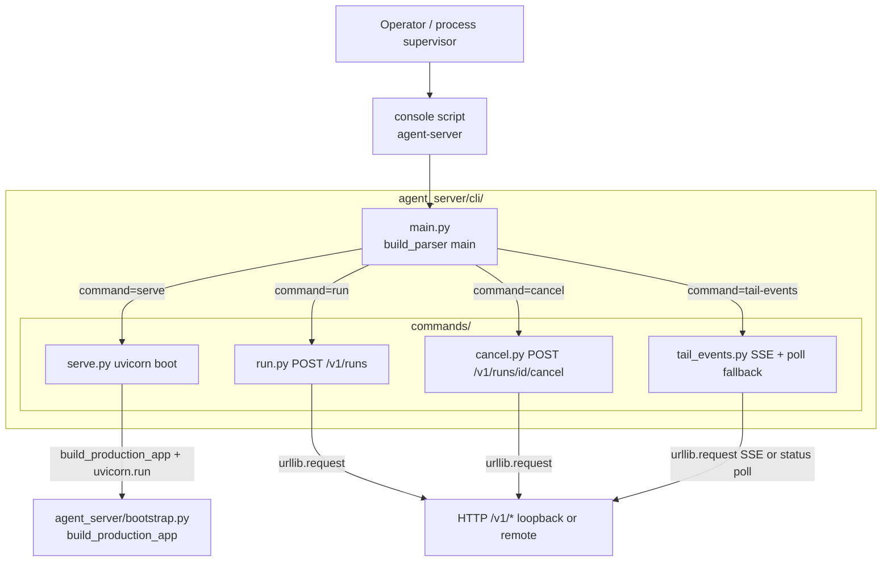
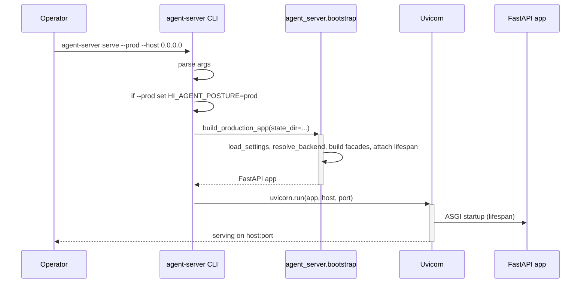
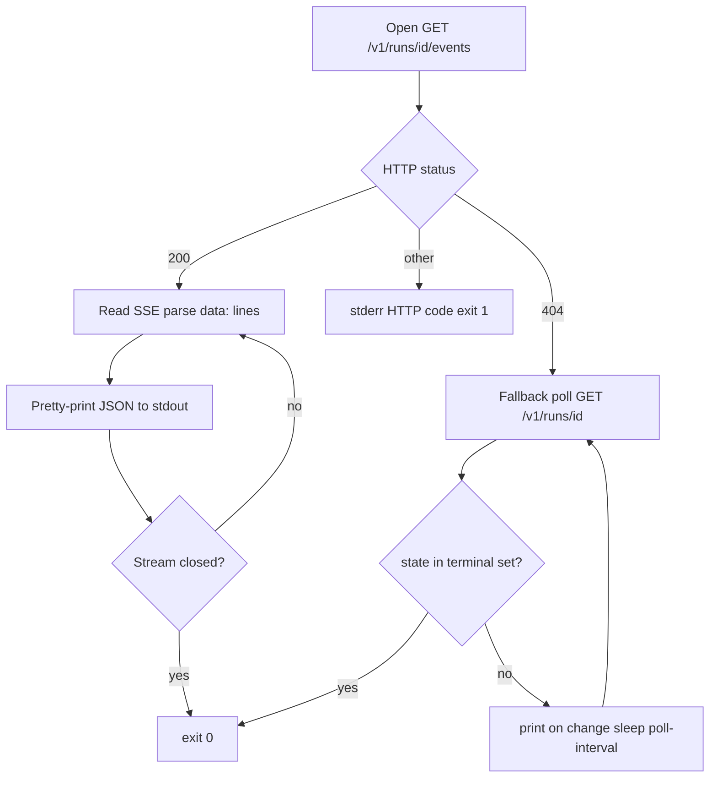

# agent_server/cli — Architecture

> Last refreshed: W35 close (2026-05-05). HEAD `8bce5bc`. No CLI surface change in W35; document refreshed for cross-doc parity.

---

## 1. Purpose / Responsibilities

`agent_server/cli/` is the **operator-facing command-line surface** of the northbound
facade. It exists so a human (or a process supervisor like PM2 / systemd) can boot the
ASGI app, submit a run, cancel a run, or stream a run's events without writing any code.
Every subcommand is a thin shell over the same v1 HTTP routes that downstream applications
use.

What this package owns:
- The `agent-server` console script entry point (`pyproject.toml`).
- argparse dispatcher (`main.py`) and four subcommand modules (`commands/serve|run|cancel|tail_events.py`).
- Loopback proxy bypass for `127.0.0.1`/`localhost`.

What this package does NOT own:
- HTTP transport itself (`agent_server/api/`).
- App assembly (`agent_server/bootstrap.py`).
- Real-kernel binding (`agent_server/runtime/`).
- Run logic, business semantics, kernel-side state.

---

## 2. Module Boundary (R-AS-1 + Rule 6 layering)

Two design principles govern this layer:

1. **R-AS-1 stdlib-only.** The CLI may not import `hi_agent.*` directly. Subcommands use
   `urllib.request` + `json` for HTTP. The single seam is `serve.py`'s call to
   `agent_server.bootstrap.build_production_app` — itself the documented seam #1.
2. **No hidden state.** No client config file, no session cache, no cookie jar. Tenant
   identity is supplied per-invocation via `--tenant`; idempotency via
   `--idempotency-key`.

The layering gate `scripts/check_layering.py` fails CI on any `hi_agent.*` import under
`agent_server/cli/`.

---

## 3. Component Diagram



| Module | Role |
|---|---|
| `main.py` | argparse dispatcher; `build_parser()` registers each subcommand |
| `commands/serve.py` | imports `agent_server.bootstrap.build_production_app`, calls `uvicorn.run`; `--prod` sets `HI_AGENT_POSTURE=prod` and binds `0.0.0.0` |
| `commands/run.py` | loads JSON from `--request-json`, posts to `/v1/runs` with headers |
| `commands/cancel.py` | tries `/v1/runs/{id}/cancel` first; on 404 falls back to `/v1/runs/{id}/signal` |
| `commands/tail_events.py` | streams SSE; on 404 polls `GET /v1/runs/{id}` until terminal |

---

## 4. Data Flow / Sequence Diagram

`agent-server serve` (in-process app boot):



`agent-server tail-events` (SSE with poll fallback):



---

## 5. Key Contracts / Public API

Console script:
```
agent-server = "agent_server.cli.main:main"
```

Subcommands and their HTTP targets:

| Subcommand | HTTP target | Purpose |
|---|---|---|
| `agent-server serve` | n/a (boots the app itself) | uvicorn against `build_production_app()`; `--prod` flips posture |
| `agent-server run` | `POST /v1/runs` | submit a run from JSON file |
| `agent-server cancel` | `POST /v1/runs/{id}/cancel` (with `/signal` fallback) | cancel a live run |
| `agent-server tail-events` | `GET /v1/runs/{id}/events` (with status-poll fallback) | stream SSE |

Common flags:

| Flag | Where | Default | Effect |
|---|---|---|---|
| `--server` | `run`, `cancel`, `tail-events` | `http://127.0.0.1:8080` | target server URL |
| `--tenant` | `run`, `cancel`, `tail-events` | required | sets `X-Tenant-Id` |
| `--idempotency-key` | `run`, `cancel` | empty / body fallback | sets `Idempotency-Key` |
| `--timeout` | all HTTP commands | 15 s (run/cancel), 300 s (tail-events) | wall-clock cap |
| `--host` / `--port` | `serve` | `127.0.0.1` / `8080` | uvicorn bind |
| `--prod` | `serve` | off | sets `HI_AGENT_POSTURE=prod`, binds `0.0.0.0` |
| `--state-dir` | `serve` | env-derived | persistent state directory |

Exit codes:

| Code | Meaning |
|---|---|
| 0 | Command succeeded |
| 1 | HTTP error or connection failure |
| 2 | argparse error or input-file failure |

---

## 6. Posture Behaviour (Rule 11)

| Posture | `serve` defaults | HTTP-subcommand expectations | W35-T1 / W35-T3 effect |
|---|---|---|---|
| `dev` | `--host 127.0.0.1` (loopback only) | tenant header still required; spine validation warns | Posture set indirectly via env; CLI itself unchanged |
| `research` | `--prod` flips to `0.0.0.0` and `HI_AGENT_POSTURE=prod` | strict spine validation in body; mismatched body tenant_id rejected (W35-T3) | CLI does not inject auth; reverse proxy required for JWT |
| `prod` | same as research | same | same |

Note: under research/prod, `JWTAuthMiddleware` rejects any HTTP call without a valid Bearer
token. Operators integrate the CLI by pre-issuing a JWT and exporting it as `Authorization`
via a reverse proxy, or by extending the CLI with a `--auth-token` flag (not yet shipped).

---

## 7. Failure Modes (Rule 7 fallback inventory)

| Path | Countable | Attributable | Inspectable | Gate-asserted |
|---|---|---|---|---|
| HTTP 4xx/5xx response | n/a (CLI shell, not a service) | exit code 1 + stderr `HTTP <code>: <body>` | operator sees stderr | `tests/integration/test_cli_*.py` |
| Connection refused / DNS failure / timeout | n/a | stderr `connection_failed: <reason>` | operator sees stderr | `tests/integration/test_cli_*.py` |
| Malformed JSON in `--request-json` | n/a | exit code 2 + stderr | operator sees stderr | argparse defaults |
| `cancel` falls back to `/signal` on 404 | n/a (visible to operator) | stderr informational | next response indicates outcome | `tests/integration/test_cli_cancel.py` |
| `tail-events` falls back to status poll on 404 | n/a | stderr informational | polling output to stdout | `tests/integration/test_cli_tail_events.py` |

The CLI does not emit metrics; it prints what the operator needs and exits.

---

## 8. Resource Lifecycle (Rule 5)

`serve` blocks on `uvicorn.run`; the FastAPI lifespan in
`agent_server/runtime/lifespan.py` owns startup/shutdown of durable resources. Ctrl-C and
SIGTERM trigger the lifespan shutdown chain.

`run` and `cancel` are single-shot synchronous HTTP calls.

`tail-events` consumes an SSE stream cooperatively: each `readline` yields control while
waiting for the next event; the stream loop checks the wall-clock deadline so a stuck
server cannot pin the process forever.

The CLI does NOT spawn subprocesses, threads, or background tasks. No async resources;
Rule 5 is N/A for the CLI itself.

---

## 9. Lineage / Spine Compliance (Rule 12)

Tenant identity flows in via `--tenant` and is forwarded as the `X-Tenant-Id` HTTP
header. The CLI does not invent tenant_id, project_id, or run_id values. Spine
completeness is the server's responsibility once the request reaches the route layer.

W35-T3 ensures that body-supplied tenant_id values that disagree with the authenticated
context are rejected at `RunManager.create_run` under research/prod — the CLI sees this as
an HTTP 400 with `error_category="contract_violation"`.

---

## 10. Test Layers (Rule 4)

| Layer | Path | What it asserts |
|---|---|---|
| L1 unit | `tests/unit/test_cli_main.py` | argparse wiring, build_parser registers all subcommands |
| L2 integration | `tests/integration/test_cli_serve.py` | `serve` boots build_production_app and exits cleanly on SIGTERM |
| L2 integration | `tests/integration/test_cli_run.py` | `run` posts to `/v1/runs` against a TestClient stub |
| L2 integration | `tests/integration/test_cli_cancel.py` | fallback to `/signal` on 404 |
| L2 integration | `tests/integration/test_cli_tail_events.py` | SSE consumer + polling fallback |
| Gate | `scripts/check_layering.py` | no `hi_agent.*` import under `agent_server/cli/` |

---

## 11. Open Roadmap Items (W36+)

- W36: optional `--auth-token` flag so the CLI can drive research/prod servers without a
  reverse-proxy injection. Tracked in
  `docs/governance/boot-time-assertions-roadmap.md`.
- W37+: SSE auto-resume from last sequence number (currently `tail-events` re-invokes the
  command on disconnect; polling fallback covers gaps).
- W37+: bulk submission helper (currently operators script a shell loop). Tracked in
  `docs/governance/retention-roadmap.md`.

---

## 12. References

Source files:
- Console script registration: `pyproject.toml` (`[project.scripts] agent-server = ...`)
- Dispatcher: `agent_server/cli/main.py`
- Subcommands: `agent_server/cli/commands/{serve,run,cancel,tail_events}.py`

Sibling subsystems:
- [`../ARCHITECTURE.md`](../ARCHITECTURE.md) — top-level facade
- [`../api/ARCHITECTURE.md`](../api/ARCHITECTURE.md) — HTTP transport
- [`../runtime/ARCHITECTURE.md`](../runtime/ARCHITECTURE.md) — real-kernel binding
- [`../config/ARCHITECTURE.md`](../config/ARCHITECTURE.md) — settings, version constants
- [`../contracts/ARCHITECTURE.md`](../contracts/ARCHITECTURE.md) — frozen v1 schemas

Bootstrap entry point: `agent_server/bootstrap.py::build_production_app:227`

Gates:
- `scripts/check_layering.py` (R-AS-1: no `hi_agent.*` under `agent_server/cli/`)

Governance: CLAUDE.md → Ownership Tracks → AS-RO row + Narrow-Trigger Rules
