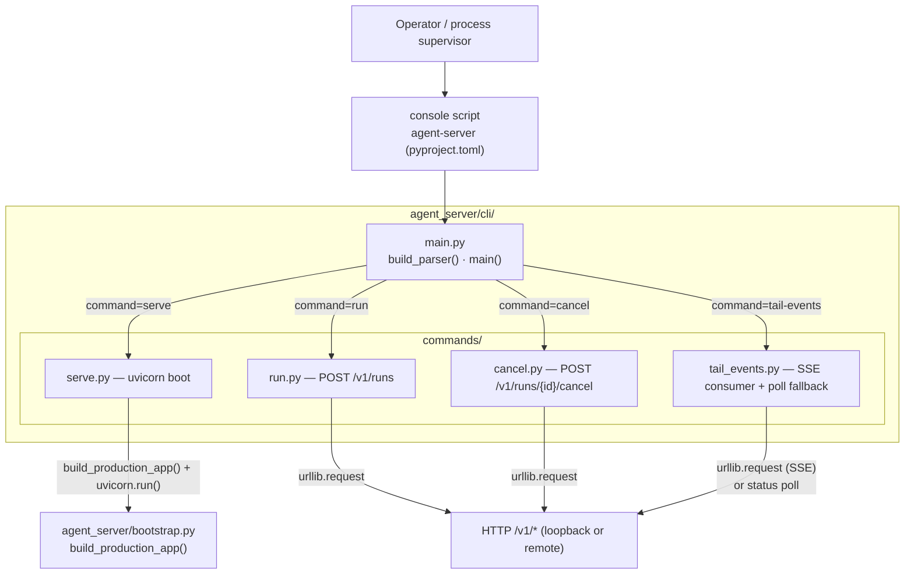
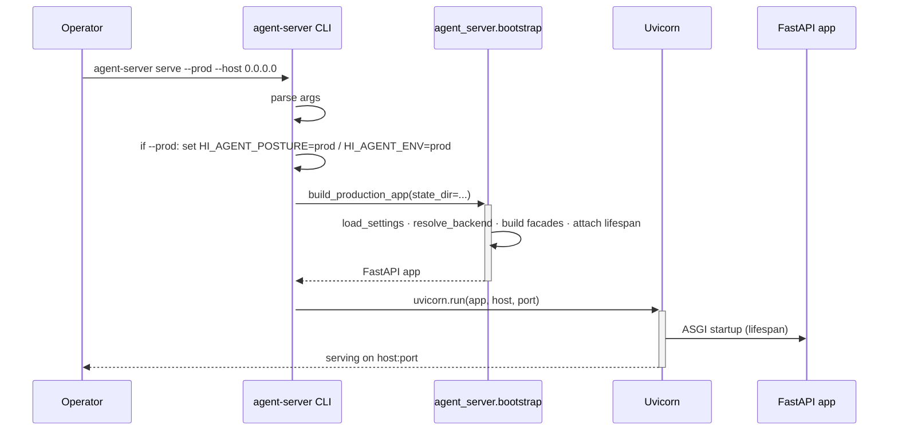
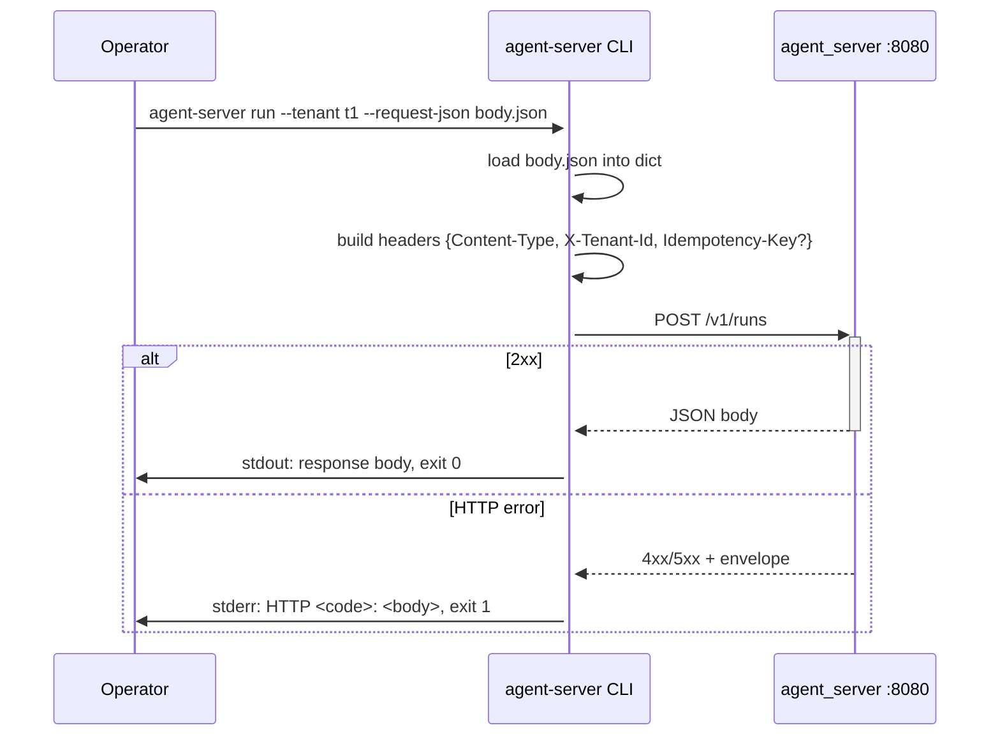

# agent_server/cli/ Architecture

> Last refreshed: Wave 33 (2026-05-04). Sub-package shipped at W24 Track I-E; W31-N1 promoted `serve` to in-process uvicorn against `build_production_app`.

---

## 1. Purpose & Position in System

`agent_server/cli/` is the **operator-facing command-line surface** of the northbound facade. It exists so a human (or a process supervisor like PM2 / systemd) can boot the ASGI app, submit a run, cancel a run, or stream a run's events without writing any code. The CLI is intentionally minimal: every subcommand is a thin shell over the same v1 HTTP routes that downstream applications use.

Two design principles govern this layer:

1. **R-AS-1 stdlib-only.** Per CLAUDE.md, the CLI may not import `hi_agent.*` directly. Subcommands use `urllib.request` + `json` for HTTP and reach the platform exclusively through `agent_server.bootstrap.build_production_app` (in `serve`) or HTTP loopback (in `run` / `cancel` / `tail-events`).
2. **No hidden state.** The CLI is a stateless dispatcher: every command is one process invocation. There is no client config file, no session cache, no cookie jar. Tenant identity is supplied per-invocation via `--tenant`; idempotency is supplied via `--idempotency-key` or the request body.

What this layer does NOT own:
- HTTP transport itself (`agent_server/api/`).
- Assembly of the FastAPI app (`agent_server/bootstrap.py`).
- Real-kernel binding (`agent_server/runtime/`).
- Run logic, business semantics, or any kernel-side state.

---

## 2. External Interfaces

The package registers a single console script via `pyproject.toml`:

```
agent-server = "agent_server.cli.main:main"
```

Subcommands and their HTTP targets:

| Subcommand | HTTP target | Purpose |
|---|---|---|
| `agent-server serve` | n/a (boots the app itself) | Run uvicorn in-process against `build_production_app()`; `--prod` flips `HI_AGENT_POSTURE=prod` and binds to `0.0.0.0` |
| `agent-server run` | `POST /v1/runs` | Submit a run from a JSON file (`--request-json path/to/body.json`); prints the response |
| `agent-server cancel` | `POST /v1/runs/{id}/cancel` (with `/signal` fallback when `/cancel` is 404) | Cancel a live run |
| `agent-server tail-events` | `GET /v1/runs/{id}/events` (with status-poll fallback when 404) | Stream SSE events; falls back to `GET /v1/runs/{id}` polling on older servers |

Common flags:

| Flag | Where | Default | Effect |
|---|---|---|---|
| `--server` | `run`, `cancel`, `tail-events` | `http://127.0.0.1:8080` | Target server URL |
| `--tenant` | `run`, `cancel`, `tail-events` | (required) | Sets `X-Tenant-Id` header |
| `--idempotency-key` | `run`, `cancel` | empty / body fallback | Sets `Idempotency-Key` header |
| `--timeout` | all HTTP commands | 15 s (run/cancel), 300 s (tail-events) | Wall-clock cap |
| `--host` / `--port` | `serve` | `127.0.0.1` / `8080` | uvicorn bind |
| `--prod` | `serve` | off | Sets `HI_AGENT_POSTURE=prod`, `HI_AGENT_ENV=prod`, binds `0.0.0.0` |
| `--state-dir` | `serve` | (env-derived) | Persistent state directory |

Exit codes:

| Code | Meaning |
|---|---|
| 0 | Command succeeded |
| 1 | HTTP error or connection failure (non-2xx, ECONNREFUSED, …) |
| 2 | Argparse error or input-file failure (malformed JSON, missing file) |

---

## 3. Internal Components



| Module | Role |
|---|---|
| `main.py` | argparse dispatcher; `build_parser()` registers each subcommand; `main(argv)` returns the chosen handler's exit code |
| `commands/serve.py` | Imports `agent_server.bootstrap.build_production_app`, calls `uvicorn.run(app, host, port)`; `--prod` sets `HI_AGENT_POSTURE=prod` and flips bind to `0.0.0.0` |
| `commands/run.py` | Loads JSON from `--request-json`, posts to `/v1/runs` with `X-Tenant-Id` and (optional) `Idempotency-Key` headers |
| `commands/cancel.py` | Tries `/v1/runs/{id}/cancel` first; on 404 falls back to `/v1/runs/{id}/signal` with body `{"signal":"cancel"}` |
| `commands/tail_events.py` | Streams the SSE response, parses `data:` lines into JSON, prints each event; on 404 falls back to polling `GET /v1/runs/{id}` until terminal |

All four subcommand modules expose two functions: `register(subparsers)` to bind the parser, and `run(args)` to execute. The pattern keeps the dispatcher in `main.py` trivial.

---

## 4. Data Flow

### `agent-server serve` (in-process app boot, W31-N1)



### `agent-server run` (HTTP submit)



### `agent-server tail-events` (SSE with poll fallback)

```mermaid
flowchart TD
    A[Open GET /v1/runs/{id}/events] --> B{HTTP status}
    B -->|200| C[Read SSE: parse data: lines]
    C --> D[Pretty-print JSON to stdout]
    D --> E{Stream closed?}
    E -->|no| C
    E -->|yes| F[exit 0]
    B -->|404| G[Fallback: poll GET /v1/runs/{id}]
    G --> H{state in terminal set?}
    H -->|no| I[print on change, sleep poll-interval]
    I --> G
    H -->|yes| F
    B -->|other| J[stderr: HTTP code, exit 1]
```

---

## 5. State & Persistence

The CLI is stateless. Per command:

| Command | Process state | Persistent state |
|---|---|---|
| `serve` | uvicorn worker(s) for the lifetime of the process | none owned by the CLI; the running app owns SQLite stores under `state_dir` |
| `run` | one HTTP request | none |
| `cancel` | one or two HTTP requests (with fallback) | none |
| `tail-events` | one streaming HTTP connection or a polling loop | tracks last-seen response body in memory only |

There is no client-side configuration file, environment cache, or token store. Operators wire credentials through environment variables that the running server reads (e.g. `HI_AGENT_JWT_SECRET`, LLM provider keys).

The localhost convenience: every HTTP subcommand bypasses the proxy environment when the server URL contains `127.0.0.1` or `localhost`, so `HTTPS_PROXY` or `HTTP_PROXY` settings do not break loopback calls.

---

## 6. Concurrency & Lifecycle

`serve` blocks on `uvicorn.run` and exits cleanly on Ctrl-C / SIGTERM (graceful drain handled by the FastAPI lifespan in `agent_server/runtime/lifespan.py`).

`run` and `cancel` are single-shot synchronous HTTP calls; they exit when the response arrives or the timeout elapses.

`tail-events` consumes an SSE stream cooperatively: each `readline` call yields control while waiting for the next event; the stream loop checks the wall-clock deadline so a stuck server cannot pin the process forever. The polling fallback emits a status snapshot on change and sleeps `--poll-interval` between calls until the run reaches a terminal state (`succeeded`, `failed`, `cancelled`, `timed_out`) or the deadline fires.

The CLI does NOT spawn subprocesses, threads, or background tasks. Every operation is a single foreground action.

---

## 7. Error Handling & Observability

Every HTTP subcommand maps responses to the same exit-code table:

| Source | Exit code | Stream |
|---|---|---|
| HTTP 2xx | 0 | stdout: response body |
| HTTP 4xx/5xx | 1 | stderr: `HTTP <code>: <body>` |
| Connection refused / DNS failure / timeout | 1 | stderr: `connection_failed: <reason>` |
| Malformed JSON in `--request-json` | 2 | stderr: `Error: cannot load request JSON: <exc>` |
| Argparse error (missing required, bad value) | 2 | stderr: argparse default |

The CLI does not emit metrics; it prints what the operator needs and exits. For long-running operations the operator is expected to consume `tail-events` or hit `/metrics` / `/v1/manifest` directly.

---

## 8. Security Boundary

The CLI inherits the platform's security posture:

- **R-AS-1**: zero `hi_agent.*` imports under `agent_server/cli/`. The only exception is `commands/serve.py` reaching `agent_server.bootstrap.build_production_app` — which is itself the documented seam.
- **Loopback default**: `serve --host 127.0.0.1` by default. Operators must opt into external listeners via `--prod` (which also flips posture to `prod`) or an explicit `--host 0.0.0.0`.
- **No credential ingestion**: the CLI does NOT accept passwords, tokens, or API keys on the command line. Server-side configuration (env vars + `state_dir`) is authoritative.
- **JWT requirements**: under research/prod posture, `JWTAuthMiddleware` will reject any HTTP call without a valid Bearer token. Operators integrate the CLI by pre-issuing a JWT and exporting it as `Authorization` via a reverse proxy, or by extending the CLI with a `--auth-token` flag (not yet shipped).
- **Proxy bypass for localhost**: `_build_opener` strips `HTTPS_PROXY` / `HTTP_PROXY` for `127.0.0.1` and `localhost` to avoid corporate proxies hijacking loopback traffic.

---

## 9. Extension Points

Adding a new subcommand:

1. Create `agent_server/cli/commands/<name>.py` with two functions:
   - `register(subparsers)` — adds an argparse subparser, sets `func=run`.
   - `run(args)` — returns an integer exit code.
2. Import the module from `agent_server/cli/main.py::build_parser` and call `register(subparsers)`.
3. Per R-AS-1, do NOT import `hi_agent.*`. Use `urllib.request` for HTTP, or reach the platform via `agent_server.bootstrap` if you need to boot the app in-process.
4. Provide a positive-path integration test under `tests/integration/test_cli_<name>.py` that uses `subprocess.run([sys.executable, "-m", "agent_server.cli.main", ...])` against a running TestClient or stub server.
5. Update this document's table in §2.

Adding a new flag to an existing subcommand:

1. Edit the subcommand's `register(...)` to add the argparse argument; document the default and effect inline.
2. Update the subcommand's `run(...)` to consume `args.<flag>`.
3. Update §2 in this document with the new flag.

---

## 10. Constraints & Trade-offs

What this design assumes:

- **Operators speak HTTP.** The CLI does not embed an SDK, gRPC client, or specialized RPC. JSON over HTTP is sufficient because the same surface is what RIA uses.
- **One run per invocation.** `run` posts a single body and returns. Bulk submission is the operator's job (shell loop, parallel xargs, etc.).
- **Stdlib HTTP is enough.** `urllib.request` keeps the CLI dependency-free and the security audit surface small. `requests`, `httpx`, etc. would be nicer to use but are not worth the dependency.

What this design does NOT handle well:

- **Auth tokens.** There is no flag to pass `Authorization: Bearer <jwt>` to the HTTP subcommands. Under research/prod the CLI is reachable only behind a proxy that injects the header.
- **Reconnection on SSE drop.** `tail-events` does not auto-resume from the last sequence number; if the connection breaks mid-stream the operator re-invokes the command. The polling fallback is the conservative path.
- **Multi-server orchestration.** `serve` boots one uvicorn process. Multi-worker / multi-region deployments use PM2 / systemd / kubernetes — the CLI is not a cluster manager.

---

## 11. References

- Console script registration: `pyproject.toml` (`[project.scripts] agent-server = ...`)
- Dispatcher: `agent_server/cli/main.py`
- Subcommands:
  - `agent_server/cli/commands/serve.py`
  - `agent_server/cli/commands/run.py`
  - `agent_server/cli/commands/cancel.py`
  - `agent_server/cli/commands/tail_events.py`
- Bootstrap entry point: `agent_server/bootstrap.py::build_production_app`
- Sibling subsystems:
  - HTTP transport: [`agent_server/api/ARCHITECTURE.md`](../api/ARCHITECTURE.md)
  - Real-kernel binding: [`agent_server/runtime/ARCHITECTURE.md`](../runtime/ARCHITECTURE.md)
  - Settings & version: [`agent_server/config/ARCHITECTURE.md`](../config/ARCHITECTURE.md)
- Layering gate: `scripts/check_layering.py` (no `hi_agent.*` import under `agent_server/cli/`)
- Governance: `CLAUDE.md` Ownership Tracks → AS-RO row + Narrow-Trigger Rules
