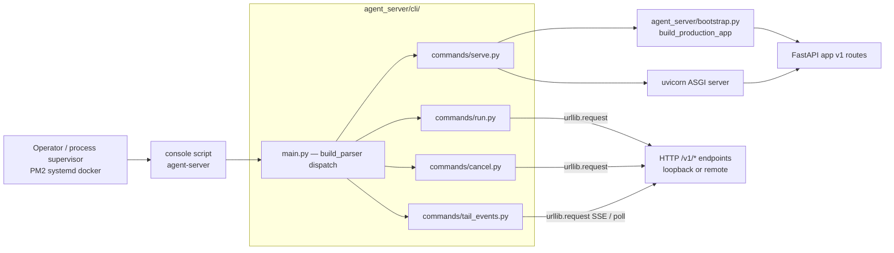
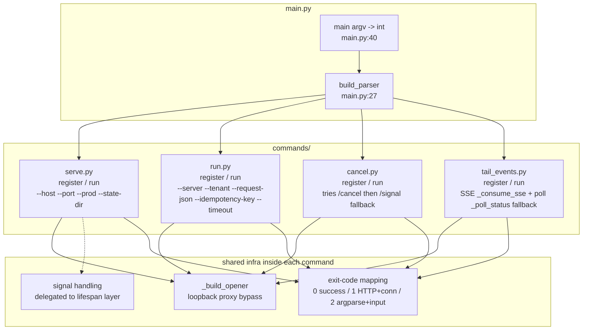
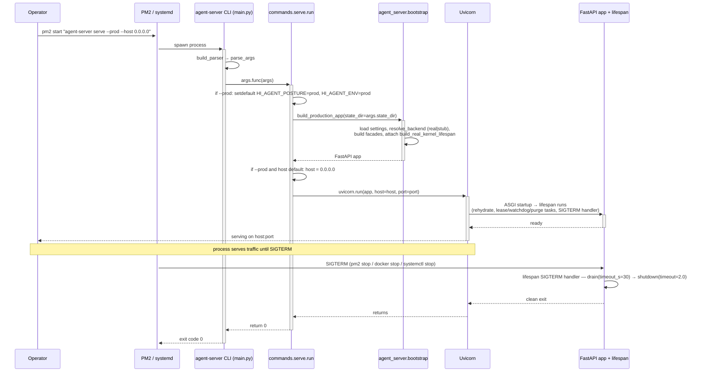
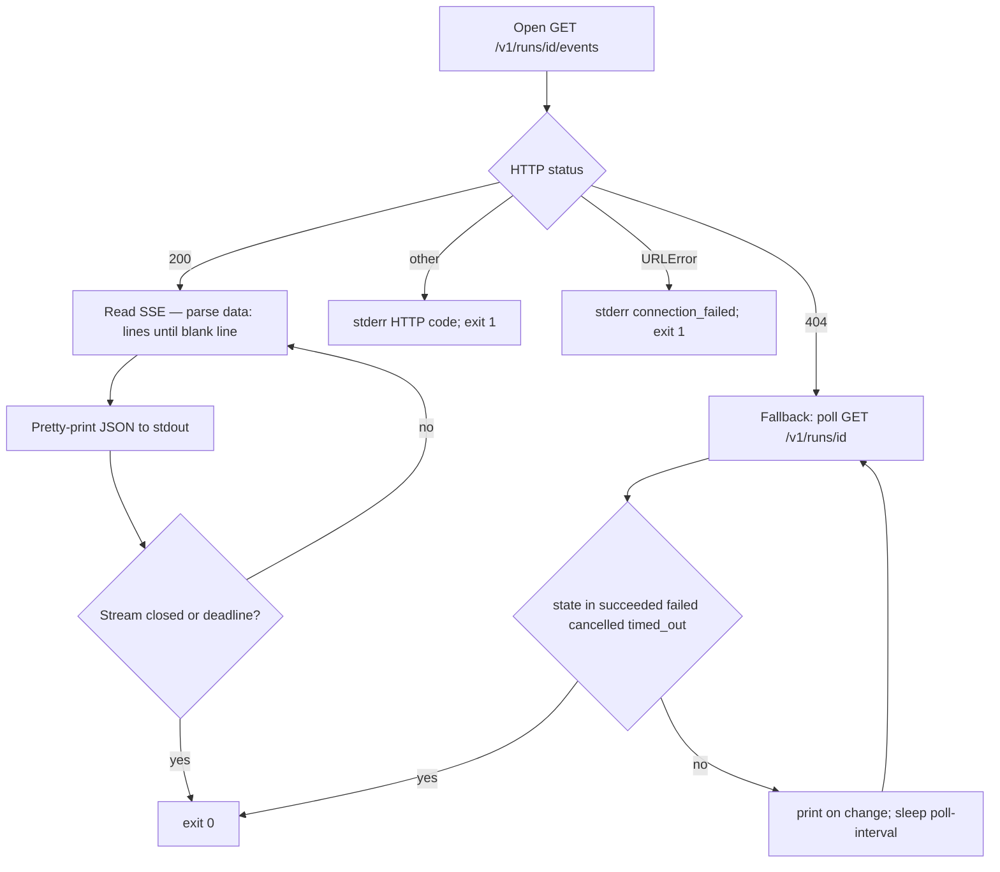

# agent_server/cli — Architecture

> **Last refreshed:** 2026-05-06 (W35 corrective close + W36 plans). HEAD `276917d8`.
> **Audience:** platform engineers + release captains.
> **Status:** authoritative.

---

## 1. Purpose & Responsibilities

`agent_server/cli/` is the **operator-facing command-line surface** of the v1
northbound facade. It exists so a human (or a process supervisor like PM2 /
systemd) can boot the ASGI app, submit a run, cancel a run, or stream a run's
events without writing client code.

Every subcommand is a thin shell over the same v1 HTTP routes that downstream
applications use; the only exception is `serve`, which boots the app
in-process and never crosses a network socket of its own. The CLI is
**stateless**: no client config file, no session cache, no cookie jar — tenant
identity flows in via `--tenant`, idempotency via `--idempotency-key`.

What this package owns:

- The `agent-server` console script entry point (registered in
  `pyproject.toml::[project.scripts]`).
- argparse dispatcher (`main.py`) and four subcommand modules
  (`commands/serve.py`, `commands/run.py`, `commands/cancel.py`,
  `commands/tail_events.py`).
- Loopback proxy bypass for `127.0.0.1` / `localhost` so a corporate
  `HTTP(S)_PROXY` does not break local development.
- Deterministic exit codes (0 / 1 / 2) and stderr-routed error reporting so the
  CLI is composable in shell pipelines and process supervisors.

What this package does NOT own:

- HTTP transport itself (`agent_server/api/`).
- App assembly (`agent_server/bootstrap.py`).
- Real-kernel binding (`agent_server/runtime/`).
- Run logic, business semantics, or kernel-side state.

When `agent-server serve` is the right entry point vs. uvicorn-direct:

| Use `agent-server serve` when… | Use `python -m uvicorn` directly when… |
|---|---|
| You want the production posture flip via `--prod` (sets `HI_AGENT_POSTURE=prod`, binds `0.0.0.0`) | You are running an external ASGI configuration (multiple workers, custom logging) |
| You want the v1 routes mounted via `agent_server.bootstrap.build_production_app` (the documented seam) | You have wrapped the app in an outer ASGI stack |
| You want loopback-by-default for security in dev | You manage state-dir / posture from your orchestrator config |

Rule 8 step 1 (operator-shape gate) requires a long-lived process under PM2 /
systemd / docker — not a foreground `python -m hi_agent serve`. `agent-server
serve` is the supported shape that gate runs against.

---

## 2. Context & Scope



Boundaries:

- The CLI may import `agent_server.bootstrap.build_production_app` (this is the
  documented R-AS-1 seam #1).
- The CLI MUST NOT `from hi_agent...` or `import hi_agent` directly. The
  layering gate (`scripts/check_layering.py`) fails CI on any such import under
  `agent_server/cli/**`.
- HTTP subcommands use stdlib only (`urllib.request`, `urllib.error`, `json`,
  `time`). No `httpx`, no `requests`, no shared client state.

---

## 3. Module Boundary & Dependencies

```
agent_server/cli/
├── __init__.py                 # intentionally light (avoids double-import)
├── main.py                     # argparse dispatcher; entry point
└── commands/
    ├── __init__.py             # docstring only
    ├── serve.py                # boots build_production_app + uvicorn
    ├── run.py                  # POST /v1/runs
    ├── cancel.py               # POST /v1/runs/{id}/cancel (with /signal fallback)
    └── tail_events.py          # GET /v1/runs/{id}/events SSE (with status-poll fallback)
```

Inbound:

- Console script `agent-server = "agent_server.cli.main:main"` declared in
  `pyproject.toml::[project.scripts]`.
- Operators invoking subcommands directly via `python -m
  agent_server.cli.main <subcommand>`.

Outbound:

- `agent_server.bootstrap.build_production_app` — only from `serve.py`.
- `uvicorn` (third-party) — only from `serve.py`.
- stdlib `urllib.request`, `json`, `time`, `sys`, `argparse`, `os`.

The two design principles that govern the layer:

1. **R-AS-1 stdlib-only for HTTP commands.** `run`, `cancel`, `tail-events`
   never import `agent_server.bootstrap`, never import `agent_server.runtime`,
   never reach into FastAPI. They speak HTTP via stdlib only.
2. **No hidden state.** No client config file, no token cache, no session.
   Every invocation declares tenant + idempotency on the command line.

---

## 4. Building Blocks



| Component | File:line | Responsibility |
|---|---|---|
| `build_parser` | `main.py:27` | constructs `argparse.ArgumentParser`; calls each subcommand's `register(subparsers)` |
| `main(argv)` | `main.py:40` | dispatches to `args.func(args)` and returns int exit code |
| `commands.serve.register / run` | `serve.py:24 / 64` | argparse wiring; `--prod` flips `HI_AGENT_POSTURE=prod` and `HI_AGENT_ENV=prod`; flips bind to `0.0.0.0` only if `--prod` AND host still default loopback; calls `build_production_app(state_dir=...)`; `uvicorn.run(app, host, port)` |
| `commands.run.register / run` | `run.py:16 / 40` | loads JSON file; sets headers (`Content-Type`, `X-Tenant-Id`, optional `Idempotency-Key`); POSTs `/v1/runs` |
| `commands.cancel.register / run` | `cancel.py:18 / 35` | tries `POST /v1/runs/{id}/cancel`; on HTTP 404 falls back to `POST /v1/runs/{id}/signal` with `{"signal":"cancel"}` |
| `commands.tail_events.register / run` | `tail_events.py:22 / 37` | streams SSE; on HTTP 404 falls back to status polling at `--poll-interval` (default 1 s) until terminal state |
| `_build_opener` (each cmd) | `run.py:82`, `cancel.py:87`, `tail_events.py:64` | builds `urllib.request.OpenerDirector` that bypasses `HTTP(S)_PROXY` for `127.0.0.1` / `localhost` |
| `_consume_sse` | `tail_events.py:71` | parses SSE framing line-by-line, emits each event JSON, honours wall-clock deadline |
| `_emit_event` | `tail_events.py:100` | concatenates `data:` lines, parses JSON, prints one line per event |
| `_poll_status` | `tail_events.py:113` | polls `GET /v1/runs/{id}` every `--poll-interval`; prints on change; exits 0 on terminal state |

### Agent-readiness defaults

The CLI is designed to be driven by other agents and supervisors, not just
humans:

| Concern | Default behaviour |
|---|---|
| Exit codes | Deterministic: 0 success, 1 HTTP/connection failure, 2 input/argparse failure |
| stdout vs stderr | Successful payload (HTTP body, SSE event JSON) → stdout; error and operational messages → stderr |
| JSON output | `run` and `cancel` print the raw response body; SSE events print one JSON object per line (newline-delimited JSON, machine-parseable) |
| Status polling fallback | When the dedicated SSE route is absent (HTTP 404), `tail-events` falls back to polling and emits status JSON on change — a supervisor reading line-by-line gets a usable signal stream either way |
| No interactive prompts | Every required input is a flag; missing required flags → argparse exit 2 with usage |

There is no `--json` flag because every subcommand already emits JSON to stdout
on success.

---

## 5. Runtime View — Key Scenarios

### 5.1 `agent-server serve` boot flow



### 5.2 `agent-server tail-events` SSE with status-poll fallback



### 5.3 `agent-server run` submission

```mermaid
sequenceDiagram
    participant Operator
    participant CLI as agent-server run
    participant Server as agent_server HTTP

    Operator->>+CLI: agent-server run --server URL --tenant T --request-json req.json
    CLI->>CLI: open req.json → json.load (else exit 2)
    CLI->>CLI: idem_key = --idempotency-key OR body.idempotency_key
    CLI->>CLI: build headers (Content-Type, X-Tenant-Id, Idempotency-Key?)
    CLI->>CLI: _build_opener (proxy bypass for loopback)
    CLI->>+Server: POST /v1/runs (timeout=15s)
    alt 2xx
        Server-->>-CLI: response body
        CLI-->>Operator: stdout body; exit 0
    else HTTPError 4xx/5xx
        Server-->>CLI: error body
        CLI-->>Operator: stderr "HTTP code: body"; exit 1
    else URLError
        CLI-->>Operator: stderr "connection_failed: reason"; exit 1
    end
```

---

## 6. Cross-cutting Concerns

### 6.1 Posture awareness (Rule 11)

| Posture | `serve` defaults | HTTP-subcommand expectations | W35-T1 / W35-T3 effect |
|---|---|---|---|
| `dev` | `--host 127.0.0.1` (loopback only); no `--prod` flip | tenant header still required; spine validation warns | posture set indirectly via env; CLI itself unchanged |
| `research` | `--prod` flips to `0.0.0.0` and `HI_AGENT_POSTURE=prod` | strict spine validation in body; mismatched body `tenant_id` rejected (W35-T3) | CLI does not inject auth; reverse proxy required for JWT |
| `prod` | same as research | same | same |

Note: under research/prod, `JWTAuthMiddleware` rejects any HTTP call without a
valid Bearer token. Operators integrate the CLI by pre-issuing a JWT and
exporting it via a reverse proxy, or by extending the CLI with a `--auth-token`
flag (W36+ open roadmap item).

### 6.2 Failure modes (Rule 7-shape inventory)

| Path | Visibility | Operator signal |
|---|---|---|
| HTTP 4xx / 5xx response | n/a (CLI shell, not a service) | stderr `HTTP <code>: <body>`; exit 1 |
| Connection refused / DNS / timeout | n/a | stderr `connection_failed: <reason>`; exit 1 |
| Malformed JSON in `--request-json` | n/a | stderr error message; exit 2 |
| `cancel`: `/cancel` returns 404 | informational | falls back to `/signal` (silent in stdout); next response indicates outcome |
| `tail-events`: `/events` returns 404 | informational | falls back to status polling; payload to stdout |
| `tail-events`: wall-clock deadline exceeded | informational | stderr `tail-events: timed out before run reached terminal state`; exit 0 (deliberate — partial progress is reported) |
| `serve`: bootstrap raises | n/a | uvicorn does not start; exception propagates; non-zero exit |

The CLI does not emit metrics; it prints what the operator needs and exits.

### 6.3 Resource lifecycle (Rule 5)

`serve` blocks on `uvicorn.run`; the FastAPI lifespan in
`agent_server/runtime/lifespan.py` owns startup/shutdown of durable resources
(see runtime ARCHITECTURE.md §5.2). Ctrl-C / SIGINT / SIGTERM trigger the
lifespan shutdown chain.

`run` and `cancel` are single-shot synchronous HTTP calls — the connection
opens for the request and closes on response.

`tail-events` consumes an SSE stream cooperatively: each `readline` yields
control while waiting; the loop checks the wall-clock deadline so a stuck
server cannot pin the process forever. Default `--timeout` is 300 s; the loop
exits cleanly on deadline.

The CLI does NOT spawn subprocesses, threads, or background tasks. No async
resources; Rule 5 is N/A for the CLI itself.

### 6.4 Lineage / spine compliance (Rule 12)

Tenant identity flows in via `--tenant` and is forwarded as the `X-Tenant-Id`
HTTP header. The CLI does not invent `tenant_id`, `project_id`, or `run_id`
values. Spine completeness is the server's responsibility once the request
reaches the route layer.

W35-T3 ensures that body-supplied `tenant_id` values that disagree with the
authenticated context are rejected at `RunManager.create_run` under
research/prod — the CLI surfaces this as an HTTP 400 with
`error_category="contract_violation"`.

### 6.5 Test layers (Rule 4)

| Layer | Path | What it asserts |
|---|---|---|
| L1 unit | `tests/unit/test_cli_main.py` | argparse wiring; `build_parser` registers all four subcommands |
| L2 integration | `tests/integration/test_cli_serve.py` | `serve` boots `build_production_app` and exits cleanly on SIGTERM |
| L2 integration | `tests/integration/test_cli_run.py` | `run` posts to `/v1/runs` against a TestClient stub |
| L2 integration | `tests/integration/test_cli_cancel.py` | `/cancel` 404 → `/signal` fallback path |
| L2 integration | `tests/integration/test_cli_tail_events.py` | SSE consumer happy path + status-poll fallback on 404 |
| Gate | `scripts/check_layering.py` | no `hi_agent.*` import under `agent_server/cli/**` |

---

## 7. Architecture Decisions

| ID | Decision | Why |
|---|---|---|
| R-AS-1 | CLI is stdlib-only for HTTP; `serve.py` is the sole module permitted to import `agent_server.bootstrap` | Bootstrap is the documented seam #1; the rest of the CLI must not couple to kernel internals or to a third-party HTTP client |
| Stateless invocations | No client config file, no token cache, no cookie jar | Operators integrate via supervisors; ambient state would surprise them and conflict with multi-tenant scoping |
| Loopback by default | `--host 127.0.0.1` is the `serve` default; `--prod` is required to bind `0.0.0.0` | Rule 8 step 1 "operator-shape gate" runs through PM2/systemd/docker; defaulting to loopback prevents accidental external exposure during dev |
| `--prod` flag does two things | sets `HI_AGENT_POSTURE=prod` AND flips bind to `0.0.0.0` only if host is still default | Production deployments expect external reachability; operators who want loopback in prod can pass `--host 127.0.0.1` explicitly with `--prod` |
| Fallback paths visible only via behaviour | `cancel` 404→signal and `tail-events` 404→poll do not log to stderr unless the fallback also fails | Operators see contract evolution as transparent; a failing fallback surfaces the second error, not the first |
| Deterministic exit codes | 0 success, 1 HTTP / connection failure, 2 input / argparse failure | Composable in shell pipelines and process supervisors (Rule 8 operator-shape) |
| Rule 8 step-1 implication | `agent-server serve` (long-lived process under PM2/systemd/docker) is the supported operator shape; foreground `python -m hi_agent serve` is NOT | Recorded in CLAUDE.md Rule 8; gate evidence in `docs/delivery/<date>-<sha>.md` |

---

## 8. Quality Attributes

| Attribute | Target | How met today | Verified by |
|---|---|---|---|
| Determinism | Same args + same server state → same exit code + same stdout shape | argparse + stdlib only; no hidden config | `tests/unit/test_cli_main.py` |
| Composability | CLI fits into shell pipelines and process supervisors | stderr/stdout split; deterministic exit codes; newline-delimited JSON for SSE | manual + integration tests |
| Forward compatibility | Operates against both `/cancel` and `/signal` cancellation contracts | `cancel.py` 404 fallback to `/signal` | `tests/integration/test_cli_cancel.py` |
| Resilience | Fallback to status polling when SSE route absent | `tail_events.py::_poll_status` | `tests/integration/test_cli_tail_events.py` |
| Layering | No `hi_agent.*` import inside `agent_server/cli/**` | code structure + layering gate | `scripts/check_layering.py` |
| Operator friendliness | Errors include enough detail to act on (HTTP code + body, connection reason) | stderr formatting in each command | manual review |

---

## 9. Risks & Technical Debt

| Risk | Surface | Mitigation status |
|---|---|---|
| Signal handling on Windows — Ctrl+C maps to SIGINT (handled by uvicorn) but the `lifespan.py` SIGTERM handler is a no-op on Windows because `signal.SIGTERM` is unsupported there | `serve.py` (delegates to uvicorn) + `lifespan.py:_install_sigterm_handler` | Documented; Windows-mode shutdown still works via Ctrl+C; production deployments target Linux |
| `serve` does not expose `--reload` — uvicorn auto-reload is dev-only and would conflict with the lifespan task supervisor | `serve.py` parser | Intentional; reload mode would tear down the lifespan tasks (lease, watchdog, purge) on every file change. Future: `--reload` confined to dev posture only |
| Research/prod servers require JWTs; the CLI has no `--auth-token` flag yet | `run.py` / `cancel.py` / `tail_events.py` headers | **W36 binding** — `docs/governance/boot-time-assertions-roadmap.md` open roadmap item; today operators integrate via reverse proxy injection |
| `tail-events` re-invocation on disconnect — operators must re-run the command if SSE drops; no automatic resume from last sequence | `tail_events.py::_consume_sse` | W37+ — SSE resume from last `sequence` cursor; tracked in `docs/governance/retention-roadmap.md` |
| Bulk submission helper missing — operators script a shell loop today | parser surface | W37+ — tracked in `docs/governance/retention-roadmap.md` |
| `--server` accepts any URL but does not validate scheme — typo `htps://...` reaches `urllib.error.URLError` rather than a friendlier message | each HTTP command's `_build_opener` | Low priority; URLError message is descriptive enough |
| `serve` only drives one uvicorn process — no `--workers` flag (multiple workers would each construct their own `AgentServer` and stores, breaking single-construction discipline) | `serve.py` | Documented in runtime ARCHITECTURE.md §9; cross-process run sharing is out of scope at v1 |

---

## 10. References

Source files (this package):

- Console-script registration: `pyproject.toml::[project.scripts] agent-server`
- Dispatcher: `agent_server/cli/main.py`
- Subcommands:
  - `agent_server/cli/commands/serve.py`
  - `agent_server/cli/commands/run.py`
  - `agent_server/cli/commands/cancel.py`
  - `agent_server/cli/commands/tail_events.py`

Sibling subsystems:

- [`../ARCHITECTURE.md`](../ARCHITECTURE.md) — top-level facade
- [`../api/ARCHITECTURE.md`](../api/ARCHITECTURE.md) — HTTP transport (auth middleware)
- [`../runtime/ARCHITECTURE.md`](../runtime/ARCHITECTURE.md) — real-kernel binding + lifespan
- [`../config/ARCHITECTURE.md`](../config/ARCHITECTURE.md) — settings, version constants
- [`../contracts/ARCHITECTURE.md`](../contracts/ARCHITECTURE.md) — frozen v1 schemas

Bootstrap entry point: `agent_server/bootstrap.py::build_production_app`

Roadmaps:

- `docs/governance/boot-time-assertions-roadmap.md` (`--auth-token` and reverse-proxy
  considerations under §HIGH and §MEDIUM)
- `docs/governance/retention-roadmap.md` (SSE resume, bulk submission)

Gates:

- `scripts/check_layering.py` — R-AS-1: no `hi_agent.*` under `agent_server/cli/**`

Governance: CLAUDE.md → Ownership Tracks → AS-RO row + Narrow-Trigger Rules; Rule
8 step 1 (operator-shape gate via PM2/systemd/docker, not foreground python).
