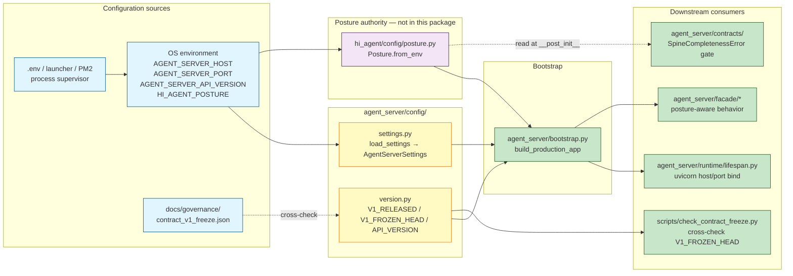
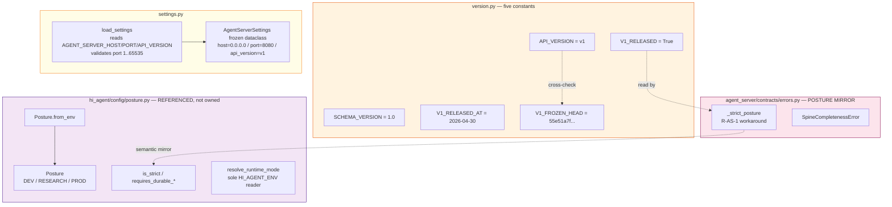

# agent_server/config — Architecture

> **Last refreshed:** 2026-05-06 (W35 corrective close + W36 plans). HEAD `276917d8`.
> **Audience:** contract consumers (RIA), platform engineers, AS-CO owners.
> **Status:** authoritative.

---

## 1. Purpose & Responsibilities

`agent_server/config/` is the **minimal v1 runtime-settings layer** for the agent_server process. Two responsibilities:

1. **Frozen v1 contract version pin.** `version.py` carries `V1_RELEASED`, `V1_RELEASED_AT`, `V1_FROZEN_HEAD`, `API_VERSION`, `SCHEMA_VERSION` — five constants that name the v1 surface and are kept in lockstep with `docs/governance/contract_v1_freeze.json`. Both files are the single release fact source per Rule 14.
2. **Environment-driven runtime settings.** `settings.py` resolves three knobs (`AGENT_SERVER_HOST`, `AGENT_SERVER_PORT`, `AGENT_SERVER_API_VERSION`) into the frozen `AgentServerSettings` dataclass at boot.

Posture itself does NOT live in this package — it is owned by `hi_agent/config/posture.py`. The agent_server process reads posture via `Posture.from_env()` at the top-level bootstrap path (`agent_server/bootstrap.py`), and the contracts subpackage reads it through its local `_strict_posture()` mirror (`agent_server/contracts/errors.py:33-44`) to honour the R-AS-1 layering rule.

**What this layer is NOT.** It is intentionally small. Per the disposition documented in `agent_server/config/settings.py:1-28` (W35-T7), per-tenant overrides, posture-aware lease intervals, model-routing overrides, and retention policies are **deferred to v2**. Adding fields ad-hoc is forbidden — Rule 17 allowlist discipline applies.

---

## 2. Context & Scope



**Boundaries:**

- **Inbound:** OS environment variables only. No on-disk config file, no remote config service. The .env / PM2 / systemd launcher is the operator's responsibility.
- **Outbound:** consumed by `bootstrap.py` and re-exported via `agent_server/__init__.py` constants. The freeze-check gate cross-references `version.py::V1_FROZEN_HEAD` against the JSON snapshot.
- **Forbidden import path:** posture mirroring under `agent_server/contracts/` is a deliberate workaround for R-AS-1 (contracts MUST NOT import `hi_agent.*`); see `agent_server/contracts/errors.py:21-24`.

---

## 3. Module Boundary & Dependencies

| File | Lines | Purpose | Key exports |
|---|---|---|---|
| `__init__.py` | 1 | Subpackage marker | — |
| `settings.py` | 56 | Env-var → `AgentServerSettings` | `AgentServerSettings` (frozen dataclass), `load_settings()` |
| `version.py` | 14 | V1 contract version pin | `API_VERSION`, `SCHEMA_VERSION`, `V1_RELEASED`, `V1_RELEASED_AT`, `V1_FROZEN_HEAD` |

**Dependency direction:**

- `version.py` is leaf (stdlib-free; pure constants).
- `settings.py` imports `dataclasses` + `os`. No third-party. No `hi_agent.*`.
- Both modules are read by `agent_server/bootstrap.py`; `version.py` is additionally read by `scripts/check_contract_freeze.py:39` and the freeze-check helper at `scripts/check_contract_freeze.py:110-120`.

**What lives in `hi_agent/config/posture.py`, not here:**

- `Posture` enum (DEV / RESEARCH / PROD).
- `Posture.from_env()` reader.
- 12 posture-property accessors (`requires_durable_queue`, `requires_durable_ledger`, etc.).
- `resolve_runtime_mode()` — the single sanctioned `HI_AGENT_ENV` reader.

The decision to keep posture under `hi_agent/` is intentional: posture is a runtime concept that long predates the v1 northbound surface, and `agent_server/` is positioned as the versioned facade in front of the runtime. Mirroring `_strict_posture()` semantics inside `agent_server/contracts/errors.py:33-44` is the documented R-AS-1 workaround.

---

## 4. Building Blocks



**Verified field shapes:**

- `AgentServerSettings(host: str = "0.0.0.0", port: int = 8080, api_version: str = "v1")` — frozen dataclass at `settings.py:33-39`.
- `version.py:9-14` exports five constants in this exact order: `API_VERSION`, `SCHEMA_VERSION`, `V1_RELEASED`, `V1_RELEASED_AT`, `V1_FROZEN_HEAD`.
- `load_settings()` at `settings.py:42-55` reads `AGENT_SERVER_PORT` first, validates it parses as int (raises `ValueError`), validates `1 <= port <= 65535` (raises `ValueError`), then constructs the frozen dataclass.

---

## 5. Runtime View — Posture transitions

```mermaid
stateDiagram-v2
    [*] --> RESOLVING: process start

    RESOLVING --> DEV: HI_AGENT_POSTURE=dev<br/>(default when unset)

    RESOLVING --> RESEARCH: HI_AGENT_POSTURE=research

    RESOLVING --> PROD: HI_AGENT_POSTURE=prod

    RESOLVING --> ERROR: HI_AGENT_POSTURE=other<br/>(unparseable)

    note right of ERROR
        Posture.from_env raises ValueError;
        bootstrap aborts process startup.
        See hi_agent/config/posture.py:31-41.
    end note

    state DEV {
        [*] --> dev_invariants
        state dev_invariants {
            description1: in-memory backends allowed
            description2: spine misses log WARNING
            description3: schema validation warns and skips
            description4: posture badge "dev" surfaced via /v1/manifest
        }
    }

    state RESEARCH {
        [*] --> strict_invariants_R
        state strict_invariants_R {
            description1: durable backends required
            description2: spine misses raise SpineCompletenessError
            description3: schema validation raises
            description4: idempotency keyed on authenticated context
            description5: posture badge "research"
        }
    }

    state PROD {
        [*] --> strict_invariants_P
        state strict_invariants_P {
            description1: identical to RESEARCH plus
            description2: B11 boot refusal of InMemory* (W36-A5 plan)
            description3: B12 manifest_facade resolver validity (W36-B12)
            description4: hardening of secrets / JWT / rate-limit
        }
    }

    DEV --> RESEARCH: redeploy with new env
    RESEARCH --> PROD: redeploy with new env

    note left of DEV
        Posture is process-bound and read at
        bootstrap; transitions across postures
        require a process restart.
    end note
```

**Behavioural diff per posture (verified against `hi_agent/config/posture.py:43-111`):**

| Concern | DEV | RESEARCH | PROD |
|---|---|---|---|
| `is_strict` | False | True | True |
| `requires_project_id` / `requires_profile_id` | False | True | True |
| `requires_durable_queue` (RunQueue file-backed) | False | True | True |
| `requires_durable_ledger` (ArtifactLedger file-backed) | False | True | True |
| `requires_durable_registry` (TeamRunRegistry file-backed) | False | True | True |
| `requires_durable_event_store` (SQLiteEventStore mandatory) | False | True | True |
| `requires_durable_audit_store` | False | True | True |
| `requires_durable_gate_store` | False | True | True |
| `requires_durable_feedback_store` (FeedbackStore needs storage_path) | False | True | True |
| `requires_durable_kg_backend` (SqliteKnowledgeGraphBackend, not Json) | False | True | True |
| `requires_strict_profile_schema` (raise vs warn-and-skip) | False | True | True |
| `requires_authenticated_idempotency_scope` | False | True | True |
| Spine miss in `agent_server/contracts/*` | log WARNING | raise `SpineCompletenessError` | raise `SpineCompletenessError` |

**Default reasoning.** When neither `HI_AGENT_POSTURE` nor `HI_AGENT_ENV` is set, `resolve_runtime_mode()` (`hi_agent/config/posture.py:114-132`) returns `"prod"` — fail-closed by default per Rule 11. `Posture.from_env()` itself defaults to `"dev"` for the typed accessor — the discrepancy is intentional: the typed accessor is for code that is always passed a posture explicitly, the resolve helper is the boot-time read used by `agent_server/bootstrap.py`.

---

## 6. Cross-cutting Concerns

| Concern | Where surfaced | Notes |
|---|---|---|
| **Posture-aware defaults (Rule 11)** | All 12 `requires_*` accessors on `Posture` | Each consumer at the call site asks the right `requires_*` question — no `if posture == DEV:` ad-hoc branching. |
| **Single construction path (Rule 6)** | `Posture.from_env()` is the only sanctioned reader of `HI_AGENT_POSTURE` — every other read is via `Posture.is_strict` from an injected `posture: Posture`. | Enforced by `scripts/check_no_hi_agent_env_direct_read.py` (W33 Track E). The `_strict_posture()` mirror in `agent_server/contracts/errors.py` is documented R-AS-1 exception. |
| **Environment-variable routing** | 4 policy-sensitive vars covered by `scripts/check_env_var_routing.py`: `HI_AGENT_POSTURE`, `HI_AGENT_LLM_MODE`, `HI_AGENT_JWT_SECRET`, `AGENT_SERVER_BACKEND` | Long-tail vars (data dirs, fault-injection toggles) are catalogued in `docs/governance/env-var-audit-2026-05-04.md` but not routed-through-typed-accessor today. |
| **V1 freeze cross-check (Rule 14)** | `V1_FROZEN_HEAD` in `version.py:14` MUST equal `v1_frozen_head` in `docs/governance/contract_v1_freeze.json` | Cross-check at `scripts/check_contract_freeze.py:149-166`; drift fails the gate. |
| **Allowlist discipline (Rule 17)** | New fields on `AgentServerSettings` require owner / risk / reason / expiry_wave / replacement_test entries in `docs/governance/allowlists.yaml` | The settings.py docstring (lines 1-28) explicitly records the W35-T7 deferral. |
| **Port validation** | `load_settings()` rejects non-int and out-of-range ports with `ValueError` | `settings.py:46-50`. No silent fall-back. |
| **Rule 7 alarm bell** | Posture-related fallbacks emit `WARNING` via the file-local logger named per module | Consistent with the contracts-layer logging convention (one logger per file). |

---

## 7. Architecture Decisions

### ADR-1 — Settings stays minimal in v1 (W35-T7 deferral)

The settings dataclass carries three fields. Per-tenant overrides, model-routing config, lease intervals, and retention policies are deferred to v2 work — the deferral is recorded in `agent_server/config/settings.py:1-28` with a concrete migration plan: `TenantOverrides` dataclass + `load_tenant_overrides(tenant_id)` reader + bootstrap wiring under `<state_dir>/tenant_config/<tenant_id>.yaml`. Adding fields ad-hoc is forbidden under Rule 17.

### ADR-2 — Posture lives in `hi_agent/config/`, not `agent_server/config/`

Posture is a runtime concept that predates the v1 northbound surface. The agent_server process reads posture via `Posture.from_env()` at bootstrap; the contracts subpackage mirrors `is_strict` semantics in `_strict_posture()` to honour R-AS-1 (contracts MUST NOT import `hi_agent.*`). The mirror is documented at `agent_server/contracts/errors.py:21-24` and enforced byte-for-byte against `hi_agent/config/posture.py:43-46` semantics.

### ADR-3 — `V1_FROZEN_HEAD` is rewritten by `--snapshot`, cross-checked by `--enforce`

Per W31-N N.8, the freeze-check helper rewrites `V1_FROZEN_HEAD` in `version.py` unconditionally on every `--snapshot` invocation, and the corresponding `--enforce` mode asserts the constant equals `v1_frozen_head` in the JSON snapshot. This eliminates a prior class of drift where the two locations could disagree (`scripts/check_contract_freeze.py:94-107`, `:149-166`). Both files must be committed together.

### ADR-4 — `resolve_runtime_mode()` defaults to `"prod"` while `Posture.from_env()` defaults to `"dev"`

The two helpers in `hi_agent/config/posture.py` have different defaults on purpose. `Posture.from_env()` (line 31-41) defaults to `"dev"` because it is read at unit-test scope where most fixtures want permissiveness. `resolve_runtime_mode()` (lines 114-132) defaults to `"prod"` because it is the boot-time read used by `agent_server/bootstrap.py` — fail-closed when posture is unset is the Rule 11 invariant.

### ADR-5 — `HI_AGENT_ENV` is legacy, single-reader-only

`HI_AGENT_ENV` predates `HI_AGENT_POSTURE`. The W33 Track E closure designates `resolve_runtime_mode()` as the only sanctioned reader; every other module that needs the posture reads `Posture.from_env()` via DI. Direct `os.environ["HI_AGENT_ENV"]` reads are forbidden and enforced by `scripts/check_no_hi_agent_env_direct_read.py`.

---

## 8. Quality Attributes

| Attribute | Target | How achieved | Evidence |
|---|---|---|---|
| **Bootability** | Process refuses to start under malformed env | `load_settings()` raises `ValueError` for unparseable / out-of-range ports | `settings.py:42-55` |
| **Surface stability** | `version.py` constants do not drift from frozen JSON | Snapshot rewrites both atomically; enforce cross-checks | `scripts/check_contract_freeze.py:94-107`, `:149-166` |
| **Posture parity** | Every consumer asks `posture.requires_*` rather than `posture == DEV` | 12 typed accessors on `Posture`; CI enforces single-reader for the env var | `hi_agent/config/posture.py:43-111`; `scripts/check_env_var_routing.py` |
| **No third-party deps under config/** | `pip install` of `agent_server` does not pull config dependencies | Pure stdlib (`os` + `dataclasses`) | `agent_server/config/settings.py:29-30` |
| **Posture-driven fail-closed under research/prod** | All durable-store decisions fail-closed in research/prod | 12 `requires_*` properties return `True` for both | `hi_agent/config/posture.py:43-111` |

---

## 9. Risks & Technical Debt

| Risk | Impact | Mitigation / plan |
|---|---|---|
| **Env-var sprawl from W36 retention vars** | The W36 Tier-1 retention rollout introduces ~16 new env vars (8 stores × `RETENTION_DAYS` + `PURGE_INTERVAL_S`) following the convention `HI_AGENT_<STORE>_RETENTION_DAYS=30` / `HI_AGENT_<STORE>_PURGE_INTERVAL_S=600`. Each is read at bootstrap by a per-store purge loop. None route through `AgentServerSettings`; long-tail-var policy applies. | Documented in `docs/governance/retention-roadmap.md:159-184`. The 16 new vars do NOT enter `scripts/check_env_var_routing.py` — that gate covers only the 4 policy-sensitive vars. Long-tail policy + module-entry-point reads are recorded in `docs/governance/env-var-audit-2026-05-04.md`. As the count grows, an explicit roadmap to consolidate readers under typed accessors may be needed in W37+. |
| **B11 — `agent_kernel/http_server.py` `InMemory*` under prod** | `create_app_default` constructs `InMemoryDedupeStore` without posture check; research/prod-posture deployments would silently downgrade to in-memory persistence. | W36-A5 plan in `docs/governance/boot-time-assertions-roadmap.md:58-62`: refuse mount + require explicit SQLite-backed wiring under research/prod. |
| **B12 — manifest_facade resolver validity at boot** | `bootstrap.py:316` constructs `ManifestFacade(posture_resolver=lambda: posture.value)`. No boot-time call validates that the resolver returns a usable string; first request might 500. | W36 fix in `docs/governance/boot-time-assertions-roadmap.md:64-68`: at boot, call `manifest_facade.manifest()` once and assert it returns a contract-shaped dict; cache the result for the first request. |
| **B13 — silent route omission** | `build_app(event_facade=None, artifact_facade=None, manifest_facade=None)` silently omits routes; under prod-posture this is silent breakage of Rule 8 step 6 (cancellation 404 etc). | W36 fix in `docs/governance/boot-time-assertions-roadmap.md:70-74`: under research/prod (or whenever bootstrap is used), require all four facades to be non-None. |
| **Posture mirror duplication** | `_strict_posture()` in `agent_server/contracts/errors.py` is a documented mirror of `Posture.is_strict`. Drift between the two would land as a contract-test regression rather than at construction time. | Documented in `errors.py:21-24` with a written-out semantic contract. The two helpers read the same env var with the same membership check (`HI_AGENT_POSTURE in {research, prod}`) — drift would require both to be edited inconsistently. Single semantic-test recommendation in W37+ to assert byte-for-byte equivalence. *(to-confirm: no specific gate enforces equivalence today; the only assurance is the docstring + Rule 12 spine-validation tests covering both code paths.)* |
| **Future v2 surface** | `settings.py:1-28` documents v2 expansion intentionally deferred. | When v2 is approved, follow `settings.py:13-23` migration: TenantOverrides + `load_tenant_overrides()` + bootstrap wiring. |
| **`Posture.from_env()` vs `resolve_runtime_mode()` default mismatch** | The two helpers default to different values (`"dev"` vs `"prod"`) for absent env vars. A consumer that reaches for the wrong helper observes silently different posture. | Documented in ADR-4. Both helpers' docstrings name the convention; `scripts/check_no_hi_agent_env_direct_read.py` ensures `resolve_runtime_mode()` is the only `HI_AGENT_ENV` reader. |

---

## 10. References

**In-tree code:**

- `agent_server/config/__init__.py` — subpackage marker
- `agent_server/config/version.py:9-14` — V1 constants pin
- `agent_server/config/settings.py:33-55` — `AgentServerSettings` + `load_settings()`
- `agent_server/config/settings.py:1-28` — W35-T7 deferral docstring (v2 migration plan)
- `hi_agent/config/posture.py:16-111` — `Posture` enum + 12 typed accessors (referenced, not owned by this layer)
- `hi_agent/config/posture.py:114-132` — `resolve_runtime_mode()` (sole `HI_AGENT_ENV` reader)
- `agent_server/contracts/errors.py:33-44` — `_strict_posture()` mirror (R-AS-1 workaround)

**Governance:**

- `docs/governance/contract_v1_freeze.json` — frozen digest snapshot (12 files at `55e51a7f`)
- `docs/governance/retention-roadmap.md:159-184` — W36-A3 Tier-1 retention env-var convention
- `docs/governance/boot-time-assertions-roadmap.md:58-82` — B11–B14 boot-time-assertion plans
- `docs/governance/env-var-audit-2026-05-04.md` — long-tail env-var inventory
- `docs/governance/closure-taxonomy.md` — Rule 15 closure-claim levels

**CI gates:**

- `scripts/check_contract_freeze.py:39, 110-120, 149-166` — V1_FROZEN_HEAD cross-check
- `scripts/check_env_var_routing.py:7-10, 64-83` — 4 policy-sensitive env vars routing
- `scripts/check_no_hi_agent_env_direct_read.py` — `HI_AGENT_ENV` single-reader enforcement

**Plans:**

- `docs/upstream-directives/2026-05-05-hi-agent-wave36-engineering-expectations.md` — W36 directive (§3.1 retention; §3.3 A4 lineage; B11–B14 assertions)
- `docs/superpowers/plans/2026-05-06-wave-36-a4-schema-lineage-extensions.md` — coupled-with: contract re-snap discipline

**Engineering rules (CLAUDE.md):**

- Rule 6 — Single Construction Path Per Resource Class (posture as required ctor arg; no `or DefaultPosture()` fallback)
- Rule 11 — Posture-Aware Defaults
- Rule 14 — Manifest is the Single Release Fact Source (V1_FROZEN_HEAD ≡ contract_v1_freeze.json)
- Rule 17 — Allowlist Discipline (any new settings field carries owner/risk/reason/expiry)

**Companion architecture doc:**

- `agent_server/contracts/ARCHITECTURE.md` — frozen v1 contract surface
