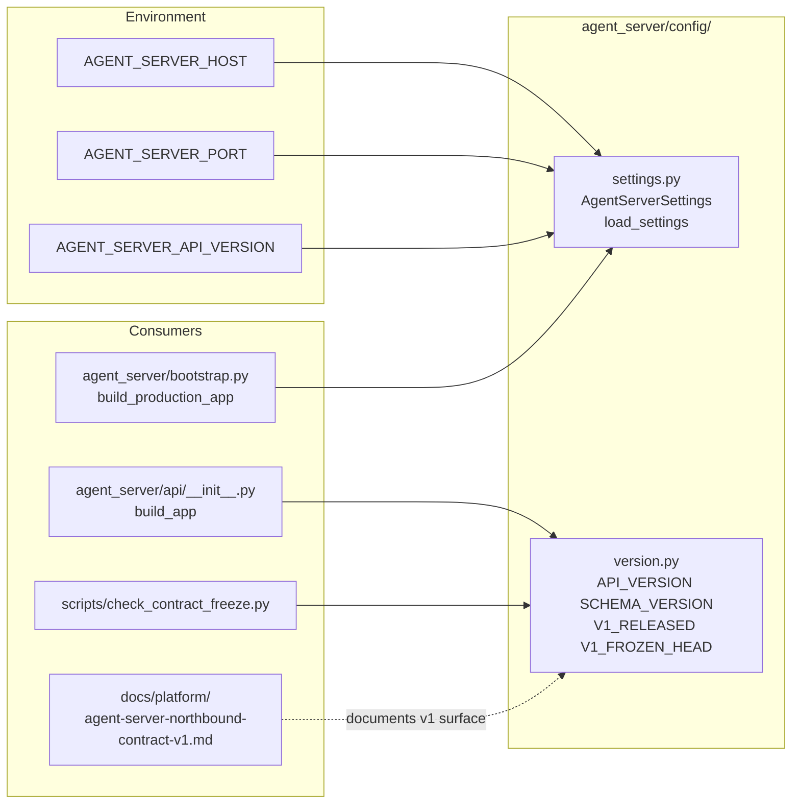
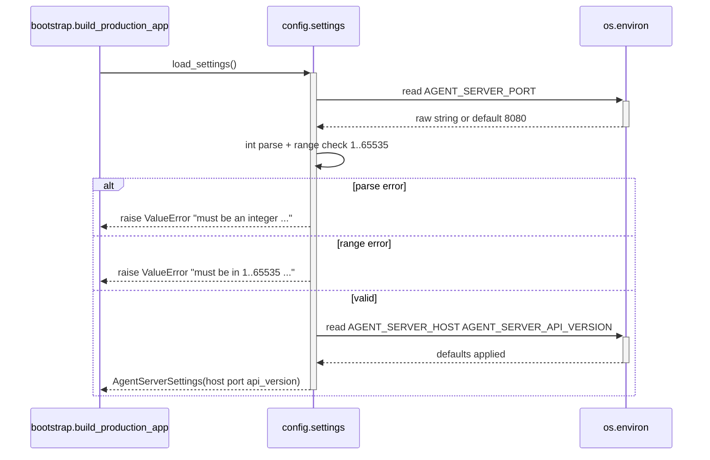
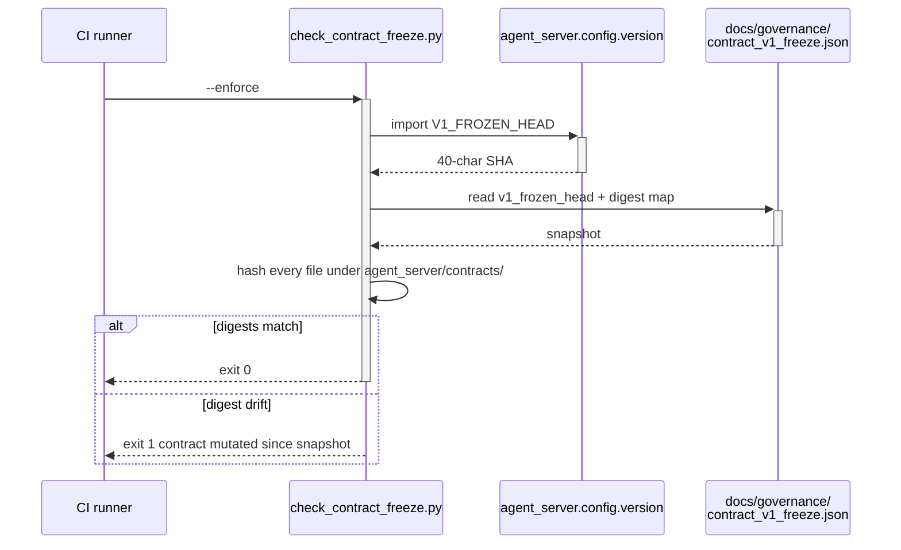

# agent_server/config — Architecture

> Last refreshed: W35 close (2026-05-05). HEAD `8bce5bc`. Frozen-snapshot SHA re-rolled after W35-T1.

---

## 1. Purpose / Responsibilities

`agent_server/config/` carries the **process-level configuration constants** that the
northbound facade needs *before* `agent_server/bootstrap.py::build_production_app` can
produce a FastAPI app, plus the **versioning constants** that pin the v1 contract surface
to its frozen snapshot.

What this package owns:
- `AgentServerSettings` — immutable host/port/api-version record loaded from env.
- `version.py` — `API_VERSION`, `SCHEMA_VERSION`, `V1_RELEASED`, `V1_FROZEN_HEAD`.
- W37+ contract-expansion roadmap (W35-T7 — module docstring placeholder).

What this package does NOT own:
- HTTP transport (`agent_server/api/`).
- Tenant identity / JWT validation (`agent_server/api/middleware/`,
  `agent_server/runtime/auth_seam.py`).
- Posture, profile, LLM mode (`hi_agent/config/`).
- The contract freeze policy itself (`scripts/check_contract_freeze.py` +
  `docs/governance/contract_v1_freeze.json`); this layer holds only the
  head-of-snapshot pointer.

---

## 2. Module Boundary (R-AS-1 + Rule 6 layering)

The package is intentionally tiny: two modules, no business logic, no environment-resolution
side effects beyond reading a fixed set of `AGENT_SERVER_*` variables.

- It MUST NOT import `hi_agent.*` (R-AS-1, `scripts/check_layering.py`).
- `settings.py` reads `AGENT_SERVER_HOST`, `AGENT_SERVER_PORT`, `AGENT_SERVER_API_VERSION`
  directly via `os.environ`.
- `version.py` exports module-level constants only (no env reads, no side effects).

Consumers:
- `agent_server/bootstrap.py::build_production_app` calls `load_settings()`.
- `agent_server/api/__init__.py::build_app` reads `AGENT_SERVER_API_VERSION`
  (re-exported via `agent_server/__init__.py`).
- `scripts/check_contract_freeze.py` reads `V1_FROZEN_HEAD`.

---

## 3. Component Diagram



---

## 4. Data Flow / Sequence Diagram



Re-snapshot path (W35 re-rolled the digest after spine validation landed):



W35-T1 added `__post_init__` blocks to 53 dataclasses, which required a
release-captain `python scripts/check_contract_freeze.py --snapshot` to roll the digest
forward. The new snapshot is recorded at `docs/governance/contract_v1_freeze.json`.

---

## 5. Key Contracts / Public API

```python
# settings.py
@dataclass(frozen=True)
class AgentServerSettings:
    host: str = "0.0.0.0"
    port: int = 8080
    api_version: str = "v1"

def load_settings() -> AgentServerSettings: ...
```

```python
# version.py
API_VERSION: str = "v1"
SCHEMA_VERSION: str = "1.0"
V1_RELEASED: bool = True
V1_RELEASED_AT: str = "2026-04-30"
V1_FROZEN_HEAD: str = "<40-char SHA, re-rolled at W35-T1>"
```

Failure modes from `load_settings()`:
- `AGENT_SERVER_PORT` not parsable as int → `ValueError`
- port outside `[1, 65535]` → `ValueError`

The bootstrap does not catch these — invalid configuration is intentionally a startup-time
crash so misconfigured deployments fail-fast before opening a port.

---

## 6. Posture Behaviour (Rule 11)

| Posture | `host` default | `port` default | Effect on `version.py` |
|---|---|---|---|
| `dev` | `0.0.0.0` (CLI overrides to `127.0.0.1`) | `8080` | `V1_RELEASED=True`; freeze gate runs as advisory in pre-release branches and blocking on `main` |
| `research` | `0.0.0.0` | `8080` | freeze gate is blocking; CI rejects digest drift |
| `prod` | `0.0.0.0` | `8080` | same as research |

W35-T1/W35-T3 are not visible at this layer — they affect the `agent_server/contracts/`
and `hi_agent/server/run_manager.py` paths. Settings remain posture-agnostic.

---

## 7. Failure Modes (Rule 7 fallback inventory)

| Path | Countable | Attributable | Inspectable | Gate-asserted |
|---|---|---|---|---|
| `load_settings()` ValueError on bad port | n/a (process aborts) | exception traceback | uvicorn fails to start | `tests/unit/test_agent_server_settings.py` |
| Digest drift in `agent_server/contracts/` | CI counts as failure | `scripts/check_contract_freeze.py` log | failure printed to CI | `scripts/check_contract_freeze.py --enforce` |

This layer emits no logs, metrics, or events of its own. Operators inspect resolved values
via the FastAPI `app.version` field and `GET /v1/health` body.

---

## 8. Resource Lifecycle (Rule 5)

Both modules are import-time-only:
- `AgentServerSettings` is concurrency-safe by construction (`frozen=True`).
- `version.py` constants are immutable and cached at import time.
- No async resources — Rule 5 is N/A.

The only lifecycle event is the **freeze**: once `V1_RELEASED = True`, every CI run
computes the contract digest and compares it against the snapshot. A drift fails the gate;
a release-captain `--snapshot` cycle bumps the head and re-records the digest.

---

## 9. Lineage / Spine Compliance (Rule 12)

This layer carries no spine — it deals in process-level constants, not per-tenant records.
`AgentServerSettings` is annotated `# scope: process-internal` semantically (it is read
once at startup and shared across all tenants).

W35-T1 / W35-T3 do not affect this layer; settings are tenant-agnostic by design.

---

## 10. Test Layers (Rule 4)

| Layer | Path | What it asserts |
|---|---|---|
| L1 unit | `tests/unit/test_agent_server_settings.py` | host/port/api_version defaults; port validation |
| L1 unit | `tests/unit/test_agent_server_version.py` | `V1_RELEASED=True`, frozen-head present |
| L2 integration | `tests/integration/test_contract_freeze_gate.py` | digest re-snapshot is consistent |
| Gate | `scripts/check_contract_freeze.py --enforce` | live CI run on every PR |

---

## 11. Open Roadmap Items (W36+)

- W36: optional `AGENT_SERVER_LOG_LEVEL` setting once `hi_agent.observability` exposes a
  posture-aware log-level resolver. Tracked in
  `docs/governance/boot-time-assertions-roadmap.md`.
- W37+: CONFIG-layer expansion (W35-T7 deferred) — see `agent_server/config/settings.py`
  module docstring for the migration window.
- W37+: optional `AGENT_SERVER_TLS_*` settings if direct-TLS termination becomes a v1
  requirement (currently behind nginx/Cloudflare per deployment guide).

---

## 12. References

Source files:
- `agent_server/config/__init__.py` (empty marker)
- `agent_server/config/settings.py` (~30 LOC + W37+ roadmap docstring)
- `agent_server/config/version.py` (~15 LOC)

Sibling subsystems:
- [`../ARCHITECTURE.md`](../ARCHITECTURE.md) — top-level facade
- [`../api/ARCHITECTURE.md`](../api/ARCHITECTURE.md) — HTTP transport
- [`../contracts/ARCHITECTURE.md`](../contracts/ARCHITECTURE.md) — frozen v1 schemas
- [`../runtime/ARCHITECTURE.md`](../runtime/ARCHITECTURE.md) — real-kernel binding
- [`../cli/ARCHITECTURE.md`](../cli/ARCHITECTURE.md) — operator CLI

Governance:
- `docs/governance/contract_v1_freeze.json` (snapshot pinned by `V1_FROZEN_HEAD`)
- `docs/platform/agent-server-northbound-contract-v1.md`
- `docs/governance/boot-time-assertions-roadmap.md`
- `docs/governance/retention-roadmap.md`
- CLAUDE.md — AS-CO track, Rule 11 Posture-Aware Defaults

Gates:
- `scripts/check_contract_freeze.py` (R-AS-3)
- `scripts/check_layering.py` (R-AS-1)
- `scripts/check_contracts_purity.py`
