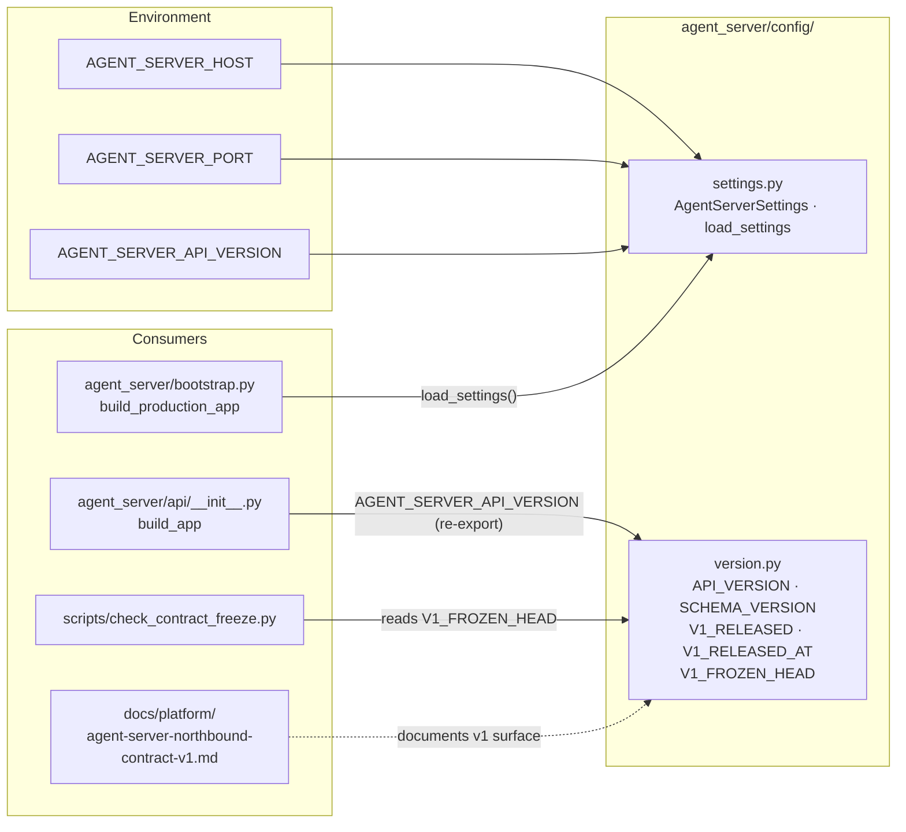

# agent_server/config/ Architecture

> Last refreshed: Wave 33 (2026-05-04). Current contents: `settings.py`, `version.py`. Versioning gate snapshot SHA: `8c6e22f1`.

---

## 1. Purpose & Position in System

`agent_server/config/` carries the **process-level configuration constants** that the northbound facade needs *before* `bootstrap.build_production_app` can produce a FastAPI app, plus the **versioning constants** that pin the v1 contract surface to its frozen snapshot.

It is intentionally tiny: two modules, no business logic, no environment-resolution side effects beyond reading a fixed set of `AGENT_SERVER_*` variables. Anything more elaborate (posture inference, profile resolution, capability matrix) lives in `hi_agent/config/` and is reached via the bootstrap seam — not duplicated here.

Two design principles govern this layer:

1. **Pure values.** `AgentServerSettings` is a `frozen=True` dataclass; `version.py` exports plain module-level constants. There is no class hierarchy, no validation framework, no observers. A misconfiguration produces a `ValueError` at `load_settings()` time and stops the process before any port is opened.
2. **R-AS-1 clean.** Neither module imports `hi_agent.*`. They are safe to load from any module under `agent_server/` — including the CLI — without triggering layering violations.

What this layer does NOT own:
- HTTP transport (`agent_server/api/`).
- Tenant identity, JWT validation (`agent_server/api/middleware/`, `agent_server/runtime/auth_seam.py`).
- Posture, profile, LLM mode (`hi_agent/config/`).
- The contract freeze policy itself (lives in `scripts/check_contract_freeze.py` + `docs/governance/contract_v1_freeze.json`); this layer holds only the head-of-snapshot pointer.

---

## 2. External Interfaces

The package exports a small, stable set of names:

| Module | Symbol | Type | Purpose |
|---|---|---|---|
| `settings.py` | `AgentServerSettings` | `@dataclass(frozen=True)` | Holds resolved `host`, `port`, `api_version` |
| `settings.py` | `load_settings()` | function | Reads `AGENT_SERVER_HOST` / `AGENT_SERVER_PORT` / `AGENT_SERVER_API_VERSION`; validates port range; returns `AgentServerSettings` |
| `version.py` | `API_VERSION` | str | The single supported API version label (`"v1"`) |
| `version.py` | `SCHEMA_VERSION` | str | Semantic version of the v1 schema set (`"1.0"`) |
| `version.py` | `V1_RELEASED` | bool | True after 2026-04-30; flips the contract-freeze gate from advisory to blocking |
| `version.py` | `V1_RELEASED_AT` | str (ISO date) | Calendar date of the v1 freeze |
| `version.py` | `V1_FROZEN_HEAD` | str (40-char hex) | The git SHA at which the v1 surface was snapshotted (`8c6e22f1...`) |

`AgentServerSettings` defaults:

```python
@dataclass(frozen=True)
class AgentServerSettings:
    host: str = "0.0.0.0"
    port: int = 8080
    api_version: str = "v1"
```

Environment variables consumed by `load_settings()`:

| Variable | Default | Validation |
|---|---|---|
| `AGENT_SERVER_HOST` | `0.0.0.0` | none (string) |
| `AGENT_SERVER_PORT` | `8080` | must parse as int and lie in `[1, 65535]` |
| `AGENT_SERVER_API_VERSION` | `v1` | none (string; rarely overridden in practice) |

Failure modes from `load_settings()`:

| Cause | Outcome |
|---|---|
| `AGENT_SERVER_PORT` not parsable as int | `ValueError("AGENT_SERVER_PORT must be an integer, got: ...")` |
| port outside `[1, 65535]` | `ValueError("AGENT_SERVER_PORT must be in [1, 65535], got: ...")` |

The `agent_server` package re-exports `AGENT_SERVER_API_VERSION = "v1"` from its top-level `__init__.py` for convenience; that constant is sourced from `version.py::API_VERSION` and kept in sync by review (no programmatic re-export).

---

## 3. Internal Components



| Module | Role |
|---|---|
| `settings.py` | Reads three env vars, validates port, returns a frozen settings record |
| `version.py` | Module-level constants for API/schema versioning and contract freeze |
| `__init__.py` | Empty package marker (no re-exports today) |

---

## 4. Data Flow

### Settings resolution at startup

```mermaid
sequenceDiagram
    participant Caller as bootstrap.build_production_app
    participant Cfg as agent_server.config.settings
    participant Env as os.environ

    Caller->>+Cfg: load_settings()
    Cfg->>+Env: read AGENT_SERVER_PORT
    Env-->>-Cfg: raw string (or default "8080")
    Cfg->>Cfg: int(raw); check 1 <= port <= 65535
    alt parse error
        Cfg-->>Caller: raise ValueError("must be an integer, ...")
    else range error
        Cfg-->>Caller: raise ValueError("must be in [1, 65535], ...")
    else valid
        Cfg->>+Env: read AGENT_SERVER_HOST, AGENT_SERVER_API_VERSION
        Env-->>-Cfg: defaults applied
        Cfg-->>-Caller: AgentServerSettings(host, port, api_version)
    end
```

### Contract freeze gate uses `V1_FROZEN_HEAD`

```mermaid
sequenceDiagram
    participant CI as CI runner
    participant Gate as check_contract_freeze.py
    participant Ver as agent_server.config.version
    participant Json as docs/governance/<br/>contract_v1_freeze.json

    CI->>+Gate: --enforce
    Gate->>+Ver: import V1_FROZEN_HEAD
    Ver-->>-Gate: SHA string
    Gate->>+Json: read v1_frozen_head
    Json-->>-Gate: SHA string
    alt SHAs disagree
        Gate-->>CI: exit 1 (constants out of sync)
    else SHAs agree
        Gate->>Gate: hash every file under agent_server/contracts/
        Gate->>Gate: compare against snapshot
        alt digests match
            Gate-->>-CI: exit 0
        else digest drift
            Gate-->>-CI: exit 1 (contracts mutated since snapshot)
        end
    end
```

Re-snapshotting (release-captain only):

```bash
python scripts/check_contract_freeze.py --snapshot
# rewrites agent_server/config/version.py::V1_FROZEN_HEAD
# rewrites docs/governance/contract_v1_freeze.json
```

`--snapshot` overwrites both sides unconditionally so the next `--enforce` run starts from a consistent baseline.

---

## 5. State & Persistence

The config layer holds **no runtime state**. Both modules are pure values:

- `AgentServerSettings` instances are created once per process by `load_settings()` and passed by reference. The `frozen=True` decorator prevents mutation.
- `version.py` constants are read at import time and never mutated.

There is no file the layer writes to during normal operation. The release-captain `--snapshot` workflow is the only path that mutates `version.py` (and `contract_v1_freeze.json`); that's a manual administrative action, not a runtime concern.

The platform's other persistent state (idempotency SQLite, run store, event store, …) is owned by `hi_agent/server/` and reached via the bootstrap seam, not this layer.

---

## 6. Concurrency & Lifecycle

- Both modules are import-time-only; they have no `__init__` cost beyond reading three env vars in `load_settings()` (which the bootstrap calls exactly once).
- `AgentServerSettings` is concurrency-safe by construction (frozen dataclass).
- `version.py` constants are immutable strings/booleans; reading them from multiple threads or async tasks is trivially safe.
- There is no async resource here — Rule 5 (Async/Sync Resource Lifetime) is N/A.

The only lifecycle event the contracts side participates in is the **freeze**: once `V1_RELEASED = True`, every CI run computes the contract digest and compares it against the snapshot. A drift fails the gate; a release-captain `--snapshot` cycle bumps the head and re-records the digest.

---

## 7. Error Handling & Observability

Errors raised by this layer:

| Source | Raises | When |
|---|---|---|
| `load_settings()` | `ValueError` | `AGENT_SERVER_PORT` is non-integer or out of range |

The bootstrap does NOT catch these errors — invalid configuration is intentionally a startup-time crash so misconfigured deployments fail-fast rather than serve a broken API.

Observability:

- The layer emits no logs, metrics, or events of its own.
- The chosen settings show up in the FastAPI app's `version` field (`AGENT_SERVER_API_VERSION` → `app.version`).
- Operators inspect resolved values via the `/v1/health` JSON body (`{"status":"ok","api_version":"v1"}`).

---

## 8. Security Boundary

There is no security-sensitive material in this layer:

- No secrets are read here. JWT secrets, LLM provider keys, database URLs all live in `hi_agent/` config or are read directly by the consuming subsystem.
- `host` defaults to `0.0.0.0` because `load_settings()` is the public-API path; the operator-facing CLI (`agent_server/cli/commands/serve.py`) overrides this default with `127.0.0.1` so accidental local invocations don't expose the port.
- `version.py` constants are public knowledge — they ship in the wire-level `app.version` field and the `/v1/health` body.

R-AS-1 boundary: zero `hi_agent.*` imports under this directory. `scripts/check_layering.py` enforces.

Contract freeze (R-AS-3): every modification to `version.py` or any file under `agent_server/contracts/` triggers `scripts/check_contract_freeze.py --enforce` in CI. Breaking changes go to a parallel `agent_server/contracts/v2/` sub-package; the v1 snapshot is never edited in place.

---

## 9. Extension Points

Adding a new env-driven setting:

1. Add a field to `AgentServerSettings` with a type and default value.
2. Update `load_settings()` to read the env var, validate it, and pass it to the constructor.
3. Document the variable in `README.md` (Key Environment Variables) and `docs/deployment-env-matrix.md`.
4. Add a unit test under `tests/unit/test_agent_server_settings.py` covering both default and override paths, plus the validation error if applicable.

Adding a new version constant (rare):

1. Edit `version.py` carefully — every entry here is consumed by the contract-freeze gate or external tooling. Coordinate with AS-CO owner.
2. Update `docs/platform/agent-server-northbound-contract-v1.md`.
3. Run `python scripts/check_contract_freeze.py --enforce` to verify the snapshot is still consistent (or `--snapshot` to bump it).

What you should NOT add here:

- Posture inference (use `hi_agent.config.posture`).
- Profile / capability resolution (use `hi_agent.config.builder`).
- LLM mode toggles (use `HI_AGENT_LLM_MODE` consumed by `hi_agent.llm`).
- Anything that imports `hi_agent.*` (R-AS-1 violation).

---

## 10. Constraints & Trade-offs

What this design assumes:

- **Three env vars are enough.** Host, port, and API-version label cover what the bootstrap needs *before* the platform-side `Posture.from_env()` can be reached. Anything else can wait until after `build_production_app` returns.
- **Manual snapshot is acceptable.** Re-freezing the v1 contract is a release-captain action, not an automated workflow. The cost is one bash command per release.
- **No config file.** YAML / TOML config files would be nice for operators but introduce a parser dependency and a precedence policy. Env vars + CLI flags + bootstrap defaults is sufficient at v1.

What this design does NOT handle well:

- **Hot reload.** Settings are read once at process start. Changing `AGENT_SERVER_PORT` requires a restart.
- **Multi-tenant config.** There is no per-tenant override here; tenancy is handled at the request layer (`TenantContext` from middleware).
- **Schema introspection.** `SCHEMA_VERSION` is a string, not a generated artifact; downstream tools that need a machine-readable schema use the OpenAPI document FastAPI auto-generates from `agent_server/contracts/`.

---

## 11. References

- Source files:
  - `agent_server/config/__init__.py` (empty marker)
  - `agent_server/config/settings.py` (≈30 LOC)
  - `agent_server/config/version.py` (≈15 LOC)
- Consumers:
  - `agent_server/bootstrap.py::build_production_app` (calls `load_settings()`)
  - `agent_server/api/__init__.py::build_app` (uses `AGENT_SERVER_API_VERSION`)
  - `scripts/check_contract_freeze.py` (reads `V1_FROZEN_HEAD`)
- Sibling subsystems:
  - Frozen contracts: [`agent_server/contracts/ARCHITECTURE.md`](../contracts/ARCHITECTURE.md)
  - Operator CLI: [`agent_server/cli/ARCHITECTURE.md`](../cli/ARCHITECTURE.md)
  - Top-level facade: [`agent_server/ARCHITECTURE.md`](../ARCHITECTURE.md)
- Governance docs:
  - `docs/governance/contract_v1_freeze.json` (snapshot pinned by `V1_FROZEN_HEAD`)
  - `docs/platform/agent-server-northbound-contract-v1.md`
  - `CLAUDE.md` AS-CO ownership track
- Gates:
  - `scripts/check_contract_freeze.py` (R-AS-3)
  - `scripts/check_layering.py` (R-AS-1)
  - `scripts/check_contracts_purity.py` (no consumer imports back into config)
