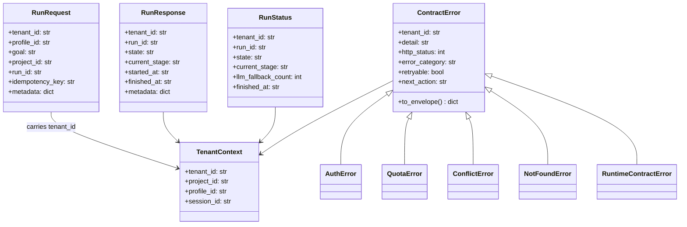
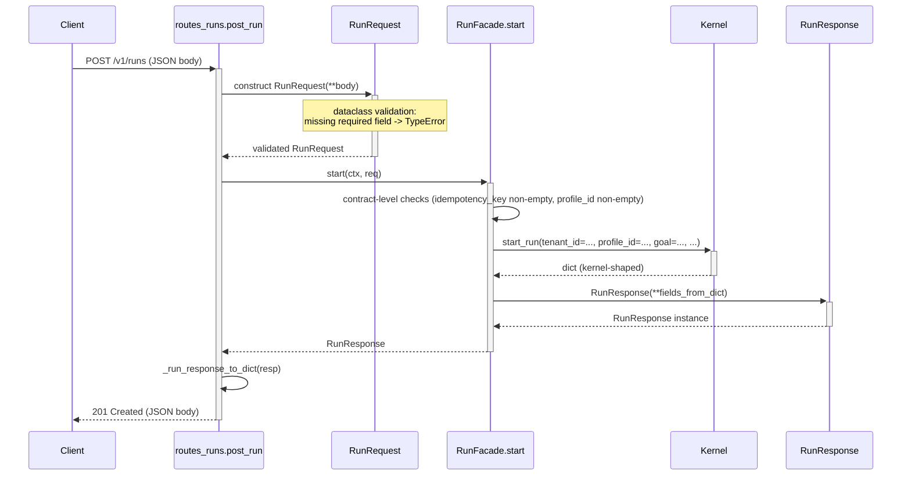
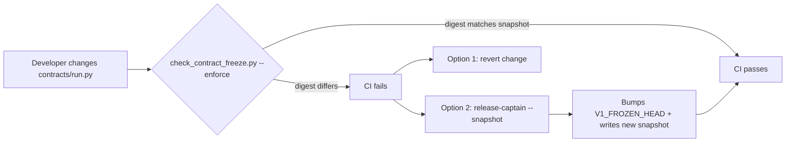

# agent_server/contracts/ Architecture

---

## 1. Purpose & Position in System

`agent_server/contracts/` defines the **stable, versioned schemas** that the `agent_server` HTTP facade exposes northbound. These are the only types that downstream consumers (the Research Intelligence App, third-party SDKs, business agents) depend on. Everything else inside the platform — `hi_agent.*` runtime types, `agent_kernel.*` storage layouts — is private.

The contracts package is **frozen at v1**. `agent_server/config/version.py::V1_RELEASED = True` flips the contract-freeze gate from advisory to blocking. After release (`V1_RELEASED_AT = "2026-04-30"`), the digest of every file under `agent_server/contracts/` is snapshotted in `docs/governance/contract_v1_freeze.json` and `V1_FROZEN_HEAD` records the release SHA. Any source-level change invalidates the snapshot and CI fails until either (a) the change is reverted or (b) the release captain explicitly authorizes a re-snapshot via `python scripts/check_contract_freeze.py --snapshot`.

Breaking changes do not edit `v1/` types in place — they go to a parallel `agent_server/contracts/v2/` sub-package, leaving v1 fully callable for clients on the old contract.

---

## 2. External Interfaces

The contracts package exports frozen `@dataclass(frozen=True)` types organized by surface area:

### Run lifecycle (`run.py`)

| Type | Role | Required fields | Optional fields |
|---|---|---|---|
| `RunRequest` | Client request to create a run | `tenant_id`, `profile_id`, `goal` | `project_id`, `run_id`, `idempotency_key`, `metadata` |
| `RunResponse` | Body returned by `POST /v1/runs` | `tenant_id`, `run_id`, `state` | `current_stage`, `started_at`, `finished_at`, `metadata` |
| `RunStatus` | Body returned by `GET /v1/runs/{id}` and `POST .../signal` | `tenant_id`, `run_id`, `state` | `current_stage`, `llm_fallback_count`, `finished_at` |
| `RunStream` | Single SSE frame in `GET /v1/runs/{id}/events` | `tenant_id`, `run_id`, `event_type` | `payload`, `sequence`, `created_at` |

### Tenancy (`tenancy.py`)

| Type | Role | Required fields | Optional fields |
|---|---|---|---|
| `TenantContext` | Authenticated identity injected by `TenantContextMiddleware` into `request.state` | `tenant_id` | `project_id`, `profile_id`, `session_id` |
| `TenantQuota` | Per-tenant resource limit | `tenant_id` | `max_concurrent_runs`, `max_runs_per_minute`, `max_llm_cost_per_day_usd` |
| `CostEnvelope` | Tracked cost over a billing window | `tenant_id`, `window_start_iso`, `window_end_iso` | `llm_cost_usd`, `total_runs` |

### Skills (`skill.py`)

| Type | Role | Required fields | Optional fields |
|---|---|---|---|
| `SkillRegistration` | Body of `POST /v1/skills` | `tenant_id`, `skill_id`, `version`, `handler_ref` | `description`, `tags` |
| `SkillVersion` | Pinned version record | `tenant_id`, `skill_id`, `version` | `pinned_at` |
| `SkillResolution` | Resolved skill for invocation | `tenant_id`, `skill_id`, `version`, `handler_ref` | `is_pinned` |

### Gates (`gate.py`)

| Type | Role | Required fields | Optional fields |
|---|---|---|---|
| `PauseToken` | Resume credential at a paused point | `tenant_id`, `run_id`, `token` | `reason`, `emitted_at` |
| `ResumeRequest` | Client request to resume | `tenant_id`, `run_id`, `pause_token` | `input_data` |
| `GateEvent` | Pause/resume audit event | `tenant_id`, `run_id`, `event_type` | `token`, `created_at` |
| `GateDecisionRequest` | Body of `POST /v1/gates/{id}/decide` | `gate_id`, `run_id`, `tenant_id`, `decision` | `reason`, `decided_by`, `decided_at` |

### Memory (`memory.py`)

| Type | Role | Required fields | Optional fields |
|---|---|---|---|
| `MemoryTierEnum` | StrEnum of `L0`/`L1`/`L2`/`L3` | n/a | n/a |
| `MemoryReadKey` | Key for reading memory tier | `tenant_id`, `tier` | `project_id`, `profile_id`, `run_id`, `key` |
| `MemoryWriteRequest` | Body of `POST /v1/memory/write` | `tenant_id`, `tier`, `key`, `value` | `project_id`, `profile_id`, `run_id`, `ttl_seconds` |

### Streaming events (`streaming.py`)

| Type | Role | Required fields | Optional fields |
|---|---|---|---|
| `Event` | Single structured event | `tenant_id`, `run_id`, `event_type` | `trace_id`, `payload`, `sequence`, `created_at` |
| `EventCursor` | Pagination cursor | `tenant_id`, `run_id`, `last_sequence` | `page_size` |
| `EventFilter` | Filter criteria | `tenant_id` | `run_id`, `trace_id`, `event_type`, `since_sequence` |

### LLM proxy (`llm_proxy.py`)

| Type | Role | Required fields | Optional fields |
|---|---|---|---|
| `LLMRequest` | Posture-routed LLM call | `tenant_id`, `run_id`, `messages` | `model_hint`, `temperature`, `max_tokens` |
| `LLMResponse` | Result envelope | `tenant_id`, `run_id`, `content` | `model_used`, `input_tokens`, `output_tokens`, `fallback_used`, `cost_usd` |

### Workspace (`workspace.py`)

| Type | Role | Required fields | Notes |
|---|---|---|---|
| `ContentHash` | SHA-256 content address | `algorithm`, `hex_digest` | `# scope: process-internal` |
| `BlobRef` | Reference to a content-addressed blob | `tenant_id`, `content_hash` | `size_bytes`, `media_type` |
| `WorkspaceObject` | File-tree object in a tenant workspace | `tenant_id`, `path`, `blob_ref` | `version`, `created_at` |

### Errors (`errors.py`)

| Type | HTTP status | error_category default |
|---|---|---|
| `ContractError` (base) | 500 | `internal_error` |
| `AuthError` | 401 | `auth_required` |
| `QuotaError` | 429 | inherited |
| `ConflictError` | 409 | inherited |
| `NotFoundError` | 404 | inherited |
| `RuntimeContractError` | 500 | inherited |

All errors expose `to_envelope()` returning the unified HD-5 shape: `{error_category, message, retryable, next_action, tenant_id, detail}`.

---

## 3. Internal Components



Layout principle: every dataclass is `frozen=True`. Sub-modules group by surface, not by HTTP route — a single route may consume types from multiple modules.

---

## 4. Data Flow

A typical request body validates from JSON → contract dataclass at the route boundary, traverses facade and kernel as a kernel-shaped dict, then re-validates outbound:



The dataclass boundary is the validation seam: an invalid client payload raises before reaching the facade, and an invalid kernel payload raises before reaching the wire.

---

## 5. State & Persistence

Contracts hold **no state**. Every type is `frozen=True`; instances are values, not entities. There are no class-level mutable attributes other than the `http_status` / `error_category` defaults on `ContractError` subclasses, which serve as construction seeds (see `errors.py` W31-N N-13).

Persistent fields (those that survive across requests) are the responsibility of `hi_agent` storage — `SQLiteRunStore`, `SQLiteEventStore`, `IdempotencyStore`. Contract dataclasses are the wire shape *into* and *out of* those stores.

---

## 6. Concurrency & Lifecycle

Contracts are immutable values — concurrency-safe by construction. There is no module-level state that requires initialization order, no background tasks, no async resources.

**Contract freeze (R-AS-3):** the only lifecycle event the contracts package undergoes is the *freeze*. Once `V1_RELEASED = True`, the freeze gate runs in CI:



Breaking changes go to `agent_server/contracts/v2/`. The v1 types remain callable for the lifetime of the v1 surface; no in-place mutation.

---

## 7. Error Handling & Observability

Contract errors are throw-only — they do not emit metrics, logs, or events themselves. Observability is the route handler's responsibility: when a route catches a `ContractError`, it logs the `tenant_id`, the error_category, and the path, then calls `to_envelope()` to build the wire response.

The `to_envelope()` shape (HD-5):

```python
{
  "error_category": "auth_required",
  "message": "missing or empty X-Tenant-Id header",
  "retryable": False,
  "next_action": "supply X-Tenant-Id header",
  "tenant_id": "",
  "detail": ""
}
```

This shape matches `hi_agent.server.error_categories.error_response()` so tooling parses both sources uniformly.

---

## 8. Security Boundary

Every contract dataclass that crosses a tenant boundary **must** carry `tenant_id` as its first field (Rule 12 — Contract Spine Completeness). The current package complies:

| Contract module | Carries `tenant_id` | Notes |
|---|---|---|
| `run.py::RunRequest`, `RunResponse`, `RunStatus`, `RunStream` | yes | first field in every dataclass |
| `tenancy.py::TenantContext`, `TenantQuota`, `CostEnvelope` | yes | identity bearer |
| `skill.py::SkillRegistration`, `SkillVersion`, `SkillResolution` | yes | tenant-scoped |
| `gate.py::PauseToken`, `ResumeRequest`, `GateEvent`, `GateDecisionRequest` | yes | tenant-scoped |
| `memory.py::MemoryReadKey`, `MemoryWriteRequest` | yes | tenant-scoped |
| `streaming.py::Event`, `EventCursor`, `EventFilter` | yes | tenant-scoped |
| `llm_proxy.py::LLMRequest`, `LLMResponse` | yes | tenant-scoped |
| `workspace.py::BlobRef`, `WorkspaceObject` | yes | tenant-scoped |
| `workspace.py::ContentHash` | no | annotated `# scope: process-internal` (pure value object) |
| `errors.py::ContractError` and subclasses | yes (constructor kwarg) | identity attribution on errors |

Enforcement: `scripts/check_contract_spine_completeness.py` scans every dataclass and fails CI on a missing `tenant_id` field unless the file carries the `# scope: process-internal` marker with rationale.

The `posture-strict` runtime check (`gate.py::GateDecisionRequest.__post_init__`) demonstrates the in-class enforcement pattern: under `HI_AGENT_POSTURE in {"research", "prod"}`, an empty `tenant_id` raises at construction time.

---

## 9. Extension Points

Adding a new contract module:

1. Create `agent_server/contracts/<surface>.py` with frozen dataclasses; `tenant_id` is the first required field on every wire-crossing type.
2. Add a docstring describing the surface; do NOT import from `agent_server.facade` or `hi_agent` (purity gate enforces).
3. Run `python scripts/check_contracts_purity.py` to confirm no leakage.
4. After v1 is RELEASED, run `python scripts/check_contract_freeze.py --snapshot` to update the freeze digest and bump `V1_FROZEN_HEAD`.
5. Add a corresponding facade method (in `agent_server/facade/`) and route handler (in `agent_server/api/`).

Extending an existing v1 contract: NOT permitted in-place after `V1_RELEASED = True`. Use a v2 sub-package or add a new fields-additive contract behind a feature flag.

---

## 10. Constraints & Trade-offs

What this design assumes:
- All types are JSON-serializable. Tuples become lists; dataclasses become objects with field-name keys.
- Field names are wire-stable. Renames go to v2.
- No domain-specific types (no `BiologyResult`, no `FinanceTransaction`). Those live in business overlays per Rule 10.

What this design does NOT handle well:
- **Schema evolution at scale.** A v2 surface duplicates the entire dataclass set. There is no shared base — the duplication is intentional (R-AS-3) but costs maintenance.
- **Polymorphic results.** Every response is a single dataclass type; there are no discriminated unions in the v1 surface.
- **Validation depth.** Dataclasses validate types but not semantics (e.g., `decision in {"approved","rejected"}`). Per-class `__post_init__` carries the semantic rules and is allowed but discouraged for cross-cutting validation.

---

## 11. References

- Contract surface index: `agent_server/contracts/__init__.py`
- Frozen public docs: `docs/platform/agent-server-northbound-contract-v1.md`
- Version config: `agent_server/config/version.py`
- Freeze gate: `scripts/check_contract_freeze.py`
- Purity gate: `scripts/check_contracts_purity.py`
- Spine completeness gate: `scripts/check_contract_spine_completeness.py`
- Layering gate: `scripts/check_layering.py`
- Closure taxonomy: `docs/governance/closure-taxonomy.md`
- Sibling subsystems: `agent_server/api/ARCHITECTURE.md`, `agent_server/facade/ARCHITECTURE.md`, `agent_server/runtime/ARCHITECTURE.md`
