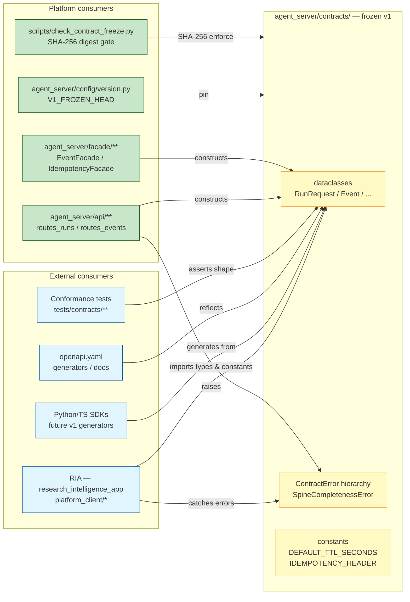
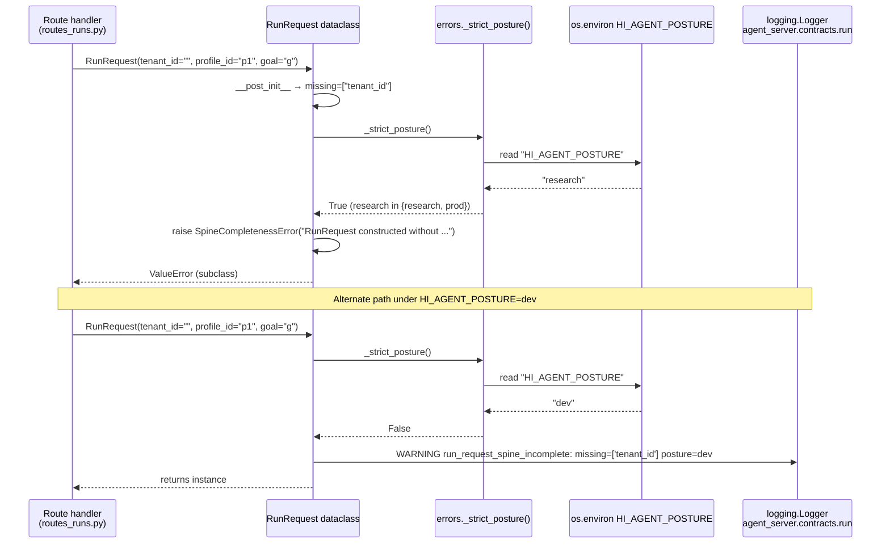
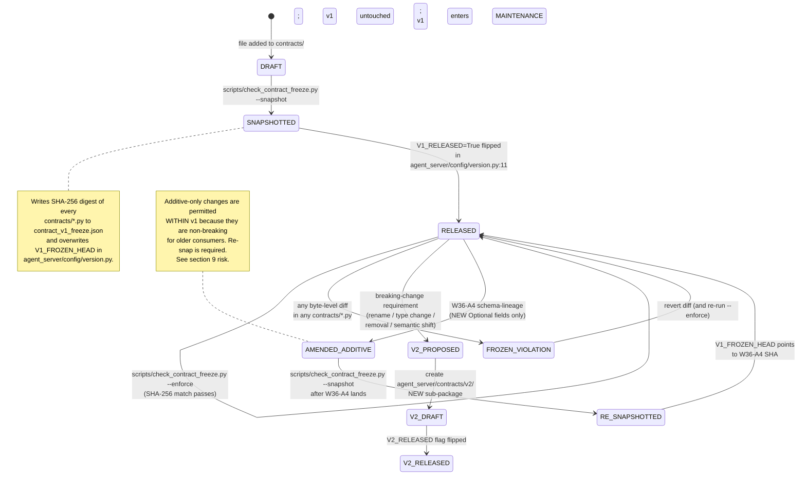
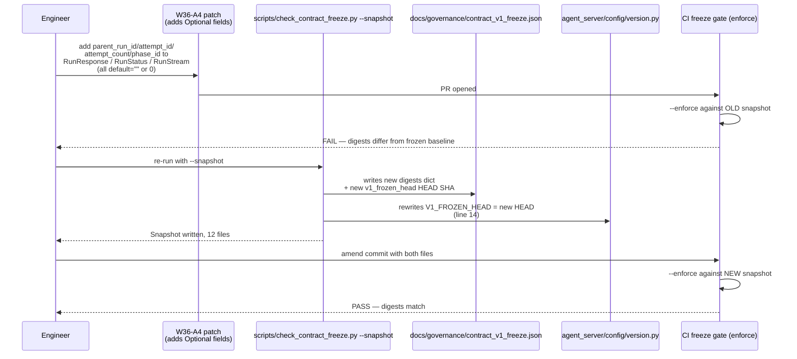

# agent_server/contracts — Architecture

> **Last refreshed:** 2026-05-06 (W35 corrective close + W36 plans). HEAD `276917d8`.
> **Audience:** contract consumers (RIA), platform engineers, AS-CO owners.
> **Status:** authoritative.

---

## 1. Purpose & Responsibilities

`agent_server/contracts/` is the **frozen v1 northbound contract surface**: a stdlib-only package of dataclasses, error types, and module-level constants that downstream consumers (notably the Research Intelligence App, RIA) bind against to drive the platform without coupling to runtime internals.

Three responsibilities, in order of binding force:

1. **Single source of public schema truth.** Every public dataclass in this package corresponds to a wire-level type in the v1 surface. The freeze digest in `docs/governance/contract_v1_freeze.json` is the binding snapshot; any byte-level change after the freeze head requires a v2 sub-package (R-AS-2, see ADR-1 below).
2. **Posture-aware spine validator carrier.** Every spine-bearing dataclass in this package carries a `__post_init__` that fails closed under research/prod via `SpineCompletenessError`, and logs a structured WARNING under dev (W35-T1, see §5 and `agent_server/contracts/errors.py:33-55`).
3. **Layering boundary.** Per R-AS-1 / R-AS-7, this package imports **only** stdlib + `typing` + `dataclasses`. It does NOT import `hi_agent.*`. Posture is read via the local `_strict_posture()` helper (`agent_server/contracts/errors.py:33-44`) which mirrors `hi_agent.config.posture.Posture.is_strict` semantics without the import dependency.

**Out of scope (deferred to v2):** schema-evolution machinery, breaking-change migrations, per-tenant override schemas, capability negotiation. These land in `agent_server/contracts/v2/` when v2 is staged (none in W35; W36 widens the v1 spine but does not break it — see §9 risk).

---

## 2. Context & Scope

```mermaid
flowchart LR
    subgraph external [External consumers]
        RIA[RIA — research_intelligence_app<br/>platform_client/*]
        SDK[Python/TS SDKs<br/>future v1 generators]
        OPENAPI[openapi.yaml<br/>generators / docs]
        TESTS[Conformance tests<br/>tests/contracts/**]
    end

    subgraph contracts [agent_server/contracts/ — frozen v1]
        TYPES[dataclasses<br/>RunRequest / Event / ...]
        ERRS[ContractError hierarchy<br/>SpineCompletenessError]
        CONSTS[constants<br/>DEFAULT_TTL_SECONDS<br/>IDEMPOTENCY_HEADER]
    end

    subgraph platform [Platform consumers]
        API[agent_server/api/**<br/>routes_runs / routes_events]
        FAC[agent_server/facade/**<br/>EventFacade / IdempotencyFacade]
        VER[agent_server/config/version.py<br/>V1_FROZEN_HEAD]
        FREEZE[scripts/check_contract_freeze.py<br/>SHA-256 digest gate]
    end

    RIA -->|imports types & constants| TYPES
    RIA -->|catches errors| ERRS
    SDK -->|generates from| TYPES
    OPENAPI -->|reflects| TYPES
    TESTS -->|asserts shape| TYPES

    API -->|constructs| TYPES
    API -->|raises| ERRS
    FAC -->|constructs| TYPES

    VER -.pin.-> contracts
    FREEZE -.SHA-256 enforce.-> contracts

    classDef ext fill:#e1f5ff,stroke:#01579b
    classDef ctr fill:#fff9c4,stroke:#f57f17
    classDef plat fill:#c8e6c9,stroke:#1b5e20
    class RIA,SDK,OPENAPI,TESTS ext
    class TYPES,ERRS,CONSTS ctr
    class API,FAC,VER,FREEZE plat
```

**System boundaries:**

- **Inbound (allowed):** stdlib (`dataclasses`, `enum`, `typing`, `os`, `logging`).
- **Inbound (forbidden):** `hi_agent.*` (R-AS-1 layering rule), third-party packages (R-AS-7 contracts purity rule, enforced by `scripts/check_contracts_purity.py`).
- **Outbound (consumers):** anyone — by design. Stdlib-only is what makes this surface safe to vend to RIA's process and to OpenAPI/SDK generators.

---

## 3. Module Boundary & Dependencies

| File | Lines (approx.) | Purpose | Key exports |
|---|---|---|---|
| `__init__.py` | 1 | Subpackage marker | — |
| `errors.py` | 142 | Error hierarchy + posture helper | `ContractError`, `AuthError`, `QuotaError`, `ConflictError`, `NotFoundError`, `RuntimeContractError`, `SpineCompletenessError`, `_strict_posture()` |
| `run.py` | 160 | Run lifecycle types | `RunRequest`, `RunResponse`, `RunStatus`, `RunStream` |
| `tenancy.py` | 105 | Tenant scope/quota types | `TenantContext`, `TenantQuota`, `CostEnvelope` |
| `streaming.py` | 111 | Event stream types | `Event`, `EventCursor`, `EventFilter` |
| `gate.py` | 170 | Pause/resume gate types | `PauseToken`, `ResumeRequest`, `GateEvent`, `GateDecisionRequest` |
| `memory.py` | 93 | Memory tier types | `MemoryTierEnum`, `MemoryReadKey`, `MemoryWriteRequest` |
| `skill.py` | 119 | Skill registry types | `SkillRegistration`, `SkillVersion`, `SkillResolution` |
| `llm_proxy.py` | 89 | LLM gateway types | `LLMRequest`, `LLMResponse` |
| `workspace.py` | 84 | Workspace/blob types | `ContentHash`, `BlobRef`, `WorkspaceObject` |
| `manifest.py` | 63 | Manifest response | `ManifestResponse`, `PostureLiteral` |
| `idempotency.py` | 198 | Idempotency contract spec | `DEFAULT_TTL_SECONDS`, `SCOPE`, `IDEMPOTENCY_HEADER`, `TENANT_HEADER`, `BODY_MISMATCH_STATUS` |

**Layering invariants (enforced by CI):**

- Each file MUST import only from stdlib and from `agent_server.contracts.errors` — verified by `scripts/check_contracts_purity.py` (per R-AS-7).
- Each file MUST NOT import `hi_agent.*` — the `_strict_posture()` helper in `errors.py:33` mirrors `Posture.is_strict` semantics from `hi_agent/config/posture.py:43-46` without the dependency, per the docstring at `errors.py:21-24`.
- Snapshot digest of each `*.py` file must match `docs/governance/contract_v1_freeze.json::digests` once `V1_RELEASED=True` (currently `True`, set at `agent_server/config/version.py:11`).

---

## 4. Building Blocks

```mermaid
flowchart TB
    subgraph errors [errors.py — error hierarchy]
        CE[ContractError<br/>http_status/error_category/retryable/next_action]
        AE[AuthError 401]
        QE[QuotaError 429]
        CONE[ConflictError 409]
        NFE[NotFoundError 404]
        RCE[RuntimeContractError 500]
        SCE[SpineCompletenessError<br/>ValueError subclass]
        SP[_strict_posture<br/>HI_AGENT_POSTURE in research/prod]
        CE --> AE
        CE --> QE
        CE --> CONE
        CE --> NFE
        CE --> RCE
    end

    subgraph run_family [Run family — run.py]
        RR[RunRequest<br/>tenant_id+profile_id+goal req]
        RP[RunResponse<br/>tenant_id+run_id+state req]
        RS[RunStatus<br/>tenant_id+run_id+state req]
        RST[RunStream<br/>tenant_id+run_id+event_type req]
    end

    subgraph tenancy_family [Tenancy — tenancy.py]
        TC[TenantContext]
        TQ[TenantQuota]
        CEnv[CostEnvelope]
    end

    subgraph stream_family [Streaming — streaming.py]
        EV[Event]
        EC[EventCursor]
        EF[EventFilter]
    end

    subgraph gate_family [Gate — gate.py]
        PT[PauseToken]
        RREQ[ResumeRequest]
        GE[GateEvent]
        GDR[GateDecisionRequest<br/>mutable]
    end

    subgraph mem_family [Memory — memory.py]
        MTE[MemoryTierEnum<br/>L0/L1/L2/L3]
        MRK[MemoryReadKey]
        MWR[MemoryWriteRequest]
    end

    subgraph skill_family [Skill — skill.py]
        SR[SkillRegistration]
        SV[SkillVersion]
        SRS[SkillResolution]
    end

    subgraph llm_family [LLM proxy — llm_proxy.py]
        LR[LLMRequest]
        LRP[LLMResponse]
    end

    subgraph ws_family [Workspace — workspace.py]
        CH[ContentHash<br/>process-internal]
        BR[BlobRef]
        WO[WorkspaceObject]
    end

    subgraph manifest_family [Manifest — manifest.py]
        MR[ManifestResponse<br/>process-internal]
        PL[PostureLiteral<br/>dev/research/prod]
    end

    subgraph idem_family [Idempotency spec — idempotency.py]
        IDC[Module constants:<br/>DEFAULT_TTL_SECONDS=86400<br/>SCOPE=tenant<br/>BODY_MISMATCH_STATUS=409]
    end

    SP -.read by all dataclasses.-> run_family
    SP -.read by all dataclasses.-> tenancy_family
    SP -.read by all dataclasses.-> stream_family
    SP -.read by all dataclasses.-> gate_family
    SP -.read by all dataclasses.-> mem_family
    SP -.read by all dataclasses.-> skill_family
    SP -.read by all dataclasses.-> llm_family
    SP -.read by all dataclasses.-> ws_family

    SCE -.raised by __post_init__.-> RR
    SCE -.raised by __post_init__.-> RP
    SCE -.raised by __post_init__.-> RST

    BR --> WO
    CH --> BR

    classDef domain fill:#fffde7,stroke:#f57f17
    classDef err fill:#ffebee,stroke:#b71c1c
    class run_family,tenancy_family,stream_family,gate_family,mem_family,skill_family,llm_family,ws_family,manifest_family,idem_family domain
    class errors err
```

**Family taxonomy:**

- **Run family** (4 dataclasses): the primary lifecycle types every consumer touches. Required spine fields per W35-T1: `tenant_id`, plus the run identifier (`run_id` for response/status/stream, `profile_id`+`goal` for the request).
- **Tenancy family** (3 dataclasses): identity scope and per-tenant quotas. `tenant_id` is the universally-required spine field.
- **Streaming family** (3 dataclasses): event log types consumed by SSE and event-cursor pagination.
- **Gate family** (4 dataclasses): pause/resume + decision. `GateDecisionRequest` is non-frozen (mutable) because route handlers populate `decided_at` post-construction; the others are frozen.
- **Memory family** (3 types): tiered memory addressing, `MemoryTierEnum` is a `StrEnum` carrying the L0–L3 capability levels.
- **Skill family** (3 dataclasses): skill registry. All carry `tenant_id+skill_id+version+handler_ref` as required.
- **LLM proxy family** (2 dataclasses): wire types for the posture-aware LLM gateway proxy.
- **Workspace family** (3 types): content-addressed blob storage. `ContentHash` is `# scope: process-internal` — it is a pure value object; carriers (`BlobRef`, `WorkspaceObject`) hold `tenant_id`.
- **Manifest family** (1 dataclass + 1 Literal): `ManifestResponse` is `# scope: process-internal` because the manifest is platform-wide, not tenant-scoped (per RIA acceptance ID R-RIA-6, the manifest is the authoritative posture signal).
- **Idempotency** is the only file with NO dataclasses — it is documentation-only with module-level constants. The behaviour it describes is enforced at the middleware + store layers.

**Spine-bearing class count:** 53 dataclasses in `scripts/check_dataclass_spine_validation.py::REQUIRED_VALIDATION_TARGETS` (verified target count). 25 of those 53 live under `agent_server/contracts/`; the rest live under `hi_agent/contracts/` and `hi_agent/server/`.

---

## 5. Runtime View — Key Scenarios

### 5.1 Contract construction → spine validation (W35-T1 pattern)

```mermaid
sequenceDiagram
    participant H as Route handler<br/>(routes_runs.py)
    participant DC as RunRequest dataclass
    participant E as errors._strict_posture()
    participant Env as os.environ HI_AGENT_POSTURE
    participant L as logging.Logger<br/>agent_server.contracts.run

    H->>DC: RunRequest(tenant_id="", profile_id="p1", goal="g")
    DC->>DC: __post_init__ → missing=["tenant_id"]
    DC->>E: _strict_posture()
    E->>Env: read "HI_AGENT_POSTURE"
    Env-->>E: "research"
    E-->>DC: True (research in {research, prod})
    DC->>DC: raise SpineCompletenessError("RunRequest constructed without ...")
    DC-->>H: ValueError (subclass)

    Note over H,L: Alternate path under HI_AGENT_POSTURE=dev

    H->>DC: RunRequest(tenant_id="", profile_id="p1", goal="g")
    DC->>E: _strict_posture()
    E->>Env: read "HI_AGENT_POSTURE"
    Env-->>E: "dev"
    E-->>DC: False
    DC->>L: WARNING run_request_spine_incomplete: missing=['tenant_id'] posture=dev
    DC-->>H: returns instance
```

The pattern is identical across all 25 spine-bearing dataclasses in this package. See `agent_server/contracts/run.py:25-50` for the canonical implementation; `streaming.py:25-47`, `tenancy.py:21-39`, `skill.py:23-47`, `gate.py:34-54`, `memory.py:31-54`, `llm_proxy.py:24-50`, `workspace.py:34-52` mirror it byte-for-byte modulo the missing-field list.

### 5.2 Contract freeze lifecycle

```mermaid
stateDiagram-v2
    [*] --> DRAFT: file added to contracts/

    DRAFT --> SNAPSHOTTED: scripts/check_contract_freeze.py --snapshot
    note right of SNAPSHOTTED
        Writes SHA-256 digest of every
        contracts/*.py to contract_v1_freeze.json
        and overwrites V1_FROZEN_HEAD in
        agent_server/config/version.py.
    end note

    SNAPSHOTTED --> RELEASED: V1_RELEASED=True flipped<br/>in agent_server/config/version.py:11

    RELEASED --> RELEASED: scripts/check_contract_freeze.py --enforce<br/>(SHA-256 match passes)

    RELEASED --> FROZEN_VIOLATION: any byte-level diff<br/>in any contracts/*.py
    FROZEN_VIOLATION --> RELEASED: revert diff (and re-run --enforce)

    RELEASED --> V2_PROPOSED: breaking-change requirement<br/>(rename / type change /<br/>removal / semantic shift)

    V2_PROPOSED --> V2_DRAFT: create agent_server/contracts/v2/<br/>NEW sub-package; v1 untouched

    V2_DRAFT --> V2_RELEASED: V2_RELEASED flag flipped;<br/>v1 enters MAINTENANCE

    RELEASED --> AMENDED_ADDITIVE: W36-A4 schema-lineage<br/>(NEW Optional fields only)

    AMENDED_ADDITIVE --> RE_SNAPSHOTTED: scripts/check_contract_freeze.py --snapshot<br/>after W36-A4 lands
    RE_SNAPSHOTTED --> RELEASED: V1_FROZEN_HEAD points<br/>to W36-A4 SHA

    note left of AMENDED_ADDITIVE
        Additive-only changes are permitted
        WITHIN v1 because they are non-breaking
        for older consumers. Re-snap is required.
        See section 9 risk.
    end note
```

**Today's state:** `RELEASED`. `V1_RELEASED=True`, `V1_RELEASED_AT="2026-04-30"`, `V1_FROZEN_HEAD="55e51a7f4e3c67ffd0b9cfb53608ac3bdd3c8266"` per `agent_server/config/version.py:9-14`. The freeze enforce mode runs in CI; any byte-level diff against the snapshot fails the gate (`scripts/check_contract_freeze.py:123-210`).

### 5.3 Contract digest re-snap (consumed by W36-A4 rollout)

```mermaid
sequenceDiagram
    participant Dev as Engineer
    participant Patch as W36-A4 patch<br/>(adds Optional fields)
    participant Snap as scripts/check_contract_freeze.py --snapshot
    participant FreezeJSON as docs/governance/contract_v1_freeze.json
    participant Ver as agent_server/config/version.py
    participant CI as CI freeze gate (enforce)

    Dev->>Patch: add parent_run_id/attempt_id/<br/>attempt_count/phase_id to<br/>RunResponse / RunStatus / RunStream<br/>(all default="" or 0)
    Patch->>CI: PR opened
    CI->>CI: --enforce against OLD snapshot
    CI-->>Dev: FAIL — digests differ from frozen baseline

    Dev->>Snap: re-run with --snapshot
    Snap->>FreezeJSON: writes new digests dict<br/>+ new v1_frozen_head HEAD SHA
    Snap->>Ver: rewrites V1_FROZEN_HEAD = new HEAD<br/>(line 14)
    Snap-->>Dev: Snapshot written, 12 files

    Dev->>CI: amend commit with both files
    CI->>CI: --enforce against NEW snapshot
    CI-->>Dev: PASS — digests match
```

The re-snap mechanism is asymmetric: `--snapshot` overwrites `V1_FROZEN_HEAD` unconditionally (`scripts/check_contract_freeze.py:94-107`), and `--enforce` cross-checks `V1_FROZEN_HEAD` in `version.py` against `v1_frozen_head` in the JSON to prevent silent drift between the two locations (W31-N closure, `check_contract_freeze.py:149-166`). Both must agree at every release HEAD.

---

## 6. Cross-cutting Concerns

| Concern | Where surfaced | Notes |
|---|---|---|
| **Posture awareness (Rule 11)** | `errors.py::_strict_posture()` (33-44); every spine-bearing dataclass `__post_init__` | Reads `HI_AGENT_POSTURE` per call so test monkeypatching is observable. Strict ⇔ posture in {research, prod}. |
| **Spine completeness (Rule 12)** | All 25 spine-bearing dataclasses; W35-T1 closure | Required: `tenant_id` + relevant subset (`run_id`, `event_type`, etc.). `# scope: process-internal` exempts `ContentHash`, `ManifestResponse`. |
| **Layering purity (R-AS-1, R-AS-7)** | `scripts/check_contracts_purity.py` | Forbids `hi_agent.*` imports; allows stdlib only. |
| **Freeze enforcement (R-AS-2, R-AS-3)** | `scripts/check_contract_freeze.py` (--enforce) | SHA-256 digest match against `docs/governance/contract_v1_freeze.json`. |
| **Spine-validation enforcement (W34-F.3 / W35-T1)** | `scripts/check_dataclass_spine_validation.py` | 53 enrolled targets; AST walk asserts each has a `__post_init__` with `Posture` + spine field + raise. |
| **Error envelope (HD-5)** | `ContractError.to_envelope()` (`errors.py:93-108`) | Returns `{error_category, message, retryable, next_action, tenant_id, detail}` — matches `hi_agent.server.error_categories.error_response` shape. |
| **Logging (Rule 7 alarm bell)** | One named logger per file (`agent_server.contracts.<module>`) | WARNING-level emit on every dev-posture spine miss. |
| **Idempotency contract (R-RIA-*)** | `idempotency.py` (documentation) | The wire contract is the spec; `agent_server/api/middleware/idempotency.py` + `hi_agent/server/idempotency.py` enforce it. |

---

## 7. Architecture Decisions

### ADR-1 — Contract freeze + v2 sub-package for breaking changes (R-AS-2, R-AS-3)

After the V1 release date (`V1_RELEASED_AT="2026-04-30"`), every byte of every file under `agent_server/contracts/` is digest-locked. Breaking changes (field rename, type change, removal, semantic shift) are forbidden under v1 — they must land in a NEW `agent_server/contracts/v2/` sub-package. The CI gate `scripts/check_contract_freeze.py --enforce` is the enforcement mechanism. See `CLAUDE.md` Narrow-Trigger row "Modifying `agent_server/contracts/**` after v1 RELEASED" for the operational rule.

**Asymmetric exception (additive-only).** Adding new Optional fields with safe defaults to existing dataclasses is permitted within v1 because consumers ignore unknown fields. This requires (a) re-running `--snapshot` to regenerate the digest, (b) re-pinning `V1_FROZEN_HEAD`, and (c) downstream coordination at sample-shape stage. W36-A4 is the first scheduled use of this exception (see §9).

### ADR-2 — Stdlib-only imports under contracts/ (R-AS-7 contracts purity)

`agent_server/contracts/` imports only stdlib + `typing` + `dataclasses`. Posture is read via the local `_strict_posture()` helper that mirrors `hi_agent.config.posture.Posture.is_strict` semantics without importing the runtime. This is what lets RIA, OpenAPI generators, and SDK builders depend on this surface without dragging in the entire kernel. Enforced by `scripts/check_contracts_purity.py`.

### ADR-3 — Versioned northbound surface (R-AS-3 + Rule 13 capability maturity)

The v1 surface is at L2 (public contract) per Rule 13 — schema/API stable, docs+tests full. Promotion to L3 (production default) requires posture-aware default-on (achieved), quarantined failure modes (achieved via spine validators), observable fallbacks per Rule 7 (achieved via WARNING logs + Rule 7 counters in the consuming layers), and doctor-check coverage. Status by capability is reported in delivery notices using L0–L4, never legacy labels.

### ADR-4 — Spine completeness validation in `__post_init__` (W34-F.3 → W35-T1)

The W35-T1 corrective brought **53 dataclasses** under spine-validation discipline (the canonical list lives in `scripts/check_dataclass_spine_validation.py::REQUIRED_VALIDATION_TARGETS`). The pattern is: every spine-bearing dataclass has a `__post_init__` that:

1. Computes a `missing: list[str]` of empty required spine fields (always at least `tenant_id`).
2. If non-empty under research/prod, raises `SpineCompletenessError` with a deterministic message.
3. Otherwise (dev), emits a structured WARNING via the file-local logger.

The decision to raise a typed `SpineCompletenessError` (not a bare `ValueError`) is intentional: upstream gates can `except SpineCompletenessError` to assert the failure mode without string-matching the message. The class is `ValueError`-subclassed so existing `except ValueError` blocks still catch it. See `errors.py:47-55`.

### ADR-5 — `# scope: process-internal` marker for non-spine value objects (Rule 12 exception)

Pure value objects that are process-internal (not stored or transmitted across tenants) carry a `# scope: process-internal` comment on the class declaration with a one-line rationale. Examples in this package: `ContentHash` (`workspace.py:13`), `ManifestResponse` (`manifest.py:33`). The check `scripts/check_contract_spine_completeness.py` exempts marked classes from the `tenant_id` requirement.

---

## 8. Quality Attributes

| Attribute | Target | How achieved | Evidence |
|---|---|---|---|
| **Schema stability** | No breaking change post-V1_RELEASED | `--enforce` SHA-256 gate; v2 sub-package for breaking | `docs/governance/contract_v1_freeze.json` (12 file digests pinned to `55e51a7f`); `scripts/check_contract_freeze.py:123-210` |
| **Layering purity** | Zero `hi_agent.*` imports | `scripts/check_contracts_purity.py` runs in CI | `agent_server/contracts/errors.py:21-24` documents the rule. |
| **Spine completeness** | Every spine-bearing dataclass validates under research/prod | `__post_init__` pattern; 53 enrolled targets | `scripts/check_dataclass_spine_validation.py:26-106` |
| **Posture parity** | Dev WARNINGs mirror research/prod raises | All 25 dataclasses follow the W35-T1 byte-for-byte template | `agent_server/contracts/run.py:25-50` (canonical) |
| **Construct-time safety** | No post-construction mutation of spine fields | `@dataclass(frozen=True)` everywhere except `GateDecisionRequest` | `gate.py:122` is the documented mutable exception (route handler stamps `decided_at`). |
| **Error-envelope uniformity (HD-5)** | All ContractError subclasses produce the same envelope shape | `to_envelope()` returns `{error_category, message, retryable, next_action, tenant_id, detail}` | `errors.py:93-108` |
| **Idempotency cross-restart** | Replay survives kernel restart | Documented in `idempotency.py:31-46`; persistence in `hi_agent/server/idempotency.py` | `IdempotencyRecord` is enrolled in the spine-validation list (`check_dataclass_spine_validation.py:91`). |

---

## 9. Risks & Technical Debt

| Risk | Impact | Mitigation / plan |
|---|---|---|
| **W36-A4 schema-lineage extensions widen 5 dataclasses** | Phased rollout adds `parent_run_id`, `attempt_id`, `attempt_count`, `phase_id` (all Optional) to `RunResponse`, `RunStatus`, `RunStream`, `StoredEvent`, `ReasoningTrace`. Re-snap of `V1_FROZEN_HEAD` required. Hand-built dict construction sites (`routes_runs_extended.py::_status_dict`, `event_facade.py::render_sse_chunk`) must be widened in lockstep. | Tracked in `docs/superpowers/plans/2026-05-06-wave-36-a4-schema-lineage-extensions.md`. Rollout phases: (1) defaulted-Optional fields land; (2) re-attempt invariant tightens (`parent_run_id != "" → attempt_id required` under research/prod); (3) `StoredEvent` schema migration adds `attempt_count` column; (4) widen `RuntimeEvent` (kernel emit-site) per "Option A" so downstream lineage is non-empty. Each phase has a regression test in `tests/contracts/` per the plan. |
| **Re-snap discipline** | If `--snapshot` runs without re-pinning `V1_FROZEN_HEAD` in `version.py`, the W31-N N.8 cross-check would catch it — but the re-snap operation itself rewrites both, so the residual risk is "engineer forgets to commit both files". | `scripts/check_contract_freeze.py:149-166` fails the gate on drift; W31-N closure documents the helper. |
| **Idempotency body-hash NOT canonical for numeric content** | `{"x": 1}` and `{"x": 1.0}` hash differently; `{"x": 0.1+0.2}` and `{"x": 0.3}` hash differently. Consequence: numerically-equivalent retries are reclassified as "created" instead of "replayed". | Documented as a contract limitation in `idempotency.py:107-153`. Migration plan (W37+) is in the docstring: two-month deprecation, `canonical_request_hash` shadow column, drift counter, then switchover. **NOT** scheduled for W36 because canonicalization is a behaviour-breaking change for tenants with retries-in-flight at deploy time. |
| **Cross-region multi-process idempotency consistency** | Replay is per-host SQLite; multi-host deployments need an external coordinator. | Explicitly out of scope for v1 (`idempotency.py:155-162`). Cross-region replay is a v2 contract concern. |
| **Future v2 deferred** | `agent_server/config/settings.py:1-28` documents that the v2 contract surface and per-tenant config overrides are intentionally deferred. Adding fields to v1 dataclasses ad-hoc is forbidden — Rule 17 allowlist discipline applies. | When v2 work is approved, the migration follows `settings.py:13-23` (TenantOverrides + per-tenant config file + bootstrap wiring). |
| **B11 (boot-time): `agent_kernel/http_server.py` `InMemory*` under prod** | Currently `create_app_default` constructs `InMemoryDedupeStore` etc. without posture check — research/prod-posture deployments would receive in-memory persistence. | W36 fix in `docs/governance/boot-time-assertions-roadmap.md:58-62`: under research/prod, refuse and require explicit SQLite-backed wiring. **Note:** this is a kernel concern, not a contracts/ concern — listed here because it sits adjacent to the v1 contract surface and would be exposed via `ManifestResponse.posture` to RIA. |
| **GateDecisionRequest is mutable** | The single non-frozen dataclass in this package; route handler may mutate `decided_at` post-construction. | Documented in the docstring (`gate.py:127-150`). The mutation is bounded (timestamp only); spine validation runs in `__post_init__` before any mutation, so safety is preserved. |

---

## 10. References

**In-tree code:**

- `agent_server/contracts/__init__.py` — subpackage marker
- `agent_server/contracts/errors.py:33-44` — `_strict_posture()` helper (the no-import-of-hi_agent pattern)
- `agent_server/contracts/errors.py:47-55` — `SpineCompletenessError` typed exception
- `agent_server/contracts/errors.py:58-108` — `ContractError` hierarchy + `to_envelope()`
- `agent_server/contracts/run.py:25-50` — canonical spine-validation `__post_init__` (W35-T1 template)
- `agent_server/contracts/idempotency.py:1-198` — full idempotency contract spec (documentation-only)
- `agent_server/contracts/manifest.py:33-60` — process-internal `ManifestResponse`
- `agent_server/config/version.py:9-14` — V1 release pin (`V1_RELEASED=True`, `V1_FROZEN_HEAD="55e51a7f..."`)

**Governance:**

- `docs/governance/contract_v1_freeze.json` — frozen digest snapshot (12 files at `55e51a7f`)
- `docs/governance/closure-taxonomy.md` — Rule 15 closure-claim levels
- `docs/governance/retention-roadmap.md` — Tier-1 store retention plan (adjacent to contracts surface)
- `docs/governance/boot-time-assertions-roadmap.md:58-62` — B11 InMemory* prod refusal plan

**CI gates:**

- `scripts/check_contract_freeze.py` — R-AS-2/R-AS-3 freeze enforcement (SHA-256 + `V1_FROZEN_HEAD` cross-check)
- `scripts/check_dataclass_spine_validation.py` — W34-F.3/W35-T1 spine validator gate (53 targets)
- `scripts/check_contracts_purity.py` — R-AS-7 stdlib-only enforcement
- `scripts/check_contract_spine_completeness.py` — W23 `tenant_id` field presence with `# scope: process-internal` exemption

**Plans:**

- `docs/superpowers/plans/2026-05-06-wave-36-a4-schema-lineage-extensions.md` — W36-A4 phased rollout for the 5 lineage-widened dataclasses
- `docs/upstream-directives/2026-05-05-hi-agent-wave36-engineering-expectations.md` — RIA W36 directive (§3.3 HIGH = A4; §2.3 MEDIUM = M1–M4)
- `docs/upstream-directives/2026-05-05-hi-agent-w35-acceptance-audit.md` — W35 acceptance audit feeding W35-T1 corrective

**Engineering rules (CLAUDE.md):**

- Rule 11 — Posture-Aware Defaults
- Rule 12 — Contract Spine Completeness
- Rule 13 — Capability Maturity Model (L0–L4)
- Rule 14 — Manifest is the Single Release Fact Source (re-snap discipline)
- Rule 17 — Allowlist Discipline (any new v1 field carries owner/risk/reason/expiry)

**Companion architecture doc:**

- `agent_server/config/ARCHITECTURE.md` — config / posture / version pin layer
