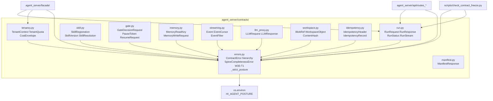
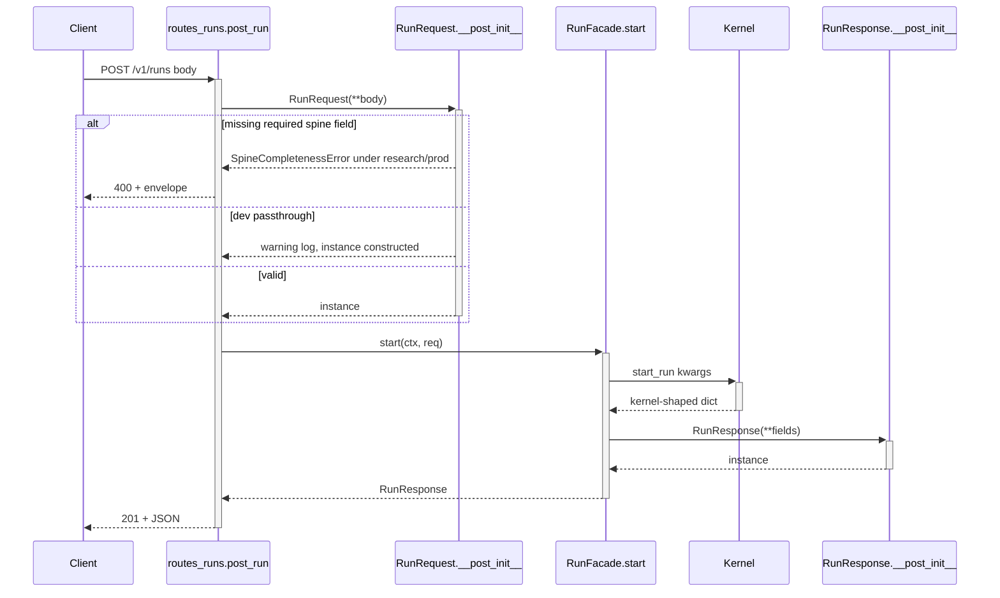

# agent_server/contracts — Architecture

> Last refreshed: W35 close (2026-05-05). HEAD `8bce5bc`. Contract digest re-snapshotted post-W35-T1.

---

## 1. Purpose / Responsibilities

`agent_server/contracts/` defines the **stable, versioned wire schemas** that the northbound
HTTP facade exposes to downstream consumers (RIA, third-party SDKs, business overlays).
Every dataclass is `@dataclass(frozen=True)` and JSON-serialisable; the package is the
single contract surface that survives platform refactors.

What this package owns:
- v1 dataclass definitions across run / tenancy / skill / gate / memory / streaming / llm /
  workspace / idempotency / manifest surfaces.
- The shared `ContractError` hierarchy and `SpineCompletenessError` (W35-T1).
- Posture-aware `__post_init__` validators that fail-close under research/prod when Rule 12
  spine fields are missing.

What this package does NOT own:
- Adaptation between contract types and kernel callables (`agent_server/facade/`).
- Persistence schema (`hi_agent/server/`).
- The contract freeze policy itself (lives in `scripts/check_contract_freeze.py` +
  `docs/governance/contract_v1_freeze.json`).
- Domain types (no `BiologyResult`, no `FinanceTransaction` — Rule 10).

---

## 2. Module Boundary (R-AS-1 + Rule 6 layering)

The contracts package is a leaf node — nothing else under `agent_server/` is allowed to
import from it the wrong way. Rules:

- It MUST NOT import from `agent_server.facade.*` or `agent_server.api.*`
  (`scripts/check_contracts_purity.py`).
- It MUST NOT import from `hi_agent.*`
  (R-AS-1, `scripts/check_layering.py`). W35-T1 honoured this by adding
  `agent_server/contracts/errors.py::_strict_posture()` which reads `HI_AGENT_POSTURE` via
  `os.environ` rather than calling `hi_agent.config.posture.Posture.from_env()`.
- It MAY import from `agent_server.contracts.*` (intra-package only) and the standard
  library.

Consumers:
- `agent_server/api/routes_*.py` — body parsing and response serialisation.
- `agent_server/facade/*.py` — adapts kernel dicts into contract dataclasses.
- `agent_server/bootstrap.py` — typed errors for posture decisions.
- `scripts/check_contract_freeze.py` — digests every file here.

---

## 3. Component Diagram

```mermaid
graph TD
    subgraph contracts[agent_server/contracts/]
        ERR[errors.py<br/>ContractError hierarchy<br/>SpineCompletenessError W35-T1<br/>_strict_posture]
        RUN[run.py<br/>RunRequest RunResponse<br/>RunStatus RunStream]
        TEN[tenancy.py<br/>TenantContext TenantQuota<br/>CostEnvelope]
        SKL[skill.py<br/>SkillRegistration<br/>SkillVersion SkillResolution]
        GAT[gate.py<br/>GateDecisionRequest<br/>PauseToken ResumeRequest]
        MEM[memory.py<br/>MemoryReadKey<br/>MemoryWriteRequest]
        STR[streaming.py<br/>Event EventCursor<br/>EventFilter]
        LLM[llm_proxy.py<br/>LLMRequest LLMResponse]
        WSP[workspace.py<br/>BlobRef WorkspaceObject<br/>ContentHash]
        IDM[idempotency.py<br/>IdempotencyHeader<br/>IdempotencyRecord]
        MAN[manifest.py<br/>ManifestResponse]
    end

    OS[os.environ<br/>HI_AGENT_POSTURE]
    FACADE[agent_server/facade/]
    ROUTES[agent_server/api/routes_*]
    FREEZE[scripts/check_contract_freeze.py]

    ERR --> OS
    RUN --> ERR
    TEN --> ERR
    SKL --> ERR
    GAT --> ERR
    MEM --> ERR
    STR --> ERR
    LLM --> ERR
    WSP --> ERR
    IDM --> ERR

    FACADE --> RUN
    FACADE --> TEN
    FACADE --> ERR
    ROUTES --> RUN
    ROUTES --> ERR
    FREEZE --> ERR
    FREEZE --> RUN
```

---

## 4. Data Flow / Sequence Diagram

A typical request payload validates from JSON to a contract dataclass at the route
boundary, traverses the facade and kernel as a kernel-shaped dict, and re-validates
outbound. W35-T1 added `__post_init__` spine validation so missing `tenant_id` fails at
construction under research/prod.

```mermaid
sequenceDiagram
    participant Client
    participant Route as routes_runs.post_run
    participant Contract as RunRequest.__post_init__
    participant Facade as RunFacade.start
    participant Kernel
    participant Resp as RunResponse.__post_init__

    Client->>+Route: POST /v1/runs body
    Route->>+Contract: RunRequest(**body)
    alt missing required spine field
        Contract-->>Route: SpineCompletenessError under research/prod
        Route-->>Client: 400 + envelope
    else dev passthrough
        Contract-->>Route: warning log, instance constructed
    else valid
        Contract-->>-Route: instance
    end
    Route->>+Facade: start(ctx, req)
    Facade->>+Kernel: start_run kwargs
    Kernel-->>-Facade: kernel-shaped dict
    Facade->>+Resp: RunResponse(**fields)
    Resp-->>-Facade: instance
    Facade-->>-Route: RunResponse
    Route-->>-Client: 201 + JSON
```

---

## 5. Key Contracts / Public API

### Run lifecycle (`run.py`)
- `RunRequest(tenant_id, profile_id, goal, project_id, run_id, idempotency_key, metadata)`
- `RunResponse(tenant_id, run_id, state, current_stage, started_at, finished_at, metadata)`
- `RunStatus(tenant_id, run_id, state, current_stage, llm_fallback_count, finished_at)`
- `RunStream(tenant_id, run_id, event_type, payload, sequence, created_at)`

### Tenancy (`tenancy.py`)
- `TenantContext(tenant_id, project_id, profile_id, session_id)`
- `TenantQuota(tenant_id, max_concurrent_runs, max_runs_per_minute, max_llm_cost_per_day_usd)`
- `CostEnvelope(tenant_id, window_start_iso, window_end_iso, llm_cost_usd, total_runs)`

### Errors (`errors.py`) — W35-T1 additions
- `ContractError(message, *, tenant_id, detail, http_status, error_category, retryable, next_action)`
- `AuthError(401)`, `QuotaError(429)`, `ConflictError(409)`, `NotFoundError(404)`, `RuntimeContractError(500)`
- `SpineCompletenessError(ValueError)` — raised by every spine-validating `__post_init__`
- `_strict_posture() -> bool` — reads `HI_AGENT_POSTURE` directly (R-AS-1 layered)

### Skill / Gate / Memory / Streaming / LLM / Workspace / Idempotency / Manifest
See §2 of root `agent_server/ARCHITECTURE.md` for the full route↔contract mapping.

**Invariant** (Rule 12 + W35-T1): every wire-crossing dataclass has `tenant_id` as the
first required field and a `__post_init__` that raises `SpineCompletenessError` when
missing under research/prod, warns under dev. The single exception is `ContentHash` in
`workspace.py`, marked `# scope: process-internal`.

---

## 6. Posture Behaviour (Rule 11)

| Posture | Missing `tenant_id` (or other Rule 12 spine field) at construction | Rationale |
|---|---|---|
| `dev` | `_LOGGER.warning("<class>_spine_incomplete: ...")`, instance constructed | Dev tooling and route-level unit tests keep working without tenant injection. |
| `research` | `raise SpineCompletenessError(...)` from `__post_init__` | Spine completeness is fail-closed (W35-T1). |
| `prod` | `raise SpineCompletenessError(...)` from `__post_init__` | Same as research. |

The check reads the env var on every call (`os.environ.get(...)`); tests that monkeypatch
`HI_AGENT_POSTURE` see the new value immediately. Reference implementation:
`hi_agent/contracts/reasoning.py::ReasoningTrace.__post_init__:65-100`. Mirror within
agent_server: `agent_server/contracts/workspace.py::BlobRef.__post_init__:34-52`.

---

## 7. Failure Modes (Rule 7 fallback inventory)

| Path | Countable | Attributable | Inspectable | Gate-asserted |
|---|---|---|---|---|
| `__post_init__` warns under dev when spine field empty | n/a (warn only) | `WARNING` log per class | run metadata not yet entered | `scripts/check_dataclass_spine_validation.py` |
| `ContractError.to_envelope` carries `tenant_id=""` when constructor omits it | n/a | route handler logs the path + category | error envelope serves to client | route integration tests assert envelope shape |
| `SpineCompletenessError` raised at construction time | typed exception (subclass `ValueError`) | exception traceback names class + missing fields | request fails fast with 400/500 | `tests/unit/test_w34_plus_spine_validation.py` |

Contracts themselves do not emit Prometheus metrics — observability cardinality lives in
`hi_agent/observability/`. The route handler emits the access log + category; the
middleware emits the spine event.

---

## 8. Resource Lifecycle (Rule 5)

Contracts hold no async resources. Every dataclass is a value type: `@dataclass(frozen=True)`
where the wire shape is immutable, plain `@dataclass` where `__post_init__` needs to mutate
default-factory fields. Concurrency safety is by construction.

`_strict_posture()` re-reads the env var on every call — no module-level caching, so
posture flips during a single test session work without restart.

---

## 9. Lineage / Spine Compliance (Rule 12)

| Module | Carries `tenant_id` | Spine validation |
|---|---|---|
| `run.py` (`RunRequest`, `RunResponse`, `RunStatus`, `RunStream`) | yes (first field) | W35-T1 `__post_init__` |
| `tenancy.py` (`TenantContext`, `TenantQuota`, `CostEnvelope`) | yes | W35-T1 |
| `skill.py` (`SkillRegistration`, `SkillVersion`, `SkillResolution`) | yes | W35-T1 |
| `gate.py` (`GateDecisionRequest`, `PauseToken`, …) | yes | W35-T1 |
| `memory.py` (`MemoryReadKey`, `MemoryWriteRequest`) | yes | W35-T1 |
| `streaming.py` (`Event`, `EventCursor`, `EventFilter`) | yes | W35-T1 |
| `llm_proxy.py` (`LLMRequest`, `LLMResponse`) | yes | W35-T1 |
| `workspace.py` (`BlobRef`, `WorkspaceObject`) | yes | W35-T1 |
| `idempotency.py` (`IdempotencyRecord`, `IdempotencyHeader`) | yes | W35-T1 |
| `errors.py::ContractError` and subclasses | yes (constructor kwarg) | identity attribution on errors |
| `workspace.py::ContentHash` | no | `# scope: process-internal` (pure value object) |

Enforcement: `scripts/check_contract_spine_completeness.py` scans every dataclass and
fails CI on a missing `tenant_id` field unless the file carries the
`# scope: process-internal` marker. `scripts/check_dataclass_spine_validation.py` (W35-T1
extension) further requires that every spine-bearing dataclass carries a `__post_init__`
or explicit annotation.

---

## 10. Test Layers (Rule 4)

| Layer | Path | What it asserts |
|---|---|---|
| L1 unit | `tests/unit/test_w34_plus_spine_validation.py` | Every spine-bearing dataclass raises under research/prod, warns under dev |
| L1 unit | `tests/unit/test_reasoning_trace_spine_validation.py` | Reference impl invariants (parity with agent_server contracts) |
| L1 unit | `tests/unit/test_agent_server_errors.py` | `ContractError` subclasses set `http_status` / `error_category` / `to_envelope` |
| L2 integration | `tests/integration/test_routes_*.py` | Request bodies missing spine fields receive 400 + envelope |
| L2 integration | `tests/integration/test_artifact_registry_empty_tenant_posture.py` | Posture-aware spine enforcement at the artifact boundary |
| L3 e2e | `tests/e2e/test_e2e_agent_server_*.py` | End-to-end client calls drive contract validation through the wire |

---

## 11. Open Roadmap Items (W36+)

- W36: shared `__post_init__` mixin so each spine-bearing class shrinks from ~10 LOC to a
  decorator. Tracked in `docs/governance/boot-time-assertions-roadmap.md`.
- W37+: `agent_server/contracts/v2/` sub-package authoring guide once a breaking change is
  approved. Currently only the v1 freeze is enforced.
- W37+: float-canonicalisation for idempotency body hashing
  (`agent_server/contracts/idempotency.py` Limitations section, W35-T5 deferred).
- See `docs/governance/retention-roadmap.md` for the broader storage/contract evolution
  plan.

---

## 12. References

Source files:
- `agent_server/contracts/__init__.py` (empty marker)
- `agent_server/contracts/errors.py` — `SpineCompletenessError`, `_strict_posture` (W35-T1)
- `agent_server/contracts/{run,tenancy,skill,gate,memory,streaming,llm_proxy,workspace,idempotency,manifest}.py`

Cross-references:
- Reference spine-validation impl: `hi_agent/contracts/reasoning.py:65-100`
- Routes: [`../api/ARCHITECTURE.md`](../api/ARCHITECTURE.md)
- Adapters: [`../runtime/ARCHITECTURE.md`](../runtime/ARCHITECTURE.md)
- Top-level facade: [`../ARCHITECTURE.md`](../ARCHITECTURE.md)
- Settings: [`../config/ARCHITECTURE.md`](../config/ARCHITECTURE.md)

Governance:
- `docs/governance/contract_v1_freeze.json` — re-snapshotted at W35-T1
- `docs/platform/agent-server-northbound-contract-v1.md`
- `docs/governance/boot-time-assertions-roadmap.md`
- `docs/governance/retention-roadmap.md`
- `docs/governance/closure-taxonomy.md`
- CLAUDE.md — Rule 11 (Posture), Rule 12 (Spine), Rule 17 (Allowlist Discipline), AS-CO track

Gates:
- `scripts/check_contract_freeze.py` (R-AS-3)
- `scripts/check_contracts_purity.py`
- `scripts/check_contract_spine_completeness.py` (Rule 12)
- `scripts/check_dataclass_spine_validation.py` (W35-T1)
- `scripts/check_layering.py` (R-AS-1)
