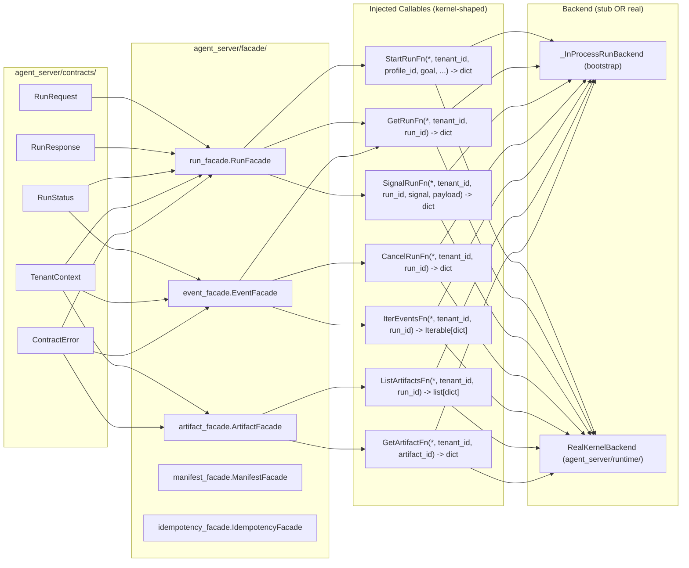
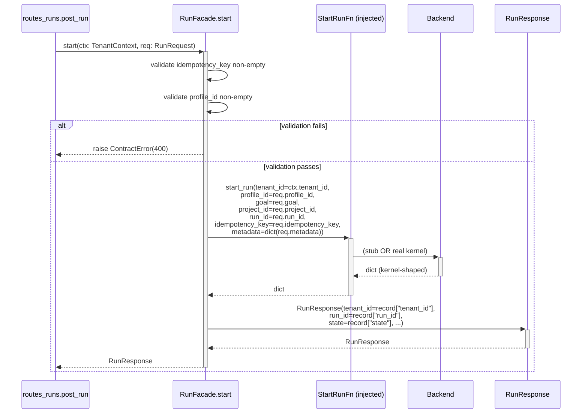

# agent_server/facade/ Architecture

---

## 1. Purpose & Position in System

`agent_server/facade/` is the **adaptation layer** between the FastAPI route handlers (`agent_server/api/`) and the kernel callables that perform real work. Each facade takes a `TenantContext` and a contract dataclass (or simple kwargs), validates contract-level invariants, calls a constructor-injected callable that knows nothing about HTTP, and returns a contract dataclass back to the route.

Two key design principles govern this layer:

1. **R-AS-1-aware seams.** Facade modules are *allowed* to import `hi_agent.*` types when the dependency is unavoidable, but only when annotated with the line-comment marker `# r-as-1-seam: <reason>`. Today only `idempotency_facade.py` (uses `IdempotencyStore`) and `artifact_facade.py` (uses `Posture`) carry the marker. The other facades (`run_facade.py`, `event_facade.py`, `manifest_facade.py`) reach the kernel exclusively through injected callables and stay seam-free.
2. **R-AS-8 LOC budget.** Every facade module must stay ≤200 LOC. This forces facades to remain *thin* — they validate, dispatch, and re-shape, nothing more. Business logic that cannot fit belongs in `hi_agent/`.

What this layer does NOT own:
- HTTP transport (`agent_server/api/`).
- Contract dataclass definitions (`agent_server/contracts/`).
- Run execution (`hi_agent/server/run_manager.py`).
- Persistence (`hi_agent/server/run_store.py`, `event_store.py`, `idempotency.py`).

---

## 2. External Interfaces

The facade layer exposes one class per surface, each constructed once at app-build time and passed by reference to the relevant `build_router` factory.

| Facade | Constructor | Methods |
|---|---|---|
| `RunFacade` | `start_run`, `get_run`, `signal_run` callables | `start(ctx, RunRequest) -> RunResponse`, `status(ctx, run_id) -> RunStatus`, `signal(ctx, run_id, signal, payload) -> RunStatus` |
| `EventFacade` | `cancel_run`, `get_run`, `iter_events` callables | `cancel(ctx, run_id) -> RunStatus`, `assert_run_visible(ctx, run_id) -> RunStatus`, `iter_events(ctx, run_id) -> Iterable[dict]` |
| `ArtifactFacade` | `list_artifacts`, `get_artifact`, optional `register_artifact` callables | `list_for_run(ctx, run_id) -> list[dict]`, `get(ctx, artifact_id) -> dict`, `register(ctx, ...) -> dict` |
| `ManifestFacade` | optional `capability_matrix_callable` | `manifest() -> dict` |
| `IdempotencyFacade` | `IdempotencyStore` (or `db_path`), `is_strict` flag | `reserve_or_replay(...)`, `mark_complete(...)`, `release(...)`, `close()` |

Callable type aliases are defined at the top of each facade module, e.g.:

```python
# run_facade.py
StartRunFn = Callable[..., dict[str, Any]]
GetRunFn = Callable[..., dict[str, Any]]
SignalRunFn = Callable[..., dict[str, Any]]
```

Constructor injection means the same facade class works against:
- `_InProcessRunBackend` stub (default-offline test profile)
- `RealKernelBackend` (W32 production path through `agent_server/runtime/`)
- A future remote-kernel adapter

The facade itself never changes when the backend changes.

---

## 3. Internal Components



| Module | Responsibility | Seam annotation |
|---|---|---|
| `run_facade.py` | Run lifecycle: start, status, signal | none — clean R-AS-1 |
| `event_facade.py` | Cancel + SSE event iteration; SSE frame rendering helper | none — clean R-AS-1 |
| `artifact_facade.py` | List/get/register artifacts; HD-4 orphan-record handling under strict posture | `# r-as-1-seam: posture is platform-wide config` |
| `manifest_facade.py` | Capability-matrix exposure with hardcoded fallback when Track D registry isn't bound | none — clean R-AS-1 |
| `idempotency_facade.py` | Tenant-scoped wrapper over `hi_agent.server.idempotency.IdempotencyStore` | `# r-as-1-seam: idempotency persistence is the documented hi_agent boundary` |

---

## 4. Data Flow

Representative `POST /v1/runs` flow showing facade-as-translation-layer:



Note the **shape conversion** at each layer:
- Route receives JSON, builds `RunRequest`.
- Facade translates `RunRequest` (contract type, immutable) → kwarg-only callable (kernel signature).
- Callable returns kernel-shaped `dict[str, Any]`.
- Facade translates `dict` → `RunResponse`.
- Route translates `RunResponse` → JSON.

The facade is the only layer where both shapes are observed.

---

## 5. State & Persistence

Facades hold **no per-request state**. The injected callables are bound once at construction time; they are referenced by attribute on the facade instance for the life of the app.

The single exception is `IdempotencyFacade`, which holds:
- `self._store` — an `IdempotencyStore` instance (SQLite-backed).
- `self._owns_store` — boolean indicating whether the facade should close the store on `aclose()`.
- `self._is_strict` — posture-derived flag controlling whether missing `Idempotency-Key` is a hard 400 or a dev warning.

`IdempotencyStore` lifetime:
- If the bootstrap supplied a pre-built store, the facade does NOT close it (the bootstrap owns the lifetime).
- If the facade was constructed with a `db_path`, the facade does close the store on `close()`.

This pattern (one optional resource, owned only when constructed inline) is the only stateful shape in the facade layer.

---

## 6. Concurrency & Lifecycle

Facade methods are **synchronous** and side-effect-free except for the underlying callable invocation. They safely run on FastAPI's threadpool.

The `EventFacade.iter_events` method returns an `Iterable[dict]` synchronously; the route handler wraps the iterable in an async generator (with `await asyncio.sleep(0)` between frames) so SSE backpressure cooperates with the event loop.

Lifecycle:
1. `agent_server.bootstrap.build_production_app` constructs each facade once, in order:
   - `IdempotencyStore` → `IdempotencyFacade(store=..., is_strict=posture.is_strict)`.
   - Backend (stub or real) → `RunFacade`, `EventFacade`, `ArtifactFacade`.
   - `ManifestFacade()` (no backend dependency at v1).
2. Each `build_router(...)` factory captures the facade by reference.
3. On shutdown, `IdempotencyFacade.close()` is called if it owns the store.

---

## 7. Error Handling & Observability

The contract is: every facade method either returns a contract dataclass or raises a `ContractError` (or subclass). It does NOT raise raw exceptions across the facade boundary.

The two exception flows:

| Source | Facade behavior | Route response |
|---|---|---|
| Validation failure (e.g., empty `idempotency_key`) | `raise ContractError(http_status=400, error_category=...)` | 400 with envelope |
| Kernel raises `NotFoundError` | propagates verbatim | 404 with envelope |
| Kernel raises any other `ContractError` | propagates verbatim | matches subclass status |
| Kernel raises non-`ContractError` exception | propagates as-is to FastAPI → 500 | 500 (uncaught) |

Observability emissions from the facade layer are **deferred to the kernel**. Facades log only on contract-level failures (validation errors, `ArtifactIntegrityError`). The HD-4 closure in `ArtifactFacade.list_for_run` silently skips orphan records under strict posture; the *kernel* is responsible for emitting the metric that surfaces orphan presence.

The `manifest_facade.py` is the one exception: when its injected `capability_matrix_callable` raises, it logs `WARNING+` ("manifest_facade: capability_matrix_callable failed, falling back to hardcoded matrix") and tags the response with `posture_matrix_provenance: "hardcoded"` so callers can see degradation.

---

## 8. Security Boundary

Tenant isolation is upheld at every facade method:

1. **First argument is `TenantContext`** for every public method except `ManifestFacade.manifest()` (tenant-agnostic at v1).
2. **`tenant_id` is the first kwarg** to every injected callable. Kernel callables that ignore `tenant_id` are caught by `scripts/check_route_tenant_context.py`.
3. **Cross-tenant access is structurally impossible** because facades never accept a tenant_id parameter independent of `TenantContext` — there is no method signature shaped like `start_run(tenant_id, run_id)`.
4. **Idempotency keys are tenant-scoped** in `IdempotencyFacade.reserve_or_replay`: `(tenant_id, key)` is the composite store key. Tenant A cannot replay tenant B's response.
5. **HD-4 orphan handling** in `ArtifactFacade`: under strict posture, records with empty stored `tenant_id` are filtered (`list_for_run`) or 404'd (`get`) — never surfaced as "owned by everyone."

R-AS-1 seam discipline: imports from `hi_agent.*` MUST carry the `# r-as-1-seam:` annotation with rationale. `scripts/check_facade_seams.py` parses every facade module and fails CI on an unannotated `hi_agent.*` import.

---

## 9. Extension Points

Adding a new facade:

1. Create `agent_server/facade/<surface>_facade.py` with a class taking required callables via constructor.
2. Define `Callable[..., ...]` type aliases for the injected callables at module top.
3. Stay ≤200 LOC (R-AS-8); split into helpers if necessary.
4. Add `# r-as-1-seam: <reason>` ONLY if a hi_agent import is unavoidable.
5. Update `agent_server/api/__init__.py::build_app` to accept the new facade and pass it to its router.
6. Wire it in `agent_server/bootstrap.py::build_production_app`.
7. Add unit tests under `tests/unit/test_<surface>_facade.py` (stub callables) and integration tests under `tests/integration/test_routes_<surface>.py` (real wiring through TestClient).

Adding a new method to an existing facade:
- The method MUST take `TenantContext` as the first argument.
- Validation MUST raise `ContractError` (or subclass) on invariant violations.
- Re-shape the kernel dict into a contract dataclass at the return boundary.

---

## 10. Constraints & Trade-offs

What this design assumes:
- Kernel callables return `dict[str, Any]`. A typed-protocol approach was rejected because it would force `hi_agent.*` imports into the facade module.
- The seven canonical callables (run, event, artifact, manifest, idempotency) cover v1's needs. New surfaces add new facades.
- The 200-LOC budget is enforceable. As of this writing the largest facade (`idempotency_facade.py`) is ~205 LOC — already at the limit. Future growth must extract helper modules.

What this design does NOT handle well:
- **Async-native callables.** All injected callables are sync; if a future backend needs async (e.g., a remote-kernel HTTP adapter), the facades will need a parallel `*Facade.aXxx` method or a sync-bridge. Today the kernel runs in-process so `RunManager` already exposes sync entry points.
- **Cross-facade orchestration.** A request that needs both `RunFacade.start` and `ArtifactFacade.register` lives in the route handler, not a "super-facade." This keeps each facade independently testable but pushes orchestration logic up.
- **Backpressure on `iter_events`.** The current `Iterable[dict]` is materialized in memory by some kernel implementations. Streaming requires a generator-based callable, which today only `_InProcessRunBackend` provides natively.

---

## 11. References

Per-facade source map and current backend wiring (W32):

| Facade | Source | Production backend | Stub backend (test profile) |
|---|---|---|---|
| `RunFacade` | `agent_server/facade/run_facade.py` | `RealKernelBackend.start_run` / `.get_run` / `.signal_run` (W32 Track A) | `_InProcessRunBackend` (`bootstrap.py:80`) |
| `EventFacade` | `agent_server/facade/event_facade.py` | `RealKernelBackend.cancel_run` / `.get_run` / `.iter_events` | `_InProcessRunBackend` |
| `ArtifactFacade` | `agent_server/facade/artifact_facade.py` | `RealKernelBackend.list_artifacts` / `.get_artifact` | `_InProcessRunBackend` |
| `ManifestFacade` | `agent_server/facade/manifest_facade.py` | hardcoded matrix; capability-registry binding tracked as Track D | hardcoded matrix |
| `IdempotencyFacade` | `agent_server/facade/idempotency_facade.py` | `hi_agent.server.idempotency.IdempotencyStore` (SQLite) | same `IdempotencyStore` (under `tmp_path` in tests) |

Related files:
- Public contracts: `agent_server/contracts/` (see `contracts/ARCHITECTURE.md`)
- Routes that consume these facades: `agent_server/api/` (see `api/ARCHITECTURE.md`)
- Bootstrap wiring: `agent_server/bootstrap.py`
- LOC gate: `scripts/check_facade_loc.py`
- Seam gate: `scripts/check_facade_seams.py`
- Layering gate: `scripts/check_layering.py`
- Unit tests: `tests/unit/test_*_facade.py`
- Integration tests: `tests/integration/test_routes_*.py`
