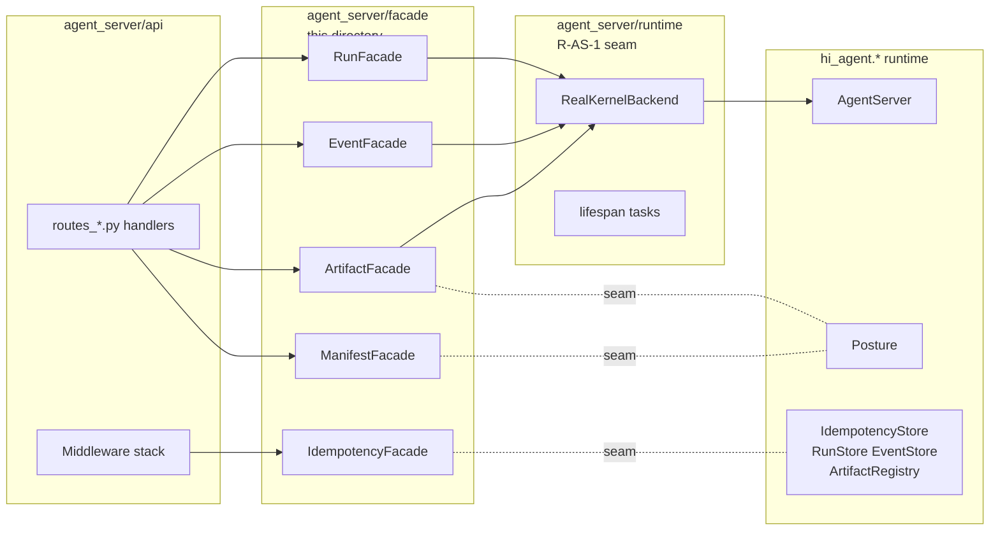
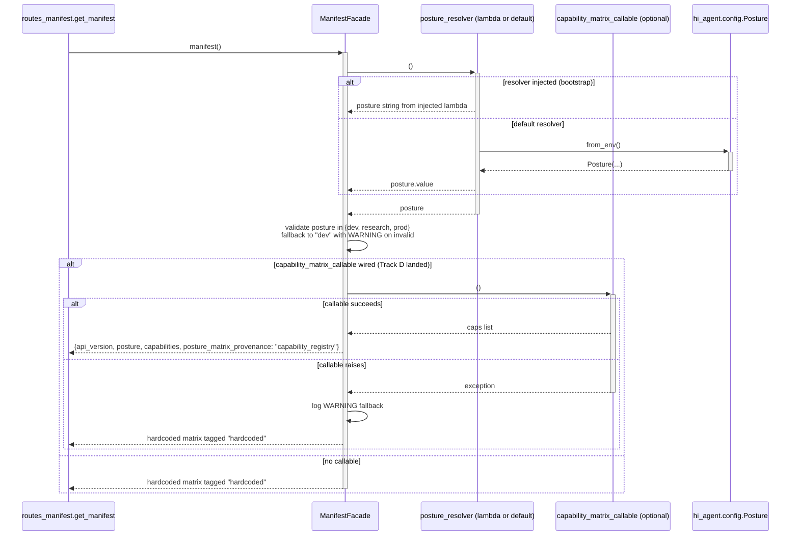
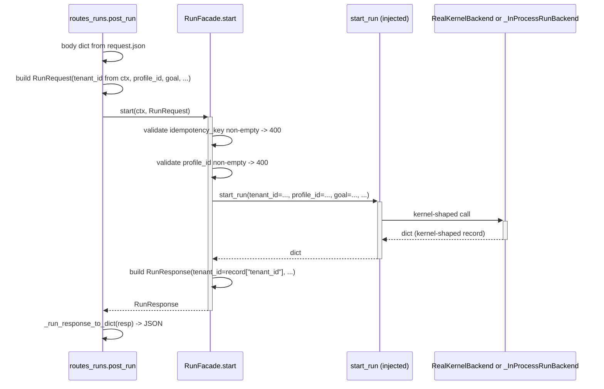

# agent_server/facade — Architecture

> **Last refreshed:** 2026-05-06 (W35 corrective close + W36 plans). HEAD `276917d8`.
> **Audience:** platform engineers + downstream consumers (RIA, future SDK builders).
> **Status:** authoritative.

---

## 1. Purpose & Responsibilities

`agent_server/facade/` is the **adaptation layer** between the FastAPI route handlers
(`agent_server/api/`) and the kernel callables that perform real work. Each facade
class:

- Takes a `TenantContext` (always first argument) and a contract dataclass (or simple
  kwargs).
- Validates contract-level invariants and raises `ContractError` (or subclass) on
  failure — never raw exceptions.
- Calls one or more **constructor-injected callables** that know nothing about HTTP.
- Returns a contract dataclass (or pure dict) that the route handler can serialise.

Two design principles govern every module here:

1. **R-AS-1 single-seam discipline.** Facade modules are *allowed* to import
   `hi_agent.*` types **only when** annotated with `# r-as-1-seam: <reason>`. Today
   only `idempotency_facade.py` (uses `IdempotencyStore`), `artifact_facade.py` (uses
   `Posture`), and `manifest_facade.py` (uses `Posture` inside `_default_posture_resolver`)
   carry the marker. The other facades (`run_facade.py`, `event_facade.py`) reach the
   kernel exclusively through injected callables and stay seam-free. Enforced by
   `scripts/check_facade_seams.py`.
2. **R-AS-8 LOC budget — every facade module ≤200 LOC.** This forces facades to
   remain *thin*: validate, dispatch, re-shape, nothing more. Business logic that
   cannot fit belongs in `hi_agent/`. Enforced by `scripts/check_facade_loc.py`.

What this layer does **not** own:

- HTTP transport (`agent_server/api/`).
- Contract dataclass definitions (`agent_server/contracts/`).
- Run execution (`hi_agent/server/run_manager.py`).
- Persistence (`hi_agent/server/run_store.py`, `event_store.py`, `idempotency.py`).
- Real-kernel construction (`agent_server/runtime/RealKernelBackend`).

---

## 2. Context & Scope


```mermaid
flowchart LR
    subgraph TRANSPORT[agent_server/api]
        ROUTES[routes_*.py handlers]
        MW[Middleware stack]
    end

    subgraph FACADE[agent_server/facade<br/>this directory]
        RF[RunFacade]
        EF[EventFacade]
        AF[ArtifactFacade]
        MF[ManifestFacade]
        IF[IdempotencyFacade]
    end

    subgraph RUNTIME[agent_server/runtime<br/>R-AS-1 seam]
        RKB[RealKernelBackend]
        LS[lifespan tasks]
    end

    subgraph KERNEL[hi_agent.* runtime]
        AS[AgentServer]
        STORES[IdempotencyStore<br/>RunStore EventStore<br/>ArtifactRegistry]
        POSTURE[Posture]
    end

    ROUTES --> RF
    ROUTES --> EF
    ROUTES --> AF
    ROUTES --> MF
    MW --> IF
    RF --> RKB
    EF --> RKB
    AF --> RKB
    AF -. seam .- POSTURE
    MF -. seam .- POSTURE
    IF -. seam .- STORES
    RKB --> AS
```

The facade layer sits between the api layer (which speaks HTTP) and the runtime layer
(which speaks kernel). Solid arrows are normal call paths; dashed arrows are the
annotated R-AS-1 seams that allow targeted `hi_agent.*` imports inside specific facade
modules.

---

## 3. Module Boundary & Dependencies

| Module | LOC | Imports `hi_agent.*`? | Annotation | Maturity |
|---|---|---|---|---|
| `__init__.py` | 1 | no | — | n/a |
| `run_facade.py` | 109 | no | clean R-AS-1 | L2 |
| `event_facade.py` | 104 | no | clean R-AS-1 | L2 |
| `artifact_facade.py` | 140 | yes — `Posture` | `# r-as-1-seam: posture is platform-wide config` (line 17) | L2 |
| `manifest_facade.py` | 183 | yes — `Posture` (function-local) | `# r-as-1-seam: posture is platform-wide config (W34-C / R-RIA-6)` (line 110) | L2 |
| `idempotency_facade.py` | 241 | yes — `IdempotencyStore` | `# r-as-1-seam: idempotency persistence is the documented hi_agent boundary` (line 27) | L2 |

**Note on the `idempotency_facade.py` LOC budget.** The module is 241 LOC, **above the
200 LOC R-AS-8 ceiling**. The W34+ T1d (key-length cap) and T1e (NFC normalisation)
additions pushed it past the budget. `scripts/check_facade_loc.py` carries an active
allowlist entry (`docs/governance/allowlists.yaml`); future growth must extract a
helper module rather than expand the facade further. (Cross-check needed with
governance — see Risks §9.)

`scripts/check_layering.py` enforces module boundary at the `agent_server/api/` level;
`scripts/check_facade_seams.py` enforces the per-facade `# r-as-1-seam:` annotation
discipline at this layer.

**Single construction path (Rule 6).** `agent_server/bootstrap.py::build_production_app`
constructs each facade exactly once. Tests construct facades directly from their stub
backends (`_InProcessRunBackend` for run/event/artifact; in-memory `IdempotencyStore`
for idempotency).

---

## 4. Building Blocks


```mermaid
flowchart TB
    subgraph CONTRACTS[agent_server/contracts]
        RR[RunRequest]
        RS[RunResponse]
        STAT[RunStatus]
        TC[TenantContext]
        ERR[ContractError + subclasses]
        GDR[GateDecisionRequest]
        SR[SkillRegistration]
        MWR[MemoryWriteRequest]
    end

    subgraph FACADES[agent_server/facade]
        RUNF[run_facade.RunFacade]
        EVTF[event_facade.EventFacade]
        ARTF[artifact_facade.ArtifactFacade]
        MANF[manifest_facade.ManifestFacade]
        IDEMF[idempotency_facade.IdempotencyFacade]
    end

    subgraph CALLABLES[Injected callables - kernel-shaped]
        SRF[StartRunFn tenant_id profile_id goal ... -> dict]
        GRF[GetRunFn tenant_id run_id -> dict]
        SGF[SignalRunFn tenant_id run_id signal payload -> dict]
        CRF[CancelRunFn tenant_id run_id -> dict]
        IEF[IterEventsFn tenant_id run_id -> Iterable dict]
        LAF[ListArtifactsFn tenant_id run_id -> list dict]
        GAF[GetArtifactFn tenant_id artifact_id -> dict]
        RAF[RegisterArtifactFn tenant_id run_id artifact_type content metadata -> str]
        CMF[CapabilityMatrixFn -> list dict]
        PR[PostureResolver -> str]
    end

    subgraph BACKEND[Backend - stub OR real]
        STUB[_InProcessRunBackend - bootstrap.py]
        REAL[RealKernelBackend - agent_server/runtime/]
        ISTORE[IdempotencyStore - hi_agent.server.idempotency]
    end

    RR --> RUNF
    RS --> RUNF
    STAT --> RUNF
    STAT --> EVTF
    TC --> RUNF
    TC --> EVTF
    TC --> ARTF
    ERR --> RUNF
    ERR --> EVTF
    ERR --> ARTF

    RUNF --> SRF --> STUB
    RUNF --> GRF --> STUB
    RUNF --> SGF --> STUB
    EVTF --> CRF --> STUB
    EVTF --> GRF
    EVTF --> IEF --> STUB
    ARTF --> LAF --> STUB
    ARTF --> GAF --> STUB
    ARTF --> RAF --> STUB
    MANF --> CMF
    MANF --> PR

    SRF --> REAL
    GRF --> REAL
    SGF --> REAL
    CRF --> REAL
    IEF --> REAL
    LAF --> REAL
    GAF --> REAL
    RAF --> REAL

    IDEMF --> ISTORE
```

### Per-facade responsibilities

| Facade | Constructor (named-only) | Public methods |
|---|---|---|
| `RunFacade` (`run_facade.py:28`) | `start_run`, `get_run`, `signal_run` callables | `start(ctx, RunRequest) -> RunResponse`<br/>`status(ctx, run_id) -> RunStatus`<br/>`signal(ctx, run_id, signal, payload) -> RunStatus` |
| `EventFacade` (`event_facade.py:24`) | `cancel_run`, `get_run`, `iter_events` callables | `cancel(ctx, run_id) -> RunStatus`<br/>`assert_run_visible(ctx, run_id) -> RunStatus`<br/>`iter_events(ctx, run_id) -> Iterable[dict]` |
| `ArtifactFacade` (`artifact_facade.py:40`) | `list_artifacts`, `get_artifact`, optional `register_artifact` callables | `list_for_run(ctx, run_id) -> list[dict]`<br/>`get(ctx, artifact_id) -> dict`<br/>`register(ctx, run_id, artifact_type, content, metadata) -> dict` |
| `ManifestFacade` (`manifest_facade.py:116`) | optional `capability_matrix_callable`, optional `posture_resolver` | `manifest() -> dict` |
| `IdempotencyFacade` (`idempotency_facade.py:87`) | `store=` OR `db_path=`; `is_strict: bool` | `reserve_or_replay(tenant_id, key, body) -> (outcome, body or None, status)`<br/>`mark_complete(tenant_id, key, response_json, status_code)`<br/>`release(tenant_id, key)`<br/>`close()`<br/>property `is_strict` |

Callable type aliases are declared at the top of each facade module, e.g.:

```python
# run_facade.py
StartRunFn = Callable[..., dict[str, Any]]
GetRunFn = Callable[..., dict[str, Any]]
SignalRunFn = Callable[..., dict[str, Any]]
```

Constructor injection means the same facade class works against:

- `_InProcessRunBackend` (default-offline test profile, `bootstrap.py:119`).
- `RealKernelBackend` (W32-A production path through `agent_server/runtime/`).
- A future remote-kernel adapter — the facade itself never changes when the backend
  changes.

### Special shapes

- **`ArtifactFacade`** — under research/prod (`Posture.from_env().is_strict`), it
  filters orphan records (empty stored `tenant_id`) from `list_for_run` and 404s them
  in `get` (HD-4 closure). Also calls `_verify_integrity` on `get` to detect
  content-hash mismatches and raises `ArtifactIntegrityError` (HTTP 409).
- **`ManifestFacade`** — when `capability_matrix_callable` is `None` (Track D not
  bound), returns the hardcoded matrix tagged with
  `posture_matrix_provenance: "hardcoded"`. When the callable raises, logs WARNING
  and falls back to the same hardcoded matrix. Posture string carried in the response
  body (`posture: "dev"|"research"|"prod"`) for RIA R-RIA-6 enforcement (W34-C).
- **`IdempotencyFacade`** — wraps `hi_agent.server.idempotency.IdempotencyStore`;
  hashes canonical sorted-key JSON bodies after Unicode NFC normalisation (W34+ T1e);
  strips identity metadata (`request_id`, `trace_id`, `_response_timestamp`) before
  persisting response snapshots so replays don't leak prior request IDs (HD-7).

---

## 5. Runtime View — Key Scenarios

### 5.1 `IdempotencyFacade.reserve_or_replay` — middleware-driven

```mermaid
sequenceDiagram
    participant MW as IdempotencyMiddleware
    participant IF as IdempotencyFacade
    participant Store as IdempotencyStore (SQLite)

    MW->>+IF: reserve_or_replay(tenant_id, key, body)
    Note over IF: validate tenant_id non-empty<br/>validate key non-empty
    IF->>IF: _nfc_normalize(body) recursively
    IF->>IF: _canonical_body_hash = sha256(json.dumps sort_keys NFC body)
    IF->>+Store: reserve_or_replay(tenant_id, key, request_hash, run_id="reserved::key")
    Store-->>-IF: ("created"|"replayed"|"conflict", record)
    alt created
        IF-->>MW: ("created", None, 0)
        Note over MW: forward to handler; on success<br/>middleware calls mark_complete
    else replayed
        IF->>IF: _decode_snapshot(record.response_snapshot)
        Note right of IF: returns (body_dict, status_code)<br/>or pending sentinel if snapshot empty
        IF-->>MW: ("replayed", body_dict, status_code)
    else conflict
        IF-->>-MW: ("conflict", None, 409)
    end

    Note over MW: handler runs, returns 2xx
    MW->>+IF: mark_complete(tenant_id, key, response_json, status_code)
    IF->>IF: _strip_identity removes request_id trace_id timestamp (HD-7)
    IF->>+Store: mark_complete(tenant_id, idempotency_key, snapshot_json)
    Store-->>-IF: -
    IF-->>-MW: -
```

Contract guarantees:

- Same `(tenant_id, key, body)` → byte-identical replay including `status_code`.
- Same `(tenant_id, key)` with different body → 409 conflict.
- Different tenants with the same key → independent slots — no cross-tenant
  collision possible because the composite key is `(tenant_id, key)`.
- 5xx response on first call → middleware calls `release(tenant_id, key)` so a retry
  can re-attempt rather than collide forever with the abandoned reservation.

### 5.2 `ManifestFacade.manifest` — cached read with posture and matrix fallback


```mermaid
sequenceDiagram
    participant Route as routes_manifest.get_manifest
    participant MF as ManifestFacade
    participant PR as posture_resolver (lambda or default)
    participant CMF as capability_matrix_callable (optional)
    participant Posture as hi_agent.config.Posture

    Route->>+MF: manifest()
    MF->>+PR: ()
    alt resolver injected (bootstrap)
        PR-->>MF: posture string from injected lambda
    else default resolver
        PR->>+Posture: from_env()
        Posture-->>-PR: Posture(...)
        PR-->>MF: posture.value
    end
    PR-->>-MF: posture
    MF->>MF: validate posture in {dev, research, prod}<br/>fallback to "dev" with WARNING on invalid
    alt capability_matrix_callable wired (Track D landed)
        MF->>+CMF: ()
        alt callable succeeds
            CMF-->>MF: caps list
            MF-->>Route: {api_version, posture, capabilities, posture_matrix_provenance: "capability_registry"}
        else callable raises
            CMF-->>-MF: exception
            MF->>MF: log WARNING fallback
            MF-->>Route: hardcoded matrix tagged "hardcoded"
        end
    else no callable
        MF-->>-Route: hardcoded matrix tagged "hardcoded"
    end
```

The bootstrap binds `posture_resolver=lambda: posture.value` so the resolved posture
is captured at app-build time rather than re-read from env on every request
(`bootstrap.py:321`). The default `_default_posture_resolver` (used when no resolver
injected) carries the in-function `# r-as-1-seam:` annotation
(`manifest_facade.py:110`) — the only seam in the module.

### 5.3 Shape conversion at the facade boundary (`POST /v1/runs`)


```mermaid
sequenceDiagram
    participant Route as routes_runs.post_run
    participant Facade as RunFacade.start
    participant Callable as start_run (injected)
    participant Backend as RealKernelBackend or _InProcessRunBackend

    Route->>Route: body dict from request.json
    Route->>Route: build RunRequest(tenant_id from ctx, profile_id, goal, ...)
    Route->>+Facade: start(ctx, RunRequest)
    Facade->>Facade: validate idempotency_key non-empty -> 400
    Facade->>Facade: validate profile_id non-empty -> 400
    Facade->>+Callable: start_run(tenant_id=..., profile_id=..., goal=..., ...)
    Callable->>+Backend: kernel-shaped call
    Backend-->>-Callable: dict (kernel-shaped record)
    Callable-->>-Facade: dict
    Facade->>Facade: build RunResponse(tenant_id=record["tenant_id"], ...)
    Facade-->>-Route: RunResponse
    Route->>Route: _run_response_to_dict(resp) -> JSON
```

The facade is the **only layer where both shapes are observed** — kernel `dict[str, Any]`
on one side, immutable contract dataclass on the other. Routes never see kernel dicts;
backends never see contract types.

---

## 6. Cross-cutting Concerns

### 6.1 State & persistence

Facades hold **no per-request state**. The injected callables are bound once at
construction time; they are referenced by attribute on the facade instance for the
life of the app.

The single exception is `IdempotencyFacade`, which holds:

- `self._store` — an `IdempotencyStore` instance (SQLite-backed under
  `state_dir/idempotency.db`).
- `self._owns_store` — bool indicating whether the facade should close the store.
- `self._is_strict` — posture-derived flag controlling whether a missing
  `Idempotency-Key` is a 400 (research/prod) or a dev warning.

**`IdempotencyStore` lifetime.** If the bootstrap supplied a pre-built store, the
facade does **not** close it (the bootstrap owns the lifetime). If the facade was
constructed with `db_path`, the facade closes the store on `close()`. The W35-T4
purge loop runs in `agent_server/runtime/lifespan.py::_idempotency_purge_loop` and
reads the store via `RealKernelBackend._idempotency_store` (stamped at
`bootstrap.py:286`).

### 6.2 Concurrency & lifecycle

Facade methods are **synchronous** and side-effect-free except for the underlying
callable invocation. They safely run on FastAPI's threadpool when called from a sync
context, or directly inline when called from async route handlers (Python doesn't care
about colour at that boundary because the calls are non-blocking dict shuffles).

The `EventFacade.iter_events` method returns an `Iterable[dict]` synchronously; the
route handler wraps it in an async generator (with `await asyncio.sleep(0)` between
frames) so SSE backpressure cooperates with the event loop.

**Construction order in `bootstrap.py`** (verified at HEAD `276917d8`):

1. `IdempotencyStore` → `IdempotencyFacade(store=..., is_strict=posture.is_strict)`
   (lines 262–265).
2. Backend resolution (`_resolve_backend_kind` — real default; stub allowed only
   under dev) (lines 275–316).
3. `RunFacade`, `EventFacade`, `ArtifactFacade` bound to the chosen backend's
   callables.
4. `ManifestFacade(posture_resolver=lambda: posture.value)` (line 321).
5. Lifespan bound to `build_real_kernel_lifespan(real_backend)` (lines 327–331) —
   only when real backend is selected.
6. `build_app(...)` called once with all five facades (lines 333–347).

On shutdown, `IdempotencyFacade.close()` is invoked iff it owns the store — the
production bootstrap path always passes `store=...`, so the facade does **not** close
the store; lifespan teardown handles it.

### 6.3 Error handling & observability (Rule 7)

The contract: every facade method either returns a contract dataclass / dict, or
raises a `ContractError` (or subclass). Raw exceptions are not crossed across the
facade boundary except through the kernel callable's error path (which the facade
allows to bubble unchanged for `NotFoundError` and other documented `ContractError`
subclasses).

| Source | Facade behavior | Route response |
|---|---|---|
| Validation failure (e.g., empty `idempotency_key`) | `raise ContractError(http_status=400, ...)` | 400 + envelope |
| Kernel raises `NotFoundError` | propagates verbatim | 404 + envelope |
| Kernel raises any other `ContractError` subclass | propagates verbatim | matches subclass `http_status` |
| Kernel raises non-`ContractError` exception | propagates as-is to FastAPI | 500 (uncaught) |
| `IdempotencyStore` raises | propagates; middleware translates | per middleware contract |
| `ArtifactFacade` content-hash mismatch | `raise ArtifactIntegrityError(http_status=409)` | 409 + envelope |
| `ManifestFacade.posture_resolver` raises or returns invalid | log WARNING, fall back to `"dev"` | 200 with `posture: "dev"` |
| `ManifestFacade.capability_matrix_callable` raises | log WARNING, fall back to hardcoded matrix | 200 with `posture_matrix_provenance: "hardcoded"` |

Observability emissions from this layer are mostly **deferred to the kernel**.
Facades log at `WARNING+` only on contract-level failures and on the two
`ManifestFacade` fallbacks (degraded but still serving). The HD-4 orphan filtering in
`ArtifactFacade.list_for_run` silently skips records under strict posture; the
**kernel** is responsible for the metric that surfaces orphan presence (the spec for
that counter is tracked in the broader observability backlog).

### 6.4 Security boundary

Tenant isolation is upheld at every facade method:

1. **First argument is `TenantContext`** for every public method except
   `ManifestFacade.manifest()` (tenant-agnostic at v1).
2. **`tenant_id` is the first kwarg** to every injected callable (`tenant_id=ctx.tenant_id`
   in every facade body). Kernel callables that ignore `tenant_id` are caught by
   `scripts/check_route_tenant_context.py` at the route layer.
3. **Cross-tenant access is structurally impossible** because facades never accept a
   `tenant_id` parameter independent of `TenantContext` — there is no method
   signature shaped like `start_run(tenant_id, run_id)`.
4. **Idempotency keys are tenant-scoped** in `IdempotencyFacade.reserve_or_replay`:
   `(tenant_id, key)` is the composite store key (`idempotency_facade.py:157–166`).
   Tenant A cannot replay tenant B's response.
5. **HD-4 orphan handling** in `ArtifactFacade`: under strict posture, records with
   empty stored `tenant_id` are filtered (`list_for_run`) or 404'd (`get`) — never
   surfaced as "owned by everyone."
6. **HD-7 identity strip** in `IdempotencyFacade.mark_complete`: `request_id`,
   `trace_id`, `_response_timestamp` are removed from the persisted snapshot so a
   replay does not leak the original request's tracing fields.

R-AS-1 seam discipline: imports from `hi_agent.*` MUST carry the `# r-as-1-seam:`
annotation with rationale; `scripts/check_facade_seams.py` parses every facade module
and fails CI on an unannotated `hi_agent.*` import.

---

## 7. Architecture Decisions

| ID | Decision | Pointer |
|---|---|---|
| **R-AS-1** | Single seam — only annotated `# r-as-1-seam:` lines may import `hi_agent.*` from facade modules | CLAUDE.md → AS-RO; `scripts/check_facade_seams.py` |
| **R-AS-8** | Every facade module ≤200 LOC | CLAUDE.md → AS-RO; `scripts/check_facade_loc.py` |
| **W23-F** | Constructor-injected callables instead of typed protocols — keeps facade module surface free of `hi_agent.*` typing | `run_facade.py:23–25` |
| **W24 I-D** | `IdempotencyFacade` is the sole tenant-scoped wrapper over `IdempotencyStore`; middleware imports facade only | `idempotency_facade.py:87`, `middleware/idempotency.py:36` |
| **W24 I-B / HD-4** | Orphan artifact records filtered under strict posture | `artifact_facade.py:62–67`, `78–84` |
| **W24 J-7 / HD-7** | Persisted idempotency snapshots strip identity metadata before storage | `idempotency_facade.py:34–38`, `81–84`, `190–201` |
| **W34+ T1d** | `Idempotency-Key` length capped to 256 chars at the middleware layer (cross-references this facade's hash semantics) | `middleware/idempotency.py:45` |
| **W34+ T1e** | Body hashing applies Unicode NFC normalisation before serialisation | `idempotency_facade.py:41–63`, `66–78` |
| **W34-C / R-RIA-6** | `ManifestFacade` carries the resolved posture in its response so RIA can refuse to start under prod against a dev platform | `manifest_facade.py:116–180`, `bootstrap.py:321` |
| **W31-N N.4** | `IdempotencyFacade.is_strict` exposed as a property; route handlers and middleware read posture from the facade rather than env | `idempotency_facade.py:124–129`, `routes_skills_memory.py:80–83` |
| **W32-A** | Real-kernel binding via `agent_server/runtime/RealKernelBackend`; bootstrap stamps `_idempotency_store` onto backend so the lifespan purge loop can reach it without touching FastAPI app.state | `bootstrap.py:286` |
| **W35-T4** | Idempotency purge loop runs on the FastAPI lifespan; facade unchanged but lifecycle observable end-to-end | `runtime/lifespan.py::_idempotency_purge_loop` |

---

## 8. Quality Attributes

- **Tenant isolation.** Mandatory `TenantContext` argument; tenant-scoped composite
  store keys; HD-4 strict filtering.
- **Replay safety.** SHA-256 over canonical NFC-normalised JSON; identity-metadata
  strip; tenant-scoped reservation; deterministic decode of stored snapshots.
- **Module discipline.** Five facades, four within budget, one (`idempotency_facade.py`
  at 241 LOC) on allowlist with a documented rationale; six clean R-AS-1 modules
  total when counting `__init__.py` and the seam-free run/event facades.
- **Backend agnosticism.** Constructor injection means the same facade class works
  against the in-process stub (default-offline tests), the real kernel (W32-A
  production), or any future adapter. The backend swap touches `bootstrap.py` only.
- **Observable degradation.** `ManifestFacade` tags its response with
  `posture_matrix_provenance: "capability_registry" | "hardcoded"` so callers see
  whether the matrix came from Track D registry or the hardcoded fallback.

### Test layers (Rule 4)

- L1 unit: `tests/unit/test_run_facade.py`, `test_event_facade.py`,
  `test_artifact_facade.py`, `test_manifest_facade.py`, `test_idempotency_facade.py`
  — each facade exercised against stub callables; HD-4 strict-posture filtering, HD-7
  identity strip, NFC normalisation tested in isolation.
- L2 integration: `tests/integration/test_routes_*.py` — facades wired into
  TestClient against `_InProcessRunBackend`.
- L2 integration (W35-T6): `tests/integration/test_idempotency_metrics.py` — middleware
  emits Prometheus counters on every facade `reserve_or_replay`.
- L2 integration (W35-T4): `tests/integration/test_idempotency_ttl_purge.py` — purge
  loop drives expired-record cleanup via the facade.
- L3 e2e: `tests/e2e/test_e2e_agent_server_*.py` — full HTTP path through facades to
  real kernel.

### CI gates

- `scripts/check_facade_seams.py` — every `hi_agent.*` import has a `# r-as-1-seam:`
  annotation.
- `scripts/check_facade_loc.py` — module ≤200 LOC; allowlist entries tracked in
  `docs/governance/allowlists.yaml` (R-Rule 17 discipline).
- `scripts/check_layering.py` — applied at api layer; ensures facade is the only
  bridge.

---

## 9. Risks & Technical Debt

- **`idempotency_facade.py` at 241 LOC, over the 200-LOC R-AS-8 budget.** The W34+
  T1d/T1e additions plus the docstring discipline pushed it past. The right next
  move is to extract `_canonical_body_hash` + `_strip_identity` + `_decode_snapshot`
  into a sibling helper module (`idempotency_internals.py`). Tracked as a Rule 17
  allowlist entry in `docs/governance/allowlists.yaml` — to-confirm the entry exists
  with the expected `expiry_wave`.
- **`ManifestFacade` at 183 LOC** is approaching the budget; once Track D
  (CapabilityRegistry-backed matrix) lands, the hardcoded matrix can move to a
  separate fixture module to free space.
- **Cross-facade orchestration not modelled here.** A request needing both
  `RunFacade.start` and `ArtifactFacade.register` must compose them in the route
  handler, not via a "super-facade." This keeps each facade independently testable
  but pushes orchestration logic up a layer; documented for future consumers who
  might be tempted to add facade-to-facade calls (forbidden — would break R-AS-8 and
  blur ownership).
- **Async-native callables not yet supported.** All injected callables are sync. A
  future remote-kernel HTTP adapter would need a parallel `aXxx` method or a
  sync-bridge through `hi_agent.runtime.sync_bridge` (Rule 5). Today the kernel runs
  in-process so `RunManager` already exposes sync entry points, hiding the question.
- **`iter_events` materialisation.** The current `Iterable[dict]` is materialised in
  memory by some kernel implementations. True streaming requires a generator-based
  callable; today only `_InProcessRunBackend` provides one natively. `RealKernelBackend`
  may need a follow-up to thread an async generator through the seam.
- **W36-B13 (planned).** `ManifestFacade`, `ArtifactFacade`, `EventFacade` are silent
  optional facades in `build_app` today; under research/prod posture the bootstrap
  must wire all three. B13 (W36-A5) raises at `build_app` entry rather than at first
  request; closure cross-coordinates with RIA G-RIA-13.
- **Posture re-resolution under env mutation.** `ArtifactFacade` reads
  `Posture.from_env().is_strict` on every `list_for_run` / `get` call (lines 61, 77).
  This is intentionally late-binding so an env change is observed without restart,
  but it does cost a `os.environ` read per call. If a benchmark surfaces this as
  hot-path noise, the facade can capture posture at construction time the same way
  `ManifestFacade` does — to-confirm with downstream perf measurement.

---

## 10. References

### Source

- `agent_server/facade/__init__.py` — empty package marker.
- `agent_server/facade/run_facade.py:28` — `RunFacade`.
- `agent_server/facade/event_facade.py:24` — `EventFacade`; `:77` — `render_sse_chunk`.
- `agent_server/facade/artifact_facade.py:40` — `ArtifactFacade`; `:30` —
  `ArtifactIntegrityError`.
- `agent_server/facade/manifest_facade.py:116` — `ManifestFacade`; `:43–98` —
  `_HARDCODED_MATRIX`.
- `agent_server/facade/idempotency_facade.py:87` — `IdempotencyFacade`; `:66–78` —
  `_canonical_body_hash`; `:81–84` — `_strip_identity`.

### Production wiring

| Facade | Production backend | Stub backend (default-offline) |
|---|---|---|
| `RunFacade` | `RealKernelBackend.start_run` / `.get_run` / `.signal_run` (W32-A) | `_InProcessRunBackend` (`bootstrap.py:119`) |
| `EventFacade` | `RealKernelBackend.cancel_run` / `.get_run` / `.iter_events` | `_InProcessRunBackend` |
| `ArtifactFacade` | `RealKernelBackend.list_artifacts` / `.get_artifact` | `_InProcessRunBackend` |
| `ManifestFacade` | hardcoded matrix; capability-registry binding tracked as Track D | hardcoded matrix |
| `IdempotencyFacade` | `hi_agent.server.idempotency.IdempotencyStore` (SQLite under `state_dir/idempotency.db`) | same `IdempotencyStore` (under `tmp_path` in tests) |

### Sibling subsystems

- [`../api/ARCHITECTURE.md`](../api/ARCHITECTURE.md) — HTTP transport and
  middleware that consume these facades.
- [`../runtime/ARCHITECTURE.md`](../runtime/ARCHITECTURE.md) — `RealKernelBackend`
  and lifespan tasks.
- [`../contracts/ARCHITECTURE.md`](../contracts/ARCHITECTURE.md) — frozen v1
  schemas returned by these facades.
- [`../config/ARCHITECTURE.md`](../config/ARCHITECTURE.md) — settings and version
  constants.

### Wave references

- W35-T4 lifecycle wiring: `agent_server/runtime/lifespan.py::_idempotency_purge_loop`.
- W35-T8 boot-time assertion (touches both this layer and api): `agent_server/api/__init__.py:138–156`.
- W36-A5 boot-time assertions plan: `docs/superpowers/plans/2026-05-06-wave-36-a5-boot-time-assertions.md`.

### Governance

- CLAUDE.md → AS-RO ownership track; R-AS-1, R-AS-8 narrow-trigger rules.
- CLAUDE.md → Rule 6 (single construction), Rule 7 (resilience), Rule 11 (posture),
  Rule 12 (spine), Rule 17 (allowlists).
- `docs/governance/allowlists.yaml` — `idempotency_facade.py` LOC allowlist (to-confirm).
- `docs/platform/agent-server-northbound-contract-v1.md` — frozen contract.
