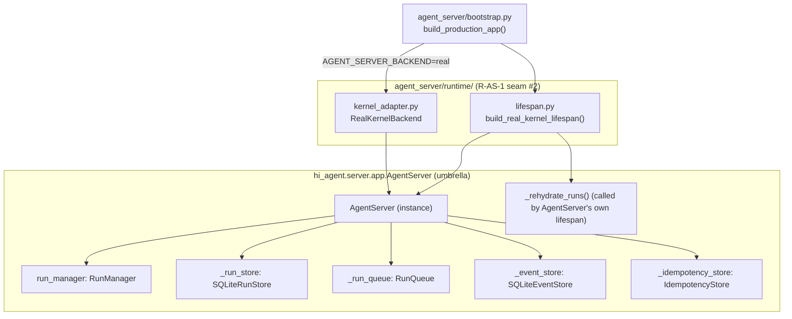
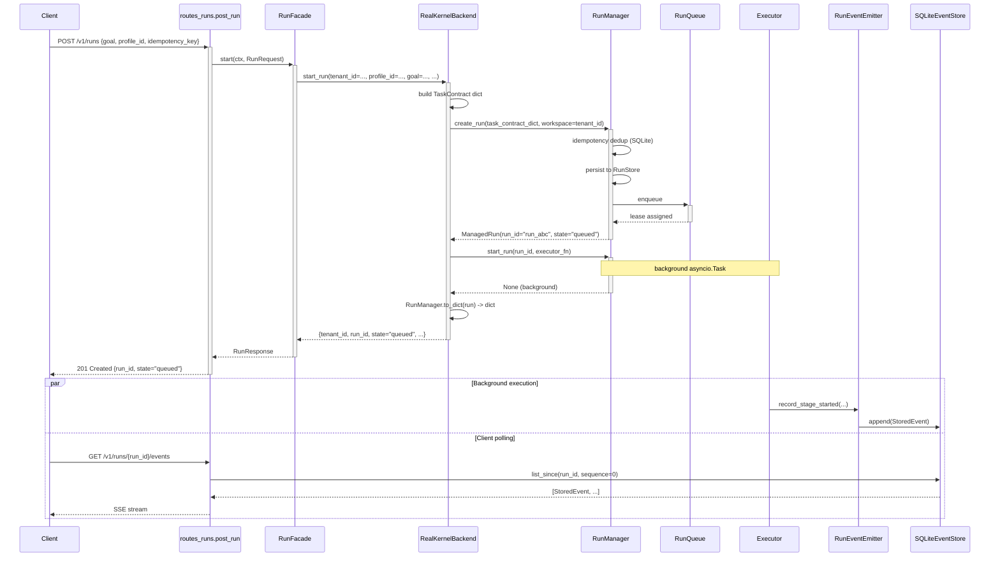
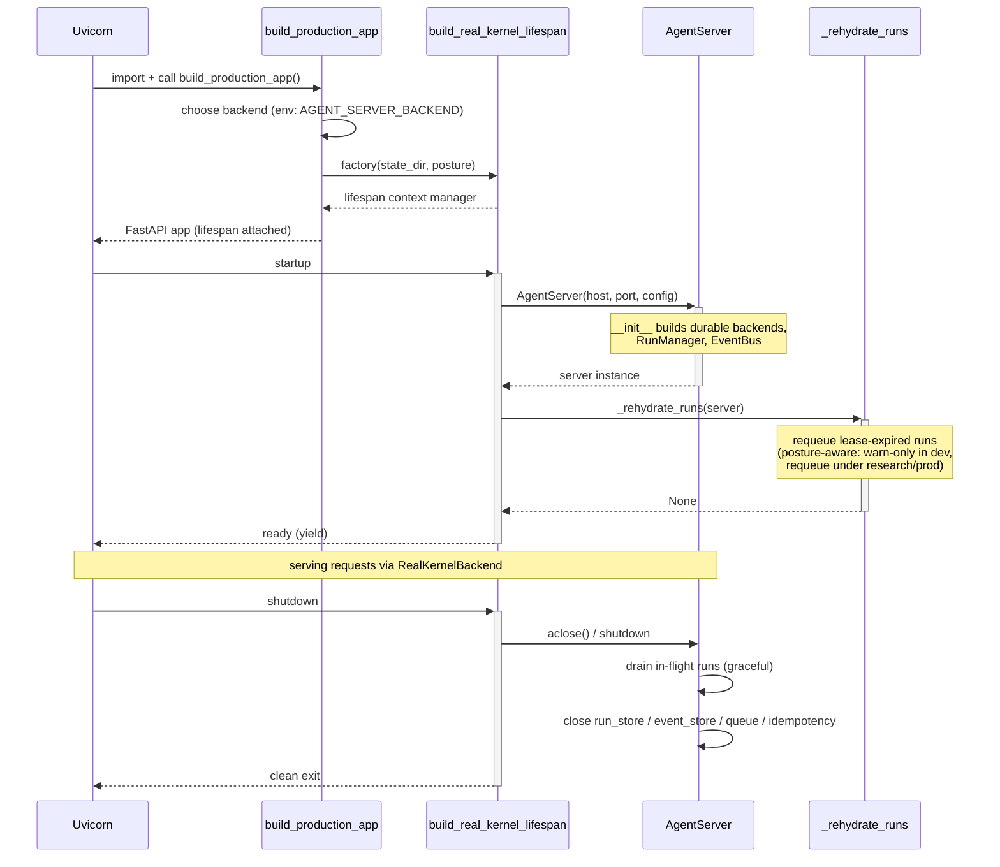

# agent_server/runtime/ Architecture

> **Status:** Sub-package created in W32 Track A. Document captures the intended state. The `kernel_adapter.py` and `lifespan.py` modules referenced below land in W32 Track A; the sibling tracks F1 (this doc), B (hidden-gap closure), and C (chaos provenance) run in parallel.

---

## 1. Purpose & Position in System

`agent_server/runtime/` is the **second R-AS-1 seam** under `agent_server/`, paired with `bootstrap.py`. Its single responsibility is to bind the contract-shaped facade callables (defined in `agent_server/facade/`) to a live `hi_agent.server.app.AgentServer` instance whose `run_manager`, `event_store`, `run_store`, and `idempotency_store` are durable SQLite-backed.

Before W32, `agent_server/bootstrap.py::_InProcessRunBackend` returned `state="queued"` without ever executing the run — this satisfied the route-level test profile but was a "fake" northbound idempotency claim under research/prod. W32 Track A replaces that stub with `RealKernelBackend` from this sub-package.

What it does NOT own:
- HTTP transport (`agent_server/api/`).
- Contract-shape adaptation (`agent_server/facade/`).
- Run execution itself (`hi_agent/server/run_manager.py`, `hi_agent/runner.py`).
- Durable persistence schema (`hi_agent/server/run_store.py`, `hi_agent/server/event_store.py`).

It is a **thin adapter**: every method returns a contract-shaped dict identical in shape to the kernel's, so the facade layer needs no change.

---

## 2. External Interfaces

The runtime sub-package exposes exactly two public symbols:

| Symbol | Type | Purpose |
|---|---|---|
| `RealKernelBackend` | class | Wraps an `AgentServer` instance; exposes the seven callables `start_run` / `get_run` / `signal_run` / `cancel_run` / `iter_events` / `list_artifacts` / `get_artifact` |
| `build_real_kernel_lifespan` | function | FastAPI lifespan handler factory; constructs `AgentServer` on startup, drains and closes on shutdown |

Callable signatures (all keyword-only, returning `dict[str, Any]` modeled on the existing facade contract):

```python
backend.start_run(*, tenant_id, profile_id, goal, project_id, run_id, idempotency_key, metadata) -> dict
backend.get_run(*, tenant_id, run_id) -> dict
backend.signal_run(*, tenant_id, run_id, signal, payload) -> dict
backend.cancel_run(*, tenant_id, run_id) -> dict
backend.iter_events(*, tenant_id, run_id) -> Iterable[dict]
backend.list_artifacts(*, tenant_id, run_id) -> list[dict]
backend.get_artifact(*, tenant_id, artifact_id) -> dict
```

Construction signature:

```python
RealKernelBackend(*, agent_server: hi_agent.server.app.AgentServer)
```

The constructor takes a fully-built `AgentServer`; this means the sub-package does NOT own the durable-store wiring — `AgentServer.__init__` already does that via `build_durable_backends()`. The runtime adapter simply binds method names.

---

## 3. Internal Components



| Component | Responsibility |
|---|---|
| `kernel_adapter.py::RealKernelBackend` | Binds AgentServer's run_manager / event_store callables to the seven contract-shaped facade entry points; converts `ManagedRun` objects to dicts via `RunManager.to_dict` |
| `lifespan.py::build_real_kernel_lifespan` | Returns an async context manager that: (a) constructs `AgentServer`, (b) triggers `_rehydrate_runs`, (c) drains in-flight work and closes durable stores on shutdown |
| `__init__.py` | Public surface — `__all__ = ["RealKernelBackend", "build_real_kernel_lifespan"]` and the R-AS-1 seam annotation comment |

---

## 4. Data Flow

Representative `POST /v1/runs` flow through the real kernel:



The seam-discipline-relevant points:
- The route handler never sees `RunManager` — only `RunFacade`.
- `RunFacade` never sees `RunManager` — only the `start_run` callable injected at construction time.
- `RealKernelBackend` is the only object holding both contract-shaped dict outputs *and* a reference to the kernel `AgentServer` instance.

---

## 5. State & Persistence

`agent_server/runtime/` itself owns **zero state**. All state lives in the `AgentServer` instance it adapts:

| State | Owner | Backend |
|---|---|---|
| Run records | `AgentServer._run_store` | `SQLiteRunStore` (`<state_dir>/runs.db`) |
| Event log | `AgentServer._event_store` | `SQLiteEventStore` (`<state_dir>/events.db`) |
| Run queue + leases | `AgentServer._run_queue` | `RunQueue` (`<state_dir>/queue.db`) |
| Idempotency cache | `AgentServer._idempotency_store` | `IdempotencyStore` (`<state_dir>/idempotency.db`) |
| Team event log | `AgentServer._team_event_store` | `TeamEventStore` (`<state_dir>/team_events.db`) |
| Gate decisions | `AgentServer._gate_store` | `GateStore` (`<state_dir>/gates.db`) |

State directory resolution (via `bootstrap.py::_default_state_dir()`):
1. `AGENT_SERVER_STATE_DIR` env var
2. `HI_AGENT_HOME/.agent_server`
3. `./.agent_server` (CWD-relative fallback)

The lifespan handler does NOT call `mkdir` — that's the bootstrap's job, performed before `build_real_kernel_lifespan` is invoked.

---

## 6. Concurrency & Lifecycle

The lifespan handler integrates with the FastAPI `lifespan` ASGI hook (Starlette's `Lifespan`):



Rule 5 (Async/Sync Resource Lifetime) considerations:
- The `AgentServer` instance is constructed inside the lifespan startup phase, so its `RunManager` event loop matches uvicorn's loop.
- `RealKernelBackend` methods are **synchronous wrappers** that schedule async work on `RunManager` via the kernel's existing threadsafe entry points (no per-method `asyncio.run`).
- The rehydration runs once on startup, not per-request — see `hi_agent/server/app.py:1196`.

---

## 7. Error Handling & Observability

Errors raised by the kernel:
- `hi_agent.server.errors.NotFound` → mapped to `agent_server.contracts.errors.NotFoundError(404)` by `RealKernelBackend.get_run` and `signal_run`.
- `hi_agent.server.errors.IdempotencyConflict` → mapped to `ConflictError(409)`.
- Posture-strict refusal (e.g., missing tenant_id) → mapped to `ContractError(400)` with `error_category="contract_violation"`.

Observability emissions during a run:
| Event type | Source | Purpose |
|---|---|---|
| `tenant_context` | `agent_server` middleware | every request boundary (W31-N N.4) |
| `run_created` | `RunManager` | after `create_run` returns |
| `run_started`, `stage_started`, `stage_completed`, `run_completed` | `RunEventEmitter` | run lifecycle (12 typed events total) |
| `dlq_checked`, `recovery_decision` | `_rehydrate_runs` | startup-time recovery audit |

All events flow through `hi_agent/observability/event_emitter.py::RunEventEmitter` and persist via `SQLiteEventStore`. The agent_server SSE stream (`GET /v1/runs/{id}/events`) reads from the same store.

---

## 8. Security Boundary

`agent_server/runtime/kernel_adapter.py` carries the explicit annotation:

```python
# r-as-1-seam: real-kernel-binding
```

This is the lint-recognized marker that `scripts/check_layering.py` consults to allow `hi_agent.*` imports. Two seams exist under `agent_server/`:

1. `agent_server/bootstrap.py` — builds the FastAPI app, wires facades.
2. `agent_server/runtime/kernel_adapter.py` + `lifespan.py` — binds the real kernel.

No other module under `agent_server/` is permitted to `from hi_agent...` or `import hi_agent`. The gate fails CI on any third seam.

Tenant isolation: `RealKernelBackend` passes `tenant_id` through to the kernel verbatim. Every `RunManager` / `EventStore` call is tenant-scoped at the SQL layer. The adapter does not perform its own access control — that is the kernel's responsibility.

---

## 9. Extension Points

Adding a new backend (e.g., a remote-kernel adapter for sharded deployments):

1. Create `agent_server/runtime/<new_adapter>.py` with the seam annotation `# r-as-1-seam: <reason>`.
2. Implement the same seven callables with identical kwargs and return shapes.
3. Add a discriminator value (e.g., `AGENT_SERVER_BACKEND=remote`) and update `bootstrap.py::build_production_app` to dispatch.
4. Update `scripts/check_layering.py` allow-list if the new module imports a non-`hi_agent` external dependency.
5. Add an integration test under `tests/integration/test_v1_runs_<backend>_binding.py`.

The facade layer requires zero changes — the contract is the seven kwarg-only callables.

---

## 10. Constraints & Trade-offs

What this design assumes:
- A single `AgentServer` instance per process. Multi-tenant deployments scale out horizontally (one process per region/shard), not in-process.
- Durable stores are SQLite. PostgreSQL backends are NOT supported by this adapter; that would require a separate `RealKernelBackend` variant.
- Lifespan-startup rehydration is fire-and-forget. If `_rehydrate_runs` raises, the lifespan still completes; the kernel's own recovery audit logs the failure.

What this design does NOT handle well:
- Hot-reload of the `AgentServer` config. The lifespan builds it once on startup; config-file changes require a uvicorn restart.
- Cross-process run sharing. Two uvicorn workers each get their own `AgentServer` and stores; horizontally scaling demands an external durable backend (out of scope at v1).
- Streaming backpressure on `iter_events`. The current adapter returns a list snapshot; future work moves to async iteration with cursor pagination (tracked in W33).

---

## 11. References

- Sub-package files (created in W32 Track A):
  - `agent_server/runtime/__init__.py`
  - `agent_server/runtime/kernel_adapter.py` — `RealKernelBackend`
  - `agent_server/runtime/lifespan.py` — `build_real_kernel_lifespan`
- Bootstrap: `agent_server/bootstrap.py:188` (`build_production_app`)
- Kernel umbrella: `hi_agent/server/app.py:1645` (`AgentServer`)
- Rehydration: `hi_agent/server/app.py:1196` (`_rehydrate_runs`)
- Run management: `hi_agent/server/run_manager.py` (`RunManager`)
- Event store: `hi_agent/server/event_store.py` (`SQLiteEventStore`)
- Facades served by this adapter: `agent_server/facade/run_facade.py`, `event_facade.py`, `artifact_facade.py`
- Layering gate: `scripts/check_layering.py`
- Integration test: `tests/integration/test_v1_runs_real_kernel_binding.py` (created in W32 Track A)
- Plan: `docs/superpowers/plans/2026-05-03-wave-32-real-kernel-binding-and-cleanup.md` (Track A)
- R-AS-1 rule: `CLAUDE.md` (Ownership Tracks → AS-RO row + Narrow-Trigger Rules)
