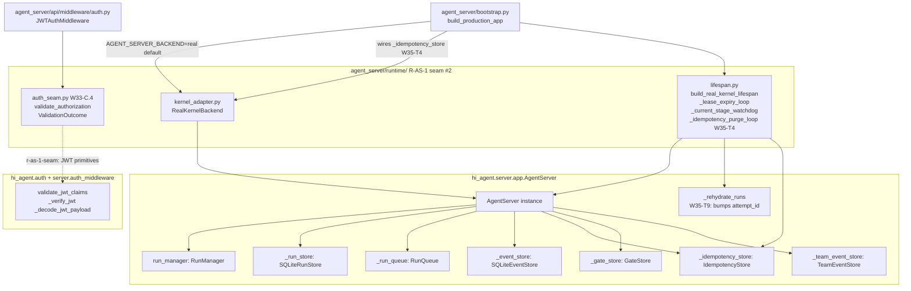
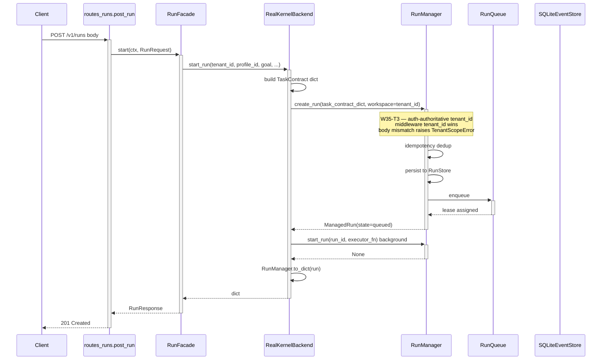

# agent_server/runtime — Architecture

> Last refreshed: W35 close (2026-05-05). HEAD `8bce5bc`. W35-T4 added the idempotency purge loop into the lifespan; W35-T9 fixed the re-lease lineage chain.

---

## 1. Purpose / Responsibilities

`agent_server/runtime/` is the **second R-AS-1 seam** under `agent_server/`, paired with
`bootstrap.py`. It carries three concerns:

1. **Real-kernel binding** (W32-A) — `RealKernelBackend` exposes the seven contract-shaped
   facade callables backed by a live `hi_agent.server.app.AgentServer` whose
   `run_manager`, `event_store`, `run_store`, `run_queue`, `idempotency_store`,
   `gate_store`, `team_event_store` are durable SQLite-backed.
2. **Lifespan integration** (W32-A + W33-C.1 + W35-T4) — `build_real_kernel_lifespan`
   builds the AgentServer on FastAPI startup, runs `_rehydrate_runs`, and starts module-
   level helper tasks: `_lease_expiry_loop`, `_current_stage_watchdog`, and (W35-T4)
   `_idempotency_purge_loop`. All are cancelled cleanly on shutdown.
3. **Auth validation seam** (W33-C.4) — `auth_seam.validate_authorization` reuses the
   platform's JWT primitives so `agent_server/api/middleware/auth.py` can validate tokens
   without itself crossing the R-AS-1 boundary.

What it does NOT own:
- HTTP transport (`agent_server/api/`).
- Contract-shape adaptation (`agent_server/facade/`).
- Run execution itself (`hi_agent/server/run_manager.py`, `hi_agent/runner.py`).
- Durable persistence schema (`hi_agent/server/run_store.py`,
  `hi_agent/server/event_store.py`).

It is a **thin adapter**: every method returns a contract-shaped dict identical in shape
to the kernel's, so the facade layer needs no change.

---

## 2. Module Boundary (R-AS-1 + Rule 6 layering)

R-AS-1 single-seam discipline (paired with `bootstrap.py`):

```
agent_server/runtime/
├── kernel_adapter.py    # r-as-1-seam: real-kernel-binding
├── lifespan.py          # r-as-1-seam: real-kernel-binding (W33-C.1, W35-T4)
└── auth_seam.py         # r-as-1-seam: JWT validation reuses hi_agent primitives
```

All three modules carry the explicit `# r-as-1-seam:` annotation that
`scripts/check_layering.py` consults to permit `hi_agent.*` imports. No other module
under `agent_server/` is permitted to `from hi_agent...` or `import hi_agent`. The gate
fails CI on any third seam.

Consumers:
- `agent_server/bootstrap.py::build_production_app` constructs `RealKernelBackend` and
  passes the lifespan into `build_app(...)`.
- `agent_server/api/middleware/auth.py` calls `validate_authorization` per request.

Rule 6 single-construction-path:
- `RealKernelBackend.__init__` is the sole builder of `AgentServer`. The bootstrap calls
  it exactly once; consumers receive the seven callable methods.
- W35-T4 wires `real_backend._idempotency_store = idem_store` from the bootstrap so the
  lifespan purge loop can reach the store without poking `app.state`.

---

## 3. Component Diagram


```mermaid
graph TD
    subgraph runtime[agent_server/runtime/ R-AS-1 seam #2]
        ADAPTER[kernel_adapter.py<br/>RealKernelBackend]
        LIFESPAN[lifespan.py<br/>build_real_kernel_lifespan<br/>_lease_expiry_loop<br/>_current_stage_watchdog<br/>_idempotency_purge_loop W35-T4]
        AUTH[auth_seam.py W33-C.4<br/>validate_authorization<br/>ValidationOutcome]
    end

    subgraph hi_agent_umbrella[hi_agent.server.app.AgentServer]
        AS[AgentServer instance]
        RM[run_manager: RunManager]
        RS[_run_store: SQLiteRunStore]
        RQ[_run_queue: RunQueue]
        ES[_event_store: SQLiteEventStore]
        IS[_idempotency_store: IdempotencyStore]
        GS[_gate_store: GateStore]
        TS[_team_event_store: TeamEventStore]
        REHYDRATE[_rehydrate_runs<br/>W35-T9: bumps attempt_id]
    end

    subgraph hi_agent_auth[hi_agent.auth + server.auth_middleware]
        JWTPRIM[validate_jwt_claims<br/>_verify_jwt _decode_jwt_payload]
    end

    BOOTSTRAP[agent_server/bootstrap.py<br/>build_production_app]
    APIMW[agent_server/api/middleware/auth.py<br/>JWTAuthMiddleware]

    BOOTSTRAP -->|AGENT_SERVER_BACKEND=real default| ADAPTER
    BOOTSTRAP -->|wires _idempotency_store W35-T4| ADAPTER
    BOOTSTRAP --> LIFESPAN
    LIFESPAN --> AS
    ADAPTER --> AS
    AS --> RM
    AS --> RS
    AS --> RQ
    AS --> ES
    AS --> IS
    AS --> GS
    AS --> TS
    LIFESPAN --> REHYDRATE
    LIFESPAN --> IS
    APIMW --> AUTH
    AUTH -. r-as-1-seam: JWT primitives .-> JWTPRIM
```

---

## 4. Data Flow / Sequence Diagram

`POST /v1/runs` end-to-end through the real kernel (with W35-T3 anti-forgery cross-check):


```mermaid
sequenceDiagram
    participant Client
    participant Route as routes_runs.post_run
    participant RunFacade
    participant Backend as RealKernelBackend
    participant RunMgr as RunManager
    participant Queue as RunQueue
    participant EvtStore as SQLiteEventStore

    Client->>+Route: POST /v1/runs body
    Route->>+RunFacade: start(ctx, RunRequest)
    RunFacade->>+Backend: start_run(tenant_id, profile_id, goal, ...)
    Backend->>Backend: build TaskContract dict
    Backend->>+RunMgr: create_run(task_contract_dict, workspace=tenant_id)
    Note over RunMgr: W35-T3 — auth-authoritative tenant_id<br/>middleware tenant_id wins<br/>body mismatch raises TenantScopeError
    RunMgr->>RunMgr: idempotency dedup
    RunMgr->>RunMgr: persist to RunStore
    RunMgr->>+Queue: enqueue
    Queue-->>-RunMgr: lease assigned
    RunMgr-->>-Backend: ManagedRun(state=queued)
    Backend->>+RunMgr: start_run(run_id, executor_fn) background
    RunMgr-->>-Backend: None
    Backend->>Backend: RunManager.to_dict(run)
    Backend-->>-RunFacade: dict
    RunFacade-->>-Route: RunResponse
    Route-->>-Client: 201 Created
```

Lifespan startup with all three background tasks:

```mermaid
sequenceDiagram
    participant Uvicorn
    participant Lifespan as build_real_kernel_lifespan
    participant AS as AgentServer
    participant LeaseLoop as _lease_expiry_loop
    participant PurgeLoop as _idempotency_purge_loop W35-T4
    participant Watchdog as _current_stage_watchdog

    Uvicorn->>+Lifespan: ASGI startup
    Lifespan->>AS: surface _idempotency_store from backend (W35-T4)
    Lifespan->>+AS: _rehydrate_runs(server) bump attempt_id (W35-T9)
    AS-->>-Lifespan: done
    Lifespan->>LeaseLoop: create_task interval=30s
    Lifespan->>Watchdog: create_task interval=30s
    Lifespan->>PurgeLoop: create_task interval=600s (W35-T4)
    Lifespan->>Lifespan: install SIGTERM handler (W33-C.2)
    Lifespan-->>-Uvicorn: ready (yield)

    Note over Uvicorn,Watchdog: app serves traffic; tasks run in background

    Uvicorn->>+Lifespan: ASGI shutdown
    Lifespan->>LeaseLoop: cancel + await
    Lifespan->>PurgeLoop: cancel + await
    Lifespan->>Watchdog: cancel + await
    Lifespan->>AS: aclose drain run_manager close stores
    Lifespan-->>-Uvicorn: clean exit
```

---

## 5. Key Contracts / Public API

```python
class RealKernelBackend:
    def __init__(self, *, state_dir: Path, posture: Posture) -> None: ...
    def start_run(self, *, tenant_id, profile_id, goal, project_id, run_id,
                  idempotency_key, metadata) -> dict: ...
    def get_run(self, *, tenant_id, run_id) -> dict: ...
    def signal_run(self, *, tenant_id, run_id, signal, payload) -> dict: ...
    def cancel_run(self, *, tenant_id, run_id) -> dict: ...
    def iter_events(self, *, tenant_id, run_id) -> Iterable[dict]: ...
    def list_artifacts(self, *, tenant_id, run_id) -> list[dict]: ...
    def get_artifact(self, *, tenant_id, artifact_id) -> dict: ...
    def aclose(self) -> None: ...
    # Set by bootstrap (W35-T4) so the lifespan purge loop can find the store
    _idempotency_store: IdempotencyStore | None

def build_real_kernel_lifespan(backend: RealKernelBackend) -> AsyncContextManager[None]: ...

@dataclass(frozen=True)
class ValidationOutcome:
    ok: bool
    status: int          # 200 / 401
    reason: str          # e.g. "jwt_invalid", "jwt_secret_missing", "ok"
    claims: dict | None  # decoded JWT claims when ok

def validate_authorization(authorization_header: str | None) -> ValidationOutcome: ...
```

**Invariants:**
- `_rehydrate_runs` runs once on startup AND periodically via `_lease_expiry_loop` (interval
  `HI_AGENT_LEASE_EXPIRY_INTERVAL_S`, default 30s).
- `_idempotency_purge_loop` runs only when `backend._idempotency_store is not None`
  (W35-T4); test harnesses without a store stay quiet. Default interval
  `HI_AGENT_IDEMPOTENCY_PURGE_INTERVAL_S=600`.
- `_current_stage_watchdog` warns when a non-terminal run reports `current_stage=None` for
  >60 s (Rule 8 step 5).
- `validate_authorization` is permissive on bearer extraction so the validator can choose
  dev-passthrough vs strict-reject without raising.

---

## 6. Posture Behaviour (Rule 11)

| Posture | `_resolve_backend_kind` | `validate_authorization` | `_idempotency_purge_loop` |
|---|---|---|---|
| `dev` | `real` (default) or `stub` permitted | passthrough; missing/invalid token returns `ok=True, claims=anonymous` | runs if `_idempotency_store` attached |
| `research` | `real` only; `stub` raises `ValueError` at bootstrap | required Bearer JWT; returns `status=401, reason=jwt_invalid` etc on failure | runs |
| `prod` | same as research | same as research; missing `HI_AGENT_JWT_SECRET` returns `status=401, reason=jwt_secret_missing` | runs |

W35-T1 effect: `RealKernelBackend.start_run` constructs kernel-shaped dicts that flow into
the kernel's `RunManager.create_run`. There the W35-T3 anti-forgery cross-check applies:
body `tenant_id` differing from middleware `tenant_id` raises `TenantScopeError` under
strict, warns under dev.

---

## 7. Failure Modes (Rule 7 fallback inventory)

| Path | Countable | Attributable | Inspectable | Gate-asserted |
|---|---|---|---|---|
| `_lease_expiry_loop` raises (SQLite locked, etc.) | `record_silent_degradation(component="lease_expiry_loop")` | `WARNING` log + spine event | next iteration retries | `tests/integration/test_lease_expiry_runtime.py` |
| `_idempotency_purge_loop` raises (W35-T4) | `record_silent_degradation(component="idempotency_purge_loop")` | `WARNING` log | next interval retries; INFO logs `purged N records` on success | `tests/integration/test_idempotency_ttl_purge.py` |
| `_current_stage_watchdog` detects `current_stage=None` >60s | `record_silent_degradation(component="current_stage_watchdog", reason="current_stage_none_over_60s")` | `WARNING` log w/ run_id + age | spine event | Rule 8 step 5 |
| `validate_authorization` rejects malformed/expired/missing JWT | `JWTAuthMiddleware` returns 401 envelope (no metric — auth is observable as 401 rate) | `WARNING` log line per rejection | client sees 401 + envelope | `tests/integration/test_v1_jwt_auth_middleware.py` |
| `_rehydrate_runs` raises on startup | best-effort; logged WARNING; lifespan continues | log line + spine event | run-store inconsistency surfaces in next watchdog tick | `tests/integration/test_runtime_rehydrate.py` |
| `_idempotency_purge_loop` no store attached | no-op exit (W35-T4) | INFO log "lifespan: idempotency purge loop started" never fires | `getattr(backend, "_idempotency_store", None)` is None | route-level test harnesses |

W35-T6 metrics emitted from `IdempotencyStore` (called via the purge loop):
- `hi_agent_idempotency_purged_total` — incremented on every non-zero purge cycle.

---

## 8. Resource Lifecycle (Rule 5)

`AgentServer` is constructed inside the lifespan startup phase so its `RunManager` event
loop matches uvicorn's loop. `RealKernelBackend` methods are synchronous wrappers that
schedule async work on `RunManager` via the kernel's existing threadsafe entry points (no
per-method `asyncio.run`).

Background tasks created in `_lifespan`:
- `lease_task` — interval-driven scan; cancelled on shutdown.
- `watchdog_task` — interval-driven scan; cancelled on shutdown.
- `purge_task` — W35-T4; only created when `_idempotency_store` is attached; cancelled on
  shutdown.

All three tasks are cancelled with `task.cancel(); await task` (suppressing
`CancelledError`) before `backend.aclose()` runs. This sequence prevents teardown races
between the SQLite-backed loops and the AgentServer's own close chain.

SIGTERM (W33-C.2): `_install_sigterm_handler` calls `run_manager.drain(timeout_s)` before
`shutdown(timeout=2.0)` so PM2/systemd/docker stop signals do not force-fail in-flight
runs after 2 s. Drain budget is overridable via `HI_AGENT_DRAIN_TIMEOUT_S` (default 30 s).

---

## 9. Lineage / Spine Compliance (Rule 12)

Every `RealKernelBackend` method takes `tenant_id` as a kwarg and builds a kernel
`TenantContext` before reaching the `RunManager`. There is no `"default"` coercion under
any posture.

W35-T9 lineage fix: `_rehydrate_runs` in `hi_agent/server/app.py:1340-1377` now bumps
`attempt_id` and links `parent_run_id=run_id` on re-lease. Before W35-T9 the W34-F.2
closure had documented this behaviour but no implementation existed (Rule 15 closure-
claim defect). Now postmortem reconstruction has the per-attempt lineage chain across
recovery cycles.

The lifespan exposes the active backend so operators (and integration tests) can
introspect the live tasks via:
- `backend._lease_expiry_task`
- `backend._current_stage_watchdog_task`
- `backend._idempotency_purge_task` (W35-T4)
- `agent_server._idempotency_store` (W35-T4)

---

## 10. Test Layers (Rule 4)

| Layer | Path | What it asserts |
|---|---|---|
| L1 unit | `tests/unit/test_real_kernel_backend.py` | adapter signatures, dict shapes |
| L1 unit | `tests/unit/test_auth_seam.py` | `validate_authorization` returns `ValidationOutcome` correctly |
| L2 integration | `tests/integration/test_v1_runs_real_kernel_binding.py` | end-to-end through real kernel |
| L2 integration | `tests/integration/test_idempotency_ttl_purge.py` | W35-T4 purge loop drains expired records |
| L2 integration | `tests/integration/test_idempotency_metrics.py` | W35-T6 metrics emitted on purge / replay / conflict |
| L2 integration | `tests/integration/test_lease_expiry_runtime.py` | lease-expiry loop reclaims stale leases |
| L2 integration | `tests/integration/test_v1_jwt_auth_middleware.py` | W33-C.4 auth seam under all three postures |
| L3 e2e | `tests/e2e/test_e2e_agent_server_*.py` | full HTTP-driven runs through `RealKernelBackend` |

---

## 11. Open Roadmap Items (W36+)

- W36: streaming backpressure on `iter_events` — current adapter snapshots a list per
  call; future cursor-based async iteration. Tracked in
  `docs/governance/retention-roadmap.md`.
- W36: hot-reload of `AgentServer` config — currently config-file changes require a
  uvicorn restart. Tracked in `docs/governance/boot-time-assertions-roadmap.md`.
- W37+: cross-process run sharing — two uvicorn workers each get their own AgentServer
  and stores; horizontal scaling demands an external durable backend. Out of scope at v1;
  tracked in retention-roadmap.md.

---

## 12. References

Source files:
- `agent_server/runtime/__init__.py`
- `agent_server/runtime/kernel_adapter.py` — `RealKernelBackend`
- `agent_server/runtime/lifespan.py` — `build_real_kernel_lifespan`,
  `_lease_expiry_loop`, `_current_stage_watchdog`, `_idempotency_purge_loop` (W35-T4)
- `agent_server/runtime/auth_seam.py` — `validate_authorization`, `ValidationOutcome` (W33-C.4)

Bootstrap & kernel:
- `agent_server/bootstrap.py:188` — `build_production_app`
- `agent_server/bootstrap.py:282-286` — wires `_idempotency_store` onto backend (W35-T4)
- `hi_agent/server/app.py::AgentServer` (umbrella)
- `hi_agent/server/app.py:1340-1377` — `_rehydrate_runs` attempt_id bump (W35-T9)
- `hi_agent/server/run_manager.py:443-489` — auth-authoritative tenant_id (W35-T3)
- `hi_agent/server/idempotency.py:193-235` — `purge_expired` (W35-T4)
- `hi_agent/observability/idempotency_metrics.py` — W35-T6 metric helpers

Sibling subsystems:
- [`../ARCHITECTURE.md`](../ARCHITECTURE.md) — top-level facade
- [`../api/ARCHITECTURE.md`](../api/ARCHITECTURE.md) — HTTP transport (auth middleware)
- [`../contracts/ARCHITECTURE.md`](../contracts/ARCHITECTURE.md) — frozen v1 schemas
- [`../config/ARCHITECTURE.md`](../config/ARCHITECTURE.md) — settings, version constants
- [`../cli/ARCHITECTURE.md`](../cli/ARCHITECTURE.md) — operator CLI

Observability:
- `docs/observability/idempotency-metrics.md` — W35-T6 metric catalog
- `docs/governance/boot-time-assertions-roadmap.md`
- `docs/governance/retention-roadmap.md`

Gates:
- `scripts/check_layering.py` (R-AS-1)
- `scripts/check_facade_seams.py` (annotated seam discipline)
- `scripts/run_arch_7x24.py` (lifespan watchdog assertions)

Governance: CLAUDE.md → Rule 5 (Async/Sync Resource Lifetime), Rule 7 (Resilience),
Rule 8 (Operator-Shape Gate), Rule 12 (Spine), AS-RO ownership
