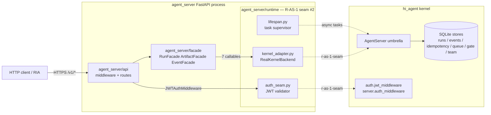
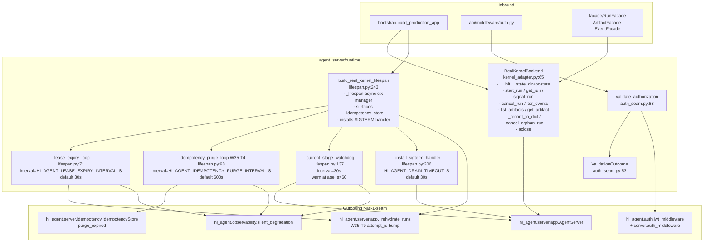

# agent_server/runtime — Architecture

> **Last refreshed:** 2026-05-06 (W35 corrective close + W36 plans). HEAD `276917d8`.
> **Audience:** platform engineers + release captains.
> **Status:** authoritative.

---

## 1. Purpose & Responsibilities

`agent_server/runtime/` is the **second R-AS-1 seam** under `agent_server/`, paired with
`agent_server/bootstrap.py`. It is the only place inside the v1 northbound facade
that may import from `hi_agent.*` — and every such import carries an explicit
`# r-as-1-seam: <reason>` annotation that the layering gate
(`scripts/check_facade_seams.py`) consults.

The package owns three concerns and nothing else:

1. **Real-kernel binding** (W32-A) — `RealKernelBackend` (`kernel_adapter.py`) wraps
   exactly one live `hi_agent.server.app.AgentServer` and exposes the seven
   contract-shaped callables (`start_run`, `get_run`, `signal_run`, `cancel_run`,
   `iter_events`, `list_artifacts`, `get_artifact`) that match the
   `_InProcessRunBackend` signature the v1 facades were built against.
2. **Lifespan task supervisor** (`lifespan.py`) — `build_real_kernel_lifespan`
   produces the `AbstractAsyncContextManager` FastAPI consumes via
   `Router.lifespan_context`. The supervisor runs `_rehydrate_runs` on startup,
   spawns three background tasks (`_lease_expiry_loop`,
   `_current_stage_watchdog`, `_idempotency_purge_loop` — added W35-T4), installs
   a SIGTERM handler that drains in-flight runs (W33-C.2), and tears everything
   down in a deterministic order on shutdown.
3. **JWT validation seam** (W33-C.4) — `auth_seam.validate_authorization` reuses
   `hi_agent.auth.jwt_middleware` + `hi_agent.server.auth_middleware` primitives
   so the api-layer middleware (`agent_server/api/middleware/auth.py`) can
   validate Bearer tokens without itself crossing the R-AS-1 boundary.

What this package does NOT own:

- HTTP transport (`agent_server/api/`).
- Contract-shape adaptation (`agent_server/facade/`).
- Run execution itself (`hi_agent/server/run_manager.py`,
  `hi_agent/runner.py`).
- Durable persistence schema (`hi_agent/server/run_store.py`,
  `hi_agent/server/event_store.py`,
  `hi_agent/server/idempotency.py`).

The package is a **thin adapter**: every method returns a contract-shaped dict
identical to what the kernel produces, so the facade layer requires no awareness
of which backend is wired in.

---

## 2. Context & Scope


```mermaid
flowchart LR
    Client[HTTP client / RIA]
    subgraph FacadeProcess[agent_server FastAPI process]
        API[agent_server/api<br/>middleware + routes]
        FACADE[agent_server/facade<br/>RunFacade ArtifactFacade EventFacade]
        subgraph RUNTIME[agent_server/runtime — R-AS-1 seam #2]
            ADAPTER[kernel_adapter.py<br/>RealKernelBackend]
            LIFESPAN[lifespan.py<br/>task supervisor]
            AUTH[auth_seam.py<br/>JWT validator]
        end
    end
    subgraph KERNEL[hi_agent kernel]
        AS[AgentServer umbrella]
        STORES[(SQLite stores<br/>runs / events / idempotency / queue / gate / team)]
        AUTHPRIM[auth.jwt_middleware<br/>server.auth_middleware]
    end

    Client -->|HTTPS /v1/*| API
    API --> FACADE
    FACADE -->|7 callables| ADAPTER
    API -->|JWTAuthMiddleware| AUTH
    LIFESPAN -. async tasks .-> AS
    ADAPTER -. r-as-1-seam .-> AS
    AS --> STORES
    AUTH -. r-as-1-seam .-> AUTHPRIM
```

Boundaries:

- `agent_server/api`, `agent_server/facade`, `agent_server/contracts`,
  `agent_server/cli` MUST NOT import `hi_agent.*`. The layering gate fails CI on
  any third seam.
- The runtime package itself MUST NOT import HTTP routing, FastAPI request
  objects, or facade classes — it produces dicts; the facade renders them as
  Pydantic models.

---

## 3. Module Boundary & Dependencies

```
agent_server/runtime/
├── __init__.py            # public surface: RealKernelBackend + build_real_kernel_lifespan
├── kernel_adapter.py      # r-as-1-seam: real-kernel binding (W32-A)
├── lifespan.py            # r-as-1-seam: task supervisor (W33-C.1, W33-C.2, W35-T4)
└── auth_seam.py           # r-as-1-seam: JWT validation (W33-C.4)
```

R-AS-1 seam annotations (every cross-boundary `from hi_agent.` line is annotated
in source — a sample below is from `kernel_adapter.py:46-58`):

```python
# r-as-1-seam: posture is platform config the adapter reads to fail-close
from hi_agent.config.posture import Posture
# r-as-1-seam: AgentServer is the durable RunManager + stores umbrella class
from hi_agent.server.app import AgentServer
# r-as-1-seam: RunManager workspace contract uses kernel TenantContext
from hi_agent.server.tenant_context import TenantContext as KernelTenantContext
```

Inbound consumers:

- `agent_server/bootstrap.py::build_production_app` — constructs
  `RealKernelBackend(state_dir=..., posture=...)` exactly once; passes the
  lifespan into `agent_server.api.build_app(lifespan=...)`.
- `agent_server/bootstrap.py:286` (`real_backend._idempotency_store = idem_store`)
  — wires the production `IdempotencyStore` onto the backend so the W35-T4 purge
  loop can find it without reaching into `app.state`.
- `agent_server/api/middleware/auth.py::JWTAuthMiddleware` —
  per-request call into `auth_seam.validate_authorization(...)`.

Outbound dependencies (annotated seams only):

| Module | Imports from `hi_agent.*` | Why |
|---|---|---|
| `kernel_adapter.py` | `config.posture.Posture`, `server.app.AgentServer`, `server.tenant_context.TenantContext`, `observability.silent_degradation.record_silent_degradation` (lazy) | construct kernel; build workspace; emit Rule 7 alarms |
| `lifespan.py` | `observability.silent_degradation.record_silent_degradation`, `server.app._rehydrate_runs` | Rule 7 alarm + run rehydration |
| `auth_seam.py` | `auth.jwt_middleware.{JWTValidationError, validate_jwt_claims}`, `config.posture.Posture`, `server.auth_middleware.{_decode_jwt_payload, _verify_jwt}` | reuse vetted JWT primitives |

Rule 6 (single construction path):

- `RealKernelBackend.__init__` is the **sole** `AgentServer` builder in the
  process. Bootstrap calls it once; downstream consumers receive the seven
  callables and never see the umbrella.
- `HI_AGENT_DATA_DIR` is set/restored around the `AgentServer()` call so the
  kernel-owned SQLite files land under `state_dir/kernel/` and never collide
  with the bootstrap-owned `idempotency.db` driving the middleware.

---

## 4. Building Blocks


```mermaid
flowchart TB
    subgraph RUNTIME[agent_server/runtime]
        direction TB
        ADAPTER[RealKernelBackend<br/>kernel_adapter.py:65<br/>· __init__ state_dir+posture<br/>· start_run / get_run / signal_run<br/>· cancel_run / iter_events<br/>· list_artifacts / get_artifact<br/>· _record_to_dict / _cancel_orphan_run<br/>· aclose]
        LIFESPAN_CTX[build_real_kernel_lifespan<br/>lifespan.py:243<br/>· _lifespan async ctx manager<br/>· surfaces _idempotency_store<br/>· installs SIGTERM handler]
        T_LEASE[_lease_expiry_loop<br/>lifespan.py:71<br/>interval=HI_AGENT_LEASE_EXPIRY_INTERVAL_S<br/>default 30s]
        T_PURGE[_idempotency_purge_loop W35-T4<br/>lifespan.py:98<br/>interval=HI_AGENT_IDEMPOTENCY_PURGE_INTERVAL_S<br/>default 600s]
        T_WATCH[_current_stage_watchdog<br/>lifespan.py:137<br/>interval=30s<br/>warn at age_s>60]
        SIG[_install_sigterm_handler<br/>lifespan.py:206<br/>HI_AGENT_DRAIN_TIMEOUT_S<br/>default 30s]
        AUTH_FN[validate_authorization<br/>auth_seam.py:88]
        OUTCOME[ValidationOutcome<br/>auth_seam.py:53]
    end

    subgraph INBOUND[Inbound]
        BOOT[bootstrap.build_production_app]
        APIMW[api/middleware/auth.py]
        FAC[facade/RunFacade<br/>ArtifactFacade EventFacade]
    end

    subgraph OUTBOUND[Outbound r-as-1-seam]
        AS[hi_agent.server.app.AgentServer]
        REHYDRATE[hi_agent.server.app._rehydrate_runs<br/>W35-T9 attempt_id bump]
        IDEM[hi_agent.server.idempotency.IdempotencyStore<br/>purge_expired]
        JWT[hi_agent.auth.jwt_middleware<br/>+ server.auth_middleware]
        SILENT[hi_agent.observability.silent_degradation]
    end

    BOOT --> ADAPTER
    BOOT --> LIFESPAN_CTX
    APIMW --> AUTH_FN
    AUTH_FN --> OUTCOME
    FAC --> ADAPTER
    LIFESPAN_CTX --> T_LEASE
    LIFESPAN_CTX --> T_PURGE
    LIFESPAN_CTX --> T_WATCH
    LIFESPAN_CTX --> SIG
    LIFESPAN_CTX --> REHYDRATE
    T_LEASE --> REHYDRATE
    T_PURGE --> IDEM
    T_WATCH --> AS
    ADAPTER --> AS
    SIG --> AS
    AUTH_FN --> JWT
    T_LEASE --> SILENT
    T_PURGE --> SILENT
    T_WATCH --> SILENT
```

| Component | File:line | Responsibility |
|---|---|---|
| `RealKernelBackend` | `kernel_adapter.py:65` | seven facade callables; tenant validation; orphan-run cleanup |
| `RealKernelBackend.__init__` | `kernel_adapter.py:73-123` | scopes `HI_AGENT_DATA_DIR` to `state_dir/kernel/`; constructs `AgentServer()` once |
| `RealKernelBackend.iter_events` | `kernel_adapter.py:325-414` | live-tail SSE generator; polls `event_store.list_since` every 100 ms; 600 s hard cap |
| `RealKernelBackend.start_run` | `kernel_adapter.py:151-239` | builds `TaskContract`; reverts orphan ManagedRun on failure (Track A F4) |
| `_record_to_dict` | `kernel_adapter.py:460-490` | translates `ManagedRun` to contract envelope; raises 404 on cross-tenant access |
| `build_real_kernel_lifespan` | `lifespan.py:243-350` | async ctx manager; yields ready, drains on close |
| `_lease_expiry_loop` | `lifespan.py:71-95` | reclaims stale leases via `_rehydrate_runs` in executor |
| `_idempotency_purge_loop` (W35-T4) | `lifespan.py:98-134` | drives `IdempotencyStore.purge_expired`; no-op when no store attached |
| `_current_stage_watchdog` | `lifespan.py:137-203` | Rule 8 step 5 enforcer; emits alarm + WARNING when `current_stage=None > 60 s` |
| `_install_sigterm_handler` | `lifespan.py:206-240` | drain-then-shutdown for PM2/systemd/docker stop |
| `validate_authorization` | `auth_seam.py:88-172` | Bearer extraction + posture-aware JWT verify |
| `ValidationOutcome` | `auth_seam.py:53-75` | `(ok, status, reason, claims)` dataclass |

---

## 5. Runtime View — Key Scenarios

### 5.1 `POST /v1/runs` end-to-end via the real kernel

```mermaid
sequenceDiagram
    participant Client
    participant Route as routes_runs.post_run
    participant RunFacade
    participant Backend as RealKernelBackend
    participant RunMgr as AgentServer.run_manager
    participant Queue as RunQueue
    participant Store as RunStore (SQLite)

    Client->>+Route: POST /v1/runs (body, X-Tenant-Id, Idempotency-Key)
    Route->>+RunFacade: start(ctx, RunRequest)
    RunFacade->>+Backend: start_run(tenant_id, profile_id, goal, ...)
    Backend->>Backend: validate tenant_id (else ContractError 400)
    Backend->>Backend: build TaskContract dict (kernel_adapter.py:175)
    Backend->>+RunMgr: create_run(task_contract, workspace=KernelTenantContext)
    Note over RunMgr: W35-T3 cross-check —<br/>middleware tenant_id wins;<br/>body mismatch raises TenantScopeError
    RunMgr->>Store: persist record + idempotency reservation
    RunMgr->>+Queue: enqueue
    Queue-->>-RunMgr: lease assigned
    RunMgr-->>-Backend: ManagedRun(state=queued)
    Backend->>Backend: executor_factory(run_data)
    alt executor_factory raises
        Backend->>RunMgr: cancel_run (revert orphan)
        Backend-->>RunFacade: ContractError 503 platform_not_ready
    else
        Backend->>+RunMgr: start_run(run_id, executor_fn)
        RunMgr-->>-Backend: dispatched on worker thread
        Backend->>Backend: _record_to_dict(run_id, tenant_id)
        Backend-->>-RunFacade: contract envelope
    end
    RunFacade-->>-Route: RunResponse
    Route-->>-Client: 201 Created
```

### 5.2 Lifespan startup → serve → SIGTERM drain

```mermaid
sequenceDiagram
    participant Uvicorn
    participant Lifespan as build_real_kernel_lifespan
    participant Backend as RealKernelBackend
    participant AS as AgentServer
    participant Lease as _lease_expiry_loop
    participant Purge as _idempotency_purge_loop (W35-T4)
    participant Watch as _current_stage_watchdog
    participant SIG as SIGTERM handler

    Uvicorn->>+Lifespan: ASGI startup
    Lifespan->>Backend: getattr(_idempotency_store)
    Lifespan->>AS: agent_server._idempotency_store = store (surface)
    Lifespan->>+AS: _rehydrate_runs (best-effort; W35-T9 bumps attempt_id)
    AS-->>-Lifespan: complete
    Lifespan->>Lease: asyncio.create_task(interval=30 s)
    Lifespan->>Watch: asyncio.create_task(interval=30 s)
    alt _idempotency_store attached
        Lifespan->>Purge: asyncio.create_task(interval=600 s)
    end
    Lifespan->>SIG: signal.signal(SIGTERM, _handler)
    Lifespan-->>-Uvicorn: yield (app ready)

    Note over Uvicorn,Watch: app serves traffic; tasks run in background

    Uvicorn->>SIG: SIGTERM (PM2/systemd/docker stop)
    SIG->>AS: run_manager.drain(timeout_s=30)
    SIG->>AS: run_manager.shutdown(timeout=2.0)
    Uvicorn->>+Lifespan: ASGI shutdown
    Lifespan->>Lease: cancel + await
    Lifespan->>Watch: cancel + await
    Lifespan->>Purge: cancel + await
    Lifespan->>Backend: aclose() → run_manager.shutdown idempotent
    Lifespan-->>-Uvicorn: clean exit
```

### 5.3 Live-tail SSE through `iter_events`

```mermaid
sequenceDiagram
    participant Client
    participant Route as routes_runs.get_events
    participant Backend as RealKernelBackend
    participant ES as event_store.list_since
    participant RM as run_manager.get_run

    Client->>+Route: GET /v1/runs/{id}/events
    Route->>+Backend: iter_events(tenant_id, run_id)
    Backend->>Backend: ownership guard via _record_to_dict (else 404)
    Backend-->>-Route: live-tail generator
    loop until terminal or 600s hard cap
        Route->>+ES: list_since(run_id, since=last_seq, tenant_id)
        ES-->>-Route: rows since cursor
        Route-->>Client: SSE data: <event_json>
        Route->>+RM: get_run(run_id, workspace)
        RM-->>-Route: state
        alt state in {completed, failed, cancelled, error, done, succeeded}
            Route-->>Client: stream end
        else
            Route->>Route: sleep 100 ms; bump cursor
        end
    end
```

---

## 6. Cross-cutting Concerns

### 6.1 Posture awareness (Rule 11)

| Posture | `_resolve_backend_kind` (bootstrap) | `validate_authorization` | `_idempotency_purge_loop` |
|---|---|---|---|
| `dev` | `real` (default) or `stub` permitted | passthrough; missing/invalid token returns `ok=True, claims={"sub": "__anonymous__"}` | runs only when `_idempotency_store` attached |
| `research` | `real` only; `stub` raises `ValueError` at bootstrap | strict; missing/malformed/expired returns `status=401`, reason taxonomy: `missing_jwt`, `invalid_or_expired_jwt`, `jwt_secret_missing`, `jwt_signature_unverified`, `invalid_jwt_format`, `invalid_jwt_claims:<exc>` | runs |
| `prod` | same as research | same as research; `HI_AGENT_JWT_SECRET` unset → `status=401, reason=jwt_secret_missing` | runs |

W35-T1/T3 inheritance: every `RealKernelBackend.start_run` call passes
`tenant_id` from the middleware-authoritative context into
`RunManager.create_run`, where the W35-T3 anti-forgery cross-check applies. Body
`tenant_id` differing from the middleware claim raises `TenantScopeError` under
strict, warns under dev.

### 6.2 Resource lifetime (Rule 5)

`AgentServer` is constructed inside `RealKernelBackend.__init__`, which runs
under the bootstrap call (one process, one event loop owned by uvicorn). The
backend exposes synchronous wrappers that schedule kernel work via
`run_manager.create_run` / `start_run` — those use the kernel's threadsafe entry
points, not new event loops. There is no per-method `asyncio.run`.

Background tasks created in `_lifespan`:

- `lease_task` — interval-driven scan; cancelled before `aclose()`.
- `watchdog_task` — interval-driven scan; cancelled before `aclose()`.
- `purge_task` (W35-T4) — only created when `backend._idempotency_store is not None`; cancelled before `aclose()`.

All three are cancelled with `task.cancel(); await task` (suppressing
`CancelledError`) before `backend.aclose()` runs. This sequence prevents
teardown races between the SQLite-backed loops and the AgentServer's own close
chain.

SIGTERM (W33-C.2): `_install_sigterm_handler` calls
`run_manager.drain(timeout_s=HI_AGENT_DRAIN_TIMEOUT_S)` (default 30 s) before
`run_manager.shutdown(timeout=2.0)`. Without this, PM2/systemd/docker stop would
force-fail in-flight runs after 2 s.

### 6.3 Failure modes (Rule 7 fallback inventory)

| Path | Countable | Attributable | Inspectable | Gate-asserted |
|---|---|---|---|---|
| `_lease_expiry_loop` raises (SQLite locked, etc.) | `record_silent_degradation(component="lease_expiry_loop", reason="lease_expiry_scan_failed")` | `WARNING` log + spine event | next iteration retries | `tests/integration/test_lease_expiry_runtime.py` |
| `_idempotency_purge_loop` raises (W35-T4) | `record_silent_degradation(component="idempotency_purge_loop", reason="purge_failed")` | `WARNING` log | next interval retries; `INFO` logs `purged N records` on success | `tests/integration/test_idempotency_ttl_purge.py` |
| `_current_stage_watchdog` detects `current_stage=None` >60 s | `record_silent_degradation(component="current_stage_watchdog", reason="current_stage_none_over_60s")` | `WARNING` log w/ run_id + age | spine event | Rule 8 step 5 |
| `_current_stage_watchdog::list_runs` raises | `record_silent_degradation(component="current_stage_watchdog", reason="list_runs_failed")` | `WARNING` log | next iteration retries | watchdog L2 test |
| `validate_authorization` rejects token | n/a (auth observability is the 401 rate) | `WARNING` log line per rejection | client sees 401 + envelope | `tests/integration/test_v1_jwt_auth_middleware.py` |
| `_rehydrate_runs` raises on startup | best-effort; logged WARNING (rule7-exempt; documented in `lifespan.py:283`) | log line | run-store inconsistency surfaces in next watchdog tick | `tests/integration/test_runtime_rehydrate.py` |
| `start_run` orphan ManagedRun cleanup | `record_silent_degradation(component="agent_server.runtime.kernel_adapter._cancel_orphan_run", reason="orphan_cancel_failed")` | `WARNING` log; never re-raises | original failure surfaces to caller | Track A F4 unit test |
| `iter_events` exceeds 600 s hard cap | `WARNING` log `iter_events: run_id=… exceeded max_total_s` | log line | client SSE closes cleanly | `tests/integration/test_v1_run_events_live_tail.py` |

W35-T6 metrics emitted from `IdempotencyStore` (called via the purge loop):

- `hi_agent_idempotency_purged_total` — incremented on every non-zero purge cycle.

### 6.4 Lineage / spine compliance (Rule 12)

Every `RealKernelBackend` method takes `tenant_id` as a kwarg and builds a
kernel `TenantContext` before reaching the `RunManager`. There is no
`"default"` coercion under any posture. `_record_to_dict` uses `RunManager.get_run(run_id, workspace)` which returns `None` on cross-tenant access; the
adapter raises `NotFoundError(404)` rather than 403 to avoid leaking existence.

W35-T9 lineage fix: `_rehydrate_runs` in `hi_agent/server/app.py:1340-1377` now
bumps `attempt_id` and links `parent_run_id=run_id` on re-lease. Postmortem
reconstruction therefore has the per-attempt lineage chain across recovery
cycles.

The lifespan exposes the active backend so operators (and integration tests)
can introspect the live tasks via:

- `backend._lease_expiry_task`
- `backend._current_stage_watchdog_task`
- `backend._idempotency_purge_task` (W35-T4)
- `agent_server._idempotency_store` (W35-T4)

### 6.5 Test layers (Rule 4)

| Layer | Path | What it asserts |
|---|---|---|
| L1 unit | `tests/unit/test_real_kernel_backend.py` | adapter signatures, dict shapes, tenant validation |
| L1 unit | `tests/unit/test_auth_seam.py` | `validate_authorization` posture matrix |
| L2 integration | `tests/integration/test_v1_runs_real_kernel_binding.py` | end-to-end POST/GET via real kernel |
| L2 integration | `tests/integration/test_idempotency_ttl_purge.py` | W35-T4 purge loop drains expired records |
| L2 integration | `tests/integration/test_idempotency_metrics.py` | W35-T6 metrics emitted on purge / replay / conflict |
| L2 integration | `tests/integration/test_lease_expiry_runtime.py` | lease-expiry loop reclaims stale leases |
| L2 integration | `tests/integration/test_v1_jwt_auth_middleware.py` | W33-C.4 auth seam under all three postures |
| L3 e2e | `tests/e2e/test_e2e_agent_server_*.py` | full HTTP-driven runs through `RealKernelBackend` |

---

## 7. Architecture Decisions

| ID | Decision | Why |
|---|---|---|
| R-AS-1 | Two and only two seams may import `hi_agent.*`: `agent_server/bootstrap.py` and `agent_server/runtime/**`. Every cross-boundary line carries `# r-as-1-seam: <reason>`. | Concentrates the kernel-coupling surface so reviewers can audit; gate-enforced by `scripts/check_facade_seams.py`. |
| Rule 5 | The runtime owns one event-loop-bound `AgentServer`. No per-call `asyncio.run`; sync bridges go through `hi_agent.runtime.sync_bridge` if needed. | Avoids the cross-loop "Event loop is closed" defect class (Wave-15+ history). |
| Rule 6 | `RealKernelBackend.__init__` is the single builder; bootstrap calls it exactly once; consumers receive callables, never the umbrella. | Eliminates the `x or AgentServer()` fallback class. |
| Rule 8 step 5 | Lifespan must report `current_stage` non-`None` within 30 s on every run; sustained `None` >60 s is a Rule 8 violation. | Without an active watchdog the stage signal becomes unobservable to operators. |
| W33-C.1 | Lease-expiry loop and current-stage watchdog run in the agent_server lifespan, not just `hi_agent.server.app.lifespan`. | Production deployments boot through `agent_server.bootstrap`, not the legacy `hi_agent` lifespan. |
| W33-C.2 | SIGTERM handler calls `drain(timeout_s)` before `shutdown(timeout=2.0)`. | PM2/systemd/docker stop signals must not force-fail in-flight runs at the 2 s mark. |
| W33-C.4 | Auth validator lives in the runtime seam; api-layer middleware imports `validate_authorization` only. | Keeps `agent_server/api/**` free of `hi_agent.*` imports. |
| W35-T4 | Idempotency purge loop is a third lifespan task; the bootstrap stashes the production `IdempotencyStore` on the backend so the loop discovers it without poking `app.state`. | Without the loop `idempotency.db` grew unbounded since `expires_at` was set but never enforced. |
| W35-T9 | `_rehydrate_runs` bumps `attempt_id` and sets `parent_run_id=run_id` on re-lease. | Closes the W34-F.2 documented-but-unimplemented gap (Rule 15 closure-claim defect). |
| W36-A5 (planned) | Boot-time assertions B1, B2, B3 fail-fast under research/prod when the runtime detects `agent_server.run_manager is None`, `executor_factory is None`, or `event_store is None`. | Surfaces silent route-without-resource defects at deploy time, not on first traffic. See `docs/governance/boot-time-assertions-roadmap.md` §HIGH. |

---

## 8. Quality Attributes

| Attribute | Target | How met today | Verified by |
|---|---|---|---|
| Cross-loop stability | 3 sequential real-LLM runs share one `AgentServer`; no `Event loop is closed` | single-construction `AgentServer` + uvicorn-owned loop | `tests/e2e/test_e2e_agent_server_three_runs.py` |
| Lifespan observability | Every run reports `current_stage` non-`None` within 30 s | `_current_stage_watchdog` + spine event on >60 s | Rule 8 step 5; `tests/integration/test_runtime_lifespan_watchdog.py` |
| Cancellation round-trip | `cancel` of unknown id → 404; live id → 200 + drives terminal | `_record_to_dict` raises 404; `cancel_run` returns post-cancel snapshot | Rule 8 step 6; `tests/integration/test_v1_runs_cancel.py` |
| Graceful drain | SIGTERM completes drain in `HI_AGENT_DRAIN_TIMEOUT_S` (30 s default) before shutdown | `_install_sigterm_handler` two-step | manual operator-shape gate |
| Storage growth | `idempotency.db` does not grow unbounded | `_idempotency_purge_loop` (W35-T4) + `purge_expired` | `tests/integration/test_idempotency_ttl_purge.py` |
| Auth fail-closed (research/prod) | Missing/forged JWT → 401 envelope | `auth_seam.validate_authorization` strict path | `tests/integration/test_v1_jwt_auth_middleware.py` |

---

## 9. Risks & Technical Debt

| Risk | Surface | Mitigation status |
|---|---|---|
| Boot-time assertions (B1/B2/B3) not yet enforced — silent route-without-resource under research/prod | `lifespan.py` startup; `kernel_adapter.py:198-209` per-request `executor_factory_missing` 503; `kernel_adapter.py:341-343` silent `iter(())` when event_store is None | **W36 binding** — see `docs/governance/boot-time-assertions-roadmap.md` §HIGH (B1, B2, B3) |
| SIGTERM drain timeout interaction — `HI_AGENT_DRAIN_TIMEOUT_S=30` larger than orchestrator stop budget would cause SIGKILL mid-drain | `lifespan.py:206-240` | Documented; operators advised to align orchestrator stop_grace_period with drain budget |
| Cross-loop lifetime — a future change introducing a second event loop (e.g. embedding `agent_server` inside another async app) would violate Rule 5 invariants | `kernel_adapter.py:__init__` | Documented; layering gate prevents accidental imports; future change requires Rule 5 review |
| SIGTERM handler attribute assumption (B16) — handler dereferences `run_manager.drain` and `.shutdown` without check | `lifespan.py:218-230` | **W37 binding** — `docs/governance/boot-time-assertions-roadmap.md` §MEDIUM B16 |
| `JWT_SECRET` unset under prod — currently per-request 401 (B15), should boot-fail | `auth_seam.py:138-145` | **W37 binding** — boot-time-assertions-roadmap.md §MEDIUM B15/B19 |
| `iter_events` is a polling generator (100 ms cadence, 600 s hard cap) — not back-pressured for very high-volume runs | `kernel_adapter.py:325-414` | W36+ tracking — cursor-based async iteration in `docs/governance/retention-roadmap.md` |
| `_rehydrate_runs` raises `WARNING` and continues — no boot rejection under research/prod when `run_queue is None` (B17) | `lifespan.py:281-286`; kernel `app.py:1239` | **W37 binding** — boot-time-assertions-roadmap.md §MEDIUM B17 |
| Cross-process run sharing not supported — two uvicorn workers each get their own `AgentServer` and stores | architectural | Tracked in `retention-roadmap.md`; out of scope at v1 |

---

## 10. References

Source files (this seam):

- `agent_server/runtime/__init__.py` — public surface re-exports
- `agent_server/runtime/kernel_adapter.py` — `RealKernelBackend`
- `agent_server/runtime/lifespan.py` — `build_real_kernel_lifespan`,
  `_lease_expiry_loop`, `_current_stage_watchdog`, `_idempotency_purge_loop`
  (W35-T4), `_install_sigterm_handler`
- `agent_server/runtime/auth_seam.py` — `validate_authorization`,
  `ValidationOutcome` (W33-C.4)

Bootstrap & kernel:

- `agent_server/bootstrap.py::build_production_app`
- `agent_server/bootstrap.py:286` — wires `_idempotency_store` onto backend (W35-T4)
- `hi_agent/server/app.py::AgentServer` (umbrella)
- `hi_agent/server/app.py:1340-1377` — `_rehydrate_runs` attempt_id bump (W35-T9)
- `hi_agent/server/run_manager.py:443-489` — auth-authoritative tenant_id (W35-T3)
- `hi_agent/server/idempotency.py:193-235` — `purge_expired` (W35-T4)
- `hi_agent/observability/idempotency_metrics.py` — W35-T6 metric helpers

Sibling subsystems:

- [`../ARCHITECTURE.md`](../ARCHITECTURE.md) — top-level facade
- [`../api/ARCHITECTURE.md`](../api/ARCHITECTURE.md) — HTTP transport (auth middleware)
- [`../contracts/ARCHITECTURE.md`](../contracts/ARCHITECTURE.md) — frozen v1 schemas
- [`../config/ARCHITECTURE.md`](../config/ARCHITECTURE.md) — settings, version constants
- [`../cli/ARCHITECTURE.md`](../cli/ARCHITECTURE.md) — operator CLI

Roadmaps:

- `docs/governance/boot-time-assertions-roadmap.md` (W36 binding for B1-B3)
- `docs/governance/retention-roadmap.md`
- `docs/observability/idempotency-metrics.md` — W35-T6 metric catalog

Gates:

- `scripts/check_layering.py` (R-AS-1)
- `scripts/check_facade_seams.py` (annotated seam discipline)
- `scripts/run_arch_7x24.py` (lifespan watchdog assertions)

Governance: CLAUDE.md → Rule 5 (Async/Sync Resource Lifetime), Rule 7
(Resilience), Rule 8 (Operator-Shape Gate + 7×24 architectural), Rule 12
(Spine), AS-RO ownership.
