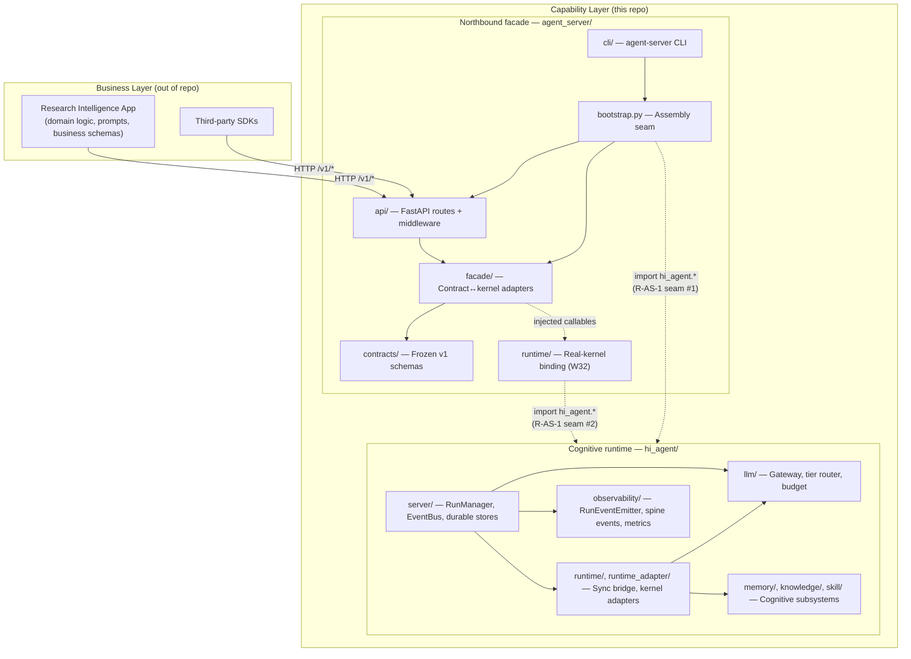

# Architecture Reference

> **Last refreshed:** Wave 32 (2026-05-03). Per-subsystem architecture documents under `agent_server//ARCHITECTURE.md` and `hi_agent//ARCHITECTURE.md` (the latter land alongside W32 Track F2). This file is the canonical codebase reference — stable facts, not behavioral rules. Behavioral rules live in [`CLAUDE.md`](../CLAUDE.md).

---

## 1. Purpose & Position in System

hi-agent is a **capability-layer** platform for autonomous agent execution. It packages the cognitive runtime (`hi_agent/`), the durable execution substrate (formerly `agent_kernel/`, inlined into `hi_agent/server/` Wave 11), and a versioned northbound HTTP facade (`agent_server/`) under one repository.

**Capability-layer rationale (Rule 10).** Business logic, prompts, and domain schemas are *not* the platform's responsibility. The platform exposes generic primitives — runs, events, artifacts, gates, manifests, skills — and refuses to host domain types. Downstream applications (the Research Intelligence App, third-party tooling) compose business overlays on top of these primitives.

**Three-Gate Demand Intake.** Before accepting any new capability:
- **G1 — Positioning:** capability-layer only — `hi_agent/`, `agent_server/`, or `agent_kernel/` (now inlined). Anything domain-specific is declined and redirected.
- **G2 — Abstraction:** if the request composes from existing capabilities, decline new code; provide a composition example instead.
- **G3 — Verification:** new code requires Rule 4 three-layer test plan + Rule 8 gate run plan before delivery.
- **G4 — Posture & Spine:** declare default behaviour under `dev`/`research`/`prod` postures and which Rule 12 contract-spine fields the new capability carries.

TRACE = **T**ask → **R**oute → **A**ct → **C**apture → **E**volve. The five-stage execution model is the kernel's contract for every run.

---

## 2. Layered Architecture

| Layer | Owner | Responsibility | R-AS-1 import permission |
|---|---|---|---|
| RIA / SDK (business) | Research team / third parties | Domain logic, prompts, business schemas | NEVER imports `hi_agent.*` — only the v1 HTTP surface |
| `agent_server/api/` | AS-RO | HTTP transport, middleware, route handlers | NO `hi_agent.*` |
| `agent_server/facade/` | AS-RO | Contract↔kernel translation | NO except annotated seams (idempotency store, posture config) |
| `agent_server/contracts/` | AS-CO | Frozen v1 dataclasses | NO `hi_agent.*` |
| `agent_server/runtime/` (W32) | AS-RO | Real-kernel binding | YES — seam #2 |
| `agent_server/bootstrap.py` | AS-RO | Production assembly | YES — seam #1 |
| `hi_agent/` | CO/RO/DX/TE | Agent runtime, cognitive subsystems | n/a |
| `agent_kernel/` (Wave 11 inlined) | RO | Now part of `hi_agent/server/` | n/a |

---

## 3. R-AS Rule List (Agent-Server Track)

Authoritative list reproduced from `CLAUDE.md` Ownership Tracks → AS-CO / AS-RO rows + Narrow-Trigger Rules:

| Rule | Constraint | Gate |
|---|---|---|
| **R-AS-1** | Single seam — only `agent_server/bootstrap.py` and `agent_server/runtime/` may import `hi_agent.*`. Annotated facade seams use `# r-as-1-seam: <reason>`. | `scripts/check_layering.py`, `scripts/check_facade_seams.py` |
| **R-AS-2** | No reverse imports — `hi_agent/` MUST NOT import `agent_server.*`. | `scripts/check_no_reverse_imports.py` |
| **R-AS-3** | Contract freeze — once `V1_RELEASED = True`, every file under `agent_server/contracts/` is digest-snapshotted. Breaking changes go to `contracts/v2/`. | `scripts/check_contract_freeze.py` |
| **R-AS-4** | Tenant context source — route handlers read `TenantContext` from `request.state` exclusively, never from the request body. | `scripts/check_route_tenant_context.py`, `scripts/check_route_scope.py` |
| **R-AS-5** | TDD-red-first — every new route handler under `agent_server/api/routes_*.py` carries a `# tdd-red-sha: <sha>` annotation referencing the failing-test commit. | `scripts/check_tdd_evidence.py` |
| **R-AS-6** | Documented routes — every public route handler has a docstring describing path, method, and tenant-scope. | `scripts/check_documented_routes.py` |
| **R-AS-7** | Test coverage — every public route is exercised by at least one integration test using FastAPI's `TestClient`. | `scripts/check_route_coverage.py` |
| **R-AS-8** | LOC budget — facade modules under `agent_server/facade/` must stay ≤200 LOC. | `scripts/check_facade_loc.py` |
| **R-AS-9** | Route scope — handlers MUST NOT mutate state outside what the facade returns; no in-handler database access. | `scripts/check_route_scope.py` |
| **R-AS-10** | Contract spine — every wire-crossing dataclass under `agent_server/contracts/` carries `tenant_id` unless explicitly marked `# scope: process-internal`. | `scripts/check_contract_spine_completeness.py` (Rule 12) |

---

## 4. Contract Surface

The `agent_server/contracts/` package is the single source of truth for the v1 northbound surface. A canonical type index:

| Module | Types | Purpose |
|---|---|---|
| `run.py` | `RunRequest`, `RunResponse`, `RunStatus`, `RunStream` | Run lifecycle: create, query, event stream |
| `tenancy.py` | `TenantContext`, `TenantQuota`, `CostEnvelope` | Identity, quota, cost attribution |
| `skill.py` | `SkillRegistration`, `SkillVersion`, `SkillResolution` | Skill registry surface |
| `gate.py` | `PauseToken`, `ResumeRequest`, `GateEvent`, `GateDecisionRequest` | Pause/resume + human-in-the-loop gates |
| `memory.py` | `MemoryTierEnum` (L0/L1/L2/L3), `MemoryReadKey`, `MemoryWriteRequest` | Memory tier write surface (L1 stub at v1) |
| `streaming.py` | `Event`, `EventCursor`, `EventFilter` | Structured event types |
| `llm_proxy.py` | `LLMRequest`, `LLMResponse` | LLM gateway proxy surface (L1 stub at v1) |
| `workspace.py` | `ContentHash` (process-internal), `BlobRef`, `WorkspaceObject` | Content-addressed workspace objects |
| `errors.py` | `ContractError`, `AuthError(401)`, `QuotaError(429)`, `ConflictError(409)`, `NotFoundError(404)`, `RuntimeContractError(500)` | Typed error hierarchy with HD-5 envelope |

Public reference document: [`docs/platform/agent-server-northbound-contract-v1.md`](platform/agent-server-northbound-contract-v1.md).

Detailed architecture: [`agent_server/contracts/ARCHITECTURE.md`](../agent_server/contracts/ARCHITECTURE.md).

---

## 5. Observability Spine + 12 Typed Events

`hi_agent/observability/event_emitter.py::RunEventEmitter` exposes 12 typed `record_*` methods, each persisting through `SQLiteEventStore`:

| Event | Method | Triggered by |
|---|---|---|
| `tenant_context` | (middleware spine emitter) | `TenantContextMiddleware` per request |
| `run_created` | `record_run_created` | `RunManager.create_run` |
| `run_started` | `record_run_started` | execution kick-off |
| `stage_started` | `record_stage_started` | TRACE S1–S5 entry |
| `stage_completed` | `record_stage_completed` | stage exit |
| `run_completed` | `record_run_completed` | terminal state |
| `run_failed` | `record_run_failed` | error path |
| `run_cancelled` | `record_run_cancelled` | `POST /cancel` |
| `gate_opened` | `record_gate_opened` | human-in-the-loop pause |
| `gate_decided` | `record_gate_decided` | `POST /v1/gates/{id}/decide` |
| `dlq_checked` | (recovery scan) | `_rehydrate_runs` startup |
| `recovery_decision` | (recovery scan) | per lease-expired run |

These events surface to clients via `GET /v1/runs/{id}/events` (SSE). Provenance: each event carries `provenance: real` only when emitted from real runtime — `scripts/check_evidence_provenance.py` enforces.

---

## 6. Gate / Governance Map

| Rule | Concern | Gate script | Workflow |
|---|---|---|---|
| Language Rule | English-only model inputs | `scripts/check_rules.py` | `.github/workflows/claude-rules.yml` |
| Rule 4 (advisory) | Three-layer testing presence | `scripts/check_rules.py` | `.github/workflows/claude-rules.yml` |
| Rule 5 | `asyncio.run` site discipline | `scripts/check_rules.py` | `.github/workflows/claude-rules.yml` |
| Rule 6 | Inline-fallback `x or DefaultX()` | `scripts/check_rules.py` | `.github/workflows/claude-rules.yml` |
| Rule 7 | Silent-degradation observability | `scripts/check_rule7_observability.py`, `scripts/check_silent_degradation.py` | `.github/workflows/main-ci.yml` |
| Rule 8 | Operator-shape readiness; T3 invariance | `scripts/run_arch_7x24.py`, `scripts/check_t3_freshness.py`, `scripts/check_t3_evidence.py` | `.github/workflows/release-gate.yml` |
| Rule 9 | Self-audit ship gate | `scripts/check_self_audit.py`, `scripts/check_rule9_open_findings.py` (W32) | `.github/workflows/release-gate.yml` |
| Rule 10 | Downstream contract alignment | `scripts/check_downstream_response_format.py`, `scripts/check_no_research_vocab.py` | `.github/workflows/main-ci.yml` |
| Rule 11 | Posture coverage | `scripts/check_posture_coverage.py` | `.github/workflows/main-ci.yml` |
| Rule 12 | Contract spine completeness | `scripts/check_contract_spine_completeness.py`, `scripts/check_spine_completeness.py` | `.github/workflows/main-ci.yml` |
| Rule 13 | Capability maturity | `scripts/check_capability_maturity.py` | `.github/workflows/main-ci.yml` |
| Rule 14 | Manifest freshness; release-fact source | `scripts/check_manifest_freshness.py`, `scripts/check_doc_consistency.py`, `scripts/check_wave_consistency.py`, `scripts/check_manifest_rewrite_budget.py`, `scripts/check_untracked_release_artifacts.py`, `scripts/check_notice_pre_final_commit_clean.py`, `scripts/check_release_identity.py` | `.github/workflows/release-gate.yml` |
| Rule 15 | Closure-claim taxonomy | `scripts/check_closure_levels.py`, `scripts/check_closure_taxonomy.py` | `.github/workflows/main-ci.yml` |
| Rule 16 | Test profile + wrapper truthfulness | `scripts/verify_clean_env.py` (reads `tests/profiles.toml`), `scripts/check_clean_env.py` | `.github/workflows/smoke.yml` |
| Rule 17 | Allowlist discipline | `scripts/check_allowlist_discipline.py`, `scripts/check_allowlist_universal.py` | `.github/workflows/main-ci.yml` |
| R-AS-1 | Single-seam discipline | `scripts/check_layering.py`, `scripts/check_facade_seams.py` | `.github/workflows/main-ci.yml` |
| R-AS-3 | Contract freeze | `scripts/check_contract_freeze.py` | `.github/workflows/release-gate.yml` |
| R-AS-4 | Tenant from request.state | `scripts/check_route_tenant_context.py`, `scripts/check_route_scope.py` | `.github/workflows/main-ci.yml` |
| R-AS-5 | TDD-red-first annotations | `scripts/check_tdd_evidence.py` | `.github/workflows/main-ci.yml` |
| R-AS-7 | Route coverage | `scripts/check_route_coverage.py` | `.github/workflows/main-ci.yml` |
| R-AS-8 | Facade LOC budget | `scripts/check_facade_loc.py` | `.github/workflows/main-ci.yml` |

---

## 7. Module Index

### Cognitive Runtime — Model & LLM
| Module | Description |
|---|---|
| `hi_agent/llm/` | `LLMGateway` + `AsyncLLMGateway`, `ModelRegistry`, `TierRouter`, `ModelSelector`, budget tracker |

### Cognitive Runtime — Middleware & Tasks
| Module | Description |
|---|---|
| `hi_agent/middleware/` | Perception → Control → Execution → Evaluation; 5-phase lifecycle hooks; `MiddlewareOrchestrator` |
| `hi_agent/task_mgmt/` | `AsyncTaskScheduler`, `BudgetGuard`, `RestartPolicyEngine`, `ReflectionOrchestrator`, `TaskMonitor`, `TaskHandle` (8-state), `PlanTypes` |
| `hi_agent/trajectory/` | `TrajectoryGraph` (chain/tree/DAG/general), `StageGraph`, Superstep execution, conditional edges |

### Context OS
| Module | Description |
|---|---|
| `hi_agent/context/` | `ContextManager` (7-section budget, 4 thresholds), `RunContext`, `RunContextManager` |
| `hi_agent/session/` | `RunSession` (L0 JSONL, checkpoint), `CostCalculator` |
| `hi_agent/memory/` | L0 → L1 STM → L2 MidTerm (Dream) → L3 LongTerm; `L0Summarizer`; `AsyncMemoryCompressor`; `MemoryLifecycleManager` |
| `hi_agent/knowledge/` | Wiki (`[[wikilinks]]`), knowledge graph, four-layer retrieval, 6 API endpoints |
| `hi_agent/skill/` | SKILL.md, `SkillLoader`, `SkillVersionManager` (A/B), `SkillEvolver`, 7 API endpoints |

### TRACE Runtime
| Module | Description |
|---|---|
| `hi_agent/runner.py` | `RunExecutor`: `execute()`, `execute_graph()`, `execute_async()`, `resume()`; subrun dispatch, gate blocking, reflection injection, `_finalize_run` triggers L0→L2→L3 chain |
| `hi_agent/contracts/` | `TaskContract` (13 fields), `PolicyVersionSet`, `CTSBudget` |
| `hi_agent/route_engine/` | Rule / LLM / Hybrid / Skill-aware / Conditional routing; `DecisionAuditStore` |
| `hi_agent/task_view/` | `TaskView` builder, token budgets, auto-compress |
| `hi_agent/config/` | `TraceConfig` (95+ params), `SystemBuilder`, `Posture` (dev/research/prod) |

### Governance & Evolution
| Module | Description |
|---|---|
| `hi_agent/harness/` | Dual-dimension governance (EffectClass + SideEffectClass), `PermissionGate`, `EvidenceStore` |
| `hi_agent/evolve/` | `PostmortemAnalyzer`, `SkillExtractor`, `RegressionDetector`, `ChampionChallenger`, `ExperimentStore`, `ProjectPostmortem` |
| `hi_agent/failures/` | `FailureCode` (11 codes), `FailureCollector`, `ProgressWatchdog` |
| `hi_agent/state_machine/` | Generic `StateMachine` + 6 TRACE definitions |

### Northbound facade — agent_server/
Detail: [`agent_server/ARCHITECTURE.md`](../agent_server/ARCHITECTURE.md)

| Module | Description |
|---|---|
| `agent_server/contracts/` | Frozen v1 schemas (see §4) |
| `agent_server/facade/` | `RunFacade`, `EventFacade`, `ArtifactFacade`, `ManifestFacade`, `IdempotencyFacade` |
| `agent_server/api/routes_runs.py` | `POST/GET /v1/runs`, `POST .../signal` |
| `agent_server/api/routes_runs_extended.py` | `POST .../cancel`, `GET .../events` (SSE) |
| `agent_server/api/routes_artifacts.py` | `GET/POST /v1/artifacts`, `GET /v1/runs/{id}/artifacts` |
| `agent_server/api/routes_gates.py` | `POST /v1/gates/{id}/decide` |
| `agent_server/api/routes_manifest.py` | `GET /v1/manifest` |
| `agent_server/api/routes_skills_memory.py` | `POST /v1/skills`, `POST /v1/memory/write` |
| `agent_server/api/routes_mcp_tools.py` | `GET /v1/mcp/tools`, `POST /v1/mcp/tools/{name}` |
| `agent_server/api/middleware/` | `TenantContextMiddleware` + `IdempotencyMiddleware` |
| `agent_server/cli/` | `serve`, `run`, `cancel`, `tail-events` subcommands |
| `agent_server/bootstrap.py` | Production assembly seam (R-AS-1 #1) |
| `agent_server/runtime/` (W32) | Real-kernel binding seam (R-AS-1 #2) |

### Infrastructure
| Module | Description |
|---|---|
| `hi_agent/server/` | HTTP API (legacy + arch-7), `EventBus`, SSE streaming, `RunManager`, `DreamScheduler`, `AgentServer` umbrella, durable backends |
| `hi_agent/runtime_adapter/` | 22-method `RuntimeAdapter` protocol; `KernelFacadeAdapter` (sync); `AsyncKernelFacadeAdapter`; `ResilientKernelAdapter` (retry + circuit breaker) |
| `hi_agent/capability/` | `CapabilityRegistry`; `CapabilityInvoker` (timeout+retry); `AsyncCapabilityInvoker`; `CircuitBreaker` |
| `hi_agent/observability/` | `MetricsCollector`, tracing, notifications, `RunEventEmitter` (12 typed events), spine emitters |
| `hi_agent/auth/` | RBAC, JWT, SOC guard |
| `hi_agent/mcp/` | `MCPServer`, `MCPHealth`, `MCPBinding`; `StdioMCPTransport` + `MultiStdioTransport` |
| `hi_agent/executor_facade.py` | `RunExecutorFacade` (start/run/stop), `RunFacadeResult`, `check_readiness()`, `ReadinessReport` |
| `hi_agent/gate_protocol.py` | `GateEvent` dataclass, `GatePendingError` |
| `hi_agent/llm/tier_presets.py` | `apply_research_defaults(tier_router)` — research-optimized preset |

---

## 8. Key Concepts

| Concept | Definition |
|---|---|
| **Task** | Formal task contract (13 fields), not raw user input |
| **Task View** | Minimal sufficient context rebuilt before each model call |
| **Action** | External operation executed via Harness |
| **Memory** | Agent experience: short-term (session) → mid-term (dream) → long-term (graph) |
| **Knowledge** | Stable facts: wiki + knowledge graph + four-layer retrieval |
| **Skill** | Reusable process unit: 5-stage lifecycle, A/B versioning, textual gradient evolution |
| **Feedback** | Optimization signals from results, evaluations, experiments |
| **Posture** | Execution mode: `dev` permissive, `research`/`prod` fail-closed (Rule 11) |
| **Maturity (L0–L4)** | Capability stage: demo → tested → public contract → production default → ecosystem ready (Rule 13) |
| **Closure level** | `component_exists` → `wired_into_default_path` → `covered_by_default_path_e2e` → `verified_at_release_head` → `operationally_observable` (Rule 15) |

---

## 9. Wave History (Footnote)

| Wave | Headline | HEAD | Manifest |
|---|---|---|---|
| W1–W11 | Foundation: cognitive runtime, TRACE S1–S5, agent_kernel inlined into hi_agent/server | – | – |
| W12 | Default-path hardening; Rules 14–17 codified | `6e11eea` | 2026-04-27-f3487f0 |
| W13–W15 | Systemic class closures; 35-gate infrastructure | `fef2d4e` | 2026-04-27-dd0aad2 |
| W16 | Observability spine + chaos + operator drill | – | – |
| W19 | Scope-aware caps + 6 class closures | `8f1632b` | 2026-04-29-a2b129d |
| W20 | 10 defect classes (CL1–CL10); raw=88.7 | `bb52825` | 2026-04-29-f5db7b9 |
| W23 | 8 parallel tracks + 3 cleanups; raw=verified=94.55 | `6d6d4d2` | 2026-04-30-a3f4353 |
| W24 | Agent server MVP (5 routes + idempotency + CLI) | `8c65078` | 2026-04-30-09dd77f |
| W27 | 17 lanes closed; PR#17; soak deferred | – | – |
| W28 | architectural 7×24 tier; `run_arch_7x24.py`; soak retired | – | – |
| W31 | RIA directive 13/14 IDs PASS; verified=55.0 (capped by soak_evidence_not_real) | `953d36cb` | 2026-05-02-953d36cb |
| W32 | Real-kernel binding; this PR; ARCHITECTURE refresh | (in flight) | (in flight) |

Per-wave delivery notices: `docs/downstream-responses/<date>-w<n>-delivery-notice.md`. Recurrence ledger: `docs/governance/recurrence-ledger.yaml`. Allowlists: `docs/governance/allowlists.yaml`.

---

## 10. Wave 28+ Module Additions

| Wave | Module | Purpose |
|---|---|---|
| W28 | `scripts/run_arch_7x24.py` | Static 5-assertion architectural verification of 7×24 readiness — runs in seconds, replaces 24h wall-clock soak. Output: `docs/verification/<sha>-arch-7x24.json` |
| W28 | `docs/governance/score_caps.yaml` (refactored) | Single `architectural_seven_by_twenty_four` rule for the 7×24 tier; legacy `observability_spine_incomplete` and `chaos_non_runtime_coupled` caps retired |
| W27 | `agent_server/` | Northbound API facade: versioned HTTP contract (v1 frozen), TDD-driven route handlers, 5 facades, idempotency + tenant middleware |
| W27 | `hi_agent/observability/event_emitter.py` | `RunEventEmitter` with 12 typed `record_*` methods |
| W27 | `hi_agent/llm/tier_router.py` (extended) | `ingest_calibration_signal()` — active calibration |
| W27 | `hi_agent/evolve/postmortem.py` | `ProjectPostmortem` with `on_project_completed` hook |
| W27 | `hi_agent/observability/alerts.py` | Recurrence-ledger alerting |
| W27 | `hi_agent/artifacts/registry.py` (extended) | POST write-path for artifact creation via `agent_server` route |
| W31-N | `agent_server/contracts/gate.py` (`GateDecisionRequest`) | Native gate-decision contract; closes the deferred `from hi_agent.contracts.gate_decision` import |
| W31-N | `agent_server/api/middleware/idempotency.py` | Posture-aware idempotency middleware with reserve/replay/conflict semantics |
| W31-N | `agent_server/bootstrap.py` | Production assembly seam (replaces ad-hoc app construction) |
| W32 | `agent_server/runtime/__init__.py` + `kernel_adapter.py` + `lifespan.py` | Real-kernel binding seam (R-AS-1 #2); see `agent_server/runtime/ARCHITECTURE.md` |

---

## 11. Cross-References

- Per-subsystem ARCHITECTURE.md files:
  - [`agent_server/ARCHITECTURE.md`](../agent_server/ARCHITECTURE.md)
  - [`agent_server/api/ARCHITECTURE.md`](../agent_server/api/ARCHITECTURE.md)
  - [`agent_server/facade/ARCHITECTURE.md`](../agent_server/facade/ARCHITECTURE.md)
  - [`agent_server/contracts/ARCHITECTURE.md`](../agent_server/contracts/ARCHITECTURE.md)
  - [`agent_server/runtime/ARCHITECTURE.md`](../agent_server/runtime/ARCHITECTURE.md)
  - `hi_agent/server/ARCHITECTURE.md` (W32 Track F2)
  - `hi_agent/runtime/ARCHITECTURE.md` (W32 Track F2)
  - `hi_agent/runtime_adapter/ARCHITECTURE.md` (W32 Track F2)
  - `hi_agent/llm/ARCHITECTURE.md` (W32 Track F2)
  - `hi_agent/observability/ARCHITECTURE.md` (W32 Track F2)
  - `hi_agent/memory/ARCHITECTURE.md` (W32 Track F2)
  - `hi_agent/knowledge/ARCHITECTURE.md` (W32 Track F2)
  - `hi_agent/skill/ARCHITECTURE.md` (W32 Track F2)
  - `hi_agent/capability/ARCHITECTURE.md` (W32 Track F2)
- Behavioral rules: [`CLAUDE.md`](../CLAUDE.md)
- Public API reference: [`docs/platform/agent-server-northbound-contract-v1.md`](platform/agent-server-northbound-contract-v1.md)
- Posture reference: [`docs/posture-reference.md`](posture-reference.md) (when present)
- Capability matrix: [`docs/platform-capability-matrix.md`](platform-capability-matrix.md)
- Closure taxonomy: [`docs/governance/closure-taxonomy.md`](governance/closure-taxonomy.md)

---

## 12. Honest Assessments — Known Constraints

| Constraint | Status | Mitigation |
|---|---|---|
| Single-process kernel binding | v1 design choice | Multi-region deployments scale out (one process per shard); cross-process consistency requires external durable backends — out of scope at v1 |
| Idempotency store local to each replica | Known limit | Tenant-scoped uniqueness holds per replica; cross-replica coordination tracked as W33 |
| MCP integration L1 stub | v1 reality | Real MCP tools land via `hi_agent/mcp/` plugin registration; `agent_server/api/routes_mcp_tools.py` returns L1 stub responses |
| Skills + Memory routes L1 stub | v1 reality | `POST /v1/skills` and `POST /v1/memory/write` accept and acknowledge but do not persist to L2/L3 yet |
| Knowledge-graph route NOT exposed | v1 reality | `hi_agent/knowledge/` is L2 internally; no v1 northbound surface (deferred to v1.1) |
| Cross-tenant in-process registries | W31 hidden gap | `hi_agent/profiles/registry.py` and `hi_agent/management/ops_snapshot_store.py` need tenant scoping (W32 Track B) |
| Soak evidence not real | W28 cap | Replaced with 5-assertion architectural verification (`run_arch_7x24.py`) |
