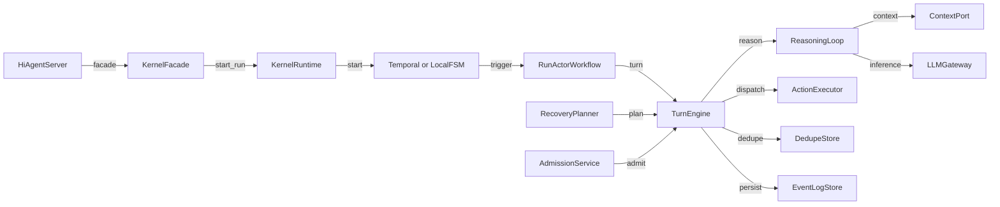
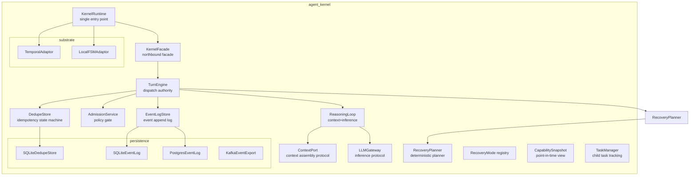
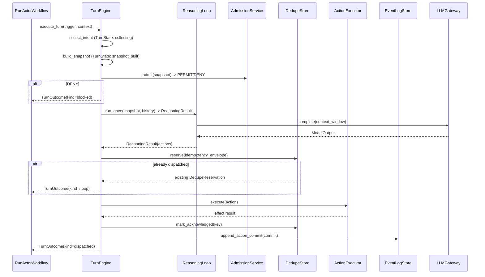
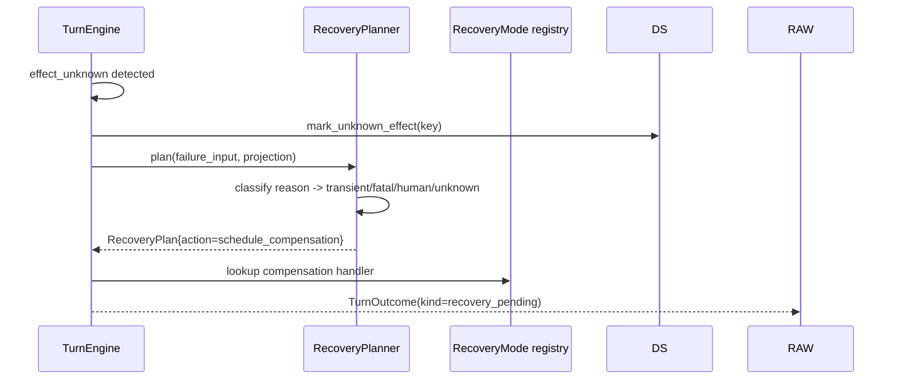

# agent_kernel — Architecture Document

## 1. Introduction & Goals

`agent_kernel` is the execution substrate layer below `hi_agent`. It provides a
formal turn-based execution model with explicit idempotency, admission control,
failure evidence, recovery planning, and pluggable persistence backends
(SQLite, PostgreSQL, Temporal). The kernel is the sole authority for action
dispatch; the `ReasoningLoop` is explicitly not an authority — it only assembles
context and translates model output into candidate `Action` objects.

Key goals:
- Guarantee at-most-once dispatch per action via a `DedupeStore` state machine.
- Provide deterministic failure classification and recovery planning.
- Support both local FSM and Temporal workflow substrates without changing kernel logic.
- Expose a versioned northbound facade (`KernelFacade`) for `hi_agent` server integration.

## 2. Constraints

- `TurnEngine` is the sole dispatch authority; `ReasoningLoop` produces `Action`
  objects but never dispatches them directly.
- Persistence ports (`EventLogStore`, `DedupeStore`) are protocols; concrete
  implementations (SQLite, PostgreSQL, Kafka) are injected.
- `KernelRuntime` is the single entry point; no code outside the kernel should
  wire kernel internals.
- Temporal integration requires `temporalio` SDK; local FSM substrate has no
  external service dependency.
- All async resources obey Rule 5 (one loop, no per-call `asyncio.run`).

## 3. Context

## 4. Solution Strategy

- **TurnEngine as authority**: each turn runs a fixed pipeline — collect intent,
  build snapshot, check admission, dedupe, dispatch, record effect. Side effects
  are observable only through this path.
- **DedupeStore state machine**: states are `reserved`, `dispatched`,
  `acknowledged`, `succeeded`, `unknown_effect`. Once `dispatched`, a duplicate
  `reserve` call returns the existing record, preventing double dispatch.
- **CapabilitySnapshot**: a point-in-time view of available capabilities and their
  idempotency contracts, built once per turn to ensure snapshot consistency.
- **Recovery planner**: `RecoveryPlanner` classifies failure reasons into
  `transient`, `fatal`, `human`, `unknown` and maps them to deterministic
  `RecoveryPlan` actions (`schedule_compensation`, `notify_human_operator`,
  `abort_run`).
- **KernelRuntime**: assembles all kernel services and substrate, exposes a clean
  `start()`/`stop()` lifecycle, and registers the `KernelFacade` for northbound
  callers.

## 5. Building Block View

## 6. Runtime View

### Single Turn Execution

### Recovery Flow

## 7. Deployment View

`KernelRuntime` supports two substrate modes:
- **LocalFSM** (no external service): runs a synchronous FSM in-process;
  suitable for dev, testing, and single-host deployments.
- **Temporal** (external service): connects to a Temporal cluster via
  `temporalio` SDK; suitable for production with durable workflow orchestration.

SQLite persistence files live under `HI_AGENT_DATA_DIR`. PostgreSQL is available
via the `pg_*` port implementations for multi-process deployments.

## 8. Cross-Cutting Concepts

**Posture**: admission service (`StaticDispatchAdmissionService`) and strict-mode
config (`RunActorStrictModeConfig`) tighten gate behavior under research/prod.

**Error handling**: `FailureEnvelope` carries structured failure evidence
(failure_code, effect_status, recovery_mode). `FailureEvidence` applies priority
ordering across concurrent failure signals. No `except: pass` in dispatch path.

**Observability**: `ObservabilityHook` protocol is injected into `ReasoningLoop`
and `KernelRuntime`; `agent_kernel/runtime/observability_hooks.py` provides
concrete hook implementations. OTEL export via `otel_export.py`.

**Idempotency**: every action carries a `RemoteServiceIdempotencyContract`;
`IdempotencyKeyPolicy` derives the `DedupeStore` key from run_id + action_id +
attempt_id.

**Rule 5**: `KernelRuntime` owns the event loop for all async substrate
operations; no per-call `asyncio.run` inside the kernel.

## 9. Architecture Decisions

- **TurnEngine-not-ReasoningLoop as authority**: explicit design principle
  documented in the `ReasoningLoop` docstring. Keeps the authority boundary clear
  for audit and testing.
- **DedupeStore state machine**: 5-state machine (`reserved` → `dispatched` →
  `acknowledged` → `succeeded` / `unknown_effect`) provides exactly-once
  semantics without distributed locks.
- **Temporal substrate optional**: Temporal adds workflow durability and long-run
  recovery; LocalFSM allows zero-dependency CI and dev.
- **`CapabilitySnapshot` per-turn**: a point-in-time snapshot prevents race
  conditions where a capability is unregistered between admission and dispatch.
- **`KernelRuntimeConfig` flat fields + substrate override**: backward-compatible
  flat fields are forwarded to `TemporalSubstrateConfig`; explicit `substrate`
  override enables unit tests with custom substrates.

## 10. Quality Requirements

| Quality attribute | Target |
|---|---|
| At-most-once dispatch | DedupeStore prevents double dispatch on retry |
| Turn latency | < 2 × LLM p95 for all non-LLM work |
| Recovery classification accuracy | Deterministic; no LLM required for planning |
| Persistence durability | EventLog survives process restart under SQLite/PG |
| Substrate swap transparency | Same TurnEngine code runs on Local and Temporal |

## 11. Risks & Technical Debt

- `TurnEngine` 12-state FSM requires test coverage for every transition path; gaps are a correctness risk.
- `ReasoningLoop` uses `Any` for protocol parameters; tighter typing would catch adapter mismatches at import time.
- `KernelRuntime` assumes one `RunActorWorkflow` per process; per-tenant worker pools needed for high-scale multi-tenancy.
- Kafka event export is an optional dependency; missing `confluent-kafka` silently disables it.

## 12. Glossary

| Term | Definition |
|---|---|
| TurnEngine | Sole dispatch authority; runs the snapshot-admission-dedupe-dispatch pipeline |
| ReasoningLoop | Context assembly + LLM inference + output parsing; not a dispatch authority |
| DedupeStore | Idempotency state machine preventing double-dispatch of actions |
| CapabilitySnapshot | Point-in-time view of available capabilities for one turn |
| RecoveryPlanner | Deterministic classifier mapping failure reasons to recovery actions |
| KernelFacade | Versioned northbound API surface for hi_agent server integration |
| KernelRuntime | Single entry point assembling all kernel services and the execution substrate |
| LocalFSM | In-process substrate; no external service dependency |
| TemporalAdaptor | Substrate adaptor connecting the kernel to an external Temporal cluster |
