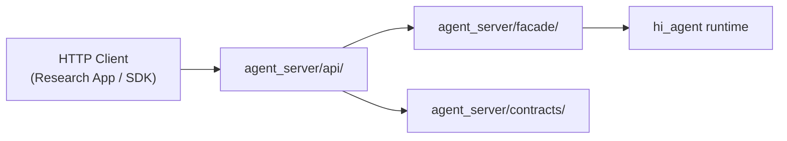
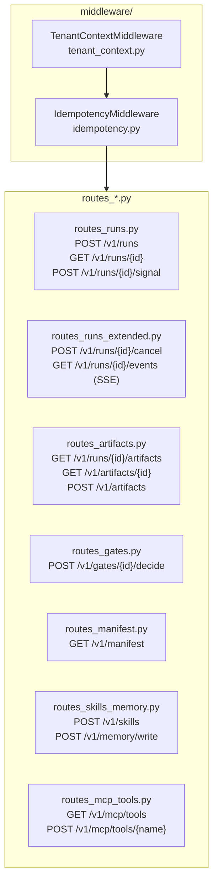
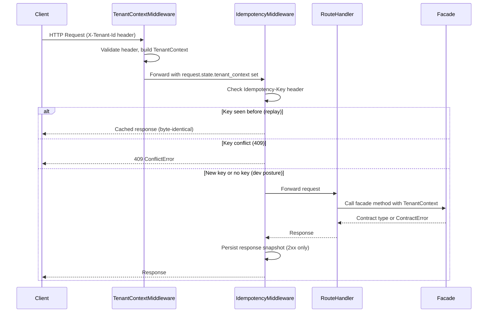

# agent_server/api — Route Handler Taxonomy, Middleware Order, Idempotency Surface

> arc42-aligned architecture document. Source base: Wave 27.
> Owner track: AS-RO

---

## 1. Introduction and Goals

The `api` subpackage is the HTTP boundary of `agent_server`. It translates HTTP
requests into facade calls, enforces tenant isolation, and applies idempotency
guarantees before any business logic executes.

**Goals:**
- Provide a stable, versioned HTTP surface (`/v1/`) over the hi-agent platform.
- Enforce R-AS-1: route handlers import only from `agent_server.contracts` and
  `agent_server.facade` — never from `hi_agent.*`.
- Enforce R-AS-4: tenant identity comes exclusively from `request.state`, not
  from the request body.
- Every route handler carries a `# tdd-red-sha: <sha>` annotation per R-AS-5.

---

## 2. Constraints

- Route handlers MUST NOT import from `hi_agent.*` directly (R-AS-1).
- Tenant context MUST be read from `request.state.tenant_context` (R-AS-4).
- Every new route handler requires a `# tdd-red-sha: <sha>` annotation (R-AS-5).
- Facade modules the handlers depend on must stay ≤200 LOC (R-AS-8).
- Middleware order is fixed at app build time: `TenantContextMiddleware` before
  `IdempotencyMiddleware`.

---

## 3. Context

---

## 4. Solution Strategy

Route handlers are registered via `build_router()` factory functions that accept
injected facade instances. This pattern keeps handler code thin (parse → delegate
→ serialize) and decouples tests from real kernel dependencies.

Middleware is attached once at `build_app` time. Ordering is deterministic: tenant
resolution must complete before idempotency checks run, because the idempotency
store is scoped by `tenant_id`.

---

## 5. Building Block View

### Route Inventory

| Method | Path | File | TDD SHA |
|--------|------|------|---------|
| POST | `/v1/runs` | routes_runs.py | ddc0f0d |
| GET | `/v1/runs/{run_id}` | routes_runs.py | ddc0f0d |
| POST | `/v1/runs/{run_id}/signal` | routes_runs.py | ddc0f0d |
| POST | `/v1/runs/{run_id}/cancel` | routes_runs_extended.py | 3bc0a83 |
| GET | `/v1/runs/{run_id}/events` | routes_runs_extended.py | 3bc0a83 |
| GET | `/v1/runs/{run_id}/artifacts` | routes_artifacts.py | 3bc0a83 |
| GET | `/v1/artifacts/{artifact_id}` | routes_artifacts.py | 3bc0a83 |
| POST | `/v1/artifacts` | routes_artifacts.py | 3bc0a83 |
| POST | `/v1/gates/{gate_id}/decide` | routes_gates.py | e2c8c34a |
| GET | `/v1/manifest` | routes_manifest.py | — |
| POST | `/v1/skills` | routes_skills_memory.py | — |
| POST | `/v1/memory/write` | routes_skills_memory.py | — |
| GET | `/v1/mcp/tools` | routes_mcp_tools.py | e2c8c34a |
| POST | `/v1/mcp/tools/{tool_name}` | routes_mcp_tools.py | e2c8c34a |

---

## 6. Runtime View

---

## 7. Data Flow

Request body is parsed once by the route handler into a typed contract dataclass
(e.g., `RunRequest`). The facade translates this to a plain `dict` for the kernel
callable. The kernel returns a plain `dict`; the facade converts it back to a
contract response type. The handler serializes that to JSON.

Error flow: `ContractError` subclasses carry `http_status`, `tenant_id`, and
`detail`; handlers convert them to a uniform error envelope and return immediately.

---

## 8. Cross-Cutting Concepts

**Tenant isolation (R-AS-4):** Every handler's `_ctx()` helper reads
`request.state.tenant_context`. If the middleware has not set it, the helper
raises `ContractError` (500) immediately.

**Error envelope (HD-5):** All error responses use `{error, message, tenant_id,
detail}`. `AuthError` uses the richer `{error_category, message, retryable,
next_action}` envelope so auth errors are machine-parseable.

**SSE streaming:** `routes_runs_extended.py` returns a `StreamingResponse` with
`media_type="text/event-stream"`. The async generator yields `render_sse_chunk`
output and cooperates with the event loop via `asyncio.sleep(0)`.

**Posture-awareness:** `IdempotencyMiddleware` reads `Posture.from_env()` at
startup; under `research`/`prod` a missing `Idempotency-Key` header on a mutating
route returns HTTP 400.

---

## 9. Architecture Decisions

**AD-1: Factory functions over class-based views.** `build_router(*, facade)` keeps
the DI seam explicit and trivially testable.

**AD-2: Middleware, not handler decorators, for cross-cutting concerns.** Tenant
resolution and idempotency happen once before any handler runs; no handler
forgets to call them.

**AD-3: Sync facade behind async handlers.** Facade methods are synchronous; route
handlers are `async`. The facade delegates to sync kernel callables (or the
`sync_bridge`). This avoids cross-loop resource sharing (Rule 5).

---

## 10. Risks and Technical Debt

| Risk | Severity | Notes |
|------|----------|-------|
| `type: ignore[override]` on middleware `dispatch` | Low | Starlette type-stub gap; annotated `expiry_wave: permanent` (W31-D D-14' — see note below) |
| `request._body = body_bytes` in IdempotencyMiddleware | Low | Private attribute access; annotated `expiry_wave: permanent` (W31-D D-14' — see note below) |
| SSE stream closes after terminal-state replay; live tail is not persistent | Medium | Streaming reconnect not yet implemented |
| `routes_skills_memory.py` and `routes_manifest.py` lack TDD SHA annotations | Low | Pre-R-AS-5 files; retroactive annotation needed |
