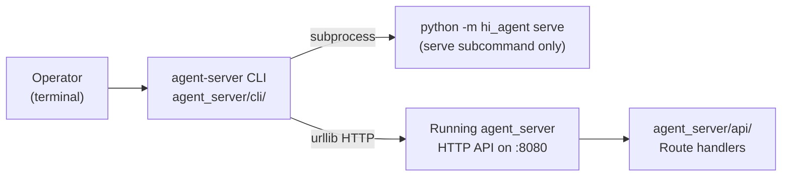
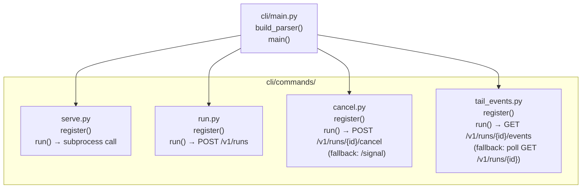
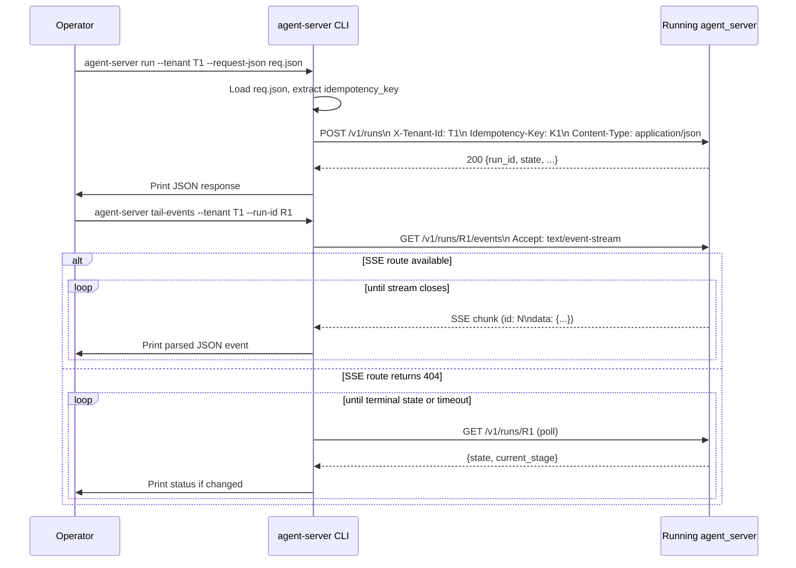

# agent_server/cli — Operator CLI (serve, run, cancel, tail-events)

> arc42-aligned architecture document. Source base: Wave 27.
> Owner track: AS-RO / DX

---

## 1. Introduction and Goals

The `cli` subpackage is the operator-facing command-line interface for
`agent_server`. It provides four subcommands that mirror the HTTP surface of the
northbound API so operators can drive the platform without writing HTTP client code.

**Goals:**
- Provide `agent-server serve` to boot the ASGI server.
- Provide `agent-server run` to submit a run and print the response.
- Provide `agent-server cancel` to cancel a live run.
- Provide `agent-server tail-events` to stream SSE events for a run to stdout.
- Use stdlib HTTP only (no `hi_agent.*` imports, per R-AS-1); the CLI is a thin
  wrapper over HTTP calls to the running server.

---

## 2. Constraints

- The CLI MUST NOT import from `hi_agent.*` (R-AS-1). It communicates with the
  platform exclusively via HTTP to a running `agent_server` instance.
- All HTTP calls use Python stdlib `urllib.request` only — no third-party HTTP
  library dependency.
- The entry point is `agent-server` (registered in `pyproject.toml` under
  `[project.scripts]`).
- `agent-server serve` delegates entirely to `python -m hi_agent serve`; it does
  not start the ASGI app in-process.

---

## 3. Context

---

## 4. Solution Strategy

The CLI is an `argparse`-based dispatcher. `main.py` builds the top-level parser,
registers each subcommand via `register(subparsers)` functions in `commands/`, and
dispatches to the `func` attribute set by `parser.set_defaults(func=run)`.

Each command is self-contained in its own module under `commands/`. Shared utilities
(proxy bypass for localhost) are inlined in each command to avoid a separate utility
module.

The `serve` command delegates to the existing `python -m hi_agent serve` entry point
rather than re-implementing the ASGI startup sequence; this keeps the CLI as a thin
operator wrapper without duplicating the runtime boot logic.

---

## 5. Building Block View

### CLI Flags Summary

| Command | Required flags | Optional flags |
|---------|---------------|---------------|
| `serve` | — | `--host`, `--port`, `--prod` |
| `run` | `--tenant`, `--request-json` | `--server`, `--idempotency-key`, `--timeout` |
| `cancel` | `--tenant`, `--run-id` | `--server`, `--idempotency-key`, `--timeout` |
| `tail-events` | `--tenant`, `--run-id` | `--server`, `--timeout`, `--poll-interval` |

---

## 6. Runtime View

---

## 7. Data Flow

**`serve`:** No data flow through the CLI; the command spawns a subprocess via
`subprocess.call([sys.executable, "-m", "hi_agent", "serve", ...])` and inherits
the calling process environment.

**`run`:** Reads a JSON file from disk → encodes to UTF-8 bytes → POSTs to
`/v1/runs` → prints raw response body to stdout. The `idempotency_key` is taken
from `--idempotency-key` flag, falling back to the `idempotency_key` field in the
request JSON body.

**`cancel`:** Posts empty body to `/v1/runs/{run_id}/cancel`. If the server returns
404 (route not yet present), falls back to `POST /v1/runs/{run_id}/signal` with
`{"signal": "cancel"}`.

**`tail-events`:** Opens a streaming GET to `/v1/runs/{run_id}/events` and reads
lines until EOF or `timeout`. Each blank-line-delimited SSE frame is parsed; `data:`
lines are JSON-decoded and printed. Falls back to polling `GET /v1/runs/{run_id}`
every `--poll-interval` seconds if the SSE route returns 404.

---

## 8. Cross-Cutting Concepts

**Proxy bypass for localhost:** Every command's `_build_opener()` helper creates an
opener with `ProxyHandler({})` when the server URL contains `127.0.0.1` or
`localhost`. This prevents HTTP_PROXY environment variables from interfering with
local development.

**Tenant header propagation:** All commands that make HTTP calls set
`X-Tenant-Id: <args.tenant>` on every request. The CLI never reads tenant identity
from any other source.

**Graceful fallbacks:** Both `cancel` and `tail-events` implement route-version
fallbacks so the CLI works against both pre-W24 and post-W24 server versions.
The fallback path is documented in each command's module docstring.

**Exit codes:** All commands return integer exit codes (`0` = success, `1` = HTTP
error, `2` = argument/parse error). The `main()` function calls `sys.exit(rc)`.

---

## 9. Architecture Decisions

**AD-1: stdlib HTTP only.** Avoids adding `httpx` or `requests` as a CLI-level
dependency. `urllib.request` is sufficient for the four current operations.

**AD-2: `serve` delegates to `python -m hi_agent serve`.** Prevents the CLI from
re-implementing ASGI lifecycle logic and decouples the CLI release cadence from
the runtime startup sequence.

**AD-3: `cancel` tries `/cancel` before `/signal` fallback.** The dedicated
`/cancel` endpoint is the canonical path (W24); the `/signal` fallback ensures the
CLI remains usable against pre-W24 servers during a rolling upgrade.

**AD-4: `tail-events` falls back to polling on 404.** Makes the CLI usable before
the SSE route is available; the fallback is less efficient but correct.

---

## 10. Risks and Technical Debt

| Risk | Severity | Notes |
|------|----------|-------|
| `serve` delegates to `hi_agent` subprocess; version skew between CLI and runtime | Medium | Version pinned via same repo; becomes an issue if packages are released separately |
| `tail-events` fallback polling is 1 Hz by default; not suitable for long-running runs | Low | `--poll-interval` flag allows adjustment |
| No streaming reconnect in `tail-events` SSE path; server restart drops the stream | Medium | Client must re-run the command |
| `type: ignore[type-arg]` annotations on `argparse._SubParsersAction` in all command files | Low | Annotated `expiry_wave: Wave 29` |
| `cancel` sends an empty body to `/cancel`; if the route requires a body in a future version this will break | Low | Version compatibility concern for future contract changes |
