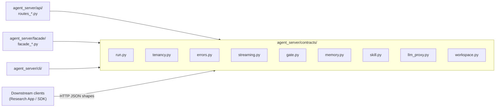
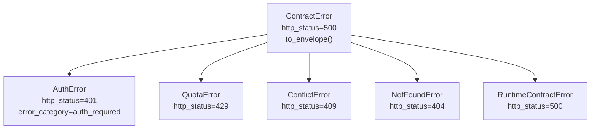

# agent_server/contracts — Contract Versioning, v1 Surface, Freeze Policy

> arc42-aligned architecture document. Source base: Wave 27.
> Owner track: AS-CO

---

## 1. Introduction and Goals

The `contracts` subpackage defines the stable, versioned northbound type schemas
for `agent_server`. It is the single authoritative source for the shapes that
downstream business-layer applications (e.g., the Research Intelligence App) may
depend on.

**Goals:**
- Freeze the v1 type surface after `V1_RELEASED = True`; any breaking change
  requires a `v2/` sub-package.
- Enforce Rule 12 (contract spine completeness): every persistent record carries
  `tenant_id` and the relevant spine fields.
- Provide a machine-checkable digest so CI can detect unauthorized contract changes
  (R-AS-3, `scripts/check_contract_freeze.py`).

---

## 2. Constraints

- All contract types are `@dataclass(frozen=True)` — immutable value objects.
- Every persistent or transmitted record MUST carry `tenant_id` (Rule 12), or be
  explicitly marked `# scope: process-internal` with a rationale.
- After v1 release, any modification to `agent_server/contracts/` invalidates the
  digest snapshot and requires release-captain sign-off.
- Breaking changes (field removal, type change, rename) MUST create
  `agent_server/contracts/v2/` — no in-place breaking modifications.

---

## 3. Context



---

## 4. Solution Strategy

Contract modules define frozen dataclasses only — no methods beyond `__post_init__`
guards or simple derived properties. No business logic lives here.

The error hierarchy (`ContractError` and subclasses) is the only module with
behavior; it provides `to_envelope()` to serialize errors to the unified HD-5 JSON
shape without duplicating logic in every handler.

Version management: the `AGENT_SERVER_API_VERSION = "v1"` constant (set in
`agent_server/__init__.py`) is included in every manifest response so clients can
assert the API version they depend on.

---

## 5. Building Block View

### Dataclass Inventory

| Module | Types | `tenant_id`? | Notes |
|--------|-------|-------------|-------|
| `run.py` | `RunRequest`, `RunResponse`, `RunStatus`, `RunStream` | Yes (all) | Core run lifecycle types |
| `tenancy.py` | `TenantContext`, `TenantQuota`, `CostEnvelope` | Yes (all) | Identity and quota |
| `errors.py` | `ContractError`, `AuthError`, `QuotaError`, `ConflictError`, `NotFoundError`, `RuntimeContractError` | Via `tenant_id` param | Error hierarchy |
| `streaming.py` | `Event`, `EventCursor`, `EventFilter` | Yes (all) | SSE event log types |
| `gate.py` | `PauseToken`, `ResumeRequest`, `GateEvent` | Yes (all) | Human-in-the-loop pause/resume |
| `memory.py` | `MemoryTierEnum`, `MemoryReadKey`, `MemoryWriteRequest` | Yes (all) | Memory tier operations |
| `skill.py` | `SkillRegistration`, `SkillVersion`, `SkillResolution` | Yes (all) | Skill registry |
| `llm_proxy.py` | `LLMRequest`, `LLMResponse` | Yes (both) | LLM proxy contract |
| `workspace.py` | `ContentHash`, `BlobRef`, `WorkspaceObject` | `ContentHash` exempt (process-internal) | Workspace content types |

### Error Hierarchy



### Key Type Details

**RunRequest** — POST /v1/runs body:
```
tenant_id: str          (from TenantContext, not from body directly)
profile_id: str         (required by RunFacade.start)
goal: str
project_id: str = ""
run_id: str = ""        (empty = auto-assigned by kernel)
idempotency_key: str = "" (required by RunFacade.start)
metadata: dict
```

**TenantContext** — injected by TenantContextMiddleware:
```
tenant_id: str   (from X-Tenant-Id header)
project_id: str  (from X-Project-Id header)
profile_id: str  (from X-Profile-Id header)
session_id: str  (from X-Session-Id header)
```

---

## 6. Runtime View

Contracts are pure value objects — they have no runtime behavior beyond
instantiation. The runtime view is therefore described as a data lifecycle:

1. **Request arrival** — `TenantContextMiddleware` builds `TenantContext` from
   HTTP headers; this is the first contract object constructed per request.
2. **Handler parsing** — route handlers construct `RunRequest` (or equivalent)
   from the JSON body plus the `TenantContext`.
3. **Facade call** — contracts are passed to facade methods; the facade validates
   required fields and delegates to kernel callables.
4. **Response construction** — kernel returns `dict`; facade builds `RunResponse` /
   `RunStatus` / etc.
5. **Handler serialization** — handlers call `_run_response_to_dict(resp)` helpers
   to produce the JSON body.

---

## 7. Data Flow

Contracts define the shapes at two boundaries:
- **Inbound**: HTTP JSON body → dataclass (handler responsibility).
- **Outbound**: dataclass → JSON dict (handler's `_*_to_dict` helper
  responsibility).

The `ContractError.to_envelope()` method defines the unified error shape (HD-5):
`{error_category, message, retryable, next_action, tenant_id, detail}`.

---

## 8. Cross-Cutting Concepts

**Spine completeness (Rule 12):** All dataclasses that cross tenant boundaries carry
`tenant_id`. The `ContentHash` type is the only exception; it is a pure value
object exempt under `# scope: process-internal`.

**Freeze gate (R-AS-3):** `scripts/check_contract_freeze.py` computes SHA-256
digests of all files in `agent_server/contracts/`. Once `V1_RELEASED = True`, any
digest mismatch fails CI. Breaking changes require a new `v2/` sub-package.

**Immutability:** All contract dataclasses use `frozen=True`. This prevents
accidental mutation in facade or handler code and makes them safe to cache or
pass across thread boundaries.

---

## 9. Architecture Decisions

**AD-1: Frozen dataclasses, not Pydantic models.** Avoids a heavy validation
library dependency. Contract validation is the facade's responsibility, not the
contract layer's.

**AD-2: Separate `errors.py` module with `to_envelope()`.** Centralizes the HD-5
error shape definition; handlers call `to_envelope()` rather than constructing
error dicts by hand.

**AD-3: `V1_RELEASED = True` (set 2026-04-30, SHA `475fc41`).** The freeze check
is now blocking. Any modification to `agent_server/contracts/` files will fail
`scripts/check_contract_freeze.py` in CI.

**AD-4: Breaking changes require `v2/` sub-package, not in-place edits.** Ensures
downstream clients that pin to `v1` shapes can continue operating while `v2` is
developed in parallel.

---

## 10. Risks and Technical Debt

| Risk | Severity | Notes |
|------|----------|-------|
| `V1_RELEASED = True` since 2026-04-30; freeze is now enforced | Resolved | `V1_FROZEN_HEAD = 475fc41` recorded in `config/version.py` |
| `LLMRequest.model_hint` is advisory with no contract to gateway selection | Low | Model selection governance is the kernel's responsibility |
| `MemoryTierEnum` uses `StrEnum` (Python 3.11+); may fail on older runtimes | Low | Pinned to Python 3.11+ in `pyproject.toml` |
| `workspace.py` has no routes yet; types are forward-declared | Medium | Workspace sub-package is a stub (see workspace.md) |
