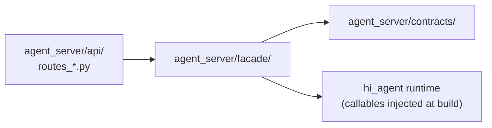
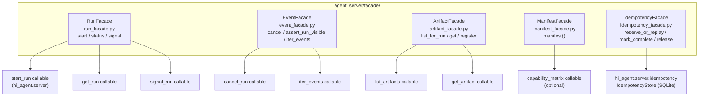
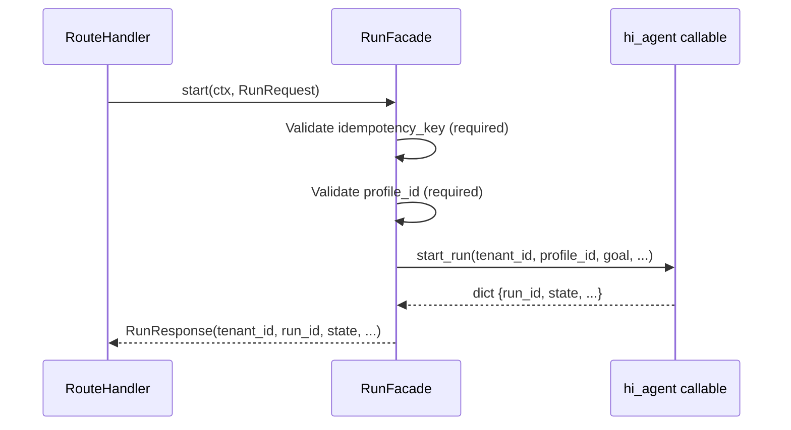

# agent_server/facade — Versioned Northbound Facade Pattern

> arc42-aligned architecture document. Source base: Wave 27.
> Owner track: AS-RO / AS-CO

---

## 1. Introduction and Goals

The `facade` subpackage is the only place in `agent_server/` permitted to touch
`hi_agent` runtime types (R-AS-1). It translates the stable contract types defined
in `agent_server/contracts/` into the mutable callable signatures used by the
`hi_agent` kernel, insulating route handlers from internal API changes.

**Goals:**
- Provide a single controlled seam between the northbound contract layer and the
  `hi_agent` runtime.
- Accept kernel callables via constructor injection so the kernel binding is
  wave-by-wave incremental and stubs are trivial in tests.
- Enforce the 200-LOC budget per facade module (R-AS-8).
- Apply posture-aware validation (Rule 11) before delegating to the kernel.

---

## 2. Constraints

- Each facade module must stay ≤200 LOC (R-AS-8).
- Facades are the ONLY modules in `agent_server/` allowed to `import hi_agent.*`.
- Facades MUST raise `ContractError` subclasses — never raw exceptions — for
  all tenant-visible failures.
- Callable arguments are injected at construction time; facades MUST NOT construct
  kernel objects themselves (Rule 6).

---

## 3. Context

---

## 4. Solution Strategy

Each facade is a thin adapter class that:

1. Accepts kernel-side callables as constructor arguments (`StartRunFn`,
   `GetRunFn`, etc.).
2. Validates contract preconditions (required fields, posture rules) before
   delegating.
3. Converts the kernel's plain `dict` return into a typed contract response.
4. Converts kernel exceptions into typed `ContractError` subclasses.

This design allows the kernel binding to be replaced (stub → real) by passing
different callables, without changing any handler or contract code.

---

## 5. Building Block View

### Facade Method Summary

| Facade | Method | Contract In | Contract Out |
|--------|--------|-------------|--------------|
| RunFacade | `start` | `TenantContext, RunRequest` | `RunResponse` |
| RunFacade | `status` | `TenantContext, run_id` | `RunStatus` |
| RunFacade | `signal` | `TenantContext, run_id, signal, payload` | `RunStatus` |
| EventFacade | `cancel` | `TenantContext, run_id` | `RunStatus` |
| EventFacade | `assert_run_visible` | `TenantContext, run_id` | `RunStatus` |
| EventFacade | `iter_events` | `TenantContext, run_id` | `Iterable[dict]` |
| ArtifactFacade | `list_for_run` | `TenantContext, run_id` | `list[dict]` |
| ArtifactFacade | `get` | `TenantContext, artifact_id` | `dict` |
| ArtifactFacade | `register` | `TenantContext, run_id, type, content, meta` | `dict` |
| ManifestFacade | `manifest` | — | `dict` |
| IdempotencyFacade | `reserve_or_replay` | `tenant_id, key, body` | `(outcome, body|None, status)` |
| IdempotencyFacade | `mark_complete` | `tenant_id, key, response_json, status_code` | None |
| IdempotencyFacade | `release` | `tenant_id, key` | None |

---

## 6. Runtime View

---

## 7. Data Flow

Kernel callables return plain `dict` objects. Facades map dict keys to frozen
contract dataclass fields. Fields not present in the dict fall back to `None` or
sensible defaults — the facade is responsible for all dict-to-dataclass conversion.

The `ArtifactFacade` additionally filters result dicts under strict posture to
drop records with an empty `tenant_id` (HD-4 closure) and performs a SHA-256
content-hash recheck when `content` bytes are present.

The `ManifestFacade` falls back to a hardcoded capability matrix when the optional
`capability_matrix_callable` is not bound, tagging the response with
`posture_matrix_provenance: "hardcoded"` vs `"capability_registry"`.

The `IdempotencyFacade` wraps `hi_agent.server.idempotency.IdempotencyStore`
(SQLite-backed). It owns the body-hash computation (`_canonical_body_hash`) and
strips identity metadata fields (`request_id`, `trace_id`, `_response_timestamp`)
before persisting response snapshots (HD-7 closure).

---

## 8. Cross-Cutting Concepts

**Posture-awareness (Rule 11):** `ArtifactFacade` calls `Posture.from_env()` on
every `list_for_run` and `get` call. The `ManifestFacade` includes posture-aware
capability flags in its hardcoded matrix. `IdempotencyMiddleware` reads posture
once at startup.

**Error translation:** All facades catch kernel exceptions and convert them to
typed `ContractError` subclasses before returning to the handler. Raw kernel
exceptions MUST NOT reach route handlers.

**LOC budget (R-AS-8):** Each facade file is enforced ≤200 LOC by
`scripts/check_facade_loc.py`. Facade logic that risks growing beyond this limit
must be split into a private helper module or extracted to a shared utility.

**Ownership:** Facades are AS-RO track for runtime/execution facades
(`RunFacade`, `EventFacade`, `IdempotencyFacade`) and AS-CO track for
contract-surface facades (`ArtifactFacade`, `ManifestFacade`).

---

## 9. Architecture Decisions

**AD-1: Constructor injection of callables, not objects.** Accepting `Callable[...,
dict]` rather than a `RunManager` instance avoids importing kernel types into the
facade module and keeps the seam minimal.

**AD-2: Sync facade behind async handlers.** Facades are synchronous. This avoids
async resource lifetime issues (Rule 5); the kernel side uses `sync_bridge` for
async resources.

**AD-3: ManifestFacade fallback to hardcoded matrix.** Avoids a hard dependency on
the `CapabilityRegistry` being wired. The provenance tag makes the fallback
detectable by operators and tests.

**AD-4: IdempotencyFacade owns the hash and strip logic.** The middleware is
responsible only for the HTTP lifecycle (read body, forward, capture response);
all persistence and hashing logic lives in the facade so the middleware stays
testable without a database.

---

## 10. Risks and Technical Debt

| Risk | Severity | Notes |
|------|----------|-------|
| No facade for skills/memory; routes_skills_memory.py calls hi_agent directly | High | R-AS-1 violation to be remediated |
| ManifestFacade hardcoded matrix drifts from actual capability state | Medium | Needs binding to CapabilityRegistry in a future wave |
| ArtifactFacade `register_artifact` is optional (may be None) | Low | Returns 400 when not configured; documented behavior |
| `iter_events` returns a synchronous `Iterable`; large event logs will block | Medium | Async generator upgrade tracked as future work |
