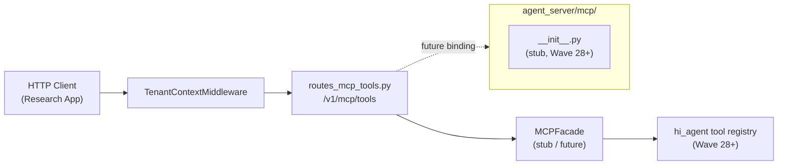
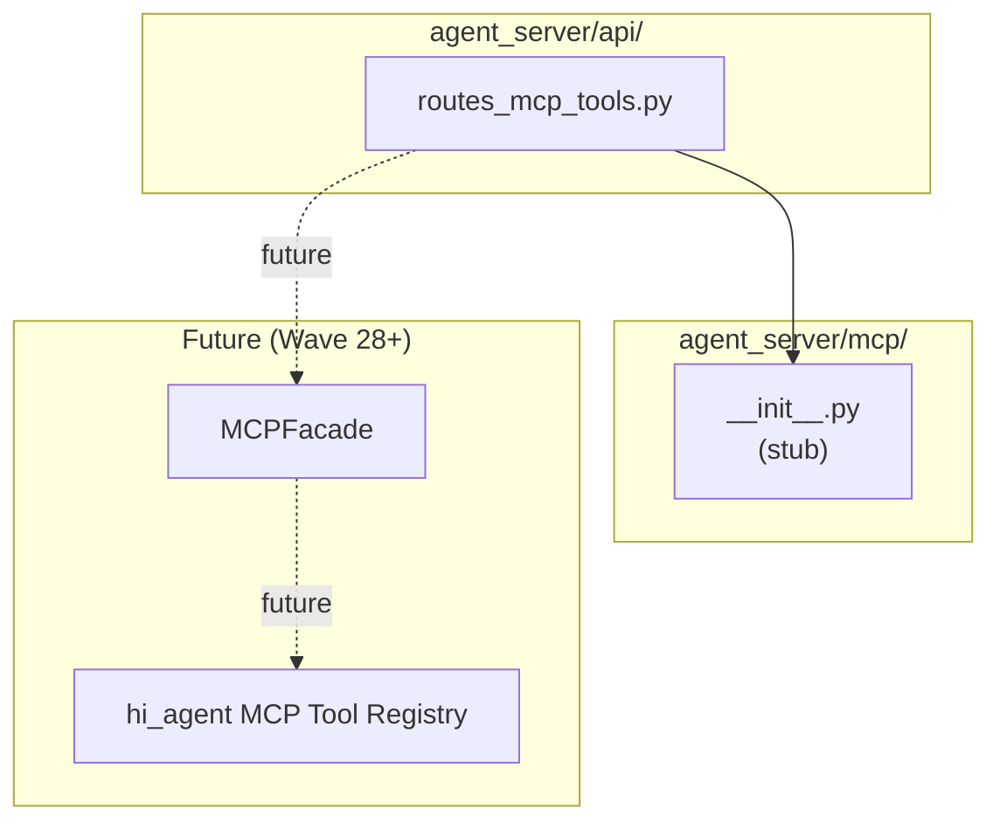
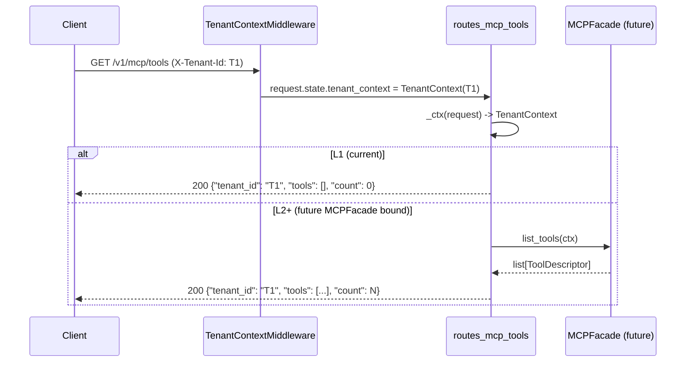

# agent_server/mcp — MCP Protocol Integration, Tool Discovery

> arc42-aligned architecture document. Source base: Wave 27.
> Owner track: AS-RO

---

## 1. Introduction and Goals

The MCP (Model Context Protocol) surface of `agent_server` exposes agent-accessible
tools to the northbound API so downstream clients can discover and invoke tools
registered in the platform without importing `hi_agent.*` directly.

**Goals:**
- Provide a workspace-scoped, tenant-isolated HTTP interface for MCP tool discovery
  (`GET /v1/mcp/tools`) and invocation (`POST /v1/mcp/tools/{tool_name}`).
- Follow R-AS-1: route handlers import only from `agent_server.contracts` and
  `agent_server.facade`.
- Reach maturity L2 (public contract, stable routes) by binding a real `MCPFacade`
  in a future wave; current state is L1 (tested component, stub responses).

---

## 2. Constraints

- Route handlers in `agent_server/api/routes_mcp_tools.py` MUST NOT import from
  `hi_agent.*` (R-AS-1).
- Tool invocation is workspace-scoped: each tenant sees only the tools registered
  for their workspace.
- The `agent_server/mcp/` subpackage currently contains only a stub `__init__.py`.
  MCP integration hooks are planned for Wave 28+.
- Per R-AS-5, both route handlers carry `# tdd-red-sha: e2c8c34a`.

---

## 3. Context

---

## 4. Solution Strategy

At Wave 27 the MCP surface is at L1 maturity: the routes exist with correct tenant
scoping and error handling, but both `GET /v1/mcp/tools` and
`POST /v1/mcp/tools/{tool_name}` return stub responses.

`build_router()` accepts no facade argument at L1 — a comment in the source
documents that an `MCPFacade` keyword argument can be added without a breaking
change. When bound, the facade will delegate to the hi_agent tool registry.

The `agent_server/mcp/` sub-package is reserved for MCP-specific integration
hooks (e.g., MCP server session management, tool schema negotiation) that are
distinct from the HTTP route layer.

---

## 5. Building Block View

### Current Route Behavior (L1)

| Endpoint | Method | Current Response | Future Behavior |
|----------|--------|-----------------|-----------------|
| `/v1/mcp/tools` | GET | `{"tools": [], "count": 0}` | Workspace-scoped tool list |
| `/v1/mcp/tools/{tool_name}` | POST | 404 `NotFoundError` | Invoke registered tool |

---

## 6. Runtime View

---

## 7. Data Flow

At L1, no data flows to or from the tool registry. The route handler reads the
`TenantContext` from `request.state` and returns a constant empty list with the
`tenant_id` included for traceability.

At L2+ (planned), the flow will be:
1. Route handler receives `TenantContext` from middleware.
2. Handler calls `MCPFacade.list_tools(ctx)` or `MCPFacade.invoke(ctx, tool_name, args)`.
3. Facade translates to `hi_agent` tool registry calls (workspace-scoped).
4. Facade returns typed tool descriptors or invocation results.
5. Handler serializes to JSON.

---

## 8. Cross-Cutting Concepts

**Tenant isolation:** Tool discovery and invocation are workspace-scoped; the
`TenantContext` (carrying `tenant_id` and `project_id`) constrains the visible
tool set. Under L2+ the facade will pass `ctx.tenant_id` to every registry call.

**Error handling:** Both handlers follow the same `ContractError` → `_error_response`
pattern as all other routes. `NotFoundError` (404) is returned for unknown tool
names; `AuthError` (401) is produced by `TenantContextMiddleware` for missing
`X-Tenant-Id`.

**Stub-safe build_router:** `build_router()` currently takes no arguments. The
facade injection point is documented in a comment, so the L2 upgrade will be a
non-breaking backward-compatible change.

---

## 9. Architecture Decisions

**AD-1: Routes in `agent_server/api/routes_mcp_tools.py`, not in
`agent_server/mcp/`.** MCP route handlers are HTTP concerns (R-AS-1 compliance,
middleware pipeline); the `mcp/` package is for protocol-level integration logic.

**AD-2: L1 returns empty list rather than 501 Not Implemented.** Empty list is a
valid "no tools registered" state; clients can handle it without special-casing
the maturity level.

**AD-3: Deferred MCPFacade injection.** Optional facade argument in `build_router`
avoids forcing the Wave 28 integration to touch the route file for the simple case
of binding an implementation.

---

## 10. Risks and Technical Debt

| Risk | Severity | Notes |
|------|----------|-------|
| `agent_server/mcp/__init__.py` is empty; no MCP session management | High | Wave 28 work item; blocking L2 maturity |
| No contract types defined for `ToolDescriptor` or `ToolInvocationResult` | High | Must be defined in `agent_server/contracts/` before L2 |
| Tool invocation POST always returns 404 at L1 | Medium | Expected at this maturity; must not be mistaken for a regression |
| No posture-aware guard on tool invocation (e.g., prod may restrict tools) | Medium | Needed at L3 |
