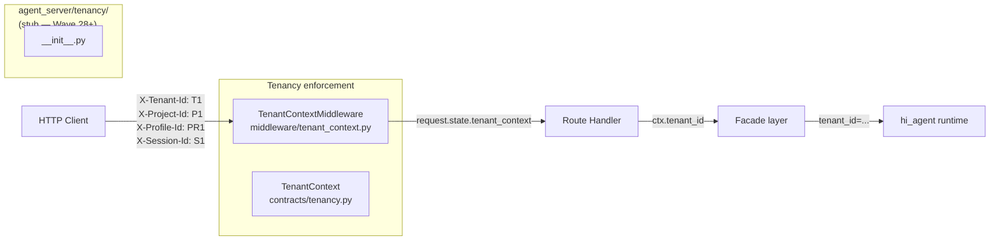
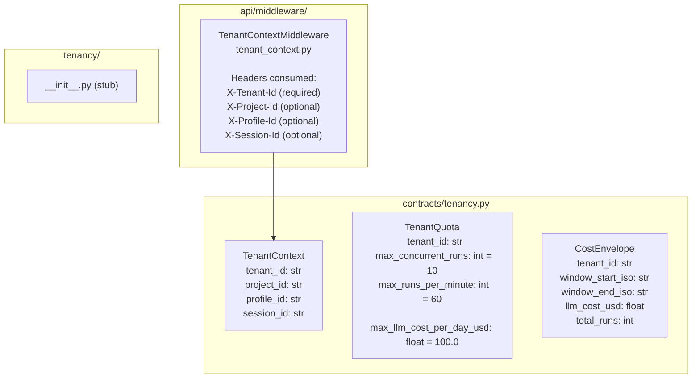
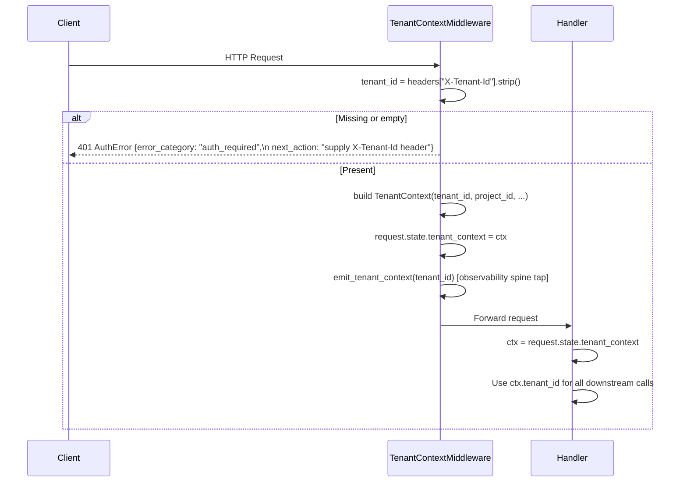

# agent_server/tenancy — Tenant Scoping and Per-Tenant Isolation Invariants

> arc42-aligned architecture document. Source base: Wave 27.
> Owner track: AS-RO / AS-CO

---

## 1. Introduction and Goals

Tenant isolation is a platform-level invariant: every request is associated with
exactly one `tenant_id` and no data from one tenant is visible to another. The
`tenancy` subpackage, the `contracts/tenancy.py` contract module, and the
`middleware/tenant_context.py` middleware together implement this invariant.

**Goals:**
- Enforce that every HTTP request carries a valid `X-Tenant-Id` header before
  reaching any route handler.
- Inject a `TenantContext` into `request.state` as the single authoritative
  identity object for the request lifetime.
- Ensure all contract types, facade calls, and kernel callables carry `tenant_id`
  as a required field (Rule 12 compliance).

---

## 2. Constraints

- `agent_server/tenancy/__init__.py` is currently a stub (empty). The tenancy
  enforcement logic lives in `agent_server/api/middleware/tenant_context.py`
  (middleware) and `agent_server/contracts/tenancy.py` (types).
- Route handlers MUST read `TenantContext` from `request.state`, never from the
  request body (R-AS-4).
- The `X-Tenant-Id` header is required on all routes under `/v1/`. A missing or
  empty header returns HTTP 401 `AuthError`.
- Idempotency keys are scoped by `tenant_id`; cross-tenant key collisions are
  structurally impossible.

---

## 3. Context

---

## 4. Solution Strategy

Tenant resolution is a middleware-level concern, not a handler concern. A single
middleware (`TenantContextMiddleware`) reads and validates the `X-Tenant-Id` header,
constructs a `TenantContext`, and attaches it to `request.state`. Every downstream
handler then reads from `request.state.tenant_context` via a shared `_ctx(request)`
helper.

This creates a strict data flow: the middleware is the single source of tenant
identity; handlers and facades are consumers only.

The `agent_server/tenancy/` subpackage is reserved for future per-tenant quota
enforcement, rate-limiting, and billing integration. At Wave 27 it contains only
a stub `__init__.py`.

---

## 5. Building Block View

### Isolation Invariants

| Layer | Invariant |
|-------|-----------|
| Middleware | Missing `X-Tenant-Id` → 401, request never reaches a handler |
| Handlers | `_ctx(request)` raises `ContractError` (500) if `request.state.tenant_context` is not a `TenantContext` |
| Facades | All facade methods accept `TenantContext` as first argument; `tenant_id` is passed to every kernel callable |
| Idempotency | `IdempotencyFacade` scopes all store operations by `tenant_id`; `reserve_or_replay` raises `ValueError` on empty `tenant_id` |
| Contracts (Rule 12) | All persistent contract dataclasses carry `tenant_id`; `check_contract_spine_completeness.py` enforces this |

---

## 6. Runtime View

---

## 7. Data Flow

The `TenantContext` object flows read-only from middleware to handler to facade to
kernel. No layer may modify it. The four context fields map directly to HTTP
request headers:

| HTTP Header | `TenantContext` field | Required |
|-------------|----------------------|----------|
| `X-Tenant-Id` | `tenant_id` | Yes (401 if absent) |
| `X-Project-Id` | `project_id` | No (empty string default) |
| `X-Profile-Id` | `profile_id` | No (empty string default) |
| `X-Session-Id` | `session_id` | No (empty string default) |

The `TenantQuota` and `CostEnvelope` types are forward declarations for the
quota enforcement planned in the `tenancy/` subpackage. They are not yet wired
into any middleware or route handler.

---

## 8. Cross-Cutting Concepts

**Observability spine tap:** `TenantContextMiddleware` calls
`hi_agent.observability.spine_events.emit_tenant_context(tenant_id=...)` inside a
bare `except Exception: pass` guard so a failing spine emitter never blocks the
request (Rule 7 exemption noted in source comment).

**Idempotency cross-tenant safety:** The `IdempotencyFacade.reserve_or_replay`
method requires a non-empty `tenant_id` and passes it to the `IdempotencyStore`.
Store operations are scoped to `(tenant_id, idempotency_key)` pairs; tenant A
cannot observe tenant B's idempotency records.

**Future quota enforcement:** `TenantQuota` fields (`max_concurrent_runs`,
`max_runs_per_minute`, `max_llm_cost_per_day_usd`) are defined in the contract
layer now so downstream clients can rely on their shape once enforcement is wired.

---

## 9. Architecture Decisions

**AD-1: Header-based tenant identity, not JWT claims.** Keeps the middleware
dependency-free (stdlib + starlette) and allows the platform team to add JWT
validation as an optional wrapper without changing handler code.

**AD-2: `TenantContext` as a frozen dataclass, not a dict.** Type-safe field access
prevents handler code from mistyping header names and makes contract spine auditing
(Rule 12) static-analysis friendly.

**AD-3: `tenancy/` sub-package stubbed for Wave 28+.** Quota enforcement and billing
integration are separate concerns from identity resolution; deferring them avoids
premature abstraction in the middleware layer.

---

## 10. Risks and Technical Debt

| Risk | Severity | Notes |
|------|----------|-------|
| `agent_server/tenancy/` is a stub with no quota enforcement | High | `TenantQuota` defined but not enforced; concurrent-run limits not applied |
| `X-Tenant-Id` is a plain string header with no authentication | High | No HMAC or JWT verification; suitable for internal/research deployment only |
| `CostEnvelope` is defined but never populated | Medium | Billing integration is a Wave 28+ item |
| `emit_tenant_context` spine tap uses bare `except Exception: pass` | Low | Intentional Rule 7 exemption; spine failures must not block requests |
