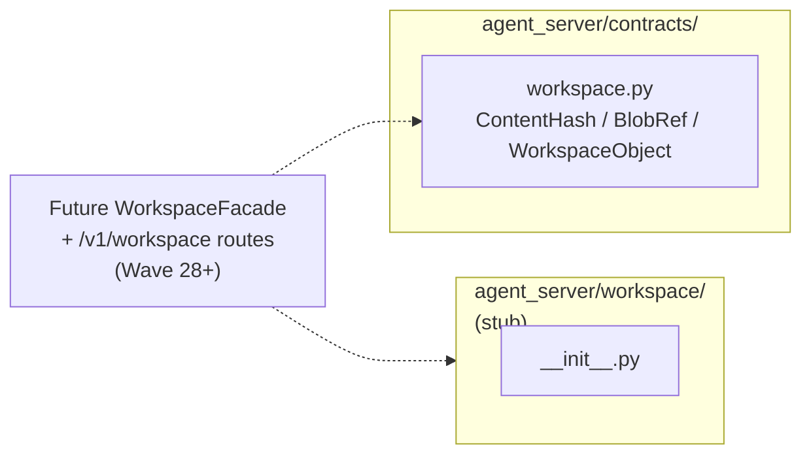
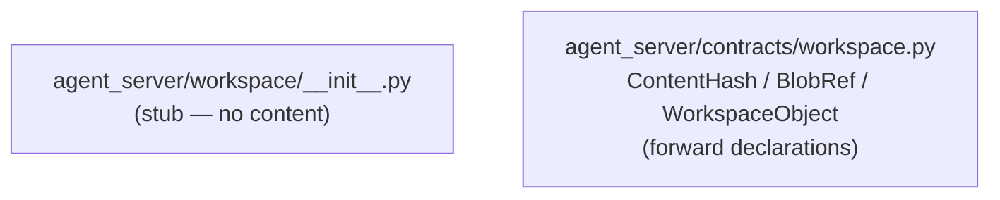
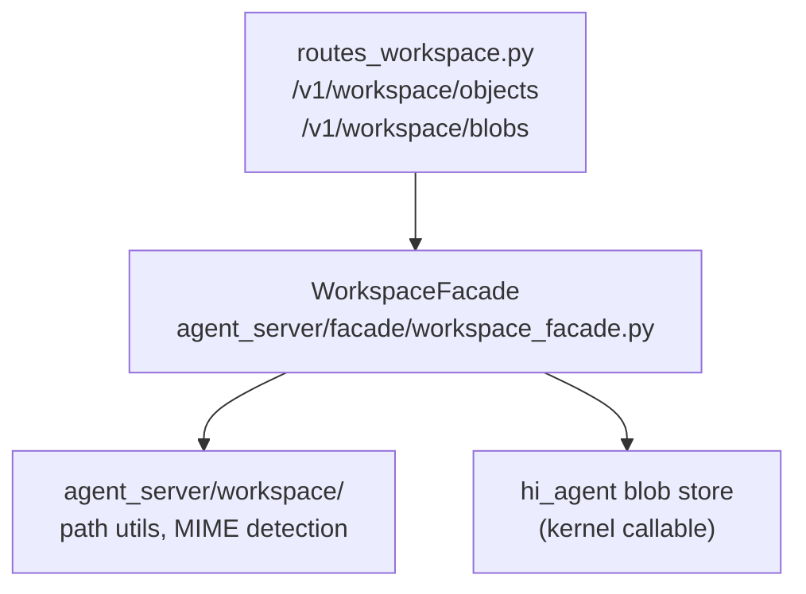
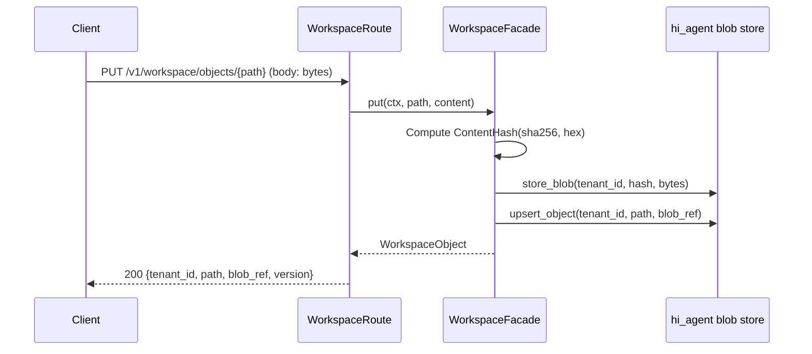

# agent_server/workspace — Workspace Lifecycle

> arc42-aligned architecture document. Source base: Wave 27.
> Owner track: AS-RO

---

## 1. Introduction and Goals

The `workspace` subpackage is intended to provide per-tenant workspace isolation:
a content-addressed file tree that isolates artifacts, blobs, and workspace objects
between tenants. At Wave 27 this subpackage is a stub.

**Goals (planned, Wave 28+):**
- Provide a content-addressed blob store (`BlobRef`, `WorkspaceObject`) per tenant.
- Enforce that workspace operations are scoped by `tenant_id` and `project_id`.
- Expose workspace reads and writes through a `WorkspaceFacade` and a set of
  `/v1/workspace/...` routes (not yet implemented).

---

## 2. Current State: Stub

**The `agent_server/workspace/` subpackage is currently a stub.** Its
`__init__.py` contains only the docstring `"""workspace subpackage."""`. No
facade, no route handlers, no operational code exists.

The contract types for workspaces are defined in `agent_server/contracts/workspace.py`:

| Type | Fields | Notes |
|------|--------|-------|
| `ContentHash` | `algorithm`, `hex_digest` | `# scope: process-internal` (Rule 12 exemption) |
| `BlobRef` | `tenant_id`, `content_hash`, `size_bytes`, `media_type` | Blob identity |
| `WorkspaceObject` | `tenant_id`, `path`, `blob_ref`, `version`, `created_at` | File-tree entry |

These types are forward declarations. No routes reference them yet.

---

## 3. Context

---

## 4. Solution Strategy (Planned)

When workspace support is implemented:

1. A `WorkspaceFacade` will be added to `agent_server/facade/` following the same
   constructor-injection pattern as `RunFacade` and `ArtifactFacade`.
2. Route handlers under `agent_server/api/routes_workspace.py` will provide
   `/v1/workspace/objects` (list), `/v1/workspace/objects/{path}` (get/put), and
   `/v1/workspace/blobs/{hash}` (content-addressed get).
3. The `agent_server/workspace/` subpackage will house workspace-specific utilities
   (e.g., path canonicalization, MIME detection) that do not belong in the facade
   or route layer.
4. All operations will be scoped by `TenantContext.tenant_id` and
   `TenantContext.project_id`.

---

## 5. Building Block View

Current (Wave 27):

Planned (Wave 28+):

---

## 6. Runtime View

No operational runtime view exists at Wave 27. When implemented, the key flow is:

---

## 7. Data Flow

Not applicable at Wave 27. See planned flow above.

---

## 8. Cross-Cutting Concepts

**Content addressing:** `BlobRef` identifies blobs by their SHA-256 hash, not by
name. This makes deduplication and integrity checking straightforward.

**Rule 12 exemption for `ContentHash`:** `ContentHash` is a pure value object
(algorithm + hex_digest). It is never stored or transmitted as a standalone record;
`BlobRef` carries the `tenant_id`. The `# scope: process-internal` annotation
documents this exemption.

**Posture-aware defaults (Rule 11, planned):** Under `dev`, workspace operations
should allow in-memory blob storage. Under `research`/`prod`, a durable store is
required.

---

## 9. Architecture Decisions

**AD-1: Stub now, implement in Wave 28+.** Workspace support requires a blob store
backend decision (local filesystem vs. object storage). That decision is deferred
until research team workspace patterns are clearer.

**AD-2: Contract types forward-declared in Wave 27.** Defining `BlobRef` and
`WorkspaceObject` now lets downstream teams prepare integration code without
waiting for the full implementation.

**AD-3: Content addressing over path-based storage.** SHA-256 hashing prevents
silent data corruption, supports deduplication across tenants sharing the same
artifact content, and simplifies integrity checking.

---

## 10. Risks and Technical Debt

| Risk | Severity | Notes |
|------|----------|-------|
| `agent_server/workspace/` is a stub with no implementation | Critical | Blocks any workspace-dependent downstream feature |
| No routes for workspace objects exist | Critical | `/v1/workspace/...` paths are not registered |
| No `WorkspaceFacade` exists | High | Prevents injection-pattern compliance for workspace |
| `WorkspaceObject.version` is an integer with no concurrency control | Medium | Optimistic locking or CAS semantics needed at L3 |
| Blob store backend not chosen | High | Local filesystem, S3, or hi_agent VFS TBD |
