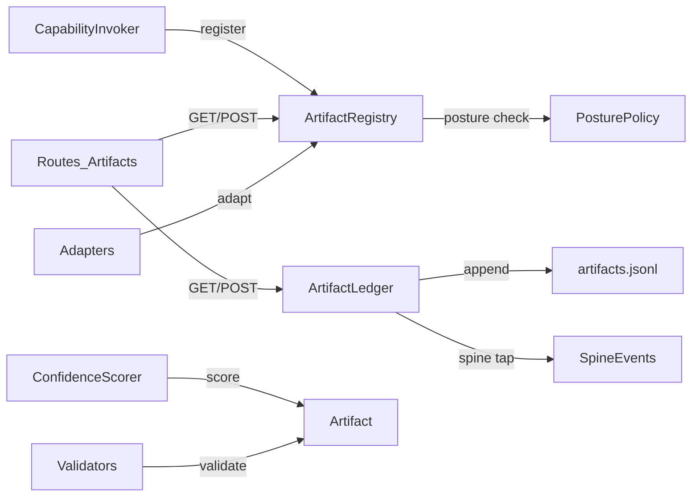
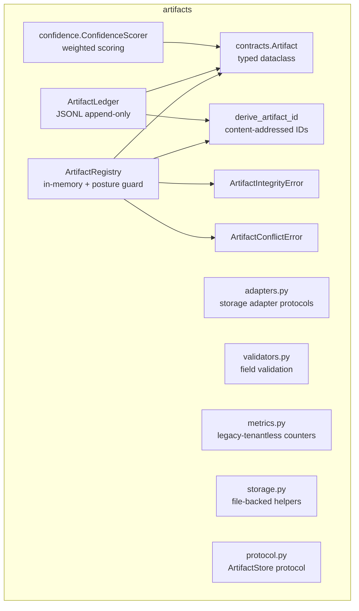
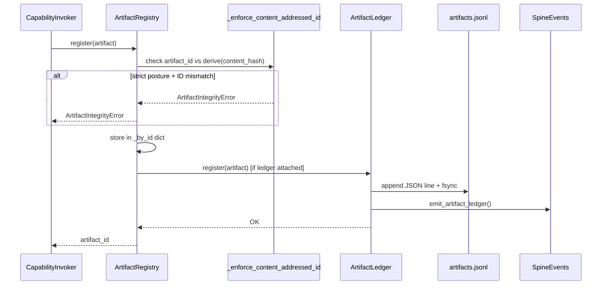
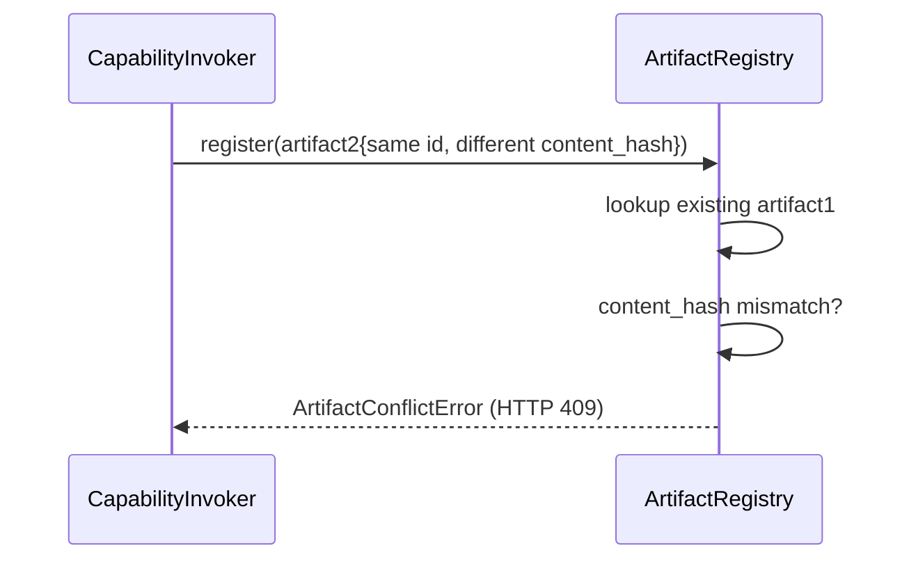

# hi_agent_artifacts — Architecture Document

## 1. Introduction & Goals

The artifacts subsystem provides a typed, content-addressed, tenant-scoped
evidence store for all data produced by agent capabilities. It separates an
in-memory `ArtifactRegistry` (dev, ephemeral) from a durable JSONL-backed
`ArtifactLedger` (research/prod), enforces content-addressable ID derivation,
and tracks silent-degradation events per Rule 7.

Key goals:
- Content-addressable IDs for document, resource, structured_data, and evidence
  types: `artifact_id = art_<first 24 hex chars of SHA-256 content_hash>`.
- Prevent ID drift between writers via `ArtifactIntegrityError` under
  research/prod posture.
- Tenant/project/run spine fields on every artifact record (Rule 12).
- Pluggable storage adapters for future backends beyond JSONL.

## 2. Constraints

- `ArtifactLedger` requires `HI_AGENT_DATA_DIR` under research/prod; missing env
  var raises `ValueError` at construction (not at first write).
- `ArtifactLedger` is thread-safe via a single `threading.Lock`; no async writes.
- Artifacts are append-only; an `artifact_id` collision with different
  `content_hash` raises `ArtifactConflictError` (HTTP 409).
- `Artifact` dataclass carries `tenant_id`, `user_id`, `session_id`,
  `team_space_id`, `project_id`, `producer_run_id`, `producer_stage_id` (Rule 12).

## 3. Context

## 4. Solution Strategy

- **Two-tier storage**: `ArtifactRegistry` is always in-memory; under
  research/prod it delegates to `ArtifactLedger` for durability.
- **Content-addressing**: `derive_artifact_id(content_hash)` generates
  deterministic IDs; the `_enforce_content_addressed_id` guard runs on every
  write. Under dev posture it auto-corrects and warns; under strict posture it
  raises.
- **Posture-aware path selection**: `_resolve_ledger_path` inspects posture at
  construction; the ledger is fully configured before the first write can occur.
- **Confidence scoring**: `Artifact.confidence` is set by `ConfidenceScorer` using
  a weighted combination of evidence count, producer reliability, and source refs.

## 5. Building Block View

## 6. Runtime View

### Write a Content-Addressable Artifact

### Conflict Detection

## 7. Deployment View

`ArtifactLedger` writes to `HI_AGENT_DATA_DIR/artifacts.jsonl` (e.g.
`./hi_agent_data/artifacts.jsonl`). The file is created on first write with
`parents=True`. Reads replay the full file on construction; under high artifact
counts this could be slow (see Risks). No external service required.

## 8. Cross-Cutting Concepts

**Posture**: `ArtifactLedger` construction fails-fast under research/prod if
`HI_AGENT_DATA_DIR` is missing. `ArtifactRegistry._enforce_content_addressed_id`
auto-corrects under dev but raises under strict posture.

**Error handling**: `ArtifactConflictError` maps to HTTP 409 at the route layer.
`ArtifactIntegrityError` maps to HTTP 422. Both carry enough context for clients
to determine next action.

**Observability**: `hi_agent_ledger_errors_total` counter tracks write failures.
`hi_agent_spine_artifact_ledger_total` is incremented per ledger write.
`legacy_tenantless_denied_total` and `legacy_tenantless_visible_total` track
migration hygiene.

**Rule 12**: every `Artifact` carries `tenant_id`, `user_id`, `session_id`,
`team_space_id`, `project_id`, `producer_run_id`, `producer_stage_id`.

## 9. Architecture Decisions

- **JSONL append-only**: simple file format with fsync-per-write; supports
  crash recovery by replaying lines. Avoids SQLite for artifact data to keep
  the data format human-inspectable.
- **Two-tier design**: in-memory registry provides O(1) reads; ledger provides
  durability. Under dev posture, the ledger is skipped entirely to avoid disk I/O
  in tests.
- **`derive_artifact_id` collision resistance**: 96-bit derived IDs; collision
  probability negligible for in-corpus sizes (< 10^9 artifacts per tenant).
- **`ConfidenceScorer` as separate module**: keeps scoring policy testable
  independently of storage; can be replaced without touching `Artifact`.

## 10. Quality Requirements

| Quality attribute | Target |
|---|---|
| ID determinism | Same content_hash always produces same artifact_id |
| Write durability | fsync after every append under research/prod |
| Conflict safety | ArtifactConflictError on hash mismatch; no silent overwrite |
| Spine completeness | All 7 spine fields populated before ledger write |

## 11. Risks & Technical Debt

- Full-file replay on construction (`_load`) is O(n) in artifact count;
  large deployments will need an index or SQLite migration.
- `ArtifactRegistry` is in-memory; a separate `ArtifactLedger` instance is not
  automatically kept in sync if artifacts are registered via the registry alone
  without the ledger attached.
- `adapters.py` and `protocol.py` define protocol stubs; not all adapter methods
  have concrete implementations beyond the JSONL ledger.

## 12. Glossary

| Term | Definition |
|---|---|
| ArtifactLedger | Durable JSONL append-only store; required under research/prod |
| ArtifactRegistry | In-memory store used in dev or as a cache layer |
| content_hash | SHA-256 hex digest of artifact content; basis for derive_artifact_id |
| ArtifactIntegrityError | Raised when stored artifact_id does not match content-derived ID |
| ArtifactConflictError | Raised on write that would replace existing artifact with different content |
