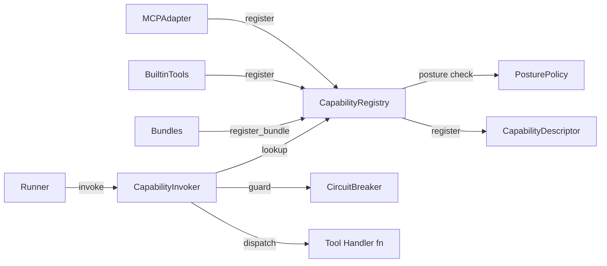
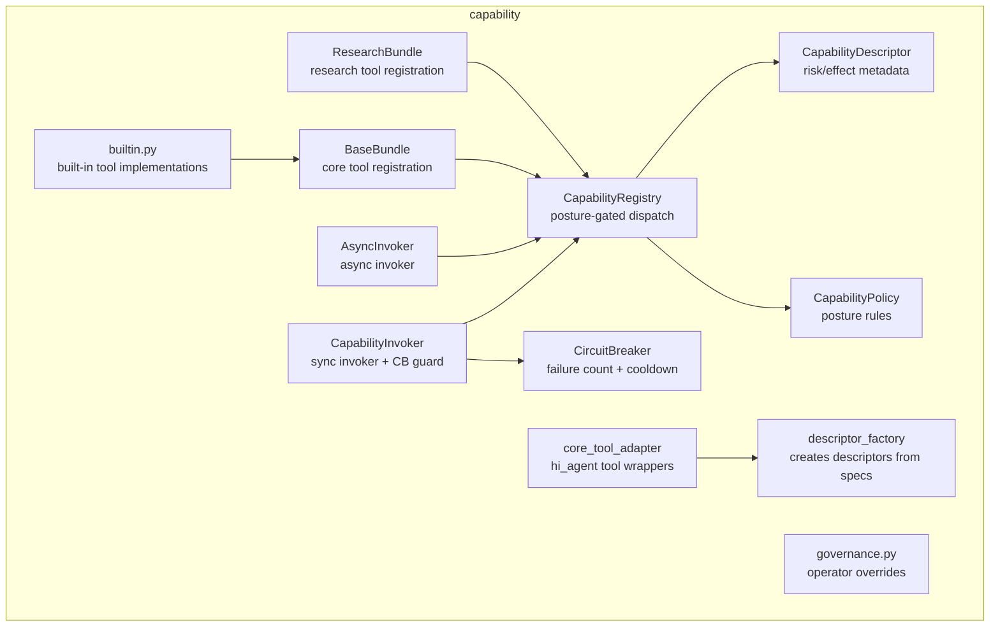
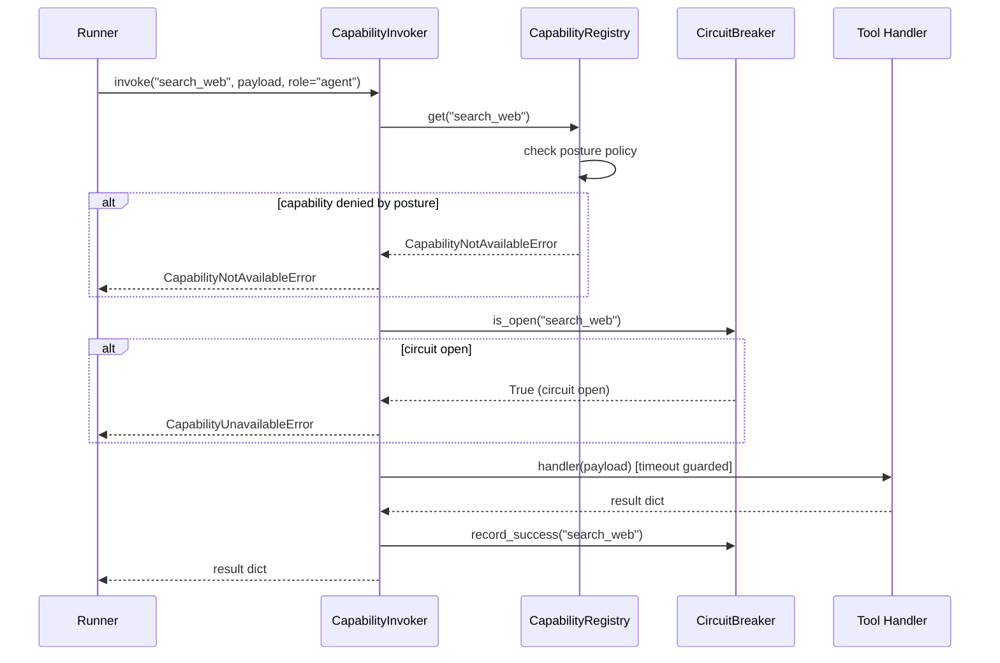
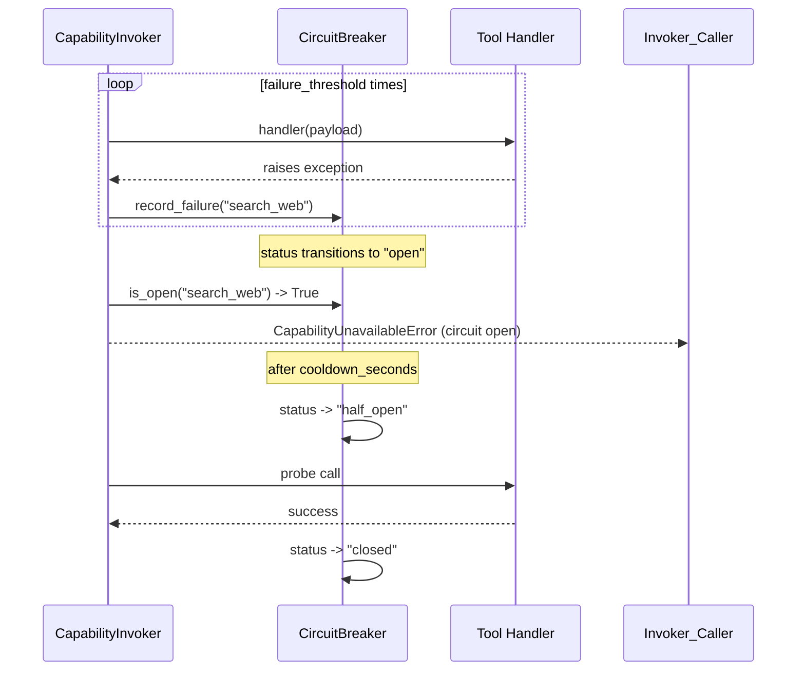

# hi_agent_capability — Architecture Document

## 1. Introduction & Goals

The capability subsystem provides a governed registry of tools and actions
available to the agent runtime. It enforces posture-aware access control,
per-capability circuit breaking, and risk classification without coupling to
any business-specific tool implementation.

Key goals:
- Provide a single `CapabilityRegistry` that owns all registered capabilities and
  enforces posture-policy denials at dispatch time.
- Protect the agent runtime from cascading failures via per-capability
  `CircuitBreaker`.
- Decouple tool definitions from the agent core via descriptor-based metadata
  (`CapabilityDescriptor`) and bundle abstractions.
- Support both sync and async invocation paths through `CapabilityInvoker` and
  `AsyncInvoker`.

## 2. Constraints

- Posture is read from `HI_AGENT_POSTURE` env var via `Posture.from_env()`; never
  hard-coded.
- Inline fallback (`x or DefaultX()`) is forbidden (Rule 6); capabilities must be
  registered explicitly before use.
- `CapabilityNotAvailableError` is a structured 400 envelope, not a generic
  exception; route handlers must not string-match it.
- `CircuitBreaker` optionally persists state to SQLite; in-memory state is the
  default.

## 3. Context

## 4. Solution Strategy

- **Descriptor-first registration**: every capability is registered with a
  `CapabilityDescriptor` carrying risk class, effect class, posture availability
  flags, sandbox level, and tags.
- **Posture-gated dispatch**: `CapabilityRegistry.invoke` evaluates the descriptor
  against the active posture before dispatching. Denied capabilities raise
  `CapabilityNotAvailableError` with a structured envelope.
- **Circuit breaker guard**: `CapabilityInvoker` wraps each dispatch in the
  circuit breaker; consecutive failures above `failure_threshold` open the
  circuit for `cooldown_seconds`.
- **Bundle abstraction**: `ResearchBundle` and `BaseBundle` are factory objects
  that register related capabilities in a single call, keeping server startup
  clean.

## 5. Building Block View

## 6. Runtime View

### Sync Capability Invocation

### Circuit Open Sequence

## 7. Deployment View

The `CapabilityRegistry` is a process-scoped singleton created by
`SystemBuilder`. Bundle registrations happen at startup. `CircuitBreaker` SQLite
state is stored at `HI_AGENT_DATA_DIR/circuit_breaker.sqlite` when `db_path` is
provided; otherwise in-memory. No external service required.

## 8. Cross-Cutting Concepts

**Posture**: `CapabilityDescriptor` has `available_in_dev`, `available_in_research`,
`available_in_prod` flags. Under research/prod, capabilities without explicit
`available_in_research=True` are denied. `hi_agent_capability_posture_denied_total`
counter tracks denials.

**Error handling**: `CapabilityNotAvailableError` (posture denial) and
`CapabilityUnavailableError` (probe/circuit failure) are distinct typed exceptions
that map to HTTP 400 and 503 respectively.

**Observability**: `hi_agent_capability_registry_errors_total` and
`hi_agent_capability_invoker_errors_total` counters are incremented on failures.
`hi_agent_spine_capability_handler_total` is incremented per dispatch.

**Security**: `RiskClass` on `CapabilityDescriptor` gates shell/credential-class
capabilities behind an explicit `approver/admin` role check in `CapabilityInvoker`.

## 9. Architecture Decisions

- **Descriptor frozen dataclass**: immutable descriptor prevents accidental
  mutation after registration, making posture policy evaluation deterministic.
- **CapabilityNotAvailableError.to_envelope()**: returns a machine-parseable
  dict so route handlers can return 400 without string-matching exception
  messages.
- **SQLite-optional CircuitBreaker**: in-memory default keeps the test profile
  `default-offline` network-free; SQLite opt-in provides cross-restart state
  for production.
- **Bundle pattern**: grouping related tools into a bundle reduces the API surface
  of `SystemBuilder` and makes capability sets testable as a unit.

## 10. Quality Requirements

| Quality attribute | Target |
|---|---|
| Posture enforcement | 100% of descriptors evaluated before dispatch |
| Circuit breaker recovery | Half-open probe within cooldown_seconds |
| Registry lookup latency | O(1) dict lookup |
| Test coverage | Unit tests for each RiskClass denial path |

## 11. Risks & Technical Debt

- `CapabilityInvoker` sync timeouts share the 8-worker `AsyncBridgeService` pool; heavy load can starve other bridge users.
- `governance.py` operator overrides are loaded at startup; dynamic changes require a process restart.
- `descriptor_factory` uses `Any` return types pending a shared protocol definition.

## 12. Glossary

| Term | Definition |
|---|---|
| CapabilityDescriptor | Immutable metadata: risk class, effect class, posture flags, tags |
| CapabilityRegistry | Singleton registry; enforces posture policy before every dispatch |
| CircuitBreaker | Failure-count guard that opens on threshold and probes after cooldown |
| CapabilityInvoker | Sync invoker combining registry lookup, circuit breaker, and timeout |
| Bundle | Factory that registers a thematically related set of capabilities in one call |
