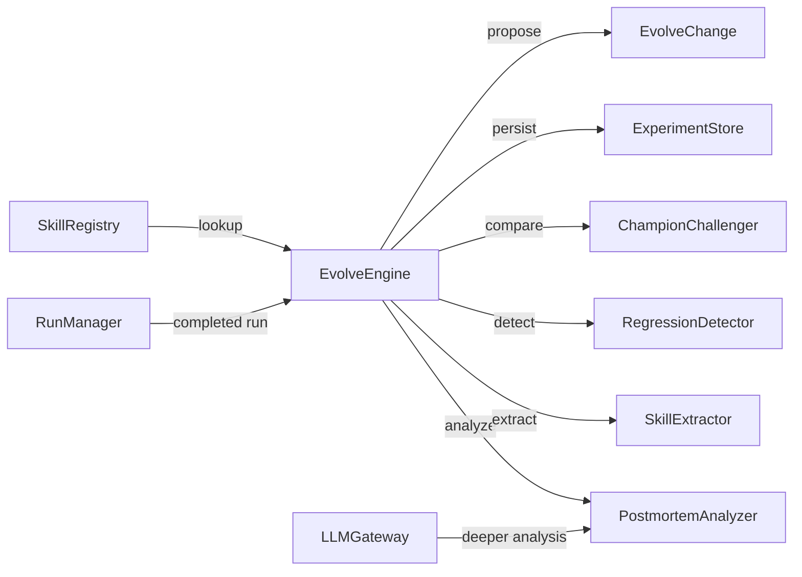
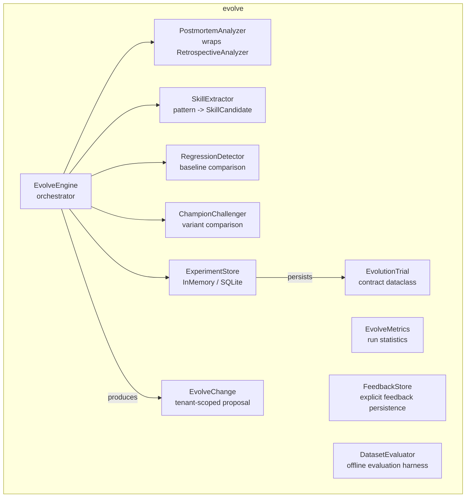
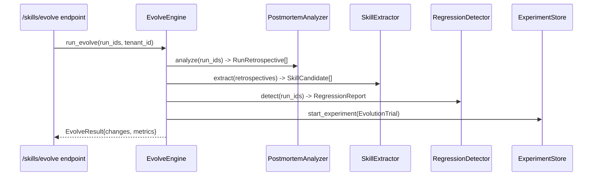
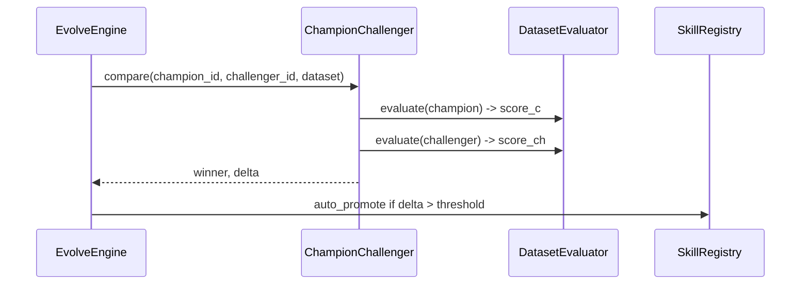

# hi_agent_evolve — Architecture Document

## 1. Introduction & Goals

The evolve subsystem implements a self-improvement pipeline for agent capabilities.
It analyses completed runs to extract reusable skill candidates, detect quality
regressions, run champion/challenger experiments, and produce structured
`EvolveChange` proposals for operator review and promotion.

Key goals:
- Identify repeatable task patterns that warrant skill promotion (Rule 13 L1 → L2+).
- Detect quality regressions across runs before they reach downstream.
- Maintain a durable experiment log (`ExperimentStore`) that survives restarts
  under research/prod posture.
- Emit structured change proposals carrying `tenant_id` for per-tenant promotion gates.

## 2. Constraints

- All dependencies (`skill_extractor`, `regression_detector`, `champion_challenger`)
  are required constructor arguments; no inline defaults (Rule 6).
- `EvolveChange.tenant_id` is required under research/prod posture; enforced in
  `__post_init__`.
- `ExperimentStore` defaults to `InMemoryExperimentStore` under dev posture;
  `SQLiteExperimentStore` under research/prod.
- The evolve pipeline does not modify registered skills directly; it proposes
  changes and the operator or promotion gate acts on them.

## 3. Context

## 4. Solution Strategy

- **EvolveEngine orchestrator**: coordinates all sub-components in a single
  `run_evolve` call. Components are injected; the engine does not construct
  them internally.
- **PostmortemAnalyzer**: wraps `RetrospectiveAnalyzer` to produce structured
  `RunRetrospective` and `ProjectRetrospective` records.
- **SkillExtractor**: scans retrospectives for repeatable patterns and emits
  `SkillCandidate` records with confidence scores.
- **RegressionDetector**: compares current run metrics against a rolling baseline
  and flags regressions above a configurable threshold.
- **ChampionChallenger**: periodically runs a challenger skill variant against the
  current champion on a held-out evaluation dataset.
- **ExperimentStore**: protocol-backed persistence (in-memory dev, SQLite
  research/prod) for `EvolutionTrial` records.

## 5. Building Block View

## 6. Runtime View

### Full Evolve Cycle

### Champion/Challenger Comparison (periodic)

## 7. Deployment View

`EvolveEngine` is instantiated by `SystemBuilder` and exposed via the
`/skills/evolve` HTTP endpoint. `ExperimentStore` uses SQLite at
`HI_AGENT_DATA_DIR/experiments.sqlite` under research/prod. No separate process
is required; evolve runs in-process on the same uvicorn/PM2 instance.

## 8. Cross-Cutting Concepts

**Posture**: `EvolveChange.tenant_id` is enforced under strict posture in
`__post_init__`. `ExperimentStore` defaults to in-memory under dev; SQLite under
research/prod via `make_experiment_store(posture, data_dir)`.

**Error handling**: all sub-component failures are logged at WARNING and the
engine continues; partial results are still returned in `EvolveResult`. This
prevents a failing analyzer from silencing skill extraction.

**Observability**: `hi_agent_experiment_posted_total` counter is incremented by
`RunEventEmitter.record_experiment_posted` at each successful trial start.

**Rule 6**: all four sub-components are required constructor arguments; passing
`None` raises `ValueError` with an explicit Rule 6 message.

## 9. Architecture Decisions

- **Proposal-not-mutate pattern**: `EvolveChange` proposals are returned for
  operator review; the engine never directly modifies `SkillRegistry`. This
  keeps the promotion gate as a hard human/CI checkpoint.
- **SQLite for ExperimentStore**: avoids an external service dependency while
  providing durability across restarts under research/prod.
- **Comparison interval**: champion/challenger comparison runs every N evolve
  cycles (default 10) rather than every run to avoid over-testing on small
  datasets.
- **FeedbackStore** as a separate module: explicit human feedback is persisted
  independently from the automated retrospective, enabling different retention
  and privacy policies.

## 10. Quality Requirements

| Quality attribute | Target |
|---|---|
| Skill candidate recall | >= 1 candidate per 10 successful runs |
| Regression false-positive rate | < 5% on stable baselines |
| ExperimentStore durability | Survives restart under research/prod |
| EvolveChange tenant enforcement | ValueError raised on missing tenant_id under strict posture |

## 11. Risks & Technical Debt

- `EvolveEngine.__init__` has a merge conflict marker in `engine.py` (line 62)
  that should be resolved before the next release.
- `ChampionChallenger` comparison is performed synchronously in the evolve cycle;
  for large datasets this blocks the HTTP handler.
- `RegressionDetector` baseline is in-memory; a cold start after a long outage
  loses historical context.

## 12. Glossary

| Term | Definition |
|---|---|
| EvolutionTrial | Durable record of one champion/challenger experiment |
| EvolveChange | Structured proposal for a capability change; carries tenant_id |
| SkillCandidate | Repeatable task pattern extracted from run retrospectives |
| RegressionReport | Comparison result flagging metrics that crossed the regression threshold |
| PostmortemAnalyzer | Component that produces RunRetrospective from completed run data |
