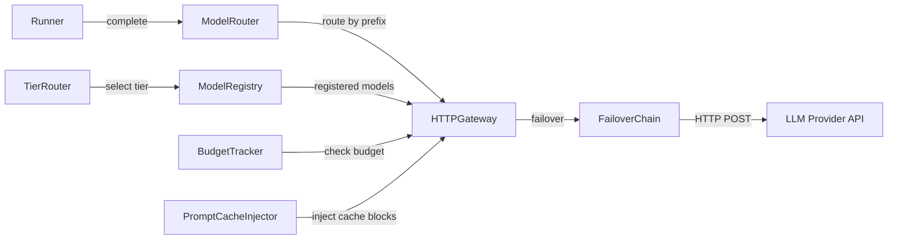
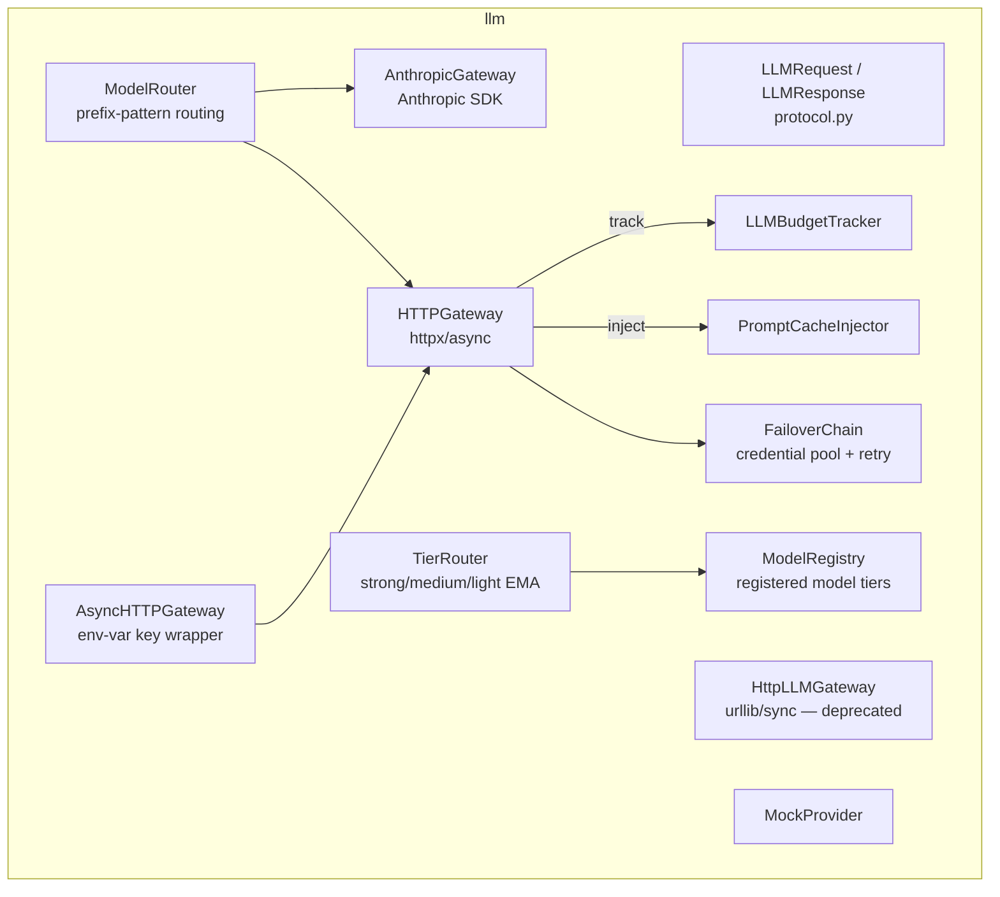
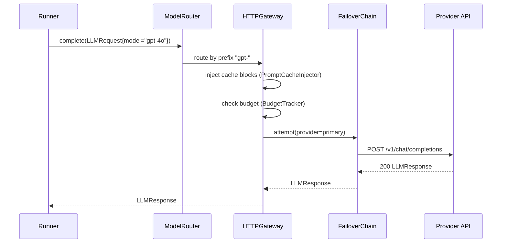
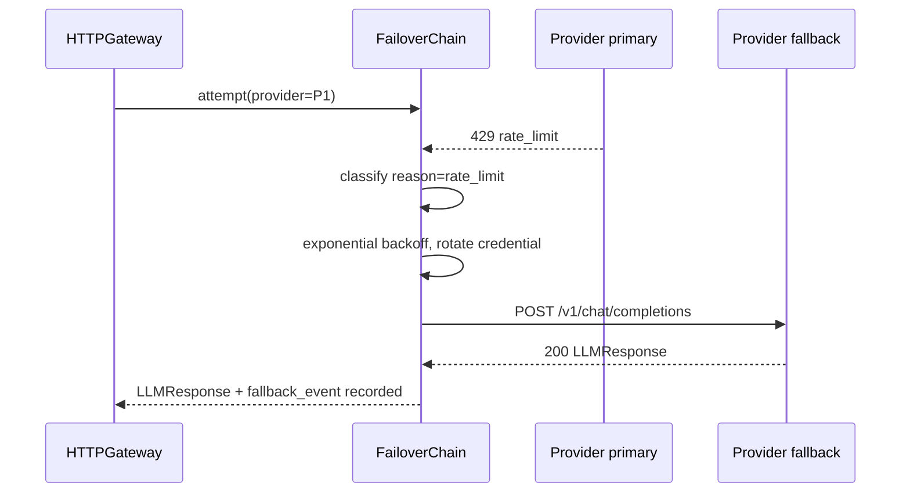

# hi_agent_llm — Architecture Document

## 1. Introduction & Goals

The LLM subsystem provides a provider-agnostic, multi-tier model selection and
failover layer. It translates `LLMRequest` objects into `LLMResponse` objects via
HTTP to any OpenAI-compatible endpoint, with retry logic, credential rotation,
tier-based routing, budget tracking, and prompt caching.

Key goals:
- Shield the agent runtime from provider instability through `FailoverChain`.
- Route requests to the cheapest capable model tier (strong/medium/light) based
  on task complexity and budget.
- Track token usage and enforce budget limits via `LLMBudgetTracker`.
- Remain testable via a `MockProvider` that satisfies the `LLMGateway` protocol.

## 2. Constraints

- All async resource lifetime must obey Rule 5 (one loop, no per-call `asyncio.run`).
- `HttpLLMGateway` (urllib/sync) is deprecated for production; `HTTPGateway`
  (httpx/async) is the production path.
- API keys are read exclusively from environment variables; never from code or
  config files.
- Counter labels must be low-cardinality (no `run_id` in metric labels).

## 3. Context

## 4. Solution Strategy

- **Protocol-based abstraction**: `LLMGateway` and `AsyncLLMGateway` are
  structural protocols; any object with `complete(request) -> response` satisfies
  them, enabling mock substitution in tests.
- **Tier routing**: `TierRouter` maps middleware/stage purpose labels to
  strong/medium/light tiers, then applies complexity overrides and budget
  downgrades. A rolling EMA calibrates tier quality automatically.
- **Failover chain**: `FailoverChain` holds an ordered list of providers with
  credential pools; on `auth`, `rate_limit`, `overloaded`, or `timeout` it
  rotates to the next provider with exponential backoff.
- **Sync compatibility**: `AsyncHTTPGateway` wraps `HTTPGateway` and routes
  through `SyncBridge` for sync callers; async callers use `HTTPGateway` directly.

## 5. Building Block View

## 6. Runtime View

### Standard Async Completion

### Failover on Rate Limit

## 7. Deployment View

All gateway instances are process-scoped singletons injected via
`CognitionBuilder`. No external service beyond the LLM provider API endpoint
is required. Under `HI_AGENT_LLM_MODE=mock` the `MockProvider` replaces real
HTTP calls and is safe for `default-offline` CI.

## 8. Cross-Cutting Concepts

**Posture**: `HttpLLMGateway` emits a `DeprecationWarning` under `prod-real` and
`local-real` runtime modes, steering operators to the async path.

**Error handling**: `LLMProviderError` and `LLMTimeoutError` are typed failures.
`FailoverError` is raised only when the entire chain is exhausted; it carries the
last `status_code` and `retry_after_seconds` for caller retry decisions.

**Observability**: `hi_agent_http_gateway_errors_total` counter tracks all
gateway errors. `hi_agent_spine_llm_call_total` is incremented before every
outgoing request. `FailoverChain` records fallback events in `run.metadata` per
Rule 7 (Countable, Attributable, Inspectable, Gate-asserted).

**Security**: API keys are resolved from env vars at construction; no key appears
in logs or metrics labels.

## 9. Architecture Decisions

- **`HTTPGateway` over `HttpLLMGateway`**: httpx supports connection pooling,
  HTTP/2, and native async; urllib is synchronous and requires a bridge per call.
  `HttpLLMGateway` is kept as a compatibility shim for opt-in `compat_sync_llm`.
- **FailoverReason enum**: explicit classification avoids string matching in
  failover logic and makes branch coverage testable.
- **EMA calibration in TierRouter**: rolling window of 10 samples with min 3
  observations prevents premature tier changes on sparse data.
- **ModelRouter prefix matching**: evaluation order matches registration order,
  giving operators explicit control over model routing priority.

## 10. Quality Requirements

| Quality attribute | Target |
|---|---|
| Provider failover latency | < 2× normal p95 per Rule 8 |
| llm_fallback_count per run | 0 for ship gate |
| Token budget enforcement | Hard stop before provider call |
| Mock substitutability | All tests under default-offline profile use MockProvider |

## 11. Risks & Technical Debt

- `AnthropicGateway` and `HTTPGateway` share some logic (retry, backoff) that
  could be unified in a base class; currently duplicated.
- `TierRouter` calibration stats are in-memory only; a process restart resets
  quality history.
- `PromptCacheInjector` type annotation is `Any` at the `HTTPGateway` boundary
  due to a module dependency cycle; flagged for Wave 29 resolution.

## 12. Glossary

| Term | Definition |
|---|---|
| LLMGateway | Structural protocol: `complete(LLMRequest) -> LLMResponse` |
| FailoverChain | Ordered provider list with credential rotation and backoff |
| TierRouter | Maps purpose/stage labels to strong/medium/light model tiers |
| ModelRouter | Routes by model-name prefix to the correct gateway instance |
| LLMBudgetTracker | Tracks token spend per run and enforces configurable limits |
| PromptCacheInjector | Inserts provider-specific prompt-cache control blocks |
