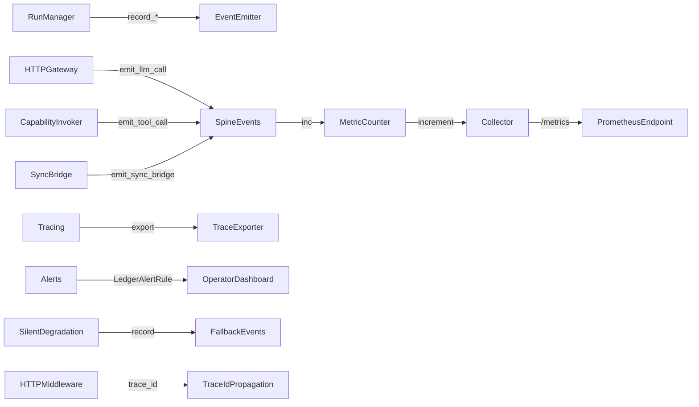
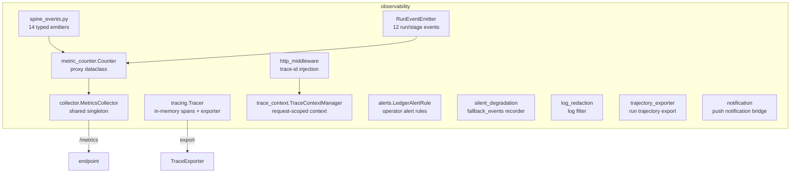
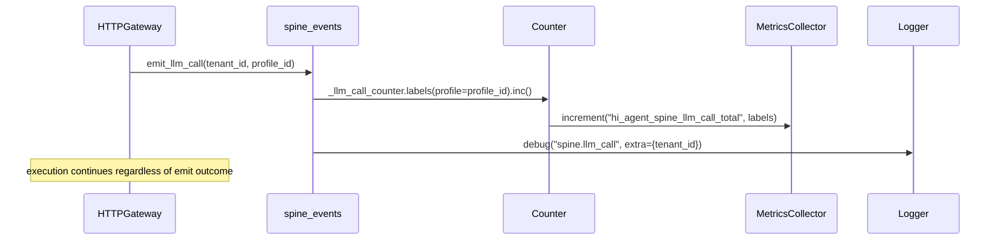
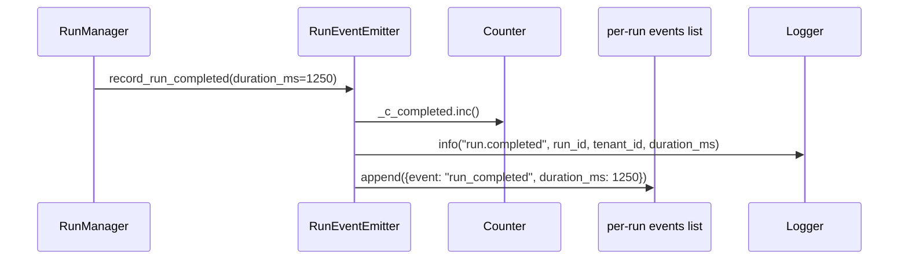

# hi_agent_observability — Architecture Document

## 1. Introduction & Goals

The observability subsystem satisfies Rule 7 (Resilience Must Not Mask Signals)
and Rule 13 (Capability Maturity Model) by providing a four-prong contract for
every fallback path: Countable (named metric), Attributable (structured log),
Inspectable (per-run fallback_events list), Gate-asserted (gate checks metric
presence). It also provides lightweight tracing, log redaction, HTTP middleware,
and a set of operator-visible alert rules.

Key goals:
- Make every run lifecycle transition and LLM call countable without high-cardinality label bloat.
- Provide typed spine event emitters covering 14 observability layers.
- Expose a `/metrics` endpoint with Prometheus-style counters.
- Provide structured alert rules tied to recurrence-ledger entries for `operationally_observable` closure level.

## 2. Constraints

- Counter emitters must never raise; all emit paths are wrapped in
  `contextlib.suppress(Exception)` with an expiry annotation.
- No `run_id` in counter labels (high cardinality); `tenant_id` used for
  structured logs only.
- Tracer is in-memory by default; export is pluggable via `TraceExporter` protocol.
- Log redaction applies to all log records; must not introduce latency on the hot path.

## 3. Context

## 4. Solution Strategy

- **Counter proxy**: `Counter` is a thin dataclass that forwards to a shared
  `MetricsCollector` singleton. Labels are bound at the call site to keep
  allocation lightweight.
- **Spine events**: 14 named emitter functions in `spine_events.py` cover the
  full call path from HTTP ingress to artifact write. Each function is a
  one-liner: increment counter + DEBUG log.
- **RunEventEmitter**: 12 typed `record_*` methods covering the full run and
  stage lifecycle; satisfies the four-prong Rule 7 contract for each transition.
- **Tracing**: lightweight `Tracer` with `TraceContext` and `SpanRecord`; pluggable
  `TraceExporter` protocol; JSON file exporter ships by default.
- **Alert rules**: `ALERT_RULES` list in `alerts.py` maps recurrence-ledger issue
  IDs to named Prometheus metric conditions and runbook paths.

## 5. Building Block View

## 6. Runtime View

### LLM Call Spine Tap

### Run Lifecycle Event

## 7. Deployment View

`MetricsCollector` is a process-scoped singleton. The `/metrics` endpoint in
`hi_agent/server/app.py` serializes it on each request. No external metrics
agent (e.g. Prometheus node exporter) is required for basic operation. OpenTelemetry
export is available via `agent_kernel/runtime/otel_export.py` for deployments that
want distributed tracing.

## 8. Cross-Cutting Concepts

**Posture**: under all postures, observability paths use `contextlib.suppress`
with expiry waves to ensure they never crash the execution path. The suppress
annotations are treated as auditable technical debt (expiry_wave tag required).

**Error handling**: counter emitter failures are silently dropped (the suppress
guard). `RunEventEmitter` methods log at WARNING+ and append to the events list;
they do not raise.

**Security**: `log_redaction.py` filters sensitive field names (keys, tokens,
passwords) from log records before emission.

**Rule 7 gate**: `check_rules.py` validates that all 12 `RUN_EVENT_METRIC_NAMES`
are present on `/metrics`. Any gap blocks the `release` test profile.

## 9. Architecture Decisions

- **No `run_id` in counter labels**: unbounded cardinality would explode storage
  in Prometheus; `run_id` is attributed only in structured log messages.
- **14-layer spine model**: maps 1-to-1 to architectural boundaries (gateway,
  transport, bridge, etc.) making it possible to assert full-path coverage in CI.
- **`contextlib.suppress` with expiry wave**: explicit annotation discipline
  prevents suppress guards from becoming permanent dead letter boxes.
- **Alert rules as code**: `LedgerAlertRule` dataclasses co-locate alert metadata
  with the recurrence-ledger issue ID, enabling CI to verify alert-to-issue
  traceability.

## 10. Quality Requirements

| Quality attribute | Target |
|---|---|
| Spine coverage | All 14 layers emit >= 1 event per real run |
| Counter availability | /metrics responds < 50 ms |
| Log redaction correctness | No API key in log output under any posture |
| Alert rule completeness | 1 rule per recurrence-ledger entry at operationally_observable level |

## 11. Risks & Technical Debt

- `contextlib.suppress` guards on spine emitters expire Wave 29; actual
  replacement tests are not yet written.
- `MetricsCollector` has no TTL or cardinality cap; a long-running process with
  many unique label combinations could accumulate unbounded memory.
- `TrajectoryExporter` writes to disk; under high throughput this could become
  an I/O bottleneck.

## 12. Glossary

| Term | Definition |
|---|---|
| Spine event | A named counter increment + DEBUG log emitted at a defined architectural boundary |
| MetricsCollector | Process-scoped singleton that accumulates named counters for /metrics |
| RunEventEmitter | Typed emitter for 12 run/stage lifecycle transitions (Rule 7 four-prong contract) |
| LedgerAlertRule | Operator-visible alert rule wired to a recurrence-ledger issue ID |
| TraceExporter | Protocol for exporting closed SpanRecord objects to any sink |
