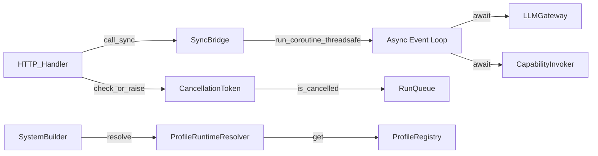
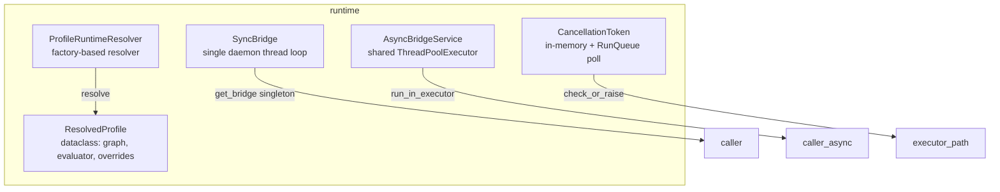
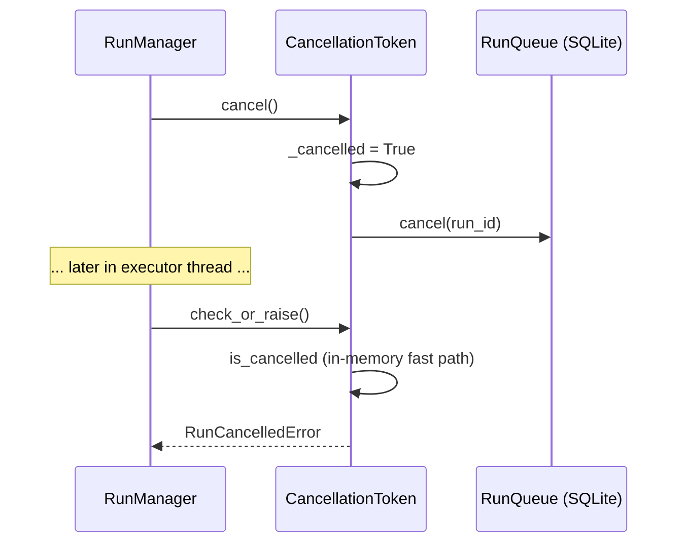

# hi_agent_runtime — Architecture Document

## 1. Introduction & Goals

The runtime subsystem bridges synchronous callers (HTTP handlers, CLI) with the
async-first agent execution core. It enforces Rule 5 (one durable event loop per
async resource), manages cooperative cancellation, and resolves profile
configurations into live runtime objects.

Key goals:
- Eliminate `asyncio.run()` per-call loop creation that destroyed async resource
  pools after each call (prod incident 2024-04-22).
- Provide profile-to-runtime-object resolution used by `SystemBuilder`.
- Provide a cooperative cancellation token that works across thread and process
  boundaries.

## 2. Constraints

- Must not import business-layer code (positioning Rule G1).
- `SyncBridge` singleton is a process-wide resource; construction is lazy and
  thread-safe.
- `CancellationToken` may query SQLite (via `RunQueue`) — must tolerate DB
  unavailability gracefully (flag falls back to in-memory state).
- Windows and Linux portable; no POSIX signal assumptions.

## 3. Context



## 4. Solution Strategy

- **Single durable loop** (`SyncBridge`): one daemon thread owns the event loop
  for the process lifetime; all callers share it via
  `asyncio.run_coroutine_threadsafe`.
- **Async-to-sync bridge** (`AsyncBridgeService`): a shared `ThreadPoolExecutor`
  (8 workers) runs sync callables from async contexts; avoids per-call pool
  allocation.
- **Cooperative cancellation** (`CancellationToken`): in-memory flag, optionally
  backed by `RunQueue` durable record; checked at execution boundaries.
- **Profile resolution** (`ProfileRuntimeResolver`): converts `ProfileSpec` into
  `ResolvedProfile` (stage graph, evaluator, config overrides) via factory
  callbacks registered in `ProfileRegistry`.

## 5. Building Block View



## 6. Runtime View

### Sync Caller Using SyncBridge

```mermaid
sequenceDiagram
    participant Handler as HTTP Handler (sync)
    participant Bridge as SyncBridge
    participant Loop as Daemon Event Loop
    participant GW as AsyncHTTPGateway

    Handler->>Bridge: call_sync(coro, timeout=30)
    Bridge->>Bridge: _ensure_started() [lazy start]
    Bridge->>Loop: run_coroutine_threadsafe(coro)
    Loop->>GW: await gateway.complete(req)
    GW-->>Loop: LLMResponse
    Loop-->>Bridge: future.result(timeout=30)
    Bridge-->>Handler: LLMResponse
```

### Cancellation Check



## 7. Deployment View

`SyncBridge` starts its daemon thread on first `call_sync` and registers
`atexit` shutdown. No external service required. `AsyncBridgeService` shares
the Python interpreter's GIL-releasing thread pool. Both are process-scoped
singletons suitable for a single-process deployment (PM2, systemd, uvicorn).

## 8. Cross-Cutting Concepts

**Posture**: `ProfileRuntimeResolver` falls back to TRACE defaults (not error)
when `profile_id` is not found, logging a WARNING. This is permissive under all
postures; the caller decides whether absence is fatal.

**Error handling**: `SyncBridgeShutdownError` is raised if `call_sync` is
invoked after `shutdown()`. All exceptions from the coroutine are re-raised to
the sync caller verbatim.

**Observability**: `SyncBridge.call_sync` emits `emit_sync_bridge()` spine tap
(counter `hi_agent_spine_sync_bridge_total`) wrapped in `contextlib.suppress` to
never block execution.

**Rule 5 enforcement**: `scripts/check_rules.py` scans for bare `asyncio.run(`
sites and flags any outside entry points / tests / `sync_bridge`.

## 9. Architecture Decisions

- **Daemon thread**: the bridge thread is a daemon so it does not block clean
  interpreter shutdown when the main thread exits.
- **atexit registration**: guarantees task cancellation and loop closure even if
  no explicit `shutdown()` call is made.
- **`ThreadPoolExecutor` max_workers=8** for `AsyncBridgeService`: tuned for the
  expected I/O-bound capability workload; not configurable at runtime to keep
  Rule 2 (simplicity).
- **In-memory cancellation flag cache**: once `RunQueue` returns cancelled=true
  the flag is cached in `_cancelled` to avoid repeated DB reads on hot loops.

## 10. Quality Requirements

| Quality attribute | Target |
|---|---|
| Loop-closed error rate | 0 per 1000 runs |
| Bridge startup latency | < 5 s (hard timeout) |
| Cancellation propagation | < 1 s from API signal to check_or_raise |
| Profile resolution failure | WARNING log + None return; no crash |

## 11. Risks & Technical Debt

- `AsyncBridgeService` does not support backpressure; a burst of sync callers
  can saturate the 8-worker pool. Tracked as a potential DF item.
- `ProfileRuntimeResolver` uses `Any` type hints for `stage_graph` and
  `evaluator` to avoid circular imports; tightening would require a shared
  protocol module.
- `SyncBridge` asyncgen teardown uses `contextlib.suppress(Exception)` with an
  expiry annotation (Wave 29) — a real replacement test is pending.

## 12. Glossary

| Term | Definition |
|---|---|
| SyncBridge | Process-lifetime daemon thread owning a single asyncio event loop |
| call_sync | Method that schedules a coroutine on the bridge loop and blocks for result |
| CancellationToken | Cooperative signal checked at execution boundaries |
| ResolvedProfile | Dataclass of live runtime objects (graph, evaluator, overrides) resolved from a profile spec |
| AsyncBridgeService | Shared ThreadPoolExecutor for running sync callables from async contexts |
