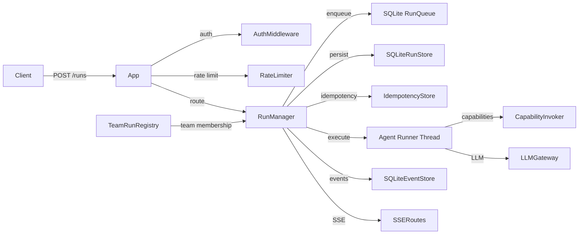
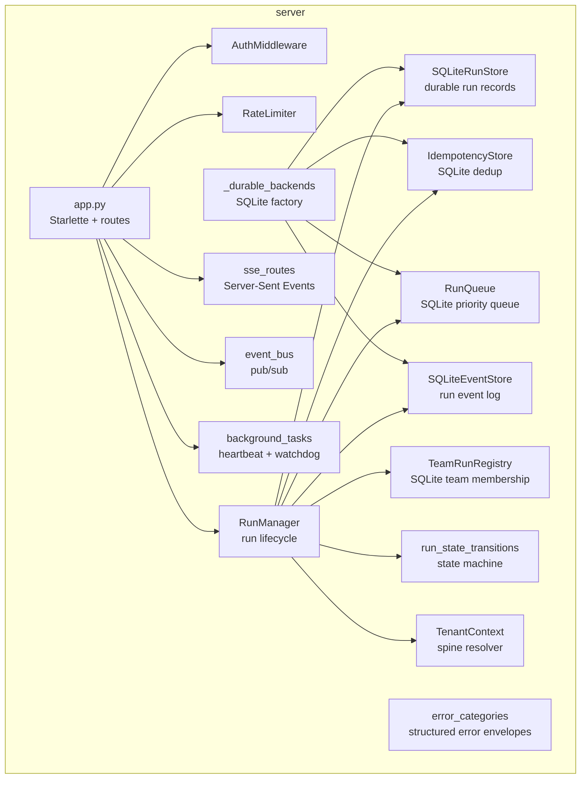
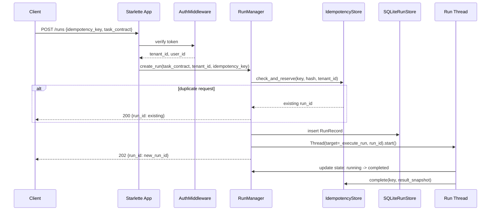
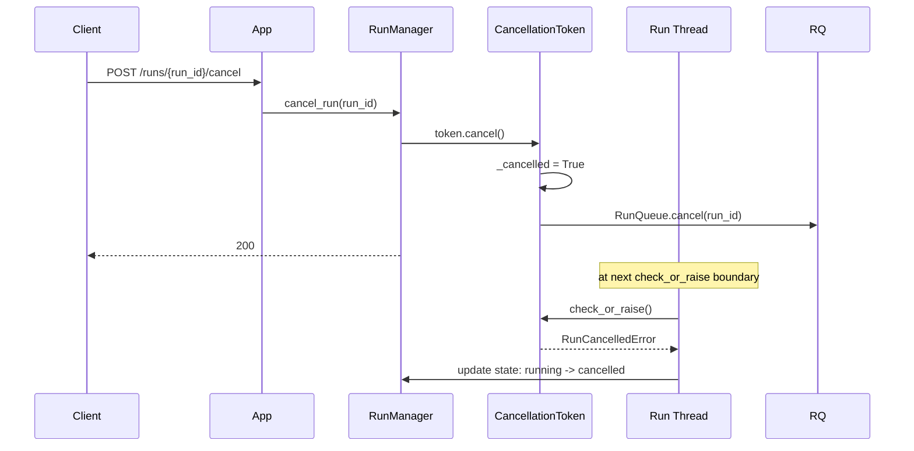

# hi_agent_server — Architecture Document

## 1. Introduction & Goals

The server subsystem is the HTTP API surface of `hi-agent`. It exposes run
lifecycle management, knowledge, memory, skill, artifact, event stream, MCP, and
ops endpoints via Starlette + uvicorn. It owns durable persistence for runs,
idempotency, and team memberships, and manages the threading model for concurrent
run execution.

Key goals:
- Accept `POST /runs` and drive them to completion via `RunManager`.
- Enforce idempotency so retried requests do not create duplicate runs.
- Provide durable SQLite-backed state that survives restarts under research/prod.
- Expose SSE event streams for real-time run progress.
- Enforce tenant scope on every stored record (Rule 12).

## 2. Constraints

- `RunManager` uses `threading.Thread` per run (not asyncio tasks) to remain
  compatible with sync agent implementations.
- Durable backends (`SQLiteRunStore`, `IdempotencyStore`, `TeamRunRegistry`,
  `SQLiteEventStore`) default to `:memory:` under dev posture.
- State transitions are centralized in `run_state_transitions.transition()`;
  direct attribute assignment to `ManagedRun.state` is forbidden.
- `CancellationToken` must be created with the `RunQueue` reference to support
  cross-process cancellation.

## 3. Context

## 4. Solution Strategy

- **Starlette application**: thin routing layer; all business logic is delegated
  to subsystem modules. Route handlers call `RunManager`, not internal
  implementation details.
- **RunManager**: owns the run lifecycle from creation to terminal state. Uses a
  bounded in-memory queue backed by `RunQueue` for overflow persistence. Each run
  executes on a dedicated `threading.Thread`.
- **Idempotency**: `IdempotencyStore` deduplicates requests by SHA-256 of the
  canonical sorted-key JSON payload within a TTL window. Duplicate `POST /runs`
  returns the same `run_id`.
- **State machine**: `run_state_transitions.transition()` enforces legal state
  graph (`created` → `running` → `{completed, failed, cancelled}`); illegal
  transitions log a WARNING and return the unchanged state.
- **Durable backends**: `_durable_backends.build_durable_backends` wires up all
  SQLite stores from the posture and `HI_AGENT_DATA_DIR`.

## 5. Building Block View

## 6. Runtime View

### Run Submission with Idempotency

### Cancellation Round-Trip

## 7. Deployment View

Server runs as a single uvicorn process managed by PM2 or systemd. SQLite files
live at `HI_AGENT_DATA_DIR` (env var, default `./hi_agent_data/`). The process
serves all endpoints on one port (default 8000). No external database required.
Under horizontal scaling, SQLite is replaced by PostgreSQL via the adapter
pattern (Rule 5/6 compliant swap).

## 8. Cross-Cutting Concepts

**Posture**: durable backends default to `:memory:` under dev; file-backed SQLite
under research/prod. `TenantContext` enforces non-empty `tenant_id` under strict
posture.

**Error handling**: `error_categories.py` provides `error_response(category, ...)` 
factory for structured HTTP error envelopes. `QueueSaturatedError` maps to HTTP
429. `ArtifactConflictError` maps to HTTP 409.

**Observability**: `RunManager` emits `hi_agent_run_submitted_total`,
`hi_agent_run_started_total`, etc. via `RunEventEmitter`. Heartbeat loop renews
leases and emits `hi_agent_spine_run_manager_total`.

**Security**: `AuthMiddleware` validates bearer tokens and injects `tenant_id`.
`_tenant_guard.py` validates that stored records belong to the requesting tenant.
`rate_limiter.py` applies per-tenant rate limits.

**Rule 12**: `RunRecord`, `IdempotencyRecord`, `StoredEvent`, and `TeamRun` all
carry `tenant_id` and the relevant subset of `{user_id, session_id, project_id,
run_id}`.

## 9. Architecture Decisions

- **Threading over asyncio tasks for run execution**: agent implementations may
  block (sync LLM calls, sync tool handlers); threads are the safe choice
  without requiring all agent code to be async.
- **SQLite WAL mode**: write-ahead logging enables concurrent reads during writes,
  suitable for the read-heavy `/runs/{id}` polling pattern.
- **IdempotencyStore SHA-256 hash**: canonical sorted-key JSON ensures the same
  logical request produces the same hash regardless of JSON key ordering.
- **State machine centralization**: all legal transitions in one function makes
  the graph auditable and prevents state spaghetti across handlers.
- **event_bus pub/sub**: decouples event emission from SSE consumers; multiple
  subscribers can receive the same event without RunManager knowing about them.

## 10. Quality Requirements

| Quality attribute | Target |
|---|---|
| Idempotency window | Configurable TTL (default 24h) |
| Cancellation latency | < 1s from API to RunCancelledError |
| State transition safety | No direct attribute assignment to ManagedRun.state |
| Run store durability | Survives restart under research/prod |
| Concurrent runs | Bounded by RunQueue depth (configurable) |

## 11. Risks & Technical Debt

- Per-run threads limit scalability at high concurrency; async task pool is a tracked future improvement.
- `SQLiteRunStore` replays all records on construction; cursor-based paging needed at scale.
- `DreamScheduler` shares the HTTP process; memory-heavy consolidation can starve request threads.
- `fault_injection.py` is registered unconditionally; should be gated under dev/test posture only.

## 12. Glossary

| Term | Definition |
|---|---|
| RunManager | Central lifecycle manager: create, execute, cancel, query runs |
| ManagedRun | In-memory representation of an active or terminal run |
| SQLiteRunStore | Durable run record store; persists across process restarts |
| IdempotencyStore | Deduplicates POST /runs requests by SHA-256 payload hash + TTL |
| TeamRunRegistry | Durable registry of team membership; maps team_id to member run_ids |
| RunQueue | SQLite-backed priority queue for run scheduling and cancellation flags |
| event_bus | In-process pub/sub for run events consumed by SSE streams |
