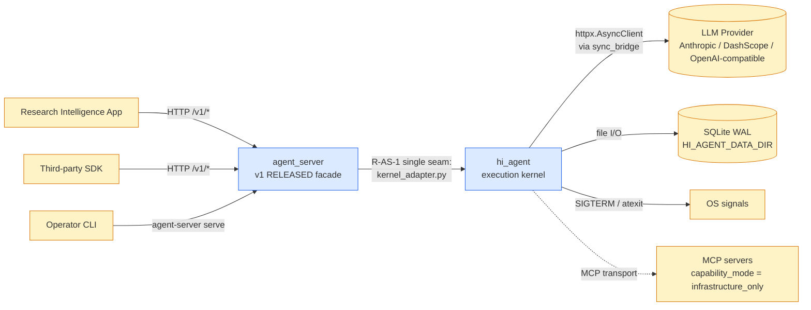
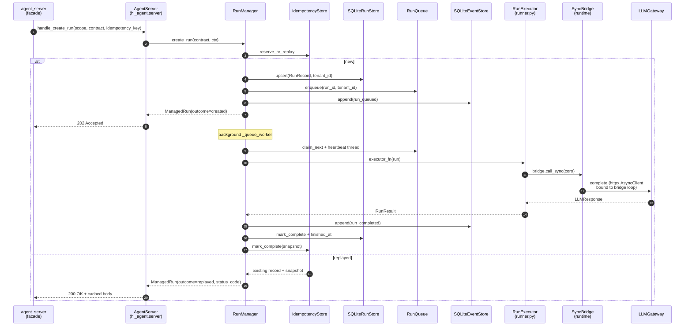
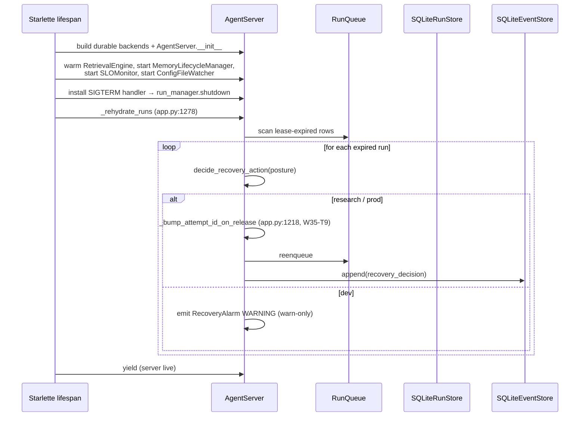

# hi_agent — Architecture

> **Last refreshed:** 2026-05-06 (W35 corrective close + W36 plans). HEAD `276917d8`.
> **Audience:** platform engineers + W36 implementers.
> **Status:** authoritative.

---

## 1. Purpose & Responsibilities

`hi_agent/` is the **platform execution kernel** of the hi-agent stack. It owns the substrate that runs an agent task end-to-end: run lifecycle, durable persistence, async/sync resource lifetimes, capability dispatch, observability spine, memory tiers, knowledge stores, skill ecosystem, and LLM transport.

It is **not** the public surface. The frozen northbound HTTP contract lives in `agent_server/` (v1 RELEASED at SHA `55e51a7f`). `agent_server/` calls into `hi_agent/` through exactly **one** seam: `agent_server/runtime/kernel_adapter.py` mounts `hi_agent.server.app.AgentServer`. No other module under `agent_server/` is permitted to import `hi_agent.*` (R-AS-1, enforced by `scripts/check_seam_isolation.py`).

This split makes `hi_agent/` free to evolve internal shapes wave over wave while `agent_server/` remains contract-stable. The seam is one-directional: `hi_agent/` never imports `agent_server/`.

**Owns:**

- Run lifecycle state machine (`hi_agent/server/run_manager.py:79`)
- Durable persistence boundaries — runs, events, idempotency, queue, sessions, team registry, gate store (`hi_agent/server/_durable_backends.py:14`)
- Async/sync resource bridge (`hi_agent/runtime/sync_bridge.py:62`, Rule 5)
- Capability registry + invoker + circuit breaker (`hi_agent/capability/`)
- Unified action harness (governance, permission, evidence) (`hi_agent/runtime/harness/`)
- LLM gateway with tier routing, failover, prompt cache, streaming (`hi_agent/llm/`)
- Observability spine — 12 typed lifecycle events + 14 spine layers + Prometheus metrics (`hi_agent/observability/`)
- Memory tiers L0–L3 + compression (`hi_agent/memory/`)
- Knowledge wiki + graph + retrieval (`hi_agent/knowledge/`)
- Skill registry + evolver + champion/challenger (`hi_agent/skill/`)
- Kernel facade adapter spine (`hi_agent/runtime_adapter/`)

**Does not own:**

- HTTP route shape, request/response schemas — `agent_server/api/`
- v1 contract version + freeze — `agent_server/config/version.py`
- JWT validation, tenant_id authoring — `agent_server/auth/` (authoritative since W35-T3)
- Business-agent profiles (research-team owned) — wired through `profile_registry`

---

## 2. Context & Scope



`hi_agent/` runs entirely in-process. It has no inbound network surface of its own; every request reaches it through `agent_server/`. Outbound dependencies are LLM providers (HTTPS), local SQLite WAL files under `HI_AGENT_DATA_DIR`, and process signals.

---

## 3. Module Boundary & Dependencies

| Sub-package | Owns | Lives at | Detail doc |
|---|---|---|---|
| `server/` | Run lifecycle, durable backends, ASGI app, AuthMiddleware | `hi_agent/server/` | `hi_agent/server/ARCHITECTURE.md` |
| `runtime/` | sync_bridge (Rule 5), async_bridge, cancellation, harness | `hi_agent/runtime/` | `hi_agent/runtime/ARCHITECTURE.md` |
| `runtime_adapter/` | Kernel facade adapter spine (direct + http modes) | `hi_agent/runtime_adapter/` | `hi_agent/runtime_adapter/ARCHITECTURE.md` |
| `llm/` | Tier router, failover, anthropic/openai gateways, streaming | `hi_agent/llm/` | `hi_agent/llm/ARCHITECTURE.md` |
| `observability/` | Metrics, audit, spine emitters, alerts, SLO | `hi_agent/observability/` | `hi_agent/observability/ARCHITECTURE.md` |
| `knowledge/` | Wiki, graph, retrieval, TF-IDF + embedding | `hi_agent/knowledge/` | `hi_agent/knowledge/ARCHITECTURE.md` |
| `skill/` | Registry, loader, matcher, evolver, version mgr | `hi_agent/skill/` | `hi_agent/skill/ARCHITECTURE.md` |
| `capability/` | Registry, invoker, circuit breaker, governance | `hi_agent/capability/` | `hi_agent/capability/ARCHITECTURE.md` |
| `contracts/` | Public dataclasses, errors, spine validation, posture | `hi_agent/contracts/` | `hi_agent/contracts/CONTRACTS.md` |
| `memory/` | L0 raw → L1 compressed → L2 mid-term → L3 KG | `hi_agent/memory/` | `hi_agent/memory/ARCHITECTURE.md` |
| `config/` | Posture, TraceConfig, ConfigStack, CognitionBuilder, RuntimeBuilder | `hi_agent/config/` | — |
| `route_engine/` | Hybrid (rule + LLM + skill-aware) routing + decision audit | `hi_agent/route_engine/` | — |
| `evolve/` | Postmortem, skill extractor, regression detector, champion/challenger | `hi_agent/evolve/` | — |

**Public API surface** (`hi_agent/__init__.py:19-37`):

| Symbol | Purpose |
|---|---|
| `RunExecutorFacade` | `start(run_id, profile_id, model_tier, skill_dir)` / `run(prompt) → RunFacadeResult` / `stop()` |
| `check_readiness()` | Returns `ReadinessReport` — per-subsystem health |
| `GateEvent`, `GatePendingError` | Human-gate lifecycle |
| `SubRunHandle`, `SubRunResult` | Nested sub-run dispatch |

**Forbidden directionality:**

- `agent_server/` → `hi_agent/` only via `agent_server/runtime/kernel_adapter.py` and `agent_server/bootstrap.py` (R-AS-1).
- `hi_agent/` → `agent_server/` is a hard ban; CI fails on any such import.
- Sub-packages of `hi_agent/` may depend across each other but the dependency graph must remain acyclic. The detail docs name allowed inbound edges per package.

---

## 4. Building Blocks

```mermaid
flowchart TB
    subgraph SERVER["server/ — run lifecycle + durable persistence"]
        APP["AgentServer<br/>app.py:1923"]
        RM["RunManager<br/>run_manager.py:100"]
        BACK["build_durable_backends<br/>_durable_backends.py:14"]
        RS[(SQLiteRunStore)]
        RQ[(RunQueue)]
        ES[(SQLiteEventStore)]
        IS[(IdempotencyStore)]
        TRR[(TeamRunRegistry)]
        GS[(SQLiteGateStore)]
        SS[(SessionStore)]
        AUTH[AuthMiddleware]
        SES[SessionMiddleware]
        EBUS[EventBus]
    end

    subgraph RUNTIME["runtime/ — async/sync bridge + harness"]
        SB[SyncBridge<br/>sync_bridge.py:62]
        AB[AsyncBridgeService<br/>async_bridge.py:16]
        CT[CancellationToken<br/>cancellation.py:21]
        PR[ProfileRuntimeResolver]
        HE[HarnessExecutor<br/>harness/executor.py:26]
        GOV[GovernanceEngine]
        PG[PermissionGate]
        EVS[EvidenceStore]
    end

    subgraph LLM["llm/ — gateway + tier routing"]
        TR[TierAwareLLMGateway]
        FC[FailoverChain]
        AG[AnthropicLLMGateway]
        HG[HttpLLMGateway]
        BG[LLMBudgetTracker]
        PCI[PromptCacheInjector]
    end

    subgraph ADAPTER["runtime_adapter/ — kernel facade spine"]
        KFC[KernelFacadeClient<br/>direct + http modes]
        KFA[KernelFacadeAdapter]
        AKFA[AsyncKernelFacadeAdapter]
        RKA[ResilientKernelAdapter]
    end

    subgraph OBS["observability/ — spine + metrics"]
        SPINE[spine_events<br/>14 layers]
        EE[EventEmitter<br/>12 typed lifecycle]
        MET[MetricsCollector<br/>Prometheus]
    end

    subgraph CTX["contracts/ + capability/ + memory/ + knowledge/ + skill/"]
        CONTRACTS[contracts/<br/>RunRecord, StoredEvent, IdempotencyRecord,<br/>ReasoningTrace, TeamRun]
        CAP[capability/<br/>registry + invoker + circuit_breaker]
        MEM[memory/<br/>L0 → L1 → L2 → L3]
        KNOW[knowledge/<br/>wiki + graph + retrieval]
        SKL[skill/<br/>registry + evolver + version_mgr]
    end

    APP --> BACK
    BACK --> RS
    BACK --> RQ
    BACK --> ES
    BACK --> IS
    BACK --> TRR
    BACK --> GS
    BACK --> SS

    APP --> RM
    APP --> EBUS
    APP --> AUTH
    APP --> SES

    RM --> RS
    RM --> RQ
    RM --> ES
    RM --> IS
    RM -. cancellation .-> CT

    APP --> SB
    SB -.persistent loop.-> AB
    HE --> GOV
    HE --> PG
    HE --> EVS

    RM --> KFC
    KFC --> KFA
    KFC --> AKFA
    KFC --> RKA

    HE -. emit .-> SPINE
    RM -. emit .-> EE
    EE --> MET
    SPINE --> MET

    APP --> CONTRACTS
    HE --> CAP
    RM -. injected via SystemBuilder .-> MEM
    RM -. injected via SystemBuilder .-> KNOW
    RM -. injected via SystemBuilder .-> SKL

    classDef store fill:#fee2e2,stroke:#dc2626
    classDef bridge fill:#dbeafe,stroke:#2563eb
    classDef obs fill:#dcfce7,stroke:#16a34a
    class RS,RQ,ES,IS,TRR,GS,SS store
    class SB,AB,CT bridge
    class SPINE,EE,MET obs
```



The **Single Construction Path** (Rule 6) for durable resources is `_durable_backends.build_durable_backends` (`hi_agent/server/_durable_backends.py:14`). Every consumer of a durable store receives it by injection; inline `x or DefaultX()` fallbacks are forbidden.

---

## 5. Runtime View — Key Scenarios

### 5.1 Submit a run end-to-end (`POST /v1/runs`)



The async resource (`httpx.AsyncClient`) is constructed once on the SyncBridge loop and reused across every `bridge.call_sync` invocation in the run — Rule 5's whole point. See `hi_agent/runtime/ARCHITECTURE.md` §6 for the deep-dive on why this matters (the 04-22 prod incident).

### 5.2 Lifespan startup + lease recovery



### 5.3 Per-store retention purge loop (W36-A3 reference shape)

```mermaid
sequenceDiagram
    participant Lifespan as agent_server lifespan
    participant Loop as _<store>_purge_loop
    participant Store as Durable store
    participant Met as Prometheus

    Lifespan->>Loop: launch as supervised task
    loop every interval_s
        Loop->>Loop: await asyncio.sleep(interval_s)
        Loop->>Store: purge_expired(now)
        Store-->>Loop: deleted_count
        opt deleted >= 100
            Store->>Store: VACUUM (best-effort)
        end
        opt deleted > 0
            Loop->>Met: hi_agent_<store>_purged_total{tenant_id} += deleted
        end
    end
```

This shape clones `IdempotencyStore.purge_expired` (`hi_agent/server/idempotency.py:193`) — the W35-T4 reference impl — and is the binding template every W36-A3 adopter follows (event_store, run_store, audit_store, gate_store, feedback_store, team_event_store, decision_audit, session_store).

---

## 6. Cross-cutting Concerns

| Concern | Mechanism | Reference |
|---|---|---|
| **Posture-aware defaults** (Rule 11) | `Posture.from_env()`; `dev` permissive, `research`/`prod` fail-closed | `hi_agent/config/posture.py` |
| **Async resource lifetime** (Rule 5) | `SyncBridge` persistent loop; ban on `asyncio.run()` in library code | `hi_agent/runtime/sync_bridge.py:62` |
| **Single construction path** (Rule 6) | `build_durable_backends` for stores; `SystemBuilder` for runtime; required-kwargs for scope | `hi_agent/server/_durable_backends.py:14`, `hi_agent/config/builder.py` |
| **Resilience without silence** (Rule 7) | Every fallback emits Counter + WARNING + fallback_event + gate-asserted | `hi_agent/server/recovery.py:38` (RecoveryAlarm reference) |
| **Operator-shape gate** (Rule 8) | T3 evidence under `docs/delivery/`; gate-script `scripts/run_t3_gate.py` | `docs/governance/score_caps.yaml` |
| **Auth-authoritative tenant_id** (W35-T3) | Tenant_id sourced only from `agent_server/auth/`; `hi_agent` never trusts request body | `agent_server/auth/`, `hi_agent/server/run_manager.py:344` |
| **Contract spine** (Rule 12) | Every persistent record carries `tenant_id`, `user_id`, `session_id`, `project_id`, `run_id`, `parent_run_id`, `attempt_id`, `phase_id` | `hi_agent/contracts/_spine_validation.py`, `RunRecord.__post_init__` (`run_store.py:91`) |
| **Capability maturity** (Rule 13) | L0–L4 levels; default-on requires posture-aware default + observable fallbacks | `docs/governance/maturity-glossary.md` |
| **Manifest-truth releases** (Rule 14) | Closure notices derive from manifest; no claims pre-final-manifest | `scripts/check_manifest_freshness.py` |
| **Closure level taxonomy** (Rule 15) | `component_exists` → `wired` → `e2e` → `verified_at_release_head` → `operationally_observable` | `docs/governance/closure-taxonomy.md` |
| **Test profile taxonomy** (Rule 16) | 7 profiles in `tests/profiles.toml`; `default-offline` is offline-only | `tests/profiles.toml` |
| **Allowlist discipline** (Rule 17) | Every `# noqa` / silenced-gate carries owner / risk / expiry_wave / replacement_test | `docs/governance/allowlists.yaml` |

---

## 7. Architecture Decisions

| ADR | Decision | Why |
|---|---|---|
| **R-AS-1: Single seam** | Only `agent_server/runtime/kernel_adapter.py` and `agent_server/bootstrap.py` may import `hi_agent.*` | Lets `agent_server/` freeze its v1 contract while `hi_agent/` evolves; one diff surface for breaking-change reviews |
| **Rule 5: SyncBridge** | One persistent event loop on a daemon thread, instead of per-call `asyncio.run` | Async resources (`httpx.AsyncClient`, `asyncpg.Pool`) bound to a doomed loop caused the 04-22 prod outage — every retry got `RuntimeError: Event loop is closed` |
| **Rule 6: build_durable_backends** | All durable SQLite stores constructed in one function; injected by name | Inline `x or DefaultX()` produced two unshared in-memory stores in production (DF-11); single construction path eliminates the class |
| **Rule 7: Observable degradation** | Every fallback path = Prometheus counter + WARNING + `fallback_events` + ship-gate assertion | Silent fallbacks were classified as "successful" runs while real signal was lost |
| **W35-T3: Auth-authoritative tenant_id** | Tenant_id sourced only from JWT in `agent_server/auth/`; `hi_agent` rejects request-body tenant_id under research/prod | Request-body tenant_id was bypassable; a single trust origin (JWT claim) is now the only legal source |
| **W35-T4: Idempotency TTL purge** | `IdempotencyStore.purge_expired` + lifespan loop + `hi_agent_idempotency_purged_total` | Reference implementation for all unbounded-growth stores; cloned by W36-A3 across 8 Tier-1 stores |
| **W35-T9: Re-lease attempt_id bump** | On lease re-enqueue, mint a fresh `attempt_id` (UUID4) and link `parent_run_id` to original `run_id`, increment `attempt_count` | Without bump, two attempts shared the same `attempt_id` → cross-attempt metrics collided. Helper extracted to `_bump_attempt_id_on_release` (`app.py:1218`) so the W34-F.2 lineage invariants are testable |
| **runtime/runtime_adapter split** | `runtime/` = in-process helpers (sync_bridge, harness, cancellation); `runtime_adapter/` = kernel facade transport (direct + http) | A name collision pre-W31 obscured which module owned which lifecycle; `RUNTIME-LAYERS.md` codifies the split |
| **harness moved into runtime/** | W31-H.6 relocated `hi_agent/harness/` into `hi_agent/runtime/harness/` | Unifies the runtime-helper namespace; legacy import path is a deprecation shim, removed in Wave 36 |

---

## 8. Quality Attributes

| Attribute | Target | How verified |
|---|---|---|
| **Run dispatch latency** | p95 ≤ `2× observed_p95` per Rule 8 step 3 | `docs/delivery/<date>-<sha>.md` gate run |
| **Cross-loop stability** | 3 sequential real-LLM runs reuse the same gateway/adapter | Rule 8 step 4 (sync_bridge guarantees this) |
| **Lifecycle observability** | `current_stage` non-`None` within 30 s on every turn | Rule 8 step 5 |
| **Cancellation round-trip** | `POST /runs/{id}/cancel` on live run = 200; on unknown = 404 | Rule 8 step 6 |
| **Tenant isolation** | Every persistent row carries `tenant_id`; cross-tenant read returns 404 | `scripts/check_contract_spine_completeness.py`, `RunRecord.__post_init__` |
| **Lint clean** | `ruff check` exits 0 | `.github/workflows/claude-rules.yml` |
| **Test honesty** | No MagicMock on subsystem under test in integration tests | Rule 4 + manual review |
| **Architectural 7×24** | 5 assertions PASS at each release HEAD: cross-loop, lifespan, cancellation, spine real, chaos runtime-coupled | `docs/verification/<sha>-arch-7x24.json` |

---

## 9. Risks & Technical Debt

| Risk | Tracker | W36 plan |
|---|---|---|
| **24 unbounded-growth stores** | `docs/governance/retention-roadmap.md` | W36-A3 binding for 8 Tier-1 stores; W37 binding for Tier-2 (clones W35-T4 shape) |
| **14 boot-time assertions missing (B1–B14)** | `docs/governance/boot-time-assertions-roadmap.md` | W36-A5 binding; reference shape at `agent_server/api/__init__.py:138-156` (W35-T8) — all use the shared `assert_research_posture_required` helper |
| **5 of 8 W36-A3 stores lack `tenant_id` columns** | retention-roadmap §Tier 1 | W36-A4 schema-lineage extension before A3 can chunk-DELETE per tenant |
| **MCP transport not_wired** | `routes_manifest.py` | `transport_status = not_wired`; `capability_mode = infrastructure_only`; W37+ binding |
| **EventBus is process-local** | `hi_agent/server/event_bus.py` | Multi-process deployment requires every process to wire the same SQLite event store; the bus does not federate |
| **`_runs` dict authoritative for live state** | `hi_agent/server/run_manager.py` | A partial restart between enqueue and `_publish_run_event` reconciles only via lease expiry + `_rehydrate_runs`. Tested under W14; remaining gap = fully-atomic enqueue |
| **AuthMiddleware no-op without `HI_AGENT_API_KEY`** | `hi_agent/server/auth_middleware.py:96` | Dev-friendly default; `HI_AGENT_AUTH_REQUIRED=1` forces fail-closed in prod. Posture-aware: research/prod fail-closed when both absent |
| **Lifespan startup is best-effort** | `hi_agent/server/app.py:1450` | Every subsystem wrapped in try/except; `/health` may report `degraded` instead of failing the process |
| **Soft-replacement by `agent_server/`** | this doc | Public surface migrated to `agent_server/api/v1/*`; `hi_agent/server/` routes are pre-versioning and may be soft-deprecated |
| **L3 KG JSON backend at scale** | `feedback_neo4j_decline.md` | Operations team verified JSON suffices through W35; revisit only when retrieval p95 regresses |

---

## 10. References

- Sub-package detail docs: `hi_agent/server/ARCHITECTURE.md`, `hi_agent/runtime/ARCHITECTURE.md`, `hi_agent/runtime_adapter/ARCHITECTURE.md`, `hi_agent/llm/ARCHITECTURE.md`, `hi_agent/observability/ARCHITECTURE.md`, `hi_agent/memory/ARCHITECTURE.md`, `hi_agent/knowledge/ARCHITECTURE.md`, `hi_agent/skill/ARCHITECTURE.md`, `hi_agent/capability/ARCHITECTURE.md`
- Runtime layering rule: `hi_agent/RUNTIME-LAYERS.md`
- Contracts: `hi_agent/contracts/CONTRACTS.md`
- Top-level system context: `../ARCHITECTURE.md`
- Kernel substrate: `../agent_kernel/ARCHITECTURE.md`
- Northbound facade: `../agent_server/README.md`
- CLAUDE.md Rules 1–17 — engineering rules + ownership tracks
- W36 binding plans: `docs/superpowers/plans/2026-05-06-wave-36-a3-tier1-retention-adoption.md`, `…-a4-schema-lineage-extensions.md`, `…-a5-boot-time-assertions.md`
- Roadmaps: `docs/governance/retention-roadmap.md`, `docs/governance/boot-time-assertions-roadmap.md`
- Gate scripts: `scripts/check_rules.py`, `scripts/run_t3_gate.py`, `scripts/check_manifest_freshness.py`, `scripts/check_contract_spine_completeness.py`, `scripts/check_seam_isolation.py`, `scripts/check_durable_wiring.py`
